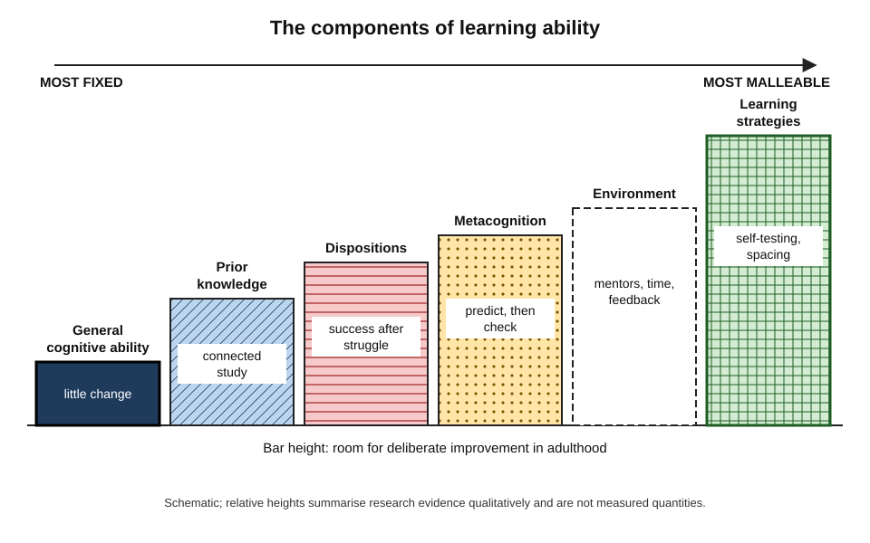
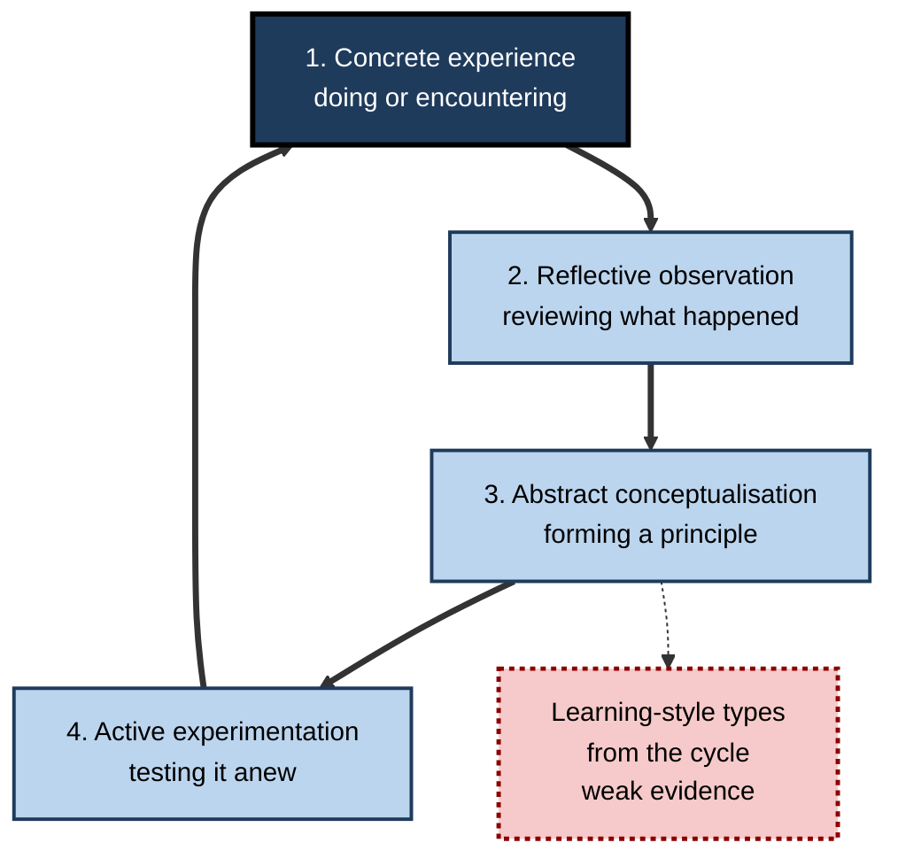
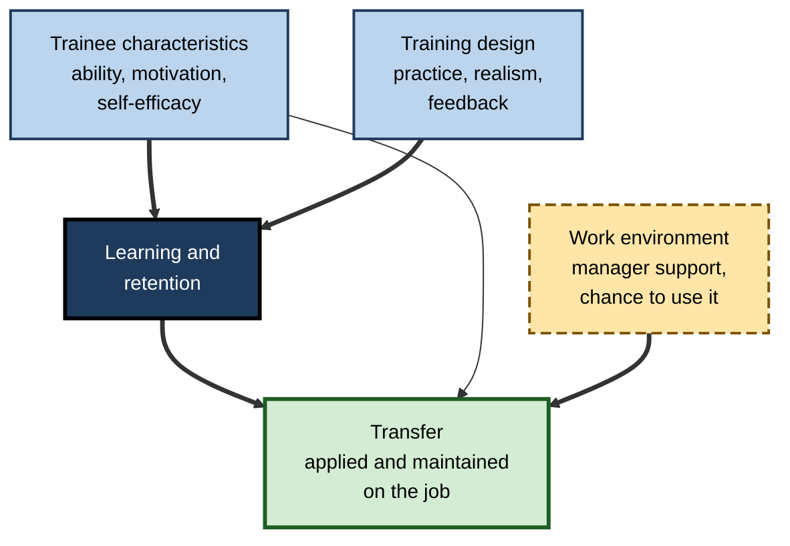
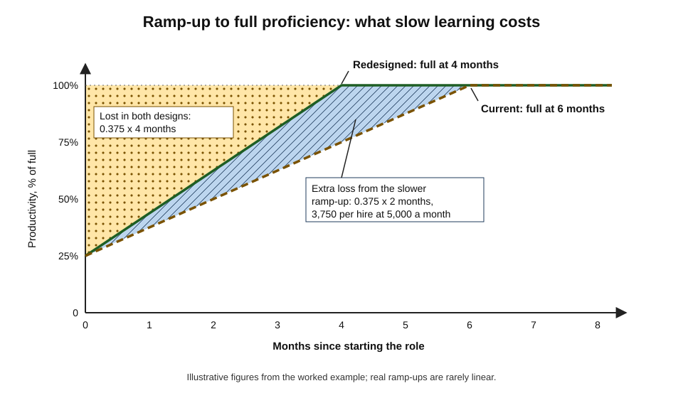
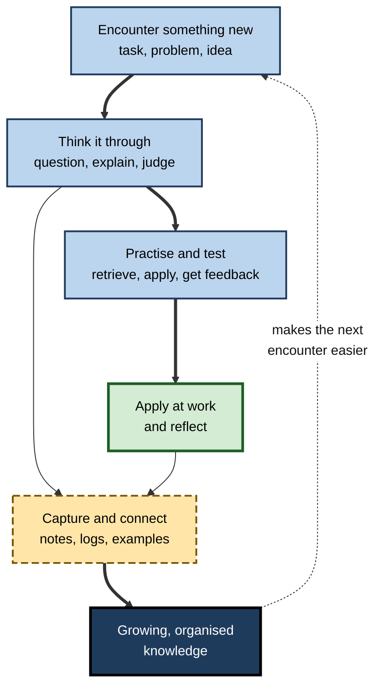

# 1.1. Learning Foundation

Two analysts join a firm in the same month and are handed the same unfamiliar analytics platform. Six weeks later one is building production dashboards; the other is still searching for basic procedures. Neither is more intelligent in any obvious way. The difference lies in **how each one learns**: how they approach new material, how they practise, how they use the people and documents around them, and how they check what they really know.

> **Definition — Learning foundation:** the knowledge, strategies, habits and dispositions that determine how quickly, durably and independently a person can acquire new capability — together with the thinking and self-organisation that make learning effective.

**Why it matters**

- Every other professional capability has to be **learned**, so learning ability sets the pace of all development.
- Working lives now span decades of changing tools, roles and industries; the capacity to **relearn** outlasts any one body of knowledge.
- Most adults were never taught how to learn; many rely on methods that feel productive but are weak.
- Organisations depend on it: onboarding, upskilling, reskilling and knowledge transfer are all learning problems.
- Learning speed has **economic value** that can be estimated — for individuals, teams and firms.

---

## Learning Ability as a Meta-Skill

### What a meta-skill is

> **Definition — Meta-skill:** a skill that governs the acquisition, use or improvement of other skills.

- A meta-skill is **higher-order**: improving it improves the rate of improvement in everything else.
- Learning ability is the clearest example.
  - *e.g.* a consultant who learns industries quickly is more valuable on every new engagement, not only one.
- It differs from domain skill in its **object**: domain skill acts on the world; learning ability acts on the person's own capability.

### The components of learning ability

Learning ability is not one trait. It combines elements that differ sharply in how far they can be changed.

- **General cognitive ability** — the capacity to reason, grasp complex ideas and learn quickly.
  - Relatively stable in adulthood; the most studied predictor of how fast people learn job knowledge.
- **Prior knowledge** — what the person already knows in and around the field.
  - The strongest single influence on how quickly new related knowledge is learned.
  - Educational psychologist **David Ausubel (1968)**: "the most important single factor influencing learning is what the learner already knows."
- **Learning strategies** — how the person studies, practises and seeks feedback.
  - Highly learnable; often the cheapest component to improve.
- **Metacognition** — monitoring and steering one's own learning.
  - Knowing what one does not yet know, and choosing what to do about it.
- **Motivation and dispositions** — curiosity, persistence, openness to feedback, tolerance of difficulty.
- **Environment** — time, access to experts, feedback, tools, psychological safety.
  - Often outside the person's control but strongly shapes what they learn.

**Figure 1.** The components of a person's learning ability, from most fixed to most malleable.

> **Key point:** the components most open to change — **strategies, metacognition, dispositions and environment** — are exactly the ones most people never deliberately work on.

### Intelligence, job knowledge and learning

- **Frank Schmidt and John Hunter's** influential meta-analyses (culminating in 1998) found general mental ability to be among the best predictors of job performance.
  - Path analyses suggested it works largely **through faster acquisition of job knowledge**.
- **Sackett and colleagues (2022)** re-examined the corrections used in these meta-analyses and concluded that the predictive validity of general mental ability had been **overestimated**; it remains a useful predictor but not a dominant one.
- **Implication:** cognitive ability matters for learning, but it leaves wide room for the learnable components.

> **Definition — Learning agility:** the willingness and ability to learn from experience and apply the lessons in new situations — a construct popularised in leadership development by **Michael Lombardo and Robert Eichinger (2000)**.

> **Watch out:** learning agility is widely used in talent assessment, but researchers (*e.g.* **DeRue, Ashford and Myers, 2012**) criticised early versions for blending speed, flexibility, personality and performance into one loose label. Treat commercial "agility scores" with caution.

| Component | How stable in adults | Main way to strengthen it | Typical professional sign |
|---|---|---|---|
| **General cognitive ability** | High | Little direct training effect | Grasps complex systems quickly |
| **Prior knowledge** | Grows steadily | Deliberate, connected study in and around the field | Learns new methods in a familiar field fast |
| **Strategies** | Low — readily changed | Learning evidence-based techniques | Self-tests, spaces practice, seeks worked examples |
| **Metacognition** | Moderate | Prediction and checking against results | Knows what they do not know |
| **Dispositions** | Moderate | Experience of success after struggle, supportive feedback | Seeks feedback, persists through confusion |
| **Environment** | Depends on role and employer | Job choice, negotiation, asking for access | Has mentors, feedback and time to learn |

---

## How Adults Learn

### Andragogy

> **Definition — Andragogy:** the art and science of helping adults learn, as distinct from pedagogy, the teaching of children.

- **The term:** first used by a German teacher, **Alexander Kapp (1833)**; revived in American adult education by **Malcolm Knowles** from the late 1960s.
- **Earlier roots:** **Eduard Lindeman, *The Meaning of Adult Education* (1926)** — adults learn best from their own situations and experience.
- **Knowles's assumptions about adult learners** (developed between 1970 and the late 1980s):
  1. **Need to know** — adults want to know why they should learn something before learning it.
  2. **Self-concept** — adults see themselves as responsible for their own decisions and resent being directed.
  3. **Experience** — adults bring a large store of experience, both a resource and a source of fixed habits.
  4. **Readiness** — adults become ready to learn what their life and work roles require.
  5. **Orientation** — adults are problem-centred rather than subject-centred.
  6. **Motivation** — the strongest motivators are internal: self-esteem, quality of life, satisfaction.

> **Mnemonic — "No Sensible Expert Rejects Obvious Motives":** Need to know, Self-concept, Experience, Readiness, Orientation, Motivation.

| Assumption | Pedagogical model | Andragogical model |
|---|---|---|
| Learner's self-concept | Dependent on the teacher | Self-directing |
| Role of experience | Little value; the teacher's experience counts | A rich resource for learning |
| Readiness to learn | When told it is required | When life or work tasks demand it |
| Orientation | Subject-centred | Problem- or task-centred |
| Motivation | External: grades, approval | Internal: competence, satisfaction |

### Critiques of andragogy

- **Theory or practice guide?**
  - Critics such as Hartree (1984) asked whether andragogy is a theory of learning, a theory of teaching or a set of good-practice principles; Knowles himself later called it a model of assumptions.
- **A continuum, not a divide.**
  - Many children are self-directed and problem-centred; many adults want direction, especially in an unfamiliar field.
  - Knowles later accepted that the two models are ends of a **continuum**, chosen by situation rather than age.
- **Cultural bias.**
  - The model assumes a Western, individualist adult; in many cultures learning is collective and respect for expert authority is valued.
- **Weak experimental support.**
  - The assumptions were derived from practice and observation; there is little direct experimental evidence that adults need different methods *because they are adults*.
- **Same cognitive architecture.**
  - Attention, working memory and long-term memory work the same way at 15 and 45; what differs is **prior knowledge, motivation, context and time**.

> **Watch out:** "adults learn differently" is true of their **situation**, not their **brain mechanisms**. An adult novice in an unfamiliar field benefits from clear structure, worked examples and guided practice just as a child does; freedom and self-direction help most once knowledge is established.

### Learning across the adult lifespan

- **Fluid intelligence** — reasoning with novel material and processing speed — tends to peak in early adulthood and decline gradually.
- **Crystallised intelligence** — accumulated knowledge and vocabulary — tends to rise or hold well into later life.
  - The distinction comes from **Raymond Cattell** and **John Horn** (1960s).
- **Practical consequences:**
  - older learners often learn new technical procedures more slowly but compensate with richer knowledge and better judgement of relevance;
  - self-paced, well-structured training reduces age differences.
- **A participation gap:** across many countries, adults with **higher** skills and qualifications take part in far more training than low-skilled adults — a Matthew effect in adult learning.

---

## Directing One's Own Learning

> **Definition — Self-directed learning:** learning in which the person takes the initiative in diagnosing needs, setting goals, finding resources, choosing strategies and evaluating outcomes, with or without help from others.

- **Allen Tough (1971), *The Adult's Learning Projects*:** interviews showed that most adults undertook **several deliberate learning projects each year**, most planned by the learners themselves rather than by teachers or institutions.
  - Formal courses were only the visible tip of adult learning.
- **D. Randy Garrison (1997):** self-directed learning combines three dimensions:
  - **self-management** — controlling the learning context and resources;
  - **self-monitoring** — checking understanding and progress;
  - **motivation** — entering and sustaining the effort.
- **Gerald Grow (1991), staged self-directed learning:** learners move through stages — dependent → interested → involved → self-directed — and the right teaching style differs at each.
  - A mismatch (a dependent learner left alone; a self-directed learner lectured) frustrates both.

> **Watch out:** self-directed does not mean **unguided**. A large body of evidence on novice learning shows that minimal-guidance discovery is less effective than explicit instruction for people who lack prior knowledge (Kirschner, Sweller and Clark, 2006). The mature self-directed learner chooses guidance deliberately — courses, mentors, worked examples — rather than avoiding it.

> **Key point:** self-direction is a **learned capability** that grows with knowledge of the field. The aim is to move along Grow's stages, not to start at the end.

---

## Learning From Experience

### Kolb's experiential learning cycle

- **Roots:** John Dewey's *Experience and Education* (1938), Kurt Lewin's action research, and Jean Piaget's developmental theory.
- **David Kolb, *Experiential Learning* (1984):** "learning is the process whereby knowledge is created through the transformation of experience."
- **Four stages:**
  1. **Concrete experience** — doing or encountering something.
  2. **Reflective observation** — reviewing what happened from several perspectives.
  3. **Abstract conceptualisation** — forming a general idea or principle.
  4. **Active experimentation** — testing the idea in a new situation, which creates new experience.

**Figure 2.** Kolb's experiential learning cycle and its contested learning-style extension.

> **Example — a project manager's overrun:** a release slips by three weeks (experience); in the retrospective she notices that every delay followed late requirement changes (reflection); she concludes that changes need a cost estimate before acceptance (concept); on the next project she introduces a change-impact step and watches its effect (experimentation).

### Critiques of the cycle

- **Stages are not neatly sequential.**
  - Real learning moves back and forth; reflection and action often happen together, as Donald Schön's idea of reflection-in-action implies.
- **The learning-style extension is weakly supported.**
  - Kolb derived four learning styles (diverging, assimilating, converging, accommodating) and a Learning Style Inventory.
  - The inventory's reliability and validity have been repeatedly questioned, and the broader claim that teaching should be matched to learning styles has **not** been supported (Pashler and colleagues, 2008).
- **Too individual.**
  - The model says little about the social, cultural and power relations in which experience happens.
  - **Peter Jarvis (1987)** showed that experience often produces **non-learning** — presumption, rejection, not considering — and that the outcome depends on the person's response.
- **Reflection is assumed, not explained.**
  - Boud, Keogh and Walker (1985) stressed that reflection needs attention to feelings and deliberate re-evaluation; it does not happen automatically.

> **Key point:** the cycle's lasting value is the claim that **experience alone is not learning** — it must be reflected on, generalised and tested. Its typology of learners is the weak part.

### Transformative learning

> **Definition — Transformative learning (Jack Mezirow, 1978 onward):** learning that changes a person's frame of reference — the assumptions through which they interpret experience — often triggered by a **disorienting dilemma**.

- *e.g.* an engineer promoted to lead a team discovers that her assumption "good work speaks for itself" fails, and rebuilds her understanding of how organisations recognise contribution.
- It is the individual counterpart of questioning governing assumptions rather than only changing actions.

---

## Learning in the Workplace

### Formal, informal and incidental learning

- **Victoria Marsick and Karen Watkins (1990)** distinguished:
  - **formal learning** — structured, institutionally sponsored, usually classroom- or course-based;
  - **informal learning** — learner-controlled, often deliberate, happening through work (asking, observing, trying);
  - **incidental learning** — a by-product of other activity, often unnoticed.
- **Michael Eraut (2004):** most professional learning is informal, arising from **challenging work**, with **support**, **feedback** and growing **confidence**; when challenge outruns support, people stop learning.
- **Stephen Billett:** workplaces differ in the **affordances** they offer for learning — access to tasks, guidance and people — and individuals differ in how they **engage** with them.

| | Formal | Informal | Incidental |
|---|---|---|---|
| Who controls it | The organisation or institution | Mainly the learner | Nobody — it is a by-product |
| Typical form | Course, programme, certification | Asking, observing, trial, reading on the job | Picking up norms, shortcuts, attitudes |
| Visibility | High — recorded and reported | Low | Very low |
| Strength | Efficient for codified knowledge | Tied to real tasks | Absorbs tacit knowledge and culture |
| Weakness | Often far from the job | Uneven, can spread errors | Can transmit bad habits unnoticed |

### Transfer of training

> **Definition — Transfer of training:** the extent to which learning from a training activity is applied on the job and maintained over time.

- **Baldwin and Ford (1988)** proposed the classic model: three inputs shape transfer —
  - **trainee characteristics** — ability, motivation, self-efficacy;
  - **training design** — practice, realism, feedback, sequencing;
  - **work environment** — support from managers and peers, opportunity to use the skill.
- **Blume and colleagues (2010)**, meta-analysis of transfer predictors:
  - cognitive ability, conscientiousness, motivation and a **supportive work environment** were among the most consistent predictors;
  - transfer was easier for closed skills (fixed procedures) than open skills (judgement, leadership).

**Figure 3.** What shapes whether training reaches the job.

> **Watch out:** the often-quoted claim that "only 10% of training transfers to the job" has **no empirical basis**. It traces to a 1982 article that offered the figure rhetorically; Ford, Yelon and Billington (2011) traced its spread and showed it had been repeated as fact for decades. Measured transfer varies widely with skill type, design and environment.

> **In practice:** the cheapest lever for transfer is usually the **manager** — a conversation before training about why it matters, and an assignment soon after that requires its use.

### Evidence that training works

- **Arthur and colleagues (2003)**, meta-analysis of organisational training: effects were generally **moderate to large** across reaction, learning, behaviour and results criteria, varying with design and evaluation method.
- **Salas and colleagues (2012)** summarised the science of training: needs analysis, practice with feedback, realistic conditions, and post-training support consistently matter more than delivery medium.

> **Watch out:** the "learning pyramid" — people remember 10% of what they read, 20% of what they hear, up to 90% of what they teach — is widely shown in training courses but has **no traceable research behind it**. It is often wrongly attributed to Edgar Dale's "cone of experience" (1946), which contained no percentages. The figures are suspiciously round and vary between versions.

---

## What Effective Adult Learners Do Differently

Studies of expert learners, self-regulated learning and high-performing professionals point to a consistent set of habits. None depends on unusual talent.

- **They start from the goal, not the material.**
  - They define what they must be able to *do*, under what conditions, before choosing resources.
  - *e.g.* "explain our pricing model to a client without notes" rather than "read the pricing documentation".
- **They connect new knowledge to old.**
  - They ask how a new idea resembles or differs from what they already know, using prior knowledge as an anchor.
  - *e.g.* a lawyer learning data-protection law maps it onto familiar concepts of consent and contract.
- **They test themselves rather than review.**
  - They attempt recall and problems before checking, and treat errors as information.
- **They spread learning out.**
  - Short, repeated sessions over weeks rather than one long immersion.
- **They seek feedback from people who can see what they cannot.**
  - They ask specific questions — "what would you have done differently in that meeting?" — rather than "how did I do?".
- **They calibrate.**
  - They predict their performance, compare with results and adjust; confidence follows evidence.
- **They choose their difficulty.**
  - They work at the edge of their ability, stepping back to worked examples when overwhelmed and forward to open problems when comfortable.
- **They manage the conditions.**
  - Protected time, limited distraction, sleep, and an environment where questions are welcome.

> **Mnemonic — "GOALS CCC":** Goal first, Old knowledge as anchor, Ask for feedback, Learn by testing, Space it out, Calibrate, Choose the difficulty, Conditions managed.

> **Key point:** these habits are the learnable core of learning ability. They turn the same hours into more durable capability — which is why two people with similar intelligence can learn at very different speeds.

---

## The Economics of Learning Speed

### Time to proficiency

> **Definition — Time to proficiency:** the time a person takes from starting a role or skill to performing it at the expected standard.

- Each day below full proficiency has a **cost**: lower output, more errors, more supervision by others.
- Faster learning therefore has measurable value — for a single hire and, multiplied, for a whole organisation.

**Figure 4.** Two ramp-up curves and the productivity lost before full proficiency.

### Worked example: the value of a faster ramp-up

- **Situation:** a firm hires 50 analysts a year; each costs 5,000 per month in salary and overheads. New analysts start at about 25% of full productivity and ramp up roughly linearly.
- **Current onboarding:** full proficiency after **6 months**. A redesigned onboarding (structured practice, worked examples, a named mentor) is expected to reach it in **4 months**.

> **Formula — Productivity lost during ramp-up (linear ramp):** average shortfall × months × monthly cost. Average shortfall = (100% − 25%) ÷ 2 = **37.5%**.

| | Current onboarding | Redesigned onboarding |
|---|---|---|
| Months to proficiency | 6 | 4 |
| Lost productivity per hire | 0.375 × 6 × 5,000 = **11,250** | 0.375 × 4 × 5,000 = **7,500** |
| Saving per hire | — | **3,750** |
| Saving for 50 hires | — | **187,500** a year |

1. Compare the saving with the redesign's cost (mentor time, design effort).
2. Add second-order effects: fewer errors, less senior time spent correcting, earlier access to harder work.
3. Test the assumption of 4 months with a pilot cohort before scaling.

> **Watch out:** the figures are illustrative. Real ramp-ups are rarely linear, and "proficiency" must be defined by delayed, unaided performance — otherwise faster ramp-up can simply mean earlier *assisted* performance.

### Learning speed and the depreciation of skills

**Study card — Deming and Noray (2020), skill change and STEM careers**

- **Data:** US job-advertisement text over time, linked to graduates' earnings.
- **Findings:**
  - skill requirements changed fastest in technology-intensive occupations;
  - graduates in applied science fields earned high premiums early, but the premium **declined** over the first decade as their initial skills became obsolete;
  - many left those occupations as their skills aged.
- **Conclusion:** in fast-changing fields the value of knowledge **depreciates**, so the ability to learn new knowledge determines long-run returns.

> **Definition — Skill depreciation:** the loss of economic value of a skill over time, through obsolescence or disuse.

- **At organisational level — absorptive capacity:** **Wesley Cohen and Daniel Levinthal (1990)** argued that a firm's ability to recognise, assimilate and apply new external knowledge depends on its **existing related knowledge**.
  - Firms that keep learning find it cheaper to learn the next thing; those that stop fall progressively behind.

> **Key point:** learning speed matters most where knowledge depreciates fastest. In a stable field, accumulated knowledge carries a career; in a fast field, **the rate of renewal** does.

---

## Learning's Companions: Thinking and Organising

### Thinking and learning are inseparable

- **Knowledge enables thinking.** Reasoning, criticism and problem solving operate on what a person knows; with little knowledge, thinking skills have little to work with.
- **Thinking creates learning.** Cognitive scientist **Daniel Willingham** summarised a large body of evidence in the phrase "**memory is the residue of thought**": people remember what they think about.
  - *e.g.* an analyst who explains *why* a metric moved remembers the business mechanism; one who copies the number into a report does not.
- **Critical thinking protects learning.** Judging sources and evidence prevents learning false things efficiently.

### Organising time, attention and knowledge

- **Time and attention** are the raw material of learning; without protected time, learning is crowded out by urgent work.
- **Personal knowledge management** — capturing, organising and retrieving what one has learned — turns isolated lessons into a reusable stock.
  - *e.g.* a lawyer's annotated library of past clauses and the reasons for them; an engineer's decision log.
- **At organisational scale**, **Ikujiro Nonaka and Hirotaka Takeuchi (1995)** described knowledge creation as continual conversion between **tacit** and **explicit** knowledge — through shared experience, articulation, combination and internalisation (the **SECI** model).

> **Definition — Personal knowledge management:** the practices a person uses to capture, organise, connect and retrieve their own knowledge and information.

**Figure 5.** Learning, thinking and knowledge management working as one loop.

> **Key point:** learning, thinking and organising are not three separate skill sets. A professional who learns without thinking memorises without understanding; one who thinks without capturing relearns the same lessons; one who captures without practising builds an archive, not a capability.

---

## Learning When AI Can Explain Anything

- **New opportunity:** AI systems can explain, quiz, generate examples and give feedback on demand — capabilities once limited to a personal tutor.
  - A 2025 randomised trial in a Harvard introductory physics course found that students using an AI tutor designed around learning-science principles learned more, in less time, than in an already well-designed active-learning class.
- **New risk:** when AI supplies answers, the learner can skip the effortful thinking that produces durable learning — performance rises while independent capability does not.
- **What decides the outcome:** whether the tool is used to **provoke** thinking (hints, questions, critique, retrieval practice) or to **replace** it (finished answers).

| Use of AI | Effect on learning | Example |
|---|---|---|
| **Answer engine** | Fast task completion; little durable learning | Asking for the finished SQL query |
| **Explainer** | Helpful if followed by the learner's own attempt | Asking why a join returns duplicates, then fixing it unaided |
| **Questioner and tester** | Strengthens memory and exposes gaps | Asking to be quizzed on yesterday's material |
| **Critic** | Improves judgement through feedback | Asking for weaknesses in one's own draft argument |
| **Simulator** | Safe practice of rare or risky situations | Rehearsing a difficult client conversation |

> **In practice:** a simple rule — **attempt first, then ask**. The attempt does the learning; the AI corrects and extends it.

---

## Case Study: An Accountant Learns to Become an Analyst

- **Situation:** Priya, 38, a management accountant with fourteen years' experience, wants to move into a financial data-analyst role as her firm automates routine reporting.
- **Problem:** her first attempt — evenings watching online video courses — produced little. After three months she could follow tutorials but not write an analysis from a blank screen.
- **Diagnosis:**
  1. **Strategy:** passive watching, no retrieval or practice without guidance.
  2. **Self-direction:** she had chosen freedom too early; as a novice in programming she needed structure (Grow's "dependent" stage).
  3. **Transfer:** tutorial datasets bore no resemblance to the firm's data; she never used the skill at work.
  4. **Strength unused:** her deep knowledge of the firm's cost structures — prior knowledge that could anchor new learning — was ignored.
- **Actions:**
  1. Joined a structured course with graded exercises, then **re-did each exercise a week later without notes**.
  2. Agreed with her manager to automate one real monthly report using the new skills, with a data engineer reviewing her code fortnightly.
  3. Kept a **learning log** of errors and fixes, reviewed every Sunday.
  4. Used an AI assistant only **after** attempting each problem, asking it to critique her solution.
- **Result:** within eight months the automated report was in production; she moved into an analyst role a year later, valued for combining analysis with financial insight few analysts had.
- **Side effects:** progress felt slower in the first weeks of the new approach — the self-testing exposed how little the videos had taught.
- **Lesson:** the learning foundation is a set of **choices** — strategy, structure, transfer to real work, use of prior knowledge and use of tools — and changing them changed the outcome more than additional hours did.

---

## Open Questions

- **Can learning ability itself be trained in a way that transfers?**
  - Strategy training clearly helps; whether it produces a general, lasting increase in learning speed across domains is less clear.
- **What is the best balance between guidance and self-direction for adults?**
  - The point at which a learner benefits from moving from structure to autonomy is hard to judge and varies by field.
- **How should organisations measure learning speed?**
  - Time to proficiency is intuitive, but defining "proficiency" reliably across roles is difficult.
- **Will AI tutors close or widen the adult-learning participation gap?**
  - Cheap tutoring could help low-skilled adults most — or be used mainly by those who already learn the most.
- **How much should be learned versus looked up?**
  - As tools grow more capable, the knowledge a professional must hold internally is being renegotiated field by field.

---

## Summary

- The **learning foundation** is the capability to acquire new capability quickly, durably and independently, supported by thinking and self-organisation; it is a **meta-skill**.
- Learning ability combines **cognitive ability, prior knowledge, strategies, metacognition, dispositions and environment**; the most malleable components are the least deliberately developed.
- **Andragogy** (Knowles) describes adults as self-directing, experienced, problem-centred and internally motivated; critics see a continuum rather than a divide, cultural bias and weak experimental support — adults share children's cognitive architecture.
- **Self-directed learning** (Tough, Garrison, Grow) is common and valuable but grows with knowledge; novices need guidance.
- **Kolb's cycle** — experience, reflection, conceptualisation, experimentation — captures that experience must be processed to become learning; its **learning-style** extension is weakly supported. Jarvis showed experience can produce non-learning; Mezirow described **transformative** learning.
- Most workplace learning is **informal**; **transfer of training** depends on trainee, design and environment; the "10% transfer" figure is a myth.
- Learning speed has **economic value** through time to proficiency, skill depreciation and organisational **absorptive capacity**.
- **Thinking** and **knowledge management** are learning's companions: memory is the residue of thought, and captured knowledge compounds.
- AI can **provoke** or **replace** thinking; attempt first, then ask.

---

## Self-Check

1. What makes learning ability a meta-skill?
2. Name the six components of learning ability and identify which are most and least malleable.
3. What did Sackett and colleagues (2022) conclude about general mental ability, and why does it matter for learning?
4. State Knowles's six assumptions of andragogy.
5. Give three critiques of andragogy and explain which one undermines the claim that adults need fundamentally different teaching methods.
6. Explain Grow's staged model of self-directed learning and the problem of mismatch.
7. Describe Kolb's four stages with a workplace example.
8. Which part of Kolb's theory is best supported and which is weakest? Explain.
9. Distinguish formal, informal and incidental learning.
10. Describe Baldwin and Ford's transfer model and name its most practical lever.
11. Why is the "10% transfer" figure unreliable?
12. A firm's new hires take 9 months to reach proficiency, starting at 20% productivity and costing 6,000 a month. Estimate the lost productivity per hire under a linear ramp, and the saving if this falls to 6 months.
13. Explain why learning speed matters more in some fields than others, using Deming and Noray (2020).
14. A colleague says AI tutors make learning techniques obsolete. Respond using evidence.

### Answer Key

1. It governs the acquisition of all other skills; improving it raises the rate of improvement in every domain, and it acts on the person's own capability rather than directly on the world.
2. General cognitive ability, prior knowledge, strategies, metacognition, dispositions, environment. Strategies are most malleable; general cognitive ability is least.
3. That earlier meta-analyses overestimated its predictive validity because of questionable corrections. It remains useful but not dominant, leaving more room for learnable components — strategies, knowledge, environment — to explain how fast people learn.
4. Need to know; self-concept (self-directing); experience as resource; readiness tied to life roles; problem-centred orientation; internal motivation.
5. Unclear status as theory or practice guide; a continuum rather than an adult/child divide; cultural bias; weak experimental support; same cognitive architecture. The last undermines the claim most directly: memory and attention work the same way, so what differs is knowledge, motivation and context, not the mechanism of learning.
6. Learners move from dependent to interested, involved and self-directed; teaching should shift from directive to delegating. A mismatch — leaving a dependent learner alone or lecturing a self-directed one — frustrates the learner and wastes effort.
7. Concrete experience (a project overruns), reflective observation (noticing delays follow late changes), abstract conceptualisation (changes need impact estimates), active experimentation (introducing a change-impact step next time).
8. Best supported: the claim that experience must be reflected on and generalised to become learning. Weakest: the learning-style typology and inventory, whose psychometrics are questioned and whose matching claim lacks support.
9. Formal: structured and institution-sponsored. Informal: learner-controlled learning through work. Incidental: an unnoticed by-product of other activity.
10. Trainee characteristics, training design and work environment shape learning and transfer. The most practical lever is the work environment, especially manager support and an early opportunity to use the skill.
11. It originated as a rhetorical figure in a 1982 article without data and was repeated as fact; measured transfer varies widely.
12. Average shortfall = (100 − 20) ÷ 2 = 40%. 9 months: 0.40 × 9 × 6,000 = 21,600. 6 months: 0.40 × 6 × 6,000 = 14,400. Saving = 7,200 per hire — before counting fewer errors and less senior time.
13. Skills in technology-intensive fields change fastest, so early premiums decline as knowledge becomes obsolete; long-run returns depend on renewing knowledge, so learning speed determines value. In slower fields, accumulated knowledge keeps value longer.
14. Evidence shows AI tutors help when designed to make learners think — hints, questions, retrieval — and can harm independent capability when they supply answers. Learning techniques such as attempting first, self-testing and spacing determine which effect occurs, so they become more important, not obsolete.

---

## Glossary

| Term | Meaning |
|---|---|
| Absorptive capacity | A firm's ability to recognise, assimilate and apply new external knowledge, based on related existing knowledge. |
| Andragogy | The art and science of helping adults learn. |
| Concrete experience | The first stage of Kolb's cycle: directly doing or encountering something. |
| Crystallised intelligence | Accumulated knowledge and vocabulary, which tends to hold or grow with age. |
| Experiential learning | Learning through the transformation of experience by reflection, conceptualisation and experimentation. |
| Fluid intelligence | Reasoning with novel material and processing speed, which tends to decline gradually after early adulthood. |
| Formal learning | Structured, institutionally sponsored learning. |
| Incidental learning | Learning as an unnoticed by-product of other activity. |
| Informal learning | Learner-controlled learning through work and everyday activity. |
| Learning agility | Willingness and ability to learn from experience and apply it in new situations. |
| Learning foundation | The knowledge, strategies, habits and dispositions that determine how well a person acquires new capability. |
| Meta-skill | A skill that governs the acquisition or improvement of other skills. |
| Metacognition | Monitoring and steering one's own thinking and learning. |
| Personal knowledge management | Practices for capturing, organising and retrieving one's own knowledge. |
| SECI model | Nonaka and Takeuchi's model of knowledge creation through tacit–explicit conversion. |
| Self-directed learning | Learning in which the learner takes the initiative in planning, resourcing and evaluating it. |
| Skill depreciation | Loss of a skill's economic value through obsolescence or disuse. |
| Time to proficiency | Time from starting a role or skill to performing it at the expected standard. |
| Transfer of training | Application and maintenance on the job of what was learned in training. |
| Transformative learning | Learning that changes the frame of reference through which experience is interpreted. |
