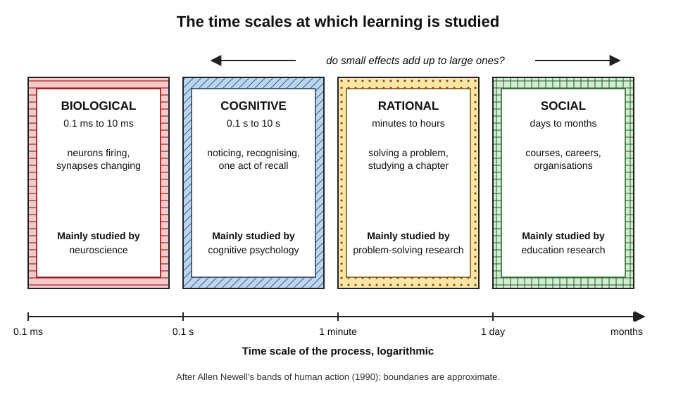
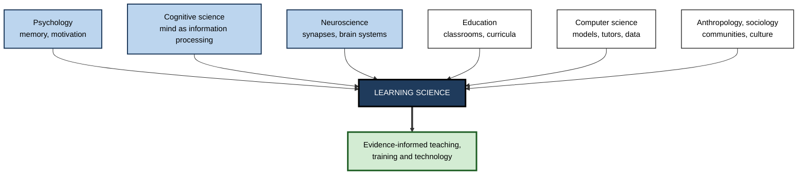
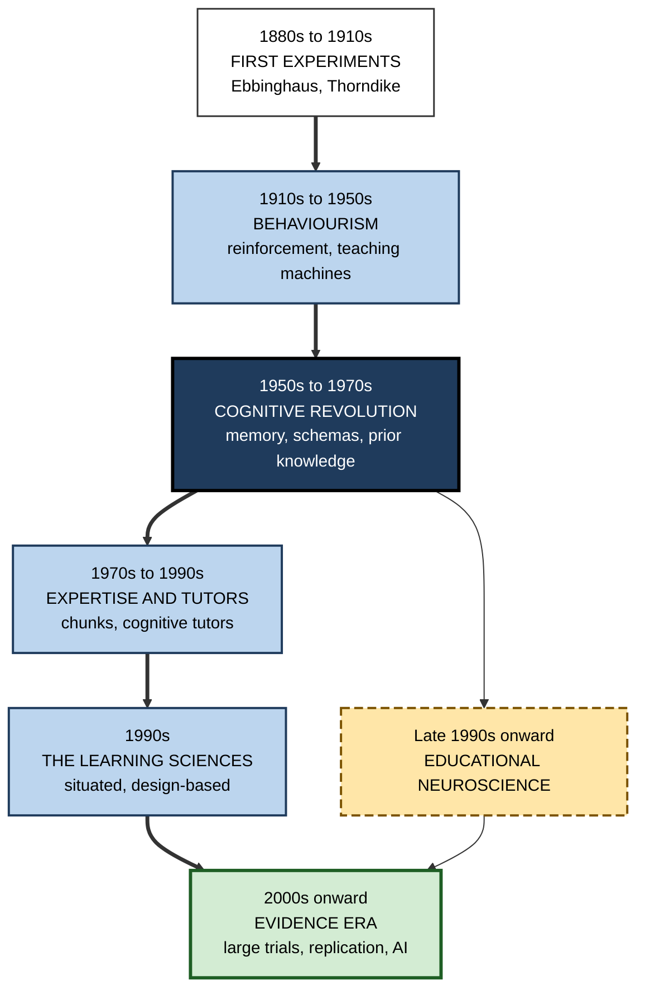
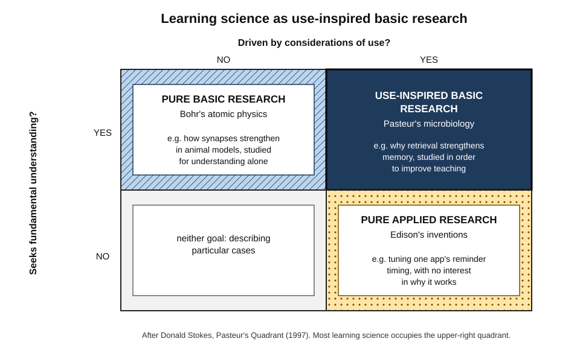
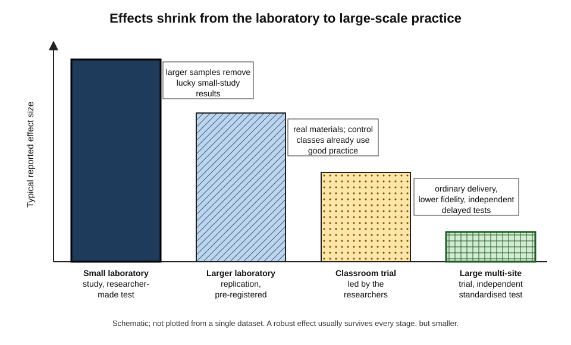
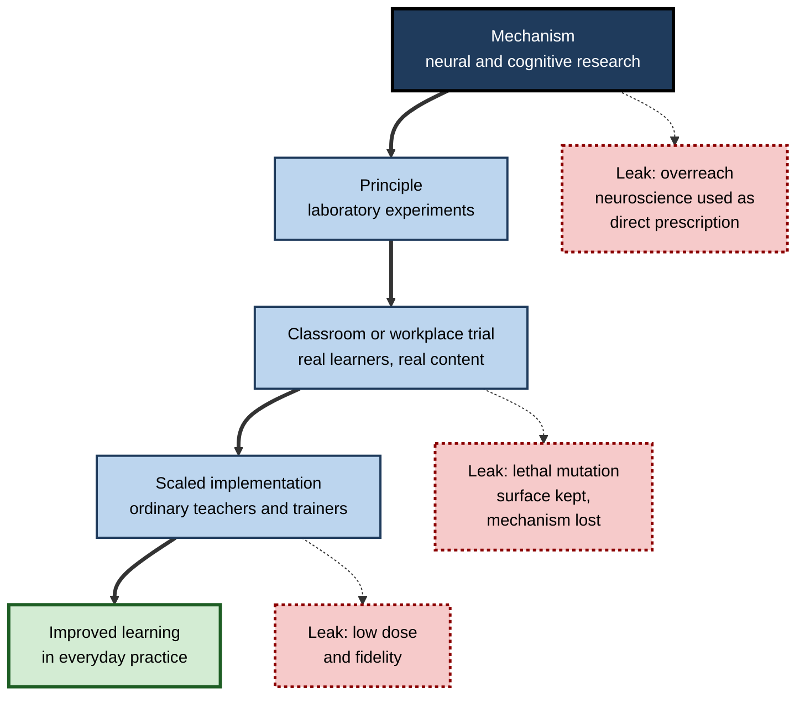

# 1.1.1. Learning Science & Cognition

A teacher insists that pupils learn best in their preferred "style". A training vendor promises that its app "rewires the brain". A product team claims its new quiz feature doubles retention. Each is a claim about how people learn — and each can be checked. **Learning science** is the discipline that does the checking: it studies how minds and brains acquire, keep and use knowledge, and tests which ways of teaching and studying actually work.

> **Definition — Learning science:** the interdisciplinary scientific study of how people learn and how learning can be supported, using empirical methods drawn from psychology, cognitive science, neuroscience, education and computer science.

**Why it matters**

- Billions are spent each year on teaching, training and educational technology; learning science is how that spending can be **judged by evidence** rather than fashion.
- Many of its most robust findings are **counter-intuitive** — learners and teachers routinely misjudge what works.
- It gives professionals a way to **evaluate claims**: about study methods, training products, AI tutors and "brain-based" programmes.
- Its own history of **failed replications and neuromyths** teaches how to weigh evidence in any field.

---

## What Learning Science Studies

### The four core questions

- **Mechanism — how does learning happen?**
  - Which mental and neural processes create, strengthen, organise and retrieve knowledge.
  - *e.g.* why recalling a fact strengthens memory more than re-reading it.
- **Conditions — what helps or hinders it?**
  - Timing, sequencing, feedback, motivation, emotion, sleep, prior knowledge.
  - *e.g.* whether practice spread over days beats practice crammed into one evening.
- **Design — how should instruction and environments be built?**
  - Turning mechanisms into materials, lessons, software and training programmes.
  - *e.g.* how to sequence worked examples and problems for novice programmers.
- **Measurement — how can learning be detected and quantified?**
  - Assessments, effect sizes, learning analytics.
  - *e.g.* telling durable learning apart from short-lived performance.

> **Definition — Cognition:** the mental processes by which knowledge is acquired, represented, transformed and used — perceiving, attending, remembering, reasoning, deciding.

> **Key point:** cognition is the **machinery**; learning is the **lasting change** in that machinery's knowledge and skill. Learning science studies both, and how to influence the second through the first.

### Many time scales, one subject

Learning happens at very different speeds, and each speed has its own science.

- **Allen Newell (1990)** arranged human activity into **bands** by time scale:
  - **biological band** — fractions of a millisecond to around ten milliseconds: neurons and synapses;
  - **cognitive band** — about a tenth of a second to ten seconds: attention, recognition, a single mental operation;
  - **rational band** — minutes to hours: solving a problem, studying a chapter;
  - **social band** — days to months and beyond: courses, careers, organisations.
- **John Anderson (2002)** asked whether effects at the small scale matter at the educational scale — spanning **seven orders of magnitude**.
  - His answer: they can, because educational outcomes are built from very many small cognitive steps; but the link must be demonstrated, not assumed.

**Figure 1.** The time scales at which learning is studied.

> **Watch out:** a finding at one scale does not automatically prescribe action at another. A change in synaptic strength measured in milliseconds does not by itself say how to design a three-month course.

---

## An Interdisciplinary Field

### The contributing disciplines

- **Psychology** — experimental study of memory, learning and motivation since the 19th century.
- **Cognitive science** — the study of mind as information processing, uniting psychology, linguistics, philosophy, AI and neuroscience.
- **Neuroscience** — the biological basis of learning: synapses, brain systems, plasticity, sleep.
- **Education** — curricula, classrooms, teachers, assessment and the realities of institutions.
- **Computer science** — models of learning, intelligent tutoring systems, learning analytics, and now AI tutors.
- **Anthropology and sociology** — learning as participation in communities and cultures.

| Discipline | Typical question | Typical method | Characteristic blind spot |
|---|---|---|---|
| **Cognitive psychology** | Which mental processes improve retention and transfer? | Controlled laboratory experiments | Short tasks, artificial materials, student samples |
| **Neuroscience** | What changes in the brain when people learn? | Neuroimaging, electrophysiology, animal studies | Rarely gives direct instructional prescriptions |
| **Education research** | Does this approach work in real classrooms? | Field trials, observation, design studies | Hard to isolate causes; context-dependent |
| **Computer science** | Can learning be modelled, predicted and personalised? | Computational models, platform data, A/B tests | Optimises what is measurable, not always what matters |
| **Sociocultural research** | How does learning depend on community and culture? | Ethnography, discourse analysis | Weak on generalisable causal claims |

**Figure 2.** The disciplines that converge in learning science.

> **Definition — The learning sciences:** in a narrower sense, the specific interdisciplinary field that took shape in the early 1990s around the study of learning in real settings, design-based research and technology — distinct from, but overlapping with, the experimental psychology of learning.

> **Remember:** "learning science" is used broadly for all scientific study of learning; "the learning sciences" often names the 1990s field. Both meanings are common, so check which is meant.

---

## A Short History

### Before the science: philosophy and tradition

- Ideas about learning are ancient — Plato on recollection, Aristotle on association, medieval memory arts.
- Teaching followed **tradition**: methods persisted because they were familiar, not because they were tested.

### The first experiments (1880s–1910s)

- **Hermann Ebbinghaus (1885)** — the first systematic experiments on memory and forgetting, using himself as subject.
- **William James, *Talks to Teachers on Psychology* (1899)** — warned that psychology is a science and teaching an art; science sets limits, but does not dictate methods.
- **Edward Thorndike** — the **law of effect** (responses followed by satisfaction are strengthened) and *Educational Psychology* (1903), founding the field as an experimental discipline.

### Behaviourism (1910s–1950s)

- **John B. Watson (1913)** — psychology should study only observable behaviour.
- **B. F. Skinner** — operant conditioning; in "The Science of Learning and the Art of Teaching" (1954) he proposed **teaching machines** that broke material into small steps with immediate reinforcement.
  - Led to **programmed instruction** in the 1950s–60s — a direct ancestor of adaptive e-learning.
- **Legacy:** precise measurement of behaviour, the power of feedback and reinforcement, and the idea that instruction can be engineered.
- **Limit:** little to say about understanding, meaning, language or reasoning.

### The cognitive revolution (1950s–1970s)

- **1956** — a landmark year: George Miller's paper on the limited capacity of short-term memory ("the magical number seven, plus or minus two"); Allen Newell and Herbert Simon's early programs that reasoned; Noam Chomsky's work on language.
- **Chomsky's 1959 review** of Skinner's book on verbal behaviour argued that language could not be explained by reinforcement alone.
- **Ulric Neisser, *Cognitive Psychology* (1967)** — named and consolidated the new field.
- **Rediscovered earlier work:**
  - **Frederic Bartlett (1932)** — memory as reconstruction through **schemas**;
  - **Jean Piaget** — children actively construct knowledge in stages;
  - **Lev Vygotsky** (translated into English from the 1960s) — learning through social interaction and the **zone of proximal development**.
- **David Ausubel (1968)** — "the most important single factor influencing learning is what the learner already knows."

### Expertise, tutoring and computers (1970s–1990s)

- **Chase and Simon (1973)** — chess masters recall meaningful board positions far better than novices but not random ones: expertise is **organised knowledge (chunks)**, not better raw memory.
- **Chi, Feltovich and Glaser (1981)** — physics experts sort problems by deep principles (conservation of energy); novices by surface features (inclined planes).
- **Benjamin Bloom (1984), the "2 sigma problem"** — reported that one-to-one tutoring combined with mastery learning raised achievement by about two standard deviations over conventional classes, and challenged researchers to match it at scale.
- **John Anderson's** cognitive theory and **cognitive tutors** (1980s–90s) — software that modelled each step of a student's problem solving and gave targeted feedback.

**Study card — VanLehn (2011), how effective is tutoring?**

- **Question:** do human tutors and intelligent tutoring systems approach Bloom's two-sigma effect?
- **Method:** meta-analytic review comparing no tutoring, answer-based computer tutoring, step-based tutoring systems and human tutors.
- **Findings:**
  - human tutoring produced a large effect, but **well below two standard deviations**;
  - step-based tutoring systems were **nearly as effective as human tutors**;
  - systems that only checked final answers were much weaker.
- **Conclusion:** the two-sigma figure was an outlier; the **granularity of feedback** — step by step — matters more than whether the tutor is human.

### The learning sciences (1990s)

- **Situated cognition — Brown, Collins and Duguid (1989):** knowledge is tied to the activity and context in which it is learned.
- **Design experiments — Ann Brown (1992) and Allan Collins (1992):** studying learning by designing and iteratively refining interventions in real classrooms.
- **Institutionalisation:** the *Journal of the Learning Sciences* was founded in **1991**; the International Society of the Learning Sciences in **2002**.
- **Synthesis — *How People Learn* (US National Research Council, 2000):** three key findings —
  1. learners come with **preconceptions** that must be engaged;
  2. competence needs **factual knowledge organised in a conceptual framework**;
  3. a **metacognitive** approach helps learners take control of their learning.
  - A follow-up volume (2018) extended the synthesis to culture, motivation, lifelong learning and technology.

### Educational neuroscience (late 1990s onward)

- The 1990s were declared the "Decade of the Brain" in the United States; enthusiasm for applying neuroscience to schooling grew.
- **John Bruer (1997), "Education and the brain: a bridge too far"** — argued that neuroscience could not yet inform teaching directly; the bridge must pass through **cognitive psychology**.
- **Mind, Brain and Education** emerged as an organised field in the 2000s, with its own society and journal (2007).

### The evidence era (2000s onward)

- **Government evidence bodies:** the US Institute of Education Sciences and its What Works Clearinghouse (2002); England's Education Endowment Foundation (2011).
- **Large randomised trials** in schools became common — and frequently found **small effects**.
- **The replication crisis** (2010s) forced stricter standards across psychology.

**Figure 3.** Major phases in the history of learning science.

> **Key point:** each phase **added** a lens rather than erasing the last. Behaviourism's feedback, cognitivism's memory and schemas, the learning sciences' context and neuroscience's mechanisms all survive in current practice.

---

## How Learning Science Finds Things Out

### Use-inspired basic research

- **Donald Stokes, *Pasteur's Quadrant* (1997):** research can seek fundamental understanding, practical use, or **both**.
  - Niels Bohr's atomic physics — pure understanding.
  - Thomas Edison's inventions — pure application.
  - Louis Pasteur's microbiology — understanding pursued **for** use.
- Learning science sits largely in **Pasteur's quadrant**: it asks how memory works *in order to* improve teaching.

**Figure 4.** Learning science as use-inspired basic research.

### The main methods

- **Laboratory experiments** — random assignment to conditions, controlled materials, tests after a delay.
  - The source of most mechanisms: testing, spacing, worked examples.
- **Classroom and workplace randomised controlled trials** — the same logic in real courses.
- **Quasi-experiments** — comparing groups not randomly assigned (*e.g.* two schools, two cohorts).
- **Design-based research** — iterative cycles of designing, testing and refining an intervention in context.
- **Meta-analysis** — statistical synthesis of many studies into an average effect and its variation.
- **Neuroimaging and neural recording** — fMRI, EEG and related methods; animal studies of synaptic change.
- **Learning analytics and educational data mining** — patterns in data from learning platforms (dedicated conferences from 2008 and 2011).
- **Computational modelling** — simulations of memory and learning that make precise predictions.

> **Definition — Randomised controlled trial (RCT):** an experiment in which chance decides who receives which condition, so that differences in outcome can be attributed to the condition.

> **Definition — Effect size:** a standardised measure of how large a difference is, often expressed in standard-deviation units (Cohen's *d*, Hedges' *g*).

| Method | Main strength | Main weakness | Best question it answers |
|---|---|---|---|
| **Laboratory experiment** | Clear cause and effect | Artificial tasks and short delays | Does this mechanism exist? |
| **Classroom RCT** | Realistic, causal | Expensive; effects diluted by implementation | Does it work at scale in practice? |
| **Design-based research** | Rich, practical, adaptive | Hard to generalise; many changes at once | How can it be made to work here? |
| **Meta-analysis** | Overall picture and variation | Garbage in, garbage out; mixes unlike studies | How large and how variable is the effect? |
| **Neuroimaging** | Reveals biological mechanism | Indirect; small samples; rarely prescriptive | What happens in the brain? |
| **Learning analytics** | Huge real-world samples | Correlational; limited to logged behaviour | What patterns predict success? |

### A landmark synthesis built from these methods

**Study card — Dunlosky and colleagues (2013), ten learning techniques**

- **Aim:** rate the usefulness of ten common study techniques for learners.
- **Method:** review of the experimental literature on each technique, judged on generality across learners, materials, tasks and settings.
- **Ratings:**
  - **high utility** — practice testing, distributed (spaced) practice;
  - **moderate utility** — elaborative interrogation, self-explanation, interleaved practice;
  - **low utility** — summarisation, highlighting, keyword mnemonic, imagery for text, re-reading.
- **Conclusion:** the most popular techniques among students were among the least effective.
- **Caveat:** "low utility" means weak or narrow evidence, not that a technique never helps.

---

## Evidence Standards and the Replication Crisis

### The crisis

> **Definition — Replication:** repeating a study, ideally with a larger sample and a pre-specified plan, to see whether its result holds.

- **Open Science Collaboration (2015):** 100 published psychology studies were repeated; only about **36%** of replications produced statistically significant results, and effects were on average about half the original size.
- **Education research** had published few replications at all: Makel and Plucker (2014) found replications made up a tiny fraction of articles in leading education journals — well under 1%.
- **Causes:** small samples, flexible analysis ("p-hacking"), selective publication of positive results, and incentives to report novel findings.

> **Definition — Pre-registration:** publicly recording hypotheses, design and analysis plan before collecting data, so that results cannot be shaped after the fact.

### What survived and what shrank

- **Robust** — replicated across labs, materials and populations, including classrooms:
  - the **testing effect** (retrieval practice), the **spacing effect**, the **worked-example effect** for novices, the benefit of **prior knowledge**.
- **Smaller or narrower than first claimed:**
  - **growth-mindset interventions** — a large meta-analysis (Sisk and colleagues, 2018) found weak average effects; a national US study (Yeager and colleagues, 2019) found a small benefit concentrated among lower-achieving students in supportive schools.
- **Largely failed:**
  - **ego depletion** — the idea that self-control draws on a limited resource; a 23-laboratory replication (Hagger and colleagues, 2016) found an effect close to zero.

### How large is "large" in education?

**Study card — Lortie-Forgues and Inglis (2019), large education trials**

- **Data:** 141 large randomised trials commissioned by the Education Endowment Foundation in England and by the evaluation arm of the US Institute of Education Sciences.
- **Finding:** the average effect was about **0.06 standard deviations**, and many trials were too imprecise to tell a small effect from none.
- **Interpretation:** under realistic conditions, with rigorous designs and standardised tests, educational effects are typically **small**.

- **Matthew Kraft (2020)** proposed benchmarks for causal studies with standardised achievement outcomes: below about 0.05 small, 0.05–0.20 medium, above 0.20 large — much lower than Jacob Cohen's general rule of thumb (0.2 small, 0.5 medium, 0.8 large).
- **Cheung and Slavin (2016)** showed that effect sizes are systematically **larger** in small studies, quasi-experiments and studies using **researcher-made tests**.

| Feature of a study | Tends to inflate the effect size | Tends to give a realistic estimate |
|---|---|---|
| **Sample** | Small, single site | Large, many sites |
| **Design** | Quasi-experiment, no control | Randomised with active control group |
| **Outcome measure** | Researcher-made test closely aligned to the intervention | Standardised or independent measure |
| **Delivery** | Researchers deliver it themselves | Ordinary teachers or trainers deliver it |
| **Timing** | Immediate post-test | Delayed test, weeks or months later |
| **Reporting** | Analysis chosen after seeing data | Pre-registered plan, published regardless of result |

**Figure 5.** Effects tend to shrink as evidence moves from the laboratory to large-scale practice.

> **Watch out:** league tables that rank teaching influences by average effect size — most famously **John Hattie's *Visible Learning* (2009)**, which synthesised hundreds of meta-analyses and proposed 0.40 as a "hinge point" — are influential but **contested**. Critics argue that effect sizes from studies with different designs, measures and populations cannot be meaningfully averaged or ranked.

### Worked example: comparing two interventions

- **Situation:** a training director must choose between two interventions for new analysts, each claiming evidence.

| | Intervention A: "immersive simulation" | Intervention B: spaced retrieval quizzes |
|---|---|---|
| Reported effect | d = 0.45 | d = 0.08 |
| Evidence | One study, 40 learners, vendor-run | Pre-registered RCT, 3,000 learners, many sites |
| Outcome measure | Vendor's own test, given immediately | Independent test, eight weeks later |
| Cost per learner | 400 | 20 |

1. **Discount A** for small sample, vendor delivery, aligned test and immediate timing — its realistic effect is likely far smaller than 0.45, possibly near zero.
2. **Accept B** largely at face value — by Kraft's benchmarks 0.08 is a medium effect for a rigorous study.
3. **Compare cost-effectiveness:** B delivers 0.08 ÷ 20 = **0.004 SD per unit of cost**; A would need a true effect of 0.004 × 400 = **1.6 SD** to match — implausibly large.
4. **Decision:** adopt B; if A is attractive for other reasons, pilot it with a delayed, independent measure.

> **Formula — Cost-effectiveness:** effect size ÷ cost per learner. Example: 0.08 ÷ 20 = 0.004 SD per unit; 0.45 ÷ 400 ≈ 0.001 SD per unit.

> **Remember:** a small, honest effect at low cost usually beats a large, fragile effect at high cost.

---

## The Translation Gap

### From laboratory to practice

> **Definition — Translation gap:** the loss of effectiveness — or of fidelity — when a research finding is turned into real-world practice.

- **Why effects are lost in translation:**
  - **the comparison changes** — real "control" classes already use some effective practices;
  - **dose and fidelity fall** — busy teachers and trainers implement partially;
  - **materials and learners differ** — findings from undergraduates and word lists meet real curricula and diverse adults;
  - **the principle mutates** — Ann Brown called implementations that keep the surface but lose the essential mechanism "**lethal mutations**".
    - *e.g.* "retrieval practice" turned into trivial multiple-choice recall of exact wording; "active learning" turned into group work without thinking.

**Figure 6.** The pipeline from mechanism to practice and where it leaks.

### Neuromyths

> **Definition — Neuromyth:** a misconception about the brain, often a distortion of a real finding, used to justify educational practices.

**Study card — Dekker and colleagues (2012), teachers and neuromyths**

- **Design:** survey of teachers in the United Kingdom and the Netherlands interested in neuroscience.
- **Findings:**
  - on average, teachers endorsed about **half** of the neuromyths presented;
  - learning-styles and "brain-training" myths were among the most widely believed;
  - teachers with **more general knowledge of the brain** were *more* likely, not less, to believe some myths.
- **Conclusion:** enthusiasm and partial knowledge make people vulnerable; knowing facts about the brain is not the same as knowing how to evaluate educational claims.

- **The seductive allure of neuroscience — Weisberg and colleagues (2008):** non-experts rated bad psychological explanations as more satisfying when irrelevant neuroscience language was added.

| Neuromyth | Grain of truth | What the evidence shows |
|---|---|---|
| **Teaching to learning styles improves learning** | People have preferences for how they receive information | Matching instruction to preferred style does not improve outcomes (Pashler and colleagues, 2008) |
| **People are "left-brained" or "right-brained"** | Some functions are lateralised, such as much of language | Both hemispheres work together in almost all complex tasks; no evidence for brain-dominance types |
| **People use only 10% of their brains** | Not all neurons fire at once | Imaging shows activity throughout the brain; no large unused region exists |
| **Listening to Mozart makes people smarter** | A 1993 study reported a brief spatial-task boost | The effect was small, short-lived and poorly replicated; it reflects arousal and mood, not intelligence |
| **Brain-training games raise general intelligence** | Players improve on the trained games | Little or no transfer to untrained tasks or general ability |
| **Learning ends with critical periods in childhood** | Some systems, such as early vision, have sensitive periods | The adult brain remains plastic; most professional learning is not time-limited |

> **Watch out:** debunking can overshoot. Real neuroscience findings — on sleep and memory consolidation, on the brain's lifelong plasticity — are relevant to learning; the error is leaping from a brain fact to a teaching rule without behavioural evidence.

---

## How Practice Uses Learning Science

### Instructional design and learning engineering

- **Instructional design** — the systematic design of instruction, from needs analysis to evaluation.
  - **Robert Gagné's** "conditions of learning" (1965) and nine events of instruction tied design to cognitive processes.
  - **Richard Mayer's** multimedia principles and **John Sweller's** cognitive load theory gave design rules tested by experiment.
- **Learning engineering** — **Herbert Simon (1967)** proposed that universities should employ "learning engineers" who apply learning science to course design.
  - Revived from the late 2010s as a profession combining learning science, data and iterative design.
- **Teaching guidance:** Barak Rosenshine's *Principles of Instruction* (2012) combined cognitive science, classroom observation of effective teachers and studies of cognitive supports into practical principles — review, small steps, questioning, guided practice, checking for understanding.

> **Definition — Learning engineering:** the application of learning science and data-informed iterative design to create and improve learning experiences at scale.

### Corporate learning and development

- **Uses:**
  - designing onboarding around worked examples, guided practice and spaced follow-up;
  - replacing satisfaction surveys with delayed performance measures;
  - judging vendor claims against the evidence.
- **Persistent gaps:**
  - learning styles, the "10% transfer" figure and the "70-20-10 rule" still circulate as facts;
  - most programmes still measure attendance and satisfaction.

### Educational technology

- **Evidence tiers:** the US Every Student Succeeds Act (2015) defined tiers of evidence — strong, moderate, promising, and "demonstrates a rationale" — now used by many buyers.
- **Platform experimentation:** large platforms run A/B tests on millions of learners.
  - *e.g.* a language-learning company published a statistical model of each learner's forgetting (half-life regression, 2016) to schedule reviews.
- **Spaced-repetition software** — from SuperMemo (late 1980s) to Anki and its successors — directly implements laboratory findings on spacing and retrieval.

> **Watch out:** platforms optimise what they measure. **Engagement** — time in app, streaks, completion — is easy to measure and often rises with features that do little for durable learning. A platform's own metrics are not evidence of learning.

### Case study: when engagement is not learning

- **Situation:** an online professional-certification provider added game-like features — streaks, points, celebratory animations — to its practice modules.
- **Apparent success:** daily active use rose substantially; sessions lengthened; customer ratings improved.
- **Problem:** pass rates on the external certification examination did not change.
- **Diagnosis:**
  1. Learners spent the extra time on the **easiest** items, which earned points fastest.
  2. The point system rewarded **speed and streaks**, not effortful recall of difficult material.
  3. The company's dashboard tracked engagement only; nobody had linked feature changes to delayed performance.
- **Actions:**
  1. Introduced a **delayed retention metric**: accuracy on items first seen two or more weeks earlier, without hints.
  2. Re-ran the feature as an A/B test with the retention metric as the primary outcome, registered in advance internally.
  3. Re-weighted points toward **spaced reviews of previously missed items**.
- **Result:** engagement fell slightly from its peak; delayed retention and subsequent examination pass rates rose modestly.
- **Side effects:** the product team had to accept a headline metric that looked worse to investors.
- **Lesson:** learning science's central distinction — **performance versus durable learning** — must be built into the metrics, or optimisation will drift toward whatever is easiest to measure.

---

## Learning Science When AI Can Teach

### New tools, old principles

- **AI tutors as interventions:**
  - a 2025 randomised trial in an introductory physics course at Harvard found that an AI tutor deliberately built on learning-science principles — scaffolding, making students do the reasoning, managing cognitive load — produced larger learning gains in less time than a well-designed active-learning class;
  - studies of **unrestricted** chatbot use have found the reverse pattern: better practice performance, weaker unaided performance later.
- **AI supporting human tutors:** a large randomised study (Tutor CoPilot, 2024) gave real-time AI suggestions to human tutors; student mastery improved modestly, with the largest gains for students of less experienced tutors.
- **The common thread:** outcomes depend on whether the design embodies known principles — **generation, retrieval, feedback at the right grain, and managed load** — not on the technology itself.

### New research possibilities

- **Scale and speed:** AI-powered platforms can run experiments on thousands of learners in weeks, testing principles across far more materials and populations than the laboratory ever could.
- **Rich process data:** dialogues with tutors expose learners' reasoning step by step, not only final answers.
- **Models of learners:** AI systems can simulate students to test materials before release — useful for prototyping, though simulated learners are not real ones.
- **Machine learning as a mirror:** comparisons between how artificial neural networks and humans learn — data needs, forgetting, generalisation — are a growing research area informing both fields.

### New risks

- **Offloading the learning:** when tools do the thinking, the processing that creates durable memory may not occur.
- **Measurement contamination:** take-home assessments no longer reliably show what a learner can do unaided.
- **Evidence lag:** AI products change faster than trials can evaluate them, so many tools reach learners with no rigorous evidence at all.

> **In practice:** evaluate an AI learning tool with the same questions as any intervention — compared with what, measured how and when, with what effect on **delayed, unaided** performance — and ask which learning principles its design embodies.

---

## Open Questions

- **Can small-scale mechanisms be reliably scaled?**
  - Robust laboratory effects often shrink in classrooms; predicting when they will survive remains difficult.
- **How should heterogeneity be handled?**
  - Average effects hide large differences between learners and settings; methods for asking "what works for whom, when" are still maturing.
- **What will educational neuroscience contribute directly?**
  - Beyond explaining mechanisms, the field's direct contributions to instructional design are still debated.
- **How much of learning science holds outside the populations studied?**
  - Much evidence comes from students in wealthy, Western countries; adult professionals and other cultures are under-studied.
- **How should AI change the questions themselves?**
  - If tools hold much of what used to be memorised, learning science must also study **what** is worth learning, not only **how**.

---

## Summary

- **Learning science** studies the mechanisms, conditions, design and measurement of learning; **cognition** is the machinery, **learning** the lasting change in it.
- Learning is studied across **time scales** — from milliseconds of neural change to months of courses (Newell's bands); effects at one scale must be shown, not assumed, at another.
- The field draws on **psychology, cognitive science, neuroscience, education, computer science and sociocultural research**; "the learning sciences" also names the 1990s field built around real settings and design-based research.
- **History:** first experiments (Ebbinghaus, Thorndike) → **behaviourism** (reinforcement, teaching machines) → **cognitive revolution** (memory limits, schemas, prior knowledge) → expertise and **tutoring** research → the **learning sciences** → **educational neuroscience** → the **evidence era**.
- **Methods** range from laboratory experiments and classroom RCTs to design-based research, meta-analysis, neuroimaging and learning analytics; each answers different questions. Learning science sits in **Pasteur's quadrant**.
- The **replication crisis** separated robust findings (testing, spacing, worked examples, prior knowledge) from fragile ones (ego depletion, inflated mindset claims); large rigorous trials show **typical effects are small**, and effect sizes must be read against **design, measure and cost**.
- The **translation gap** loses effects through changed comparisons, low fidelity and **lethal mutations**; **neuromyths** thrive on partial brain knowledge and the allure of neuroscience language.
- Practice uses learning science through **instructional design, learning engineering, L&D and edtech**, where engagement must not be confused with learning.
- In the AI era, **design embodying known principles** decides whether tools build or replace learning, while AI also opens new research possibilities and risks.

---

## Self-Check

1. Define learning science and distinguish it from "the learning sciences" in the narrower sense.
2. What are the four core questions of learning science?
3. Describe Newell's time-scale bands and explain why they matter for applying research.
4. Name five contributing disciplines and the characteristic blind spot of two of them.
5. What did behaviourism contribute to learning science, and what was its main limit?
6. Explain the significance of Chase and Simon (1973) for understanding expertise.
7. What did VanLehn (2011) conclude about Bloom's two-sigma claim?
8. What is Pasteur's quadrant, and why does learning science belong in it?
9. Compare laboratory experiments and classroom RCTs as sources of evidence.
10. Which learning findings survived the replication crisis, and which failed or shrank?
11. Why did Lortie-Forgues and Inglis find such small average effects, and what benchmarks are more appropriate in education?
12. A vendor reports d = 0.9 from a single study with 30 learners, run by the vendor, using its own immediate test. List the features likely to inflate this effect.
13. What is a lethal mutation? Give an example from workplace training.
14. Why are teachers with more general brain knowledge sometimes more prone to neuromyths, and what protects against them?
15. A product team reports that a new feature increased daily use by 30%. What would learning science require before concluding that it improved learning?

### Answer Key

1. The interdisciplinary scientific study of how people learn and how learning can be supported. In the narrower sense, "the learning sciences" is the field formed in the early 1990s around learning in real settings, design-based research and technology.
2. Mechanism (how learning happens), conditions (what helps or hinders it), design (how to build instruction and environments) and measurement (how to detect and quantify learning).
3. Biological (sub-millisecond to ~10 ms), cognitive (~0.1–10 s), rational (minutes to hours), social (days to months). They show that findings at one scale do not automatically prescribe action at another; the link must be tested.
4. Psychology, cognitive science, neuroscience, education, computer science (plus anthropology and sociology). E.g. cognitive psychology relies on short artificial tasks; neuroscience rarely yields direct teaching prescriptions; computer science optimises what is measurable.
5. Precise measurement of behaviour, the power of feedback and reinforcement, and the idea of engineered instruction (teaching machines, programmed instruction). It could not explain understanding, meaning, language or reasoning.
6. Masters recalled meaningful positions far better than novices but not random ones, showing that expertise rests on organised knowledge in long-term memory (chunks) rather than superior general memory.
7. Human tutoring has a large effect but well below two standard deviations; step-based tutoring systems are nearly as effective as human tutors; feedback granularity matters most.
8. Stokes's category of research that seeks fundamental understanding while being motivated by use. Learning science studies mechanisms of memory and learning in order to improve teaching and training.
9. Laboratory experiments give clear causal evidence about mechanisms but use artificial tasks and short delays; classroom RCTs test whether effects survive real conditions at scale but are expensive and dilute effects through imperfect implementation.
10. Survived: testing effect, spacing, worked examples for novices, prior knowledge. Shrank: growth-mindset effects. Largely failed: ego depletion.
11. The trials were large, randomised, used independent standardised tests and were delivered under ordinary conditions, removing inflating factors. Kraft's benchmarks — below 0.05 small, 0.05–0.20 medium, above 0.20 large — fit such studies better than Cohen's general rules.
12. Single small study; vendor-run (developer involvement); researcher-made test aligned with the product; immediate rather than delayed test; probably no pre-registration or active control.
13. An implementation that keeps the surface of an evidence-based practice but loses its mechanism. E.g. "spaced retrieval" delivered as weekly quizzes of the exact sentences from the slides, answerable by recognition without real recall.
14. Partial knowledge and enthusiasm make plausible-sounding brain claims more attractive, and neuroscience language increases persuasiveness. Protection comes from asking for behavioural evidence — controlled studies of learning outcomes — rather than accepting a brain fact as justification.
15. A comparison group (ideally randomised), an outcome that measures delayed, unaided performance on material learned, a pre-specified analysis, and evidence that the gain was not merely more time on easy material. Engagement is not learning.

---

## Glossary

| Term | Meaning |
|---|---|
| Behaviourism | The approach that studies learning only through observable behaviour and its consequences. |
| Chunk | A meaningful unit of organised knowledge that can be held and used as one item. |
| Cognition | The mental processes of acquiring, representing, transforming and using knowledge. |
| Cognitive revolution | The mid-20th-century shift to studying the mind as an information processor. |
| Design-based research | Iterative design, testing and refinement of interventions in real settings. |
| Educational neuroscience | The field linking brain research with education, also called mind, brain and education. |
| Effect size | A standardised measure of the size of a difference, often in standard-deviation units. |
| Heterogeneity | Variation in an effect's size across studies, people or settings. |
| Instructional design | The systematic design of instruction from analysis to evaluation. |
| Learning analytics | Analysis of data from learning environments to understand and improve learning. |
| Learning engineering | Applying learning science and iterative, data-informed design to learning at scale. |
| Learning science | The interdisciplinary scientific study of how people learn and how learning can be supported. |
| Lethal mutation | An implementation that keeps the surface of a practice but loses its working mechanism. |
| Meta-analysis | A statistical synthesis of the results of many studies on one question. |
| Neuromyth | A misconception about the brain used to justify educational practice. |
| Pasteur's quadrant | Research that seeks fundamental understanding motivated by practical use. |
| Pre-registration | Recording hypotheses and analysis plans before data are collected. |
| Programmed instruction | Self-paced instruction in small steps with immediate feedback, derived from behaviourism. |
| Randomised controlled trial | An experiment in which chance decides who receives which condition. |
| Replication | Repeating a study to test whether its result holds. |
| Replication crisis | The discovery in the 2010s that many published psychological findings did not reproduce. |
| Schema | An organised structure of knowledge used to interpret and remember experience. |
| Situated cognition | The view that knowledge is bound to the activity and context in which it is learned. |
| The learning sciences | The interdisciplinary field formed in the 1990s around learning in real settings and design. |
| Translation gap | Loss of effectiveness or fidelity when research is turned into practice. |
| Two-sigma problem | Bloom's challenge to match, at scale, the large gains he reported for one-to-one tutoring. |
