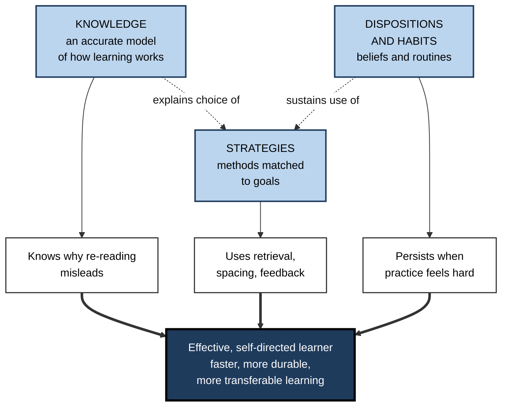
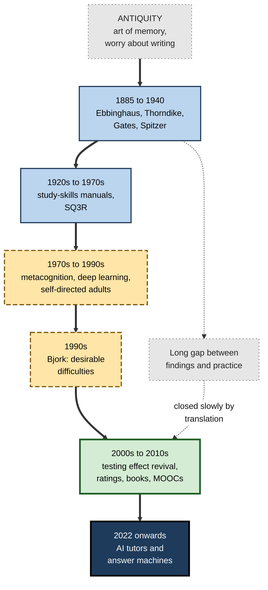
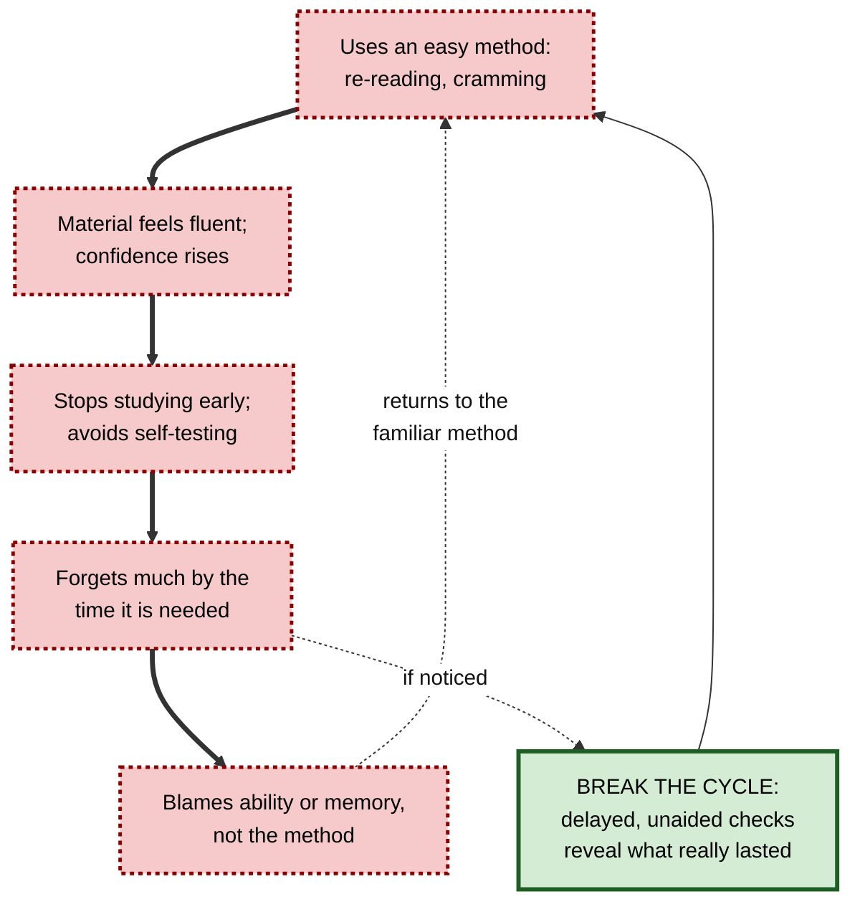
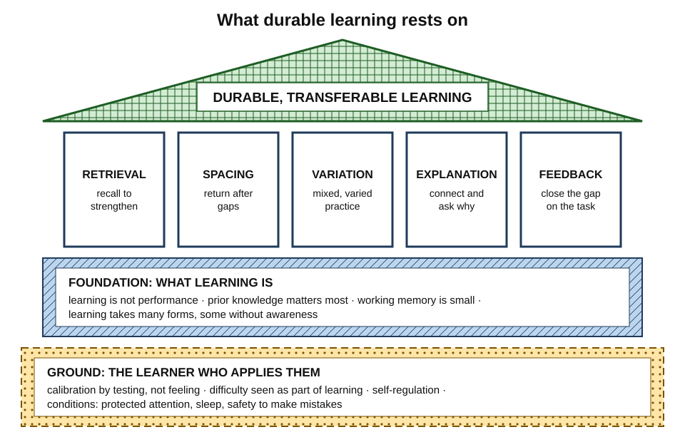
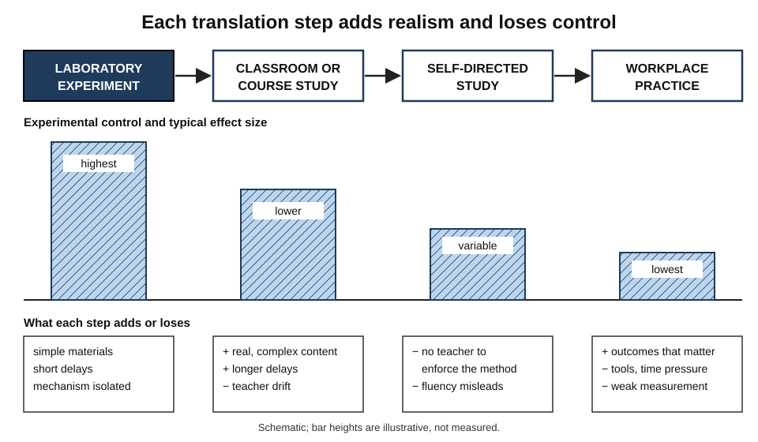
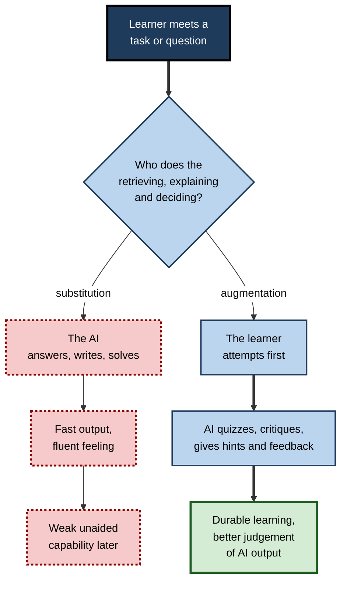

# A. Learning How to Learn

A typical graduate professional has spent sixteen or more years in formal education, learning mathematics, history, law, code or medicine. Almost none of that time was spent learning **how to learn**. So most adults still study the way they did at fifteen — re-reading, highlighting, cramming before deadlines — and carry the same habits into a forty-year career in which they must learn new tools, fields and roles again and again.

> **Definition — Learning how to learn:** the knowledge, strategies, beliefs and habits that make a person an effective, self-directed learner — and, as a field, the study and practice of building them: understanding what learning is, which methods produce durable and transferable capability, how learners misjudge their own learning, and how to apply all of this deliberately across a lifetime.

**Why it matters**

- **Skills turn over quickly.** Tools, platforms, regulations and methods change within a few years; the capability to learn well is the one that does not date.
- **Most people use weak methods.** The most popular study habits are among the least effective, and the most effective feel the least productive.
- **Organisations measure the wrong things.** Satisfaction and completion reward experiences that feel smooth, not ones that build lasting capability.
- **AI changes the stakes.** Tools that can do the thinking make it easy to perform without learning — and more valuable than ever to know the difference.

---

## The Subject and Its Scope

### Three strands of learning capability

- **Knowledge about learning** — an accurate model of how learning works.
  - *e.g.* that performance during practice is not the same as durable learning; that memory is strengthened by retrieval; that forgetting is normal and partly useful.
- **A repertoire of strategies** — methods matched to goals.
  - *e.g.* retrieval practice for facts; worked examples for new procedures; varied cases for judgement.
- **Dispositions and habits** — the beliefs and routines that make strategies actually happen.
  - *e.g.* treating difficulty as information rather than as proof of low ability; reviewing each learning project; protecting time to practise.

**Figure 1.** The three strands that combine into effective self-directed learning.

> **Key point:** knowledge alone changes little. Many students who are told that self-testing works still re-read; strategies become habits only when knowledge, practice and belief line up.

### Learning content versus learning how to learn

| | Learning content | Learning how to learn |
|---|---|---|
| Object | A subject: tax law, Python, anatomy | The learner's own process of learning any subject |
| Typical question | "What is the rule?" | "How should this rule be learned so it lasts and can be used?" |
| Value over time | Declines as the field changes | Compounds with every new field |
| Usually taught? | Yes, explicitly | Rarely, and usually by accident |
| Evidence of success | Knowing the content | Learning the next field faster and more durably |

### Where it sits among neighbouring fields

- **Cognitive psychology** supplies the mechanisms — memory, attention, forgetting, transfer.
- **Educational research** tests methods in classrooms and courses.
- **Metacognition research** studies how learners monitor and control their own learning.
- **Instructional design and workplace learning** turn principles into programmes.
- **Learning how to learn** is the **applied synthesis from the learner's side**: what an individual should know and do to learn well, with or without a teacher.

> **Definition — Self-directed learning (Malcolm Knowles, 1975):** a process in which individuals take the initiative in diagnosing their learning needs, setting goals, finding resources, choosing strategies and evaluating outcomes.

---

## Origins and History

### Ancient and classical roots

- **The art of memory.** Cicero recounts the story of the poet **Simonides of Ceos**, who identified the guests crushed in a collapsed banquet hall by recalling where each had sat — the origin legend of the **method of loci**, which linked items to imagined places.
  - Memory techniques were a core part of rhetorical training for orators who spoke without notes.
- **The first worry about offloading.** In Plato's *Phaedrus*, the Egyptian king Thamus warns that writing will produce **forgetfulness** and "the appearance of wisdom" rather than wisdom — an argument repeated about printing, calculators, search engines and now AI.

### The scientific beginnings (1885–1940)

- **Hermann Ebbinghaus (1885)** — first experimental studies of memory: the forgetting curve, the savings measure and the advantage of spaced over massed repetition.
- **Edward Thorndike and Robert Woodworth (1901)** — undermined the **formal discipline** doctrine that studying Latin or geometry trains the mind in general: transfer depended on shared elements between tasks.
- **Arthur Gates (1917)** — schoolchildren learned more when a large share of study time was spent **reciting** from memory rather than re-reading — an early demonstration of retrieval practice.
- **Herbert Spitzer (1939)** — tested several thousand Iowa school pupils and showed that an early test markedly reduced later forgetting of a text.

> **Watch out:** the core findings of modern learning science — spacing and retrieval — were **demonstrated a century ago**. The problem was never discovery; it was translation into practice.

### The study-skills movement (1920s–1970s)

- **How-to-study manuals** spread through American and British universities from the 1920s.
- **Francis Robinson's SQ3R (1946)** — Survey, Question, Read, Recite, Review — developed at Ohio State University, partly for wartime military training.
  - Its "Recite" step anticipated retrieval practice; the method as a whole has had **limited controlled testing**.
- **Weakness of the movement:** study skills were usually taught as **generic, stand-alone courses**, detached from the subjects students were actually learning.

### The cognitive and metacognitive turn (1970s–1990s)

- **Levels of processing (Fergus Craik and Robert Lockhart, 1972)** — deeper, meaning-based processing produces better memory than shallow processing.
- **Metacognition (John Flavell, 1976–79)** — learners' knowledge and regulation of their own cognition became a research field.
- **Deep and surface approaches (Ference Marton and Roger Säljö, 1976)** — how learners *conceive* learning shapes how they study.
- **Adult self-directed learning** — Allen Tough's interviews (1971) found that most adults undertook several deliberate learning projects a year, mostly without any teacher; Malcolm Knowles built adult-learning theory around such self-direction.
- **Learning strategies research** — Claire Weinstein and Richard Mayer (1986) classified rehearsal, elaboration, organisation, comprehension-monitoring and affective strategies; Barry Zimmerman developed models of **self-regulated learning**.
- **Frank Dempster (1988)** — "The spacing effect: a case study in the failure to apply the results of psychological research" — documented why a robust finding had barely changed education.
- **John Hattie, John Biggs and Nola Purdie (1996)** — meta-analysis: learning-skills training works best when **embedded in subject teaching**, not as stand-alone courses.

### Cognitive psychology's applied turn (1978 onwards)

- **Neisser's challenge (1978).** At the first conference on *Practical Aspects of Memory*, Ulric Neisser complained that if a question about memory was interesting or socially important, psychologists had hardly ever studied it. The remark became a rallying point for research on memory in real life.
- **Very long-term retention.** Harry Bahrick tested people's memory for school Spanish up to fifty years after study (1984).
  - Much was forgotten in the first few years, after which a substantial core remained stable for decades — he called it a **permastore**.
  - What survived depended on how well and how long the material had originally been learned, not on how recently.
- **Spacing over years.** Bahrick and his family (1993) learned foreign-language vocabulary with sessions 14, 28 or 56 days apart; the widest spacing produced the best retention years later, despite needing more sessions to reach the same level at the time.
- **Educational materials, real delays.** From the 1990s, researchers increasingly tested learning principles with textbook passages, lectures and classroom quizzes rather than word lists — the bridge that later made translation possible.

> **Key point:** the applied turn changed the question from "how does memory work?" to "what should a learner actually do on Tuesday evening?" — and showed that many laboratory effects survive, sometimes enlarged, over months and years.

### Desirable difficulties (1990s)

- **Robert and Elizabeth Bjork** — the **new theory of disuse** (1992) separated storage strength from retrieval strength.
- **Robert Bjork (1994)** — **desirable difficulties**: spacing, interleaving, variation and testing slow performance during practice but improve long-term learning.
- **Consequence:** learners and teachers systematically **misjudge** good methods as bad, because they judge by how practice feels.

> **Definition — Desirable difficulty:** a condition that makes practice harder and slower but improves long-term retention and transfer, provided the learner can eventually succeed.

### Translation and popularisation (2000s–2010s)

**Study card — Roediger and Karpicke (2006)**

- **Design:** students read short prose passages, then either **re-read** them or took **free-recall tests** on them, with no feedback.
  - Retention was tested after five minutes, two days or one week.
- **Results:**
  - after **five minutes**, re-reading produced slightly better recall;
  - after **two days and one week**, the tested groups recalled clearly more;
  - in a follow-up, students who re-read repeatedly **predicted** they would remember more than those who were tested — the reverse of what happened.
- **Conclusion:** retrieval produces more durable learning than restudy, and learners' intuitions point the wrong way. The study revived interest in the **testing effect** as an educational tool rather than a laboratory curiosity.

- **Harold Pashler and colleagues (2007)** — a US government practice guide distilled seven evidence-based recommendations for organising instruction and study, each with an explicit rating of the strength of its evidence.

**Study card — Dunlosky, Rawson, Marsh, Nathan and Willingham (2013)**

- **Design:** a review of hundreds of studies on **ten techniques** students commonly use, judged on how well each generalised across learners, materials, outcome measures and learning conditions.
- **Results:**
  - **high utility** — practice testing; distributed practice;
  - **moderate utility** — elaborative interrogation; self-explanation; interleaved practice;
  - **low utility** — summarisation; highlighting and underlining; the keyword mnemonic; imagery for text; re-reading.
- **Conclusion:** the two most effective techniques were among the least used, and the two most popular — re-reading and highlighting — were among the least effective.
- **Caveat:** "low utility" means *weak or narrow evidence of benefit*, not harm; summarisation, for instance, helps learners who have been trained to do it well.

- **Popular books** — *Make It Stick* (Peter Brown, Henry Roediger and Mark McDaniel, 2014) brought the evidence to a general readership.
- **Mass courses** — Barbara Oakley and Terrence Sejnowski's online course *Learning How to Learn* (launched 2014) became one of the most-enrolled online courses ever, reaching millions of learners.
- **Teacher-led translation** — the Learning Scientists (founded by cognitive psychologists Yana Weinstein and Megan Sumeracki, 2016), the researchED movement in the UK (from 2013), and national guidance that explicitly drew on cognitive science.

### The AI era (2022 onwards)

- **Generative AI** from late 2022 put a capable tutor — and a capable answer machine — in every learner's pocket.
- **Early trials** show both faces: answer-giving tools can raise practice performance while lowering unaided learning; tutors designed around learning principles can produce large gains.
- **The old question returns in new form:** which thinking can be safely offloaded, and which must be done by the learner to be learned?

**Figure 2.** The development of learning how to learn as a field.

---

## Why Most People Learn Inefficiently

Inefficient learning is not mainly a failure of effort or intelligence. It follows from predictable features of how people judge their own learning, how education is organised and what environments reward.

### Illusions in self-assessment

- **Fluency is mistaken for learning.** Re-read material feels familiar; familiarity feels like knowing.
- **Effort is mistaken for failure.** Learners interpret the struggle of retrieval or interleaving as a sign that the method is not working.
- **Foresight bias** — Asher Koriat and Robert Bjork (2005): while studying with the answer in view, learners fail to anticipate how hard recall will be without it.
- **Immediate judgements** — learners judge progress at the end of a session, when short-term performance peaks.

> **Definition — Illusion of competence:** believing something has been learned because it feels familiar or fluent, when it cannot be recalled or used unaided later.

**Figure 3.** The self-reinforcing cycle that keeps learners using weak methods.

### What education rarely teaches

- **Students are seldom taught how to study.** Surveys by Nate Kornell and Robert Bjork (2007) and others found most university students had never been taught study strategies and chose methods by habit.
- **Instruction models weak habits** — content blocked by chapter, revision guides that summarise, tests immediately after teaching.
- **Assessments reward cramming** — immediate, recognition-based exams can be passed with knowledge that fades within weeks.

**Study card — Karpicke, Butler and Roediger (2009)**

- **Design:** university students were asked to list the study strategies they used and rank them, and to say what they would do after reading a textbook chapter.
- **Findings:**
  - **re-reading** was by far the most commonly reported strategy, and more than half named it as their **number one** method;
  - **self-testing** was rarely mentioned as a strategy, and almost no one ranked it first;
  - students who did test themselves mostly did so to **check** what they knew, not because they understood that retrieval itself strengthens memory.
- **Lesson:** the gap between what works and what learners do is not a gap of effort; it is a gap of **knowledge and belief** about how learning works — which is what learning how to learn sets out to close.

### Mistaken beliefs that misdirect effort

- **Learning styles** — the belief that matching teaching to a "visual" or "auditory" style improves learning is endorsed by large majorities of teachers in several countries, yet well-designed tests have not supported it.
- **"We use only 10% of our brains"**, **"left-brain and right-brain learners"** and fixed daily attention-span figures persist despite having no scientific basis.
- **Beliefs about ability** — treating struggle as a sign of limited ability makes learners avoid exactly the difficulties that build learning; the evidence that brief mindset interventions change outcomes is, however, **modest** and conditional.

### Environments that work against learning

- **Constant interruption** — fragmented attention degrades encoding.
- **No feedback** — much professional work gives slow, noisy or no feedback on quality.
- **Time pressure** — deadlines reward finishing over learning.
- **Tools that do the thinking** — search, templates and AI complete tasks without building capability.

| Common habit | Why it feels right | What works better | Why |
|---|---|---|---|
| Re-reading notes | Material becomes familiar | Closed-book recall, then check | Retrieval strengthens memory; exposes gaps |
| Cramming before a deadline | Fast gains; works for tomorrow | Shorter sessions spread over days and weeks | Spacing produces durable retention |
| Practising one problem type at a time | Smooth progress | Mixed practice once basics are known | Trains choosing the right method |
| Highlighting while reading | Visible progress | Questions answered from memory after each section | Active processing, not marking |
| Looking up or asking AI immediately | Efficient | Attempt first, then look up | Attempt turns lookup into retrieval with feedback |
| Judging progress at the end of the session | Immediate reassurance | Unaided checks days later | Delayed performance reflects learning |

> **In practice:** when a professional "isn't picking things up", experienced coaches and learning designers diagnose before prescribing, working through four questions in order:
> 1. **Method** — how is the person actually studying or practising: re-reading, watching, copying?
> 2. **Check** — when and how do they test themselves, and is it delayed and unaided?
> 3. **Conditions** — do interruptions, time pressure, missing prerequisites or absent feedback block learning?
> 4. **Beliefs** — do they read struggle as a sign of low ability, or avoid exposing gaps?
>
> Most "learning problems" turn out to be **method or conditions** problems, which are far easier to fix than ability.

---

## The Core Principles of the Field

Across a century of research, a small set of principles has emerged that is well supported, broadly applicable and directly usable by learners.

**Figure 4.** The core principles of learning how to learn: foundations, active ingredients and the learner who applies them.

### Foundations: what learning is

- **Learning is a lasting change, not a good session.** Performance during practice is a poor guide; learning is judged after a delay, without help, in new situations.
- **Prior knowledge is the strongest single influence on new learning.** David Ausubel (1968) put it as the most important factor: what the learner already knows.
- **Working memory is small; long-term memory is vast.** New material must be processed in small amounts and connected to what is already known.
- **Learning takes many forms** — facts, concepts, skills, habits, attitudes — and much of it happens without awareness, so methods must fit the kind of learning sought.

### Active ingredients: what makes it last

- **Retrieval** — recalling from memory strengthens it more than re-exposure.
- **Spacing** — returning to material after gaps beats massing it.
- **Variation and interleaving** — practising across varied cases and mixed types builds flexible, transferable knowledge.
- **Elaboration and explanation** — connecting new ideas to old and asking *why* builds understanding.
- **Feedback** — timely, task-focused information about the gap between attempt and target.

### The learner: what makes it happen

- **Calibration** — accurate judgement of what one knows, built by testing rather than feeling.
- **Beliefs** — treating difficulty as part of learning rather than as a verdict on ability.
- **Self-regulation** — planning, monitoring and reviewing learning deliberately.
- **Conditions** — attention protected from constant interruption; sleep protected after learning; psychological safety to make mistakes.

> **Mnemonic — "Real Students Vary Every Fact":** Retrieval, Spacing, Variation, Explanation, Feedback — the five active ingredients.

> **Remember:** the principles are **simple to state and hard to practise**, because each one feels less productive than its weak alternative.

---

## The Evidence Base and Its Limits

### How strong is the evidence?

| Confidence | Examples | Typical evidence | Practical stance |
|---|---|---|---|
| **Robust** | Testing effect; spacing effect; worked examples for novices | Many laboratory experiments, classroom replications, meta-analyses | Use by default |
| **Conditional** | Interleaving; elaborative interrogation; self-explanation; concept mapping | Strong in some materials and learners, weak in others | Use where conditions fit |
| **Modest or contested** | Brief growth-mindset interventions; reflection effects in the workplace; some AI tutoring results | Small or variable effects; few large replications | Use cautiously; measure locally |
| **Not supported** | Learning-styles matching; general "brain training"; difficult fonts as a memory aid | Well-designed tests fail to find the claimed effect | Do not use |

- **Mindset interventions** — Victoria Sisk and colleagues' (2018) meta-analysis found a **very small** average effect on achievement; a large US national experiment (David Yeager and colleagues, 2019) found small but meaningful benefits concentrated among lower-achieving students in supportive schools.
- **Learning styles** — Harold Pashler and colleagues (2008) set out the experimental test needed (a crossover interaction) and found almost no studies that passed it.
- **Far transfer** — reviews of brain-training and of chess and music training find gains on trained tasks with little transfer to general learning ability.

### Why laboratory effects shrink

**Figure 5.** Evidence weakens at each step of translation from laboratory finding to workplace practice.

- **Simple materials** — many experiments use word lists or short texts; real knowledge is interconnected and complex.
- **Short delays** — retention is often tested after days, not the months or years that matter at work.
- **Weaker contrasts** — real-world comparison conditions are often better than laboratory controls.
- **Implementation drift** — teachers, trainers and learners adapt methods, often removing the active ingredient (e.g. turning retrieval into open-book quizzes).
- **Typical field effects** — large randomised trials in education commonly find effects around a tenth of a standard deviation, which can still be valuable at scale.

### Wider limits of the science

- **Narrow samples** — most participants have been university students in Western, educated, industrialised, rich and democratic (**WEIRD**) societies (Joseph Henrich, Steven Heine and Ara Norenzayan, 2010).
- **Replication** — the Open Science Collaboration (2015) successfully replicated fewer than half of a sample of published psychology findings; the core learning effects (testing, spacing) have replicated well, but smaller, surprising effects deserve caution.
- **Neuroscience over-reach** — John Bruer (1997) called the direct leap from brain science to classroom practice "a bridge too far"; "brain-based" learning products often dress familiar advice in neural language, or promote neuromyths.
- **Workplace evidence is thin** — few true experiments test learning methods on real job performance over long periods.

> **Watch out:** a claim labelled "neuroscience shows" or "research proves" is not evidence. Ask what was compared, after what delay, with what learners and materials.

---

## Learning How to Learn in Professional and Organisational Life

### For the individual professional

- **Learnability as career capital** — the ability to become competent in new fields quickly is increasingly what employers select for and what protects careers against change.
- **Self-direction** — adults decide what to learn, how, and when it is good enough; few have a teacher.
- **Getting better at learning itself** — analysing a new field before diving in, choosing methods for its mix of concepts, facts and procedures, and reviewing each learning project so the next one starts faster.
- **Daily integration** — the largest gains come not from occasional courses but from small routines inside ordinary work: recalling before looking up, reflecting after key events, reviewing lessons at spaced intervals.

### For organisations and learning professionals

- **Evidence-informed design** — spaced follow-up, retrieval-based activities, worked examples for novices, realistic practice, delayed assessment.
- **Evaluation beyond satisfaction** — Will Thalheimer's **Learning-Transfer Evaluation Model** (2018) argued that attendance, satisfaction and immediate knowledge checks are weak evidence and that decision-making competence, task performance and transfer must be measured.
- **Scepticism about vendor claims** — retention percentages, "brain-based" design and style-based personalisation should be checked against the evidence.
- **Building learning capability, not only delivering content** — organisations that teach employees *how* to learn in the context of their real work gain speed in every future change.

| | Stand-alone "learning skills" workshop | Embedded learning-how-to-learn |
|---|---|---|
| Format | One-off session on study techniques | Strategies taught and practised within real tasks and courses |
| Content | Generic tips | The specific methods suited to the material being learned |
| Learner experience | Interesting; quickly forgotten | Learners experience the delayed benefit themselves |
| Transfer | Low | Higher, especially to similar tasks |
| Evidence | Weak | Supported by meta-analyses of strategy instruction |

### Case study: teaching graduates how to learn inside a professional training programme

- **Situation:** an engineering and consulting firm recruited about two hundred graduates a year into a two-year rotational programme across technical, client and commercial roles.
- **Problem:**
  - graduates took a long time to become useful at each rotation;
  - the firm ran a well-rated "effective learning" workshop in induction week, but behaviour did not change;
  - assessment at the end of each rotation was a presentation that rewarded polish, not capability.
- **Diagnosis:**
  - the workshop was **stand-alone** — techniques were described, not practised on rotation content;
  - graduates judged progress by **fluency**, and nobody checked unaided capability;
  - lessons about learning each new area were lost at every rotation change.
- **Actions:**
  1. Replaced the induction workshop with **short sessions inside the first rotation**, applying retrieval, spacing and worked examples to the actual technical content.
  2. Required a one-page **field map** at the start of each rotation — purpose, key concepts, facts and procedures, and how experienced staff learned it — reviewed by a mentor.
  3. Introduced **unaided checkpoints** at weeks two and six of each rotation, run by a senior practitioner.
  4. Added a **30-minute learning review** at the end of each rotation: what accelerated learning, what wasted time, what to do differently next time.
  5. Gave graduates guidance on **AI use**: attempt first, use the assistant as critic and quizmaster, explain any generated work in reviews.
- **Result:** over two intakes, rotation supervisors reported earlier independent contribution and fewer basic errors; graduates' learning reviews showed steadily shorter "getting started" periods in later rotations.
- **Side effects / caveats:**
  - checkpoints were initially seen as tests of worth, and some graduates over-prepared; reframing them as low-stakes calibration helped;
  - no randomised comparison was possible, so part of the improvement may reflect selection and better mentoring.
- **Lesson:** learning how to learn becomes organisational capability when it is **embedded in real work, checked unaided and reviewed after every learning episode** — not when it is announced in a workshop.

---

## Learning How to Learn in the AI Era

### An old worry, a new scale

- **Socrates' warning about writing** has accompanied every cognitive tool; each time, people both lost some skills and gained new ones.
- **What is new:** generative AI performs not only storage (like writing) or calculation (like calculators) but **explanation, synthesis and production** — the very activities through which people learn.

### Tutoring: the hope and the evidence

**Study card — Bloom (1984) and VanLehn (2011)**

- **Bloom's claim:** students tutored one-to-one with mastery learning performed about **two standard deviations** better than students taught conventionally — the "**two-sigma problem**": how to achieve tutoring's benefits at scale.
- **VanLehn's review:** across many studies, human tutoring's advantage was much smaller — roughly **0.8** standard deviations — and well-designed step-based computer tutors came close to it.
- **Conclusion:** tutoring is powerful but the two-sigma figure is an outlier; good automated tutoring can approach human tutoring when it makes the learner do the work.

> **Watch out:** "AI will give every learner a two-sigma tutor" rests on a figure that has not replicated at that size. Well-designed AI tutors have shown large gains in some recent trials, but the evidence is early, short-term and limited to particular courses.

### Substitution or augmentation

**Figure 6.** Whether an AI tool replaces or strengthens the thinking that produces learning.

### New competencies for learners

- **Deciding what to keep in the head** — knowledge needed to judge AI output, act under time pressure and learn further.
- **Attempting before asking** — preserving retrieval and generation as the learning moment.
- **Verifying** — treating fluent AI output with the same suspicion as one's own feeling of fluency.
- **Using AI as tutor, critic and sparring partner** rather than as answer machine for anything that should be learned.
- **Calibrating** — periodically working unaided to check that capability still exists behind assisted output.

> **Key point:** in the AI era, learning how to learn becomes more important, not less — because the tools make it easier than ever to **perform without learning**, and the people who can still learn deeply will be the ones able to judge the tools.

---

## Open Questions

- **Can learning how to learn be taught at scale so that it sticks?**
  - Strategy instruction works when embedded and practised; how to change lifelong study habits for whole populations is unresolved.
- **How far does learning skill transfer?**
  - Near transfer of strategies is supported; whether general habits of approach make people faster learners in very different fields rests mainly on case evidence.
- **What should be learned when AI can do so much?**
  - The boundary between knowledge that must be internal and knowledge that can be delegated is shifting and barely studied.
- **How should durable learning be measured at work?**
  - Most organisations still lack affordable measures of unaided capability and transfer.
- **Do the principles hold for complex, ill-structured professional judgement?**
  - The best evidence concerns facts, texts and well-structured problems; much professional expertise is neither.
- **Will AI tutors preserve desirable difficulty?**
  - Commercial pressures favour tools that feel easy and satisfying — the opposite of what often builds learning.

---

## Summary

- **Learning how to learn** combines **knowledge about learning**, a **repertoire of strategies** and supporting **dispositions and habits**; as a field it is the applied synthesis of learning science from the learner's side.
- Its **history** runs from the ancient art of memory and Socrates' worry about writing, through Ebbinghaus, Gates and Spitzer, the study-skills movement and SQ3R, metacognition and self-directed adult learning, to Bjork's **desirable difficulties**, the testing-effect revival, technique ratings, popular books and mass online courses — and now AI tutors.
- The key findings were known a century ago; the persistent problem is **translation into practice**.
- People learn inefficiently because of **illusions of competence**, foresight bias and the misreading of effort, because education rarely teaches study methods and rewards cramming, because of persistent **myths**, and because work environments interrupt and offload.
- **Core principles:** learning ≠ performance; prior knowledge and limited working memory; the five active ingredients — **retrieval, spacing, variation, explanation, feedback**; and the learner's calibration, beliefs, self-regulation and conditions.
- **Evidence** ranges from robust (testing, spacing) through conditional (interleaving, elaboration) and modest (mindset interventions) to unsupported (learning styles, brain training); laboratory effects shrink in real settings, samples are narrow, and neuroscience is often over-applied.
- In **organisations**, learning how to learn works when **embedded in real work**, checked unaided and reviewed; stand-alone workshops rarely change behaviour.
- In the **AI era**, tools can substitute for or augment the learner's thinking; the decisive question is **who does the retrieving, explaining and deciding**.

---

## Self-Check

1. Define learning how to learn and name its three strands.
2. How does learning how to learn differ from learning content, and why does its value compound?
3. What did Gates (1917) and Spitzer (1939) show, and why is their date significant?
4. What were the strengths and weaknesses of the study-skills movement?
5. Explain desirable difficulties and why they lead learners to misjudge good methods.
6. Describe three illusions that cause people to learn inefficiently.
7. Why do most professionals still use weak study methods despite decades of evidence?
8. List the five active ingredients of durable learning and give a workplace example of each.
9. Classify the following by strength of evidence: spacing, learning-styles matching, interleaving, brief mindset interventions, brain training.
10. Give four reasons why laboratory effects shrink in classrooms and workplaces.
11. What did Bloom (1984) claim, what did VanLehn (2011) find, and what does this imply for claims about AI tutors?
12. Compare a stand-alone learning-skills workshop with an embedded approach.
13. A learning vendor claims its "neuroscience-based" platform improves retention by 80%. Evaluate the claim.
14. Design an organisation-wide approach to teaching employees how to learn in the AI era, with at least four elements and two measures.

### Answer Key

1. The knowledge, strategies, beliefs and habits that make a person an effective, self-directed learner, and the field that studies and builds them. Strands: knowledge about learning; a repertoire of strategies; dispositions and habits.
2. Learning content targets a subject and its value declines as the field changes; learning how to learn targets the process of learning any subject, so each improvement speeds every future field — its value compounds.
3. Gates found that spending much study time reciting from memory beat re-reading; Spitzer found that an early test sharply reduced later forgetting in thousands of pupils. Retrieval practice was demonstrated over a century ago, so the problem is translation, not discovery.
4. Strengths: made study methods explicit; SQ3R's recitation step anticipated retrieval practice. Weaknesses: generic, stand-alone courses detached from real subjects, and limited controlled testing of the methods.
5. Conditions such as spacing, interleaving and testing slow practice but improve long-term learning. Because they feel harder and produce lower immediate performance, learners judge them as worse.
6. Fluency mistaken for learning; effort mistaken for failure; foresight bias (underestimating how hard recall will be without the answer); judging progress at the end of a session.
7. They were never taught; weak methods feel effective; immediate tests reward cramming; myths persist; workplaces interrupt, give little feedback and offer tools that do the thinking.
8. Retrieval — recalling a client's key figures before a meeting; spacing — reviewing a new regulation after a day, a week and a month; variation — practising negotiation with different counterpart types; explanation — writing why a design decision was made; feedback — asking a reviewer which comments they would not have made.
9. Robust: spacing. Conditional: interleaving. Modest: brief mindset interventions. Not supported: learning-styles matching, brain training for general learning.
10. Simpler laboratory materials; short delays; stronger real-world comparison conditions; implementation drift; varied learners and noisier measures.
11. Bloom claimed tutoring with mastery learning gave a two-standard-deviation advantage; VanLehn found human tutoring's advantage nearer 0.8 and good step-based computer tutors close behind. Claims that AI gives every learner a "two-sigma tutor" overstate the evidence; well-designed tutors can help a lot, but evidence is early.
12. Stand-alone workshops teach generic tips once, are quickly forgotten and transfer little. Embedded approaches teach and practise strategies within real tasks, let learners experience the delayed benefit and transfer better, as meta-analyses of strategy instruction show.
13. Ask: compared with what, measured when, on what test, with whom? "Neuroscience-based" is not evidence. An 80% improvement is far beyond typical field effects; demand delayed, unaided outcome data against a realistic comparison group.
14. E.g. strategies taught inside onboarding and technical training, not as stand-alone courses; field maps and learning reviews for each new role or technology; spaced, retrieval-based follow-up for core knowledge; AI guidelines (attempt first, AI as critic and quizmaster, explain generated work); managers asking "what did you learn?" in one-to-ones. Measures: time to independence in new roles; unaided performance checks weeks after training; repeat-error rates.

---

## Glossary

| Term | Meaning |
|---|---|
| Calibration | The match between a learner's confidence and actual performance. |
| Desirable difficulty | A condition that slows practice but improves long-term retention and transfer. |
| Foresight bias | Failing, while the answer is in view, to anticipate how hard recall will be without it. |
| Formal discipline | The discredited doctrine that certain subjects train general mental faculties. |
| Illusion of competence | Believing something has been learned because it feels familiar or fluent. |
| Interleaving | Mixing related problem types or categories within practice. |
| Learnability | The capacity and willingness to become competent in new fields quickly. |
| Learning how to learn | The knowledge, strategies, beliefs and habits that make a person an effective, self-directed learner. |
| Learning styles | The unsupported claim that matching instruction to a preferred sensory style improves learning. |
| Levels of processing | The idea that deeper, meaning-based processing produces better memory. |
| Metacognition | Awareness and regulation of one's own thinking and learning. |
| Method of loci | A memory technique linking items to imagined locations. |
| Neuromyth | A misconception about the brain used to justify educational practice. |
| Retrieval practice | Recalling information from memory to strengthen it. |
| Self-directed learning | Taking the initiative in diagnosing needs, setting goals, choosing strategies and evaluating one's own learning. |
| Self-regulated learning | Planning, monitoring and reflecting on one's own learning towards goals. |
| Spacing effect | Better long-term retention from spaced rather than massed practice. |
| SQ3R | Survey, Question, Read, Recite, Review — a mid-20th-century study method. |
| Testing effect | Better retention after retrieval practice than after equivalent restudy. |
| Two-sigma problem | Bloom's challenge of matching, at scale, the large benefit he reported for one-to-one tutoring. |
| WEIRD samples | Research participants drawn mainly from Western, educated, industrialised, rich, democratic societies. |
