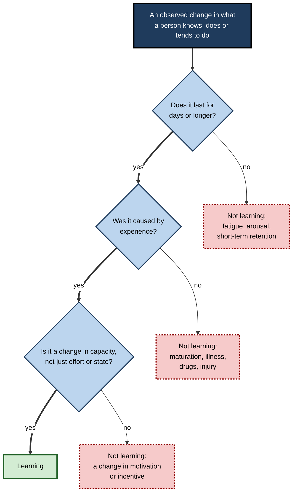
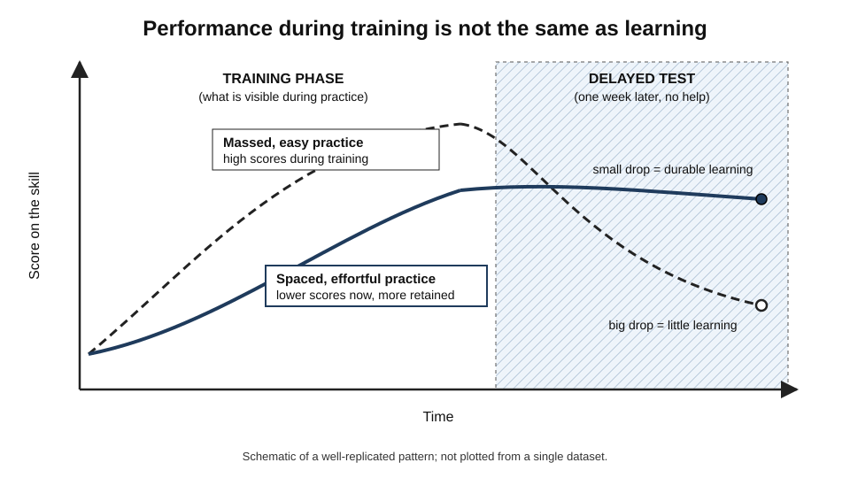
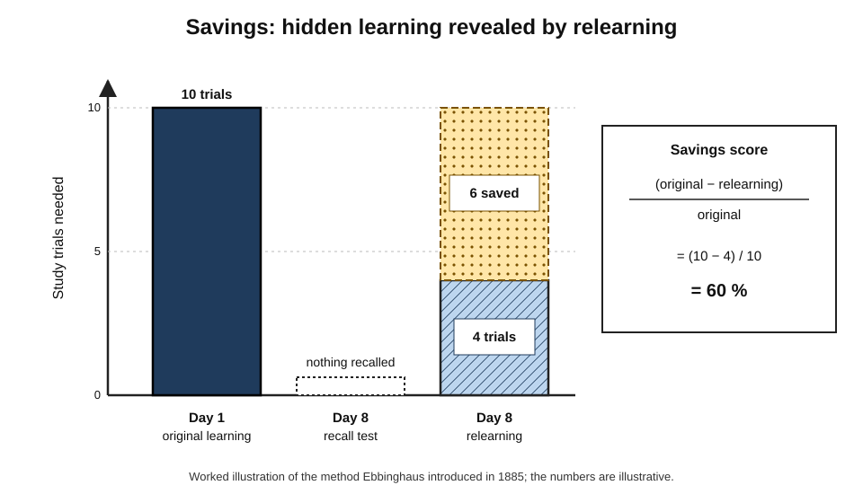
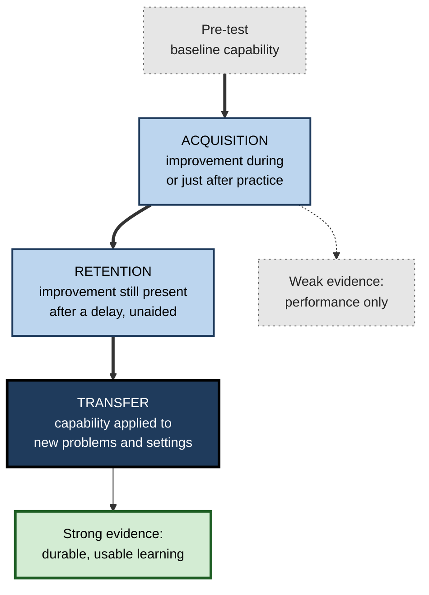
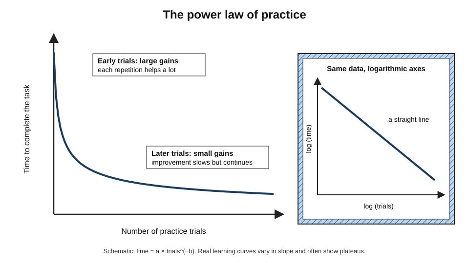
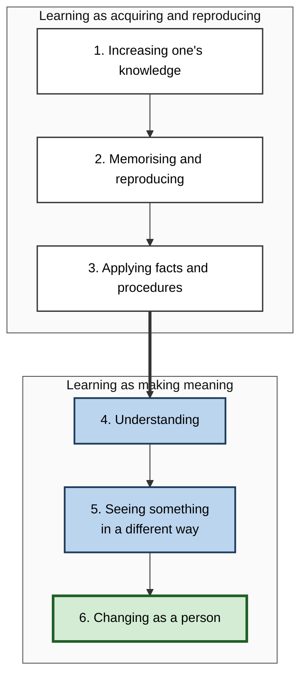
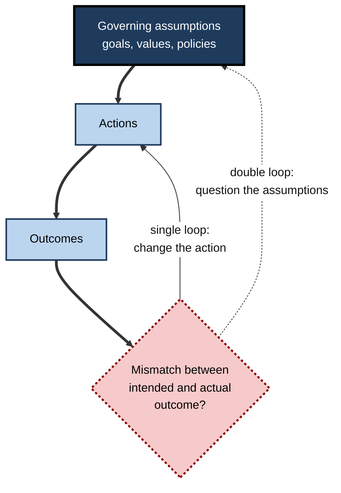

# A.1. What is Learning?

A child touches a hot stove once and never again. A new employee struggles with the expense system for a week and a month later files claims without thinking. A pianist returns to a forgotten piece after ten years and regains it within minutes. In each case something inside the person **changed**, the change was **caused by experience**, and it **lasted**.

> **Definition — Learning:** a relatively permanent change in behaviour, or in the capacity for behaviour, that results from experience.

**Why the definition matters**

- It decides how teachers teach, how organisations train and how researchers design experiments.
- It shapes how AI systems are built and evaluated.
- It determines whether a person can judge if their own effort is paying off.
- Most common errors in studying, training and evaluation trace back to an incomplete answer to this one question.

---

## Learning in Everyday Experience

Almost all adult behaviour — language, reading, driving, manners, tastes, fears — was learned. Very little is fixed at birth.

**What can be learned in a single working day**

- **A fact** — the new client's financial year ends in March.
- **A concept** — what "churn" means, and why it matters more than total sign-ups.
- **A skill** — a keyboard shortcut that becomes automatic.
- **A habit** — checking the calendar before accepting a meeting.
- **An emotional response** — slight anxiety whenever a particular manager sends a message.
- **An attitude** — growing respect for a colleague who handled a crisis well.

> **Key point:** a good definition must cover all of these — deliberate or unnoticed, useful or harmful — while excluding changes that only *look* like learning.

---

## Defining Learning

### The classic definition, part by part

- **Origin:** Gregory Kimble (1961) — "a relatively permanent change in behavioural potentiality that occurs as a result of reinforced practice".
- **"A change"**
  - A before–after difference.
  - Learning is therefore **inferred**, never observed directly.
- **"In behaviour, or in the capacity for behaviour"**
  - The change need not show yet.
  - *e.g.* a passenger learns a route and uses it weeks later when driving alone.
- **"Relatively permanent"**
  - Lasts days, months, years — rules out momentary states.
  - *Relatively* concedes that learning can fade.
- **"Results from experience"**
  - Practice, observation, instruction, feedback, success, failure, exposure.
  - Rules out maturation, drugs, illness and injury.

**The cognitive version**

- Learning = a change in **knowledge** or **mental representations** in long-term memory.
- Kirschner, Sweller and Clark (2006): "If nothing has changed in long-term memory, nothing has been learned."

### What learning is not

- **Maturation** — a toddler begins to walk.
  - Driven by biological development, not specific experience.
- **Fatigue** — more typing errors late at night.
  - Temporary; disappears with rest.
- **Drugs and illness** — faster reactions after caffeine; poorer memory during fever.
  - A physiological state that reverses when it passes.
- **Motivation and arousal** — working harder after a bonus is announced.
  - A change in effort, not capability.
- **Sensory adaptation** — a strong smell fades from awareness.
  - A short-lived change in receptor sensitivity.
- **Injury** — speech loss after a stroke.
  - Caused by damage, not experience.
- **Short-term retention** — holding a phone number for a few seconds.
  - Not relatively permanent.

> **Mnemonic — "My Friend Dan Made Stew In Seconds":** Maturation, Fatigue, Drugs/illness, Motivation, Sensory adaptation, Injury, Short-term retention — the seven look-alikes.

**Figure 1.** Deciding whether a change counts as learning.

### Boundary cases

- **Maturation and learning interact.**
  - Maturation sets *what* can be learned and *when*; learning decides what actually is.
  - *e.g.* reading needs developed visual and language capacities — which are themselves shaped by experience.
- **Habituation counts as learning.**
  - Ceasing to notice an air-conditioner's hum lasts longer than sensory adaptation and is specific to the stimulus.
  - Found even in very simple nervous systems.
- **Unwanted change counts.**
  - Phobias, superstitions, prejudice and bad technique are acquired by the same mechanisms as useful knowledge.
  - The definition is neutral about value.
- **Unstatable change counts.**
  - Someone may get better at spotting phishing emails without being able to say how — **implicit learning**.

> **Definition — Habituation:** a decline in response to a repeated, harmless stimulus; the simplest form of learning.

### The functional definition

**De Houwer, Barnes-Holmes and Moors (2013)**

- **Problem:** the classic definition mixes the *observable effect* with the *mental mechanism*.
- **Proposal:** learning = a change in behaviour that results from **regularities in the environment**.
  - *e.g.* one event reliably following another; a stimulus being repeated.
- **Consequence:** "learning" names the *effect*; theories of memory, association and cognition explain *how*.
- **Advantage:** researchers can agree that learning occurred without first agreeing on its mechanism.

### Learning defined across disciplines

- **Behavioural psychology** — a relatively permanent change in behaviour due to experience, especially reinforced practice.
  - Emphasis: observable behaviour and consequences.
- **Cognitive psychology** — a change in knowledge or mental representations in long-term memory.
  - Emphasis: internal structures and understanding.
- **Neuroscience** — experience-dependent change in neuronal connections and activity.
  - Emphasis: biological mechanism.
- **Education** — acquiring knowledge, skills, values and understanding.
  - Emphasis: meaning and the learner's development.
- **Organisational studies** — a change in an organisation's routines, knowledge or capabilities from experience.
  - Emphasis: collective change.
- **Machine learning** — Tom Mitchell (1997): a program learns from experience E on tasks T, measured by P, if its performance on T improves with E.
  - Emphasis: measurable task improvement.

> **Key point:** these are not rival definitions but **levels of description** — from synapses to individuals to organisations — each suited to its purpose.

---

## What Learning Changes

- **Declarative knowledge** — knowing *that*.
  - *e.g.* "Processing personal data needs a lawful basis."
- **Procedural knowledge and skill** — knowing *how*.
  - *e.g.* writing a database query; running a performance review.
- **Conceptual understanding** — knowing *why*.
  - *e.g.* why an index speeds up a query — so the idea can be applied to new cases.
- **Dispositions and habits** — learned tendencies.
  - *e.g.* double-checking calculations; writing tests before code.
- **Attitudes, values and emotions** — affective learning.
  - *e.g.* confidence with numbers; fear of public speaking.

**Bloom's taxonomy**

- **Bloom et al. (1956)** — three domains:
  - **cognitive** — knowledge and thinking;
  - **affective** — attitudes and emotions;
  - **psychomotor** — physical skill.
- **Anderson and Krathwohl (2001)** — revised cognitive domain, six processes of rising demand:
  - **remember → understand → apply → analyse → evaluate → create**.

> **Mnemonic — "Really Unusual Apples Always Exist Coloured":** Remember, Understand, Apply, Analyse, Evaluate, Create.

> **Watch out:** Bloom's taxonomy classifies **objectives**; it is not a theory of how learning happens.

---

## Learning Versus Performance

### The central distinction

| | Performance | Learning |
|---|---|---|
| What it is | What a person can do *now*, under *these* conditions | The underlying, relatively permanent change in capability |
| Observable? | Yes | No — inferred |
| Affected by | Fatigue, motivation, recent exposure, available help, similarity of practice and test | Quality of encoding, practice and consolidation over time |
| Best measured | During or right after practice | After a delay, without help, in new conditions |

> **Key point:** performance is the only window onto learning — and the window distorts. The two can diverge **in both directions** (reviewed by Nicholas Soderstrom and Robert Bjork, 2015).

### Learning without performance: latent learning

**Study card — Tolman and Honzik (1930)**

- **Design:** three groups of rats ran a complex maze daily.
  - Group 1 — rewarded with food every day.
  - Group 2 — never rewarded.
  - Group 3 — unrewarded for ten days, then rewarded from day eleven.
- **Results:**
  - Group 1 improved steadily; Group 2 wandered with many errors.
  - Group 3's errors fell almost **immediately** to Group 1's level once food appeared.
- **Conclusion:** Group 3 had learned the maze without showing it.

> **Definition — Latent learning:** learning that exists but is not shown in performance until there is a reason to use it.

> **Example:** a new employee quietly observes meetings for weeks, then — asked to lead a project — reveals a detailed grasp of the organisation's politics.

### Performance without learning

- **Massed practice** (many repetitions in one session) → fast gains that fade quickly.
- **Re-reading** → growing familiarity, weak recall later.
- **Constant hints or help** → correct answers, but the mental work is skipped.
- **One fixed way of practising** → good in that exact situation, poor when anything changes.

**The reverse: desirable difficulties**

- **Spacing** practice over time → slower now, better retention.
- **Mixing** problem types → more errors now, better discrimination and transfer.
- **Self-testing** instead of re-reading → feels harder, builds stronger memory.
- **Varying** practice conditions → less smooth now, better transfer.

> **Definition — Desirable difficulty (Robert Bjork):** a condition that impairs short-term performance but enhances long-term learning — provided the learner can eventually overcome it.

**Figure 2.** Performance during training compared with learning measured later.

### Why the distinction is so often missed

- **Processing fluency**
  - Ease of reading or recalling *feels* like knowing.
  - But fluency is driven by recency and repetition and predicts later recall poorly.
- **Judging at the wrong time**
  - Learners, trainers and managers observe performance during or just after instruction — when short-term effects peak.

> **Definition — Processing fluency:** the subjective ease with which information is read, recognised or recalled.

> **Definition — Illusion of competence:** believing something has been learned because it feels familiar or fluent.

> **Watch out:** "I read it three times and it all made sense" is evidence of **fluency**, not learning.

### Worked example: two ways to train a team on a new tool

| | Group A | Group B |
|---|---|---|
| Design | One full-day workshop; each feature demonstrated, then copied | Four 90-minute sessions over two weeks; tasks attempted *before* demonstrations; mixed exercises later |
| End-of-training performance | High | Moderate — several need hints |
| Satisfaction | Very high | Moderately high; "felt hard" |
| Unaided performance one month later | Most look up basic procedures | Most complete routine tasks unaided and attempt unfamiliar ones |

- **Verdict:** Group A shows better *performance*; Group B shows better *learning*.

> **Remember:** judge training by **delayed, unaided** performance — never by end-of-session scores or satisfaction alone.

---

## Learning, Memory and Forgetting

### Three stages of memory

- **Encoding** — the initial processing that creates a memory.
  - Learning fails if information is never processed properly.
- **Storage** — maintenance over time.
  - Learning fails through decay or disruption.
- **Retrieval** — bringing it back into use.
  - Learning fails if it is stored but not accessible when needed.

> **Key point:** learning is the change; **memory** is its retention over time and its expression when needed.

### Forgetting is not the absence of learning: savings

**Study card — Hermann Ebbinghaus (1885)**

- **Method:** memorised nonsense-syllable lists to perfection, using himself as the subject, then retested after delays.
- **Key measure:** not recall, but how much faster he could **relearn** each list — **savings**.
- **Finding:** relearning was faster even when **nothing** could be recalled.

> **Formula — Savings score:** (original effort − relearning effort) ÷ original effort. Example: (10 trials − 4 trials) ÷ 10 = **60%**.

**Figure 3.** The savings method.

> **Example:** a school language "forgotten" for years is relearned far faster than a new language; a professional returning to a tool regains fluency within days.

### Storage strength and retrieval strength

**Robert and Elizabeth Bjork — new theory of disuse (1992)**

- **Storage strength** — how well established a memory is.
  - Reflects **learning**.
- **Retrieval strength** — how easily it can be accessed *now*.
  - Reflects **performance**.
- A memory can be **high in storage but low in retrieval** — deeply learned yet temporarily inaccessible.

> **Key point:** because performance reflects retrieval strength, it is an unreliable guide to learning.

---

## How Learning Is Inferred and Measured

### Acquisition, retention, transfer

- **Acquisition** — did the change occur during practice?
  - Weak evidence on its own.
- **Retention** — does it persist after a delay, without practice?
  - Strong evidence.
- **Transfer** — can it be applied to new situations?
  - Strongest evidence.

**Figure 4.** Three questions that establish whether learning has occurred.

> **Mnemonic — "ART":** Acquisition, Retention, Transfer — real learning needs all three.

### Common measures

- **Free recall** — reproducing without cues.
  - *e.g.* writing every step of a procedure from memory.
- **Cued recall** — recall from partial prompts.
  - *e.g.* completing a formula given its name.
- **Recognition** — identifying learned material.
  - *e.g.* picking the right answer from four options.
- **Savings** — reduced effort to relearn.
  - *e.g.* hours to regain proficiency with a tool after a break.
- **Speed and accuracy** — fluency of a skill.
  - *e.g.* time and error rate on a standard task.
- **Transfer tasks** — application to new problems.
  - *e.g.* solving a novel case with a learned principle.
- **Behavioural observation** — use in real settings.
  - *e.g.* whether a manager actually uses a coaching technique in one-to-ones.

> **Watch out:** recognition is easier than recall — multiple-choice tests usually **overstate** learning.

### Learning curves and the power law of practice

> **Definition — Learning curve:** a plot of performance against the amount of practice.

- **Newell and Rosenbloom (1981):** across tasks from cigar-rolling to typing to puzzle-solving, time per task falls steeply at first, then ever more slowly.
- They called the pattern the **power law of practice**.

> **Formula — Power law of practice:** time per trial = a × (number of trials)^(−b), where *a* is the initial time and *b* the learning rate. On logarithmic axes this is a straight line.

**Figure 5.** The power law of practice.

**The qualification — Heathcote, Brown and Mewhort (2000)**

- For **individual** learners, an **exponential** function often fits better.
- Averaging many individual exponential curves can produce a group curve that *looks* like a power law.
- The practical lesson is unchanged:
  - big early gains;
  - smaller but continuing later gains;
  - frequent, often temporary plateaus.

> **In practice:** Theodore Wright (1936) observed that aircraft unit costs fell by a predictable proportion each time cumulative output doubled. Firms still use such **experience curves** to forecast costs and price work — a firm's tenth cloud migration should cost far less than its first.

### Quantifying learning gains

- **Raw gain** = post − pre.
  - Simple, but unfair across different starting levels.
- **Normalised gain** (Richard Hake, 1998) = (post − pre) ÷ (maximum − pre).
  - The gain achieved as a share of the gain that was possible.
- **Cohen's d** = (mean₁ − mean₂) ÷ pooled standard deviation.
  - Jacob Cohen's benchmarks: ~0.2 small, ~0.5 medium, ~0.8 large.
  - What counts as important depends on context and cost.

**Worked example — two cohorts on a 100-point assessment**

| Cohort | Pre | Post | Raw gain | Normalised gain |
|---|---|---|---|---|
| New hires | 30 | 65 | 35 | (65 − 30) ÷ (100 − 30) = **0.50** |
| Experienced staff | 70 | 85 | 15 | (85 − 70) ÷ (100 − 70) = **0.50** |

- Raw gains suggest the programme worked better for new hires.
- Normalised gains show **both closed half** of their remaining gap.

> **Watch out:** both are **immediate** post-tests. Neither proves learning without a delayed retention test.

### Measurement pitfalls

- **Testing too early** — short-term effects inflate results.
  - Remedy: test after days or weeks.
- **Help available during the test** — measures person + tool, not the person.
  - Remedy: test unaided, unless the tool is part of the real task.
- **Teaching to the test** — memorised answers pass.
  - Remedy: use new items unlike the practice items.
- **Ceiling effects** — a test too easy to separate capable learners.
  - Remedy: include harder items.
- **Regression to the mean** — people selected for low scores improve by chance alone.
  - Remedy: use a comparison group.
- **The testing effect** — a pre-test is itself a learning event.
  - Remedy: compare with a group that was not pre-tested.
- **Self-report** — only weakly related to measured learning.
  - Remedy: treat it as a sign of engagement, not evidence of learning.

---

## How People Understand Learning

### Six conceptions of learning

- **Roger Säljö (1979)** identified five conceptions from interviews with adults; **Marton, Dall'Alba and Beaty (1993)** added a sixth.
- **Quantitative conceptions** — learning as acquiring and reproducing:
  1. increasing one's knowledge;
  2. memorising and reproducing;
  3. applying facts and procedures.
- **Qualitative conceptions** — learning as making meaning:
  4. understanding;
  5. seeing something in a different way;
  6. changing as a person.

**Figure 6.** Six conceptions of learning, from quantitative to transformative.

### Surface and deep approaches

**Marton and Säljö (1976)** — students reading academic texts:

| | Surface approach | Deep approach |
|---|---|---|
| Focus | The words and facts | The author's meaning and argument |
| Linked conceptions | 1–3 | 4–6 |
| Strategy | Repetition, reproduction | Seeking meaning and connections |
| Outcome | Weaker understanding, faster forgetting | Better understanding, longer retention |

> **Key point:** a learner's conception of learning is not just philosophy — it **predicts the strategies they choose**.

### Two metaphors for learning

**Anna Sfard (1998)**

- **Acquisition metaphor** — learning as gaining knowledge as a possession.
  - Typical language: "acquire skills", "build knowledge", "fill gaps".
  - Captures content, facts and procedures well.
- **Participation metaphor** — learning as becoming a participant in a community and its practices.
  - Typical language: "become a nurse", "join the engineering culture".
  - Captures norms, judgement and identity well.

> **Example:** a new solicitor must *acquire* contract law **and** *become* a member of the profession, absorbing its norms of judgement and conduct.

> **Watch out:** Sfard warned against choosing only one metaphor — each captures what the other misses.

---

## Learning Beyond the Individual

### Teams and organisations

- **Team learning** — the team changes how it works together after experience.
  - *e.g.* new monitoring and hand-over procedures after an incident review.
- **Organisational learning** — routines, policies, systems and shared assumptions change, so the change outlasts the individuals involved.
  - *e.g.* a firm revising its project-approval process after repeated overruns.

**Argyris and Schön (1978): single-loop and double-loop learning**

| | Single-loop | Double-loop |
|---|---|---|
| Response to an error | Change the **action** | Question the **goals and assumptions** |
| Analogy | A thermostat switching on the heat | Asking whether the temperature setting is right |
| Sales example | Missed target → make more calls | Missed target → ask whether these are the right customers, or the right product |

**Figure 7.** Single-loop and double-loop learning.

- **Argyris (1991), "Teaching smart people how to learn":**
  - Highly educated professionals are often poor at double-loop learning about **their own** behaviour.
  - Used to success, they respond to failure defensively.
- **Peter Senge, *The Fifth Discipline* (1990):**
  - Popularised the **learning organisation** — one that systematically expands its capacity to create the results it wants.
  - Through shared vision, systems thinking and team learning.

### Machines

- **Tom Mitchell (1997):** a program learns if its performance on tasks T, measured by P, improves with experience E — a functional definition parallel to psychology's.
- **How humans and many current AI models differ:**
  - **Examples needed** — humans often learn from few; large models from very many.
  - **Adding new knowledge** — humans integrate it with what they know; many models degrade old knowledge (**catastrophic forgetting**).
  - **Forgetting and interference** — occur in both, in different forms.

> **Definition — Catastrophic forgetting:** the tendency of some machine-learning systems to lose earlier knowledge when trained on new data.

---

## Learning When Tools Can Think

### Cognitive offloading

> **Definition — Cognitive offloading (Evan Risko and Sam Gilbert, 2016):** using physical action to alter the information-processing demands of a task so as to reduce cognitive demand — e.g. writing a number down instead of remembering it.

> **Definition — Extended mind (Andy Clark and David Chalmers, 1998):** the thesis that a resource a person reliably consults, such as a notebook, can function as part of their mind.

- **Offloading helps when:**
  - it frees resources for more important work;
  - the information is genuinely better kept outside the head.
- **Offloading harms when:**
  - the offloaded task is the very thing being learned;
  - independent capability will be needed later.

### When AI prevents learning

**Study card — Bastani and colleagues (2025)**

- **Setting:** large field experiment in Turkish high-school mathematics classes.
- **Groups:**
  - unrestricted GPT-4 assistant during practice;
  - AI tutor designed to give hints, not answers;
  - no AI.
- **Results:**
  - unrestricted AI → much better practice scores, but **worse** on a later exam without AI than students who never had it;
  - hint-giving tutor → harm **largely avoided**.
- **Lesson:** assisted performance rose while independent capability fell — the learning–performance distinction in modern form.

> **Watch out:** the earlier "Google effect" claim — that people remember less of what they expect to look up — was influential, but a large 2018 replication project failed to reproduce one of its central findings. Its size and generality are **uncertain**. The broader principle stands: when a tool does the thinking, the person does less of the processing that builds durable learning.

### What must still be learned?

- **Judgement requires internal knowledge.**
  - Checking an AI legal summary, diagnosis or code needs enough knowledge to spot errors.
- **New learning builds on old.**
  - Prior knowledge is the main determinant of how fast new knowledge in a field is learned.
- **Speed and fluency matter.**
  - Negotiations, incidents and consultations leave no time to look things up.

> **In practice:** decide deliberately what must be **learned**, what can be **looked up** and what can be **delegated** — and check that tool use is not quietly replacing the learning that matters.

---

## Learning in Professional Practice

### Writing learning objectives that can be tested

**Robert Mager, *Preparing Instructional Objectives* (1962)** — three parts:

- **Performance** — what the learner will be able to *do* (observable).
- **Conditions** — the circumstances, and what help is or is not available.
- **Criterion** — the standard that counts as success.

> **Mnemonic — "PCC":** Perform, under Conditions, to a Criterion.

**Worked example — rewriting "New analysts will understand our customer data model"**

1. **Make it observable** → "…will write SQL queries joining customer, contract and invoice tables…"
2. **Add conditions** → "…without documentation or AI assistance, using the production schema…"
3. **Add a criterion** → "…correctly answering at least four of five unseen business questions…"
4. **Add timing** (to test learning, not performance) → "…in an assessment three weeks after onboarding ends."

> **Example — final objective:** three weeks after onboarding, new analysts write SQL queries joining the customer, contract and invoice tables, without documentation or AI assistance, correctly answering at least four of five unseen business questions.

### Case study: redefining learning in sales enablement

- **Situation:** a software company ran two-day product training for new sales representatives.
- **Apparent success:** excellent satisfaction; end-of-course quiz scores above 90%.
- **Real problem:** representatives could not handle technical customer questions; pre-sales engineers were pulled into basic calls.
- **Diagnosis:**
  - the quiz was immediate, recognition-based, close to the slides and open-book;
  - it measured **acquisition under easy conditions**, not retention or transfer.
- **New definition of success:** 30 days after training, conduct a 20-minute discovery call with a simulated technical buyer, answering unscripted questions accurately and unaided.
- **Redesign:**
  - training spread over three weeks;
  - short practice calls with feedback;
  - recorded real customer questions used as practice material;
  - certification by live role-play, assessed by a pre-sales engineer;
  - the quiz dropped.
- **During training:** "felt harder"; early practice scores modest.
- **Result (two quarters):** far fewer first calls needed a pre-sales engineer; engineers freed for complex deals; satisfaction slightly lower.
- **Lesson:** report the **behaviour change**, not the satisfaction score.

---

## Open Questions

- **Can learning have one unified definition?**
  - Behavioural, cognitive, neural and functional definitions coexist; a definition that is mechanism-free yet scientifically productive is still debated.
- **How can workplace learning be measured affordably?**
  - Most organisations still measure attendance, satisfaction and immediate scores.
- **Which AI assistance builds learning, and which replaces it?**
  - Effects likely differ by tool design and between novices and experts; the evidence is early.
- **Where should the boundary of offloading lie?**
  - Little evidence yet on what each profession must keep "in the head".
- **Are human and machine learning deeply similar?**
  - Comparisons inform both fields, but the depth of the similarity is unresolved.

---

## Summary

- **Learning** = a relatively permanent change in behaviour, or capacity for behaviour, caused by experience. Cognitive view: a change in long-term memory. Functional view: behaviour changed by environmental regularities.
- **Not learning:** maturation, fatigue, drugs/illness, motivation, sensory adaptation, injury, short-term retention. **Still learning:** habituation, unwanted learning, implicit learning.
- Learning changes **declarative knowledge, skills, understanding, habits and attitudes**; Bloom's taxonomy classifies objectives from *remember* to *create*.
- **Learning ≠ performance.** Latent learning shows learning without performance; massed practice, re-reading and constant help show performance without learning. **Desirable difficulties** lower short-term performance but improve learning.
- **Fluency** creates the illusion of competence; judge learning after a delay and without help.
- Forgetting is not total loss: **savings** reveal hidden learning; **storage strength** differs from **retrieval strength**.
- Establish learning with **ART** — acquisition, retention, transfer — using suitable measures, learning curves, normalised gains and effect sizes, while avoiding common measurement pitfalls.
- **Conceptions of learning** (memorising → changing as a person) predict surface or deep approaches; the **acquisition** and **participation** metaphors are complementary.
- Organisations learn through **single-loop** and **double-loop** learning; machines learn when task performance improves with experience.
- AI can raise assisted performance while lowering independent capability; decide deliberately what must be learned.
- In practice, write objectives as **Performance + Conditions + Criterion**, measured after a delay and unaided.

---

## Self-Check

1. State the classic definition of learning and explain what each component rules in or out.
2. Why is each of these not learning: a sprinter faster after a stimulant; remembering a code for ten seconds; a teenager's growth spurt?
3. Why does "or the capacity for behaviour" matter? Give a workplace example.
4. Describe the Tolman and Honzik experiment and its conclusion.
5. Distinguish learning from performance, with one example where performance overstates learning and one where it understates it.
6. What is processing fluency, and how does it mislead learners?
7. Explain the savings method and what it shows about forgetting.
8. Distinguish storage strength from retrieval strength.
9. One group gains 20 raw points and another 10. Why might normalised gain change the interpretation, and why does neither prove learning?
10. List the six conceptions of learning and explain how a conception affects study strategy.
11. Distinguish single-loop from double-loop learning with a business example.
12. Summarise the 2025 AI-assistance study in mathematics and what it illustrates.
13. Rewrite "Managers will learn to give better feedback" as a measurable objective with a suitable delay.
14. A manager cites high satisfaction and 95% immediate quiz scores as proof that compliance training works. Identify at least four weaknesses and propose a better evaluation.

### Answer Key

1. Learning is a relatively permanent change in behaviour, or capacity for behaviour, resulting from experience. *Change* — inferred from before/after. *Behaviour or capacity* — includes learning not yet shown. *Relatively permanent* — excludes momentary states, allows fading. *From experience* — excludes maturation, drugs, illness, injury.
2. Stimulant: temporary physiological state, not experience. Ten-second code: short-term retention, not relatively permanent. Growth spurt: maturation, not experience.
3. Learning can exist before it shows. An employee who watches a colleague handle difficult client calls may learn the techniques but use them only months later.
4. Three rat groups ran a maze: always rewarded, never rewarded, rewarded only from day 11. The third group's errors fell almost immediately to the always-rewarded level once reward began → they had learned without showing it (latent learning).
5. Learning is the durable change; performance is what is shown now. Overstates: high scores right after cramming, gone a week later. Understates: latent learning, or a capable person performing badly through fatigue or anxiety.
6. The subjective ease of processing information. Re-reading and recency make material feel fluent, which learners mistake for knowledge, leading them to prefer weak study methods.
7. Ebbinghaus relearned lists after delays and measured the effort saved. Relearning was faster even when nothing could be recalled → learning persists beyond what recall shows.
8. Storage strength: how well established a memory is. Retrieval strength: how accessible it is now. Performance reflects retrieval; learning is better reflected by storage.
9. Groups starting at different levels have different room to gain; normalised gain expresses gain as a share of what was possible and may show equal effectiveness. Both are usually immediate post-tests, so retention and transfer remain unproven.
10. Increasing knowledge; memorising and reproducing; applying; understanding; seeing differently; changing as a person. Conceptions 1–3 favour a surface approach (repetition); 4–6 favour a deep approach (meaning, connections).
11. Single-loop: a retailer that runs out of stock raises reorder quantities. Double-loop: it questions its forecasting model, product range or store formats.
12. Unrestricted GPT-4 raised practice scores but lowered unaided exam scores; a hint-giving tutor largely avoided the harm. Assisted performance can rise while independent learning falls; tool design decides which.
13. E.g. "Six weeks after the programme, in a recorded role-play with a trained actor and without notes, each manager will give feedback on a performance problem that describes observed behaviour, explains its impact and agrees a next step, meeting at least four of five observation criteria."
14. Satisfaction measures reaction, not learning; immediate quizzes measure short-term acquisition; items likely mirror training content (recognition); help may have been available; no baseline, delay, transfer task or on-the-job evidence. Better: baseline; unaided scenario-based test with new items weeks later; transfer cases; real behavioural evidence (audit findings, incidents) compared with an untrained group.

---

## Glossary

| Term | Meaning |
|---|---|
| Acquisition | Initial improvement during or just after practice. |
| Acquisition metaphor | Learning viewed as gaining knowledge as a possession. |
| Catastrophic forgetting | Loss of earlier knowledge in some AI systems when trained on new data. |
| Cognitive offloading | Using action or tools to reduce the cognitive demand of a task. |
| Cohen's d | Effect size: difference in means divided by pooled standard deviation. |
| Conception of learning | A person's understanding of what learning is. |
| Declarative knowledge | Knowing that: facts, concepts, principles. |
| Deep approach | Studying for meaning, connections and principles. |
| Desirable difficulty | A condition that slows practice performance but improves long-term learning. |
| Double-loop learning | Learning that changes underlying goals and assumptions. |
| Encoding | Processing that creates a memory. |
| Extended mind | The thesis that reliably used external resources can function as part of the mind. |
| Functional definition of learning | Learning as behaviour changed by environmental regularities, without reference to mechanism. |
| Habituation | Declining response to a repeated, harmless stimulus. |
| Illusion of competence | Believing something is learned because it feels familiar. |
| Implicit learning | Learning that changes behaviour without statable knowledge. |
| Latent learning | Learning not shown until there is a reason to use it. |
| Learning | A relatively permanent change in behaviour, or capacity for behaviour, resulting from experience. |
| Learning curve | A plot of performance against practice. |
| Maturation | Development driven mainly by biology rather than specific experience. |
| Normalised gain | (post − pre) ÷ (maximum − pre). |
| Participation metaphor | Learning viewed as becoming a member of a community of practice. |
| Performance | What a person can do at a particular moment under particular conditions. |
| Power law of practice | Time per task falls roughly as a power function of practice. |
| Procedural knowledge | Knowing how: skills and procedures. |
| Processing fluency | Subjective ease of processing information. |
| Retention | Persistence of learning after a delay. |
| Retrieval | Bringing stored information back into use. |
| Retrieval strength | How accessible a memory is at the moment. |
| Savings | Reduced effort to relearn compared with original learning. |
| Single-loop learning | Correcting errors by changing actions within existing assumptions. |
| Storage strength | How well established a memory is. |
| Surface approach | Studying by memorising words and facts. |
| Transfer | Applying learning to new situations. |
