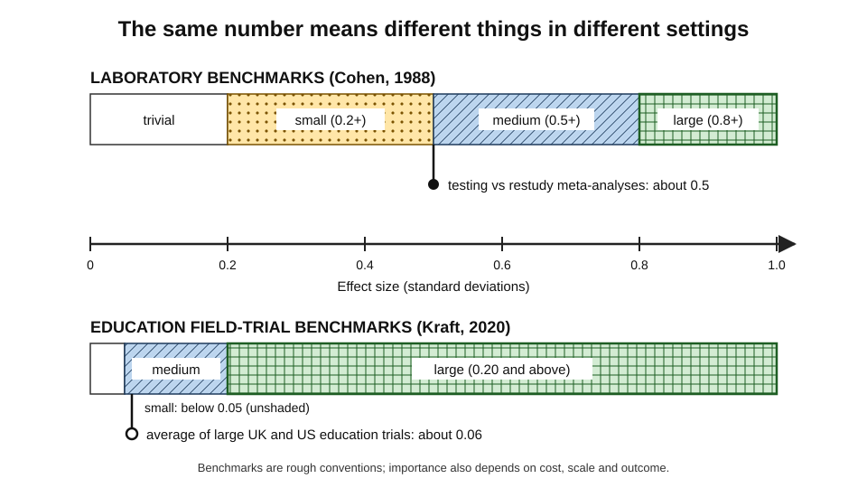
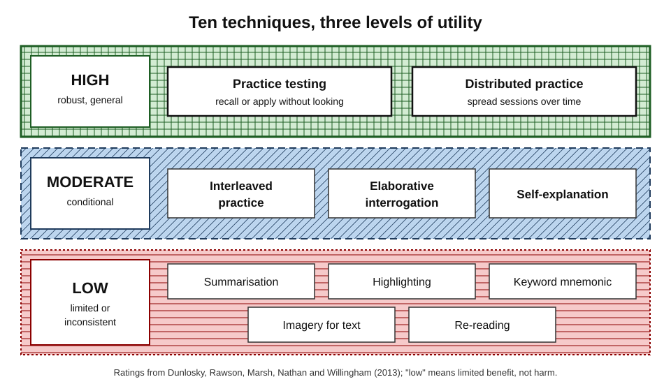
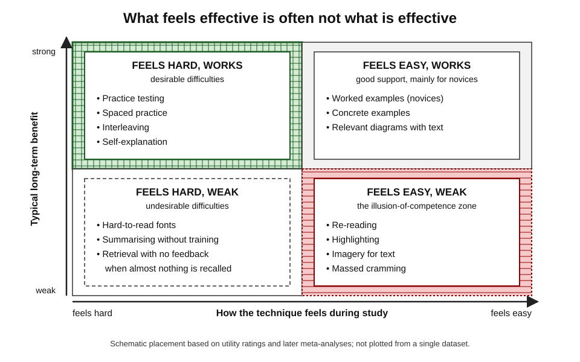
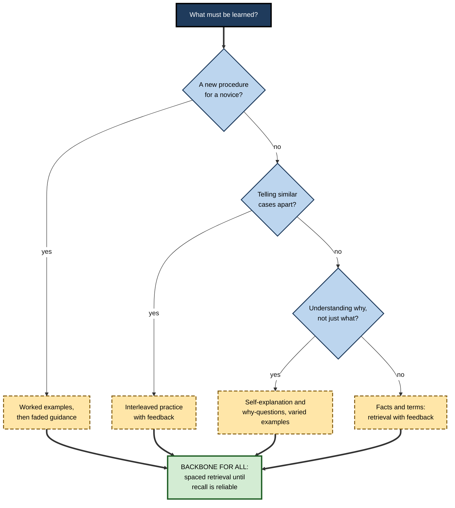
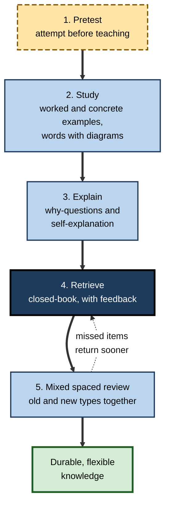

# A.10. Evidence-Based Learning Techniques

Two analysts prepare for the same cloud certification with the same forty hours. One reads the official guide twice, highlights it carefully and saves the practice exams for the last weekend. The other reads each chapter once, closes it, writes down what she remembers, checks, and returns to mixed practice questions every few days. Both feel prepared; only one passes comfortably and still remembers the material six months later on a client project. The difference is not talent or time — it is **technique**.

> **Definition — Evidence-based learning technique:** a study or practice method whose benefit for **durable, usable learning** has been shown in controlled comparisons against plausible alternatives, across a range of learners, materials and settings.

**Why it matters**

- The same hours can produce very different amounts of lasting learning depending on the method used.
- The most popular study habits — re-reading, highlighting, summarising in passing — are among the least effective.
- Training budgets, onboarding programmes, certification preparation and learning software all embed techniques, knowingly or not.
- In the AI era, a tool can apply a strong technique (quizzing the learner) or quietly remove it (supplying the answer); judging which needs knowledge of the evidence.

---

## What Counts as Evidence for a Technique

A technique is not "evidence-based" because it sounds scientific, appears in a popular book or is liked by learners. It earns the label only by beating an alternative on a fair test of learning.

### The four requirements of a fair test

- **A delayed criterion test** — learning is measured after days or weeks, not minutes.
  - Many techniques that win on an immediate test lose on a delayed one, and the reverse.
- **An active comparison condition** — the technique is compared with what learners would otherwise do.
  - *e.g.* retrieval practice vs **re-reading for the same time**, not vs doing nothing.
- **Equal time on task** — otherwise the "technique" is simply more study.
- **Random assignment** — learners or classes are allocated by chance, so that motivated learners do not self-select into the technique.

> **Watch out:** a technique "improves learning by 50%" means little until one asks **compared with what, measured when, and on what test**. Most inflated claims fail one of these three questions.

### Three settings, three kinds of evidence

| | Laboratory experiment | Classroom or course study | Field or workplace trial |
|---|---|---|---|
| Typical material | Word pairs, short texts, simple problems | Real course content | Job knowledge and skills |
| Control over conditions | High | Moderate | Low |
| Typical delay before test | Minutes to a week | Weeks to a term | Weeks to months |
| Main strength | Isolates the mechanism | Shows the effect survives real teaching | Shows effect on what organisations care about |
| Main weakness | May not generalise | Implementation varies by teacher | Many confounds; few true experiments |
| Typical effect size | Larger | Smaller | Smallest, most variable |

### Effect sizes and how to read them

> **Definition — Effect size:** a standardised measure of how large a difference is. **Cohen's d** and **Hedges' g** (a version corrected for small samples) express the difference between two group means in units of their standard deviation.

> **Formula — Standardised mean difference:** d = (mean of technique group − mean of comparison group) ÷ pooled standard deviation. Example: retrieval group 68%, re-reading group 58%, pooled SD 20 points → d = (68 − 58) ÷ 20 = **0.50**.

- **Cohen's (1988) rough benchmarks** — 0.2 small, 0.5 medium, 0.8 large.
  - Derived largely from laboratory psychology.
- **Matthew Kraft's (2020) benchmarks for education field studies** — below 0.05 small, 0.05 to 0.20 medium, 0.20 or more large.
  - Based on what randomised trials in real schools typically achieve.
- **Lortie-Forgues and Inglis (2019)** — reviewing over a hundred large randomised trials commissioned by UK and US education agencies, found the **average effect was about 0.06** and many confidence intervals were wide.

**Figure 1.** Two scales for judging effect sizes: laboratory benchmarks and education field-trial benchmarks.

> **Key point:** a laboratory effect of 0.5 and a field effect of 0.15 can describe the **same technique**. The shrinkage is expected — real settings add noise, partial implementation and weaker control conditions — and does not mean the technique has failed.

### Meta-analysis and its traps

> **Definition — Meta-analysis:** a statistical synthesis that combines effect sizes from many studies into an average estimate and examines what makes effects larger or smaller (moderators).

- **Strength:** reduces reliance on any single, possibly lucky, study.
- **Traps:**
  - **publication bias** — positive results are more likely to be published, inflating averages;
  - **mixed comparison conditions** — "vs re-reading" and "vs nothing" pooled together;
  - **apples and oranges** — vocabulary lists averaged with surgical skills;
  - **meta-meta-analysis** — averaging averages, as in John Hattie's *Visible Learning* (2009), hides the conditions that matter and has been widely criticised on statistical grounds.

> **Remember:** trust a technique most when **laboratory mechanism, classroom replication and meta-analysis agree** — and read the moderators, not just the average.

---

## The Landmark Ratings

### Study card — Dunlosky, Rawson, Marsh, Nathan and Willingham (2013)

- **Design:** a monograph reviewing several hundred studies of **ten** techniques that students can use on their own, chosen because they are popular or promising.
- **Four dimensions of generality** were used for every technique:
  - **learning conditions** — how, when and how much the technique is used;
  - **student characteristics** — age, ability, prior knowledge;
  - **materials** — vocabulary, texts, maths, science, skills;
  - **criterion tasks** — recall, comprehension, problem-solving, delay.
- **Results:** each technique received an overall **utility** rating — high, moderate or low.
  - **High:** practice testing; distributed practice.
  - **Moderate:** interleaved practice; elaborative interrogation; self-explanation.
  - **Low:** summarisation; highlighting and underlining; the keyword mnemonic; imagery for text; re-reading.
- **Conclusion:** the two most effective techniques are cheap, general and under-used; the most popular techniques are among the weakest.

| Technique | What the learner does | Utility | Main reason for the rating |
|---|---|---|---|
| **Practice testing** | Recalls or applies material without looking: flashcards, past papers, free recall | High | Large, robust benefits across ages, materials and delays |
| **Distributed practice** | Spreads study of the same material across sessions | High | Robust long-term gains across a very wide range of conditions |
| **Interleaved practice** | Mixes different problem types within a session | Moderate | Strong in maths and category learning; thinner elsewhere |
| **Elaborative interrogation** | Answers "why is this true?" about stated facts | Moderate | Helps fact learning; less tested on complex material and long delays |
| **Self-explanation** | Explains how new information or each solution step fits together | Moderate | Helps understanding and transfer; costs time; needs prompting |
| **Summarisation** | Writes summaries of texts | Low | Helps only learners already trained to summarise well |
| **Highlighting / underlining** | Marks text while reading | Low | Little benefit; may narrow attention to isolated facts |
| **Keyword mnemonic** | Links a word to a sound-alike image | Low | Works for some vocabulary; fades quickly; limited scope |
| **Imagery for text** | Forms mental images while reading | Low | Benefits limited to imageable texts and short delays |
| **Re-reading** | Reads material again | Low | Small gains for its cost, especially when massed |

**Figure 2.** The ten techniques grouped by their overall utility rating.

> **Watch out:** "low utility" does **not** mean useless or harmful. It means the benefits were limited, inconsistent or dependent on training. Re-reading once before retrieval is reasonable; re-reading **instead of** retrieval is the error.

### What later syntheses changed

- **Donoghue and Hattie (2021)** re-examined the ten techniques by meta-analysis of over two hundred studies.
  - The broad ordering held — practice testing and distributed practice near the top.
  - Most techniques, including several rated low, still produced some benefit over **no** strategy, reinforcing that "low" is relative.
- **Classroom meta-analyses of quizzing** — Chunliang Yang and colleagues (2021) pooled over two hundred classroom studies and found a **reliable benefit of roughly half a standard deviation** for quizzing over other conditions, across school and university levels and subjects.
- **Systematic review of school studies** — Pooja Agarwal, Ludmila Nunes and Janell Blunt (2021) found that most applied experiments in real classrooms produced medium or large benefits of retrieval practice.
- **Mathematics specifically** — recent syntheses find robust spacing benefits but weaker, less consistent benefits of retrieval practice in maths than in fact- and text-based subjects.

> **Key point:** a decade of further research has **confirmed the top of the ranking** and **qualified the middle** — interleaving, elaboration and self-explanation are conditional techniques, strong in some materials and weak in others.

---

## The Wider Toolkit

Dunlosky's ten were chosen as techniques learners use alone. Other well-supported methods are usually built into instruction by a teacher, trainer or tool.

- **Worked examples** — studying a fully solved problem before solving similar ones.
  - **John Sweller and Graham Cooper (1985)** showed novices learned algebra procedures faster from worked examples than from solving the same problems.
  - Benefit **reverses** as expertise grows (**expertise reversal effect**, Slava Kalyuga and colleagues, 2003).
- **Concrete examples** — anchoring abstract ideas in several varied cases.
  - Varied examples help learners extract the principle rather than the surface story.
- **Dual coding** — combining words with relevant visuals.
  - Based on Allan Paivio's dual coding theory (1971) and Richard Mayer's multimedia research.
  - Decorative pictures do not count and can distract.
- **Pretesting and generation** — attempting answers before instruction.
  - Even wrong guesses can improve later memory for the correct answer when feedback follows (e.g. Lindsey Richland, Nate Kornell and Liche Kao, 2009).
  - Builds on the **generation effect** (Norman Slamecka and Peter Graf, 1978): self-generated information is remembered better than read information.
- **Successive relearning** — retrieving each item to a set criterion (e.g. correct three times), then repeating the cycle in later sessions.
  - Combines retrieval and spacing; Katherine Rawson and John Dunlosky have shown large, durable gains in real university courses.
- **Feedback** — information about the gap between the attempt and the target.
  - Makes retrieval safer (errors are corrected) and turns tests into learning.
- **Generative learning activities** — Logan Fiorella and Richard Mayer (2016) grouped eight: summarising, mapping, drawing, imagining, self-testing, self-explaining, teaching and enacting.
  - Common mechanism: the learner **selects, organises and integrates** information rather than receiving it.

> **Definition — Desirable difficulty (Robert Bjork):** a condition that makes practice harder and slower but improves long-term retention or transfer, provided the learner can eventually succeed.

**Two consensus lists that agree**

- **Pashler and colleagues (2007)**, a US Institute of Education Sciences practice guide, made seven recommendations:
  1. space learning over time;
  2. interleave worked examples with problem-solving;
  3. combine graphics with verbal descriptions;
  4. connect abstract and concrete representations;
  5. use quizzing to promote learning;
  6. help learners judge what they know (e.g. delayed self-assessment);
  7. ask deep explanatory questions.
- **Yana Weinstein, Christopher Madan and Megan Sumeracki (2018)** distilled **six strategies**: spaced practice, retrieval practice, elaboration, interleaving, concrete examples and dual coding.

> **Mnemonic — "Some Really Excellent Ideas Can Do":** Spacing, Retrieval, Elaboration, Interleaving, Concrete examples, Dual coding.

---

## The Evidence Landscape Technique by Technique

### Retrieval practice

**Study card — Roediger and Karpicke (2006)**

- **Design:** students read short prose passages under three schedules in four periods.
  - Study four times (SSSS).
  - Study three times, test once (SSST).
  - Study once, test three times (STTT) — free recall, no feedback.
- **Results:**
  - **Five minutes later:** repeated study won.
  - **One week later:** the pattern reversed — repeated testing recalled about **61%** of idea units versus about **40%** after repeated study.
  - Students predicted the **opposite** — those who restudied felt more confident.
- **Conclusion:** retrieval produces more durable memory than restudy, but the benefit appears only after a delay and is invisible to the learner.

- **Meta-analytic picture:**
  - **Christopher Rowland (2014)** — testing vs restudy, average **g ≈ 0.50**; larger with feedback and when initial retrieval is mostly successful.
  - **Olusola Adesope, Dominic Trevisan and Narayankripa Sundararajan (2017)** — practice testing across settings, average **g ≈ 0.6**; benefits held for different test formats and in classrooms.
  - **Steven Pan and Timothy Rickard (2018)** — **transfer** of test-enhanced learning to new questions is real but smaller and depends strongly on whether the practice and final questions share underlying content.
- **Mechanisms proposed:**
  - **elaborative retrieval** — searching memory activates related knowledge and adds routes to the target;
  - **episodic context** — each retrieval updates the memory with a new context, making it easier to find later;
  - **indirect effects** — testing reveals gaps and improves later study.

> **Definition — Testing effect (retrieval practice effect):** the finding that retrieving information from memory improves its later retention more than an equivalent period of restudy.

### Spacing

- **Strength of evidence:** among the most replicated findings in psychology, dating back to Hermann Ebbinghaus (1885).
- **Nicholas Cepeda and colleagues (2006)** — meta-analysis of several hundred experiments: spaced practice beat massed practice for verbal material across a wide range of conditions.
- **Optimal gap depends on the retention goal** — Cepeda and colleagues (2008) found that the best gap between sessions **grows with how long the material must be retained**.
- **Classroom reality:** benefits survive in real courses, but schedules must be built into the curriculum — learners rarely space on their own.
- **Contested detail:** whether **expanding** gaps beat **equal** gaps is not settled; the main finding is that spacing beats massing.

> **Definition — Spacing effect (distributed practice effect):** better long-term retention when study of the same material is spread across separated sessions rather than massed into one.

### Interleaving

- **Mechanism:** mixing problem types forces the learner to **identify which method fits** each problem — the skill that blocked practice never exercises — and highlights the differences between similar categories.
- **Study card — Kornell and Bjork (2008)**
  - **Design:** participants learned painters' styles from paintings shown either **blocked** (all of one artist, then the next) or **interleaved**.
  - **Results:** interleaving produced better identification of **new** paintings by the same artists.
  - **Twist:** most participants judged blocking to have been as good or better.
  - **Conclusion:** interleaving helps discrimination learning, and learners systematically misjudge it.
- **Marion Brunmair and Tobias Richter (2019)** — meta-analysis: overall moderate benefit (about **g ≈ 0.4**), strong for visually similar categories such as paintings, unreliable for expository texts and **negative** for some word-learning tasks.
- **Classroom evidence in mathematics** — Doug Rohrer and colleagues (2020) ran a randomised trial in dozens of US seventh-grade classes: interleaved homework assignments produced a **large** advantage on a test given a month later.

> **Definition — Interleaved practice:** mixing different but related problem types or categories within a practice session, as opposed to **blocked practice**, which completes one type before moving to the next.

### Elaboration and self-explanation

- **Elaborative interrogation** — answering "why would this be true?" about a stated fact.
  - Michael Pressley and colleagues (1987) found large benefits for fact learning.
  - Works best when learners have enough **prior knowledge** to produce a sensible answer.
- **Self-explanation** — explaining to oneself how each step or statement follows.
  - **Michelene Chi and colleagues (1989)** — strong physics students explained worked examples to themselves far more often than weaker students.
  - Later meta-analysis (Kiran Bisra and colleagues, 2018) found a moderate average benefit, larger when prompts are specific.
- **Cost:** both take time; vague, unprompted explanations add little.

### The weak techniques, and why they persist

- **Re-reading** increases **fluency**, which feels like knowing; massed re-reading adds little after the first reading.
- **Highlighting** is usually done passively and indiscriminately; trained, selective highlighting does somewhat better.
- **Summarisation** helps learners who can identify main ideas and paraphrase — a skill many learners lack.
- **Popularity:** Jeffrey Karpicke, Andrew Butler and Henry Roediger (2009) found that most university students re-read as a study strategy and few self-tested **to learn** — self-testing, when used, was mainly to check knowledge.

**Figure 3.** How easy each technique feels during study compared with how much it typically helps long-term learning.

> **Watch out:** not every difficulty is desirable. Printing study material in a hard-to-read font was once claimed to improve memory; large replications, including tests of the specially designed "Sans Forgetica" typeface (2020), found **no benefit**. Difficulty helps only when it makes the learner do the processing that builds memory — retrieving, discriminating, explaining.

---

## Boundary Conditions

Every technique works under some conditions and weakens or reverses under others. These boundaries are where professional judgement is needed.

| Technique | Works best when | Weakens or reverses when |
|---|---|---|
| Retrieval practice | Feedback follows; most attempts eventually succeed; final use needs recall or application | Initial success is very low and no feedback is given; questions test trivia, not the target knowledge |
| Spacing | Gaps are matched to how long the knowledge must last | Gaps are so long that everything must be relearned from scratch |
| Interleaving | Categories are easily confused; basics of each type are already known | Novices meet several new types at once; topics are unrelated |
| Worked examples | Learners are novices in the procedure | Learners are already competent — expertise reversal |
| Elaborative interrogation | Learners have relevant prior knowledge | Learners know too little to generate sensible explanations |
| Self-explanation | Prompts are specific; explanations are checked | Unprompted, vague or unchecked explanations |
| Pretesting | Correct answers and feedback follow promptly | Wrong guesses are never corrected |

### Learner characteristics

- **Prior knowledge** — the strongest moderator of almost every technique.
  - Novices benefit from structure (worked examples, guided retrieval); experts from challenge (problem-solving, interleaving).
- **Age and working memory** — techniques generalise across ages from primary school to older adults, though the best form of each differs.
- **Test anxiety** — low-stakes retrieval practice does not appear to increase anxiety and may reduce it for some learners, because the final test feels familiar; high-stakes framing can undermine it.

### Material characteristics

- **Simple vs complex material** — Tamara van Gog and John Sweller (2015) argued the testing effect shrinks for **high element-interactivity** material such as complex problem-solving.
  - Jeffrey Karpicke and William Aue (2015) replied that retrieval benefits for complex texts are well documented.
  - The debate is **unresolved**; a reasonable reading is that retrieval helps complex material when learners have enough foundation to retrieve meaningfully.
- **Fact vs concept vs skill** — spaced retrieval suits facts and concepts; skills also need **practice with feedback** under realistic conditions.

### Criterion characteristics

> **Definition — Transfer-appropriate processing (Morris, Bransford and Franks, 1977):** memory performance is best when the processing during learning matches the processing demanded at test.

- Practising **recognition** prepares for recognition; practising **application** prepares for application.
- **Implication:** design retrieval tasks that look like the real use — case questions for consultants, debugging tasks for engineers, patient scenarios for clinicians.

---

## Choosing Among Techniques

No single technique fits every goal. The choice starts from what must be learned and what the learner already knows.

**Figure 4.** Choosing a technique from the learning goal and the learner's starting point.

### Matching technique to goal

| Learning goal | Primary techniques | Why they fit | Typical error |
|---|---|---|---|
| Facts, terms, codes, vocabulary | Spaced retrieval, successive relearning | Memory strength needs repeated, spaced access | Passive re-reading of lists |
| Concepts and principles | Varied concrete examples, elaboration, self-explanation, then retrieval | Understanding needs connection to prior knowledge | Memorising definitions without examples |
| New procedures | Worked examples, then practice with feedback | Reduces overload for novices | Throwing novices straight into open problems |
| Choosing the right method | Interleaved practice | Trains recognition of problem type | Blocked chapter-by-chapter exercises only |
| Applying to new situations | Varied practice, case-based retrieval, explanation of deep structure | Transfer depends on recognising the principle beneath the surface | Practising only the textbook's exact cases |

### Three cost–benefit questions

1. **How much time does it add?** Self-explanation and elaboration are slow; quizzing is cheap.
2. **How easy is it to implement correctly?** Spacing requires a schedule; interleaving requires a bank of mixed problems.
3. **How large is the benefit for this material?** Interleaving is worth the effort for confusable categories; less so for unrelated topics.

> **In practice:** when in doubt, **replace re-reading with retrieval and spread sessions out**. These two changes rarely do harm, cost little and carry the strongest evidence.

---

## Combining Techniques

Techniques are not rivals. The strongest designs layer them so that each covers another's weakness.

### Principles of combination

- **Spaced retrieval is the backbone.** Almost every well-designed system returns to retrieval at growing intervals.
- **Elaboration lives inside feedback.** After each retrieval attempt, asking *why* the answer is right turns a recall check into understanding.
- **Interleave the retrieval sets.** Once basics are known, mixed review questions combine spacing (old material returns) with interleaving (types are mixed).
- **Worked examples first, retrieval after.** Novices study a solved case, then attempt a similar one from memory; guidance fades as competence grows.
- **Pretest at the start of each new topic.** It primes attention and exposes misconceptions before instruction.

**Figure 5.** One way of combining techniques into a cycle for each topic.

### Do effects add up?

- **Not simply.** Two techniques with d ≈ 0.5 each do not produce d ≈ 1.0 together; they often work through overlapping mechanisms.
- **Successive relearning** is the best-studied combination (retrieval + spacing + feedback to criterion) and shows large, lasting gains in real courses.
- **Most combinations are untested as packages.** The combination principles above are reasonable inferences from mechanism, not proven formulas.

> **Key point:** combine techniques to **cover different goals** (memory, understanding, discrimination, transfer), not in the hope that every effect stacks.

### Worked example: redesigning certification preparation

- **Situation:** a consultant has eight weeks and about five hours a week to prepare for a professional cloud-architecture certification.

| | Original plan | Evidence-based plan |
|---|---|---|
| Weeks 1–6 | Read the official guide cover to cover, highlighting key points | One domain per week: 10-question pretest, read once, closed-book recall of each section, check gaps |
| Understanding | Copy architecture diagrams | Redraw diagrams from memory and explain *why* each component is there |
| Practice questions | Saved for week 8 | Short **mixed** sets every week from week 2, covering all domains studied so far |
| Errors | Read the correct answer, move on | Log the error, explain the principle, re-test after a few days |
| Week 8 | Cram and re-read | Light spaced review plus one timed full exam |
| Likely feeling | Confident throughout | Less confident during study |
| Likely outcome | Borderline; much forgotten within months | Comfortable pass; knowledge usable on projects |

- **Reasoning:**
  1. Recognition reading is replaced with **retrieval**.
  2. One long final block is replaced with **weekly spaced** contact.
  3. Domain-by-domain practice is replaced with **interleaved** mixed sets.
  4. Errors become **elaboration** opportunities.

> **Watch out:** the evidence-based plan **feels worse** while it is working. Learners who judge progress by comfort abandon it in week three — the most common way good techniques fail.

---

## Why Good Techniques Go Unused

The gap between evidence and practice is wide, and its causes are well documented.

- **Fluency misleads.** Re-reading makes material feel familiar; retrieval exposes gaps and feels like failure.
- **Effort is misread.** Afton Kirk-Johnson, Brian Galla and Scott Fraundorf (2019) found learners interpret the effort of retrieval or interleaving as a sign of **poor** learning and so choose easier methods.
- **Benefits are delayed.** The advantage appears days later; the discomfort is immediate.
- **Schedules are hard.** Spacing needs planning across weeks; deadlines encourage cramming.
- **Teaching rarely models it.** Courses often present material blocked by chapter and test immediately.

> **In practice:** the most effective way to change a learner's technique is to let them **experience the delayed difference** — for example, study half a topic by re-reading and half by retrieval, then test both a week later.

---

## Techniques at Scale

### In professional education

- **Medicine:** B. Price Kerfoot and colleagues ran randomised trials of **spaced education** — short case-based questions delivered by email at intervals with explanations — and found improved knowledge retention among medical students and residents, and in some trials better clinical behaviour.
- **Residency training:** Douglas Larsen, Andrew Butler and Henry Roediger (2009) showed repeated testing of residents produced better long-term retention than repeated study of the same material.
- **Aviation, military and safety-critical work:** recurrent training, scenario-based checks and spaced proficiency testing are long-standing practice, built on the same principles.

### In software

- **Spaced-repetition systems** — the Leitner box (Sebastian Leitner, 1970s); SuperMemo (Piotr Woźniak, from the late 1980s); Anki and similar tools.
  - Newer open-source schedulers such as **FSRS** (2020s) model each learner's memory to set intervals.
- **Language and knowledge apps** combine retrieval, spacing and feedback, with gamification for motivation.
- **Workplace "reinforcement" platforms** push spaced quiz questions after training.

> **Watch out:** vendors often cite "people forget 70% within 24 hours" with an Ebbinghaus curve. Ebbinghaus studied **nonsense syllables** in himself; forgetting of meaningful, well-learned material is slower and highly variable. The direction of the claim is right; the precise figure is marketing.

### With AI tutors

- **What AI makes cheap:** question generation, instant feedback, adaptive spacing, explanations on demand, Socratic dialogue.
- **Study card — Kestin, Miller and colleagues (2025)**
  - **Setting:** a randomised crossover study in an introductory physics course at Harvard.
  - **Groups:** the same students learned some topics in an active-learning class and others with an AI tutor engineered around good pedagogy — prompting thought, giving feedback, managing load, not just answering.
  - **Results:** learning gains with the AI tutor were substantially larger — roughly double — in less time, and students reported higher engagement.
  - **Conclusion:** an AI tutor **designed around evidence-based techniques** can outperform even a good classroom; a single course and short-term outcomes limit generality.
- **The opposite result:** when AI simply supplies answers during practice, practice scores rise and later unaided performance can fall — the learner skips the retrieval and explanation that build memory.

> **Key point:** with AI, the technique matters more than the tool. **The learner must do the retrieving, discriminating and explaining**; the AI should prompt, quiz, check and give feedback.

### Case study: spaced scenario training for medication safety

- **Situation:** a regional hospital group delivered annual half-day medication-safety training to nurses and junior doctors.
- **Problem:** immediate post-course quizzes were excellent, but incident reviews kept finding the same errors — look-alike drug names, renal dose adjustments, high-risk infusion calculations.
- **Diagnosis:**
  - one massed session per year — no spacing;
  - multiple-choice quiz straight after teaching — recognition, not retrieval, and no delay;
  - teaching blocked by drug class — no practice in distinguishing look-alike cases;
  - no feedback loop from incidents back into training.
- **Actions:**
  1. Cut the annual session to two hours, built around **pretest questions** and worked calculation examples.
  2. Added **two short scenario questions per week** on staff phones for three months, with explanations and gaps that grew as items were answered correctly.
  3. Mixed look-alike drug pairs and calculation types in the same question sets (**interleaving**).
  4. Fed anonymised incident patterns into new questions each quarter.
  5. Replaced the immediate quiz with a **delayed, unaided calculation and scenario check** at three months.
- **Result:** delayed check scores rose markedly compared with the previous cohort; pharmacists reported fewer repeat errors of the targeted types over the following year.
- **Side effects / caveats:**
  - some staff found the weekly questions intrusive during busy shifts — completion dipped until questions were made skippable and limited to two;
  - error reduction also coincided with a new electronic prescribing alert, so the training's share of the improvement is uncertain.
- **Lesson:** the techniques themselves were simple; the gains came from **spacing them into working life, mixing confusable cases, and measuring after a delay**.

### Evaluating a technique-based programme honestly

- **Baseline** — compare with the previous design or a randomly chosen comparison group.
- **Delay** — test weeks after training, without help.
- **Target outcomes** — measure the behaviours that matter, not only quiz scores.
- **Realistic expectations** — effects of 0.1 to 0.3 in a real organisation are meaningful at scale.
- **Implementation fidelity** — check whether the spacing, mixing and feedback actually happened as designed.

---

## Open Questions

- **How far does retrieval practice transfer?**
  - Benefits for the exact content practised are robust; transfer to related but unpractised content is smaller and inconsistent across studies.
- **Why are classroom effects so variable?**
  - Some courses show clear benefits and others little; teacher implementation, question quality and learner uptake are suspected but not fully understood.
- **What is the best schedule for real learners?**
  - Algorithms optimise intervals for single facts; schedules for interconnected concepts and skills are much less studied.
- **Which techniques suit complex, ill-structured professional knowledge?**
  - Most evidence comes from facts, texts and well-structured problems; judgement in law, management or medicine is far less studied.
- **Can learners be persuaded to keep using effortful techniques?**
  - Knowing the evidence changes behaviour only modestly; durable habit change is poorly understood.
- **Will AI tutors preserve desirable difficulty?**
  - Early trials of well-designed tutors are promising, but commercial tools are optimised for satisfaction and speed, which pull in the opposite direction.

---

## Summary

- An **evidence-based technique** beats a plausible alternative on a **delayed** test, with **equal time** and **random assignment**, across varied learners and materials.
- **Effect sizes** shrink from laboratory to classroom to workplace; judge field effects against field benchmarks (around 0.05–0.20 is meaningful), not Cohen's laboratory benchmarks.
- **Dunlosky et al. (2013):** **high** utility — practice testing, distributed practice; **moderate** — interleaving, elaborative interrogation, self-explanation; **low** — summarisation, highlighting, keyword mnemonic, imagery, re-reading. Later meta-analyses confirm the top and qualify the middle.
- Other well-supported methods: **worked examples** (for novices), concrete examples, dual coding, pretesting, **successive relearning**, feedback and generative activities.
- **Retrieval** shows robust benefits (g ≈ 0.5 in meta-analyses) that appear only after a delay; **spacing** is among psychology's most replicated findings; **interleaving** is strong for confusable categories and weak elsewhere.
- **Boundary conditions:** prior knowledge, retrieval success and feedback, material complexity (contested for complex problem-solving) and the match between practice and the final use.
- **Choose** techniques by goal; **combine** them with spaced retrieval as the backbone — effects do not simply add.
- Good techniques go unused because **fluency and effort mislead** and benefits are delayed.
- At scale, spaced scenario questions, spaced-repetition software and well-designed **AI tutors** apply the techniques cheaply; answer-giving AI removes them.

---

## Self-Check

1. What four features must a fair test of a learning technique have?
2. A vendor says its platform "improves learning by 40%". What three questions should be asked?
3. Name the two high-utility, three moderate-utility and five low-utility techniques in Dunlosky et al. (2013).
4. Why does "low utility" not mean "useless"? Give an example of reasonable use of a low-utility technique.
5. Describe Roediger and Karpicke (2006) and explain why students' predictions were wrong.
6. Why might a technique show d ≈ 0.5 in the laboratory and d ≈ 0.15 in a company? Is the second result disappointing?
7. When does interleaving help, and when can it hurt?
8. What is the expertise reversal effect, and what does it imply for training experienced staff?
9. Explain transfer-appropriate processing and design a retrieval task for a junior lawyer learning contract review.
10. Summarise the debate over the testing effect and complex material.
11. Why do the effects of combined techniques not simply add up?
12. A team wants to adopt "difficult fonts" to create desirable difficulty. Advise them.
13. Redesign a one-off, two-hour compliance workshop with an immediate quiz using at least four techniques, and describe how you would evaluate it.
14. An AI study tool generates summaries and answers students' questions instantly. What changes would bring it closer to the evidence?

### Answer Key

1. A delayed criterion test; an active comparison condition (what learners would otherwise do); equal time on task; random assignment of learners or classes.
2. Compared with what (nothing, or a realistic alternative)? Measured when (immediately or after a delay)? On what test (recognition of practised items, or real application)? Also: in what population and setting.
3. High: practice testing, distributed practice. Moderate: interleaved practice, elaborative interrogation, self-explanation. Low: summarisation, highlighting/underlining, keyword mnemonic, imagery for text, re-reading.
4. The rating reflects limited, inconsistent or training-dependent benefit, not harm. A single re-reading before closed-book recall, or trained summarising by a skilled reader, is reasonable; the error is using them **instead of** retrieval and spacing.
5. Students studied prose by repeated study or repeated free-recall testing. Restudy won at five minutes; testing won clearly at one week (about 61% vs 40%). Restudy produced fluency, which students mistook for learning, so they predicted the reverse.
6. Real settings add noise, imperfect implementation, varied learners and stronger "business as usual" comparisons, and measure more distant outcomes. By field benchmarks, 0.15 is a meaningful effect — worthwhile at scale.
7. It helps when categories or problem types are easily confused and learners know the basics of each, because it trains choosing the right method. It can hurt for novices meeting several new types at once and has shown no benefit or harm for some verbal learning.
8. Guidance that helps novices (worked examples) becomes redundant or harmful as expertise grows. Experienced staff should get problems, cases and challenges rather than step-by-step examples.
9. Learning works best when practice processing matches use. A suitable task: give an unseen contract and ask, from memory, for the three clauses that create the greatest risk to the client and why — not a multiple-choice quiz on clause definitions.
10. Van Gog and Sweller argued the testing effect shrinks for high element-interactivity problems; Karpicke and Aue pointed to retrieval benefits with complex texts. It is unresolved; retrieval probably helps when learners have enough foundation to retrieve meaningfully.
11. Techniques often share mechanisms (e.g. spacing and retrieval both involve effortful re-access), so benefits overlap; most combinations have not been tested as packages.
12. Disfluent fonts, including Sans Forgetica, failed to improve memory in large replications. Difficulty is desirable only when it makes the learner retrieve, discriminate or explain; use retrieval and spacing instead.
13. Pretest at the start; a shorter session with worked scenarios; closed-book retrieval breaks with feedback; spaced scenario questions over 6–8 weeks, mixing confusable rules; a delayed, unaided scenario check. Evaluate against the previous cohort or a randomly chosen group, at a delay, with behavioural evidence such as audit findings — expecting modest but meaningful effects.
14. Ask the student to attempt an answer or summary first; quiz rather than summarise; give hints before answers; schedule spaced, mixed review of earlier material; prompt "why" explanations; check its own generated content for accuracy.

---

## Glossary

| Term | Meaning |
|---|---|
| Blocked practice | Practising one problem type repeatedly before moving to the next. |
| Cohen's d | Difference between two means divided by the pooled standard deviation. |
| Concrete examples | Specific cases used to illustrate and anchor abstract ideas. |
| Desirable difficulty | A condition that slows practice but improves long-term learning, if the learner can succeed. |
| Distributed practice | Spreading study of the same material across separate sessions. |
| Dual coding | Combining verbal information with relevant visual representations. |
| Effect size | A standardised measure of the size of a difference between conditions. |
| Elaborative interrogation | Generating explanations of why stated facts are true. |
| Evidence-based learning technique | A method shown in fair, controlled comparisons to improve durable learning. |
| Expertise reversal effect | Instructional support that helps novices becomes ineffective or harmful for experts. |
| Generation effect | Better memory for information the learner produces than for information read. |
| Hedges' g | A standardised mean difference corrected for small-sample bias. |
| Interleaved practice | Mixing related problem types or categories within a session. |
| Meta-analysis | Statistical synthesis of effect sizes across many studies. |
| Pretesting | Attempting questions on material before it is taught. |
| Publication bias | The tendency for positive results to be published more often, inflating averages. |
| Retrieval practice | Recalling or applying information from memory to strengthen it. |
| Self-explanation | Explaining to oneself how information or solution steps fit together. |
| Spacing effect | Better retention from spaced than from massed practice. |
| Successive relearning | Retrieving items to a criterion in each of several spaced sessions. |
| Testing effect | Better retention after retrieval practice than after equivalent restudy. |
| Transfer-appropriate processing | Memory is best when learning processes match those required at test. |
| Utility rating | Dunlosky et al.'s judgement of a technique's general usefulness: high, moderate or low. |
| Worked example | A fully solved problem used to teach a procedure. |
