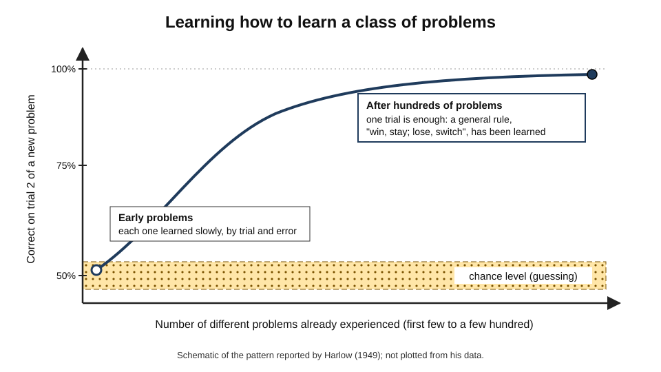
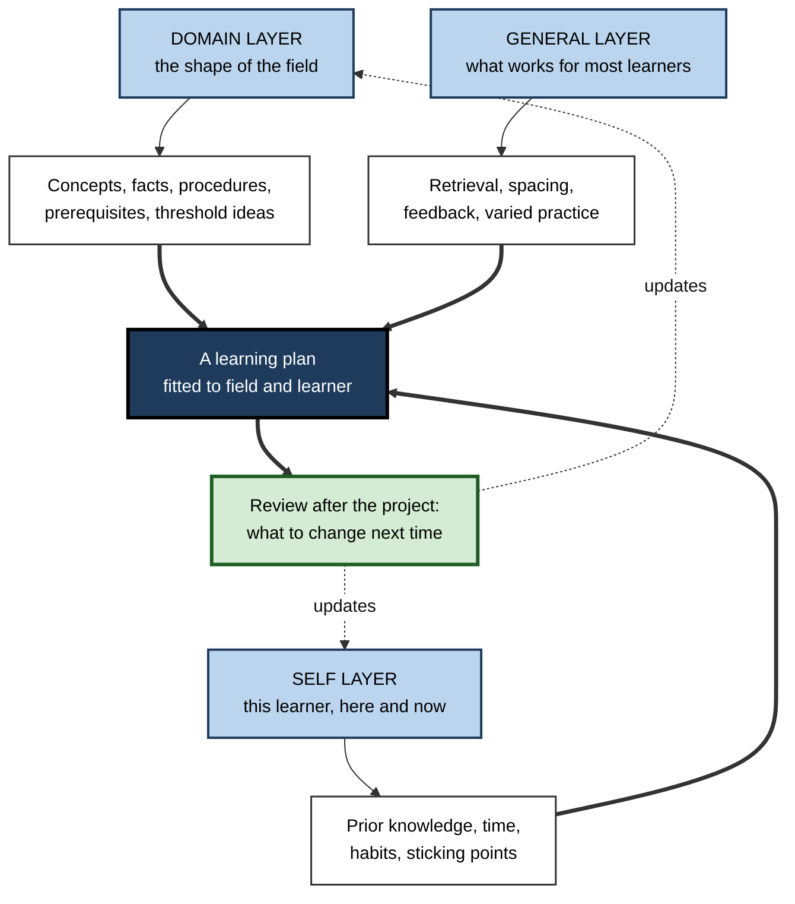
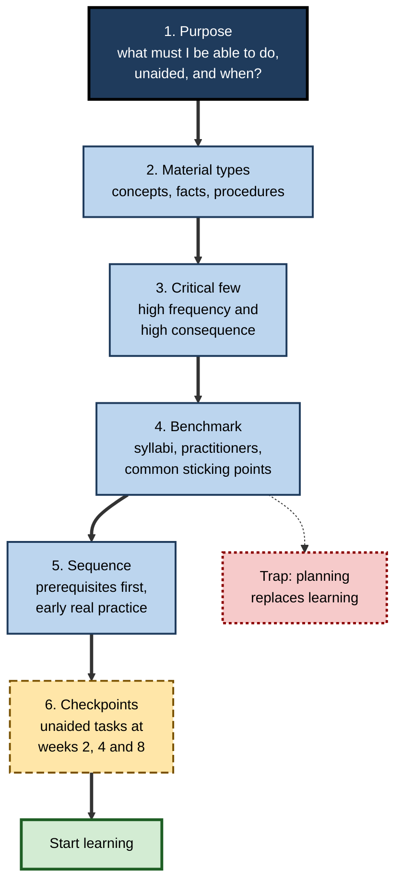
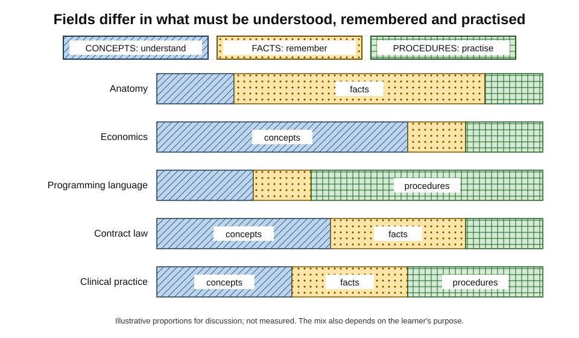
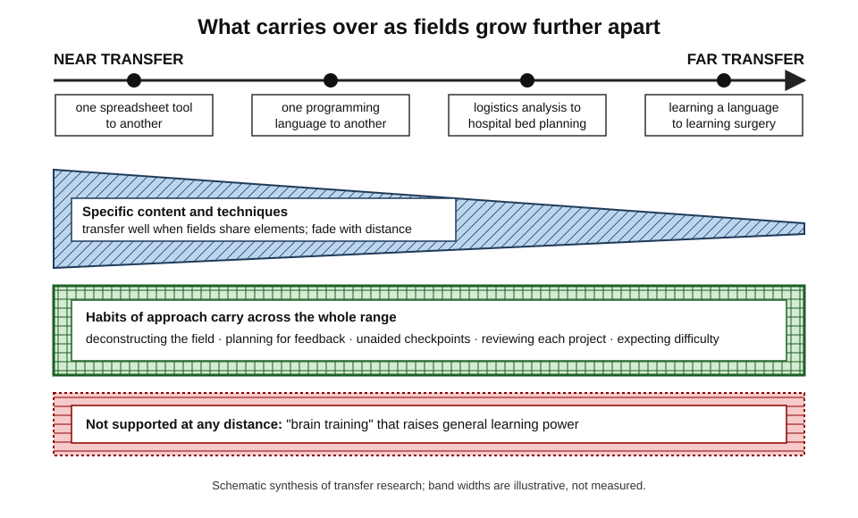
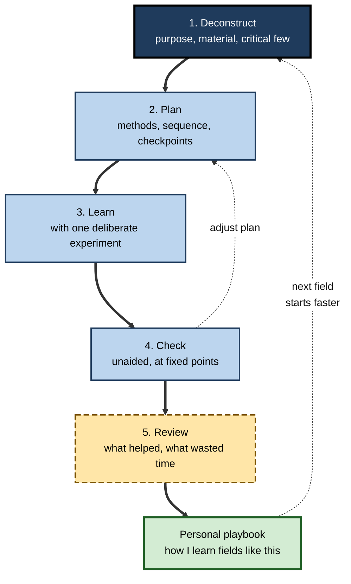

# A.11. Meta-Learning: Learning About Learning

An accountant who has already learned a programming language picks up a second one in a fraction of the time. A consultant who has entered five industries in ten years can be useful in a sixth within a fortnight, while a colleague entering their first new sector is still lost after two months. Neither is necessarily cleverer. Each has learned something beyond the content itself: **how to approach learning a new field**.

> **Definition — Meta-learning:** learning about one's own learning — the developed capability to analyse a new field, choose and sequence suitable ways of learning it, monitor progress, and carry lessons about learning from one domain to the next, so that each new field is learned faster and better than the last.

**Why it matters**

- Professionals change tools, domains and roles many times in a career; the speed of each transition compounds.
- Time spent learning the wrong things, in the wrong order or by the wrong methods is the largest hidden cost of reskilling.
- Organisations increasingly hire for **learnability** — the ability to become competent in something new — rather than for a fixed stock of knowledge.
- AI tools can generate a syllabus in seconds; judging whether it is the right syllabus is a meta-learning skill.

---

## Learning to Learn as a Skill

### The first experimental evidence

**Study card — Harry Harlow (1949)**

- **Design:** rhesus monkeys were given hundreds of simple discrimination problems.
  - Each problem used a new pair of objects; food was always under one of them.
  - Each problem lasted only a few trials before the next pair appeared.
- **Measure:** accuracy on the **second trial** of each new problem — the first trial is a guess, so trial 2 shows whether the monkey has learned from one piece of information.
- **Results:**
  - On early problems, trial-2 accuracy was barely above chance; each problem had to be learned slowly.
  - After a few hundred problems, trial-2 accuracy approached perfect — one trial was enough.
- **Conclusion:** the monkeys had learned a **general rule for that class of problem** ("if the first choice paid, stay; if not, switch"). Harlow called this a **learning set** — learning how to learn.

> **Definition — Learning set:** a general strategy for a class of problems, acquired through experience with many examples, that makes each new problem of that class faster to learn.

**Figure 1.** Harlow's learning-set effect: accuracy on the second trial of each new problem rises as more problems are experienced.

### The idea in human learning

- **Donald Maudsley (1979)** introduced "meta-learning" for the process by which learners become aware of, and increasingly in control of, their habits of perception, inquiry and learning.
- **John Biggs (1985)** used the term for students' awareness of their own approach to study — surface or deep — and their capacity to choose it deliberately.
- **Everyday evidence** of learning to learn:
  - people with several languages usually learn the next one faster;
  - experienced consultants absorb unfamiliar industries quickly;
  - software engineers pick up new frameworks rapidly once they have learned several.
- **Two sources of the speed-up** — easy to confuse:
  - **overlapping content** — the next field shares concepts, vocabulary or structure with earlier ones;
  - **general learning skill** — better ways of analysing, planning, practising and monitoring.

> **Key point:** much apparent "learning to learn" is really **transfer of content**. True meta-learning is the second source — and it is the one that helps even when the new field is unrelated.

### Meta-learning and its neighbours

| | Study skills | Metacognition | Self-regulated learning | Meta-learning |
|---|---|---|---|---|
| Core question | How do I study this material? | Do I understand this right now? | Am I managing my learning towards my goal? | How should I learn this kind of field, and how can I learn better next time? |
| Time scale | A study session | Moments within a task | A course or project | Across projects and years |
| Typical activity | Note-taking, timetabling, exam technique | Monitoring comprehension, judging confidence | Goal-setting, monitoring, reflection | Deconstructing domains, choosing approaches, reviewing learning projects |
| Main risk | Taught out of context | Poor calibration | Low motivation | Over-planning instead of learning |

> **Definition — Metacognition:** awareness and regulation of one's own thinking and knowledge during a task — knowing what one knows and adjusting strategy accordingly. It is the moment-to-moment engine on which meta-learning depends.

- **Self-regulated learning** — Barry Zimmerman's cycle of **forethought → performance → self-reflection** — provides the loop inside each learning project.
- **Meta-learning** sits one level higher: it improves the loop itself from project to project.

### Three layers of meta-learning

**Figure 2.** The three layers of knowledge that meta-learning draws on.

- **Domain layer** — how this field is structured and how competent people acquired it.
  - *e.g.* contract law is case- and principle-heavy; accounting depends on a few threshold ideas such as accruals.
- **Self layer** — what this particular learner brings and needs.
  - *e.g.* "I stall in week three unless I have a deadline"; "I already know statistics, so I can skip the first module".
- **General layer** — what the science of learning says works for most people.
  - *e.g.* retrieval beats re-reading; spaced sessions beat one long session.

> **Mnemonic — "Field, Self, Science":** know the territory, know the traveller, know the method.

### A mirror from machine learning

- In artificial intelligence, **meta-learning** names algorithms trained across many tasks so that a new task can be learned from few examples.
  - *e.g.* Chelsea Finn, Pieter Abbeel and Sergey Levine's model-agnostic meta-learning (2017) finds starting points from which new tasks are learned in a few steps.
- **Shared insight:** varied experience of *learning* tasks produces a learner that adapts faster to new ones.
- **Limit of the analogy:** machines adjust parameters; human meta-learning is largely conscious strategy, belief and habit.

---

## Deconstructing a New Field

Before learning anything, the meta-learner spends a short, bounded period learning **about** the field. David Ausubel (1968) put the reason plainly: the most important single factor influencing learning is what the learner already knows — so the first task is to find out what the new field demands and what the learner already has.

### Three practitioner frameworks

| | Why–What–How (Scott Young, *Ultralearning*, 2019) | DiSSS (Tim Ferriss, *The 4-Hour Chef*, 2012) | First 20 hours (Josh Kaufman, 2013) |
|---|---|---|---|
| First step | **Why** — the concrete purpose decides what matters | **Deconstruction** — break the skill into components | **Deconstruct** the skill into sub-skills |
| Selecting content | **What** — split into concepts, facts, procedures | **Selection** — the few components giving most of the result | Learn just enough to **self-correct** |
| Ordering | **How** — study how successful learners did it | **Sequencing** — the order that removes early blockers | **Remove barriers** to practice |
| Commitment | Spend a modest share of total time on this research up front | **Stakes** — consequences that keep practice going | Commit to roughly **20 hours** of focused practice |
| Evidence base | Practitioner synthesis and case studies | Personal experiments and interviews | Personal experiments |

> **Watch out:** none of these frameworks has been tested in controlled experiments. They are coherent with learning research — prior knowledge, goal clarity, early feedback, focus on high-frequency material — but their specific numbers (such as "20 hours") are heuristics, not findings.

### Step 1 — Purpose

- **A concrete purpose prunes the field.**
  - "Learn data science" has no boundary.
  - "Build and explain a churn model for the subscription business within three months" tells the learner what to skip.
- **Purpose sets the criterion** — what the learner must eventually be able to *do*, unaided, and in what situation.

### Step 2 — Material types

- **Concepts** — ideas to understand.
  - *e.g.* why an index speeds up a query; what "materiality" means in audit.
- **Facts** — items to remember.
  - *e.g.* function names; regulatory thresholds; drug doses.
- **Procedures** — performances to practise until fluent.
  - *e.g.* writing a query; conducting a discovery call; suturing.
- **Why the split matters** — each type needs different learning methods:
  - concepts → explanation, varied examples, self-explanation;
  - facts → spaced retrieval;
  - procedures → practice with feedback, from worked examples to independent performance.

### Step 3 — The critical few

- **Most fields have a skewed core.** A small set of concepts, tools or vocabulary covers most real use.
  - *e.g.* in a language, a few thousand of the most frequent word families cover the large majority of words in ordinary text.
  - *e.g.* in a new analytics tool, a handful of operations covers most daily tasks.
- **Find the core by frequency, not by the textbook's order.** Textbooks are organised for completeness; practice is organised for frequency and consequence.
- **Also find the high-consequence rare items** — the ones that are seldom needed but costly to get wrong (e.g. data-protection breach rules).

### Step 4 — Benchmarking how others learned

- **Sources:** several syllabi from respected programmes; two or three practitioners; experienced learners' accounts.
- **Look for:** what everyone teaches first; what everyone says was wasted time; where most learners get stuck.
- **Caution about expert accounts:**
  - much expert knowledge is **tacit** — experts often cannot state what they actually do;
  - research using **cognitive task analysis** (structured interviews and observation designed to surface expert decisions) finds that experts' unaided explanations omit many of the decisions they actually make.

> **In practice:** ask experts **what they would do in a specific case** rather than "how do you learn this?" — cases surface tacit knowledge that general questions miss.

**Figure 3.** A procedure for deconstructing a new field before learning it.

### Step 5 — Sequencing

- **Prerequisites first** — ideas that later ideas depend on.
  - *e.g.* in finance, the time value of money before valuation.
- **Early real practice** — a small, genuine task in the first week exposes what matters and motivates.
- **Simple-to-complex whole tasks** — Jeroen van Merriënboer's **four-component instructional design (4C/ID)** model sequences realistic **whole tasks** from simple to complex, rather than teaching all parts in isolation first.

### Step 6 — Checkpoints

- **Unaided checkpoints** at fixed points turn vague progress into evidence.
  - *e.g.* week 2: explain the business model of a hospital from memory; week 4: build a basic capacity analysis without a tutorial.
- **Checkpoints also test the plan** — a missed checkpoint is information about the method, not only about the learner.

> **Remember:** deconstruction should take **hours, not weeks** — a modest fraction of the total learning time. Its purpose is to start learning sooner and better, not later.

---

## Mapping a Field's Structure

### How experts and novices organise a field

**Study card — Chi, Feltovich and Glaser (1981)**

- **Design:** physics experts (graduate students and faculty) and novices (undergraduates) sorted mechanics problems into groups by similarity.
- **Results:**
  - Novices grouped by **surface features** — "inclined-plane problems", "pulley problems".
  - Experts grouped by **deep principles** — "conservation of energy", "Newton's second law".
- **Conclusion:** expertise is not only more knowledge but knowledge **organised around principles**, which makes it retrievable for new problems.

- **Implication for meta-learning:** a field map should be organised by **principles and how they connect**, not by the chapter list.
- **Related finding:** William Chase and Herbert Simon (1973) showed chess masters recall meaningful positions far better than novices but not random positions — their advantage lies in **chunks** of structured knowledge.

### Concept maps

> **Definition — Concept map (Joseph Novak):** a diagram of concepts linked by labelled relationships ("causes", "is a type of", "requires"), showing how ideas in a field connect.

- **John Nesbit and Olusola Adesope (2006)** — meta-analysis: studying or constructing concept maps produced moderate benefits for retention and transfer compared with reading texts, lists or outlines.
- **Caution:** Jeffrey Karpicke and Janell Blunt (2011) found retrieval practice beat concept mapping for learning science texts — even on tests requiring inferences.
  - **Reconciliation:** maps are useful for **seeing structure**; retrieval is needed for **remembering it**. Drawing the map **from memory** combines both.

### Threshold concepts and prerequisites

> **Definition — Threshold concept (Jan Meyer and Ray Land, 2003):** an idea that, once understood, transforms how a field is seen — often troublesome to learn, hard to unlearn, and integrative of other ideas.

- *e.g.* **opportunity cost** in economics; **recursion** in programming; **accruals** in accounting; **statistical variation** in data science; **precedent** in common law.
- **Meta-learning use:** identify threshold concepts early, allocate extra time, expect a period of confusion ("liminality"), and check them with explanation tasks.

### The shape of a field

- Fields differ in their **mix** of concepts, facts and procedures — and the mix decides where learning time should go.

**Figure 4.** Different fields demand different mixes of concepts, facts and procedures.

### Kind and wicked, well- and ill-structured

- **Kind vs wicked learning environments (Robin Hogarth, 2001)**
  - **Kind** — feedback is quick, accurate and consistent (chess, typing, many programming tasks).
  - **Wicked** — feedback is delayed, missing or misleading (strategy, hiring, many medical and investment decisions).
- **Well- vs ill-structured domains (Rand Spiro and colleagues' cognitive flexibility theory, late 1980s)**
  - **Well-structured** — general principles apply cleanly across cases.
  - **Ill-structured** — each case combines principles differently; learning requires many varied cases viewed from several angles.

| | Kind, well-structured field | Wicked, ill-structured field |
|---|---|---|
| Examples | Spreadsheet modelling, a programming language, bookkeeping | Management, negotiation, clinical diagnosis of complex cases, strategy |
| Feedback | Fast and accurate | Slow, noisy or absent |
| Best learning core | High-volume practice with feedback; retrieval of rules | Many varied cases; expert commentary; deliberate reflection; simulations |
| How to check progress | Unaided tasks with clear right answers | Expert review of judgements; calibration against later outcomes |
| Main meta-learning risk | Over-studying theory instead of practising | Confidence growing faster than accuracy |

> **Key point:** the first meta-learning question about any field is **"how will I know if I am right?"** — the answer determines most of the learning design.

---

## Choosing Strategies for a Field

### Match method to material and use

- **Concepts** → varied examples, self-explanation, teaching others, then retrieval of explanations.
- **Facts** → spaced retrieval to a criterion.
- **Procedures** → worked examples, then practice with feedback, then practice in realistic conditions.
- **Judgement** → many cases with expert feedback, prediction before outcome, review of errors.

### Directness

- **Directness** (Young's term) — learning as close as possible to the situation where the skill will be used.
  - *e.g.* learning a language through conversation rather than only through grammar drills; learning SQL by answering real business questions.
- **Why it works:** memory and skill are partly bound to their context of use, so practice that resembles real use transfers more readily.
- **Limit:** pure directness can overload novices; isolated **drills** remain useful for components that are bottlenecks.

### Feedback first

- **Ask early: where will feedback come from?**
  - Automatic (a compiler, a test suite, a scored exercise).
  - Human (a mentor, a reviewer, a client).
  - Delayed reality (outcomes months later).
- **If feedback is weak, build it** — create practice with known answers, find a reviewer, or record predictions to check later.

### Personal learning experiments

> **Definition — Personal learning experiment:** a small, deliberate comparison of two ways of learning on oneself, with a delayed check, to discover what works for this learner and this material.

- *e.g.* learn half a module's vocabulary by re-reading and half by flashcards; test both a week later.
- *e.g.* compare 20 minutes daily with two hours on Saturday for a month.
- **Value:** the learner experiences the delayed difference, which changes habits more than being told.
- **Limits:** one-person experiments are noisy and vulnerable to expectation; treat them as **calibration of habits**, not proof.

> **Watch out:** a personal experiment is **not** a test of "learning style". Results should be judged by delayed, unaided performance, not by which method felt more comfortable.

### Worked example: an accountant moving into data engineering

- **Situation:** a chartered accountant with strong spreadsheet skills has six months, about six hours a week, to become useful on a finance data-platform team.

| | Without meta-learning | With meta-learning |
|---|---|---|
| Start | Enrols in a 60-hour generic "data engineering" video course, from lesson 1 | Spends about five hours on deconstruction before starting |
| Purpose | "Learn data engineering" | "Build and maintain the monthly revenue pipeline, unaided, by month six" |
| Material split | None | Concepts: data modelling, idempotency, orchestration. Facts: SQL syntax, tool commands. Procedures: writing transformations, debugging failed runs |
| Critical few | Everything in the course, in order | SQL joins and window functions; the team's two core tools; testing data quality |
| Benchmark | None | Two team engineers say: "SQL first, tools second, cloud theory last; most people stall on debugging" |
| Practice | Course exercises | Small real tickets from week 3, reviewed by an engineer |
| Checkpoints | None until performance review | Month 1: write a revenue query unaided. Month 3: fix a failed pipeline run. Month 6: own the pipeline |
| Review | None | Monthly 20-minute review: what slowed me, what to change |

- **Reasoning steps:**
  1. Purpose narrowed the field from "data engineering" to one pipeline.
  2. The material split assigned methods: retrieval for syntax, practice for debugging.
  3. Benchmarking revealed the real sequence and the common sticking point.
  4. Checkpoints made progress visible and tested the plan.
- **Conclusion:** the second plan covers less of the generic syllabus and produces far more usable capability — and leaves the accountant with a reusable method for the next change.

> **Watch out:** prior expertise can **mislead** as well as help. The accountant's spreadsheet habit of fixing errors by hand conflicts with data engineering's principle of reproducible, automated transformations — an example of **negative transfer**.

---

## Transfer of Learning Skill Across Domains

The central claim of meta-learning is that something learned in one field makes **learning** the next field easier. The history of research on transfer is a history of caution about such claims.

### The fall of "training the mind"

- **Formal discipline doctrine** (19th century) — studying Latin, geometry or logic was thought to strengthen general mental faculties such as reasoning and memory.
- **Edward Thorndike and Robert Woodworth (1901)** — training on one task improved related tasks only to the extent they shared **identical elements**.
- **Modern echo — brain training:**
  - Daniel Simons and colleagues (2016) reviewed the evidence behind commercial brain-training claims: practice improved the trained tasks, little else.
  - Giovanni Sala and Fernand Gobet (2017) meta-analysed chess and music training: far-transfer effects on general cognitive or academic skills were small and shrank towards zero in better-designed studies.

> **Watch out:** claims that a puzzle, game or language "trains the brain" to learn everything faster are **not supported** by well-controlled evidence. What transfers is more specific.

### What does transfer

- **Low-road transfer** (Gavriel Salomon and David Perkins, 1989) — automatic transfer of well-practised skills to similar situations.
  - *e.g.* typing skill on a new keyboard.
- **High-road transfer** — deliberate abstraction of a principle and its mindful application elsewhere.
  - *e.g.* recognising that a hospital's bed-capacity problem is a queueing problem met earlier in logistics.
- **Preparation for future learning (John Bransford and Daniel Schwartz, 1999)** — the right test of transfer is often not "can the learner solve a new problem now?" but "can the learner **learn** the new field faster?"
  - This is precisely the claim of meta-learning, and it is easier to demonstrate than direct far transfer.

**Study card — Gick and Holyoak (1980)**

- **Design:** participants read a story about a general who captured a fortress by splitting his army into small groups converging from different directions; later they tried Karl Duncker's "radiation problem" (destroying a tumour with rays without harming healthy tissue).
- **Results:**
  - Few spontaneously used the analogous solution (many weak rays converging).
  - Most solved it once given a **hint** that the story was relevant.
- **Conclusion:** people often **possess** the transferable idea but fail to **notice** that it applies. Transfer depends heavily on recognising deep similarity.

- **Practical implications for meta-learners:**
  - compare **two or more** examples from different settings to extract the principle;
  - ask explicitly "what is this like that I already know?";
  - name principles so they can be recalled across contexts.

**Figure 5.** A spectrum from near to far transfer, and what typically moves across it.

### Does teaching learning skills work?

**Study card — Hattie, Biggs and Purdie (1996)**

- **Design:** meta-analysis of 51 studies of interventions to improve students' learning skills.
- **Results:**
  - interventions improved performance, especially on tasks close to those trained (**near transfer**);
  - effects were stronger when training was **embedded in the subject** being studied and combined with awareness of when and why to use a strategy;
  - stand-alone, generic study-skills courses transferred least.
- **Conclusion:** learning skills are best taught **in context**, with explicit attention to when they apply.

- **Later syntheses** of self-regulated learning training in schools (e.g. Charlotte Dignath and Gerhard Büttner, 2008) found meaningful effects on achievement, strongest when strategy instruction was combined with reflection on the strategies.
- **Large evidence reviews** for schools in England rate metacognition and self-regulation approaches among the **highest-impact, lowest-cost** options — while warning that impact depends on explicit, subject-embedded teaching.

| | Near transfer of learning skill | Far transfer of learning skill |
|---|---|---|
| Example | A study method learned in biology used for chemistry | Methods from learning a language used to learn surgery |
| Evidence | Good, especially when strategies are embedded and practised | Weak for content; plausible for general habits, planning and calibration |
| What carries over | Specific techniques, familiar task formats | Deconstruction habits, use of feedback, expectations about difficulty, review routines |
| How to encourage it | Practise strategies on real content with feedback | Name the strategy, compare across fields, run reviews after each project |

> **Key point:** meta-learning transfers best as **habits of approach** — deconstructing, planning for feedback, checking unaided, reviewing — rather than as any general increase in "learning power".

---

## Meta-Learning in Professional Life

### The meta-learning loop

**Figure 6.** The meta-learning loop: each learning project ends by improving the approach to the next.

- **The review step is what makes it meta-learning.** Without it, each project starts from zero.
- **Review questions that work:**
  - What accelerated learning most?
  - What consumed time without producing capability?
  - Where did confidence differ from checkpoint results?
  - What did the shape of this field turn out to be — and how did it differ from the first map?
  - What would be done differently in a similar field?

### Learnability in organisations

- **Learnability** — the capacity and willingness to acquire new skills quickly — is increasingly treated as a hiring and promotion criterion.
- **What organisations can build:**
  - **domain maps** — one-page "how to learn this here" guides for key technologies, products and processes, maintained by the people who use them;
  - **expert path sessions** — seniors work through real cases aloud for newcomers, surfacing tacit priorities;
  - **learning retrospectives** — after a team adopts a technology, a short review of what sped up or slowed down learning;
  - **time-to-competence measures** — how long newcomers take to reach defined independent tasks, tracked across cohorts.

> **In practice:** time-to-competence is the most useful single metric for meta-learning at organisational level — it captures whether the organisation is getting **better at making people good**.

### Meta-learning with AI

- **AI as map-builder:** an assistant can draft a syllabus, a list of prerequisites or common misconceptions in seconds.
  - **Risk:** confident errors, generic sequences and invented resources; verify with practitioners and authoritative material.
- **AI as practice partner:** generating questions, critiquing attempts, role-playing clients.
  - **Rule:** the learner attempts first; the AI gives feedback.
- **A new self-layer question:** *which parts of this field must I hold in my head, and which can I safely delegate to tools?*
  - Knowledge needed to **judge** AI output, act under time pressure or learn further must be internal.
- **Risk of skipped struggle:** if the AI deconstructs every field for the learner, the learner never builds the deconstruction skill.

### Case study: building industry-entry capability in a consulting practice

- **Situation:** a mid-sized consultancy regularly staffs analysts on clients in industries new to them — utilities, insurance, healthcare, logistics.
- **Problem:**
  - newly staffed analysts took many weeks to contribute; clients noticed;
  - each analyst prepared alone, mostly by reading long industry reports.
- **Diagnosis:**
  - no shared method for entering a new industry;
  - reading built familiarity but not the ability to discuss the client's economics unaided;
  - lessons from each engagement were lost when the team dispersed.
- **Actions:**
  1. Introduced a **two-day industry deconstruction protocol**: purpose (what the client needs from us), the critical few (business model, the five key metrics, regulation, main value chain), and three practitioner interviews framed around specific cases.
  2. Each analyst drew a **concept map of the industry's economics from memory** on day two and had it critiqued by a partner.
  3. **Unaided checkpoints**: by the end of week one, explain the client's economics in five minutes without notes.
  4. A **30-minute learning review** at the end of every engagement, with the industry map and "what I wish I had known first" stored for the next team.
  5. Time to first client-ready contribution was tracked for each new staffing.
- **Result:** analysts reached client-ready contribution noticeably sooner over the following year; partners reported better early client conversations; industry maps accumulated into a reusable library.
- **Side effects / caveats:**
  - some analysts treated the protocol as a form to complete — maps copied from previous teams added little until drawing from memory was enforced;
  - the improvement coincided with a more experienced intake, so its size is uncertain.
- **Lesson:** meta-learning becomes organisational capability when **the method is shared, practised on real cases and reviewed after every use**.

### Failure modes

- **Planning as procrastination** — endless research into how to learn replaces learning.
- **Tutorial loops** — following guided tutorials without ever attempting unaided work, so checkpoints are never met.
- **Copying another's path blindly** — ignoring different purpose and prior knowledge.
- **Map worship** — mistaking a well-drawn map for knowledge of the territory.
- **Skipping the review** — the most common omission, and the one that prevents improvement.

---

## Open Questions

- **Can general learning skill be measured?**
  - "Learnability" is widely used in hiring, but there is no well-validated measure separating learning skill from prior knowledge, intelligence and motivation.
- **How much does learning skill transfer between very different fields?**
  - Evidence supports near transfer of strategies; far transfer of the deconstruction habit is plausible but rests mainly on case studies.
- **Do practitioner frameworks outperform simple good practice?**
  - Why–What–How, DiSSS and similar approaches have not been compared with each other or with a plain "use retrieval and get feedback" instruction.
- **What does AI do to meta-learning?**
  - AI can scaffold planning; whether learners who rely on it develop or lose the ability to plan their own learning is unknown.
- **How can wicked fields be learned faster?**
  - Where feedback is delayed or misleading, the tools for accelerating judgement — simulations, case libraries, prediction tracking — are promising but under-researched.

---

## Summary

- **Meta-learning** is the developed capability to analyse a new field, choose and sequence ways of learning it, monitor progress and carry lessons about learning to the next field.
- **Harlow's learning sets** (1949) were the first experimental evidence of learning to learn; in humans, apparent speed-ups mix **content overlap** with genuine **learning skill**.
- Meta-learning differs from **study skills** (session level), **metacognition** (moment level) and **self-regulated learning** (project level) by working **across projects and years**.
- It draws on three layers: the **domain**, the **self** and the **general science** of learning.
- **Deconstruction**: purpose → concepts, facts, procedures → the critical few → benchmarking → sequencing → unaided checkpoints; hours, not weeks.
- Experts organise fields by **deep principles** (Chi et al., 1981); good maps follow principles, **threshold concepts** and prerequisites, and are best recalled from memory.
- Fields differ in **shape** and in **feedback**: kind and well-structured fields reward practice volume; wicked and ill-structured fields need varied cases, expert review and calibration.
- **Directness**, early feedback and **personal learning experiments** guide strategy choice.
- Far transfer of general "mind training" is not supported; learning skill transfers as **habits of approach**, best when strategies are embedded in real content (Hattie, Biggs and Purdie, 1996).
- In organisations, domain maps, expert path sessions, learning reviews and **time-to-competence** build learnability; AI helps draft plans but must not replace the learner's own deconstruction and retrieval.

---

## Self-Check

1. Define meta-learning and distinguish it from metacognition and from study skills.
2. Describe Harlow's learning-set experiment and why accuracy on trial 2 was the key measure.
3. Why can a fast second language be weak evidence of meta-learning?
4. Name the three layers of meta-learning, with an example of each.
5. List the six steps of deconstructing a new field and the main trap.
6. What did Chi, Feltovich and Glaser (1981) find, and how should it shape a field map?
7. What is a threshold concept? Give two examples from professional fields.
8. Compare learning a programming language with learning to manage people using the kind/wicked distinction.
9. Why did retrieval practice beat concept mapping in Karpicke and Blunt (2011), and how can the two be combined?
10. What does the Gick and Holyoak study show about transfer, and what can a learner do about it?
11. What did Hattie, Biggs and Purdie (1996) conclude about teaching learning skills?
12. A colleague claims a chess app will make their team better at learning anything. Respond using evidence.
13. Design a deconstruction plan for a product manager who must become competent in healthcare reimbursement within six weeks.
14. An L&D director wants to "build learnability". Propose three practices and one metric, and identify one risk.

### Answer Key

1. Meta-learning is the capability to analyse new fields, choose and sequence learning approaches, monitor progress and improve the approach across projects. Metacognition is moment-to-moment monitoring and control of one's thinking during a task; study skills are session-level methods for handling material. Meta-learning works on a longer time scale and draws on both.
2. Monkeys solved hundreds of two-object discrimination problems. Trial 1 is a guess, so trial-2 accuracy shows how much was learned from a single outcome. It rose from near chance to near perfect, showing the monkeys had learned a general rule for the problem class — a learning set.
3. Speed may come from overlapping vocabulary, grammar and sounds (content transfer) rather than better learning skill; true meta-learning would also help in unrelated fields.
4. Domain — accounting depends on threshold ideas such as accruals. Self — "I stall without a deadline". General — retrieval beats re-reading.
5. Purpose; material types; the critical few; benchmarking how others learned; sequencing; unaided checkpoints. The trap is planning that replaces learning.
6. Novices sorted physics problems by surface features, experts by underlying principles. A field map should be organised by principles and their connections, not by chapters or surface topics.
7. An idea that transforms understanding of a field, is troublesome and integrative — e.g. opportunity cost in economics, recursion in programming, accruals in accounting, precedent in law.
8. Programming is kind and fairly well-structured: fast, accurate feedback from compilers and tests rewards high-volume practice. Managing people is wicked and ill-structured: feedback is delayed and noisy, so learning needs many varied cases, mentor review, reflection and tracking of predictions against outcomes.
9. Retrieval forces recall and reconstruction, strengthening memory; mapping with the text available is closer to restudy. Drawing a concept map from memory, then checking it, combines structure with retrieval.
10. People often have a relevant analogy but fail to notice it applies; a hint unlocks it. Learners can compare several examples to extract principles, name principles, and ask "what is this like?"
11. Learning-skill interventions work, mainly for near transfer, and best when embedded in subject content with awareness of when and why to use strategies; generic stand-alone courses transfer least.
12. Meta-analyses of chess training and reviews of brain training find gains on trained tasks but small to negligible far transfer. Learning skill is better built through embedded strategies, deconstruction habits, feedback and reviews.
13. Purpose: explain and model how a hospital is paid for a new device by week six. Material: concepts (payment models, coding, value-based contracts), facts (key codes and payer rules), procedures (estimating reimbursement). Critical few: the two main payment systems and the codes for the product category. Benchmark: interview two reimbursement specialists using specific cases. Sequence: payment models first, coding second, worked estimates from week two. Checkpoints: week two explanation unaided; week four estimate reviewed by a specialist; week six present to a mock committee. Review afterwards.
14. Practices: domain maps maintained by teams; expert case walk-throughs; learning reviews after technology adoptions. Metric: time-to-competence for defined independent tasks. Risk: practices become forms to fill in; maps copied rather than recalled; or confounding with changes in intake.

---

## Glossary

| Term | Meaning |
|---|---|
| Cognitive task analysis | Structured methods for surfacing the decisions and knowledge experts use but cannot easily state. |
| Concept map | A diagram of concepts linked by labelled relationships. |
| Deconstruction | Breaking a new field into purpose, material types, critical components and sequence before learning it. |
| Directness | Learning as close as possible to the situation in which the skill will be used. |
| Far transfer | Applying learning in contexts very different from the one in which it was acquired. |
| Formal discipline | The discredited doctrine that certain subjects train general mental faculties. |
| High-road transfer | Deliberate abstraction of a principle and its mindful application in a new context. |
| Ill-structured domain | A field in which principles combine differently in each case. |
| Kind learning environment | A setting with quick, accurate, consistent feedback. |
| Learnability | The capacity and willingness to acquire new skills quickly. |
| Learning set | A general strategy for a class of problems that speeds learning of new problems in that class. |
| Low-road transfer | Automatic transfer of well-practised skills to similar situations. |
| Meta-learning | The capability to analyse, plan, monitor and improve one's own learning across fields and over time. |
| Metacognition | Awareness and regulation of one's own thinking during a task. |
| Near transfer | Applying learning in contexts similar to the one in which it was acquired. |
| Negative transfer | Prior learning that interferes with learning or performance in a new field. |
| Personal learning experiment | A small, deliberate comparison of learning methods on oneself, with a delayed check. |
| Preparation for future learning | Transfer judged by how much faster a new field is learned, not by immediate problem-solving. |
| Self-regulated learning | Managing one's own learning through forethought, performance monitoring and self-reflection. |
| Threshold concept | A transformative, troublesome, integrative idea that changes how a field is understood. |
| Time-to-competence | The time a newcomer takes to reach defined independent performance. |
| Wicked learning environment | A setting where feedback is delayed, missing or misleading. |
