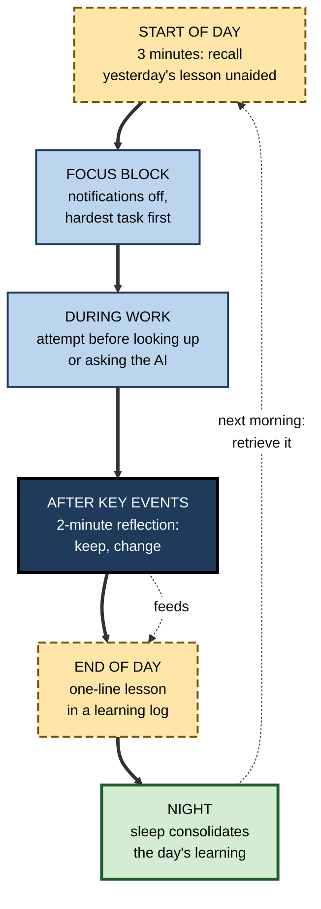
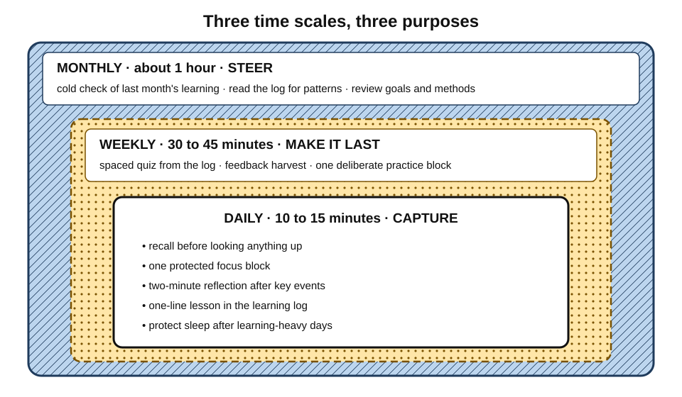
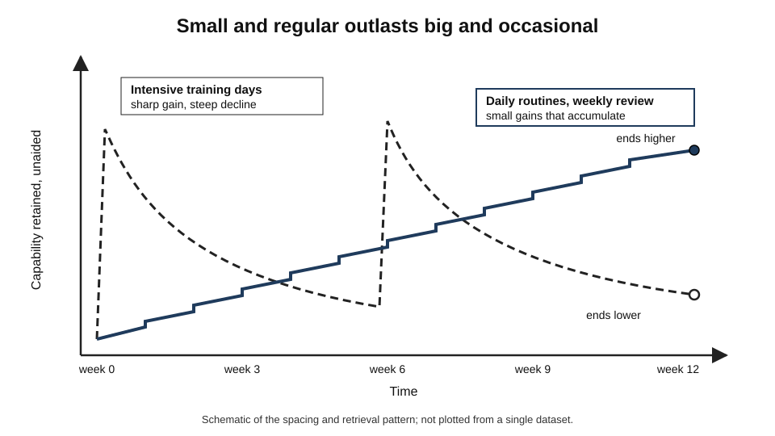
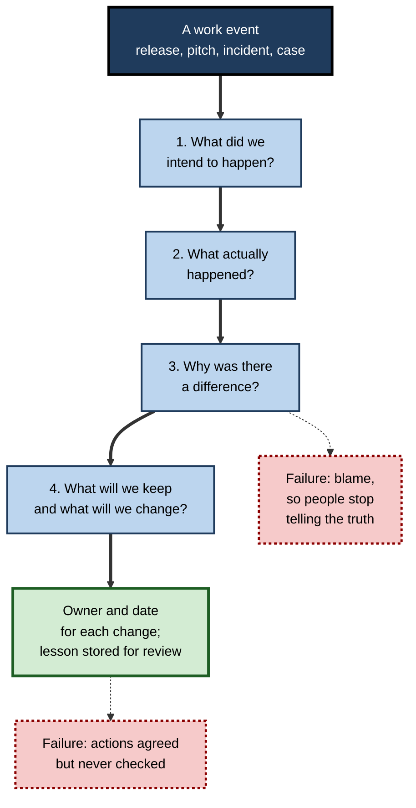
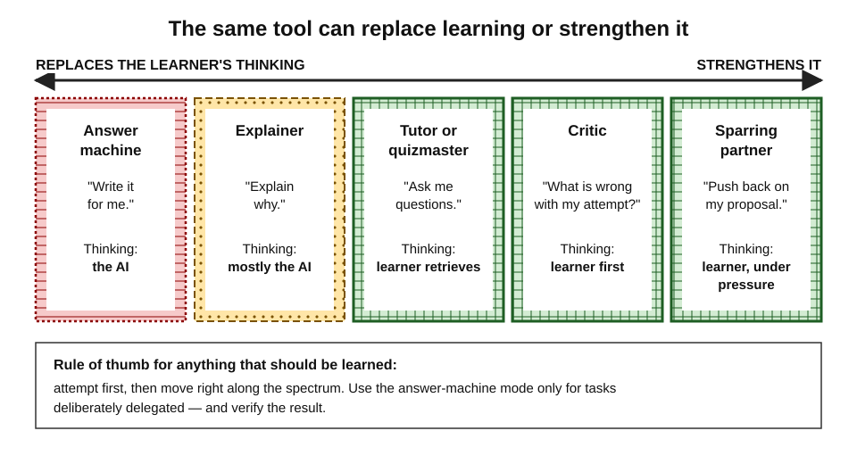
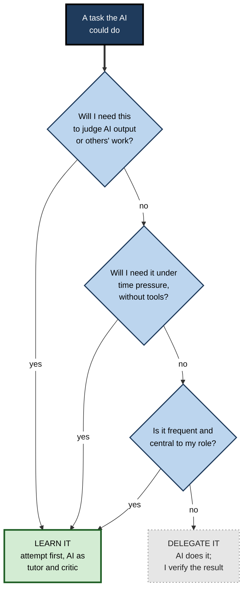

# A.12. Applying Learning Science Daily

A product analyst knows that retrieval beats re-reading, that spacing beats cramming and that feedback drives improvement. On an ordinary Tuesday she still opens her notes before trying to remember, asks an AI assistant for a query before attempting it, moves from meeting to meeting without a moment's reflection and learns almost nothing from a day full of experience. Knowing learning science changes nothing until it changes **what happens on ordinary working days**.

> **Definition — Applied learning science:** the deliberate use of well-supported principles of learning — retrieval, spacing, variation, explanation, feedback, reflection, attention and sleep — in the routines of everyday study and work, so that ordinary activity produces durable capability rather than only completed tasks.

**Why it matters**

- Most adult professional learning happens, or fails to happen, **during work**, not in courses.
- A few minutes a day, compounded over months, produces more durable capability than occasional intensive bursts.
- Generative AI now sits inside most knowledge work; used one way it accelerates learning, used another it quietly replaces it.
- Managers shape the daily learning of everyone they lead through rituals, reviews and expectations.

---

## Where Adult Learning Actually Happens

### Learning in the flow of work

- **Courses are a small part of the picture.** Workplace research consistently finds that most professional capability develops through challenging work, feedback and relationships.
  - The popular **70-20-10** split is a heuristic from retrospective executive interviews, not a measured law.
- **"Learning in the flow of work"** — a phrase popularised by the industry analyst Josh Bersin (2018) — names the aim of embedding learning in daily tasks at the moment of need.
- **The trap:** in practice it often collapses into **looking things up**, which completes the task but builds little lasting capability.

> **Definition — Performance support:** information or tools that help a person complete a task now — a checklist, a search, a template, an AI answer — without necessarily changing what the person can do unaided later.

| | Performance support | Learning-oriented practice |
|---|---|---|
| Goal | Finish this task correctly now | Be able to do this kind of task unaided later |
| Typical action | Search, copy, ask, follow the checklist | Attempt first, then check; explain; review later |
| Effect on next similar task | Look it up again | Faster, more independent |
| Feels | Efficient and smooth | Slightly slower and effortful |
| Best for | Rare tasks; low-value details; safety-critical steps | Frequent tasks; core knowledge; anything needed for judgement |

> **Key point:** neither is wrong. The professional skill is deciding, task by task, **which mode is needed** — and not drifting into permanent performance support for things that should be learned.

### Eight principles, eight everyday behaviours

- **Retrieval** → recall before looking: before a meeting, before reopening code, before checking notes.
- **Spacing** → return to important lessons after a day, a week, a month.
- **Variation** → practise the same skill in different situations and formats.
- **Explanation** → put the *why* into words — in a message, a review comment, a teaching moment.
- **Feedback** → ask specific questions about specific work, soon after it.
- **Reflection** → spend two minutes after significant events asking what to keep and what to change.
- **Attention** → protect some blocks of time from interruption for demanding work and learning.
- **Sleep** → protect it, especially after learning-heavy days.

> **Mnemonic — "Really Smart Viewers Expect Feedback, Reflect, Attend, Sleep":** Retrieval, Spacing, Variation, Explanation, Feedback, Reflection, Attention, Sleep.

---

## The Daily Rhythm

A useful daily system takes **ten to fifteen minutes of extra effort**, spread across the day, mostly inside activities that already happen.

**Figure 1.** A working day with learning built into its existing moments.

### Recall before looking

- **The habit:** before opening documentation, notes, a search engine or an AI assistant, spend **30–60 seconds** trying to recall or attempt the answer.
- **Why:** an attempt — even a failed one — turns the lookup into retrieval with feedback, and makes the correct answer more memorable.
- *e.g.* an engineer writes the function signature from memory before checking; a consultant sketches the client's org chart before opening the file; a nurse states the dose calculation before using the calculator to check it.

> **Watch out:** recall-first is for **core knowledge**. For safety-critical steps, the checklist always wins — attempt mentally if useful, but **follow the checklist**.

### Protecting attention

- **Task-switching costs** are well established: Stephen Monsell (2003) and Joshua Rubinstein, David Meyer and Jeffrey Evans (2001) showed that switching between tasks costs time and increases errors, more so for complex tasks.
- **Interruptions:** Gloria Mark and colleagues (2008) found that interrupted workers compensated by working faster — at the price of more stress, frustration and effort.
- **Fragmented attention:** Mark's later observational studies found that knowledge workers' attention on a single screen typically shifts within **well under a minute**.
- **Media multitasking:** Eyal Ophir, Clifford Nass and Anthony Wagner (2009) found heavy media multitaskers performed worse on some attention tasks.
  - Later studies gave **mixed results** and causation is unclear; the finding is suggestive, not settled.
- **Practical inference** (low risk, plausible benefit): protect one or two daily blocks for demanding work and learning — notifications off, one task, a clear goal.

> **Watch out:** the widely quoted figure that "it takes 23 minutes to refocus after an interruption" comes from interviews rather than controlled measurement and varies hugely by task. The direction is right; the precise number is not a law.

### Sleep as part of learning

- **Consolidation:** sleep after learning helps stabilise and integrate new memories; disrupted sleep weakens this.
- **Encoding:** sleep deprivation also impairs the ability to form new memories the **next day** — Seung-Schik Yoo, Matthew Walker and colleagues (2007) found markedly reduced memory encoding and hippocampal activity after a night without sleep.
- **Practical rule:** after an intensive learning day (a new system, a dense training, a hard negotiation), protecting that night's sleep is part of the learning.

> **Watch out:** claims that people can learn new languages or complex material by listening to recordings **while asleep** are not supported; the brain consolidates what was learned awake, it does not acquire complex new knowledge during sleep.

### The end-of-day lesson

- **The habit:** one sentence in a **learning log** — "Today I learned …" or "Next time I will …".
- **Why:** it forces a brief act of retrieval and selection, and creates material for spaced review.
- **Specific beats general:**
  - weak — "Learned about stakeholder management";
  - strong — "The finance director decides only after seeing the cash impact on one page; lead with that next time."

> **Definition — Learning log:** a brief, regular record of lessons drawn from experience, written to be reviewed and tested later.

### Making it stick: habits and intentions

- **Implementation intentions** — Peter Gollwitzer's "if–then" plans ("**if** I close a client call, **then** I write one line on what I would change").
  - A meta-analysis by Gollwitzer and Paschal Sheeran (2006) found such plans substantially increase goal attainment compared with intentions alone.
- **Attach to existing cues** — morning coffee, the end of a meeting, closing the laptop.
- **Habit formation takes time** — Phillippa Lally and colleagues (2010) followed people forming a new daily habit: automaticity took a median of about **66 days**, with very wide individual variation (from under three weeks to many months).

> **Watch out:** the claim that "a habit takes 21 days to form" has no good evidential basis; expect two to three months, and do not abandon a routine because it still feels effortful in week three.

---

## The Weekly and Monthly Rhythm

Daily habits capture lessons; weekly and monthly routines make them **last**, because that is where spacing and review happen.

**Figure 2.** Daily, weekly and monthly routines nest inside each other, each with a distinct purpose.

### Weekly — 30 to 45 minutes

1. **Spaced quiz from the log.** Turn the week's lessons into questions; answer them cold; promote the important ones into a spaced-review system (flashcards, calendar reminders).
2. **Feedback harvest.** Review feedback received — formal and informal — and choose **one** thing to practise next week.
3. **One deliberate practice block.** A focused session on a specific skill gap, with a clear goal and a way to check results.
   - *e.g.* rewriting last week's executive summary in half the words; re-solving a past incident from memory; rehearsing a difficult conversation.

### Monthly — about an hour

- **Read the month's log.** Look for patterns: repeated mistakes, recurring successes, gaps that keep reappearing.
- **Review goals and methods.** Is the current learning goal still the right one? Did the methods produce unaided capability?
- **Run a cold check.** Without notes or tools, explain or perform something learned a month ago. What survived is learned; what did not needs another method.

### Why small and regular beats big and occasional

| | Occasional intensive bursts | Small embedded routines |
|---|---|---|
| Typical form | A training day, a weekend of study, an annual course | Minutes per day inside existing work, a weekly review |
| Spacing | Massed | Built in |
| Retrieval | Rare | Daily |
| Link to real work | Weak; content waits to be used | Strong; lessons come from and return to work |
| Survives busy periods | Cancelled first | Shrinks but continues |
| Long-term retention | Large immediate gain, steep decline | Smaller daily gains that accumulate |

**Figure 3.** Retained capability under occasional bursts compared with small daily routines.

> **Key point:** daily routines do not replace deeper learning — courses, books, projects — but they **convert** deeper learning into lasting capability by spacing and applying it.

---

## Turning Work into Learning

Experience is the richest learning material a professional has, and the most wasted. Three practices convert it: reflection, structured review and well-used feedback.

### Reflection

**Study card — Di Stefano, Gino, Pisano and Staats (2014)**

- **Setting:** employees training for technical customer-support roles at a large Indian business-process outsourcing company.
- **Design:** during several days of training, one group spent the **last 15 minutes** of each day writing and reflecting on lessons learned; a control group continued working or practising.
- **Results:** the reflection group performed **significantly better** on the end-of-training assessment, despite spending less time on practice; laboratory experiments by the same team showed a similar pattern.
- **Proposed mechanism:** reflection consolidates lessons and increases the learner's sense of **self-efficacy**.
- **Conclusion:** a small amount of structured reflection can be worth more than the same time spent on further experience.
- **Caveat:** a single field setting and short-term outcomes; the finding fits broader research but should not be over-generalised.

> **Definition — Micro-reflection:** a very short, structured reflection immediately after a task — typically two questions: what worked, and what would be done differently next time.

### After-action reviews

> **Definition — After-action review (AAR):** a structured discussion after an event comparing what was intended with what happened, why there was a difference and what will be changed. Developed by the US Army in the 1970s; adopted in healthcare, aviation, firefighting and technology.

**Figure 4.** The after-action review cycle and the most common way it fails.

**Study card — Tannenbaum and Cerasoli (2013)**

- **Design:** meta-analysis of studies of debriefs and after-action reviews in individuals and teams, in field and laboratory settings.
- **Results:** well-conducted debriefs improved effectiveness substantially compared with no debrief — on average by roughly a fifth to a quarter.
- **Moderators:** benefits were larger when debriefs were **structured** and focused on specific events, with active participation rather than a leader's monologue.
- **Conclusion:** structured review is one of the most cost-effective team-learning practices available.

- **Blameless post-mortems** — the technology industry's version, codified in site-reliability-engineering practice — focus on **system causes** and lessons, not individual fault, so that people report what actually happened.
- **Pre-mortems** (Gary Klein, 2007) — the forward-looking twin: before a project, imagine it has failed and ask why, turning hindsight into foresight.

### Feedback that actually helps

**Study card — Kluger and DeNisi (1996)**

- **Design:** meta-analysis of several hundred feedback-intervention effects.
- **Results:** feedback improved performance **on average** — but in **more than a third** of cases it made performance **worse**.
- **Pattern:** feedback helped most when it focused attention on the **task and how to improve**; it harmed most when it drew attention to the **self** (praise, criticism of the person, comparison with others).
- **Conclusion:** more feedback is not automatically better; its focus decides its effect.

- **Ask specific questions about specific work:**
  - weak — "Any feedback for me?";
  - strong — "In today's client call, where did my explanation lose them?"
- **Ask soon** — feedback is most useful while the event is fresh.
- **Act visibly** — telling the giver what was changed encourages more feedback.

### Explaining and teaching

- **Expecting to teach** improves learning — sometimes called the **protégé effect**: John Nestojko and colleagues (2014) found that people who studied a passage expecting to teach it recalled it better and more coherently than those expecting a test.
- **Actually teaching** adds retrieval and explanation — Logan Fiorella and Richard Mayer (2013) found that explaining to others after preparation produced better long-term understanding than preparation alone.
- **Daily forms:** explaining a decision in a pull-request description; writing a short internal note; walking a junior through a case; answering a colleague's question without looking up the answer first.

> **Watch out:** the "Feynman technique" (explain it simply, find the gaps, simplify again) is a sound application of self-explanation, but the name is a modern popular label — the physicist Richard Feynman did not present it as a method.

### Worked example: a junior solicitor's first quarter

- **Situation:** a newly qualified solicitor in a commercial property team wants to become independent on lease reviews within three months.

| | Typical first quarter | Quarter with learning science applied daily |
|---|---|---|
| Recall | Opens precedents and checklists first for every lease | Notes the likely problem clauses from memory first, then checks against the checklist |
| Reflection | None; moves to the next file | Two-line note after each review: what was missed, what to check first next time |
| Feedback | Waits for the supervising partner's mark-up | Asks "which of my comments would you not have made, and why?" on each mark-up |
| Spacing | None | Friday 30 minutes: quiz on the week's lessons; important ones into flashcards |
| Teaching | None | Explains one clause type to a trainee each fortnight |
| Monthly check | None | Reviews an unseen lease unaided; compares with partner's review |
| After three months | Still needs heavy review on most leases | Handles standard leases with light review; log of about sixty concrete lessons |

- **Reasoning:**
  1. **Recall-first** turned every file into retrieval practice.
  2. **Micro-reflection** captured lessons that would otherwise vanish.
  3. **Specific feedback questions** surfaced the partner's tacit judgement.
  4. **Weekly spacing** and **teaching** made the lessons durable.
- **Conclusion:** no extra courses, under fifteen minutes a day of extra effort, and a visibly faster route to independence.

---

## Learning with AI Tools Every Day

Generative AI is now part of most knowledge workers' daily routines. The same tool can be a superb tutor or a silent substitute for learning, depending on how it is used.

### The evidence so far

**Study card — Lee and colleagues (2025)**

- **Setting:** survey study, presented at a leading human–computer interaction conference, of **319 knowledge workers** describing over 900 real examples of using generative AI at work.
- **Results:**
  - **higher confidence in the AI** was associated with **less** critical thinking effort;
  - **higher self-confidence** in one's own ability was associated with **more** critical thinking;
  - critical effort shifted from **producing** work to **verifying, integrating and stewarding** AI output.
- **Conclusion:** trust in the tool, not just its availability, shapes how much thinking the user still does.
- **Limit:** self-reported and correlational.

- **Experimental evidence in education** shows that unrestricted answer-giving AI can raise practice performance while lowering later unaided performance, whereas tutors designed to give hints and ask questions largely avoid the harm.
- **Brain-activity studies** — a widely publicised 2025 preprint from MIT (Nataliya Kosmyna and colleagues) reported lower neural engagement and poorer recall of their own essays among people writing with an AI assistant.
  - **Contested:** small sample, not peer-reviewed at release, and widely over-interpreted in media coverage; consistent in direction with other evidence but not strong on its own.

### Five modes of AI use

| Mode | What the learner asks | Who does the thinking | Effect on learning |
|---|---|---|---|
| **Answer machine** | "Write the query." "Draft the memo." | The AI | Task done; little or no learning; risk of dependence |
| **Explainer** | "Explain why this works." | Shared, mostly AI | Some understanding; fluency illusion if not tested |
| **Tutor / quizmaster** | "Ask me questions on this, one at a time." | The learner | Strong — retrieval with feedback |
| **Critic** | "Here is my attempt; what is wrong with it?" | The learner first, then AI | Strong — attempt plus specific feedback |
| **Sparring partner** | "Play a sceptical client; push back on my proposal." | The learner, under pressure | Strong for judgement and communication skills |

**Figure 5.** A spectrum of AI use from replacing the learner's thinking to strengthening it.

### Daily practices for learning with AI

- **Attempt first, then ask.** Write the approach, the draft or the answer before prompting; then ask the AI to critique it.
- **Ask for hints, not answers,** when the task is something that should be learned.
- **Ask to be quizzed** on new material — and answer without looking.
- **Explain AI output back** in one's own words before using it; if it cannot be explained, it has not been understood.
- **Verify** — check claims, code and figures against sources or tests; confident errors are common.
- **Keep periodic unaided repetitions** — do some core tasks without AI each week to check that capability is still there.
- **Maintain a "must know" list** — the knowledge needed to judge AI output, act under time pressure or learn further, which must stay in the head.

**Figure 6.** Deciding whether to learn a task or delegate it to an AI tool.

> **In practice:** the most protective single rule for juniors is **"show your attempt before the AI's"** — in code reviews, drafts and analyses. It keeps the learning moment without banning the tool.

---

## Learning Science in Teams and Organisations

### Upgrading existing rituals

Teams rarely need new programmes; they need learning built into rituals that already exist.

- **Stand-ups** — once a week, one person shares a lesson from the previous week, from memory.
- **Code, design and document reviews** — reviewers explain the *why* behind comments; authors write what they learned in the description.
- **Retrospectives** — check whether last time's actions were done before agreeing new ones.
- **Incident, deal and case reviews** — blameless after-action reviews; lessons stored in a searchable library and turned into onboarding questions.
- **Onboarding** — spaced, scenario-based questions over the first ninety days instead of a first-week information dump.
- **One-to-ones** — managers ask "what did you learn?" and "what are you trying to get better at?" as routinely as "what is the status?"

### What to measure

- **Time to independence** — how long newcomers take to perform defined tasks unaided.
- **Repeat-error rate** — how often the same kind of mistake recurs across projects.
- **Retro action completion** — the proportion of agreed changes actually made.
- **Unaided spot checks** — occasional, low-stakes tasks without tools, to confirm capability behind AI-assisted output.

> **Remember:** measure **behaviour and outcomes**, not attendance or satisfaction. A learning routine that people like but that does not reduce repeat errors is not working.

### Case study: protecting learning after an AI rollout in technical support

- **Situation:** a software company gave its 120-person technical-support team an AI assistant that drafted replies and suggested fixes.
- **Early result:** tickets resolved per hour rose quickly, especially among newer agents.
- **Problem discovered after six months:**
  - escalations of **novel** problems — those the assistant handled poorly — did not fall;
  - newer agents struggled to diagnose issues during an assistant outage;
  - senior engineers reported that juniors could no longer explain the fixes they applied.
- **Diagnosis:**
  - the assistant was used almost entirely in **answer-machine** mode;
  - the old learning moments — diagnosing before asking, debriefing difficult tickets, explaining fixes — had disappeared;
  - nobody measured unaided diagnostic skill.
- **Actions:**
  1. **Diagnose first:** for unfamiliar ticket types, agents wrote a one-line hypothesis before viewing the AI suggestion.
  2. **Weekly 20-minute case review:** two hard tickets per team, blameless, focused on how the cause could have been found.
  3. **Explain-to-close:** agents added one sentence explaining the root cause before closing a ticket.
  4. **Spaced scenario questions:** three short diagnostic questions a week, drawn from recent difficult tickets.
  5. **Quarterly unaided drill:** a short simulated outage session with the assistant switched off.
- **Result:** after two quarters, resolution speed stayed close to its post-rollout level; escalations of novel problems fell; juniors' performance in the unaided drill improved steadily.
- **Side effects / caveats:**
  - some agents resented the hypothesis step on busy days; it was limited to unfamiliar ticket types;
  - a product release during the period changed the ticket mix, so the improvement cannot be attributed wholly to the changes.
- **Lesson:** AI raised **output** immediately; deliberate daily practices were needed to keep **capability** growing underneath it.

### Limits and ethics

- **Do not turn reflection into surveillance.** Personal learning logs belong to the learner; team lessons must be blameless.
- **Respect working time.** Learning routines should happen inside paid time, not become unpaid evening homework.
- **Design for unequal schedules.** Shift workers, carers and people in back-to-back client work need short, flexible forms.
- **Avoid burnout by optimisation.** A learning system that adds pressure to an overloaded day defeats itself; shrink it rather than abandon it.
- **Protect the junior pipeline.** As AI absorbs routine work, managers must deliberately preserve opportunities for juniors to practise fundamentals.

---

## Open Questions

- **How much daily learning practice is enough?**
  - Most routines rest on principles tested over days or weeks; long-term studies of daily learning habits in real jobs are rare.
- **Which AI-use patterns build skill over months and years?**
  - Early evidence covers single courses and short periods; the long-term effects of everyday AI use on expertise are unknown.
- **Can learning in the flow of work be measured cheaply?**
  - Organisations lack practical measures that separate assisted output from unaided capability.
- **How general is the reflection effect?**
  - Promising field experiments exist, but how reflection should be structured, and for whom it helps most, is not settled.
- **What is the right balance between offloading and learning in each profession?**
  - The "must know" list differs by role and is changing fast; there is little systematic evidence to define it.

---

## Summary

- **Applied learning science** turns retrieval, spacing, variation, explanation, feedback, reflection, attention and sleep into everyday routines.
- Most adult learning happens **during work**; distinguish **performance support** (finish the task) from **learning-oriented practice** (be able to do it unaided), and choose deliberately.
- **Daily rhythm:** recall before looking, a protected focus block, micro-reflections after key events, a one-line learning log, and protected sleep — about ten to fifteen extra minutes.
- **Habits** form through if–then plans attached to existing cues and take around two months, not 21 days.
- **Weekly and monthly rhythms** add spacing: quiz from the log, harvest feedback, one deliberate practice block, a monthly cold check and review.
- **Small, regular routines** beat occasional bursts for retention and survive busy periods.
- **Reflection** (Di Stefano et al.) and **after-action reviews** (Tannenbaum and Cerasoli) convert experience into lessons; **feedback** helps when focused on the task, and can harm when focused on the self (Kluger and DeNisi).
- **Explaining and teaching** consolidate learning.
- With **AI**, attempt first, then ask; use AI as tutor, critic and sparring partner rather than answer machine; verify; keep unaided repetitions and a "must know" list.
- In **teams**, upgrade existing rituals and measure time to independence, repeat errors and unaided capability — within ethical limits on surveillance, time and workload.

---

## Self-Check

1. Distinguish performance support from learning-oriented practice, with one example where each is the right choice.
2. Describe the recall-first habit and explain why it works. When should it not be used?
3. What does the research on task switching and interruptions show, and what practical inference is reasonable?
4. Why is sleep part of a learning routine? What claim about sleep learning should be rejected?
5. Rewrite "Learned about client management" as a useful learning-log entry.
6. What did Lally et al. (2010) find about habit formation, and why does it matter for learning routines?
7. Describe the Di Stefano et al. reflection study and one caveat.
8. List the four questions of an after-action review and the two most common failure modes.
9. What did Kluger and DeNisi (1996) find, and how should feedback requests be phrased as a result?
10. Explain why small daily routines usually outperform occasional intensive bursts.
11. Compare the answer-machine and critic modes of AI use for a junior analyst learning SQL.
12. Using the learn-or-delegate questions, decide whether a hospital pharmacist should learn or delegate (a) formatting monthly reports and (b) checking renal dose adjustments.
13. A manager wants every team member to submit daily learning logs for review. Advise them.
14. Design a fifteen-minute-a-day learning system for a sales engineer who has just moved to a new product line and uses an AI assistant heavily.

### Answer Key

1. Performance support helps finish a task now (search, checklist, AI answer); learning-oriented practice builds unaided capability (attempt, check, explain, review). Support suits rare or safety-critical tasks — e.g. a pilot's checklist; learning suits frequent core tasks — e.g. an analyst's routine queries.
2. Attempt to recall or solve for 30–60 seconds before looking anything up. It turns lookup into retrieval with feedback, strengthening memory. It should not replace checklists or verification in safety-critical steps.
3. Switching costs time and accuracy; interruptions increase stress and effort even when people work faster; attention on screens is highly fragmented. Media-multitasking findings are mixed. Reasonable inference: protect one or two uninterrupted blocks for demanding work and learning.
4. Sleep consolidates the day's learning, and lack of sleep impairs next-day encoding. Claims that complex new material can be learned from recordings during sleep should be rejected.
5. E.g. "The client's operations head trusts numbers only after seeing the raw data source; show the source slide first next time."
6. Automaticity took a median of about 66 days with wide variation. Learners should expect routines to feel effortful for weeks and not abandon them early.
7. Customer-support trainees who spent the last 15 minutes of each training day reflecting on lessons outperformed those who used the time for more practice. Caveat: one field setting, short-term outcome.
8. What did we intend? What happened? Why the difference? What will we keep and change? Failures: blame (people stop being honest) and agreed actions never checked.
9. Feedback helped on average but harmed performance in over a third of cases, especially when it focused on the self rather than the task. Ask specific, task-focused questions about specific work soon after it happens.
10. They build in spacing and retrieval, connect lessons directly to work, and survive busy periods; bursts are massed, often far from use, and decay quickly.
11. Answer machine: the AI writes the query; the analyst finishes the task but learns little and may not spot errors. Critic: the analyst writes the query first, then asks the AI to find problems — retrieval plus specific feedback, building skill.
12. (a) Delegate — not needed to judge others' work, not needed under time pressure without tools, not central. (b) Learn — essential to judge prescriptions and AI outputs, needed quickly, central to the role.
13. Mandatory review of personal logs turns reflection into surveillance and invites performative entries. Better: logs stay private; the team holds blameless reviews and shares chosen lessons; the manager asks "what did you learn?" in one-to-ones and measures outcomes such as repeat errors.
14. E.g. morning: 3 minutes recalling yesterday's product lesson; during work: write a solution outline before asking the AI, then use it as critic; after customer calls: 2-minute reflection on questions that stumped them; end of day: one-line log; weekly: 30-minute quiz from the log plus AI role-play of a sceptical buyer; monthly: an unaided demo to a colleague.

---

## Glossary

| Term | Meaning |
|---|---|
| After-action review | A structured debrief comparing intended and actual outcomes to identify lessons and changes. |
| Applied learning science | Using well-supported learning principles in everyday study and work routines. |
| Blameless post-mortem | A review focused on system causes and lessons rather than individual fault. |
| Cold check | Explaining or performing something learned earlier without notes or tools. |
| Implementation intention | An if–then plan linking a situation to a specific action. |
| Learning in the flow of work | Learning embedded in daily tasks at the moment of need. |
| Learning log | A brief, regular record of lessons from experience, written for later review. |
| Micro-reflection | A very short structured reflection immediately after a task. |
| Performance support | Information or tools that help complete a task now without necessarily building capability. |
| Pre-mortem | Imagining in advance that a project has failed and asking why. |
| Protégé effect | Better learning from preparing to teach or teaching others. |
| Recall-first habit | Attempting to remember or solve something before looking it up. |
| Self-efficacy | A person's belief in their ability to succeed at a task. |
| Task-switching cost | The loss of time and accuracy when moving between tasks. |
| Time to independence | How long a newcomer takes to perform defined tasks unaided. |
