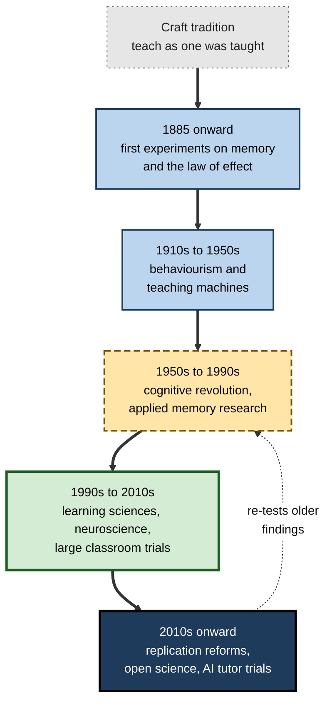
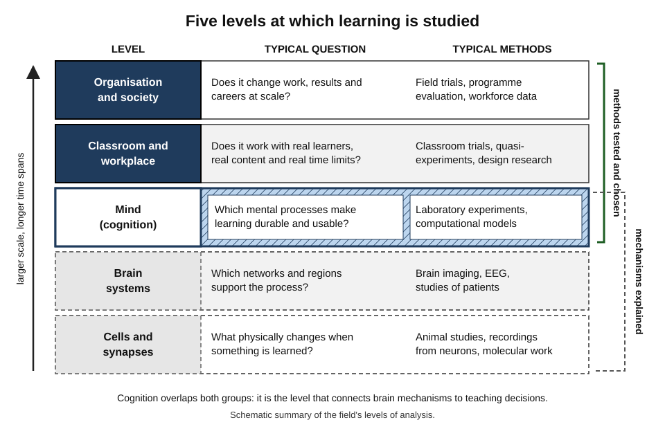
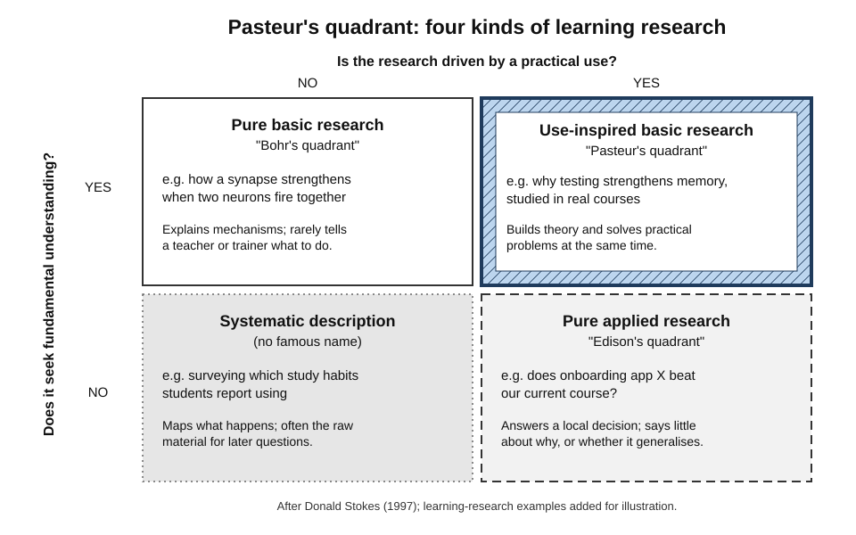
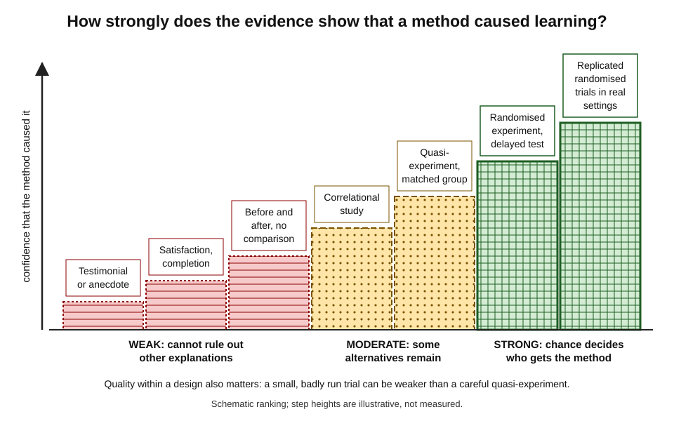
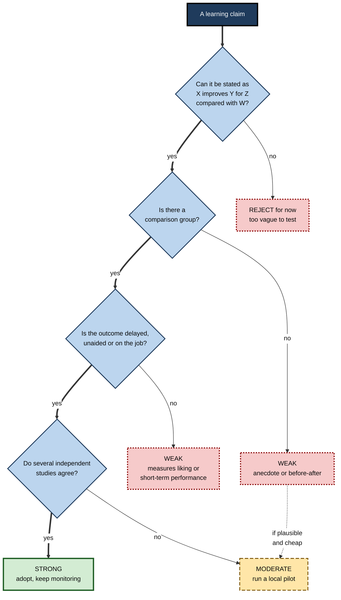
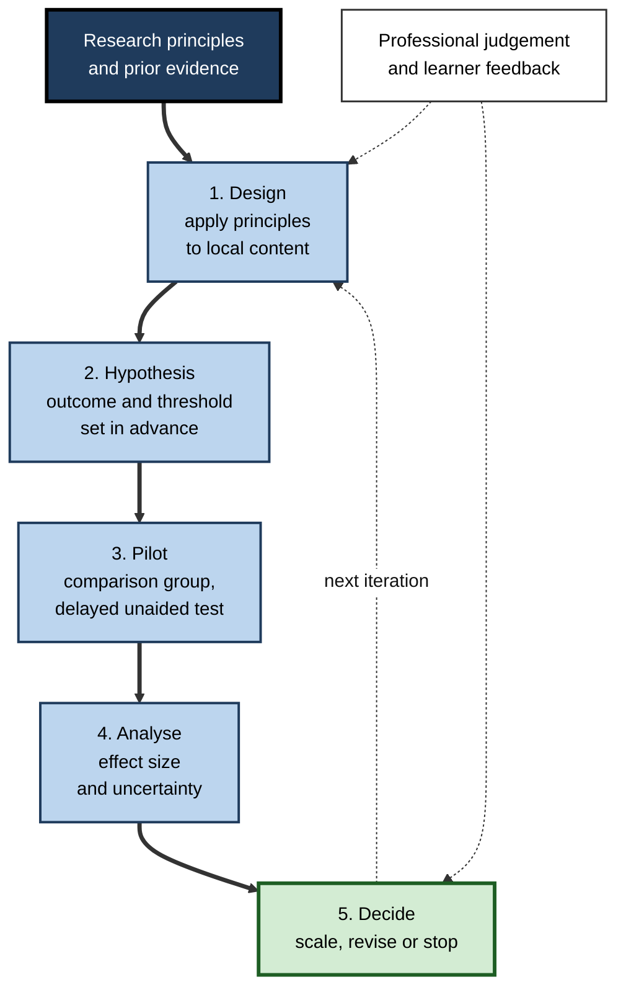

# A.2. The Science of Learning

A sales director is offered a "brain-based" microlearning platform that promises to double retention. A university lecturer wonders whether to replace weekly lectures with quizzes. A student is told by one friend to highlight and by another to test herself. Each faces the same question — **how can anyone know which way of learning actually works?** — and each can answer it by habit, by authority, by fashion or by evidence.

> **Definition — Science of learning:** the interdisciplinary study of how people (and other organisms) acquire, retain and use knowledge and skill, using systematic observation and controlled experiments to test which conditions produce durable learning, and why.

**Why it matters**

- Billions are spent each year on education and workplace training; much of it is spent on methods chosen because they *feel* effective.
- Many robust findings run **against intuition** — learners and instructors regularly prefer the methods that produce less learning.
- Professionals who can judge evidence can reject fads, defend sound designs to sceptical leaders and run their own small tests.
- Generative AI has put a new wave of learning products on the market; telling evidence from marketing is now a routine professional skill.

---

## From Tradition to Evidence

For most of history, teaching was a craft passed down by imitation: people taught as they had been taught. The science of learning replaced "what we have always done" with the question **"compared with what, measured how, and after how long?"**

### Four ways of deciding how to teach

- **Tradition** — "lectures and textbooks have always worked."
  - Strength: tested by survival. Weakness: survival is not proof of effectiveness.
- **Authority** — "a famous educator recommends it."
  - Strength: draws on experience. Weakness: experts disagree and can be wrong.
- **Intuition and experience** — "it feels as if students learn more."
  - Strength: fast, rich in context. Weakness: the feeling of learning is a poor guide to learning itself.
- **Evidence** — "a controlled comparison showed better delayed performance."
  - Strength: self-correcting. Weakness: slow, costly and rarely available for one's exact situation.

> **Key point:** the science of learning does not discard tradition, authority or experience — it **tests** them. Many traditional practices survive the test; some fail it badly.

> **Example:** medicine before controlled trials bled patients because it seemed sensible and everyone did it. Learning science applies the same clinical-trial attitude to studying, teaching and training.

### Milestones in the field

- **1885 — Hermann Ebbinghaus** turns memory into a measurable quantity with nonsense syllables and forgetting curves — the first experimental study of learning in humans.
- **1890s–1900s — Edward Thorndike** studies cats escaping puzzle boxes and states the **law of effect**: responses followed by satisfying outcomes become more likely. He goes on to apply experimental methods to schooling.
- **1899 — William James**, *Talks to Teachers*, warns that psychology is a science and teaching an art: "an intermediary inventive mind must make the application."
- **1913–1950s — behaviourism** (John Watson, B. F. Skinner) restricts science to observable behaviour; Skinner's **teaching machines** and programmed instruction (1950s) break material into small steps with immediate feedback.
- **1932 — Frederic Bartlett** shows that people reconstruct stories to fit their existing knowledge — an early challenge to the idea of memory as a passive record.
- **Mid-1950s — the cognitive revolution** (George Miller, Noam Chomsky, Allen Newell, Herbert Simon) brings the mind back into science as an information-processing system.
- **1968 — David Ausubel**: "the most important single factor influencing learning is what the learner already knows."
- **1980s–1990s — applied cognitive research** produces cognitive load theory (John Sweller, 1988) and the learning–performance distinction (Robert Bjork).
- **1991** — the *Journal of the Learning Sciences* is founded; the **learning sciences** emerge as a field studying learning in real settings, often with technology.
- **2000** — the US National Research Council's *How People Learn* synthesises the evidence for educators.
- **2000s–2010s** — cognitive neuroscience and "mind, brain and education" grow; evidence bodies such as the US **What Works Clearinghouse** (2002) and England's **Education Endowment Foundation** (2011) commission large trials and publish summaries.
- **2010s–2020s** — the **replication crisis** reshapes methods; large-scale classroom trials, open science and, from 2023, randomised trials of AI tutors.

**Figure 1.** How the science of learning developed.

> **Watch out:** the history is not a march from error to truth. Behaviourism's emphasis on immediate feedback, small steps and practice survives in modern evidence; what changed is the explanation and the breadth of what is studied.

---

## A Field Built From Many Disciplines

### Who studies learning

- **Cognitive psychology** — mental processes: attention, memory, reasoning, problem solving.
  - Typical output: principles such as "retrieval strengthens memory".
- **Neuroscience** — the biological machinery: synapses, brain networks, sleep.
  - Typical output: mechanisms that explain why principles work.
- **Educational research** — teaching, curricula, assessment and schools.
  - Typical output: whether a programme works in real classrooms.
- **Learning sciences** — learning in authentic settings, often with technology and collaboration.
  - Typical output: designs refined through cycles of use.
- **Developmental psychology** — how learning changes from infancy to old age.
- **Organisational and training research** — workplace learning, transfer of training, performance.
- **Computer science and AI** — intelligent tutoring systems, learning analytics, and machine-learning models used as theories of human learning.

> **Definition — Learning sciences:** an interdisciplinary field, formalised in the early 1990s, that studies how people learn in real-world settings and designs learning environments based on that understanding.

### Levels of analysis

Each discipline works at a different scale — from molecules over milliseconds to organisations over years. A claim made at one level must be tested at the level where the decision is made.

**Figure 2.** Five levels at which learning is studied.

**John Bruer, "Education and the brain: a bridge too far" (1997)**

- **Argument:** neuroscience cannot yet tell teachers directly what to do.
- **The missing link:** cognitive psychology — it connects brain mechanisms to instructional decisions.
- **Consequence:** a brain finding becomes useful for teaching only after a **behavioural** test shows that the derived method improves learning.

> **Key point:** neuroscience explains *why* methods work; **behavioural evidence decides which methods to use**. A technique that improves delayed performance is justified whether or not its brain mechanism is known.

> **Watch out:** the phrase "brain-based learning" usually adds a neuroscience vocabulary to advice that either has its own behavioural evidence (and does not need the brain talk) or has none (and is not rescued by it).

### Basic and applied research

**Donald Stokes, *Pasteur's Quadrant* (1997)**

- **Old view:** research lies on one line from "basic" to "applied".
- **Stokes's view:** two separate questions — *does it seek fundamental understanding?* and *is it driven by use?*
- **Pasteur** is the model of doing both: his work on microbes advanced biology *and* solved problems of spoilage and disease.

**Figure 3.** Four kinds of learning research.

- Much of the most valuable learning research sits in **Pasteur's quadrant** — testing *why* retrieval, spacing or worked examples help, with real learners and real material.
- Corporate learning evaluation usually sits in **Edison's quadrant** — useful for a local decision but weak at telling whether the result will hold elsewhere.

---

## How Learning Research Finds Things Out

### The logic of a controlled comparison

1. **State a hypothesis** — *e.g.* "practising retrieval improves recall a week later more than re-reading does".
2. **Choose a comparison** — the same material, the same time on task, a different method.
3. **Assign learners to conditions by chance** — so that motivation, ability and prior knowledge are, on average, balanced.
4. **Measure a meaningful outcome** — delayed, unaided, ideally including new problems.
5. **Estimate the size and uncertainty** of the difference, not just whether it exists.
6. **Replicate** — with other learners, materials, settings and researchers.

> **Definition — Randomised controlled trial (RCT):** an experiment in which participants (or classes, teams or schools) are assigned to conditions by chance, so that differences in outcome can be attributed to the condition.

> **Definition — Confound:** a variable that differs between conditions alongside the one being studied, offering an alternative explanation for the result.

### Research designs compared

| Design | What it does | Main strength | Main weakness |
|---|---|---|---|
| Laboratory experiment | Random assignment, controlled materials, short delays | Clear cause and effect | Short, artificial tasks; often university students |
| Classroom or field trial | Same logic inside real courses or workplaces | Realistic; tests survival in practice | Expensive; noisy; effects usually smaller |
| Quasi-experiment | Compares existing groups, e.g. two cohorts | Feasible where randomising is not | Groups may differ in hidden ways |
| Correlational study | Measures whether two variables move together | Large samples, cheap | Cannot establish cause |
| Design-based research | Iterates a design in real settings, refining theory and practice together | Produces workable designs | Hard to separate which change mattered |
| Neuroimaging and patient studies | Records or infers brain activity during learning | Reveals mechanisms | Rarely yields teaching prescriptions directly |
| Meta-analysis | Statistically combines many studies | Shows overall size and variation | Only as good as the studies included |

**Correlation is not causation — learning versions**

- Students who use flashcards get higher grades.
  - Perhaps flashcards help — or more motivated students both use flashcards *and* study longer.
- Employees who attend more courses are promoted faster.
  - Perhaps courses help — or ambitious employees both attend courses *and* seek promotion.
- Schools with more laptops score higher.
  - Perhaps laptops help — or wealthier schools buy laptops *and* have other advantages.

> **Remember:** only random assignment (or a design that convincingly imitates it) separates the effect of a method from the effect of the kind of people who choose it.

### Design-based research

- **Origin:** Ann Brown (1992) and Allan Collins (1992) argued for "design experiments" in real classrooms.
- **Method:** build a learning design from theory → use it in context → observe what happens → revise both design and theory → repeat.
- **Strength:** produces designs that work under real constraints.
- **Limitation:** many things change at once, so it is weak at proving which feature caused the effect — it is usually followed by controlled tests.

### Measuring the outcome

- **Delayed tests** — retention after days or weeks, not minutes.
- **Transfer tests** — new problems that need the same principle.
- **Unaided performance** — without notes, help or AI, unless the tool is part of the real task.
- **Behavioural measures at work** — observed use of the skill, error rates, customer outcomes.
- **Standardised versus researcher-designed tests** — tests written by the researchers, closely aligned to what was taught, typically show **larger effects** than broad standardised tests.

> **Watch out:** an effect measured on a narrow, researcher-designed test cannot be compared directly with one measured on a national examination; the outcome measure is part of the result.

---

## How Big Is Big? Reading the Size of an Effect

### Effect sizes in context

An effect size expresses a difference in standard-deviation units (Cohen's *d* or Hedges' *g*). Jacob Cohen's general benchmarks — around 0.2 small, 0.5 medium, 0.8 large — were never meant for education, where outcomes are broad, noisy and hard to move.

**Matthew Kraft (2020) — benchmarks for education trials**

- Reviewed effects from randomised trials with standardised achievement outcomes.
- Proposed: below **0.05** small; **0.05 to 0.20** medium; **0.20 or above** large.
- Argued that effect size must be read alongside **cost per learner**, **scalability** and the **outcome measure**.

**Study card — Lortie-Forgues and Inglis (2019)**

- **Design:** analysed 141 large randomised trials of educational interventions commissioned by England's Education Endowment Foundation and the evaluation arm of the US Institute of Education Sciences.
- **Results:**
  - the average effect was about **0.06 standard deviations** — small;
  - many trials were **uninformative**: their confidence intervals were wide enough to fit both a meaningful benefit and no effect.
- **Conclusion:** rigorous, large-scale trials of realistic programmes usually find much smaller effects than small laboratory studies; the field needs better-powered and better-targeted trials.

**Study card — the "two sigma problem" (Bloom, 1984)**

- **Claim:** students tutored one-to-one using mastery methods performed about **two standard deviations** better than students taught conventionally — the average tutored student outperformed about 98% of the conventional class.
- **Basis:** a small number of short studies by Bloom's doctoral students.
- **Later evidence:** a meta-analysis of randomised trials of tutoring (Nickow, Oreopoulos and Quan, 2020) found an average effect of roughly **one-third of a standard deviation** — large by education standards, but far below two.
- **Lesson:** a famous number from small early studies shrank under larger, more rigorous tests, while the underlying idea — intensive, responsive tutoring helps substantially — survived.

> **Watch out:** John Hattie's *Visible Learning* (2009) ranked influences on achievement by averaging hundreds of meta-analyses and treated **0.40** as a "hinge point". The synthesis was hugely influential but is **contested** by methodologists: it averages studies with very different designs, populations and outcome measures, so its rankings and the 0.40 threshold should not be read as precise.

### Why effects shrink from laboratory to field

- **Weaker implementation** — the method is delivered with less fidelity, less time, less training.
- **Better comparison groups** — the "business as usual" condition already includes some good practice.
- **Broader outcome measures** — standardised tests sample far beyond what was taught.
- **More variation** — learners, teachers, content and schedules differ, adding noise.
- **Publication bias** — small studies with large effects were more likely to be published in the first place.

**Effect sizes compared by setting**

| | Small laboratory study | Classroom trial, researcher test | Large field trial, standardised test |
|---|---|---|---|
| Typical control condition | Passive re-reading | Ordinary teaching | Ordinary teaching, at scale |
| Implementation fidelity | High | Moderate | Variable |
| Outcome measure | Narrow, aligned to the material | Aligned to the unit | Broad |
| Typical effect size | Often moderate to large | Often small to moderate | Usually small |

> **Key point:** a small effect is not a failure. A cheap change that lifts thousands of learners by 0.1 standard deviations can be worth far more than an expensive programme with a large effect for a few.

### Heterogeneity: the average hides the story

> **Definition — Heterogeneity:** variation in an effect's size across studies, people or settings beyond what chance would produce.

- An average of 0.1 may mean "a small benefit for everyone" or "a large benefit for some and none, or harm, for others".
- Modern syntheses therefore ask **for whom, under what conditions and with what implementation** a method works.
  - *e.g.* guidance-heavy instruction helps novices most and can become less useful as expertise grows.
- **Moderator analysis** tests whether effects differ by learner age, subject, delay, dose or design quality.

### Worked example: how many learners does a pilot need?

- **Situation:** an L&D team wants to test spaced follow-up quizzes after a compliance course and expects an effect of about *d* = 0.2.

> **Formula — Approximate sample size per group** (two groups, 80% power, 5% significance): n ≈ 16 ÷ d². For d = 0.2: 16 ÷ 0.04 = **400 per group**. For d = 0.5: 16 ÷ 0.25 = **64 per group**.

1. **Estimate the plausible effect** from comparable field studies, not from the most impressive laboratory study.
2. **Compute the sample** — about 400 learners per group for a small effect.
3. **Check feasibility** — a cohort of 120 cannot reliably detect *d* = 0.2.
4. **Adjust the design** — pool several cohorts, use a more sensitive outcome (a delayed scenario test aligned to the training), or randomise across sites over a year.
5. **Decide the success criterion in advance**, and report the result with its uncertainty.

> **Watch out:** when learners are randomised in **groups** (whole teams or classes), far more learners are needed than the formula suggests, because members of a group resemble one another.

---

## The Replication Era

### What happened

- **Open Science Collaboration (2015):** a large, coordinated attempt to repeat 100 published psychology studies.
  - Roughly **a third to two-fifths** produced a statistically significant result again.
  - Replication effects averaged about **half** the original size.
- **Causes identified:**
  - small samples;
  - flexible analysis choices ("researcher degrees of freedom");
  - publication bias towards positive results;
  - rarely attempted direct replications — in education journals, only a tiny fraction of articles (well under 1%, by one count) were replications.

> **Definition — Replication:** repeating a study, with new data, to test whether its finding holds. A **direct** replication copies the method; a **conceptual** replication tests the same idea differently.

### What the field changed

- **Pre-registration** — publishing hypotheses and analysis plans before collecting data.
- **Registered reports** — journals accept a study on the strength of its design, before results are known, removing the pressure to find positive effects.
- **Multi-site studies** — the same protocol run in many laboratories or schools at once.
- **Open data and materials** — so others can check analyses and reuse tasks.
- **Larger samples and power analysis** as a norm.

> **Definition — Publication bias:** the tendency for studies with positive or striking results to be published more often than studies with null results, inflating the apparent size of effects.

### How learning findings fared

| Status | Examples | What it means for practice |
|---|---|---|
| Robust — replicated in laboratories and classrooms | Testing effect; spacing effect; worked-example effect for novices | Safe foundations for design |
| Real but smaller or narrower than first claimed | Many growth-mindset interventions; interleaving outside mathematics and category learning; tutoring's "two sigma" | Use, but expect modest and conditional effects |
| Contested or largely failed | Ego depletion ("willpower runs out"); several social-priming effects | Do not build programmes on them |
| Not supported | Matching teaching to a "learning style" | Avoid; redirect the effort |

> **Key point:** the replication era made the science **more trustworthy**, not less. Findings that survived pre-registered, multi-site tests deserve more confidence than they did before.

---

## Principles With Broad Support

Despite many unresolved details, syntheses of the evidence — such as *How People Learn* (2000), the US Institute of Education Sciences practice guide on organising instruction (2007) and the Deans for Impact summary *The Science of Learning* (2015) — converge on a small core of principles.

- **Prior knowledge shapes new learning** — what is already known determines what can be understood and how fast.
- **Working memory is limited** — novices are easily overloaded; structure, guidance and worked examples help them.
- **Retrieval strengthens memory** — producing an answer builds more durable learning than re-reading it.
- **Spacing beats massing** — practice spread over time is retained longer.
- **Interleaving aids discrimination** — mixing problem types helps learners choose the right method.
- **Feedback helps when specific and acted on** — information about the gap between current and target performance.
- **Meaning and organisation help** — connecting ideas into structures improves retention and transfer.
- **Concrete examples and abstract principles together** — examples make ideas graspable; principles make them transferable.

> **Mnemonic — "People With Real Skill Improve From Meaningful Concrete practice":** Prior knowledge, Working memory, Retrieval, Spacing, Interleaving, Feedback, Meaning, Concrete-and-abstract.

> **Watch out:** a principle is not a technique. "Retrieval strengthens memory" can be implemented brilliantly (spaced scenario questions requiring explanation) or badly (trivial multiple-choice recall of slide wording). Most failures happen in this **translation layer**.

### Why these findings surprise people

- **Fluency misleads** — methods that feel smooth (re-reading, massed practice) feel more effective than they are.
- **Errors feel like failure** — methods that produce mistakes during practice (testing, interleaving) feel less effective than they are.
- **Delays hide the payoff** — the benefits of spacing appear days later, long after the learner has formed an opinion.

**Study card — Kornell and Bjork (2008)**

- **Design:** participants learned painters' styles from paintings presented either in **blocks** (all of one artist, then the next) or **interleaved** (artists mixed).
- **Results:**
  - interleaving produced better classification of **new** paintings;
  - yet most participants **believed** blocking had helped them more.
- **Conclusion:** learners' judgements of what works can be the reverse of what works — the core reason the field relies on experiments rather than opinion.

---

## Evaluating a Learning Claim

### The five-question check

1. **What exactly is claimed?** Rewrite it as "method X improves outcome Y for learners Z, compared with W."
2. **Compared with what?** Any training produces some improvement; only a comparison reveals the method's contribution.
3. **Measured how and when?** Satisfaction, completion and immediate quizzes are weak; delayed, unaided and transfer measures are strong.
4. **How many studies, by whom?** One small study by the seller is weak; many independent studies are strong.
5. **Does it fit established findings?** A claim that contradicts robust principles needs exceptionally strong evidence.

> **Mnemonic — "CCMSF" ("Can Colleagues Measure Sensible Facts?"):** Claim, Comparison, Measure, Studies, Fit.

**Figure 4.** A ladder of evidence for claims that a method causes learning.

**Figure 5.** Deciding how to act on a learning claim.

### Red flags in learning products and advice

- **Neuro-language without behavioural data** — "activates dopamine", "whole-brain", "left-brain learners".
- **Implausibly precise numbers** — "learners forget 70% within 24 hours", quoted without the study, material or test.
- **Satisfaction offered as proof** — "98% would recommend".
- **Only the seller's own case studies** — no independent comparison.
- **Personalisation by style** — tailoring to "visual" or "auditory" learners.
- **"Revolutionary" claims** — that overturn robust findings without strong new evidence.

**The seductive allure of neuroscience**

- **Weisberg and colleagues (2008):** non-experts rated **bad** psychological explanations as much more satisfying when irrelevant neuroscience information was added.
- **Neuromyths among educators:** surveys in several countries (for example Dekker and colleagues, 2012, in the UK and the Netherlands) found that teachers endorsed many popular myths about the brain, and that greater general interest in and knowledge of the brain did **not** protect against them.

> **Definition — Neuromyth:** a widespread misconception about the brain, often distorted from a genuine finding, used to justify educational practice — *e.g.* "people use only 10% of their brains".

### Worked example: a vendor pitch

- **Situation:** a vendor tells a bank's L&D head that its app "uses neuroscience to deliver 80% retention after 30 days — double traditional e-learning."

| | Taking the claim at face value | Applying the five questions |
|---|---|---|
| Claim | "80% retention, double traditional courses" | Rewritten: "App X raises 30-day recall of compliance rules for our staff compared with our current e-learning" |
| Comparison | Accepted | Which course? Same content? Same time on task? |
| Measure | Accepted | Retention of what — recognition of slide content? Unaided? |
| Studies | A glossy case study | No independent controlled study; figure from the vendor's own customers |
| Fit | — | The app uses spaced retrieval prompts, which are well supported, so the *mechanism* is plausible; the *number* is unverified |
| Decision | Three-year licence | 90-day pilot in two regions against the current course, with a blind, delayed scenario test |

> **Watch out:** a product can be built on sound principles and still be poorly implemented. Judge the **mechanism** by the research literature and the **product** by local evidence.

---

## Evidence-Informed Practice

### Evidence-based or evidence-informed?

> **Definition — Evidence-informed practice:** decisions that combine the best available research with professional judgement, local data and the values of those affected.

- **Evidence-based** suggests a recipe derived from research.
- **Evidence-informed** acknowledges that research rarely matches one's exact learners, content and constraints.
- Most researchers and practitioners now prefer the more modest term.

> **In practice:** robust principles set the **defaults**; local pilots and professional judgement set the **details**.

### Running learning decisions on evidence

1. **Start from robust principles** — prior knowledge, retrieval, spacing, worked examples, feedback, realistic practice — not from content volume.
2. **Define success as durable capability** — delayed, unaided, on-the-job.
3. **Pilot changes with a comparison** — randomise by team, week or site where possible; at minimum compare cohorts before and after a change.
4. **Pre-specify the outcome and threshold** — so the result cannot be reinterpreted afterwards.
5. **Report effect sizes with uncertainty**, including null results.
6. **Iterate** — treat programmes as products with hypotheses.

**Figure 6.** An evidence-informed improvement cycle for learning programmes.

### Ethics of learning experiments

- **Equipoise** — do not deny one group something already known to work; compare plausible alternatives.
- **Consent and transparency** — tell learners that methods are being compared, where this does not invalidate the test.
- **No high stakes on unproven methods** — do not let an experimental condition decide promotions or grades.
- **Data protection** — learning data are personal data; collect only what is needed.
- **Wait-list designs** — the comparison group receives the new method later, so everyone eventually benefits.

---

## Learning Science in the Age of AI

### AI tutors under test

- **What changed:** since 2023, generative AI tutors can converse, explain and give feedback at near-zero marginal cost — Bloom's "two sigma" ambition has become testable at scale.
- **Evidence so far (early and mixed):**
  - a randomised crossover trial in a Harvard introductory physics course (Kestin and colleagues, published 2025) found that students learned more in less time from an AI tutor **designed around learning-science principles** — step-by-step scaffolding, making students do the reasoning — than from an already strong active-learning class session;
  - field experiments with **unrestricted** chatbot access found higher practice performance but lower later unaided performance;
  - a 2024 trial of an AI assistant that coached **human** tutors in real time (Tutor CoPilot) found modest gains in students' topic mastery, largest for students of less experienced tutors.
- **Common thread:** outcomes depend on **design** — whether the tool makes the learner think or does the thinking for them.

> **Watch out:** most AI-tutor trials so far are short, in a few subjects, and often run by enthusiastic developers. Treat early positive results as promising, not settled — the same caution that applied to the "two sigma" claim.

### What AI changes for the science itself

- **New data** — millions of logged learner interactions allow fine-grained analysis of errors and progress (**learning analytics**).
- **Rapid experiments** — platforms can randomise prompts, hints and feedback across thousands of learners within days.
- **New questions** — what must be held in memory when retrieval of facts is free; how to keep learners doing the effortful processing that builds expertise.
- **New risks** — large datasets invite correlational claims dressed as causal ones; platform-run experiments raise consent and privacy questions.

> **In practice:** when evaluating an AI learning tool, ask the same questions as for any intervention — compared with what, measured how and when, and does unaided capability improve after the tool is removed?

---

## Case study: an evidence review before a platform purchase

- **Situation:** a global consulting firm's leadership wanted to buy an "AI-powered adaptive learning" platform after a competitor adopted it; the vendor reported dramatic retention and engagement figures.
- **Problem:** the decision was being made on fashion and fear of falling behind; the head of learning was asked to "sign it off".
- **Diagnosis:**
  1. Separated the platform's **mechanisms** — spaced retrieval prompts, scenario practice, feedback — from its **marketing numbers**.
  2. Found the mechanisms well supported by independent research.
  3. Found the headline numbers based on the vendor's own customers, measured as completion and immediate quiz scores, with no comparison group.
  4. Noted that "adaptive" meant adapting to **performance** (supported) and also to self-reported "learning preferences" (not supported).
- **Actions:**
  1. Negotiated a 90-day pilot in two practice areas, with two matched areas continuing the existing programme.
  2. Pre-registered internally: primary outcome = a blind-scored case interview six weeks after training, without notes or AI; secondary outcome = utilisation on relevant client work.
  3. Asked the vendor to switch off preference-based tailoring for the pilot.
- **Result:** the platform produced a modest improvement on the delayed case interview — smaller than the vendor's figures implied but worth its cost at the firm's scale. Engagement was high in the first month and fell sharply afterwards.
- **Side effects / caveats:** the pilot delayed the purchase by a quarter, which frustrated leadership; two areas cannot rule out that the pilot teams were unusually motivated.
- **Lesson:** an evidence review turned a fashion decision into a business case — and identified **which features** to pay for.

---

## Open Questions

- **How can effects found in laboratories be made to survive at scale?**
  - Implementation fidelity, teacher and trainer expertise and context explain much of the shrinkage, but how to preserve effects in practice is poorly understood.
- **What works for whom?**
  - Heterogeneity is large; reliable ways to predict which learners benefit from which methods are still limited.
- **Can neuroscience ever guide instruction directly?**
  - Some argue that neural measures will eventually predict learning or diagnose difficulties; others hold that the bridge will always run through behaviour.
- **What will AI tutors do to learning over years, not weeks?**
  - Trials are short; effects on motivation, independence, metacognition and deep expertise are unknown.
- **How should workplace learning be studied?**
  - Organisations rarely randomise, outcomes are hard to measure and results are seldom published; the evidence base for adult professional learning remains thin compared with school learning.
- **What should learners remember when retrieval of facts is instant?**
  - The question of *what* to learn is becoming as important as *how* to learn it, and has little research behind it.

---

## Summary

- The **science of learning** tests teaching and study methods with controlled comparisons instead of tradition, authority or intuition.
- It grew from **Ebbinghaus and Thorndike**, through **behaviourism** and the **cognitive revolution**, to the **learning sciences**, cognitive neuroscience, large classroom trials and the **replication era**.
- It spans **levels of analysis** from synapses to organisations; **cognition** is the bridge, and **behavioural evidence** decides which methods to use (Bruer's "bridge too far").
- Much valuable work lies in **Pasteur's quadrant** — seeking understanding while solving practical problems.
- **Randomised experiments** with delayed, unaided outcomes give the strongest causal evidence; correlational studies cannot establish cause.
- **Effect sizes** must be read in context: rigorous education trials average small effects (Lortie-Forgues and Inglis); famous numbers such as Bloom's **two sigma** shrank; **heterogeneity** matters.
- The **replication crisis** led to pre-registration, registered reports and multi-site studies; testing and spacing effects proved robust, several other claims did not.
- A small core of **principles** — prior knowledge, limited working memory, retrieval, spacing, interleaving, feedback, meaning, examples with principles — has broad support; failures usually occur in **translation**.
- Grade claims with **CCMSF** — Claim, Comparison, Measure, Studies, Fit; beware neuro-language and implausibly precise numbers.
- Practise **evidence-informed** decision-making: principles as defaults, local pilots with pre-set outcomes, honest reporting, ethical experiments.
- Early **AI-tutor** trials show that design decides whether AI builds or replaces learning.

---

## Self-Check

1. What distinguishes the science of learning from deciding by tradition, authority or intuition?
2. Name four disciplines that contribute to the science of learning and the kind of question each answers best.
3. Summarise Bruer's "bridge too far" argument. What follows for a product advertised as "brain-based"?
4. Explain Pasteur's quadrant and place a typical corporate training evaluation in it.
5. Why does random assignment matter? Give a workplace example of a correlation that might be mistaken for an effect.
6. Why do effects usually shrink between laboratory studies and large field trials? Give four reasons.
7. What did Lortie-Forgues and Inglis find, and what does it imply for interpreting an effect size of 0.15 in a large school trial?
8. Describe the history of Bloom's "two sigma" claim. What general lesson does it teach?
9. What is heterogeneity, and why can an average effect mislead a decision-maker?
10. List three reforms introduced in response to the replication crisis and explain how each makes findings more trustworthy.
11. Why did participants in Kornell and Bjork's painting study misjudge which method helped them?
12. Using the formula n ≈ 16 ÷ d², how many learners per group are needed to detect d = 0.4? What would change if whole teams were randomised?
13. A vendor claims its course "boosts retention by 300% using dopamine-driven design". Apply the five-question check.
14. Your organisation wants to adopt an AI tutor for onboarding engineers. Design an evaluation that would convince a sceptical finance director.

### Answer Key

1. It tests methods with controlled comparisons and meaningful, usually delayed outcomes, and revises conclusions when new evidence arrives; tradition, authority and intuition are not systematically tested and are biased by the feeling of fluency.
2. Any four, e.g. cognitive psychology (which mental processes help), neuroscience (what changes physically), educational research (does it work in real classrooms), learning sciences (how to design for real settings), organisational research (does it change work outcomes), computer science (tutoring systems and analytics).
3. Neuroscience cannot directly prescribe teaching; cognitive psychology links brain mechanisms to instruction, and methods must be tested behaviourally. "Brain-based" products should be judged on behavioural evidence for their methods; the brain vocabulary adds nothing by itself.
4. Stokes crossed the quest for understanding with consideration of use, giving pure basic (Bohr), use-inspired basic (Pasteur), pure applied (Edison) and a descriptive quadrant. A corporate evaluation of "does app X beat our course?" is usually Edison's quadrant: useful locally, weak at explaining why or generalising.
5. Random assignment balances hidden differences such as motivation and prior knowledge. Example: employees who use a mentoring programme are promoted faster — but ambitious employees may both seek mentoring and win promotion.
6. Weaker implementation; stronger "business as usual" comparisons; broader standardised outcomes; more variation in learners and settings; publication bias inflating early small studies.
7. Across 141 large RCTs the average effect was about 0.06 SD and many trials were uninformative. An effect of 0.15 in a large, rigorous school trial is therefore substantial by field standards, especially if cheap.
8. Bloom reported tutored students about 2 SD ahead, based on small studies by his students. A meta-analysis of randomised tutoring trials found about a third of an SD. Striking early numbers from small studies tend to shrink; the core idea can survive while the size does not.
9. Variation in effect size across people or settings beyond chance. An average can hide large benefits for one group and none or harm for another, so a decision for a specific group needs evidence about that group.
10. Pre-registration (prevents flexible analysis after seeing data); registered reports (removes publication bias by accepting papers before results); multi-site studies and larger samples (reduce chance findings and test generality); open data (allows checking).
11. Blocked study felt more fluent and produced fewer errors during learning, so it felt more effective; interleaving felt harder but improved classification of new paintings. Subjective ease is a poor guide to learning.
12. 16 ÷ 0.16 = 100 learners per group. Randomising whole teams requires more learners because team members resemble one another, reducing the effective sample size.
13. Claim: vague — retention of what, compared with what? Comparison: none given. Measure: unknown — probably immediate. Studies: likely the vendor's own. Fit: "dopamine-driven" is neuro-language without behavioural evidence; a 300% gain contradicts typical effect sizes. Verdict: reject for now or demand a controlled pilot.
14. Randomise new hires (or start weeks) to AI tutor versus current onboarding; pre-specify the primary outcome (unaided task performance on real tickets four to six weeks later) and threshold; add secondary outcomes (time to first independent pull request, error rates, support load); ensure the AI tutor is hint-first rather than answer-giving; report effect sizes with confidence intervals and costs; follow up after three months.

---

## Glossary

| Term | Meaning |
|---|---|
| Confound | A variable that differs between conditions alongside the one studied, offering an alternative explanation. |
| Correlational study | Research measuring whether variables move together, without manipulating them. |
| Design-based research | Iterative design, use and revision of learning environments in real settings to refine practice and theory. |
| Effect size | A standardised measure of the size of a difference, usually in standard-deviation units. |
| Equipoise | Genuine uncertainty about which condition is better, making a comparison ethical. |
| Evidence-informed practice | Decisions combining research evidence with professional judgement, local data and values. |
| Heterogeneity | Variation in an effect across studies, people or settings beyond chance. |
| Learning analytics | Collection and analysis of data about learners and their interactions to understand and improve learning. |
| Learning sciences | An interdisciplinary field studying learning in real settings and designing environments to support it. |
| Levels of analysis | The scales at which learning is studied, from synapses to organisations. |
| Meta-analysis | Statistical synthesis of results from many studies on one question. |
| Moderator analysis | Testing whether an effect differs by learner, setting, dose or design. |
| Neuromyth | A widespread misconception about the brain used to justify educational practice. |
| Pasteur's quadrant | Research that seeks fundamental understanding while being driven by practical use. |
| Pre-registration | Publicly recording hypotheses and analysis plans before data collection. |
| Publication bias | Preferential publication of positive or striking results. |
| Quasi-experiment | A comparison of existing, non-randomised groups. |
| Randomised controlled trial | An experiment in which participants or groups are assigned to conditions by chance. |
| Registered report | A study accepted for publication on its design before results are known. |
| Replication | Repeating a study with new data to test whether its finding holds. |
| Replication crisis | The discovery, from the 2010s, that many published findings failed to reproduce. |
| Seductive allure of neuroscience | The tendency for irrelevant brain information to make explanations seem more convincing. |
| Translation layer | The step where a research principle is turned into a concrete practice, where many failures occur. |
| Two sigma problem | Bloom's challenge to match, at scale, the large gains he reported for one-to-one tutoring. |
