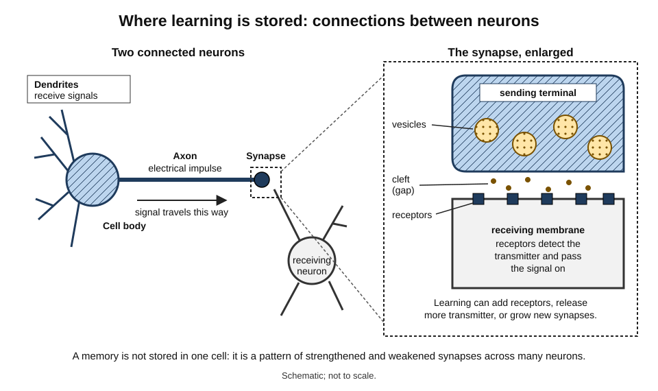
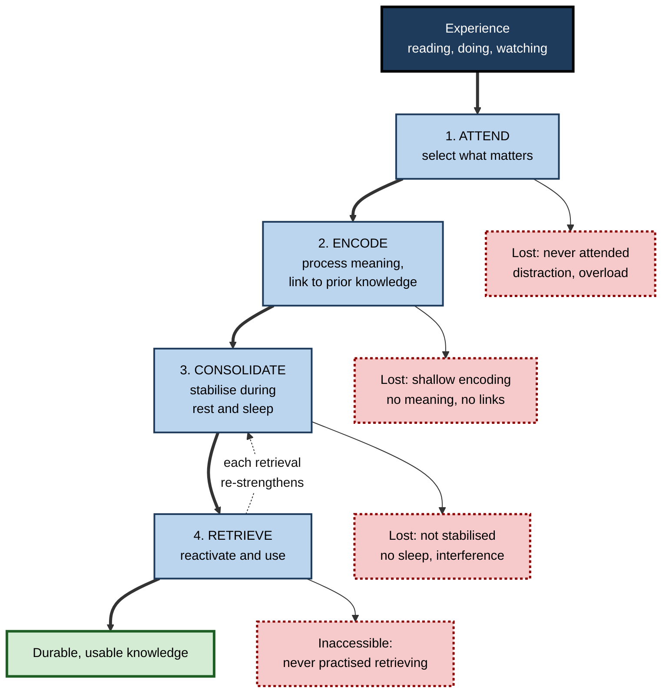
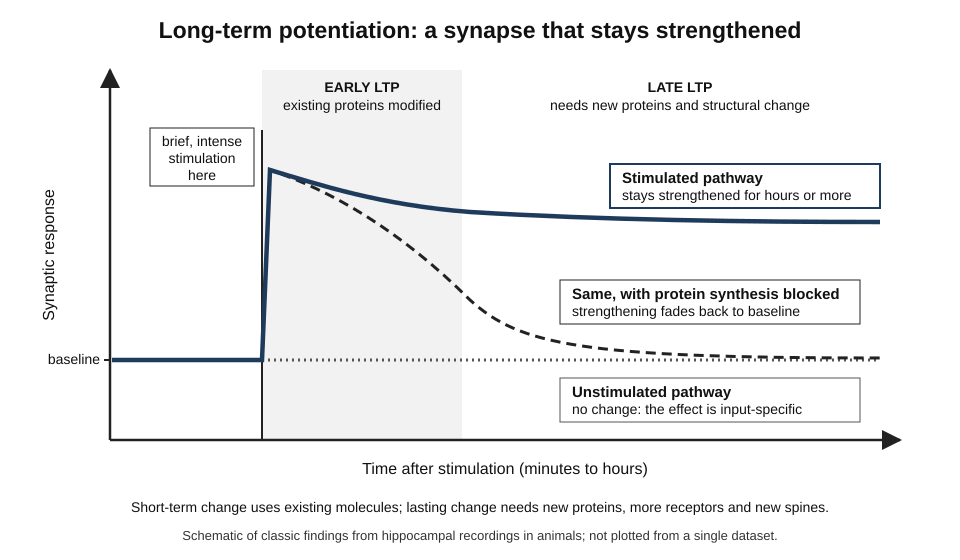
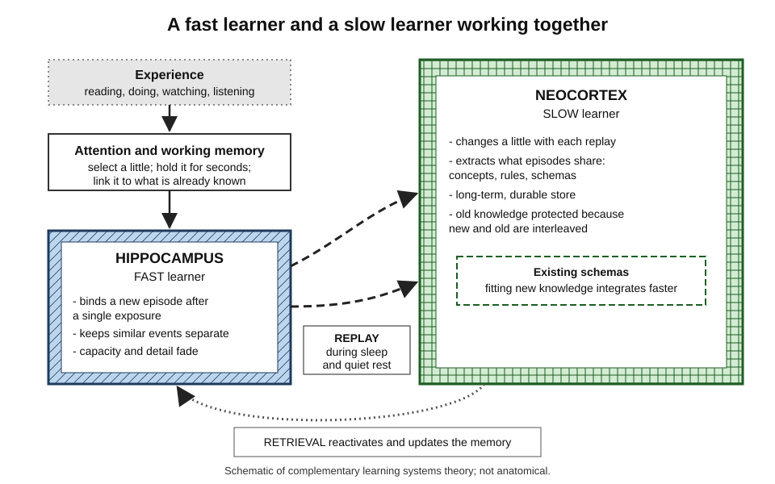
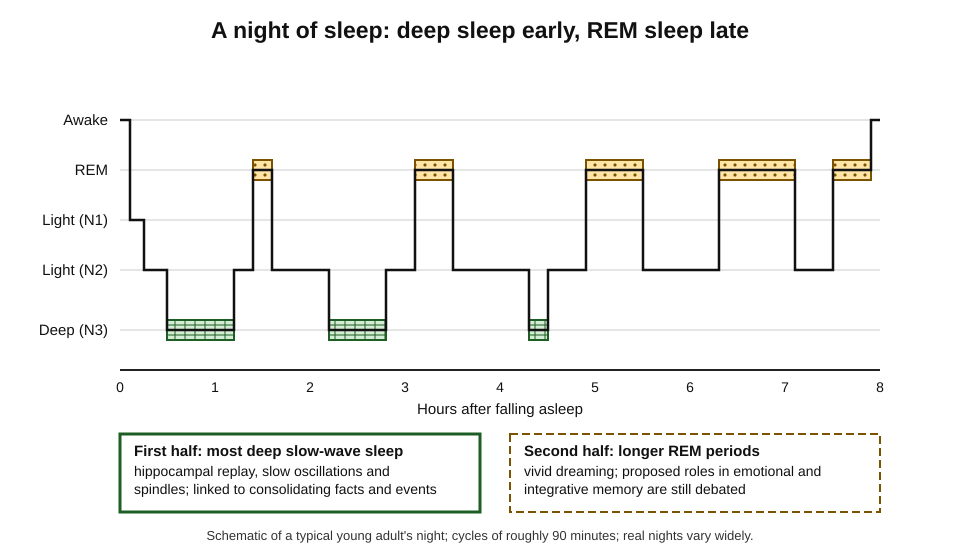
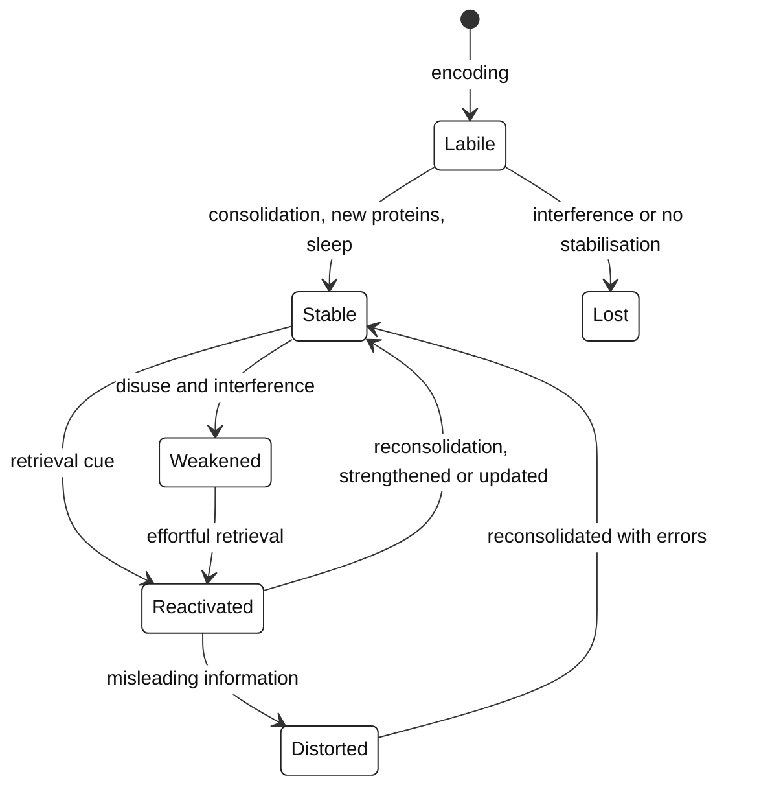

# A.3. How the Brain Acquires Knowledge

A new analyst hears a colleague's name once in a busy meeting and has lost it by lunch; after three conversations it is fixed for years. A route to a new office feels bewildering for a week, then runs on its own. A consultant reads sixty pages late at night, recognises every term the client uses next morning — and can use almost none of them. Each case is the same machine at work: a brain turning **experience** into **physical change**, succeeding or failing at identifiable steps.

> **Definition — Knowledge acquisition (neural view):** the process by which experience produces lasting changes in the strength, structure and organisation of connections between neurons, so that information or skill can later be reactivated and used.

**Why it matters**

- Knowing the steps from experience to durable knowledge shows **where** learning breaks down — distraction, overload, no link to prior knowledge, no sleep, no retrieval — so the right step can be fixed.
- It explains *why* well-supported study methods work, which makes them easier to adapt to new situations.
- It equips professionals to judge the many "brain-based" claims in education and training products.
- It clarifies what is lost when tools, including AI, do the processing that would otherwise change the learner's brain.

---

## The Brain's Raw Materials

### Neurons and synapses

- **Neurons** — cells specialised for signalling.
  - The human brain contains roughly **86 billion** (Suzana Herculano-Houzel and colleagues, 2009).
  - **Dendrites** receive signals; the **cell body** integrates them; the **axon** carries an electrical impulse to other cells.
- **Synapses** — junctions where one neuron passes a signal to another.
  - A typical neuron has thousands; the brain has on the order of a hundred trillion or more.
  - The sending terminal releases chemical **neurotransmitters** across a tiny gap (the **synaptic cleft**) onto **receptors** of the receiving cell.
- **Glia** — supporting cells, about as numerous as neurons.
  - Insulate axons (myelin), clear transmitters, supply energy; some also influence plasticity.

> **Definition — Synapse:** the junction at which one neuron transmits a signal to another, usually by releasing a neurotransmitter.

> **Definition — Neurotransmitter:** a chemical released at a synapse that excites or inhibits the receiving neuron. **Glutamate** is the main excitatory transmitter; **GABA** the main inhibitory one.

**Figure 1.** Two neurons and the synapse between them.

### Neuromodulators: the brain's "this matters" signals

- **Dopamine** — signals that an outcome was better or worse than expected; shapes what is repeated and attended to.
- **Noradrenaline** — arousal and alertness; strengthens memory for emotionally significant events.
- **Acetylcholine** — attention and the encoding of new information; levels differ between waking and sleep.
- These do not carry the content of a memory; they **adjust how strongly** synapses change.

### Knowledge as a distributed pattern

- A memory is not stored in one cell or one place — it is a **pattern of connection strengths** across many neurons, often in several regions.
- The same neurons take part in many memories; memories differ in **which combination** is active.
- **Karl Lashley (1950), "In search of the engram":** after decades of removing parts of rats' cortex, he could find no single site where a maze memory was stored — performance declined with the **amount** removed, not its location.

> **Definition — Engram:** the physical trace of a memory — the set of neurons and connections whose change stores it and whose reactivation retrieves it. The term was coined by Richard Semon (1904).

> **Key point:** learning is the brain **re-weighting connections**. Weakening matters as much as strengthening: learning sculpts as well as adds.

---

## From Experience to Knowledge: Four Stages

Experience becomes usable knowledge only if it passes four stages. Each stage depends on different brain processes, and each can fail on its own.

1. **Attend** — select a small part of the incoming flood for further processing.
2. **Encode** — hold it in working memory and transform it into a storable representation, linked to existing knowledge.
3. **Consolidate** — stabilise the new trace over hours, days and longer, much of it offline during rest and sleep.
4. **Retrieve** — reactivate it when needed — which also changes it.

> **Mnemonic — "All Experience Can Remain" (AECR):** Attend, Encode, Consolidate, Retrieve.

**Figure 2.** The four stages from experience to durable knowledge, and where knowledge is lost.

### Stage 1 — Attend

- The senses deliver far more than can be processed; **attention** amplifies some signals and suppresses others.
- Unattended information is mostly lost within seconds.
- **Inattentional blindness** — Daniel Simons and Christopher Chabris (1999): about half of viewers counting basketball passes failed to notice a person in a gorilla suit walking through the scene.
- **Divided attention** at encoding — studying while switching to messages — reliably weakens later memory, even when the material seems to have been "taken in".

### Stage 2 — Encode

- **Working memory** holds a few items for seconds while they are processed; it is easily overloaded.
- **Depth of processing** — Fergus Craik and Robert Lockhart (1972): thinking about **meaning** produces more durable memories than attending to surface features.
  - *e.g.* asking "does this word fit the sentence?" beats "is this word in capital letters?"
- **Prior knowledge** gives new information something to attach to — more links, more routes back.
- **Generation and explanation** — producing an answer or an explanation encodes more than reading one.

### Stage 3 — Consolidate

- A newly encoded trace is **fragile**: it can be disrupted by interference, injury or lack of sleep.
- **Synaptic consolidation** — over minutes to hours, changes at individual synapses are stabilised by new proteins.
- **Systems consolidation** — over days to years, memories are reorganised across brain regions, becoming more integrated with existing knowledge.

### Stage 4 — Retrieve

- Retrieval is **reconstruction**, not playback: the brain rebuilds the memory from cues.
- Successful retrieval **changes** the memory — usually strengthening and updating it.
- Retrieval depends on the match between the cues available and those present at encoding (**encoding specificity**, Endel Tulving and Donald Thomson, 1973).

**The four stages compared**

| Stage | What happens in the brain | Typical symptom of failure | Matching fix |
|---|---|---|---|
| Attend | Prefrontal and parietal networks select and amplify input | "I read the page but can say nothing about it" | Remove distractions; set a question before reading |
| Encode | Working memory processes meaning; hippocampus binds elements | "I followed it, but it slipped away at once" | Smaller chunks; worked examples; link to known ideas |
| Consolidate | New proteins stabilise synapses; replay during sleep reorganises memory | "I knew it yesterday; gone today" | Protect sleep; space sessions; avoid immediate overload |
| Retrieve | Cues reactivate the engram; reactivation updates it | "I know I know it, but cannot get it out" | Practise recall; vary cues and contexts |

---

## How Synapses Learn

### Hebb's postulate

- **Donald Hebb (1949):** when one cell repeatedly helps to fire another, some growth or metabolic change makes the first more effective at firing the second.
- Often summarised as **"neurons that fire together, wire together"** (a phrase popularised later by the neuroscientist Carla Shatz).
- Implication: **co-activation** builds association — ideas, cues and actions experienced together become linked.

> **Definition — Synaptic plasticity:** the capacity of synapses to strengthen or weaken in response to activity — the leading candidate mechanism for storing memories.

### Long-term potentiation

**Study card — Bliss and Lømo (1973)**

- **Design:** in anaesthetised rabbits, Timothy Bliss and Terje Lømo stimulated a pathway into the hippocampus with brief bursts of high-frequency pulses and recorded the response of the receiving cells.
- **Results:**
  - responses to ordinary single pulses were **enhanced for hours** after the bursts;
  - unstimulated pathways to the same cells were unaffected.
- **Conclusion:** synapses can be strengthened for long periods by brief activity — the physical change Hebb had predicted, in the region already linked to memory.

> **Definition — Long-term potentiation (LTP):** a lasting increase in synaptic strength following intense or repeated activation. Its counterpart, **long-term depression (LTD)**, is a lasting decrease.

**How LTP works — the main steps**

1. **Coincidence detection** — the **NMDA receptor** opens only when the sending cell releases glutamate *and* the receiving cell is already active — a molecular "fire together" detector.
2. **Calcium entry** — triggers enzymes that modify existing proteins.
3. **More receptors** — additional **AMPA receptors** are inserted into the receiving membrane, so the same signal produces a bigger response (**early LTP**, minutes to a few hours).
4. **New proteins and structure** — gene expression produces new proteins; **dendritic spines** enlarge or new ones form (**late LTP**, hours to days and longer).

**Figure 3.** Long-term potentiation: early change fades unless new proteins are made.

- **Input specificity** — only the active synapses change, which lets each neuron store many different associations.
- **Synaptic tagging** — Uwe Frey and Richard Morris (1997): a weakly stimulated synapse can "capture" proteins made in response to strong stimulation elsewhere on the same neuron.
  - A possible cellular explanation for why ordinary events near a significant one are sometimes remembered better.

### Short-term and long-term memory in a sea slug

**Study card — Eric Kandel's work on *Aplysia* (1960s–2000s)**

- **Why a sea slug:** a simple nervous system with large, identifiable neurons, and a measurable reflex — gill withdrawal.
- **Findings:**
  - a **single** shock produced short-term sensitisation lasting minutes, through chemical changes at existing synapses;
  - **repeated, spaced** shocks produced long-term sensitisation lasting days, requiring **gene expression, new proteins and new synaptic connections**.
- **Conclusion:** short-term and long-term memory differ in mechanism; lasting memory requires **structural** change. Kandel shared the 2000 Nobel Prize in Physiology or Medicine.

> **Key point:** at the cellular level, durable memory needs **new proteins and new structure** — one biological reason why repetition spread over time builds more lasting learning than one burst.

> **Watch out:** the link between LTP and memory is strong but **inferred**. Blocking LTP mechanisms impairs many kinds of learning in animals, but no single experiment proves that every memory is "just" LTP. Most of this evidence comes from rodents, slugs and brain slices.

### Engrams made visible

**Study card — Liu, Ramirez and colleagues in Susumu Tonegawa's laboratory (2012)**

- **Design:** in mice, neurons in the hippocampus that were active while the animals learned to fear a particular chamber were genetically tagged with a light-sensitive protein.
- **Results:** later, shining light on only those tagged cells made mice **freeze** in a different, safe chamber — as if recalling the fear memory.
- **Conclusion:** a sparse set of cells active during learning is **sufficient** to trigger recall — strong evidence that engrams are physical and identifiable.

- **Allocation:** neurons that happen to be more excitable at the time of learning are more likely to join the engram (work by Sheena Josselyn, Paul Frankland and others).
- **Linking:** memories formed within hours of each other tend to share engram cells, which may help link events close in time.

> **Watch out:** engram research uses genetic and optical tools available only in animals. It strongly supports the idea that memories are physical traces, but by itself prescribes nothing about how to teach.

---

## The Hippocampus and the Neocortex

### The patient who could not form new memories

**Study card — Henry Molaison ("H.M."), Scoville and Milner (1957)**

- **Background:** in 1953, to treat severe epilepsy, surgeon William Scoville removed most of the hippocampus and nearby tissue on both sides of H.M.'s brain.
- **Results (Brenda Milner and colleagues, over decades):**
  - profound inability to form new memories of facts and events (**anterograde amnesia**);
  - loss of some memories from the years before surgery, while older memories were largely preserved;
  - intact intelligence, language, personality and short-term memory — he could hold a number in mind by rehearsing it;
  - he improved at new motor skills, such as mirror drawing, without remembering having practised them.
- **Conclusion:** the hippocampal region is essential for forming new memories of facts and events, but not for storing old ones or for holding information briefly; different kinds of learning depend on different brain systems.

> **Definition — Hippocampus:** a curved structure deep in each temporal lobe that rapidly binds the elements of an experience — what, where, when — into a new memory.

- **Place cells** — John O'Keefe (1971) found hippocampal neurons that fire when a rat is in a particular location; with May-Britt and Edvard Moser's **grid cells**, this work earned the 2014 Nobel Prize. The hippocampus builds maps of space — and, many researchers argue, of relationships between ideas.

**Study card — London taxi drivers (Eleanor Maguire and colleagues, 2000 onward)**

- **Design:** brain scans of licensed London taxi drivers, who must learn the city's tangle of streets ("the Knowledge") over years of training.
- **Results:**
  - drivers had larger **posterior** hippocampi than controls, and a smaller anterior region;
  - posterior volume rose with years of driving;
  - a comparison with bus drivers on fixed routes (2006) suggested the difference reflected **spatial learning**, not driving or stress;
  - a longitudinal study (Katherine Woollett and Maguire, 2011) found that trainees who **qualified** showed growth in the posterior hippocampus over training; those who failed or did not train did not.
- **Conclusion:** intensive, prolonged learning can change the structure of the adult brain — though the samples were small and the changes modest.

### Why two learning systems?

**Complementary learning systems theory** — James McClelland, Bruce McNaughton and Randall O'Reilly (1995)

- **The problem:** a network that learns new information quickly by changing many shared connections **overwrites** old knowledge — **catastrophic interference**, seen in early artificial neural networks.
- **The solution:**
  - the **hippocampus** learns fast, storing each episode separately with little overlap;
  - the **neocortex** learns slowly, changing a little each time and extracting what many experiences have in common;
  - the hippocampus **replays** recent experiences to the neocortex, **interleaved** with older knowledge, so new learning is integrated without wrecking the old.

**Figure 4.** The two-speed learning system.

| | Hippocampus | Neocortex |
|---|---|---|
| Learning speed | Fast — one exposure can suffice | Slow — many exposures or replays |
| What it stores best | Specific episodes and new associations | General knowledge, concepts, skills, schemas |
| Overlap between memories | Low — similar events kept distinct | High — shared structure extracted |
| Role over time | Essential early; many memories become less dependent on it | Becomes the main long-term store |
| Damage leads to | Inability to form new fact and event memories | Loss of specific knowledge or abilities, depending on region |

> **Key point:** the two-speed design is one reason why **spacing** and **sleep** matter — the slow system needs repeated, distributed opportunities to absorb what the fast system has captured.

### Prior knowledge speeds consolidation

**Study card — Tse and colleagues, in Richard Morris's laboratory (2007)**

- **Design:** rats spent weeks learning a "schema" — a set of flavour–location pairings in a familiar arena.
- **Results:**
  - once the schema existed, rats learned **new** flavour–location pairs in a **single** trial;
  - these new memories became independent of the hippocampus within about **two days** — far faster than usual.
- **Conclusion:** new information that fits an existing framework can be consolidated rapidly — a biological basis for the power of prior knowledge.

### How long does the hippocampus stay involved?

- **Standard consolidation model** — memories gradually become independent of the hippocampus.
- **Multiple trace / trace transformation theory** — Lynn Nadel and Morris Moscovitch (1997 onward): **detailed** memories of personal events may always need the hippocampus; what becomes independent is the **gist** and general knowledge.

> **Watch out:** which account is correct, and for which kinds of memory, is **actively debated**. Both agree that memories are transformed over time — becoming more general and more integrated — rather than simply copied from one place to another.

---

## Sleep and Offline Consolidation

### Replay

**Study card — Wilson and McNaughton (1994)**

- **Design:** recorded many hippocampal place cells in rats as they explored, then during sleep afterwards.
- **Results:** cells that fired together during exploration **fired together again** during subsequent slow-wave sleep, more than before exploration.
- **Conclusion:** the sleeping brain **replays** recent experience — the proposed mechanism for training the neocortex offline.

- Later work showed replay is often **compressed** in time and occurs during brief bursts called **sharp-wave ripples**, also in quiet waking rest.
- Interrupting ripples in rats after learning impaired later memory — evidence that replay is not a by-product but contributes to consolidation.

### The sleeping brain's rhythms

- **Slow-wave (deep) sleep** — large, slow oscillations across the cortex.
- **Sleep spindles** — brief bursts of faster activity generated by the thalamus.
- **Sharp-wave ripples** — fast hippocampal bursts carrying replay.
- **Active systems consolidation model** (Jan Born, Björn Rasch and colleagues): the three are **coupled** — ripples nested in spindles nested in slow oscillations — so hippocampal replay reaches the cortex at moments when it is receptive.

**Figure 5.** Sleep stages across a typical night.

**Sleep stages compared**

| | Slow-wave sleep (N3) | Light sleep (N2) | REM sleep |
|---|---|---|---|
| When it dominates | First half of the night | Throughout | Second half of the night |
| Signature activity | Slow oscillations | Sleep spindles | Fast, waking-like activity; vivid dreams |
| Best-supported memory role | Consolidating facts and events via replay | Spindle density linked to memory and skill gains | Proposed roles in emotional memory and integration — debated |

### Evidence from people

- **Jenkins and Dallenbach (1924):** two participants forgot less of what they had learned if they slept afterwards than if they stayed awake for the same interval — the first evidence that sleep protects memories (originally explained as less interference).
- **Sleep before learning matters too** — a night of sleep deprivation markedly reduces the brain's ability to encode new memories the next day, with reduced hippocampal activity during learning (Seung-Schik Yoo, Matthew Walker and colleagues, 2007).
- **Targeted memory reactivation** — Björn Rasch and colleagues (2007): an odour present during learning, re-presented during slow-wave sleep, improved later memory for card locations; similar effects with sounds (Rudoy and colleagues, 2009).
- **Quiet wakeful rest** — several studies (for example by Michaela Dewar and colleagues) found that a few minutes of undemanding rest after learning improved later retention compared with a filler task.

> **Watch out:** some early findings of large sleep benefits for motor skills turned out to be partly artefacts of how practice was measured (Timothy Rickard and colleagues, 2008), and sleep–memory effects vary between studies. The overall conclusion that sleep supports consolidation is well supported; the size of the benefit for any particular task is less certain.

> **Watch out:** "learning while asleep" by playing recordings of new material does not work for complex content. Sleep **consolidates** what was learned while awake; at most, very simple associations have been formed during sleep in laboratory studies.

> **In practice:** cutting sleep to study more undermines both the **encoding** of the next day's material and the **consolidation** of what was just studied.

---

## Prediction, Surprise, Reward and Emotion

### Dopamine and prediction error

**Study card — Schultz, Dayan and Montague (1997)**

- **Observation (Wolfram Schultz's recordings in monkeys):**
  - dopamine neurons fired to an **unexpected** reward;
  - after learning, they fired to the **cue** that predicted the reward, not to the reward itself;
  - when an expected reward was **omitted**, their firing **dipped** below baseline.
- **Interpretation:** dopamine signals a **reward prediction error** — the difference between what was expected and what happened — matching the teaching signal in computational reinforcement-learning models.
- **Conclusion:** the brain learns most from **surprise**; fully predicted outcomes teach little.

> **Definition — Prediction error:** the difference between what the brain expected and what occurred; a central signal that drives learning.

- **Implication:** making a prediction or a guess before seeing an answer creates an expectation for feedback to correct — one reason why attempting a problem before instruction can aid learning.
- **Novelty** — new events engage a loop between the hippocampus and dopamine-producing midbrain regions (John Lisman and Anthony Grace, 2005), which can strengthen memory for what happens around them.

### Curiosity

- **Gruber, Gelman and Ranganath (2014):** when people were curious about the answer to a trivia question, they remembered the answer better — and also remembered **unrelated faces** shown while they waited.
  - Curiosity states engaged reward-related regions and the hippocampus.
- **Implication:** opening with a genuine question, puzzle or problem prepares the brain to encode what follows.

### Emotion and stress

- **The amygdala** tags experiences with emotional significance; stress hormones (adrenaline, cortisol) acting via the amygdala **enhance consolidation** of emotionally arousing events (James McGaugh and colleagues).
- **Moderate arousal helps; extreme or chronic stress harms** — acute stress can impair **retrieval**, and chronic stress damages hippocampal function.
- **Emotional memories feel vivid** but are not necessarily **accurate** — confidence and accuracy can diverge.

> **Watch out:** popular talk of "dopamine hits" from learning apps misrepresents the science. Dopamine signals prediction errors and motivational significance; it is not a pleasure chemical that, once triggered, guarantees learning.

---

## Retrieval Rebuilds Memory

### Reconsolidation

**Study card — Nader, Schafe and LeDoux (2000)**

- **Design:** rats learned to fear a tone paired with a shock. Days later, after the memory was consolidated, the tone was played again to **reactivate** the memory, and a drug blocking protein synthesis was injected into the amygdala.
- **Results:** the next day the rats showed **little fear** of the tone; rats given the drug without reactivation kept their fear.
- **Conclusion:** a reactivated memory becomes **labile** again and must be re-stabilised — **reconsolidated** — with new proteins.

> **Definition — Reconsolidation:** the re-stabilisation of a memory after retrieval has made it temporarily changeable.

- **Benefits:** retrieval offers a window to **strengthen** and **update** knowledge — integrating corrections and new information.
- **Risks:** misleading information introduced around retrieval can **distort** memory.
  - *e.g.* Elizabeth Loftus and John Palmer (1974): witnesses asked how fast cars were going when they "smashed" into each other gave higher speed estimates — and more often falsely recalled broken glass — than those asked about cars that "hit".

> **Watch out:** reconsolidation is well established in animal studies, but its **boundary conditions** (which memories, how old, how strongly reactivated) and its clinical use — for example in treating traumatic memories — remain **debated**, with mixed results in human trials.

**Figure 6.** The life cycle of a memory.

### Forgetting is partly active

- Forgetting is not only passive decay; the brain actively **weakens** some traces through interference and dedicated molecular processes.
- **Blake Richards and Paul Frankland (2017)** argued that forgetting serves memory's purpose — **flexible decisions** — by clearing outdated detail and favouring generalisation.
- **Implication:** forgetting between practice sessions is not wasted effort; effortful retrieval of a partly forgotten memory can strengthen it more than easy retrieval of a fresh one.

---

## A Brain That Keeps Changing

- **Structural change with learning in adults** — Bogdan Draganski and colleagues (2004): learning to juggle over three months produced detectable increases in grey matter in motion-processing regions, which partly reversed when practice stopped.
- **Critical and sensitive periods** — some capacities (for example aspects of vision and native-like accent) are learned most easily early in life; most professional learning has no such hard window.
- **Ageing** — learning remains possible throughout life; processing speed and some forms of new-memory formation slow, while accumulated knowledge often grows.

> **Watch out:** whether the adult human hippocampus keeps producing **new neurons** is **contested** — in 2018 two high-profile studies (Shawn Sorrells and colleagues; Maura Boldrini and colleagues) reached opposite conclusions. Adult learning is well explained by synaptic and structural change regardless of how that debate is settled.

---

## Brain Claims in the Learning Market

**Common claims compared with the evidence**

| Claim | Grain of truth | What the evidence shows |
|---|---|---|
| "People use only 10% of their brains" | Not all neurons fire at once | Imaging shows activity throughout the brain; there is no idle reserve |
| "People are left-brained or right-brained learners" | Some functions are lateralised, e.g. much of language | Both hemispheres work together in almost all tasks; no evidence for "brain-dominance" teaching |
| "Brain-training games make people smarter" | People improve at the trained games | Gains transfer little to untrained everyday abilities (Simons and colleagues' 2016 review) |
| "Listening to Mozart raises intelligence" | A small, short-lived improvement in one spatial task (1993) | Later meta-analyses found the effect small and plausibly explained by arousal and mood |
| "Learn while you sleep" | Sleep consolidates waking learning | New complex material is not learned during sleep |
| "Drinking water and special movements boost brain function" | Severe dehydration impairs thinking | No evidence that "brain gym" movements improve learning |

**Testing a neuroscience claim**

1. **Is there behavioural evidence** from learners, with a comparison group and a delayed test?
2. **Is the brain region or chemical relevant**, or decorative?
3. **Would the method be justified without the neuroscience?** If yes, the neuroscience adds nothing; if no, the method lacks evidence.
4. **Is an animal or laboratory finding being stretched** into a product promise?

> **Key point:** neuroscience explains **why** good methods work; behavioural evidence decides **which** methods to use.

---

## Designing Learning That Respects the Brain

**Design principles by stage**

| Stage | Design principle | Workplace implementation |
|---|---|---|
| Attend | Give a reason to care; protect attention | Open with a real problem; no multitasking in live sessions; short, purposeful video segments |
| Encode | Manage load; build on prior knowledge | Pre-assess what people know; worked examples for novices; analogies to familiar systems |
| Consolidate | Distribute learning; respect sleep and rest | Split a two-day workshop into half-days across two weeks; avoid late-night bootcamps |
| Retrieve | Make people produce, not just recognise | Spaced scenario questions; teach-backs; real tasks performed unaided |

### Worked example: diagnosing a "forgotten" presentation

- **Situation:** a product manager attended a 90-minute architecture briefing at 6 p.m., understood it, slept five hours, and next morning could not explain the new data flow.

1. **Attend?** She was answering messages during the second half → attention divided → encoding weakened.
2. **Encode?** The material was new, with no link to systems she knew → shallow encoding.
3. **Consolidate?** Short sleep → reduced slow-wave and spindle-rich sleep, especially late-night stages → weaker stabilisation.
4. **Retrieve?** No attempt to recall before the next morning → no strengthening; cues at the meeting differed from those in the briefing.

- **Redesign:** close messages; ask beforehand "how does this differ from our current flow?"; sketch the flow from memory five minutes after the briefing; sleep normally; redraw it from memory next morning before checking the slides.

> **Watch out:** "I understood it at the time" describes successful **encoding into working memory**, not durable storage. Understanding during a session is necessary but not sufficient.

### Case study: training a hospital for a new records system

- **Situation:** a hospital group planned a single full-day training on a new electronic records system in the week before go-live; staff work shifts and many would arrive after night duty.
- **Problem:** previous rollouts had produced a surge of errors and support calls in the first month.
- **Diagnosis (by stage):**
  1. **Attend and encode** — a whole day of new screens overloads working memory; staff coming off nights cannot attend well.
  2. **Consolidate** — no sleep between learning and use for some staff; no spacing at all.
  3. **Retrieve** — demonstration-only training never asked staff to perform workflows unaided.
- **Actions:**
  1. A 20-minute orientation, then three 45-minute hands-on sessions spaced over two weeks, scheduled at the **start** of shifts.
  2. Each session opened with a short task recalling the previous session's workflow without help.
  3. A practice environment let staff rehearse real workflows unaided between sessions.
  4. Night-shift staff were never trained at the end of a night.
- **Result:** support calls and documentation errors in the first month were substantially lower than in the previous rollout; staff reported the sessions as "harder" than the old demonstrations.
- **Side effects / caveats:** scheduling three short sessions cost more coordination; other differences between rollouts (a better-designed system, more floor support) may have contributed.
- **Lesson:** designing for **all four stages** — attention, encoding, consolidation, retrieval — matters more than the total hours of training.

---

## When Tools Do the Processing

- **Offloading skips encoding.** If an assistant summarises a document, the reader's brain has not processed its meaning — little is encoded, and there is nothing for sleep to consolidate.
- **A small 2025 study** (Nataliya Kosmyna and colleagues, released as a preprint) recorded brain activity while people wrote essays with a chatbot, a search engine or unaided; chatbot users showed weaker connectivity in the brain networks recorded and were worse at quoting their own essays.
  - The sample was small and the work had not completed peer review when released, so it is suggestive rather than settled — but it fits the wider evidence that letting tools do the thinking reduces what is learned.
- **Use AI to engage the stages, not replace them:**
  - to quiz, which engages **retrieval**;
  - to ask for predictions before answers, which creates **prediction errors**;
  - to check explanations the learner has generated, which deepens **encoding**.

> **In practice:** "attempt first, then ask" keeps the learner's brain doing the processing that changes it.

---

## Open Questions

- **How do engrams in mice map onto human knowledge?**
  - Human memory for concepts, arguments and skills is far richer than a conditioned fear; how far engram principles scale up is unknown.
- **What exactly does sleep do for which memories?**
  - The roles of slow-wave sleep, spindles and REM sleep for different kinds of learning remain debated, and effect sizes vary.
- **Does the hippocampus remain necessary for old memories?**
  - Standard and multiple-trace accounts still compete.
- **Can reconsolidation be harnessed safely?**
  - Updating or weakening harmful memories is promising but inconsistent in human trials.
- **How large are individual differences in plasticity, and can they be changed?**
  - Genetic, developmental and lifestyle factors all appear to matter; reliable, ethical ways to enhance plasticity are not established.
- **What does long-term reliance on AI do to the brain's learning systems?**
  - Early, small studies point to reduced engagement; long-term effects are unknown.

---

## Summary

- Knowledge is stored as **patterns of connection strengths** across many neurons, adjusted by **neuromodulators** such as dopamine and noradrenaline.
- Experience becomes knowledge in four stages — **attend, encode, consolidate, retrieve** — each with its own typical failure and fix.
- **Synaptic plasticity** — Hebb's postulate, **LTP** and LTD — is the leading cellular mechanism; lasting memory needs **new proteins and structural change** (Kandel's *Aplysia*).
- **Engrams** are physical: reactivating cells active during learning can trigger recall in mice.
- The **hippocampus** learns fast and binds new episodes (H.M.); the **neocortex** learns slowly and extracts structure — **complementary learning systems**; schemas speed consolidation.
- **Sleep** replays and consolidates memories; deep sleep dominates early, REM late; sleep loss impairs both encoding and consolidation.
- The brain learns from **prediction error**, **curiosity** and **emotional significance**; extreme stress harms.
- **Retrieval rebuilds** memories (**reconsolidation**) — strengthening, updating or distorting them; forgetting is partly active and useful.
- The adult brain keeps changing; adult neurogenesis is contested.
- **Behavioural evidence**, not brain vocabulary, decides which learning methods to use.
- Design learning for all four stages; with AI, **attempt first, then ask**.

---

## Self-Check

1. What is a synapse, and what changes at synapses when something is learned?
2. Name the four stages from experience to durable knowledge and give one typical failure at each.
3. What did Bliss and Lømo discover, and why was it important?
4. Explain the difference between early and late LTP. What does this suggest about repeated, spaced learning?
5. What did Kandel's work on *Aplysia* reveal about short-term and long-term memory?
6. Describe what H.M. could and could not learn after his surgery, and what this showed.
7. Why does the brain need both a fast-learning hippocampus and a slow-learning neocortex?
8. What did Tse and colleagues show about schemas and consolidation?
9. Describe the evidence that sleep replays recent experience. Why is cutting sleep to study counterproductive?
10. What is a reward prediction error, and how does it help explain why guessing before seeing an answer can aid learning?
11. What is reconsolidation, and what are its benefit and its risk?
12. Evaluate this claim: "Our course activates the right brain and triggers dopamine for three times better retention."
13. A colleague "understood everything" at an evening workshop but cannot recall it two days later. Diagnose by stage and propose a fix.
14. Redesign a one-day product training for shift-working field engineers using the four stages.

### Answer Key

1. The junction where one neuron signals to another via neurotransmitters. Learning strengthens or weakens synapses — more receptors, more transmitter release, enlarged or new dendritic spines, or removal of connections.
2. Attend (distraction, overload); encode (shallow processing, no link to prior knowledge); consolidate (no sleep, interference); retrieve (never practised recall, mismatched cues).
3. Brief high-frequency stimulation of a hippocampal pathway produced a lasting enhancement of synaptic responses, specific to the stimulated pathway — the first demonstration of a durable, activity-dependent synaptic change of the kind Hebb predicted, in a region linked to memory.
4. Early LTP modifies existing proteins and adds receptors, lasting minutes to hours; late LTP needs gene expression, new proteins and structural change, lasting much longer. Durable memory requires repeated, well-timed activation that triggers structural change, consistent with the benefit of spaced repetition.
5. A single stimulus gave short-term memory through chemical changes at existing synapses; repeated, spaced stimuli gave long-term memory requiring gene expression, new proteins and new synapses — the two depend on different mechanisms.
6. He could not form new memories of facts and events but kept intelligence, language, short-term memory and many older memories, and he learned new motor skills without remembering the practice. The hippocampal region is essential for forming new declarative memories, and other kinds of learning rely on other systems.
7. A single fast learner would overwrite old knowledge (catastrophic interference). The hippocampus captures episodes quickly and separately; the neocortex learns slowly through interleaved replay, integrating new knowledge without destroying the old.
8. Rats with a well-learned schema learned new associations in one trial, and those memories became hippocampus-independent within about two days — prior knowledge accelerates consolidation.
9. Place cells active together during exploration fire together again during subsequent sleep (Wilson and McNaughton), often in sharp-wave ripples coupled to spindles and slow oscillations; disrupting ripples impairs memory. Cutting sleep reduces consolidation of what was learned and impairs encoding of new material the next day.
10. The difference between expected and actual outcome, signalled by dopamine neurons. A guess creates an expectation, so feedback produces a prediction error that marks the correct answer as worth learning.
11. A retrieved memory becomes temporarily changeable and must be re-stabilised. Benefit: retrieval can strengthen and update knowledge. Risk: misleading information at retrieval can distort it.
12. "Right brain" learning is a neuromyth; "triggers dopamine" is decorative vocabulary; "three times better retention" needs a comparison group, a defined measure and a delayed test. Ask for behavioural evidence; without it, reject the claim.
13. Attention was likely divided or tired in the evening; encoding was shallow if nothing was linked to prior knowledge; sleep may have been short; no retrieval followed. Fix: attend with a question in mind, summarise from memory soon after, sleep normally, and recall the next day before re-reading.
14. E.g. a short orientation, then three or four hands-on sessions spread over two weeks at the start of shifts; each opening with unaided recall of the last session; worked examples and a sandbox; no sessions after night shifts; a final unaided task on real equipment, and spaced scenario questions afterwards.

---

## Glossary

| Term | Meaning |
|---|---|
| Active systems consolidation | Model in which coupled sleep rhythms carry hippocampal replay to the cortex, reorganising memories. |
| AMPA receptor | A glutamate receptor whose insertion at a synapse strengthens it during LTP. |
| Amygdala | Structure that tags experiences with emotional significance and modulates their consolidation. |
| Anterograde amnesia | Inability to form new memories after brain injury. |
| Complementary learning systems | Theory that a fast hippocampal and a slow neocortical system together allow learning without overwriting. |
| Consolidation | Stabilisation of a new memory, at synapses (hours) and across brain systems (days to years). |
| Dendritic spine | A small protrusion on a dendrite where most excitatory synapses form; grows or shrinks with learning. |
| Dopamine | Neuromodulator that signals reward prediction errors and motivational significance. |
| Encoding specificity | Principle that retrieval succeeds best when cues match those present at encoding. |
| Engram | The physical trace of a memory in a set of neurons and their connections. |
| Hebb's postulate | Proposal that cells repeatedly active together strengthen their connection. |
| Hippocampus | Temporal-lobe structure that rapidly binds the elements of new episodes and facts. |
| Long-term depression | A lasting decrease in synaptic strength after particular patterns of activity. |
| Long-term potentiation | A lasting increase in synaptic strength after intense or repeated activation. |
| Neocortex | The brain's outer layer; the slow-learning, long-term store of knowledge. |
| Neuromodulator | A chemical, such as dopamine, that adjusts how strongly neurons and synapses respond and change. |
| Neuron | A cell specialised for electrical and chemical signalling. |
| NMDA receptor | A glutamate receptor that opens only when sending and receiving cells are active together; a coincidence detector. |
| Prediction error | The difference between expected and actual outcome; a signal that drives learning. |
| Reconsolidation | Re-stabilisation of a memory after retrieval has made it changeable. |
| Replay | Reactivation, during sleep or rest, of neural activity patterns from recent experience. |
| Schema | An organised framework of existing knowledge into which new information can be integrated. |
| Sharp-wave ripple | A brief, fast hippocampal burst during which replay occurs. |
| Sleep spindle | A brief burst of fast activity during light non-REM sleep, linked to memory consolidation. |
| Slow-wave sleep | Deep non-REM sleep dominated by slow oscillations; concentrated early in the night. |
| Synapse | The junction at which one neuron transmits a signal to another. |
| Synaptic plasticity | The capacity of synapses to strengthen or weaken with activity. |
| Synaptic tagging | Process by which a weakly activated synapse captures proteins made after strong activation elsewhere. |
