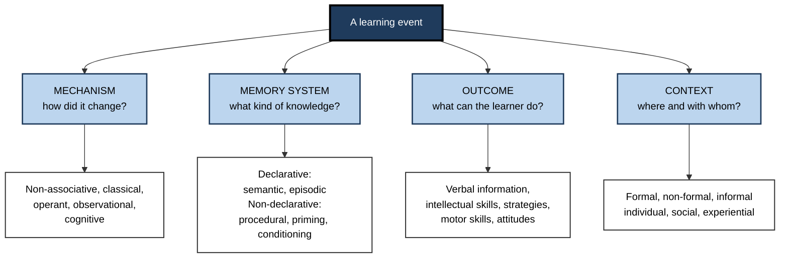
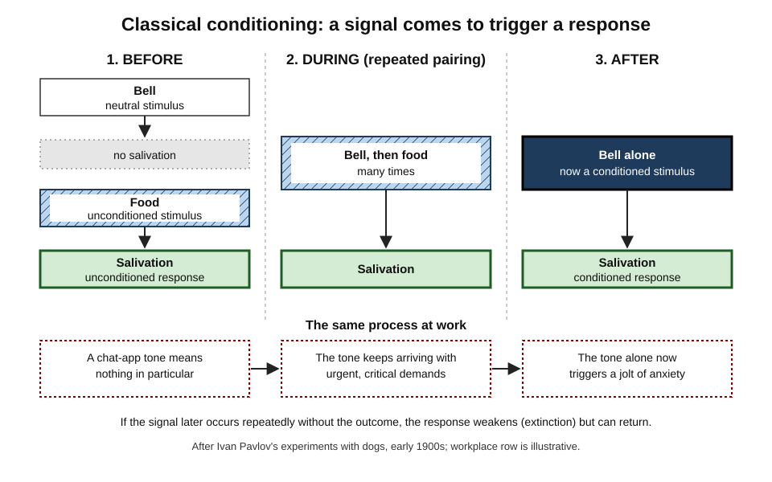
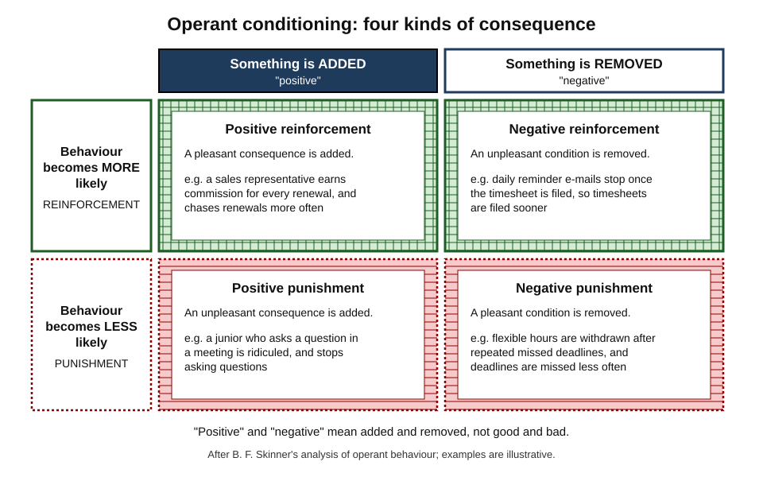
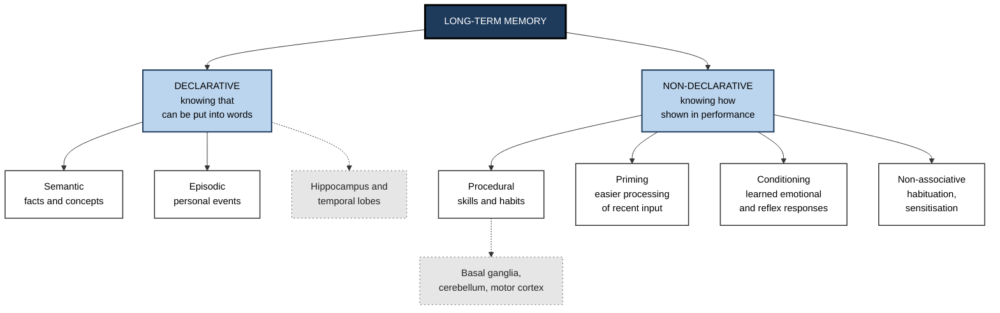
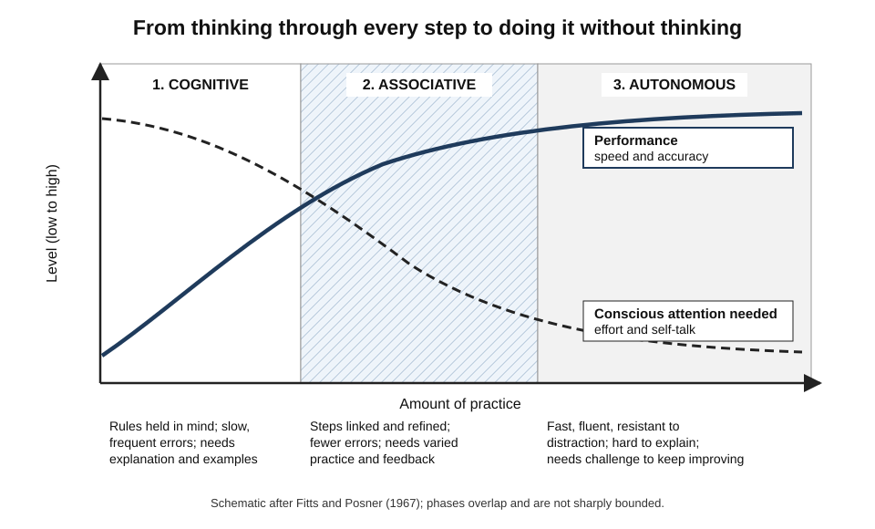
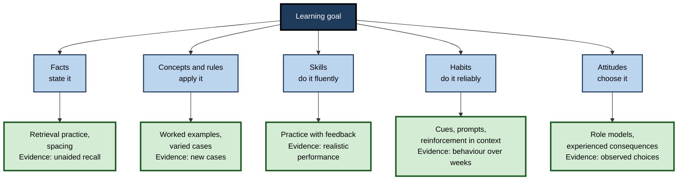

# A.4. Types of Learning

In her first month on a hospital ward, a newly qualified nurse learns the drug-interaction rules from a reference card, the feel of a smooth injection technique through practice, the unwritten norms of the handover by watching senior colleagues — and, without meaning to, a small surge of dread whenever a particular pager tone sounds. All four are learning, but they are **different kinds** of learning, produced by different processes, stored in different ways and needing different methods to build.

> **Definition — Types of learning:** classifications of learning by the **process** that produces the change (association, consequences, observation, understanding), the **kind of knowledge** that results (declarative or non-declarative), the **capability** acquired (facts, concepts, skills, strategies, attitudes) or the **context** in which it happens (formal, non-formal, informal; individual or social).

**Why it matters**

- The method that builds one kind of learning often fails for another: slides can convey facts but cannot build a negotiation skill; a quiz can check recall but not a habit.
- Many workplace "knowledge problems" are really **skill, habit or attitude** problems that information cannot fix.
- Choosing a method and an assessment that match the type of learning is one of the cheapest ways to improve training, coaching and self-study.
- Machine learning borrowed its main categories from these distinctions; understanding them clarifies what AI systems can and cannot do for human learners.

---

## Why Classify Learning at All?

There is no single official list of "the types of learning". Researchers classify learning in several complementary ways, much as a car can be described by its engine, its body type or its purpose.

- **By mechanism** — *how* the change happens.
  - *e.g.* by association, by consequences, by watching, by understanding.
- **By memory system** — *what kind of knowledge* results.
  - *e.g.* knowledge that can be stated versus know-how shown in performance.
- **By outcome** — *what the learner can do* afterwards.
  - *e.g.* state a fact, apply a rule, perform a skill, choose an action.
- **By context** — *where and with whom* it happens.
  - *e.g.* a course, a job, a conversation; alone or in a community.

> **Key point:** the lenses describe the **same events** from different angles. Learning to drive involves facts (the rules), concepts (right of way), procedural skill (clutch control), conditioning (alarm at brake lights), observation (copying a parent) and attitudes (caution) — all at once.

**Figure 1.** Four lenses for classifying learning.

---

## Learning by Mechanism

### Non-associative learning

- **Habituation** — a falling response to a repeated, harmless stimulus.
  - *e.g.* ceasing to notice an open-plan office's noise after a week.
- **Sensitisation** — a growing response to a stimulus after an intense or threatening one.
  - *e.g.* after a serious production outage, an engineer startles at every alert sound, even routine ones.
- Called **non-associative** because the learner links nothing to anything — the response to **one** stimulus changes.

> **Definition — Sensitisation:** an increased response to a stimulus following exposure to an intense or noxious stimulus.

### Classical conditioning: learning what predicts what

**Study card — Ivan Pavlov (from the 1890s; published widely in the early 1900s)**

- **Setting:** studying digestion in dogs, Pavlov noticed they began to salivate *before* food arrived — at the sight of the attendant or the sound of footsteps.
- **Design:** a neutral stimulus (such as a metronome or bell) was repeatedly presented just before food.
- **Results:** after several pairings the sound **alone** produced salivation.
- **Conclusion:** organisms learn **signals** — which events predict which others — and respond in advance.

> **Definition — Classical (Pavlovian) conditioning:** learning in which a neutral stimulus, repeatedly paired with a meaningful one, comes to evoke a response by itself. The meaningful stimulus is the **unconditioned stimulus**; the learned signal is the **conditioned stimulus**.

**Figure 2.** Classical conditioning before, during and after pairing.

**The key phenomena**

- **Acquisition** — the response grows with repeated pairings.
- **Extinction** — presenting the signal without the outcome weakens the response.
- **Spontaneous recovery** — an extinguished response returns after a pause; extinction is **new learning**, not erasure.
- **Generalisation** — similar signals also trigger the response.
  - *e.g.* anxiety at any message from a senior manager, not only the one who was harsh.
- **Discrimination** — learning to respond to one signal but not to similar ones.

**What is really learned — the cognitive turn**

- **Robert Rescorla (1968)** — pairing alone is not enough: animals learned a signal only if it was **informative** — if the outcome was more likely with the signal than without it (**contingency**).
- **Leon Kamin (1969), blocking** — if a light already predicted a shock, adding a tone alongside the light produced little learning about the tone: it added no new information.
- **Rescorla–Wagner model (1972)** — learning on each trial is proportional to **surprise**: the difference between the outcome and what was predicted.
  - The same prediction-error principle later found in dopamine neurons and used in machine reinforcement learning.

> **Key point:** conditioning is not mindless stamping-in of reflexes. Organisms learn **predictive relationships** — and learn most when outcomes are surprising.

**Biological preparedness**

- **Garcia and Koelling (1966):** rats readily learned to avoid a flavour paired with later illness — even after a delay of hours and a single pairing — but did not learn to link that flavour with a shock; they linked light-and-sound cues with shock instead.
- **Conclusion:** organisms are **prepared** to learn some associations more easily than others.
  - *e.g.* one episode of food poisoning can produce a lifelong aversion to a dish.

> **Watch out:** John Watson and Rosalie Rayner's "Little Albert" study (1920), often cited as proof that phobias are conditioned, involved one infant, informal measures and serious ethical failings by modern standards. The broader claim — that fears can be acquired by association — rests on much better later evidence, not on that study.

### Operant conditioning: learning from consequences

**Study card — Edward Thorndike (1898)**

- **Design:** hungry cats were placed in "puzzle boxes" that opened when they pressed a lever or pulled a loop; food lay outside.
- **Results:** escape times fell gradually over many trials, with no sudden "insight".
- **Conclusion — the law of effect:** responses followed by satisfying consequences become more likely; those followed by discomfort become less likely.

- **B. F. Skinner (1930s onward)** developed the systematic study of **operant behaviour** — behaviour that operates on the environment — using chambers in which animals pressed levers for food under controlled schedules.

> **Definition — Operant (instrumental) conditioning:** learning in which the frequency of a behaviour changes because of its consequences.

> **Definition — Reinforcement:** any consequence that makes a behaviour more likely. **Punishment** is any consequence that makes it less likely.

**Figure 3.** Four kinds of consequence in operant conditioning.

> **Watch out:** **negative reinforcement is not punishment.** It *increases* a behaviour by removing something unpleasant — the nagging reminders stop when the timesheet is filed, so timesheets are filed sooner.

**Schedules of reinforcement**

| Schedule | Rule | Typical pattern of behaviour | Workplace or everyday example |
|---|---|---|---|
| Continuous | Every response is reinforced | Fast learning; fast extinction when reinforcement stops | A new hire praised for every correctly closed ticket |
| Fixed ratio | Reinforced after a set number of responses | High rate with a pause after each reward | A bonus for every tenth sale |
| Variable ratio | Reinforced after an unpredictable number of responses | High, steady rate; very resistant to extinction | Checking a feed or inbox that is sometimes rewarding |
| Fixed interval | First response after a set time is reinforced | Activity bunches just before each deadline | Effort rising before a quarterly review |
| Variable interval | First response after an unpredictable time is reinforced | Steady, moderate rate | Checking for a reply that may come at any time |

**Shaping and other tools**

- **Shaping** — reinforcing successive approximations to a target behaviour.
  - *e.g.* a coach first praises a junior for sending any written summary, then only for summaries with a clear recommendation, then only for summaries a client could act on.
- **Extinction burst** — when a previously reinforced behaviour stops paying off, it often **intensifies** briefly before fading.
  - *e.g.* a colleague whose interruptions are no longer answered interrupts more for a while.
- **Immediacy** — consequences delivered soon after a behaviour shape it far more than delayed ones.

> **In practice:** incentive schemes are operant conditioning at scale. They reliably increase **what is measured and rewarded** — which is why poorly designed metrics produce gaming, and why rewarding only outcomes can suppress the asking of questions, reporting of errors and other behaviours that learning depends on.

> **Watch out:** punishment suppresses behaviour but teaches nothing about what to do instead, and it can condition fear of the punisher and the setting. A team that is criticised for reporting incidents learns to stop reporting them, not to stop having them.

### Observational learning: learning by watching

**Study card — Albert Bandura's Bobo doll studies (1961; 1965)**

- **Design (1961):** children watched an adult either attack an inflatable "Bobo" doll in distinctive ways or play quietly; they were then left with the doll.
- **Results:** children who had watched the aggressive model reproduced many of the **specific** novel actions and words.
- **Design (1965):** children saw the model **rewarded**, **punished** or neither.
  - Children who saw the model punished imitated less.
  - When later offered a reward for imitating, children in **all** groups reproduced the actions about equally well.
- **Conclusion:** behaviour can be learned **without being performed or reinforced**; consequences to the model affect mainly whether it is **performed**.

> **Definition — Observational (social) learning:** learning by watching others' behaviour and its consequences.

**Bandura's four processes**

1. **Attention** — the learner must notice the model's behaviour.
   - Models who are competent, high-status or similar to the learner attract more attention.
2. **Retention** — the behaviour must be remembered, often as images or verbal rules.
3. **Reproduction** — the learner must be physically and cognitively able to perform it.
4. **Motivation** — expected consequences decide whether it is performed.

> **Mnemonic — "ARRM":** Attention, Retention, Reproduction, Motivation — learning from a model needs all four arms.

- **Vicarious reinforcement** — seeing a colleague praised for candour encourages others to be candid.
- **Self-efficacy** — Bandura's later concept: belief in one's capability to succeed at a task; seeing similar others succeed is one of its sources.

> **In practice:** what leaders and senior colleagues **visibly do** — and what visibly happens to them — teaches a workforce more powerfully than written values. A partner who answers an associate's error with curiosity teaches the whole room that errors can be raised.

### Cognitive learning: learning by understanding

- **Insight learning — Wolfgang Köhler (1917, published in English 1925):** chimpanzees on Tenerife, after failing to reach hanging fruit, sometimes paused and then suddenly stacked boxes or joined sticks — solutions that appeared whole rather than by gradual trial and error.
- **Cognitive maps — Edward Tolman (1948):** rats learned the **layout** of mazes, not just chains of turns, and took novel shortcuts when familiar routes were blocked.
- **Meaningful versus rote learning — David Ausubel (1960s):**
  - **meaningful learning** relates new material to relevant existing knowledge;
  - **rote learning** stores it as isolated items;
  - meaningful learning is retained longer and transfers further.
- **Concept learning** — abstracting a category from examples and non-examples.
  - *e.g.* learning what counts as a "material weakness" in an audit from many cases.
- **Learning through language and instruction** — humans can learn from being *told*, acquiring knowledge of events never experienced; this vastly extends what conditioning and observation alone could achieve.

> **Definition — Insight:** a sudden restructuring of a problem that makes its solution apparent.

> **Watch out:** "insight" feels instantaneous, but it usually rests on prior knowledge and earlier unsuccessful attempts. Whether insight involves a special process, or ordinary processes that culminate abruptly, is still debated.

**The five mechanisms compared**

| Mechanism | What is learned | Landmark work | Professional example |
|---|---|---|---|
| Non-associative | A changed response to one stimulus | Studies of simple organisms and humans | Tuning out notification noise |
| Classical conditioning | Which signals predict which events | Pavlov; Rescorla; Kamin | Anxiety at a meeting invite titled "quick chat" |
| Operant conditioning | Which actions produce which consequences | Thorndike; Skinner | Effort shaped by a commission plan |
| Observational | Behaviours and their likely consequences, from others | Bandura | A junior adopting a partner's way of running workshops |
| Cognitive | Structures of understanding: concepts, maps, principles | Köhler; Tolman; Ausubel | Grasping why a database design avoids duplication |

---

## Learning by Memory System

### Declarative and non-declarative knowledge

- **Declarative memory** — knowledge that can be consciously recalled and stated: *knowing that*.
  - **Semantic** — general facts and concepts.
    - *e.g.* the definition of EBITDA; the capital of Kenya.
  - **Episodic** — personal events located in time and place (Endel Tulving, 1972).
    - *e.g.* the client meeting last Tuesday where the budget was cut.
- **Non-declarative memory** — knowledge expressed in performance, often without awareness: *knowing how*.
  - **Procedural** — skills and habits.
    - *e.g.* touch typing; writing a SQL join without thinking.
  - **Priming** — faster or easier processing of something recently encountered.
    - *e.g.* a recently heard term "pops" into mind more readily.
  - **Conditioning** — learned emotional and reflex responses.
  - **Non-associative learning** — habituation and sensitisation.

> **Definition — Declarative memory:** memory for facts and events that can be consciously retrieved and put into words.

> **Definition — Procedural memory:** memory for skills and habits, expressed in performance rather than recollection.

**Figure 4.** The memory-system view of types of learning.

- **Origin:** this taxonomy is associated especially with the neuroscientist **Larry Squire** (from the 1980s), building on patient studies — a man whose hippocampal region was removed in 1953 could no longer form new memories of facts and events yet improved daily at a mirror-drawing skill he did not remember practising.
- **Other evidence:**
  - people with Parkinson's disease, which damages the basal ganglia, can show the reverse pattern on some tasks — impaired habit learning with relatively preserved recall;
  - brain imaging shows different networks active during fact learning and during skill learning.

**Declarative and procedural learning compared**

| | Declarative | Procedural |
|---|---|---|
| Content | Facts, concepts, events | Skills, routines, habits |
| Speed of acquisition | Can be fast — one exposure may suffice | Usually gradual — many repetitions |
| Expression | Recall and recognition | Performance |
| Awareness | Conscious access | Often little access to how it is done |
| Flexibility | Can be applied to new situations by reasoning | Tied to practised conditions until varied |
| Forgetting | Relatively fast without use | Relatively durable once well learned |
| Best built by | Meaning, organisation, retrieval practice | Practice with feedback, variation, repetition |

> **Watch out:** in healthy people the systems **interact and sometimes compete**. Brain-imaging studies by Russell Poldrack and colleagues (2001) found that activity in the hippocampus and the striatum tended to move in opposite directions as people learned a classification task. Skilled performance usually draws on both.

---

## Learning by Outcome

### Gagné's five learned capabilities

**Robert Gagné, *The Conditions of Learning* (1965)**

- **Core claim:** different kinds of learned capability require different **conditions** of instruction — there is no single best way to teach.
- **Influence:** became a foundation of instructional design, including his "nine events of instruction".

| Capability | What it is | Conditions that support it | How to assess it |
|---|---|---|---|
| Verbal information | Facts, names, definitions, organised knowledge | Meaningful organisation; links to prior knowledge; retrieval practice | Recall or explanation |
| Intellectual skills | Discriminations, concepts, rules and procedures for solving problems | Worked examples; varied practice; feedback; prerequisites first | Applying the rule to new cases |
| Cognitive strategies | Ways of managing one's own attention, learning and thinking | Modelling; explicit reflection; coached practice on real problems | Observing how the learner tackles novel problems |
| Motor skills | Coordinated, timed physical movements | Repeated practice with feedback; gradual automation | Performance under realistic conditions |
| Attitudes | Tendencies to choose certain actions | Credible role models; experienced consequences; discussion | Observing choices over time |

> **Mnemonic — "Very Intelligent Cats Make Art":** Verbal information, Intellectual skills, Cognitive strategies, Motor skills, Attitudes.

### Other outcome frameworks

- **Knowledge dimension** (Anderson and Krathwohl, 2001) — **factual**, **conceptual**, **procedural** and **metacognitive** knowledge, crossed with cognitive processes from remembering to creating.
- **Kraiger, Ford and Salas (1993)** — for evaluating training, three families of learning outcome:
  - **cognitive** — verbal knowledge, knowledge organisation, cognitive strategies;
  - **skill-based** — compilation and automaticity of skill;
  - **affective** — attitudes, motivation, self-efficacy.
  - Their argument: evaluate each outcome with its own measure rather than one knowledge quiz.

> **Key point:** naming the outcome type tells the designer **what condition to create** and **what evidence to collect** — the two decisions most often got wrong.

---

## Skill Learning: From Knowing to Doing

### Three phases

**Paul Fitts and Michael Posner, *Human Performance* (1967)**

1. **Cognitive phase** — the learner works out what to do, often talking themselves through each step; performance is slow, variable and error-prone.
2. **Associative phase** — steps are linked and refined; errors fall; the learner detects and corrects their own mistakes.
3. **Autonomous phase** — performance is fast, fluent and needs little conscious attention, freeing the mind for other things.

**Figure 5.** Three phases of skill learning.

**John Anderson's ACT theory (1982 onward)**

- **Declarative stage** — the skill exists as facts and instructions interpreted step by step.
- **Knowledge compilation** — practice converts these into **production rules** (if-then procedures) that run directly.
- **Tuning** — further practice strengthens and refines the rules.
- **Consequence:** early practice needs **explanation and examples**; later practice needs **volume, variation and feedback**.

> **Example:** a new data analyst first writes a join by recalling the syntax and checking each clause; after weeks, she writes joins while thinking about the business question; after months, she notices a missing key "at a glance".

### Perceptual learning

- **Perceptual learning** — improved ability to detect and discriminate features through experience.
  - *e.g.* a radiologist sees a subtle shadow a novice cannot; a fraud analyst spots an odd transaction pattern.
- **Built by** many varied, rapidly classified examples with immediate feedback.
  - Philip Kellman and colleagues' "perceptual learning modules" applied this to fields from aviation to mathematics and medicine.

> **Watch out:** reading about a skill builds **declarative knowledge about** the skill, not the skill. Nobody learns to present, negotiate, code or examine a patient from slides alone.

---

## Learning by Context

### Formal, non-formal and informal learning

- **Formal learning** — structured, with set objectives, usually leading to a qualification.
  - *e.g.* a degree, a professional certification course.
- **Non-formal learning** — organised and intentional but outside formal qualifications.
  - *e.g.* an internal workshop, a coaching programme.
- **Informal learning** — arising from work, conversation and everyday life, often unplanned.
  - *e.g.* figuring out a tool by using it; learning a client's priorities from a hallway conversation.
- **Incidental learning** — a by-product of doing something else, often unnoticed.

> **Key point:** most workplace capability is built informally, so the design question is not only "which course?" but "which assignments, conversations and feedback will people encounter?"

### Individual and social learning

- **Individual learning** — study, practice and reflection alone.
- **Social learning** — from and with others: observation, explanation, debate, feedback.
- **Lev Vygotsky (writings from the 1930s, translated 1978)** — the **zone of proximal development**: what a learner can do with help but not yet alone; learning advances fastest there, with support that is gradually withdrawn (**scaffolding**, a term introduced by David Wood, Jerome Bruner and Gail Ross, 1976).
- **Collaborative learning** — learners build understanding together.
  - Works best when the task genuinely requires everyone's contribution and each person is accountable.

### Experiential learning

**David Kolb (1984) — experiential learning cycle**

1. **Concrete experience** — doing something.
2. **Reflective observation** — reviewing what happened.
3. **Abstract conceptualisation** — drawing a general lesson.
4. **Active experimentation** — trying the lesson in a new situation.

> **Watch out:** the cycle is a useful heuristic for designing learning from experience — after-action reviews follow its logic. Kolb's associated **learning-style inventory**, which sorts people into fixed styles, has weak evidence and should not be used to tailor teaching.

---

## Parallels With Machine Learning

Many machine-learning categories mirror types of human learning — a reminder that the same problems of prediction, feedback and generalisation arise in brains and in computers.

| Machine-learning type | How it learns | Closest human type | Key difference |
|---|---|---|---|
| Supervised learning | From labelled examples with correct answers | Learning from examples with feedback | Humans often need far fewer examples |
| Unsupervised learning | Finds structure in unlabelled data | Statistical and perceptual learning from exposure | Humans combine it with goals and prior knowledge |
| Reinforcement learning | From rewards and penalties after actions | Operant conditioning; prediction-error learning | Humans learn from others' rewards and from language as well |
| Imitation learning | From demonstrations of expert behaviour | Observational learning | Humans infer the model's goals, not only actions |
| Self-supervised learning | Predicts hidden parts of the data from the rest, e.g. the next word | Predictive learning from everyday experience | Humans ground predictions in a physical and social world |

> **Example:** the Rescorla–Wagner rule from 1970s animal conditioning and the "temporal-difference" learning used in modern game-playing AI are both forms of learning from prediction error.

---

## Matching Method to Type

### The type-match procedure

1. **Write the goal as an observable behaviour** — "after this, the learner will be able to …".
2. **Classify each part of the goal** — fact, concept or rule, skill, strategy, habit, attitude.
3. **Choose the matching method** for each part.
4. **Choose the matching evidence** — recall for facts; application to new cases for concepts; performance for skills; behaviour over weeks for habits; choices for attitudes.
5. **Sequence** — usually foundations (facts and concepts) → skill practice → observation and calibration → on-the-job application → spaced reinforcement.

**Figure 6.** Matching the type of learning goal to method and evidence.

### Worked example: onboarding a customer-support agent

- **Situation:** a software company's onboarding gave new support agents a 40-page wiki and a product demo; managers complained that agents "knew the policies" but handled live cases poorly.

| Goal | Type | Before: one method for everything | After: type-matched |
|---|---|---|---|
| Know refund-policy limits | Facts | Read the wiki | Short spaced quizzes over two weeks |
| Decide when to escalate | Concepts and rules | Read the wiki | Ten worked cases, then sorting new cases with feedback |
| Use the ticketing system quickly | Procedural skill | Watch a demo video | Timed sandbox drills, repeated |
| Log every call | Habit | Reminder e-mail | Prompt built into the ticket-closing screen; lead checks for three weeks |
| Stay calm with angry customers | Attitude and skill | A slide on empathy | Shadow a senior agent, then role-play with debrief |

- **Conclusion:** the original design used **information delivery** for every type; the redesign gives each part its own method and its own evidence.

> **Watch out:** a multiple-choice quiz tests **recognition of facts**. Passing it says nothing about escalation judgement, system fluency or call habits.

### Case study: a secure-coding programme that taught the wrong type

- **Situation:** a fintech's developers passed an annual security e-learning module with high scores, yet the same classes of vulnerability kept appearing in code reviews.
- **Problem:** leadership proposed making the module longer and the pass mark higher.
- **Diagnosis:**
  1. The module built **declarative** knowledge — developers could define injection attacks.
  2. The goal was a **procedural skill** (writing and spotting safe code) and a **habit** (checking at the moment of writing).
  3. Developers rarely saw senior engineers' security reasoning — no **observational** learning.
- **Actions:**
  1. Short hands-on labs in which developers exploited and then fixed realistic vulnerable code (procedural).
  2. Security-focused peer reviews in which senior reviewers explained their reasoning aloud (observational).
  3. A pre-merge prompt and automated scanner hints at the moment of work (habit cue and immediate feedback).
  4. Success measured by **recurrence of vulnerability types in review**, not quiz scores.
- **Result:** over the following year, recurring vulnerability types in code review fell markedly; quiz scores were no longer reported.
- **Side effects / caveats:** labs cost engineering time; other changes (a new scanner) contributed and cannot be fully separated.
- **Lesson:** ask **what type of learning** the goal needs before asking what content to deliver.

### Learning types in an AI-assisted workplace

- **Declarative knowledge is cheaper to look up** — but enough must be held in memory to judge AI output and to learn concepts and skills at all.
- **Procedural skill and judgement are hard to offload** — and are exactly what over-reliance on assistants can erode, because they are built only by the learner's own practice.
- **AI as a model** — watching an assistant solve a problem works like a worked example, but only if the learner then practises alone.
- **AI as a conditioning environment** — an assistant that is usually right reinforces accepting its outputs without checking; designers must build in occasions where checking pays off.

---

## Open Questions

- **Can the taxonomies be unified?**
  - Mechanism, memory-system and outcome classifications overlap imperfectly; no single framework is accepted.
- **How many memory systems are there?**
  - The declarative/non-declarative division is well supported, but how finely non-declarative learning should be divided, and how the systems interact, is debated.
- **Is insight a distinct kind of learning?**
  - Neural studies find distinctive activity before "aha" moments, but whether this reflects a special process is unresolved.
- **How much guidance do novices need for each type?**
  - Evidence generally favours strong guidance for novices learning concepts and procedures; approaches such as "productive failure" (attempting problems before instruction) suggest exceptions, and the boundary conditions are still being mapped.
- **How should informal learning be designed and measured?**
  - It dominates workplace development, yet it is the least studied and hardest to evaluate.
- **What happens to skill acquisition when AI performs the early steps?**
  - If novices skip the cognitive phase, it is unclear whether and how they reach the autonomous phase.

---

## Summary

- Learning is **not one thing**; it is classified by **mechanism**, **memory system**, **outcome** and **context** — lenses on the same events.
- **Non-associative** learning changes the response to one stimulus (habituation, sensitisation).
- **Classical conditioning** learns which signals predict which events; it depends on **contingency** and **surprise** (Rescorla, Kamin, Rescorla–Wagner) and on **preparedness** (Garcia).
- **Operant conditioning** learns from consequences: positive and negative **reinforcement** increase behaviour; **punishment** decreases it; **schedules** shape persistence; incentives are operant conditioning at scale.
- **Observational learning** (Bandura) needs attention, retention, reproduction and motivation; behaviour can be learned without being performed.
- **Cognitive learning** builds understanding: insight, cognitive maps, **meaningful** rather than rote learning, concepts, learning from language.
- **Declarative** (semantic, episodic) and **non-declarative** (procedural, priming, conditioning) knowledge rely on partly separate brain systems that interact.
- **Gagné's five capabilities** — verbal information, intellectual skills, cognitive strategies, motor skills, attitudes — each need their own conditions and assessment.
- Skills move through **cognitive, associative and autonomous** phases (Fitts and Posner; Anderson's knowledge compilation).
- Learning happens in **formal, non-formal and informal** contexts, alone and socially, often through **experience** and reflection.
- **Match method and evidence to type** — information delivery for skills and quizzes for habits are classic mismatches.

---

## Self-Check

1. Name the four lenses used to classify learning and give one category from each.
2. Distinguish habituation from sensitisation, with a workplace example of each.
3. Describe Pavlov's procedure and define the conditioned and unconditioned stimulus.
4. What did Rescorla's contingency experiments and Kamin's blocking studies show about what is learned in conditioning?
5. Why was Garcia and Koelling's finding surprising to strict behaviourists?
6. Explain negative reinforcement and why it is often confused with punishment.
7. Which reinforcement schedule produces the most persistent behaviour, and why does this matter for the design of apps and incentive schemes?
8. What did the 1965 Bobo doll study show about learning versus performing a behaviour?
9. Distinguish semantic, episodic and procedural memory, with an example of each from professional work.
10. Name Gagné's five learned capabilities and give the best way to assess each.
11. Describe the three phases of skill learning and how instruction should change across them.
12. A team "knows" the code-review policy but does not follow it. Which type of learning is missing, and what would you do?
13. Map supervised, reinforcement and imitation learning in AI onto human types of learning, noting one difference for each.
14. Design a type-matched programme for new project managers learning risk management.

### Answer Key

1. Mechanism (e.g. operant conditioning); memory system (e.g. procedural memory); outcome (e.g. intellectual skills); context (e.g. informal learning).
2. Habituation: a falling response to a repeated harmless stimulus — ignoring office noise. Sensitisation: a heightened response after an intense stimulus — startling at every alert after a major outage.
3. A neutral stimulus (bell) repeatedly preceded food until it alone produced salivation. Unconditioned stimulus: food, which naturally triggers the response. Conditioned stimulus: the bell, which triggers it after learning.
4. Pairing alone is not enough: a signal is learned when it is informative (contingency) and adds new predictive information (blocking). Learning is driven by prediction error.
5. Behaviourists assumed any stimulus could be linked to any response equally easily and that close timing was essential. Rats linked taste with illness after hours and a single pairing but not with shock — showing biological preparedness.
6. Negative reinforcement increases a behaviour by removing something unpleasant (reminders stop when the timesheet is filed). It is confused with punishment because both involve unpleasant conditions, but punishment decreases behaviour.
7. Variable-ratio schedules, because reward is unpredictable and each response might pay off. Feeds, notifications and some sales incentives exploit this, producing compulsive checking or persistence that may not serve the learner.
8. Children learned the model's actions regardless of the model's consequences; consequences affected whether they performed them, since offering a reward led all groups to reproduce the actions.
9. Semantic: knowing the definition of a liquidity ratio. Episodic: remembering the meeting where a client rejected a proposal. Procedural: fluently building a pivot table without thinking about each step.
10. Verbal information (recall or explanation); intellectual skills (applying rules to new cases); cognitive strategies (observing approach to novel problems); motor skills (performance under realistic conditions); attitudes (observing choices over time).
11. Cognitive (slow, rule-following; needs explanation and examples); associative (refining and linking; needs varied practice and feedback); autonomous (fluent and automatic; needs challenge and variation to keep improving).
12. Habit (possibly attitude). Add cues at the point of action (checklist or tooling prompts), immediate feedback, reinforcement for compliance, and visible role modelling by leads; measure behaviour over weeks.
13. Supervised ↔ learning from examples with feedback; humans need fewer examples. Reinforcement ↔ operant and prediction-error learning; humans also learn from others' outcomes and from language. Imitation ↔ observational learning; humans infer the model's goals.
14. E.g. facts and concepts of risk with worked examples and spaced retrieval; skill practice building risk registers in simulations with feedback; observation of senior PMs' risk reviews; a real project with coaching and prompts in the project template (habit); attitudes through stories of failures and visible leadership valuing early warnings; spaced case refreshers and after-action reviews.

---

## Glossary

| Term | Meaning |
|---|---|
| Blocking | Failure to learn about a new signal when an existing signal already predicts the outcome. |
| Classical conditioning | Learning in which a neutral stimulus paired with a meaningful one comes to evoke a response. |
| Cognitive learning | Learning by building understanding — concepts, maps, principles, insight. |
| Conditioned stimulus | A formerly neutral signal that evokes a response after conditioning. |
| Contingency | The degree to which an outcome is more likely with a signal than without it. |
| Declarative memory | Memory for facts and events that can be consciously recalled. |
| Episodic memory | Memory for personal events located in time and place. |
| Experiential learning | Learning through a cycle of experience, reflection, generalisation and experimentation. |
| Extinction | Weakening of a learned response when the signal or behaviour is no longer followed by the outcome. |
| Formal learning | Structured learning with set objectives, usually leading to a qualification. |
| Informal learning | Learning arising from work, conversation and everyday experience. |
| Insight | A sudden restructuring of a problem that makes its solution apparent. |
| Knowledge compilation | Conversion of declarative instructions into directly executable procedures through practice. |
| Law of effect | Thorndike's principle that consequences strengthen or weaken the responses they follow. |
| Meaningful learning | Learning that relates new material to existing knowledge. |
| Negative reinforcement | Increasing a behaviour by removing an unpleasant condition. |
| Non-associative learning | A change in response to a single stimulus: habituation or sensitisation. |
| Non-formal learning | Organised, intentional learning outside formal qualifications. |
| Observational learning | Learning by watching others' behaviour and its consequences. |
| Operant conditioning | Learning in which behaviour changes because of its consequences. |
| Perceptual learning | Improved detection and discrimination of features through experience. |
| Preparedness | Biological readiness to learn some associations more easily than others. |
| Priming | Easier processing of a stimulus because of recent exposure to it or something related. |
| Procedural memory | Memory for skills and habits, expressed in performance. |
| Punishment | A consequence that makes a behaviour less likely. |
| Reinforcement | A consequence that makes a behaviour more likely. |
| Rote learning | Storing material as isolated items without linking it to existing knowledge. |
| Scaffolding | Temporary support that enables a learner to do what they could not yet do alone. |
| Schedule of reinforcement | The rule determining which responses are reinforced. |
| Semantic memory | General knowledge of facts and concepts. |
| Sensitisation | An increased response to a stimulus after an intense or threatening one. |
| Shaping | Reinforcing successive approximations to a target behaviour. |
| Unconditioned stimulus | A stimulus that triggers a response without prior learning. |
| Zone of proximal development | What a learner can do with help but not yet alone. |
