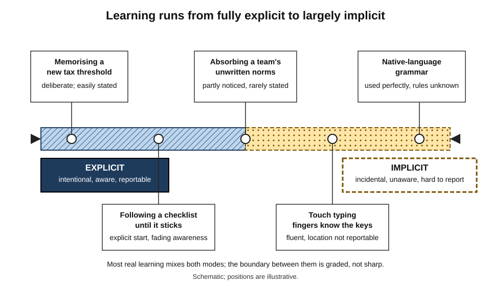
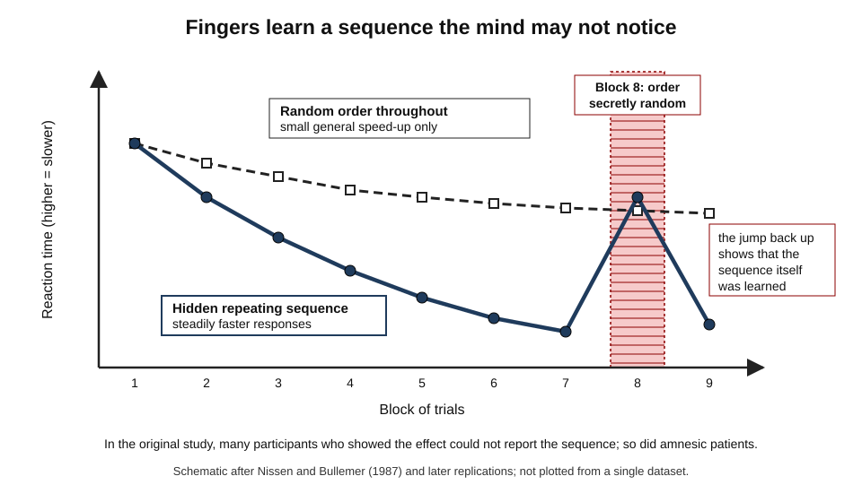
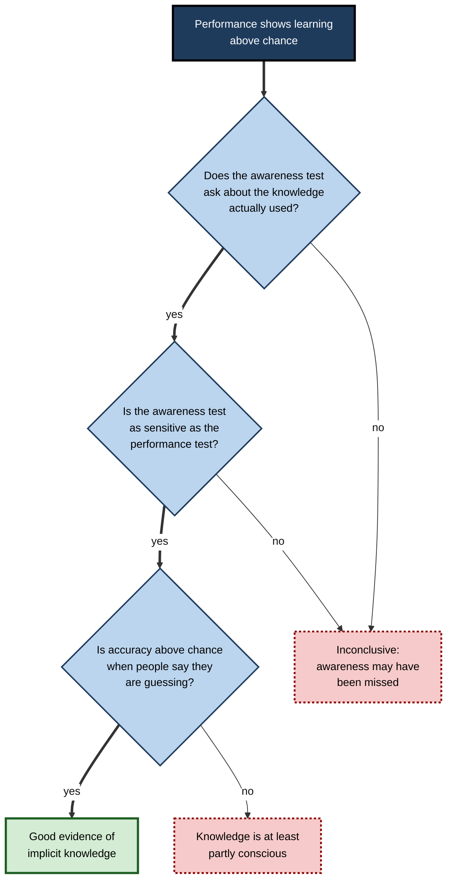
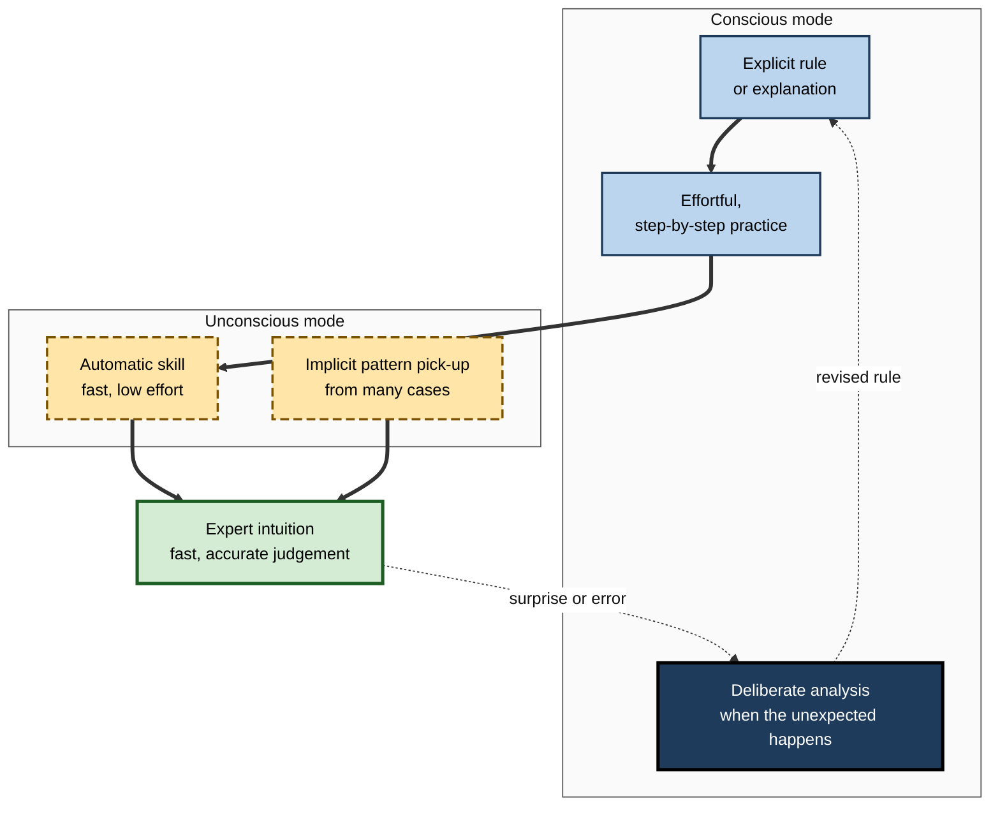
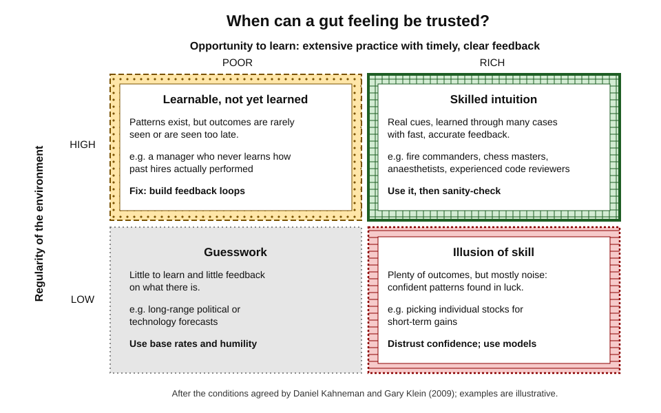
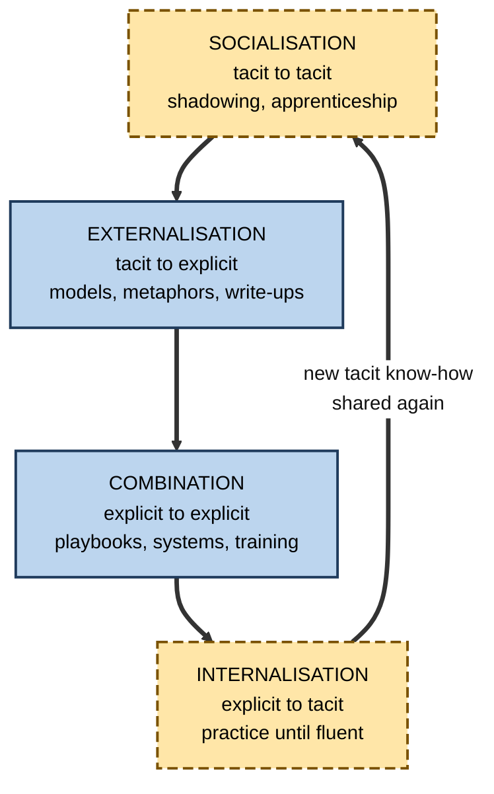

# A.5. Conscious vs. Unconscious Learning

Every fluent speaker uses the grammar of their native language flawlessly yet cannot state most of its rules. A touch typist cannot say where the letter "k" is without imagining a keyboard, yet the fingers find it in milliseconds. A senior engineer glances at a dashboard and "just knows" something is wrong before any alert fires. Some learning happens **on purpose and in full view**; a great deal happens **without intention and below awareness** — and the most valuable expertise usually combines both.

> **Definition — Explicit (conscious) learning:** learning that occurs with awareness of what is being learned, usually intentionally, and whose results can be reported in words.

> **Definition — Implicit (unconscious) learning:** learning that occurs without intention and largely without awareness of what has been learned, typically by picking up regularities from repeated experience; its results show in performance rather than in statements.

**Why it matters**

- Much of what makes experts good — intuition, "feel", fast pattern recognition — was learned implicitly and is **hard for them to explain**.
- Every environment **teaches implicitly**, for better or worse: a team culture trains its members whatever the training slides say.
- Knowing when intuition is reliable — and when it is confident noise — is one of the most consequential professional judgements.
- Organisations lose expertise when experienced people leave, because much of it is **tacit** and was never written down.

---

## Two Modes of Learning

### Intention and awareness are different things

- **Intentional learning** — the learner sets out to learn.
- **Incidental learning** — learning occurs as a by-product of doing something else.
- **Explicit learning** — the learner is aware of *what* is learned.
- **Implicit learning** — the learner is largely unaware of what is learned.
- The two dimensions are separate:
  - *e.g.* a person may notice, incidentally, that a colleague always arrives late — incidental but explicit;
  - *e.g.* a student may study a language deliberately while also absorbing its rhythm without noticing — intentional study with implicit by-products.

> **Definition — Tacit knowledge:** knowledge a person uses but finds hard or impossible to put into words — in Michael Polanyi's phrase (1966), "we can know more than we can tell".

> **Definition — Automaticity:** the state in which a well-practised process runs quickly, with little effort and little need for conscious control.

> **Definition — Intuition:** a fast judgement based on recognising a pattern, without step-by-step reasoning that the person can report.

**Figure 1.** A spectrum from explicit to implicit learning.

### The two modes compared

| | Explicit learning | Implicit learning |
|---|---|---|
| Intention | Usually deliberate | Usually incidental |
| Awareness of what is learned | Yes | Little or none |
| Speed of acquisition | Can be fast — one explanation may suffice | Usually slow — many exposures |
| Best for | Rules, facts, reasons, rare cases, dangerous exceptions | Patterns, probabilities, timing, "feel", fluent skill |
| Demands on working memory | High; tiring | Low |
| Ease of explaining it | Easy | Hard |
| Under stress or time pressure | Fragile — working memory is crowded out | Relatively robust |
| Flexibility | Can be reasoned about and applied to new cases | Tied to the patterns experienced |

> **Key point:** the two modes are **partners, not rivals**. An explicit rule often gives the first foothold; practice makes it automatic and the rule fades from awareness; meanwhile implicit learning picks up subtleties no one taught.

---

## Learning Without Awareness: The Classic Evidence

### Artificial grammar learning

**Study card — Arthur Reber (1967)**

- **Design:** participants memorised strings of letters (such as *TPPTXVS*) generated by a hidden set of rules — an "artificial grammar". They were not told that rules existed.
- **Test:** told afterwards that the strings followed rules, they classified **new** strings as grammatical or not.
- **Results:**
  - classification was reliably **above chance**;
  - participants could state few, if any, of the rules that would explain their performance.
- **Conclusion:** people can extract the structure of an environment from exposure without being able to report it. Reber coined the term **implicit learning**.

> **Watch out:** later analyses showed that much artificial-grammar performance can be explained by learning **fragments** — familiar pairs and triples of letters — that people may partly be aware of. The finding that structure is learned from exposure stands; the claim that it is learned with **no** awareness is more contested.

### The serial reaction time task

**Study card — Mary Jo Nissen and Peter Bullemer (1987)**

- **Design:** a light appeared at one of four positions and participants pressed the matching key as fast as possible.
  - For one group, the positions followed a **repeating 10-item sequence**, unannounced.
  - For another, the positions were **random**.
- **Results:**
  - the sequence group became much faster; when the sequence was secretly replaced by random positions, they slowed sharply;
  - many participants showed this learning while reporting little or no awareness of a sequence;
  - patients with amnesia (Korsakoff's syndrome), who had poor memory for the sessions themselves, also learned the sequence.
- **Conclusion:** a motor-perceptual sequence can be learned in a way that is at least partly separate from conscious, declarative knowledge.

**Figure 2.** Schematic results of the serial reaction time task.

### Statistical learning in infants

**Study card — Jenny Saffran, Richard Aslin and Elissa Newport (1996)**

- **Design:** eight-month-old infants listened for two minutes to a continuous, monotone stream of syllables in which some three-syllable "words" always occurred together, with no pauses between words.
- **Results:** afterwards, infants listened differently to the "words" than to syllable sequences that had spanned word boundaries.
- **Conclusion:** infants track **transitional probabilities** — how likely one syllable is to follow another — and use them to segment speech, with no instruction and no awareness.

> **Definition — Statistical learning:** the automatic extraction of regularities — what tends to follow or accompany what — from repeated exposure.

### More demonstrations

- **Contextual cueing — Marvin Chun and Yuhong Jiang (1998):** people searching visual displays found targets faster in displays that **repeated** across the session, though they could not recognise which displays had repeated.
- **Probabilistic classification — Barbara Knowlton, Larry Squire and Mark Gluck (1994):** in a "weather prediction" task, people learned which card combinations predicted "rain" or "sun"; patients with amnesia learned the probabilities at close to normal levels early in training despite poor memory of the training episodes.
- **Mere exposure — Robert Zajonc (1968):** repeated exposure to an unfamiliar stimulus increases liking for it.
  - William Kunst-Wilson and Zajonc (1980): people preferred shapes they had seen very briefly before, even when they could not recognise them as previously seen.

> **Key point:** the human brain is a relentless **pattern detector**. Given enough exposure, it extracts regularities — of language, sequences, layouts, probabilities and preferences — whether or not the learner intends to or notices.

---

## Is It Really Unconscious? The Measurement Problem

Proving that learning occurred *without* awareness is surprisingly hard: it means proving a negative about someone's mind. Many effects once called "unconscious" turned out to involve partial awareness when it was measured more carefully.

### Criteria for unconscious knowledge

- **Information criterion — David Shanks and Mark St John (1994):** the awareness test must ask about the **same** knowledge that drives performance.
  - *e.g.* asking for the full rules of a grammar is unfair if performance relies on letter pairs.
- **Sensitivity criterion — Shanks and St John:** the awareness test must be **as sensitive** as the performance test.
  - *e.g.* a vague interview is less sensitive than a forced-choice test.
- **Guessing criterion — Zoltán Dienes and colleagues:** knowledge is unconscious if people perform above chance while believing they are **guessing**.
- **Zero-correlation criterion — Dienes:** knowledge is unconscious if confidence is **unrelated** to accuracy — people do not know when they know.
- **Process dissociation — Larry Jacoby (1991):** compare performance when people try to **use** a learned pattern with performance when they try to **avoid** it; only knowledge under conscious control can be deliberately withheld.
  - Applied to sequence learning by Arnaud Destrebecqz and Axel Cleeremans (2001), who found that conditions allowing less time between trials produced learning participants could not control.

**Figure 3.** Testing whether learning was really unconscious.

### A contested case: the Iowa gambling task

**Study card — Bechara, Damasio, Tranel and Damasio (1997)**

- **Design:** participants drew cards from four decks; two "risky" decks gave large wins but larger losses over time; two "safe" decks gave smaller wins and smaller losses.
- **Claimed results:** healthy participants began to show stress responses (skin conductance) before risky choices and to prefer safe decks **before** they could say which decks were bad.
- **Interpretation offered:** bodily "somatic markers" guide decisions ahead of conscious knowledge.
- **Challenge — Tiago Maia and James McClelland (2004):** with more detailed questioning, participants reported knowledge of the decks **as early as** — or earlier than — their choices improved.
- **Status:** the claim that people choose advantageously before any conscious knowledge is **contested**; the task remains useful but its original interpretation is no longer taken for granted.

### Conditioning and awareness

- **Peter Lovibond and David Shanks (2002)** reviewed human conditioning studies and concluded that conditioned responses were, in most well-controlled experiments, accompanied by **awareness** of the relationship between signal and outcome.
- Some researchers maintain that certain responses — such as fear conditioning to threatening images — can be learned without awareness.
- **Status:** **debated**; the safe conclusion is that conditioning in adults usually, but perhaps not always, involves awareness of the contingency.

> **Watch out:** the current consensus is cautious. Implicit and explicit processes **both exist and interact**, but the boundary is graded rather than sharp, and many effects once described as entirely unconscious involve some awareness. Axel Cleeremans and others argue that consciousness of knowledge is a matter of **degree**.

---

## Claims About Unconscious Influence

Popular culture credits the unconscious with powers far beyond the laboratory evidence.

**Claims compared with the evidence**

| Claim | Original basis | Current status |
|---|---|---|
| Hidden messages in films make audiences buy products | James Vicary's 1957 report that flashing "Eat popcorn" and "Drink Coca-Cola" boosted cinema sales | Vicary later admitted the study was fabricated; no such effect has been shown |
| Subliminal brand cues can nudge choices | Laboratory studies, e.g. Karremans and colleagues (2006): a subliminal drink brand increased choice of it, but only among thirsty participants | Small, conditional, laboratory-bound effects; not a means of mass persuasion |
| Complex material can be learned from recordings during sleep | Early "sleep-learning" claims from the 1950s | Not supported for complex material; only very simple associations, such as tone–odour links (Arzi and colleagues, 2012), have been shown during sleep |
| Leaving a complex decision to the unconscious beats deliberation | "Unconscious thought theory" (Dijksterhuis and colleagues, 2006) | Large replication attempts and meta-analysis (Nieuwenstein and colleagues, 2015) found little or no reliable advantage |
| Reading words about old age makes people walk slowly | Bargh, Chen and Burrows (1996) | Failed to replicate in a careful 2012 study (Doyen and colleagues); many social-priming effects are now doubted |
| A short break helps solve a stuck problem | Studies of "incubation" | Meta-analysis (Sio and Ormerod, 2009) found a real but modest benefit, larger for creative problems; mechanism debated |

> **Key point:** implicit learning is real and powerful for **regularities experienced many times**. It is not a back door for one-off hidden messages, nor a reliably superior "unconscious mind" for complex decisions.

> **Watch out:** "implicit learning still needs attention to the material." It is the **structure** people may be unaware of, not the input itself. In sequence-learning studies, a demanding second task reduces implicit learning.

---

## From Conscious Effort to Automatic Skill

### Controlled and automatic processing

- **Walter Schneider and Richard Shiffrin (1977):**
  - **controlled processing** — slow, effortful, serial, flexible, limited by working memory;
  - **automatic processing** — fast, effortless, parallel, hard to suppress;
  - automaticity develops through **extensive practice with consistent mappings** — the same stimulus always demanding the same response.
- **The Stroop effect (John Ridley Stroop, 1935):** naming the ink colour of the word "RED" printed in blue is slow, because reading is so automatic it cannot be switched off.

> **Example:** a new analyst consciously recalls each step of a spreadsheet model; a year later, she builds one while discussing the client's strategy — the procedure has moved from controlled to automatic processing.

**Figure 4.** How conscious and unconscious learning hand over to each other.

### Implicit motor learning and pressure

**Study card — Rich Masters (1992)**

- **Design:** novice golfers learned to putt either with explicit instructions on technique or under conditions that minimised explicit rules (for example, while performing a demanding secondary task such as generating random letters).
- **Results:** when later tested under **stress**, the explicit learners' performance tended to deteriorate, whereas the implicit learners' performance held up or improved.
- **Conclusion:** skills acquired with fewer explicit rules may be more robust under pressure, because there are fewer rules to "reinvest" consciously when anxious.
- **Status:** influential and followed by related work on **errorless learning** and analogy-based instruction; the size and generality of the benefit vary across studies.

### Choking under pressure

**Study card — Sian Beilock and Thomas Carr (2001)**

- **Design:** experienced and novice golfers putted while either attending to a step-by-step component of their stroke or performing an unrelated secondary task.
- **Results:**
  - **experienced** golfers performed **worse** when attending to the steps of their stroke, and less affected by the distracting task;
  - **novices** showed the opposite pattern — attention to steps helped them.
- **Conclusion:** consciously monitoring an automated skill disrupts it — the **explicit monitoring** account of choking.

> **Definition — Choking under pressure:** performing worse than one's skill level under pressure, often because conscious attention to an automated skill disrupts it, or because worry consumes working memory.

> **In practice:** under pressure, experts are often better served by an external focus or a single cue word than by reviewing technique step by step; novices still need the steps.

### The expert blind spot

- **Expert blind spot** (a term used in education research by Mitchell Nathan and Anthony Petrosino, 2003) — experts underestimate how hard their domain is for novices and **omit steps** they no longer notice.
- **Cognitive task analysis studies** (for example by Richard Clark and colleagues) repeatedly found that experts describing how they perform a task leave out a **large share** of the decisions they actually make.
- **Consequences:**
  - experts' explanations and documentation skip crucial cues;
  - novices copy what experts **say**, not what they **do**.

**Study card — chick sexing (Biederman and Shiffrar, 1987)**

- **Background:** sorting day-old chicks by sex is notoriously difficult; experts reach high accuracy after long apprenticeship, often unable to explain how.
- **Design:** an expert's knowledge was analysed and turned into a short explicit instruction about the critical visual feature for difficult cases; novices viewed pictures with or without this instruction.
- **Results:** novices given the instruction became far more accurate on the difficult cases, approaching expert-level performance on that test.
- **Conclusion:** some tacit expertise can be **made explicit** and transmitted quickly — if the critical cues are identified.

---

## When Can Intuition Be Trusted?

### Two modes of thinking

- **Dual-process theories** distinguish:
  - **Type 1** — fast, automatic, intuitive processing;
  - **Type 2** — slow, deliberate, effortful reasoning that uses working memory.
- **Daniel Kahneman, *Thinking, Fast and Slow* (2011)**, popularised the labels **System 1** and **System 2**.
- **Jonathan Evans and Keith Stanovich (2013)** argued that the defining difference is the use of working memory; other features (speed, accuracy, consciousness) only tend to correlate.

> **Watch out:** "System 1" and "System 2" are **descriptive labels**, not two separate brain organs, and intuition is not inherently biased. In domains where it has been well trained, intuition is often faster *and* more accurate than deliberation.

### Recognition-primed decisions

- **Gary Klein** studied fire-ground commanders (1980s) and found they rarely compared options. Instead they:
  1. **recognised** the situation as typical of a familiar kind;
  2. knew the plausible goals, cues to watch and a workable action;
  3. **mentally simulated** the action to check it;
  4. acted — or modified the plan if the simulation revealed a problem.
- **Recognition-primed decision model** — expertise as a large library of patterns built by experience.

**Study card — Kahneman and Klein, "Conditions for intuitive expertise: a failure to disagree" (2009)**

- **Background:** Kahneman's research highlighted intuitive biases; Klein's highlighted intuitive expertise. They set out to find where they agreed.
- **Agreed conditions for skilled intuition:**
  1. an environment **regular enough** to be predictable — real cues linked to outcomes;
  2. an **opportunity to learn** those regularities — prolonged practice with timely, clear feedback.
- **Corollary:** subjective **confidence** is not a reliable indicator of whether an intuition is valid; people can be highly confident in environments where nothing can be learned.

**Figure 5.** When a gut feeling can be trusted.

### Kind and wicked learning environments

**Robin Hogarth (2001)**

| | Kind learning environment | Wicked learning environment |
|---|---|---|
| Feedback | Fast, accurate, frequent | Delayed, missing, noisy or misleading |
| Link between cues and outcomes | Stable | Unstable or distorted |
| What experience produces | Accurate intuition | Confident but miscalibrated intuition |
| Examples | Chess; weather forecasting with daily verification; code that runs or fails | Hiring without tracking outcomes; long-range strategy; a doctor who never learns how cases ended |
| What helps | Volume of practice | Building feedback loops; explicit models; base rates |

> **Example:** Philip Tetlock's long-running study of expert political forecasts (published 2005) found that many experts' long-range predictions were barely better than simple rules — a wicked environment. His later forecasting tournaments found that some "superforecasters", who tracked their accuracy and updated often, did consistently better.

> **Remember:** trust an intuition when the domain is **regular**, the person has had **many cases with clear feedback**, and the situation is **typical**. Slow down when any of the three is missing.

---

## Tacit Knowledge in Organisations

### Converting tacit and explicit knowledge

**Ikujiro Nonaka and Hirotaka Takeuchi, *The Knowledge-Creating Company* (1995)** — the **SECI** model:

1. **Socialisation** — tacit to tacit: learning by working alongside others.
2. **Externalisation** — tacit to explicit: articulating know-how as concepts, metaphors, models.
3. **Combination** — explicit to explicit: combining documents and models into new systems.
4. **Internalisation** — explicit to tacit: practising documented knowledge until it becomes one's own.

> **Example:** in Nonaka and Takeuchi's account of the development of an early home bread-making machine at Matsushita, a software developer apprenticed herself to a hotel's head baker to grasp his kneading technique — a "twisting stretch" — which engineers then translated into a machine specification.

> **Mnemonic — "SECI: Shadow, Explain, Combine, Internalise".**

**Figure 6.** The SECI cycle of knowledge conversion.

> **Watch out:** the SECI model is widely used in knowledge management but is a **descriptive framework** drawn largely from Japanese case studies, not a tested causal theory. Critics also argue that some tacit knowledge can never be fully articulated.

### Methods for drawing out tacit expertise

| Method | How it works | Best for | Limitation |
|---|---|---|---|
| Cognitive task analysis | Structured interviews walk an expert through real past incidents, probing cues, decisions and alternatives at each point | Diagnosis, troubleshooting, high-stakes judgement | Time-consuming; needs a skilled interviewer |
| Think-aloud protocols | The expert narrates while working a real case | Coding, analysis, design critique | Narrating can disturb automatic performance |
| Contrasting cases | The expert compares similar cases and explains what differs | Fine perceptual distinctions | Captures cues, less so actions |
| Apprenticeship and shadowing | Novices observe and work alongside experts over time | Context-rich and social skills | Slow; depends on the expert's availability |
| Decision journals | Experts record predictions and reasons, then outcomes | Calibrating and documenting judgement | Requires discipline over months |

### Implicit learning of social associations

- People absorb associations from their environment — including about which kinds of people tend to hold which roles.
- **The Implicit Association Test (Anthony Greenwald and colleagues, 1998)** measures how quickly people pair concepts; it reveals widespread associations between social groups and attributes.
- **Contested points:**
  - how well individual scores predict behaviour — meta-analyses report **weak** relationships;
  - whether changing implicit measures changes behaviour — a large meta-analysis (Patrick Forscher and colleagues, 2019) found that interventions could shift implicit measures but such changes did **not** reliably change behaviour.
- **Brief bias-awareness sessions** have shown little lasting behavioural effect in research.

> **In practice:** structural safeguards have stronger support than attempts to retrain associations — structured interviews with pre-set criteria, diverse examples in case libraries, blind review of work samples and decision audits.

---

## Designing for Both Modes

### A procedure for building reliable intuition

1. **Start explicit for the foundations** — the key rules, concepts and **dangerous exceptions**. Implicit learning is slow and can absorb wrong patterns; a few explicit rules prevent costly errors.
2. **Go high-volume** — many varied, real cases: code reviews, sales calls, financial statements, scans, contracts.
3. **Predict before seeing the outcome** — commit to a judgement, then check it; this converts exposure into feedback.
4. **Mix the cases** — interleaving helps the brain detect the features that genuinely distinguish them.
5. **Shorten feedback loops** — find out what actually happened, quickly.
6. **Periodically make it explicit** — write down the patterns being used, test them, and discuss them with an expert; this catches false patterns and makes knowledge teachable.

> **Remember:** rules first, then **volume**, **prediction**, **mixing**, **fast feedback** and periodic **articulation** — exposure alone builds confidence; exposure with feedback builds skill.

### Worked example: a junior credit analyst building judgement

- **Situation:** a bank's new credit analysts took about two years to judge small-business loan applications reliably; most learned by reading policy manuals and occasionally comparing notes with seniors.

| | Before | After |
|---|---|---|
| Foundations | 120-page policy manual | Ten explicit red-flag rules and three "never approve" exceptions, learned in week one |
| Volume | A few live files a week | Thirty archived applications a week, with known repayment outcomes |
| Feedback | Rare and months late | Predict "repaid or defaulted" and a confidence rating, then see the actual outcome immediately |
| Mixing | Files arrived by sector | Sectors deliberately mixed |
| Making it explicit | None | Fortnightly "cues I am using" note, reviewed with a senior |
| After six months | Slow; missed subtle warning signs | Faster, better calibrated; could explain most cues behind a hunch |

- **Conclusion:** the archive turned a **wicked** environment (outcomes years later) into a **kind** one (outcomes at once) for training purposes.

> **Watch out:** feedback must reflect the true outcome. If analysts were scored only on agreement with seniors, they would learn to imitate the seniors' biases rather than to predict repayment.

### Case study: capturing incident-response expertise

- **Situation:** at a software company, two senior site-reliability engineers handled most major incidents because they "just knew where to look"; junior engineers read the runbooks but froze during real outages.
- **Problem:** both seniors were close to burnout, and one planned to leave within a year.
- **Diagnosis:**
  1. Runbooks captured **explicit** procedures, not the **tacit** cues seniors used to decide what to check first.
  2. Juniors rarely saw incidents first-hand — little **implicit** pattern-learning.
  3. Seniors' own explanations skipped steps — the **expert blind spot**.
- **Actions:**
  1. **Cognitive task analysis** interviews on five past incidents with each senior, extracting the cues checked first, the alternatives considered and why.
  2. A library of **incident replays** in which juniors predicted the next diagnostic step before seeing what the expert did.
  3. Juniors paired as **shadow responders** on real incidents, with a short debrief after each.
  4. A shared "surprises log" in which anyone recorded cues that turned out to matter.
- **Result:** within two quarters, juniors led a growing share of incidents with seniors as backup; the departing senior's knowledge was partly preserved in the replay library.
- **Side effects / caveats:** the interviews took senior time at a busy period; replays aged as the system changed and needed regular refreshing.
- **Lesson:** tacit expertise can be partly **extracted** (externalisation) and partly **regrown** in others through feedback-rich exposure (socialisation and internalisation) — but only by design.

### Implicit learning in an AI-assisted workplace

- **Intuition needs exposure that may no longer happen by accident.** If AI drafts every first version, juniors see fewer raw cases and do less of the pattern detection themselves; first-hand volume must be deliberately preserved.
- **Over-trust is learned implicitly.** Repeatedly seeing an assistant be right teaches people to stop checking — **automation bias**; periodic verification and deliberately seeded errors in training keep checking alive.
- **AI can help surface tacit knowledge** — for example by interviewing experts and summarising their decision patterns — but outputs need expert verification.
- **AI changes what environments teach.** A team whose assistant always supplies an answer can implicitly learn that not-knowing is never tolerated, or that thinking first is unnecessary.

> **Definition — Automation bias:** the tendency to over-rely on automated aids, accepting their outputs and failing to notice their errors.

---

## Open Questions

- **Is there a truly separate implicit learning system?**
  - Some researchers argue for distinct systems; others for a single system with graded awareness. Measurement limits keep the question open.
- **How should awareness be measured?**
  - Every awareness test has weaknesses; agreement on the best criteria is lacking.
- **Can implicit learning be accelerated?**
  - Perceptual-learning and prediction-with-feedback methods look promising, but their limits and transfer are not well mapped.
- **How much tacit knowledge can be made explicit?**
  - Chick-sexing-style successes coexist with skills that seem to resist articulation; where the limit lies is unknown.
- **When does conscious attention help skilled performance, and when does it hurt?**
  - Findings on choking, implicit motor learning and external focus are mixed across domains.
- **What will juniors' intuition look like after years of AI-assisted work?**
  - No long-term studies yet; the risk of thinner pattern libraries is plausible but unmeasured.

---

## Summary

- **Explicit learning** is aware and reportable; **implicit learning** is largely unaware and shows in performance. Intention and awareness are separate dimensions.
- Classic evidence — **artificial grammar** (Reber), **serial reaction time** (Nissen and Bullemer), **statistical learning** in infants (Saffran), contextual cueing, probabilistic classification, mere exposure — shows the brain extracts regularities from exposure.
- Proving unawareness is hard: awareness tests must meet the **information** and **sensitivity** criteria; **guessing**, **zero-correlation** and **process-dissociation** methods help. Many "unconscious" effects involve partial awareness; the **Iowa gambling task** and conditioning-without-awareness are contested.
- Popular claims — subliminal advertising, sleep learning, superior "unconscious thought", many social-priming effects — are fabricated, unsupported or failed to replicate.
- Practice moves skills from **controlled** to **automatic** processing; implicitly learned skills may resist pressure (Masters); conscious monitoring of automated skill causes **choking** (Beilock and Carr).
- Experts suffer an **expert blind spot**; some tacit knowledge can be made explicit (chick sexing).
- Intuition is trustworthy only in **regular** environments with extensive practice and **clear feedback** (Kahneman and Klein); **kind** environments build accurate intuition, **wicked** ones build confident error.
- Organisations convert knowledge through **SECI** and draw out tacit expertise with cognitive task analysis, think-aloud, contrasting cases, apprenticeship and decision journals.
- Implicit social associations are real, but their link to behaviour is weak and contested; **structural** safeguards work better than brief training.
- Build intuition with **rules first, then volume, prediction, mixing, fast feedback and periodic articulation**; with AI, preserve first-hand practice and guard against automation bias.

---

## Self-Check

1. Distinguish intentional from incidental learning and explicit from implicit learning. Give an example that is incidental but explicit.
2. Describe Reber's artificial grammar experiment and the later challenge to its interpretation.
3. What did the serial reaction time task show, and why were the results from amnesic patients important?
4. What did Saffran, Aslin and Newport show about infants, and what is statistical learning?
5. State the information and sensitivity criteria. Why do they make claims of unconscious learning harder to establish?
6. What was originally claimed about the Iowa gambling task, and why is the claim now contested?
7. Evaluate the claim that subliminal messages in advertisements can make people buy products.
8. What is automaticity, and what conditions produce it according to Schneider and Shiffrin?
9. Explain Beilock and Carr's findings on choking. What advice follows for experts and for novices?
10. What is the expert blind spot, and how did the chick-sexing study show that it can sometimes be overcome?
11. State Kahneman and Klein's two conditions for trustworthy intuition and give a domain that meets them and one that does not.
12. Distinguish kind from wicked learning environments, and explain how a training designer can make a wicked environment kinder.
13. A senior fraud investigator retires in six months. Design a plan to capture and regrow her expertise.
14. Why might heavy reliance on AI assistants slow the development of junior professionals' intuition, and what safeguards would you build in?

### Answer Key

1. Intentional: setting out to learn; incidental: learning as a by-product. Explicit: aware of what is learned; implicit: largely unaware. Incidental but explicit: noticing, without trying, that a client always pays late — and being able to say so.
2. People memorised letter strings generated by hidden rules, then classified new strings above chance without stating the rules. Later analyses suggested much performance rested on familiar letter fragments of which people may be partly aware, weakening the "no awareness" claim.
3. Responses sped up for a hidden repeating sequence and slowed when it became random, even in people reporting little awareness; amnesic patients learned it too, showing that sequence learning can proceed largely independently of declarative memory.
4. After two minutes of a continuous syllable stream, infants distinguished "words" from part-words, showing they track transitional probabilities. Statistical learning is the automatic extraction of regularities from exposure.
5. Information: the awareness test must probe the knowledge actually driving performance. Sensitivity: it must be as sensitive as the performance test. Many earlier studies used vague or mismatched awareness tests, so partial awareness may have been missed.
6. That people chose advantageously and showed anticipatory bodily responses before they could report which decks were bad. Maia and McClelland's more detailed questioning found reportable knowledge as early as, or earlier than, improved choices.
7. Vicary's famous 1957 study was fabricated. Laboratory studies show only small, conditional effects (e.g. only for thirsty participants and relevant products); there is no evidence of mass persuasion by subliminal messages.
8. Fast, effortless, hard-to-suppress processing of a well-practised task. It develops through extensive practice with consistent mappings between stimuli and responses.
9. Experienced golfers putted worse when attending to the steps of their stroke; novices were helped by such attention. Experts under pressure should use an external focus or a single cue rather than review technique; novices still need explicit steps.
10. Experts underestimate the difficulty of their domain and omit steps they no longer notice. Turning an expert's tacit discrimination into a brief explicit instruction about the critical feature greatly improved novices' accuracy on difficult cases.
11. A regular, predictable environment, and prolonged practice with timely, clear feedback. Meets: chess or fire-ground command. Fails: long-range political forecasting or short-term stock picking.
12. Kind: fast, accurate feedback with stable cue–outcome links; wicked: delayed, missing or misleading feedback. A designer can use archived cases with known outcomes, require predictions before outcomes are revealed, and track calibration.
13. E.g. cognitive task analysis on her most instructive past cases; think-aloud sessions on live files; contrasting-case exercises; a case library labelled with outcomes and her reasoning; juniors predicting her next step before seeing it; shadowing on live investigations with debriefs; a decision journal she keeps and shares in her final months.
14. Intuition grows from high-volume, first-hand exposure with feedback; if AI does the first pass, juniors see fewer raw cases and learn to accept outputs (automation bias). Safeguards: protected AI-free practice on real cases; "predict first, then compare with the AI"; seeded errors in training; regular review of juniors' unaided judgements.

---

## Glossary

| Term | Meaning |
|---|---|
| Artificial grammar learning | A task in which people learn the structure of letter strings generated by hidden rules. |
| Automaticity | Fast, low-effort, hard-to-suppress performance of a well-practised process. |
| Automation bias | Over-reliance on automated aids, accepting their outputs and missing their errors. |
| Choking under pressure | Performing below one's skill level under pressure, often from conscious monitoring of an automated skill. |
| Cognitive task analysis | Structured methods for uncovering the knowledge, cues and decisions behind expert performance. |
| Contextual cueing | Faster visual search in repeated displays that people cannot recognise as repeated. |
| Controlled processing | Slow, effortful, flexible processing limited by working memory. |
| Dual-process theory | The view that thinking combines fast intuitive (Type 1) and slow deliberate (Type 2) processing. |
| Expert blind spot | Experts' tendency to overlook steps and difficulties that have become automatic for them. |
| Explicit learning | Learning with awareness of what is learned, whose results can be reported. |
| Guessing criterion | Evidence of unconscious knowledge: above-chance accuracy when people believe they are guessing. |
| Implicit learning | Learning without intention and largely without awareness of what is learned. |
| Incidental learning | Learning that occurs as a by-product of another activity. |
| Information criterion | Requirement that an awareness test probe the knowledge actually driving performance. |
| Intuition | A fast judgement based on pattern recognition without reportable step-by-step reasoning. |
| Kind learning environment | One with fast, accurate feedback and stable links between cues and outcomes. |
| Mere exposure effect | Increased liking for a stimulus through repeated exposure. |
| Process dissociation | Separating conscious and unconscious influences by comparing attempts to use and to avoid learned knowledge. |
| Recognition-primed decision | Deciding by recognising a situation as typical and mentally simulating a familiar action. |
| SECI model | Socialisation, externalisation, combination and internalisation of knowledge. |
| Sensitivity criterion | Requirement that an awareness test be as sensitive as the performance test. |
| Serial reaction time task | A task in which faster responses to a hidden repeating sequence reveal sequence learning. |
| Statistical learning | Automatic extraction of regularities from repeated exposure. |
| Tacit knowledge | Knowledge that is used but hard to put into words. |
| Wicked learning environment | One with delayed, missing or misleading feedback, which breeds miscalibrated intuition. |
| Zero-correlation criterion | Evidence of unconscious knowledge: confidence unrelated to accuracy. |
