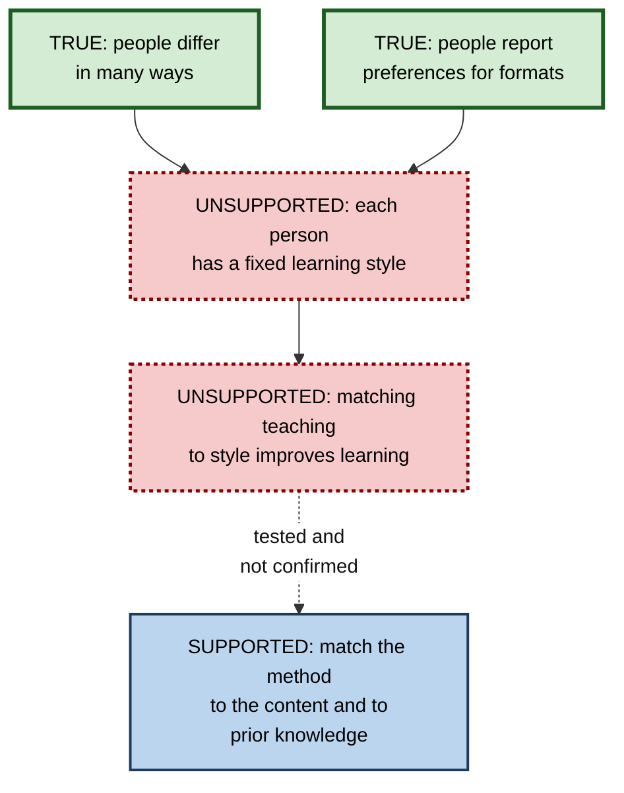
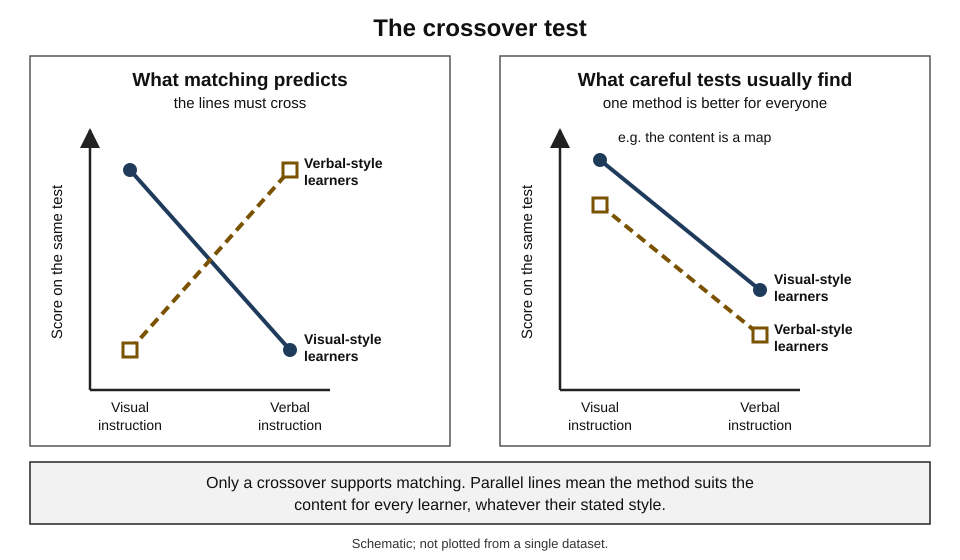
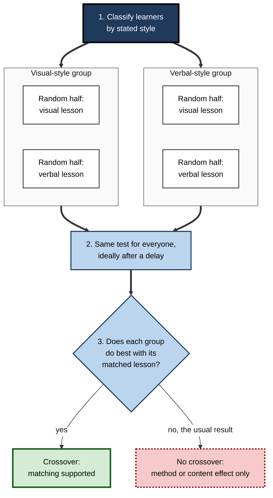
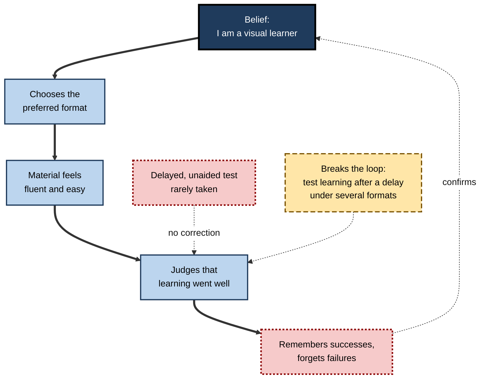
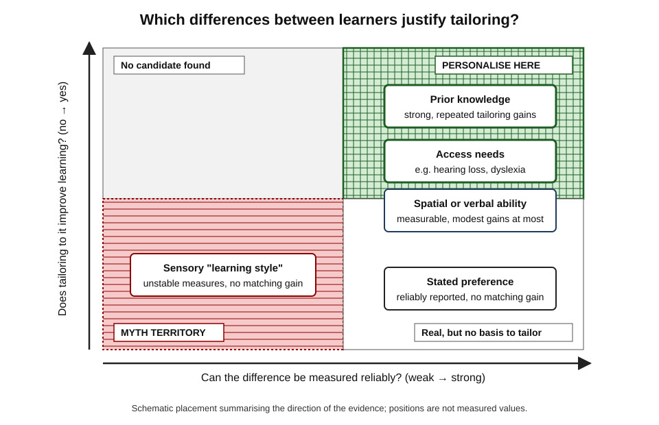
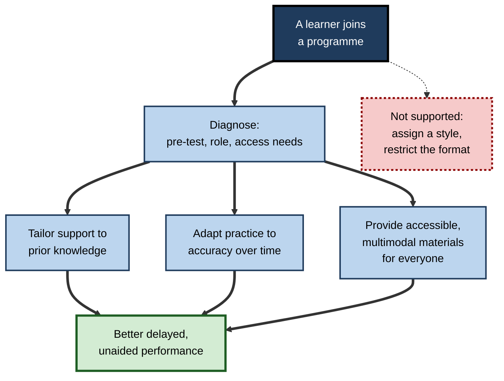

# A.6. Learning Styles Myths vs. Evidence

A new graduate completes an onboarding questionnaire and is told she is a "kinaesthetic learner". For the next year she skips diagrams and reading because they are "not her style", and clicks around systems instead. A colleague labelled "visual" avoids podcasts and recorded briefings. Both have narrowed how they learn on the strength of a claim that, when tested, does not hold.

> **Definition — Learning style:** a supposedly stable, individual way of taking in and processing information (for example visual, auditory or kinaesthetic), such that a person is claimed to learn best when instruction is delivered in that way.

**Why the evidence matters**

- Belief in learning styles is among the most widespread misconceptions about learning held by teachers, trainers, managers and learners.
- It shapes real decisions: course design budgets, study habits, hiring of vendors, coaching conversations and how people describe their own abilities.
- It distracts from the individual differences that **do** change outcomes — above all, **prior knowledge**.
- It is a model case of how an intuitive, attractive idea can survive decades of contrary evidence — a lesson in judging any claim about learning.

---

## The Learning-Styles Idea

### What the theory claims

- **The premise:** people differ in how they prefer to receive information.
- **The diagnosis:** a questionnaire or inventory can classify each person into a style.
- **The prescription:** teaching should be **matched** to each person's style.
- **The promise:** matched learners will **learn more** than unmatched learners.

> **Definition — Meshing hypothesis (matching hypothesis):** the claim that learning improves when the mode of instruction is matched to the learner's style. It is the testable core of every learning-styles model.

- The premise is true; the diagnosis is unreliable for most models; the prescription and the promise are **not supported**.

> **Key point:** the debate is not about whether people differ — they obviously do. It is about whether **matching instruction to a style label improves learning**. That specific claim is what fails.

### The best-known models

- **Coffield, Moseley, Hall and Ecclestone (2004)** catalogued **71** learning-styles models in use in education and training.
- The four most common in schools and workplaces:

| Model | Origin | Categories | Typical use | Evidence status |
|---|---|---|---|---|
| **VAK / VARK** | VAK ideas from the 1970s; VARK from Neil Fleming and Colleen Mills (1992) | Visual, Aural (Auditory), Read/write, Kinaesthetic | Schools, teacher training, corporate onboarding | Preferences can be reported; matching not supported |
| **Dunn and Dunn** | Rita and Kenneth Dunn, 1970s | Preferences for sound, light, temperature, time of day, grouping, mobility and more | US schools; commercial training | Supportive studies mostly by proponents; independent reviews critical |
| **Kolb's Learning Style Inventory** | David Kolb, 1970s; built on his experiential learning cycle (1984 book) | Diverging, assimilating, converging, accommodating | Management education, higher education | The *cycle* is a useful design idea; the *style inventory* has weak reliability and no matching support |
| **Honey and Mumford** | Peter Honey and Alan Mumford, 1980s (UK) | Activist, reflector, theorist, pragmatist | UK management and leadership training | Weak psychometric support; no matching support |

> **Watch out:** Kolb's experiential learning **cycle** (experience → reflection → conceptualisation → experimentation) and Kolb's learning **styles** are different claims. Rejecting the styles does not require rejecting the idea that good learning moves between doing and reflecting.

### Four things that are often confused

| Concept | What it is | Real? | Does tailoring instruction to it help? |
|---|---|---|---|
| **Style** | A fixed mode in which a person is said to learn best | Measurement mostly unstable | No good evidence |
| **Preference** | The mode a person *likes* | Yes — people report preferences consistently | No: liking a format does not make it work better for that person |
| **Strategy** | What a person *does* to learn (self-testing, re-reading, drawing, explaining) | Yes | Changing strategy changes outcomes — for everyone |
| **Ability** | A measurable capacity, such as spatial or verbal reasoning | Yes | Occasionally, modestly; not in the way style models claim |

- Most popular arguments for styles slide from **preference** ("I like diagrams") to **style** ("I am a visual learner") to **meshing** ("so I learn better from diagrams").
- Each step adds a claim the previous one does not support.

**Figure 1.** How a true premise becomes an unsupported conclusion.

---

## Testing the Claim

### What would count as evidence

**Study card — Pashler, McDaniel, Rohrer and Bjork (2008)**

- **Task:** a review commissioned for a leading psychology journal, asking what evidence would be needed to justify style-based teaching.
- **Required design:**
  1. classify learners by style (e.g. "visual" and "verbal");
  2. **randomly assign** learners of each style to more than one method of instruction;
  3. give **everyone the same test** of learning.
- **Required result:** a **crossover interaction** — visual-style learners do better with visual instruction **and** verbal-style learners do better with verbal instruction.
- **Findings:**
  - very few studies had used this design at all;
  - of those that did, almost none showed the crossover, and several clearly contradicted it.
- **Conclusion:** there was no adequate evidence base to justify incorporating learning-styles assessment into general educational practice.

> **Definition — Crossover interaction:** a result in which each group performs best under a *different* condition, so the lines on a graph cross. It is the only pattern that supports matching.

**Figure 2.** The pattern matching requires compared with the pattern usually found.

- **Why a main effect is not enough:**
  - if diagrams beat text for *everyone* learning a circuit, that shows diagrams suit circuits;
  - it says nothing about style, because "verbal learners" benefit too.
- **Why satisfaction is not enough:** learners may *enjoy* matched instruction more, but enjoyment is not learning.

> **Remember:** support for matching needs **(1)** classification, **(2)** random assignment to several methods, **(3)** a common test, **(4)** a crossover.

**Figure 3.** The design of a fair test of the matching hypothesis.

### Reviews of the inventories

**Study card — Coffield, Moseley, Hall and Ecclestone (2004)**

- **Commission:** a systematic review for the UK Learning and Skills Research Centre on learning styles in post-16 education.
- **Scope:** identified 71 models; examined 13 of the most influential in depth.
- **Criteria:** internal consistency, test–retest reliability, construct validity and predictive validity.
- **Findings:**
  - most inventories failed one or more basic psychometric tests;
  - the same person could be classified differently on different occasions;
  - evidence that matched teaching improved learning was weak or absent;
  - only a small minority of instruments met minimum standards.
- **Conclusion:** the field was fragmented, commercially driven and theoretically confused; it warned against labelling learners.

> **Watch out:** a questionnaire that sorts people into categories is not thereby measuring a real, stable trait. An instrument must show **reliability** (same result on retest) and **validity** (measures what it claims and predicts outcomes) before its labels mean anything.

### Direct tests of matching

**Study card — Massa and Mayer (2006)**

- **Design:** adults classified as "visualisers" or "verbalisers" (by several measures, including self-reported preference and spatial ability) studied an electronics lesson with either pictorial or verbal help screens.
- **Result:** no meaningful interaction — verbalisers did not learn more from verbal help, nor visualisers from pictorial help.
- **Conclusion:** the lesson's design mattered; the learner's label did not.

**Study card — Rogowsky, Calhoun and Tallal (2015)**

- **Design:** adults' preference for auditory or visual learning was measured; they then comprehended material presented either as an audiobook or as written text.
- **Result:** no relationship between stated preference and which format produced better comprehension.
- **Conclusion:** a properly designed test, with the crossover design, found no meshing.

**Study card — Husmann and O'Loughlin (2019)**

- **Setting:** undergraduate anatomy students completed the VARK questionnaire and reported their actual study strategies.
- **Results:**
  - most students did **not** study in ways that matched their reported style;
  - those whose study did match their style performed **no better**;
  - certain strategies — whatever the student's "style" — were associated with better grades.
- **Conclusion:** strategy matters; style labels do not.

**Study card — Knoll, Otani, Skeel and Van Horn (2017)**

- **Design:** participants with visual or verbal style preferences studied pictures and words, rated how well they had learned each, then were tested.
- **Results:** style preference predicted how well people **believed** they had learned — but not what they actually remembered.
- **Conclusion:** learning styles operate as a belief about learning, influencing **judgements of learning** rather than learning itself.

> **Key point:** the last finding explains much of the myth's staying power — matched instruction *feels* more effective, which is exactly what the learner then reports.

### The meta-analytic picture

- **A 2024 meta-analysis** of studies that tested matching directly (21 studies, about 1,700 participants):
  - only around **a quarter** of reported outcomes showed the crossover the hypothesis requires;
  - the pooled effect was small and inconsistent across studies, and the authors judged it too weak to justify style-matched teaching.
- **A 2025 synthesis of many earlier meta-analyses** argued that apparent "style" effects in some reviews came from mixing up styles with **preferences** and **strategies**; strategies affect learning, styles as fixed traits do not.
- **Older positive meta-analyses** — particularly of the Dunn and Dunn model — were produced largely by the model's proponents and criticised for including unpublished dissertations, weak designs and no crossover tests.

> **Watch out:** a few researchers argue that the matching hypothesis has been rejected too broadly, and that narrowly defined **cognitive styles** (for example a tendency to process information holistically or analytically) deserve further study. This is a live academic question; it does **not** rescue VAK-type sensory styles or justify style-matched course design.

### What remains true

- **The content often dictates the best mode.**
  - Geography needs maps; pronunciation needs sound; surgery and welding need hands; a contract needs careful reading.
  - The best mode is chosen by **what is being learned**, for everyone.
- **Words plus pictures usually beat words alone — for everyone.**
  - Richard Mayer's **multimedia principle**: people generally learn more deeply from well-designed combinations of words and pictures than from words alone.
  - This is a main effect across learners, not a match to a style.
- **Memory is mostly about meaning.**
  - Daniel Willingham's argument: most of what needs to be remembered in school and work is **meaning**, not the sensory form in which it arrived — a person remembers the gist of a briefing, not whether it was heard or read.
  - Modality-specific memory matters only when the modality is the content (a voice, a melody, a face).

> **Definition — Multimodal instruction:** teaching that combines several representations — text, speech, diagrams, demonstration, practice — so that each idea is encoded in more than one way.

---

## Why the Myth Persists

### Six reasons

1. **It contains a true core.** People differ and do have preferences.
2. **It flatters and feels fair.** Every learner is told they are capable "in their own way".
3. **It gives teachers and trainers something concrete to do.** A diagnostic and a matching rule feel like professional practice.
4. **Experience seems to confirm it.** People remember occasions when their "style" worked and forget others — **confirmation bias**.
5. **Fluency feels like learning.** Material in a preferred format feels easier, and ease is mistaken for learning.
6. **Commercial and institutional inertia.** Inventories, certifications and teacher-training materials have promoted styles for decades.

**Study card — Dekker, Lee, Howard-Jones and Jolles (2012)**

- **Design:** surveyed primary and secondary teachers in the UK and the Netherlands about common claims concerning the brain and learning.
- **Results:**
  - more than **nine in ten** teachers in both countries agreed that individuals learn better when taught in their preferred learning style;
  - teachers with **more** general knowledge about the brain were, if anything, **more** likely to endorse some myths.
- **Conclusion:** enthusiasm for neuroscience, without critical evaluation, can spread rather than prevent misconceptions.

> **Definition — Neuromyth:** a misconception about the brain or learning that arises from misunderstanding or misquoting research, and that spreads through education and training.

- Later surveys in many countries — of teachers, university academics, students and the public — have repeatedly found majority endorsement of matching.
- In **2017** around thirty neuroscientists, psychologists and educationalists signed an open letter in a UK newspaper urging schools to stop using learning styles.

**Figure 4.** The loop that keeps the belief alive.

> **Key point:** the myth persists not because people are foolish, but because the feedback that would correct it — a delayed, unaided comparison across formats — almost never happens in everyday learning.

---

## Differences That Do Matter

Rejecting learning styles does **not** mean all learners are the same. Some differences reliably change what instruction works.

> **Definition — Aptitude–treatment interaction (ATI):** a finding that the best instructional method depends on a characteristic of the learner. Lee Cronbach and Richard Snow (1977) searched for such interactions for decades; the most reliable ones involve **prior knowledge**, not sensory style.

### Prior knowledge and the expertise reversal effect

- **David Ausubel (1968):** "the most important single factor influencing learning is what the learner already knows".
- **Kalyuga, Ayres, Chandler and Sweller (2003)** — the **expertise reversal effect**:
  - methods that help novices — fully worked examples, integrated explanations, step-by-step guidance — can become redundant or even harmful for more expert learners;
  - experts learn more from problems, partial guidance and less redundant information.
- This is a genuine crossover: the best method **reverses** depending on the learner's knowledge.

> **Example:** a junior auditor learns revenue-recognition rules best from annotated worked examples; a senior auditor given the same examples is slowed down and learns more from unusual cases to resolve.

### Other differences worth designing for

| Difference | Why it matters | Strength of evidence | Design response |
|---|---|---|---|
| **Prior knowledge** | Best method reverses with expertise | Strong, repeated | Pre-test; worked examples for novices, problems for experts |
| **Working memory capacity** | Complex, unsupported tasks overwhelm lower capacity | Moderate | Segment content; remove unnecessary information |
| **Spatial and verbal ability** | Some lessons demand mental rotation or dense reading | Moderate; tailoring gains modest | Provide well-designed visuals and plain text for all |
| **Access needs** (hearing or visual impairment, dyslexia, some neurodivergent conditions) | Some formats are inaccessible | Strong for access | Captions, transcripts, screen-reader formats, adjustable pace |
| **Language proficiency** | Raises reading and listening load | Strong | Plain language, glossaries, visuals that carry meaning |
| **Motivation and interest** | Affect effort and persistence | Strong | Relevance to the learner's real work; meaningful choice |

> **Definition — Universal Design for Learning (UDL):** a framework, developed at the US organisation CAST from the 1990s, for offering multiple means of engagement, representation and expression **to all learners**, so that barriers are removed in advance.

> **Watch out:** UDL is often confused with learning styles. UDL provides several routes **for everyone** and lets learners use what removes their barriers; it does **not** diagnose a style and restrict each person to one format.

**Figure 5.** Which differences between learners justify tailoring instruction.

---

## Choosing Formats by Content

### Three better questions than "what is my style?"

1. **What does the content demand?**
   - Spatial relationships → diagrams, maps, models.
   - Sound → listening and speaking.
   - Motor skill → physical or simulated practice.
   - Argument and nuance → careful reading and writing.
2. **What does the learner already know?**
   - Novice → structure, worked examples, guidance.
   - Experienced → problems, cases, less hand-holding.
3. **Which activity will build durable memory?**
   - Retrieving from memory, explaining, applying and spacing work for virtually everyone.

> **Remember — "Content, Knowledge, Activity":** choose the **format** by the content, the **level of support** by prior knowledge, and the **activity** by what builds memory.

> **Mnemonic — "CKA: Choose, Know, Act":** **C**ontent chooses the mode; **K**nowledge sets the support; **A**ctive practice does the learning.

### Worked example: a "kinaesthetic learner" preparing for a cloud architecture certification

- **Situation:** a support engineer believes he is "hands-on" and avoids reading and diagrams; after two months he fails the practice exam's design questions.

| | Style-matched approach | Content- and evidence-matched approach |
|---|---|---|
| Belief | "Reading and diagrams don't work for me" | "Different content needs different modes" |
| Architecture patterns | Skips reference diagrams; clicks around the console | Studies reference diagrams, then redraws them from memory and explains trade-offs aloud |
| Service limits and pricing facts | Avoided as "not my style" | Short, spaced self-tests |
| Configuration tasks | Console practice | Console practice — chosen because the *content* is procedural |
| Outcome on design questions | Weak; blames the exam format | Passes; can defend designs in review meetings |

- **Steps in the redesign:**
  1. List the exam's content types (patterns, facts, procedures, trade-off judgements).
  2. Match each to the representation that shows it best.
  3. Add retrieval and explanation for every type.
  4. Judge progress by unaided practice questions a week later, not by how comfortable the study felt.
- **Conclusion:** the engineer was not wrong to like hands-on work; he was wrong to let a style label decide what he would not study.

> **Watch out:** "hands-on" is often the right mode for procedural content — but because of the **content**, not because of the learner. The same learner needs diagrams for architecture and retrieval for facts.

---

## Learning Styles in Professional Practice

### The costs of the myth

- **Narrowed learning:** people avoid formats they believe are "not their style", which is exactly the variety that builds flexible knowledge.
- **Lowered expectations:** labels become excuses — "I'm not a reader" — for both learner and teacher.
- **Wasted design budget:** producing visual, audio and kinaesthetic versions of the same course, with no learning gain.
- **Displaced effort:** time spent diagnosing styles is time not spent diagnosing **prior knowledge**.
- **Credibility risk:** learning and development (L&D) functions that promote styles lose credibility with evidence-minded leaders.
- **Confusion with access:** genuine accessibility needs can be trivialised as "style preferences".

### Handling the myth in an organisation

1. **Acknowledge the true part.** People differ, and preferences are real and legitimate.
2. **State the evidence briefly.** When matching is tested properly, learning does not improve.
3. **Offer the better alternative.** Personalise on prior knowledge and real access needs; make materials multimodal and accessible for everyone.
4. **Remove labels, keep choice.** Drop style inventories; let learners choose formats where the choice is harmless, while ensuring the essential representation of each idea is used.
5. **Evaluate on delayed outcomes.** Show the improvement, not the argument.

> **In practice:** an effective script — "Plenty of people prefer visuals, and that's fine. When researchers tested whether teaching people in their preferred style helps them learn more, it consistently didn't. What does help is using the format that fits the material, mixing words and diagrams, and testing yourself. Let's do that."

### Judging a vendor's "personalised" product

- **Ask what it personalises on.**
  - Style labels → treat as a warning sign.
  - Knowledge, performance during practice, role and access needs → plausible.
- **Ask for evidence of delayed, unaided learning gains**, not engagement or satisfaction.
- **Ask whether any comparison was randomised**, and whether a crossover was tested.
- **Ask what happens to the profile:** learners labelled at onboarding may carry the label for years.

| | Personalising on learning style | Personalising on knowledge and performance |
|---|---|---|
| Input | Self-report questionnaire | Pre-test, practice accuracy, response times, role |
| Decision | Which sensory format to give | What to skip, what to practise, how much support |
| Stability | Label fixed at the start | Updated continuously as the learner improves |
| Evidence | Not supported | Well supported (adaptive practice, expertise reversal) |
| Risk | Narrowing and labelling | Data privacy; over-reliance on narrow metrics |

**Figure 6.** Evidence-based personalisation compared with style matching.

### Generative AI and the myth

- AI tools make it trivial to produce "visual", "audio" and "hands-on" versions of any material — which can revive style-matching at scale.
- The useful questions remain: **which representation best fits this content**, and **what retrieval and practice follow**?
- Asking an AI tutor to "teach me in my learning style" is harmless as a preference; the gain comes from the explanation quality, practice and feedback, not the style.

### Case study: removing styles from a leadership programme

- **Situation:** a professional services firm ran a two-year leadership programme that opened with a learning-styles inventory; facilitators tailored coaching and materials to each participant's "style profile".
- **Problem:**
  - three versions of each module were maintained;
  - participants cited their styles to opt out of reading and role-play;
  - delayed assessments of core skills (giving feedback, delegating, prioritising) were flat.
- **Diagnosis:**
  1. the inventory had never been checked for reliability — several participants were re-classified when retested;
  2. no comparison had ever shown style-matched coaching outperforming unmatched coaching;
  3. the real differences — prior management experience and specific skill gaps — were not measured.
- **Actions:**
  1. replaced the inventory with a short skills diagnostic on the programme's target capabilities;
  2. merged three module versions into one multimodal version with captions and transcripts;
  3. tailored coaching to diagnosed skill gaps and to experience level;
  4. added observed role-plays assessed six weeks after each module.
- **Result:** observed skill ratings at six weeks improved; design and maintenance costs fell; the time saved funded more practice sessions.
- **Side effects:** some long-serving facilitators felt their expertise was being dismissed; the change was introduced with a briefing on the evidence and an invitation to help redesign the diagnostic.
- **Lesson:** personalise on what the evidence supports — **knowledge, skill gaps and access needs** — and measure delayed behaviour.

---

## Open Questions

- **Do any cognitive styles justify tailoring?**
  - Some researchers argue that narrowly defined processing tendencies deserve better-designed tests; current evidence is thin and inconsistent.
- **How can a myth this durable be corrected?**
  - Simply stating the evidence changes beliefs only partly; how to change teaching practice, not just stated belief, is under-researched.
- **How should learner choice be handled?**
  - Letting learners choose formats may raise engagement; whether it helps or harms learning, and for whom, is not settled.
- **Will AI-driven personalisation repeat the mistake?**
  - Adaptive systems can personalise on rich performance data — or on attractive but invalid labels; independent evaluation lags behind products.
- **Where are the most useful learner differences?**
  - Prior knowledge is well established; the practical value of tailoring to working memory, motivation profiles or neurodivergent needs beyond access is still being mapped.

---

## Summary

- A **learning style** is a supposed fixed best mode of learning; the **meshing hypothesis** claims matching instruction to it improves learning.
- Over **70 models** exist; the best known — **VARK, Dunn and Dunn, Kolb's inventory, Honey and Mumford** — mostly have weak psychometrics and no matching support.
- Distinguish **style** (unsupported), **preference** (real, but no matching benefit), **strategy** (matters for everyone) and **ability** (real, modest tailoring value).
- A fair test needs classification, random assignment to several methods, a common test and a **crossover interaction** (Pashler et al., 2008). It rarely appears.
- Direct tests — Massa and Mayer, Rogowsky and colleagues, Husmann and O'Loughlin — found no meshing; Knoll and colleagues found styles change **judgements of learning**, not learning.
- A **2024 meta-analysis** found the crossover in only about a quarter of outcomes; a **2025 synthesis** traced apparent effects to confusion with preferences and strategies.
- What remains true: **content chooses the mode**; words plus pictures help most learners; memory is largely for **meaning**.
- The myth persists through a true core, flattery, confirmation bias, **fluency** and institutional inertia; most teachers in surveyed countries endorse it.
- Differences that matter: **prior knowledge** (expertise reversal), working memory, ability, **access needs**, language and motivation; **UDL** is not learning styles.
- Professionally: remove labels, personalise on knowledge and performance, design multimodal accessible materials, and judge by delayed, unaided outcomes.

---

## Self-Check

1. State the meshing hypothesis in one sentence.
2. Distinguish a learning style, a preference, a strategy and an ability, with an example of each.
3. Why does a finding that "diagrams helped all learners" not support learning styles?
4. Describe the four elements of the research design Pashler and colleagues required.
5. What did Coffield and colleagues conclude about learning-styles inventories, and on what criteria?
6. What did Knoll and colleagues find about judgements of learning, and why does it help explain the myth's persistence?
7. Summarise the 2024 meta-analysis of matching studies.
8. Explain the expertise reversal effect and why it counts as a genuine aptitude–treatment interaction.
9. How does Universal Design for Learning differ from learning-styles matching?
10. Give three reasons the learning-styles myth persists.
11. A learner says, "I'm auditory, so I'll only use podcasts to learn statistics." What would you advise, and why?
12. A vendor's platform "adapts to each employee's learning style". List four questions to ask before buying.
13. A head of L&D wants to drop learning styles but fears facilitator resistance. Design a change plan.

### Answer Key

1. Learning improves when the mode of instruction is matched to the learner's diagnosed style.
2. Style: a supposed fixed best mode ("visual learner"). Preference: a liking ("I enjoy podcasts"). Strategy: what one does to learn ("I test myself with flashcards"). Ability: a measurable capacity ("strong mental rotation"). Only strategies and some abilities have evidence of affecting learning outcomes.
3. It is a main effect of method: diagrams suit that content for everyone. Matching needs a crossover in which each style group does best with a *different* method.
4. Classify learners by style; randomly assign each style group to more than one instructional method; give everyone the same test; find a crossover interaction.
5. Most of the 13 major inventories examined failed basic tests of reliability and validity, classifications were unstable, and evidence for matched teaching was weak; they warned against labelling learners. Criteria: internal consistency, test–retest reliability, construct and predictive validity.
6. Style preferences predicted how well people *thought* they had learned, not what they remembered. Matched formats feel more effective, so learners' experience appears to confirm the myth.
7. Of 21 direct-test studies (about 1,700 participants), only around a quarter of outcomes showed the required crossover; the overall effect was small and inconsistent and judged insufficient to justify style-matched teaching.
8. Methods that help novices, such as worked examples, become redundant or harmful for experts, who learn more from problems. The best method reverses with the learner's prior knowledge — a crossover based on a real, measurable difference.
9. UDL gives all learners several means of engagement, representation and expression to remove barriers in advance; learning styles diagnose a style and restrict each person to one format.
10. Any three: a true core of real preferences; flattery and apparent fairness; confirmation bias; fluency mistaken for learning; commercial and institutional inertia; the lack of delayed, unaided feedback.
11. Statistics depends heavily on graphs, notation and worked problems, which audio cannot show. Use the formats the content needs — worked examples, graphs, problem practice — with podcasts as a supplement if liked, and judge progress by unaided problem-solving after a delay.
12. What does it personalise on? What randomised evidence shows delayed, unaided learning gains? Was a crossover tested? Can it personalise on knowledge and performance instead? How are labels stored and used later?
13. Brief facilitators on the evidence respectfully; involve them in designing a skills diagnostic; pilot one cohort with knowledge-based tailoring and multimodal materials; compare delayed observed skills with the previous design; share results and roll out; keep learner choice of format where harmless.

---

## Glossary

| Term | Meaning |
|---|---|
| Access need | A requirement, such as captions or screen-reader formats, without which a learner cannot use material. |
| Aptitude–treatment interaction | A finding that the best instructional method depends on a learner characteristic. |
| Confirmation bias | Noticing and remembering evidence that fits an existing belief. |
| Crossover interaction | A result in which each group performs best under a different condition. |
| Expertise reversal effect | Methods that help novices become ineffective or harmful for more expert learners. |
| Judgement of learning | A learner's own estimate of how well something has been learned. |
| Learning preference | A person's liking for a particular format of instruction. |
| Learning strategy | What a learner actually does to learn, such as self-testing or summarising. |
| Learning style | A supposed fixed individual mode in which a person learns best. |
| Meshing hypothesis | The claim that matching instruction to learning style improves learning. |
| Multimedia principle | People generally learn more deeply from words and pictures together than from words alone. |
| Multimodal instruction | Teaching that combines several representations of the same ideas. |
| Neuromyth | A misconception about the brain or learning spread through education. |
| Reliability | The consistency of a measure, such as giving the same result on retest. |
| Universal Design for Learning | A framework offering multiple means of engagement, representation and expression to all learners. |
| Validity | Whether a measure captures what it claims and predicts relevant outcomes. |
| VARK | A learning-styles model: visual, aural, read/write, kinaesthetic. |
