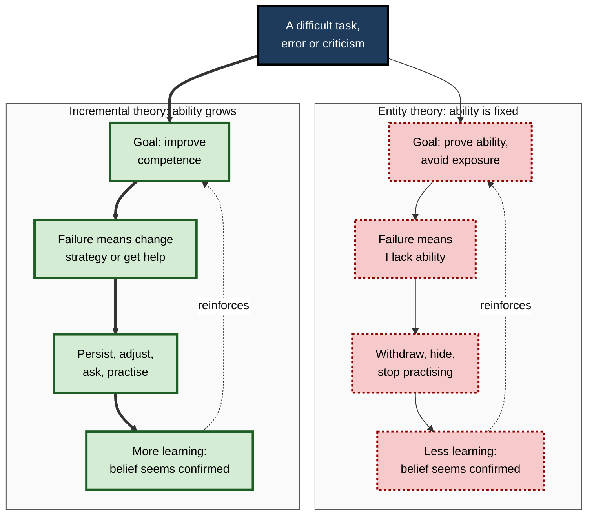
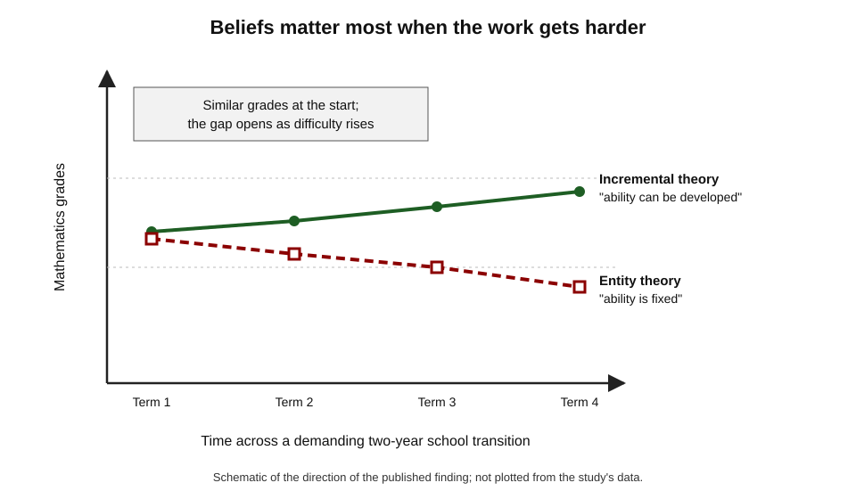
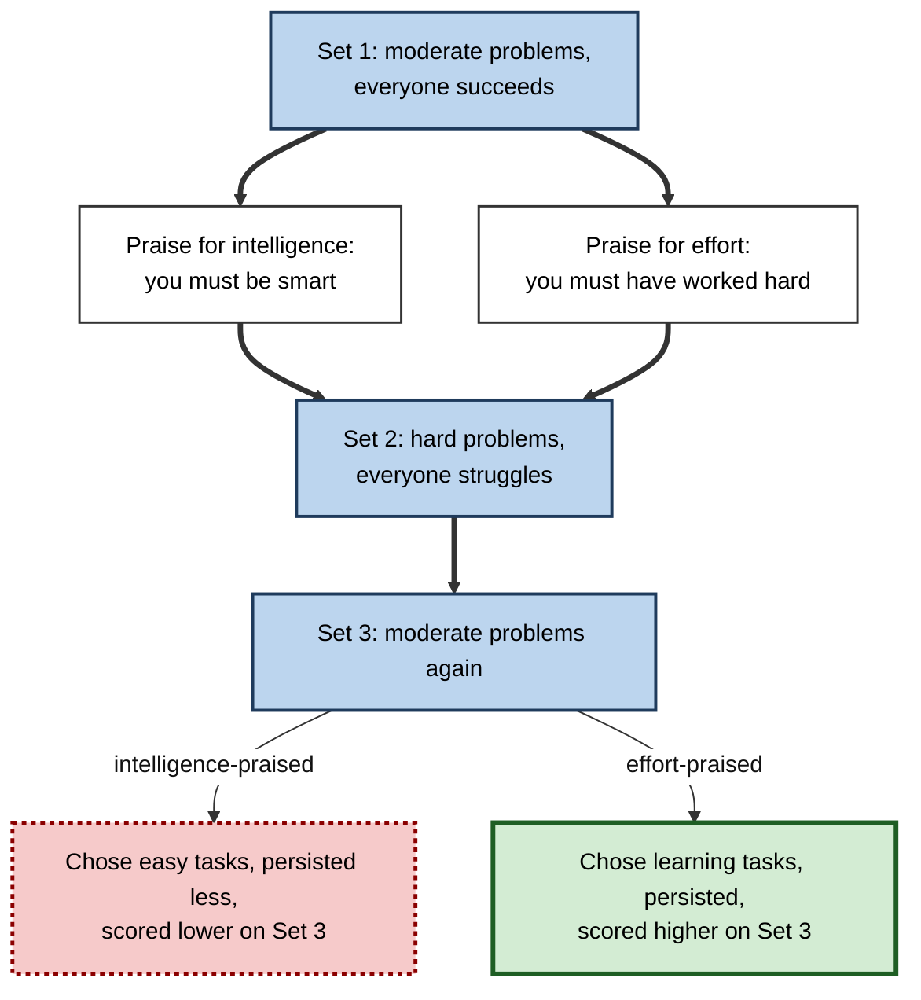
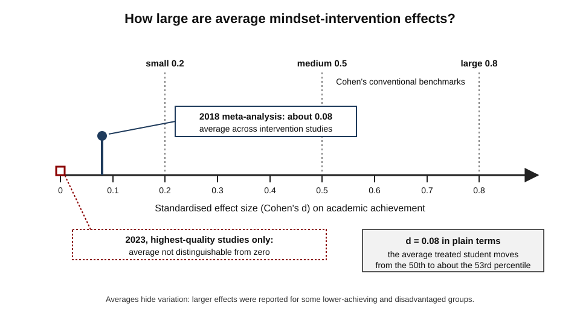
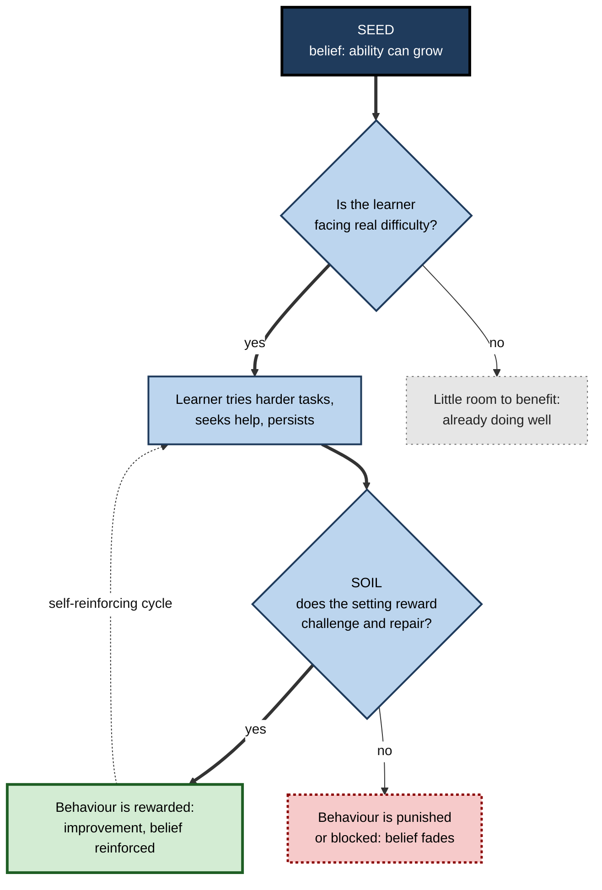
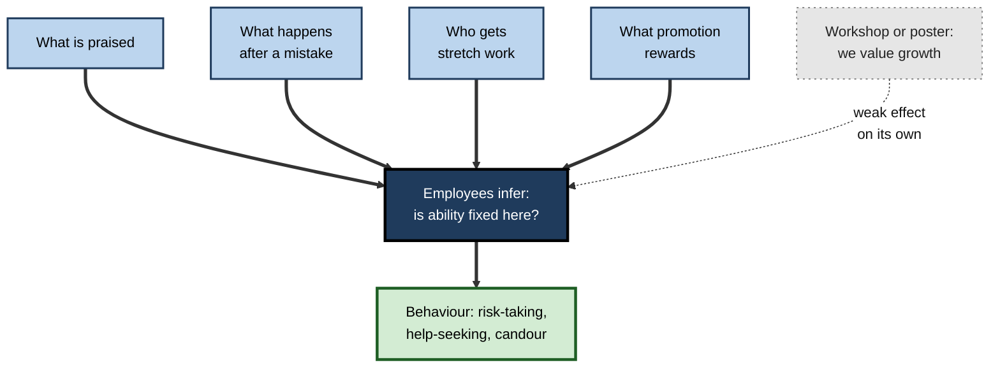

# A.7. Growth Mindset for Learners

Two junior developers receive the same blunt code review: "This design will not scale, and the tests miss the important cases." One concludes, *"I'm not cut out for architecture"*, and quietly stops volunteering for design work. The other asks, *"Which cases did I miss, and how would you have approached the design?"* The event was identical; what differed was each person's belief about whether the ability in question can be developed.

> **Definition — Growth mindset:** the belief that one's abilities, such as intelligence or skill in a domain, can be developed through effort, effective strategies and help from others.

> **Definition — Fixed mindset:** the belief that one's abilities are a fixed quantity that can be displayed but not substantially changed.

**Why it matters**

- Beliefs about ability shape responses at exactly the moments when learning happens: **difficulty, error, criticism and comparison**.
- Growth mindset has been one of the most influential ideas in education and corporate culture since the 2000s — adopted by schools, governments and large companies.
- Its evidence base is now **more modest and more conditional** than its popular reputation; a professional needs to know both what it can do and what it cannot.
- It is a leading example of how a psychological finding is refined — and contested — as studies grow larger and more rigorous.

---

## Implicit Theories of Ability

### Origins: helpless and mastery-oriented responses

**Study card — Diener and Dweck (1978)**

- **Design:** children aged about ten solved problems, then received a series they could not solve.
- **Two patterns appeared:**
  - **Helpless** — attributed failure to lack of ability, voiced negative feelings, and their problem-solving strategies **deteriorated**.
  - **Mastery-oriented** — rarely mentioned failure at all, instructed themselves ("I should slow down"), stayed positive, and often **kept or improved** their strategies.
- **Significance:** the children did not differ in ability; they differed in how they **interpreted** failure.
- **Follow-on question:** why do equally able people interpret failure so differently? Carol Dweck's answer, developed over the next decade, was their **implicit theories** of ability.

> **Definition — Implicit theory:** an unstated, everyday belief about the nature of a human attribute — for example, whether intelligence is fixed or malleable. "Mindset" is the popular name for implicit theories of ability.

### Entity and incremental theories

- **Entity theory** — ability is a fixed entity (the fixed mindset).
  - *e.g.* "You have a certain amount of intelligence, and you can't really do much to change it."
- **Incremental theory** — ability can be increased incrementally (the growth mindset).
  - *e.g.* "No matter who you are, you can significantly change your intelligence level."
- **Measurement:** the classic instrument is a short questionnaire of agreement with statements like these (Dweck, Chiu and Hong, 1995).
- **A continuum, not two types:** scores range along a scale; most people hold intermediate and mixed beliefs.
- **Domain-specific:** a person may hold a growth view of sporting skill and a fixed view of mathematical ability, or of "being a creative person".
- **Other attributes have implicit theories too:**
  - **personality** — can people change who they are?
  - **emotions** — can feelings be controlled?
  - **willpower** — Veronika Job, Dweck and Gregory Walton (2010) found that people who believed willpower is a limited resource showed more depletion after demanding tasks than those who did not.

> **Watch out:** "growth mindset person" and "fixed mindset person" are shorthand. Dweck herself stressed that everyone is a **mixture**, and that particular triggers — a harsh critic, a talented rival, a public failure — can bring out fixed-mindset reactions in anyone.

### The meaning system

**Dweck and Leggett (1988)** proposed that an implicit theory organises a whole **meaning system**:

1. **Theory** — is ability fixed or malleable?
2. **Goals** — to *prove* ability (performance goals) or to *improve* it (learning goals)?
3. **Beliefs about effort** — does needing effort reveal low ability, or is effort how ability grows?
4. **Attributions for failure** — is failure caused by lack of ability (stable, uncontrollable) or by strategy and effort (changeable)?
5. **Response** — withdraw and defend, or persist and adjust.

> **Definition — Performance goal:** a goal to demonstrate competence or to avoid appearing incompetent.

> **Definition — Learning goal:** a goal to increase competence — to master something new.

> **Definition — Attribution:** the cause a person assigns to an outcome; attributions vary in whether they are internal, stable and controllable (Bernard Weiner).

| | Fixed (entity) meaning system | Growth (incremental) meaning system |
|---|---|---|
| Core belief | Ability is a fixed quantity | Ability can be developed |
| Main goal | Look capable; avoid looking incapable | Become more capable |
| Meaning of effort | Needing effort signals low ability | Effort, with good strategy, builds ability |
| Meaning of failure | Evidence of a permanent limit | Information about what to change |
| Typical response to setback | Withdraw, hide, blame, give up | Diagnose, change strategy, seek help, persist |
| Response to critical feedback | Defensive; ignore or argue | Mine it for information |
| Response to others' success | Threatened | Informed or inspired |

**Figure 1.** How an implicit theory shapes goals, interpretations and responses.

> **Key point:** each meaning system is **self-confirming** — the behaviour it produces generates evidence that seems to prove the belief.

---

## The Classic Evidence

### Praise and its consequences

**Study card — Mueller and Dweck (1998)**

- **Design:** a series of experiments with children aged about ten to twelve.
  - All solved a set of moderately difficult problems and were told they had done well.
  - One group was praised for **intelligence** ("You must be smart at these").
  - One group was praised for **effort** ("You must have worked hard at these").
  - A control group received outcome praise only.
  - All then faced a much harder set on which they did poorly, followed by a third set like the first.
- **Results — intelligence-praised children, compared with effort-praised:**
  - more often chose easy tasks that would make them "look smart" rather than tasks they could learn from;
  - enjoyed the problems less and persisted less after failure;
  - **performed worse** on the final set;
  - were more likely to misrepresent their scores when reporting them to other children.
- **Conclusion:** praising a trait can teach a fixed theory — success means "smart", so failure must mean "not smart".

| | Person praise | Process praise | Outcome-only feedback |
|---|---|---|---|
| Example | "You're a natural." | "Breaking the problem into parts worked well." | "Correct — 9 out of 10." |
| What it implies | Success reflects a fixed trait | Success came from controllable choices | Neither |
| After later failure | Failure implies the trait is missing | Failure implies changing the process | Neutral |
| Risk | Challenge avoidance, image protection | Empty if praising effort that is not working | Little guidance for improvement |

> **Watch out:** later attempts to reproduce the praise effects have been mixed. **Yue Li and Timothy Bates (2019)** found no reliable effect of intelligence versus effort praise on children's responses to setbacks in a series of studies in China. The praise findings are best treated as **suggestive**, not settled.

### Beliefs and achievement trajectories

**Study card — Blackwell, Trzesniewski and Dweck (2007)**

- **Study 1 — longitudinal:**
  - several hundred US students were followed across the demanding transition into junior high school;
  - students' implicit theories were measured at the start;
  - students holding an incremental theory showed **rising** mathematics grades over two years, while those holding an entity theory stayed flat — despite similar starting achievement;
  - the link ran through learning goals, positive beliefs about effort and fewer helpless attributions.
- **Study 2 — intervention:**
  - students in an eight-session workshop learned study skills **plus** the message that the brain grows stronger with challenging practice, like a muscle;
  - a control group learned study skills plus material about memory;
  - the decline in mathematics grades seen in the control group was halted in the growth-mindset group, and teachers (unaware of condition) more often reported motivational improvements.

**Figure 2.** The pattern of diverging achievement reported across a difficult school transition.

> **Key point:** the theory predicts that mindset matters most **when the work becomes difficult** — at transitions, under setbacks and in hard courses — and matters little when everything is easy.

### Attention to corrective feedback

**Study card — Mangels and colleagues (2006)**

- **Design:** university students answered difficult general-knowledge questions while brain activity was recorded with electroencephalography (EEG); after each answer they saw whether they were right, then the correct answer; later they were retested on the questions they had missed.
- **Results:** students with an entity theory showed heightened responses to the **ability-relevant** feedback (right or wrong) but less sustained attention to the **learning-relevant** information (the correct answer) — and corrected fewer errors on the retest.
- **Conclusion:** a fixed view may direct attention towards judgement of self and away from information that could repair the error.

- **Related work:** Jason Moser and colleagues (2011) reported that a growth mindset was associated with a larger brain response to one's own errors and better accuracy after errors. Such neural findings are small-sample and correlational; they illustrate the theory's proposed mechanism rather than prove it.

**Figure 3.** The design of the praise experiments.

---

## What a Growth Mindset Is — and Is Not

### The working form: effort, strategy, help

- **Effort alone is not the point.** Effort with a failing method produces the same failure.
- **The productive belief** is that ability grows through:
  - **effort** — sustained time on the right tasks;
  - **strategy** — changing *how* one practises when progress stalls;
  - **help** — feedback, examples and coaching from others.

> **Mnemonic — "ESH, then try again":** Effort, Strategy, Help.

**A setback routine built on the theory**

1. **Notice the fixed interpretation.** "I'm just not an architecture person."
2. **Re-describe it as a current state.** "I can't design for scale *yet*."
3. **Locate the gap precisely.** Which part failed — knowledge, method, time?
4. **Change one strategy.** Study reference designs and redraw them from memory; tackle a smaller version first.
5. **Ask for targeted help.** "Can you show me how you would think about load here?"
6. **Compare with one's past self**, not with the most talented colleague.

### The "false growth mindset"

**Dweck (2015)** warned that popular uptake had produced a **false growth mindset**:

- **Equating it with effort praise** — "Great effort!" for work that is not improving, which consoles rather than teaches.
- **Equating it with being open-minded or positive** in general.
- **Claiming it as a fixed trait** — "I have a growth mindset" — while reacting defensively under threat.
- **Using it to blame** — telling people who lack time, resources or teaching that their problem is their mindset.

> **Watch out:** a growth mindset does **not** claim that anyone can become anything, that ability differences are unreal, or that effort guarantees success. It claims that current ability is **not a ceiling** — a narrower and more defensible claim.

> **Definition — Process praise:** feedback that credits the strategies, choices, effort and improvement that produced a result, rather than a fixed trait.

---

## Intervention Research

### What a mindset intervention is

- **Typical form:** a short programme — often one or two online sessions totalling under an hour — in which learners:
  - read accessible material on how the brain changes with challenging practice;
  - read stories of older students or colleagues overcoming setbacks;
  - write advice to a future learner who is struggling ("saying is believing" — advocating the idea strengthens it).
- **Classed as a "wise" intervention** (Gregory Walton and others): brief, precisely targeted at a belief, designed to set off a self-reinforcing cycle — not a substitute for teaching.

> **Watch out:** David Yeager and Gregory Walton (2011) titled their review of such interventions "they're not magic". Brief interventions can only work if the belief they change leads to behaviour the environment then rewards.

### Early trials

- **Aronson, Fried and Good (2002):** university students who wrote supportive letters about the malleability of intelligence achieved higher grades over the following term than controls, with a notable benefit for African American students.
- **Good, Aronson and Inzlicht (2003):** adolescents mentored with a growth message achieved higher standardised test scores than controls.
- **Paunesku and colleagues (2015):** brief online growth-mindset and sense-of-purpose exercises for about 1,500 students in 13 US high schools raised the rate of satisfactory course completion among students **at risk** of dropping out, with little effect on others.
- **Pattern:** promising but often small samples; benefits concentrated in struggling groups.

### The National Study of Learning Mindsets

**Study card — Yeager and colleagues (2019)**

- **Design:**
  - a nationally representative sample of about 12,000 students starting secondary school (ninth grade) in 65 US public schools;
  - two online sessions, under an hour in total, versus a control programme about brain functions;
  - **pre-registered** analysis; data collected and processed by independent research firms.
- **Results:**
  - among **lower-achieving** students, end-of-year grades in core subjects rose by about **0.1 grade points** on a four-point scale;
  - across the whole sample, more students enrolled in **advanced mathematics** the following year;
  - effects were larger in schools whose **peer norms** supported taking on challenges.
- **Conclusion:** a short, cheap intervention produced a small, reliable effect for the students most at risk — an effect whose size depended on the school context.

### The 2018 meta-analyses

**Study card — Sisk, Burgoyne, Sun, Butler and Macnamara (2018)**

- **Meta-analysis 1 — correlation:** across hundreds of thousands of students, the relationship between mindset and academic achievement was **weak** (an average correlation of about r = 0.10).
- **Meta-analysis 2 — interventions:** the average effect of mindset interventions on achievement was **small** (about d = 0.08).
- **Moderators:** effects were somewhat larger for students from **low-income** backgrounds and those **academically at risk**.
- **Conclusion:** the authors questioned how much educational resource should be directed to mindset interventions.

> **Definition — Effect size (Cohen's d):** the difference between two group means divided by their pooled standard deviation; it expresses an effect in standard-deviation units so studies can be compared.

> **Formula — From d to percentile:** if a treatment shifts scores by d standard deviations, the average treated person ends up at the percentile Φ(d) of the untreated distribution, where Φ is the standard normal cumulative distribution. For d = 0.08, Φ(0.08) ≈ 0.53 → from the **50th to about the 53rd percentile**. For comparison, d = 0.2 → about the 58th; d = 0.5 → about the 69th.

**Figure 4.** Average mindset-intervention effects compared with conventional benchmarks.

### The 2023 dispute

- In 2023 two meta-analyses of growth-mindset interventions, both in the same leading journal, reached different conclusions.

| | Macnamara and Burgoyne (2023) | Burnette and colleagues (2023) |
|---|---|---|
| Central question | Do interventions raise achievement on average, and is the evidence trustworthy? | For whom, how and why might interventions work? |
| Approach to quality | Coded studies for design, reporting and possible bias; examined the highest-quality subset | Examined implementation fidelity and whether participants were those expected to benefit |
| Main finding | Small overall effect; among the best-designed studies, **not distinguishable from zero** | Small overall effects on academic and other outcomes; **meaningful** for focal, at-risk groups with high-fidelity delivery |
| Interpretation | Apparent benefits are likely due to weak designs, reporting flaws and bias | Benefits are real but heterogeneous; averages hide them |
| Implication | Little justification for widespread investment | Target interventions to those likely to benefit, and deliver them well |

- **Commentary:** Elizabeth Tipton, Yeager and colleagues argued that meta-analyses should focus on **heterogeneity** — which groups and contexts show effects — rather than averages across very different populations; Macnamara and Burgoyne replied that quality problems, not hidden heterogeneity, explain the pattern.
- **Where the disagreement narrows:**
  - both agree average effects are **small**;
  - both agree claims of large, universal effects are **unsupported**;
  - they differ on whether reliable benefits exist for particular groups, and how much investment those justify.

> **Key point:** the honest summary is a **contested small effect** — not "debunked", and not "transformative".

### Null and failed results

- **Li and Bates (2019):** in studies of Chinese schoolchildren, mindset was not reliably associated with grades, and praise effects did not replicate.
- **Bahník and Vranka (2017):** among several thousand Czech university applicants, growth mindset was essentially unrelated to scholastic aptitude test performance.
- **Education Endowment Foundation (England):** a larger, later trial of a mindset programme for primary school pupils found **no effect** on attainment, after an earlier smaller trial had looked promising.
- **Ganimian (2020):** a large trial of a brief online intervention in Argentine secondary schools found no improvement in achievement.

> **Remember — the defensible reading:** brief mindset interventions have, at best, **small average effects** on achievement; benefits, where found, concentrate in **struggling or disadvantaged** learners and depend on a **supportive environment**; the underlying idea — that beliefs about ability shape responses to difficulty — remains plausible and modestly supported.

---

## Who Benefits, and When

### Seed and soil

- **Walton and Yeager (2020)** used a gardening metaphor:
  - the **seed** — the belief the intervention plants;
  - the **soil** — the context that does or does not let the belief pay off.
- **A growth belief helps only if acting on it is rewarded:**
  - challenging courses are available;
  - mistakes are not punished;
  - teachers and managers respond to effort and improvement;
  - peers do not mock trying hard.

**Figure 5.** Why the same intervention works in some settings and not others.

### The people around the learner

- **Teachers:** a 2022 follow-up of the national study found the intervention's effects were concentrated in classrooms whose teachers themselves held growth mindsets.
- **University faculty — Canning, Muenks, Green and Murphy (2019):** in courses taught by science, technology, engineering and mathematics (STEM) faculty who endorsed fixed views of ability, racial and ethnic achievement gaps were considerably larger than in courses taught by faculty with growth views.
- **Parents — Haimovitz and Dweck (2016):** children's mindsets were predicted less by their parents' beliefs about intelligence than by parents' beliefs about **failure** — whether failure is debilitating or enhancing — as shown in how parents reacted to their children's setbacks.
- **Implication:** mindsets are partly **taught by environments** — by how others respond to effort, struggle and error.

> **Key point:** learners infer what ability is from how important people react to **their mistakes**. A manager's response to a failed first attempt teaches more about mindset than any workshop.

---

## Growth Mindset in Organisations

### Managers' implicit theories

**Study card — Heslin, Latham and VandeWalle (2005)**

- **Design:** managers' implicit theories about whether people's abilities can change were measured; they then rated employees whose performance changed over time.
- **Results:**
  - managers with fixed views anchored on **first impressions** and were slower to recognise genuine improvement or decline;
  - a short workshop using self-persuasion (generating reasons why people can change, recalling cases where they had) shifted managers towards growth views and improved their recognition of change, an effect still visible weeks later.
- **Implication:** a manager's mindset affects fairness in appraisal, willingness to coach and the allocation of stretch work.

### Cultures of genius and cultures of development

- **Mary Murphy and Carol Dweck (2010)** showed that organisations communicate a collective theory of ability — whether they prize innate "genius" or development.
- **Later workplace research (Canning and colleagues, 2020):** employees in organisations seen as holding fixed views reported less trust and commitment, less support for innovation and collaboration, and more concern about cheating and unethical behaviour.

| | Culture of genius | Culture of development |
|---|---|---|
| What is celebrated | Brilliance, natural talent, never struggling | Improvement, learning from setbacks, developing others |
| Hiring and promotion signal | "Raw talent" and polish | Demonstrated growth and learning over time |
| Response to a visible mistake | Blame, reputational damage | Blameless review; what will change |
| Allocation of stretch work | Only to proven "stars" | As development, with support |
| Typical employee behaviour | Hide weakness, compete, avoid risk | Ask for help, share errors, experiment |

- **Example:** from 2014, Microsoft's chief executive Satya Nadella publicly reframed the company's culture from "know-it-alls" to "learn-it-alls", linking the idea to how people were evaluated and how leaders talked about failure. The broader lesson is that **beliefs spread when incentives back them**.

**Figure 6.** How organisational signals teach a theory of ability.

### Feedback that supports a growth view

- **Instead of** "You're a natural presenter" → "Opening with the client's problem worked; keep doing that."
- **Instead of** "Good effort" (when the attempt failed) → "That approach didn't get there. Here's one alternative — which would you try next?"
- **Instead of** "She's just not strategic" → "Strategic framing is a skill. Let's pick one review where she leads the framing, with coaching."

> **In practice:** the most powerful growth-mindset practice for a leader is visible: describing one's own past mistakes and what was learned, and responding to others' first failures with diagnosis rather than judgement.

### Distinguishing growth mindset from neighbouring ideas

| Construct | Core belief or tendency | Relation to growth mindset |
|---|---|---|
| **Growth mindset** | Ability *in general* can be developed | The subject itself |
| **Self-efficacy** (Albert Bandura) | *I* can succeed at *this* task | Task-specific confidence; a person can believe ability grows yet doubt they can do this task now |
| **Learning goal orientation** | Aim to improve rather than to prove | A consequence the theory predicts; can be measured separately |
| **Attributions** | Outcomes caused by controllable factors | The interpretive link between belief and response |
| **Grit** (Angela Duckworth) | Sustained passion and perseverance for long-term goals | A trait-like persistence measure; not a belief about ability |

### Case study: a graduate programme that tried a workshop first

- **Situation:** a consulting firm's graduates were reluctant to present to clients or volunteer for unfamiliar analysis; exit interviews mentioned "fear of looking stupid".
- **First attempt:** a half-day growth-mindset workshop with videos and "power of yet" slogans.
  - Satisfaction was high; three months later, volunteering for stretch work was unchanged.
- **Diagnosis:**
  1. engagement reviews still rated graduates on "natural client presence";
  2. the first client presentation was treated as a public test — errors were discussed in team meetings;
  3. stretch work went to graduates already seen as "stars";
  4. partners rarely spoke about their own early mistakes.
- **Actions:**
  1. rewrote review criteria to assess **improvement** across the year, with specific skills (structuring, client questions);
  2. introduced a low-stakes internal rehearsal with coaching before every first client presentation;
  3. rotated stretch work deliberately, each with a named coach;
  4. partners ran short sessions on their own early failures and what changed;
  5. kept a brief growth-mindset module — but inside the induction, linked to these practices.
- **Result:** within a year, more graduates volunteered for client-facing work, and coaches reported earlier, franker requests for help.
- **Caveats:** no control group; several changes at once; the effect of the mindset module itself cannot be separated.
- **Lesson:** the belief that ability can grow becomes rational for employees only when the **system** responds to growth.

### Mindset traps in the AI era

- **A new fixed-mindset excuse:** "AI can do it, so there's no point getting good at it." Judging and directing AI output depends on the very skills being skipped.
- **A new false growth:** steadily rising AI-assisted output mistaken for personal development. A growth orientation asks whether **the person's own** capability has grown — tested, occasionally, without the tool.
- **Mindset and tool error:** treating an AI's correction as information, not as a verdict on one's ability, is the same interpretive skill applied to a new source of feedback.

---

## Open Questions

- **Do brief interventions improve achievement at all, once study quality is accounted for?**
  - The 2023 meta-analyses disagree; the answer depends on how quality and heterogeneity are handled.
- **For whom and where do benefits appear?**
  - Evidence points to struggling learners in supportive contexts, but reliable prediction of where an intervention will work remains limited.
- **Can adults' and professionals' mindsets be changed durably?**
  - Most rigorous trials involve adolescents; workplace evidence relies on smaller studies and correlations.
- **How much do teachers and managers matter compared with the learner's own belief?**
  - Studies of teacher and faculty mindsets are suggestive but mostly correlational.
- **Does combining mindset messages with other approaches help?**
  - Recent work combines growth-mindset messages with reappraisal of stress; whether such combinations are reliably stronger is not yet settled.

---

## Summary

- A **growth mindset** is the belief that ability can be developed; a **fixed mindset** treats it as a set quantity. Both are **implicit theories**, held on a continuum and specific to domains.
- **Diener and Dweck (1978)** found helpless and mastery-oriented responses to failure in equally able children.
- **Dweck and Leggett (1988):** the theory organises a **meaning system** — goals, effort beliefs, attributions and responses — that is self-confirming.
- Classic studies: **Mueller and Dweck (1998)** on intelligence versus effort praise (replication mixed); **Blackwell et al. (2007)** on diverging grades and an intervention; **Mangels et al. (2006)** on attention to corrective feedback.
- The working form is **effort + strategy + help**; Dweck's **false growth mindset** warns against effort praise, slogans and blame.
- **Interventions** are brief "wise" programmes. The **National Study of Learning Mindsets** (2019) found about **0.1 grade points** for lower achievers, larger where peer norms supported challenge.
- **Meta-analyses:** 2018 — weak correlation (r ≈ 0.10), small intervention effect (d ≈ 0.08). 2023 — **Macnamara and Burgoyne** found near-zero effects in the best studies; **Burnette and colleagues** found meaningful effects for focal groups. Several large trials found no effect.
- **Seed and soil:** benefits depend on difficulty and a supportive context; teachers', faculty's, parents' and managers' beliefs and reactions to failure matter.
- In organisations, **cultures of genius** versus **cultures of development** shape behaviour; incentives, mistake handling, stretch allocation and leader behaviour teach mindset more than workshops.

---

## Self-Check

1. Define growth and fixed mindsets, and explain why both are called implicit theories.
2. What did Diener and Dweck (1978) observe in helpless and mastery-oriented children?
3. Outline the meaning system proposed by Dweck and Leggett (1988).
4. Describe the design and findings of Mueller and Dweck (1998), and state its replication status.
5. Why does the theory predict that mindset matters most at difficult transitions? Cite supporting evidence.
6. What is a "false growth mindset"? Give three forms.
7. Describe the National Study of Learning Mindsets and its main results.
8. Convert an effect size of d = 0.08 into a percentile shift and explain what this means in practice.
9. Compare the conclusions of Macnamara and Burgoyne (2023) and Burnette and colleagues (2023). Where do they agree?
10. Explain the "seed and soil" idea with a workplace example.
11. What did Heslin, Latham and VandeWalle find about managers' implicit theories?
12. How does growth mindset differ from self-efficacy and from grit?
13. A chief executive wants every employee to complete a growth-mindset e-learning module. Advise them, using the evidence.
14. A vendor claims its mindset programme "raises performance by 30%". What questions would you ask?

### Answer Key

1. Growth: ability can be developed through effort, strategy and help. Fixed: ability is a set quantity. They are implicit theories because they are unstated, everyday beliefs about the nature of an attribute, held to varying degrees and differing by domain.
2. Facing unsolvable problems, helpless children blamed lack of ability, felt negative and their strategies deteriorated; mastery-oriented children instructed themselves, stayed positive and kept or improved strategies — despite equal ability.
3. The theory (fixed or malleable) shapes goals (prove or improve), beliefs about effort (sign of low ability or route to ability), attributions for failure (ability or strategy/effort) and responses (withdraw or persist), each reinforcing the theory.
4. After success on moderate problems, children were praised for intelligence or effort, then failed on hard problems. Intelligence-praised children chose easier tasks, enjoyed and persisted less, performed worse later and misreported scores more. Later replications, such as Li and Bates (2019), were mixed; the findings are suggestive.
5. Beliefs shape the response to difficulty; when work is easy, there is nothing to interpret. Blackwell et al. (2007) found grades diverged across a demanding school transition; the national study found effects among lower achievers.
6. Effort praise for work that is not improving; equating it with general positivity or open-mindedness; claiming it as a fixed trait; using it to blame people who lack resources.
7. About 12,000 nationally representative ninth graders in 65 US schools; under an hour of online material; pre-registered with independent data handling. Lower-achieving students' grades rose by about 0.1 points; advanced mathematics enrolment rose; effects were larger where peer norms supported challenge.
8. Φ(0.08) ≈ 0.53, so the average treated student moves from the 50th to about the 53rd percentile — a very small shift for an individual, though potentially worthwhile at scale for a cheap intervention.
9. Macnamara and Burgoyne: small overall effect; near zero among the best-designed studies; apparent effects likely due to design flaws and bias. Burnette et al.: small overall effects but meaningful for focal, at-risk groups with high-fidelity delivery. Both agree average effects are small and large universal claims unsupported.
10. The seed is the belief; the soil is a context that rewards acting on it. A junior who now believes she can grow volunteers for a hard project; if her manager publicly criticises her first error, the belief fades; if the manager coaches her, it is reinforced.
11. Managers with fixed views anchored on first impressions and were slower to recognise employees' improvement or decline; a short self-persuasion workshop shifted them towards growth views and improved recognition of change.
12. Growth mindset is a general belief that ability can develop; self-efficacy is confidence in succeeding at a specific task; grit is a trait-like tendency to persevere towards long-term goals. One can believe ability grows yet lack confidence in a given task, or persevere while holding a fixed view.
13. On its own, a module is likely to have little effect: average effects are small and context-dependent. Change the signals — praise, mistake handling, stretch allocation with support, promotion criteria, leaders' visible learning — then, if wished, include a brief module linked to these practices, and measure behaviour (help-seeking, stretch volunteering) over time.
14. Thirty per cent of what, measured how and when? Was there a randomised control group? What was the effect size and its uncertainty? Was it pre-registered and independently evaluated? For whom did it work, in what context? How does it compare with the small effects in the meta-analyses?

---

## Glossary

| Term | Meaning |
|---|---|
| Attribution | The cause a person assigns to an outcome, varying in internality, stability and controllability. |
| Cohen's d | A standardised effect size: mean difference divided by pooled standard deviation. |
| Culture of development | An organisational climate that treats ability as developable and rewards growth. |
| Culture of genius | An organisational climate that prizes innate brilliance and treats ability as fixed. |
| Entity theory | The implicit belief that an ability is fixed. |
| False growth mindset | A superficial version of growth mindset, such as effort praise without progress, or slogans without changed practice. |
| Fixed mindset | The belief that one's abilities are fixed quantities. |
| Growth mindset | The belief that abilities can be developed through effort, strategy and help. |
| Helpless pattern | A response to failure marked by ability attributions, negative affect and deteriorating strategy. |
| Heterogeneity | Variation in an effect across people, settings or studies. |
| Implicit theory | An unstated belief about the nature of a human attribute. |
| Incremental theory | The implicit belief that an ability can be increased. |
| Learning goal | A goal to increase competence. |
| Mastery-oriented pattern | A response to failure marked by self-instruction, positive affect and maintained or improved strategy. |
| Meaning system | The linked goals, beliefs and attributions organised by an implicit theory. |
| Performance goal | A goal to demonstrate competence or avoid appearing incompetent. |
| Pre-registration | Publicly specifying a study's hypotheses and analyses before seeing the data. |
| Process praise | Feedback crediting strategies, choices and improvement rather than traits. |
| Seed and soil | The idea that a belief-changing intervention works only in contexts that reward the new behaviour. |
| Self-efficacy | Confidence in one's ability to succeed at a specific task. |
| Wise intervention | A brief, precisely targeted psychological intervention designed to change a belief and start a self-reinforcing cycle. |
