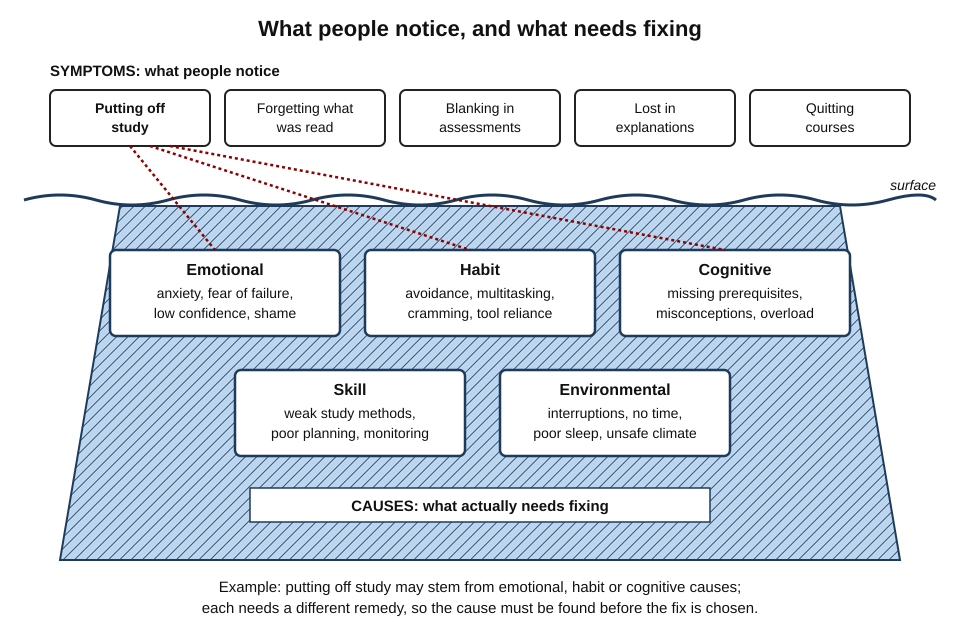
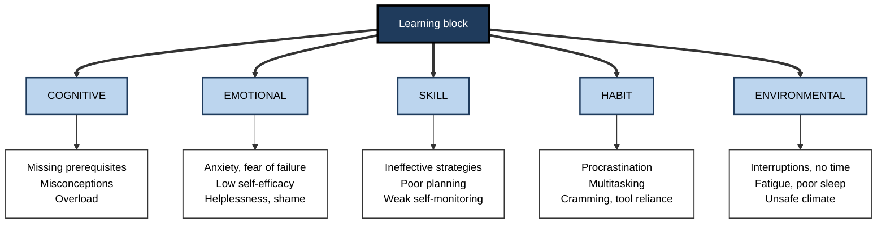
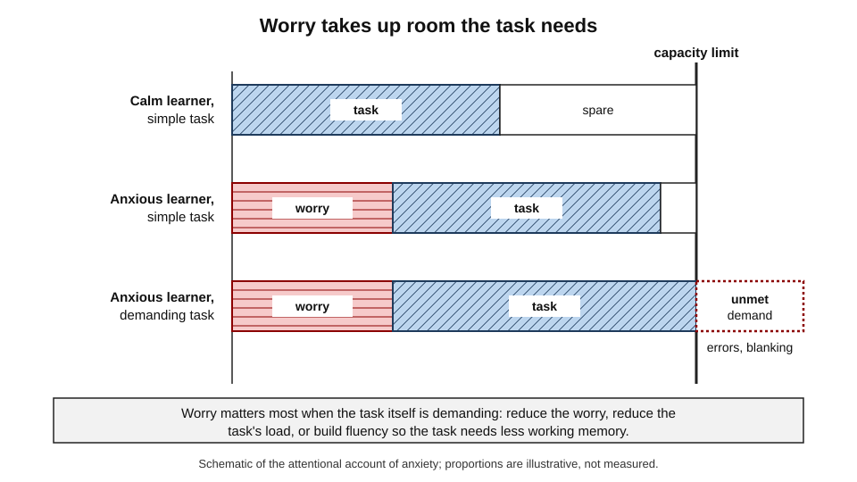
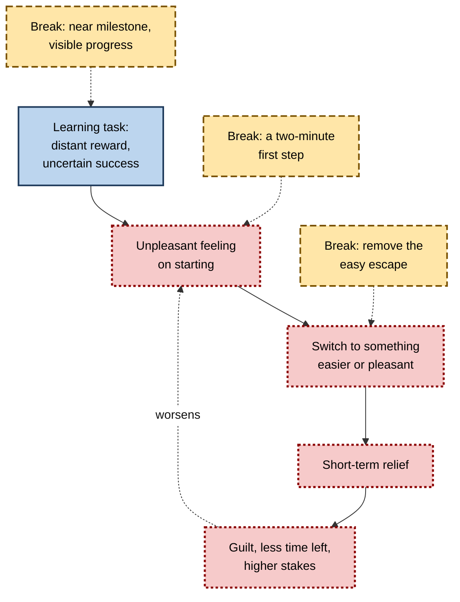
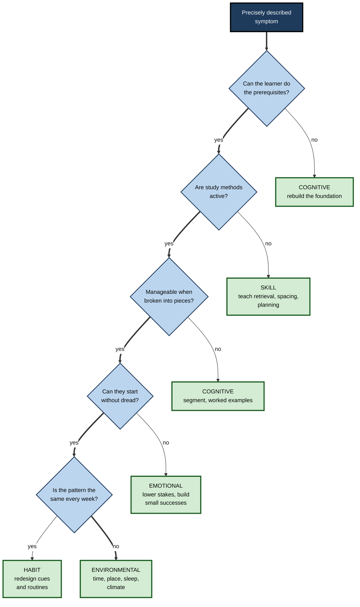
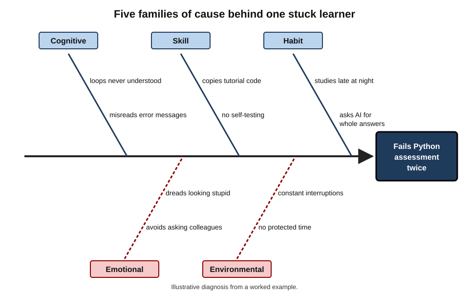

# A.8. Identifying Your Learning Blocks

An accountant enrols in three online Python courses in a year and abandons each one in week two. Her manager suggests more discipline; a friend suggests a better course; she concludes she is "not technical". All three diagnoses are guesses. When the actual causes are found — a concept that never landed, a study method that builds no memory, evenings with no energy left, and a dread of looking foolish in front of colleagues — each turns out to be fixable, and none of them is a lack of ability.

> **Definition — Learning block:** any persistent obstacle that stops effort from turning into durable learning, whether its source lies in what the learner knows, feels, can do, habitually does, or the conditions in which they learn.

**Why diagnosis matters**

- "I'm stuck" has many possible causes, and **each needs a different remedy**.
- The commonest response — more hours, more willpower, another course — treats every block as a motivation problem and usually fails.
- Wrong diagnoses do harm: people conclude they lack ability, managers label staff "not data people", and organisations buy training that cannot fix an environmental problem.
- Precise diagnosis is a professional skill in its own right — used by coaches, trainers, clinical educators and managers, and by anyone managing their own development.

---

## Symptoms and Causes

### Telling them apart

> **Definition — Symptom:** what the learner or an observer notices — procrastination, forgetting, blanking, confusion, quitting.

> **Definition — Root cause:** the underlying condition that produces the symptom and that must change for the symptom to disappear.

- **One symptom, many causes.** Procrastination may come from anxiety about the task, a task that is too hard to start, an ingrained avoidance habit or simply no usable time.
- **One cause, many symptoms.** A missing prerequisite can produce confusion, forgetting, slow work and eventually avoidance.
- **Causes stack.** Most real blocks involve two or three causes reinforcing one another.

**Figure 1.** Visible symptoms and the hidden families of cause.

> **Key point:** never choose a remedy from the symptom. Diagnose the cause, then match the remedy to it.

### Common symptoms and their possible causes

| Symptom | Possible cognitive cause | Possible emotional cause | Possible skill or habit cause | Possible environmental cause |
|---|---|---|---|---|
| Putting off study | Task too hard to begin; unclear next step | Dread of failure or of being judged | Ingrained avoidance; no planning routine | No protected time; constant interruptions |
| "I read it but forgot it" | No prior knowledge to attach it to | — | Re-reading instead of self-testing; cramming | Studying while exhausted |
| Blanking in assessments | Knowledge fragile or never retrieved | Test anxiety consuming attention | Never practised under test conditions | Noisy or hurried test setting |
| Lost during explanations | Missing prerequisite; overload | Embarrassment stops questions | Weak note-taking or listening skills | Fast pace with no chance to ask |
| Quitting courses early | Course assumes knowledge not held | Feeling "not the kind of person" who does this | All-or-nothing study habit | Workload spikes; no manager support |

---

## Five Families of Learning Block

The blocks that most often stop adult learners fall into five families.

| Family | What goes wrong | Typical signal | Quick test | First remedy |
|---|---|---|---|---|
| **Cognitive** | What the learner knows or can hold in mind | Repeated errors of one kind; "nothing makes sense" | Try a few problems on the prerequisite topic | Rebuild the foundation; confront misconceptions; reduce load |
| **Emotional** | How the learner feels about the task or themselves | Dread, avoidance, blanking, defensiveness | "How do I feel in the first minute of starting?" | Lower the stakes; reappraise; build small successes |
| **Skill** | The learner lacks the *techniques* of learning | Hard work, poor retention | List exactly what was done in the last study session | Teach and practise effective methods |
| **Habit** | Automatic routines work against learning | Same unhelpful pattern every week | Track one week of study behaviour | Redesign cues and routines |
| **Environmental** | Conditions outside the learner | Concentration short; starting hard; fatigue | Log where, when and how often interrupted | Change time, place, tools or workload |

> **Mnemonic — "CESHE — Can Every Student Have Energy?":** Cognitive, Emotional, Skill, Habit, Environmental.

**Figure 2.** The five families of learning block and their common forms.

### Cognitive blocks

**Missing prerequisites**

- New knowledge is built on old; when a foundation is missing, everything above it is unstable.
- **Robert Gagné (1960s)** showed that complex skills decompose into **learning hierarchies**: each depends on simpler ones, and a learner who fails a higher skill usually lacks a specific lower one.
- *e.g.* an analyst who cannot follow regression usually lacks fluency with variance or with reading scatter plots, not "statistics" as a whole.

> **Definition — Prerequisite:** knowledge or skill that must already be in place for new material to make sense.

**Misconceptions**

> **Definition — Misconception:** a confidently held but incorrect understanding that actively interferes with learning the correct idea.

**Study card — McCloskey, Caramazza and Green (1980)**

- **Design:** university students predicted the path of a ball shot out of a curved tube.
- **Result:** many — including some who had studied physics — predicted it would **keep curving**, an intuitive "impetus" belief contrary to Newtonian mechanics.
- **Conclusion:** intuitive theories persist alongside formal instruction and resurface when people reason informally.

- **Shtulman and Valcarcel (2012):** adults verifying scientific statements were slower and less accurate when the scientific answer conflicted with intuition — suggesting misconceptions are **suppressed, not erased**.
- **Workplace examples:**
  - "correlation in our data shows the campaign caused the sales rise";
  - "more people on a late project will speed it up";
  - "the model is right because it is confident".
- **What works:**
  - make the misconception explicit;
  - set up a prediction the misconception gets wrong;
  - give the correct explanation and show why it succeeds — the approach of **refutation texts**, which reviews of science education have found more effective than simple exposition.

> **Watch out:** a misconception is not a gap. A gap is filled by teaching; a misconception must be **confronted**, or the new idea simply sits beside the old one.

**Overload**

- Working memory holds only a few new elements at once; instruction that presents too many interacting new elements together leaves novices lost.
- **Signal:** the learner follows each step but cannot hold the whole.
- **Remedy:** break the material into segments, use worked examples, and secure prerequisites first so they no longer occupy working memory.

**Illusions of competence**

- Familiarity from re-reading feels like knowledge; the learner stops studying too early.
- **Signal:** confident before the test, surprised after it.
- **Remedy:** test before judging — close the material and try to reproduce or apply it.

### Emotional blocks

**Anxiety and working memory**

- **Mark Ashcraft and colleagues** showed that mathematics anxiety disrupts performance most on problems that demand working memory.
- **Attentional control theory (Eysenck and colleagues, 2007):** anxiety shifts attention towards threat and worry, reducing the control available for the task.

**Figure 3.** How worry competes with a task for limited working memory.

**Study card — Ramirez and Beilock (2011)**

- **Design:** before a high-stakes test, some students spent ten minutes writing about their worries; controls sat quietly or wrote about something else. Studied in the laboratory and in a secondary-school biology class.
- **Result:** highly test-anxious students who wrote about their worries performed better than anxious controls.
- **Proposed mechanism:** "offloading" worries reduced their claim on working memory.
- **Status:** influential, but later replication attempts have produced **mixed** results; treat expressive writing as a low-cost option to try, not a reliable cure.

- **Reappraisal:** reinterpreting a racing heart as readiness ("I'm excited") rather than threat has improved performance in some studies (e.g. Jeremy Jamieson and colleagues; Alison Wood Brooks); effects vary across replications.

> **Watch out:** the popular inverted-U "Yerkes–Dodson law" (moderate arousal is best) comes from a 1908 study of mice learning to discriminate under electric shock. It is a loose description, not a precise law — the relationship between anxiety and performance depends heavily on the task and the person.

**Fear of failure, shame and the impostor phenomenon**

- **Fear of failure** produces avoidance: the learner protects self-image by not trying, or by trying in ways that provide an excuse (late starts, minimal effort) — called **self-handicapping**.
- **Impostor phenomenon** — Pauline Clance and Suzanne Imes (1978) described high-achieving people who attribute their success to luck and fear being "found out".
  - Common at career transitions and in new specialisms.
  - A description of an experience, not a clinical diagnosis.
- **Signal:** the learner will not ask questions, hides drafts, or over-prepares to exhaustion.

**Low self-efficacy and helplessness**

> **Definition — Self-efficacy (Albert Bandura, 1977):** a person's belief that they can successfully carry out a specific task.

- **Four sources of self-efficacy (Bandura):**
  1. **mastery experiences** — succeeding at the task (the strongest);
  2. **vicarious experience** — seeing similar others succeed;
  3. **verbal persuasion** — credible encouragement;
  4. **physiological and emotional states** — how arousal is interpreted.
- **Learned helplessness:**
  - Martin Seligman and Steven Maier's experiments from the 1960s found that animals exposed to uncontrollable shocks later failed to escape controllable ones.
  - **Maier and Seligman (2016)** revised the account using neuroscience: passivity is the default response to prolonged adversity; what is **learned** is that one has control.
  - **Implication for learners:** repeated failure without understanding why produces passivity; the remedy is experiences of control — small, clearly achievable steps where effort visibly works.
- **Attributions (Bernard Weiner):** explaining failure by causes that are **internal, stable and uncontrollable** ("I'm not a numbers person") deepens the block; explaining it by **changeable** causes (method, preparation, a missing concept) opens a route forward.

> **Watch out:** **stereotype threat** — the claim that concern about confirming a negative stereotype about one's group lowers performance — was highly influential. Later meta-analyses found signs of publication bias, and a large pre-registered replication found no effect. The broader point that evaluative pressure can affect performance is plausible; the size of the effect is **contested**.

### Skill blocks

Many learners work hard with techniques that build little durable learning. Their block is not effort but **method**.

- **Weak study strategies.**
  - Surveys of students, such as Karpicke, Butler and Roediger (2009), found **re-reading** was the most common strategy and **self-testing** rare.
  - Reviews of learning techniques rate re-reading and highlighting as low in usefulness and practice testing and spacing as high.
- **Poor planning.** No breakdown of the goal into sessions; no schedule; study happens only when urgent.
- **Weak self-monitoring.** The learner cannot tell what they do and do not know, so cannot direct effort.
- **Poor help-seeking.** Not knowing how to ask a precise question ("I don't get it" versus "why does the join duplicate rows?").
- **Foundational skill gaps.** Reading dense text, basic numeracy, typing or digital fluency can block learning in an apparently unrelated field.

> **Example:** a sales manager preparing for a finance certification spends twelve hours re-reading the textbook and highlighting. A diagnostic quiz shows recall below 40%. The block is a **skill** block — the method — not intelligence or motivation.

### Habit blocks

Habits are automatic routines triggered by cues. Some habits work silently against learning.

**Procrastination**

> **Definition — Procrastination:** voluntarily delaying an intended action despite expecting to be worse off for the delay.

- **Piers Steel (2007)** synthesised hundreds of studies into **temporal motivation theory**:

> **Formula — Temporal motivation theory:** Motivation = (Expectancy × Value) ÷ (Impulsiveness × Delay). Illustration in arbitrary units: studying for an exam ten weeks away, with expectancy 0.6, value 8, impulsiveness 2 and delay 10 → (0.6 × 8) ÷ (2 × 10) = **0.24**. Checking messages now, with expectancy 1, value 2, impulsiveness 2 and delay 0.1 → (1 × 2) ÷ (2 × 0.1) = **10**. The immediate, certain, minor reward wins.

- **Levers the formula exposes:**
  - raise **expectancy** — smaller, clearly achievable first steps;
  - raise **value** — connect the task to something the learner cares about;
  - lower **impulsiveness** — remove the easy escape (phone in another room);
  - shorten **delay** — set near-term milestones with visible progress.
- **Procrastination as mood repair (Fuschia Sirois and Timothy Pychyl, 2013):** delay is often a way to escape the bad feeling a task evokes — short-term mood relief at long-term cost.

**Study card — Tice and Baumeister (1997)**

- **Design:** university students' procrastination, stress, health and grades were tracked across a term.
- **Results:** procrastinators reported **less** stress and illness early in the term but **more** later — more in total — and earned lower grades.
- **Conclusion:** procrastination buys short-term relief with long-term cost.

**Figure 4.** The procrastination loop and where to break it.

**Multitasking**

**Study card — Sana, Weston and Cepeda (2013)**

- **Design:** university students listened to a lecture and took notes on laptops; some were asked to complete unrelated online tasks at intervals; in a second experiment, note-takers sat where they could or could not see a peer multitasking.
- **Results:** multitaskers scored lower on a comprehension test — and so did students who could merely **see** a multitasking peer's screen.
- **Conclusion:** multitasking harms the multitasker and those nearby.

**Other habit blocks**

- **Cramming** — a habit of studying only in a burst before a deadline, which produces short-term performance and fast forgetting.
- **All-or-nothing study** — waiting for a free evening that never comes rather than using short, regular sessions.
- **Tool over-reliance** — asking an AI assistant for whole answers rather than hints. Studies of generative AI in education in 2024–2025 describe **metacognitive laziness**: learners relying on AI planned, monitored and evaluated their own work less, often producing better immediate output without better learning.

> **Definition — Metacognitive laziness:** a reduction in the learner's own planning, monitoring and evaluation of learning when a tool takes over those activities.

### Environmental blocks

- **Interruptions.** Gloria Mark and colleagues (2008) found that interrupted workers compensated by working faster — but at the cost of more stress, frustration and effort.
- **No usable time.** Learning squeezed into evenings after demanding work days competes with fatigue and family duties.
- **Fatigue and sleep.** Sleep loss impairs attention and the formation of new memories; exhausted learners show many apparent "motivation" problems.
- **Physical conditions.** Noise, poor equipment, unreliable connectivity, uncomfortable spaces.
- **Social climate.** Teams where questions are mocked or errors punished suppress the help-seeking learning needs; **psychological safety** — a shared belief that it is safe to take interpersonal risks — is a condition of team learning.
- **Workload and chronic stress.** Sustained overload leaves little capacity for learning and, over time, erodes motivation to learn at all.

> **Watch out:** the claim that the **mere presence** of a smartphone on the desk drains cognitive capacity drew wide attention after a 2017 study; later replication attempts were mixed. Removing the phone is sensible advice, but the size of the effect is **uncertain**.

---

## Diagnosing a Block

### Principles of good diagnosis

- **Describe the symptom precisely.** Not "I'm bad at this" but "I can follow worked examples but cannot start a problem alone."
- **Test, do not guess.** Use small probes — a prerequisite quiz, a one-week log — rather than impressions.
- **Separate "can't" from "won't".** Robert Mager and Peter Pipe (1970) asked of every performance problem: *could the person do it if their life depended on it?*
  - If **no** → a knowledge or skill block.
  - If **yes** → an emotional, habit or environmental block.
- **Expect stacking.** Look for a second and third cause after finding the first.
- **Change one thing at a time** where possible, so the effect of each remedy can be seen.

> **Remember — the Mager–Pipe question:** "Could they do it if their life depended on it?" No → teach. Yes → look at feelings, habits and conditions.

### A diagnostic sequence

1. **Name the symptom** in observable terms.
2. **Probe the prerequisites** with a few problems from the topic beneath.
3. **Examine the method** — list exactly what was done in the last three sessions; classify each as passive (re-reading, watching) or active (retrieving, explaining, practising).
4. **Check the load** — break the task into smaller pieces; if it becomes manageable, overload was a factor.
5. **Check the feeling at the start** — dread suggests an emotional block; indifference suggests a value problem.
6. **Track behaviour and conditions for a week** — when, where, how long, how often interrupted, how rested.
7. **Choose one remedy** for the most likely cause; set a review date.

**Figure 5.** A sequence of questions for locating a learning block.

> **Watch out:** the sequence finds the **first** likely block, not the only one. After addressing it, run the sequence again.

### Diagnostic tools

- **Prerequisite probe** — three to five problems from the topic beneath; quick and decisive.
- **Error analysis** — classify mistakes, using James Reason's (1990) distinction:
  - **slips and lapses** — the right plan executed wrongly (attention, fatigue);
  - **mistakes** — the wrong plan (knowledge, misconception).
- **Think-aloud** — the learner solves a problem while saying their reasoning; reveals misconceptions and missing steps.
- **One-week learning log** — time, place, duration, method, interruptions, energy, feeling at start.
- **Five whys** — from Toyota's production system (Taiichi Ohno): ask "why?" repeatedly until a changeable cause is reached.
  - *e.g.* Why did I fail? → couldn't write loops. Why? → never practised writing them. Why? → copied tutorial code. Why? → felt slow and embarrassed typing my own. → emotional and skill causes found.
- **Cause-and-effect (fishbone) diagram** — Kaoru Ishikawa's quality tool: list causes under each family, so none is overlooked.

### Worked example: an analyst stuck learning Python

- **Situation:** a financial analyst must automate monthly reports; she has failed the internal Python assessment twice.

| Step | Probe | Finding | Family |
|---|---|---|---|
| Symptom | Interview | "I follow the videos but freeze on a blank editor" | — |
| Prerequisites | Five short problems on variables and loops | Two of five correct; loops never understood | Cognitive |
| Method | List of last three sessions | Watched videos, copied code, never wrote from scratch, no self-testing | Skill |
| Error analysis | Review of failed assessment | Mostly *mistakes* (wrong plan), not slips; misreads error messages | Cognitive |
| Feeling at start | Self-report | Dreads "looking stupid"; never asks colleagues | Emotional |
| One-week log | Diary | Studies after 10 p.m.; asks an AI tool for whole solutions when stuck | Habit |
| Conditions | Diary | Open-plan office; interrupted every few minutes; no protected time | Environmental |

**Figure 6.** Cause-and-effect diagram for the analyst's block.

- **Remedies, matched to causes:**
  1. **Cognitive:** one week on loops alone, with small exercises; a page explaining common error messages.
  2. **Skill:** write every example from scratch before checking; end each session with three self-test problems.
  3. **Emotional:** practise in a private sandbox; pair weekly with one trusted colleague rather than asking in the team channel.
  4. **Habit:** set the AI assistant to give hints only, after a ten-minute independent attempt.
  5. **Environmental:** two protected morning hours a week agreed with her manager, in a quiet room.
- **Result:** she passes the assessment five weeks later and automates her first report the following month.
- **Conclusion:** no single fix would have worked; each family contributed.

> **Watch out:** the manager's first suggestion — "be more disciplined" — addressed none of the five causes.

---

## Addressing Blocks

### Matching remedies to causes

| Block | Matched remedy | Strength of evidence |
|---|---|---|
| Missing prerequisite | Diagnose and teach the specific lower skill first | Strong |
| Misconception | Make it explicit; prediction it fails; refutation | Strong in science education |
| Overload | Segment material; worked examples for novices | Strong |
| Ineffective strategy | Teach retrieval practice and spacing | Strong |
| Test anxiety | Practise under test-like conditions; expressive writing; reappraisal | Mixed for the brief techniques; practice well supported |
| Low self-efficacy | Small, achievable mastery experiences; models similar to the learner | Strong for mastery experiences |
| Procrastination | Smaller first steps, near milestones, remove distractions, if–then plans | Moderate to strong |
| Interruptions and no time | Protected, scheduled time; quiet space | Moderate |
| Tool over-reliance | Hints-only settings; attempt before asking | Emerging |

> **Definition — Implementation intention (Peter Gollwitzer):** an "if–then" plan linking a situation to a response — "If it is 8 a.m. on Tuesday, then I open the practice file." Meta-analyses have found such plans reliably increase follow-through on intended actions.

> **Key point:** the remedy follows the cause. Willpower is the remedy for almost nothing; **redesigning the task, the method or the conditions** is the remedy for almost everything.

### When a block needs professional help

- **Signs that study advice is not enough:**
  - persistent anxiety or low mood beyond specific study situations;
  - signs of **burnout** — exhaustion, cynicism, reduced sense of effectiveness;
  - lifelong difficulty with reading, attention or organisation suggestive of **dyslexia, attention deficit hyperactivity disorder (ADHD)** or another neurodevelopmental condition;
  - sensory impairment or health conditions affecting concentration.
- **Routes:** occupational health, employee assistance programmes, general practitioners, educational psychologists, disability services.
- **Workplace duty:** in many jurisdictions (for example under the UK Equality Act 2010) employers must make **reasonable adjustments** for disabled employees, including in training.

> **Watch out:** self-diagnosis from online checklists is unreliable in both directions — it can pathologise ordinary difficulties and miss real conditions. Suspected conditions merit proper assessment; adjustments should not wait for proof that the person "tried harder".

---

## Blocks in Teams and Organisations

### Reading systemic signals

- **When many people are stuck at the same point, the cause is usually in the design or environment, not in the people.**
- **Typical patterns:**
  - drop-out at the same module → missing prerequisite or overload in that module;
  - good quiz scores, poor use on the job → skill and transfer block in the design;
  - silence in sessions → psychological safety;
  - low uptake of optional learning → no protected time, low perceived value;
  - strong output, stagnant skill → tool over-reliance.
- **Data sources:** completion and drop-off analytics, error patterns in assessments, short anonymous surveys, interviews with a sample of learners and their managers.

### Case study: nurses and a new prescribing system

- **Situation:** a hospital introduced an electronic prescribing and medicines administration system. Three months after go-live, many nurses still used workarounds; managers reported "resistance to change".
- **Diagnosis by the clinical education team:**
  1. **Cognitive:** training happened six weeks before go-live; most of it had been forgotten. Habits from the paper system produced specific, repeated errors — a misconception that one screen confirmed administration when it only recorded intent.
  2. **Skill:** training was a demonstration; nurses had never practised the five most common tasks themselves.
  3. **Emotional:** nurses feared that system errors would harm patients and be held against them; asking for help on a busy ward felt like admitting incompetence.
  4. **Habit:** under time pressure, the old paper routine reappeared automatically.
  5. **Environmental:** too few workstations; no time released for practice; night staff had no on-site support.
- **Actions:**
  1. short ward-based practice sessions on the five common tasks, repeated over three weeks;
  2. a one-page explanation of the "intent versus administered" confusion, shown with a real example;
  3. "super-users" on every shift, including nights, to answer questions at the bedside;
  4. a no-blame reporting route for system-related near misses;
  5. additional mobile workstations on the highest-volume wards.
- **Result:** workarounds and the specific confirmation error fell sharply over the following quarter; nurses reported more confidence.
- **Caveat:** several changes were made at once, so the contribution of each cannot be separated.
- **Lesson:** "resistance" was a label for **five diagnosable blocks**; none was a lack of willingness.

### Ethics of diagnosis

- **Do not label people** as low-ability on the basis of symptoms that may reflect design or environment.
- **Keep emotional and health information confidential**, voluntary and separate from performance evaluation.
- **Recognise structural blocks** — caring responsibilities, unstable shifts, under-staffing — and respond structurally rather than with study tips.

---

## Open Questions

- **How well can people diagnose their own blocks?**
  - Self-reports of causes are often inaccurate; how far structured self-diagnosis improves accuracy is little studied.
- **Which brief emotional interventions are reliable?**
  - Expressive writing, reappraisal and similar techniques show mixed replication; when they work, and for whom, is unsettled.
- **How should AI tools be configured to avoid creating habit and skill blocks?**
  - Hint-first designs look promising; long-term effects on independent capability are not yet known.
- **How much of procrastination is a stable trait?**
  - Procrastination is partly trait-like and partly situational; how much each contributes, and therefore how changeable it is, varies across studies.
- **How can organisations detect blocks early?**
  - Learning analytics can flag drop-off, but linking patterns reliably to causes remains difficult.

---

## Summary

- A **learning block** is a persistent obstacle preventing effort from becoming durable learning. Distinguish **symptoms** from **root causes**; one symptom has many possible causes, and causes **stack**.
- Five families: **Cognitive** (prerequisites, misconceptions, overload, illusions of competence), **Emotional** (anxiety, fear of failure, impostor feelings, low self-efficacy, helplessness), **Skill** (weak methods, planning, monitoring, help-seeking), **Habit** (procrastination, multitasking, cramming, tool over-reliance), **Environmental** (interruptions, time, sleep, conditions, social climate).
- **Misconceptions** persist alongside correct knowledge and must be confronted (McCloskey et al., 1980; Shtulman and Valcarcel, 2012).
- **Anxiety** competes for working memory; brief remedies such as expressive writing show mixed replication.
- **Self-efficacy** grows mainly from mastery experiences; **helplessness** is countered by experiences of control.
- **Temporal motivation theory:** motivation = (expectancy × value) ÷ (impulsiveness × delay); procrastination trades short-term relief for long-term cost.
- **Multitasking** harms the multitasker and those nearby; **interruptions** raise stress.
- Diagnose with precise symptom description, **"can't or won't"**, prerequisite probes, error analysis, logs, five whys and fishbone diagrams; match remedies to causes.
- Refer persistent anxiety, burnout and suspected neurodevelopmental conditions to professionals; provide reasonable adjustments.
- When many people are stuck at the same point, **fix the design and the environment**.

---

## Self-Check

1. Distinguish a symptom from a root cause, with an example.
2. Name the five families of learning block and give two examples of each.
3. Why is a misconception harder to fix than a knowledge gap? What does the McCloskey study show?
4. Explain how anxiety interferes with learning and performance.
5. What did Ramirez and Beilock (2011) find, and what is its replication status?
6. Name Bandura's four sources of self-efficacy. Which is strongest?
7. How did Maier and Seligman (2016) revise the theory of learned helplessness, and what does it imply for learners?
8. Using temporal motivation theory, explain why checking messages beats studying for a distant exam, and name four levers.
9. What is the Mager–Pipe question, and how does it divide blocks?
10. Distinguish slips from mistakes in error analysis and explain why the difference matters for diagnosis.
11. A learner re-reads notes for hours and still fails. Which family of block is most likely, and what would you test?
12. Half a cohort drops out at the same module of a data course. What do you investigate first, and why?
13. When should a learning block be referred beyond study advice?
14. A manager says a team "resists" a new system. Outline how you would diagnose the situation.

### Answer Key

1. A symptom is what is noticed (procrastinating on a course); a root cause is what produces it and must change (dread of being judged, or a task too hard to start). The same symptom can have several causes.
2. Cognitive: missing prerequisites, misconceptions. Emotional: test anxiety, low self-efficacy. Skill: re-reading instead of self-testing, poor planning. Habit: procrastination, multitasking. Environmental: interruptions, lack of sleep.
3. A gap is filled by teaching; a misconception actively competes with the correct idea and survives alongside it. McCloskey et al. found many university students, some with physics training, predicted a ball leaving a curved tube would keep curving — intuitive beliefs persist despite instruction.
4. Worry and threat-monitoring consume working memory and attentional control, leaving less capacity for the task — so errors and blanking increase, especially on demanding tasks.
5. Highly test-anxious students who wrote about their worries for ten minutes before a test performed better than anxious controls. Later replications have been mixed, so it is a low-cost option, not a reliable cure.
6. Mastery experiences, vicarious experience, verbal persuasion, physiological and emotional states. Mastery experiences are strongest.
7. Passivity is the default response to prolonged uncontrollable adversity; what is learned is control. Learners who repeatedly fail without understanding become passive; they need experiences where effort visibly produces success.
8. The exam has a long delay and uncertain success, so motivation is low; messages give a certain, immediate reward. Levers: raise expectancy (small steps), raise value (link to goals), lower impulsiveness (remove distractions), shorten delay (near milestones).
9. "Could they do it if their life depended on it?" No → knowledge or skill block; teach. Yes → emotional, habit or environmental block; look at feelings, routines and conditions.
10. Slips and lapses are correct plans executed wrongly (attention, fatigue); mistakes are wrong plans (knowledge, misconceptions). Slips point towards environmental or fatigue causes; mistakes towards cognitive causes.
11. A skill block (ineffective method). Test with a closed-book recall or problem set; check prerequisites; then replace re-reading with retrieval practice and spacing.
12. The module's design: prerequisites it assumes, load, pace and time demands — because a shared drop-out point indicates a systemic cause. Use drop-off analytics, a prerequisite probe and interviews.
13. When there is persistent anxiety or low mood, signs of burnout, suspected neurodevelopmental conditions or disabilities, health problems, or structural constraints that study advice cannot touch.
14. Describe the symptoms precisely; interview and observe a sample; probe knowledge of the key tasks; analyse errors; ask about fears and pressures; examine habits under time pressure; check time, equipment and support. Address each family found, ideally one change at a time, and monitor the specific errors.

---

## Glossary

| Term | Meaning |
|---|---|
| Attentional control theory | The account that anxiety diverts attention to threat, reducing control available for tasks. |
| Attribution | The cause a person assigns to an outcome. |
| Error analysis | Classifying errors to infer their causes. |
| Fishbone diagram | A cause-and-effect diagram grouping possible causes under categories. |
| Five whys | Repeatedly asking "why?" to reach a changeable root cause. |
| Illusion of competence | Believing material is learned because it feels familiar. |
| Implementation intention | An "if–then" plan linking a situation to a planned action. |
| Impostor phenomenon | Attributing one's success to luck and fearing exposure as incompetent. |
| Learned helplessness | Passivity after repeated uncontrollable adversity; reinterpreted as a failure to learn control. |
| Learning block | A persistent obstacle preventing effort from producing durable learning. |
| Learning hierarchy | An ordering of skills in which complex skills depend on simpler prerequisites. |
| Metacognitive laziness | Reduced self-planning, monitoring and evaluation when a tool takes them over. |
| Misconception | A confidently held, incorrect understanding that interferes with learning. |
| Prerequisite | Knowledge or skill required before new material makes sense. |
| Procrastination | Voluntary delay of an intended action despite expecting to be worse off. |
| Psychological safety | A shared belief that it is safe to take interpersonal risks in a group. |
| Reappraisal | Reinterpreting an emotional state, such as arousal, in a more helpful way. |
| Reasonable adjustment | A change to work or training arrangements that removes a disadvantage for a disabled person. |
| Refutation text | Material that states a misconception, refutes it and explains the correct idea. |
| Root cause | The underlying condition that produces a symptom. |
| Self-efficacy | Belief in one's ability to carry out a specific task. |
| Self-handicapping | Creating obstacles to one's own performance to provide an excuse for failure. |
| Slip | A correct plan carried out incorrectly. |
| Stereotype threat | The proposed underperformance caused by concern about confirming a group stereotype; its size is contested. |
| Temporal motivation theory | Motivation = (expectancy × value) ÷ (impulsiveness × delay). |
