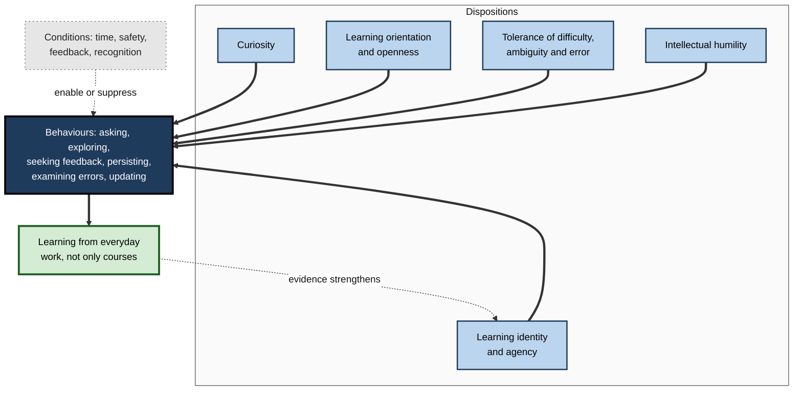
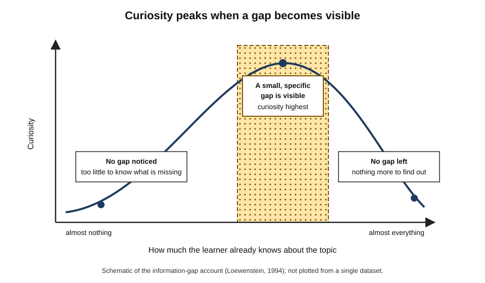
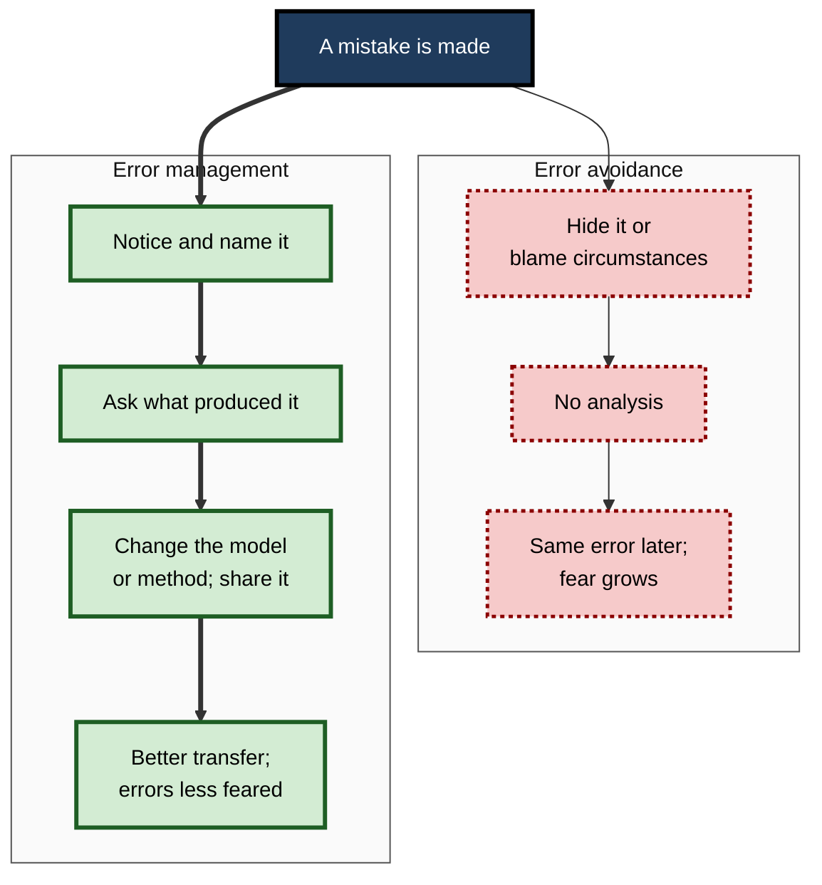
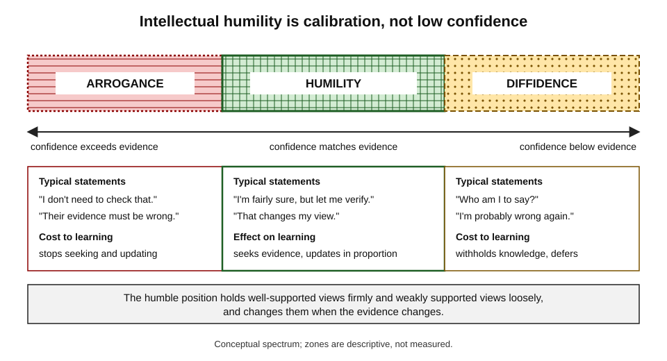
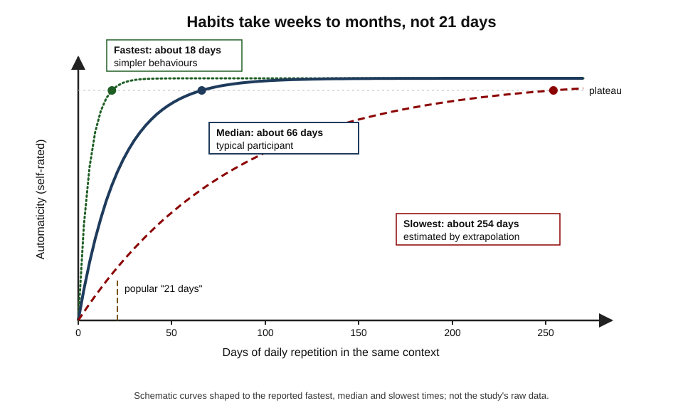
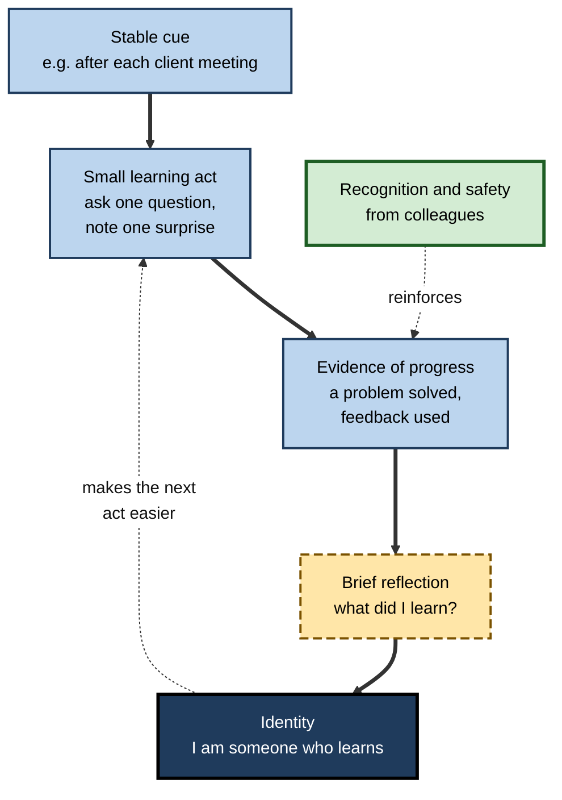
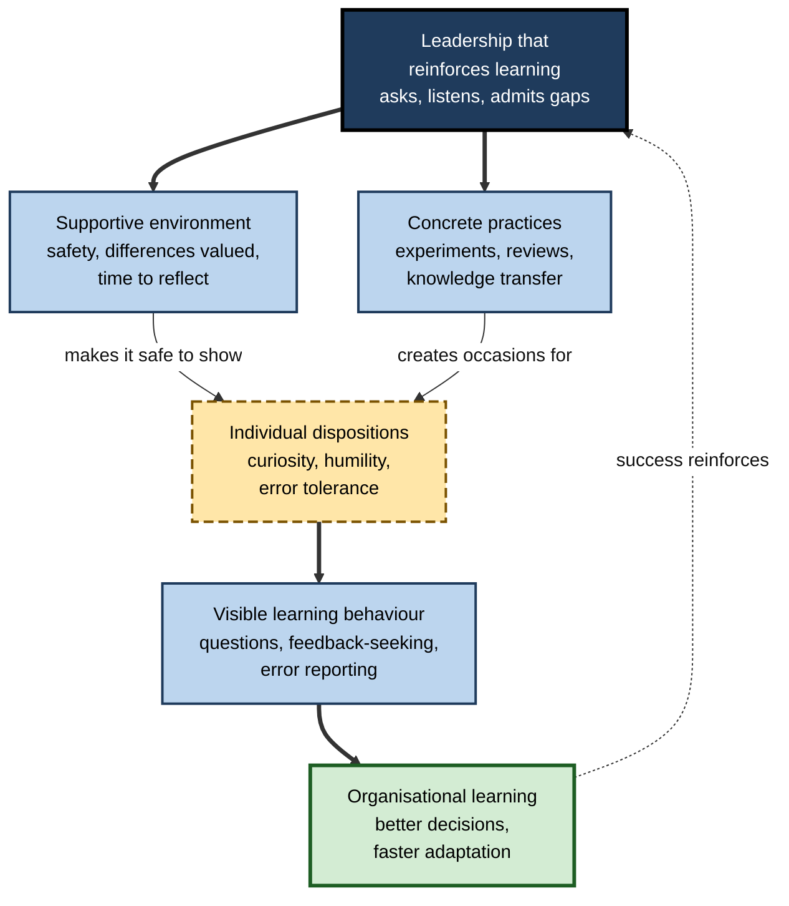

# A.9. Building a Learning Mindset

A hospital introduces an AI tool that flags suspicious chest X-rays. One radiographer asks how it was trained and where it fails, and logs every case where she and the tool disagree; another waits for formal training, privately fearing he will look slow.

Six months later the first is the department's reference point for the tool's blind spots; the second uses it as instructed and nothing more. Neither is cleverer. They differ in habits of mind that make one person learn **by default** and the other only **on request**.

> **Definition — Learning mindset:** a cluster of relatively stable dispositions — curiosity, an orientation towards improving rather than proving, openness to feedback, tolerance of difficulty and error, intellectual humility and an identity as a learner — that lead a person to seek out, persist in and benefit from learning without being required to.

**Why it matters**

- Much of what a professional will need to know in five years does not yet exist in any course; it must be learned **on the job, unprompted**.
- Dispositions decide whether available learning opportunities — feedback, mistakes, new tools, unfamiliar colleagues — are **noticed and used**.
- The same course yields very different results for people with different dispositions.
- Dispositions can be **built** — mainly through repeated behaviour in supportive conditions — rather than simply possessed.

---

## What a Learning Mindset Is

### Dispositions, not just beliefs or skills

> **Definition — Disposition:** a tendency to behave in a particular way across situations, combining the *ability* to do something, the *inclination* to do it and the *sensitivity* to notice when it is called for.

**David Perkins, Eileen Jay and Shari Tishman (1993): the triadic view of dispositions**

- **Ability** — the capacity to do it (e.g. knowing how to ask a probing question).
- **Inclination** — the motivation to do it (wanting to understand, not just to finish).
- **Sensitivity** — noticing the occasion (recognising that *this* meeting is a chance to learn).
- **Finding from their later research:** sensitivity is often the bottleneck — people able and willing to think carefully frequently fail to **notice** that a situation calls for it.

> **Key point:** a learning mindset is not mainly about knowing how to learn; it is about **noticing** learning opportunities and **wanting** to take them.

- A related but narrower idea — the **growth mindset**, the belief that ability can be developed — is one ingredient; it says what is possible, not whether a person will notice, want and persist.

### The six dispositions

| Disposition | Question the learner habitually asks | Visible behaviour | Its opposite |
|---|---|---|---|
| **Curiosity** | "How does this work? Why?" | Explores beyond the brief; asks questions | Incuriosity: "Just tell me what to do" |
| **Learning orientation** | "How can I get better at this?" | Chooses stretch; seeks feedback | Proving or avoiding: "How do I look?" |
| **Openness** | "What can I learn from this view or this feedback?" | Listens to criticism; tries unfamiliar approaches | Defensiveness; preference for the familiar |
| **Tolerance of difficulty, ambiguity and error** | "What is this struggle or mistake telling me?" | Stays with hard problems; examines errors | Avoidance; hiding mistakes |
| **Intellectual humility** | "Could I be wrong? What would change my mind?" | Says "I don't know"; updates on evidence | Arrogance or diffidence |
| **Learning identity and agency** | "Am I someone who learns? What will I learn next?" | Sets own learning goals; learns without being sent | "I'm not a learner"; waits to be trained |

> **Mnemonic — "COTIL — Curious Owls Tolerate Ignorance Lightly":** Curiosity, Orientation to learning and Openness, Tolerance of difficulty, Intellectual humility, Learning identity.

**Figure 1.** The dispositions of a learning mindset and the behaviours they produce.

---

## Curiosity

### Kinds of curiosity

> **Definition — Curiosity:** the desire to acquire new information or understanding, experienced as a pull towards the unknown.

- **Daniel Berlyne (1950s–1960s)** distinguished:
  - **perceptual curiosity** — drawn by novel sights and sounds;
  - **epistemic curiosity** — the desire for knowledge;
  - **diversive curiosity** — seeking stimulation to relieve boredom (scrolling, browsing);
  - **specific curiosity** — seeking a particular missing piece of information.
- **For learning, specific epistemic curiosity matters most:** the itch to resolve a particular question.
- **Todd Kashdan and colleagues (2018)** described five dimensions in adults:
  - **joyous exploration** — pleasure in new knowledge;
  - **deprivation sensitivity** — discomfort at not knowing, driving problem-solving;
  - **stress tolerance** — willingness to cope with the anxiety of novelty;
  - **social curiosity** — interest in what other people think and do;
  - **thrill seeking** — willingness to take risks for new experience.

> **Definition — Need for cognition (John Cacioppo and Richard Petty, 1982):** a stable tendency to engage in and enjoy effortful thinking.

- **Need for cognition is curiosity's working partner:** curiosity opens a question; need for cognition keeps the learner thinking long enough to answer it well.
- **What people high in need for cognition tend to do** (from Cacioppo and colleagues' 1996 review of the research):
  - seek out and think about information rather than rely on shortcuts;
  - remember more of the arguments they meet;
  - judge messages by the **quality of the argument** rather than by cues such as the speaker's status.
- **It is related to intelligence but far from identical to it:** many able people simply prefer not to think hard when they do not have to.

> **Example:** two analysts receive the same vendor report. One reads the summary slide and adopts its recommendation; the other opens the appendix to see how the sample was drawn. The second is showing need for cognition, and she will be the one who notices the sample excludes the client's largest market.

### The information-gap account

- **George Loewenstein (1994):** curiosity arises when attention is drawn to a **gap** between what one knows and what one wants to know.
- **Consequences:**
  - with **no knowledge**, no gap is noticed — no curiosity;
  - with **some knowledge**, a specific gap becomes visible — curiosity peaks;
  - with **complete knowledge**, there is no gap left.
- **Curiosity is therefore partly a product of knowledge**: knowing a little about a field makes its open questions visible.

**Figure 2.** How curiosity varies with what the learner already knows.

### Curiosity and memory

**Study card — Gruber, Gelman and Ranganath (2014)**

- **Design:** participants rated their curiosity about the answers to trivia questions; while waiting for each answer, they saw an unrelated face.
- **Results:**
  - answers to high-curiosity questions were remembered better, including after a day;
  - unrelated faces shown during high-curiosity states were **also** remembered better;
  - brain imaging showed heightened activity in reward-related midbrain regions and the hippocampus during curious anticipation.
- **Conclusion:** curiosity appears to put the brain into a state that favours learning in general, not only learning of the answer sought.

- **Sophie von Stumm, Benedikt Hell and Tomas Chamorro-Premuzic (2011)**, in a meta-analysis titled "The hungry mind", found that **intellectual curiosity** predicted academic performance beyond intelligence, and that together with conscientious effort its contribution was comparable to that of intelligence.

### Cultivating curiosity

- **Pose the question before the answer.** Making the gap explicit creates the pull to close it.
- **Predict before checking.** "What do I expect this data to show?" turns a fact into an answer to one's own question.
- **Notice anomalies.** Treat surprise — "that's odd" — as a signal, not an irritation.
- **Learn enough to see the gaps.** A brief overview of a new field makes its interesting questions visible.
- **Follow one tangent a week.** Deliberately allow some exploration beyond immediate needs.

> **In practice:** in incident reviews, strong engineering teams ask "what surprised us?" before "what went wrong?" — an explicit invitation to curiosity that surfaces gaps in the team's mental model.

> **Watch out:** **diversive** curiosity — endless browsing, news and feeds — can feel like learning while building little. The test is whether a specific question was pursued to an answer.

---

## Learning Orientation and Openness

### Goal orientation

> **Definition — Goal orientation:** a person's characteristic aim in achievement situations — to develop competence, to demonstrate it, or to avoid appearing incompetent.

**Don VandeWalle (1997)** distinguished three workplace orientations:

| | Learning orientation | Prove (performance-approach) orientation | Avoid (performance-avoid) orientation |
|---|---|---|---|
| Aim | Develop competence | Demonstrate competence, gain favourable judgements | Avoid looking incompetent |
| Preferred tasks | Challenging, new | Ones where success is likely and visible | Safe, familiar |
| View of feedback | Useful information | Useful if favourable | Threatening |
| Typical relation to learning | Positive | Mixed | Negative |

- **Payne, Youngcourt and Beaubien (2007)**, a meta-analysis of workplace studies: learning orientation was associated with higher self-efficacy, more feedback-seeking, more learning and better job performance; avoid orientation with poorer outcomes. Effects were modest but consistent.

### Openness to experience and to feedback

- **Openness to experience**, one of the Big Five personality traits, predicts proficiency in **training** — Murray Barrick and Michael Mount's 1991 meta-analysis found it among the clearer predictors of training success.
- **Feedback-seeking** — Susan Ashford and Larry Cummings (1983) described two ways people get feedback:
  - **inquiry** — asking directly;
  - **monitoring** — watching how others respond.
- People with a learning orientation seek more feedback by inquiry; those with an avoid orientation rely more on monitoring and avoid asking.

**Study card — Kluger and DeNisi (1996)**

- **Design:** meta-analysis of hundreds of comparisons of feedback interventions on performance.
- **Results:**
  - on average, feedback improved performance (about 0.4 standard deviations);
  - but in **more than a third** of comparisons, feedback **lowered** performance;
  - feedback was most likely to harm when it directed attention to the **self** ("you are…") rather than to the **task** ("this section…").
- **Conclusion:** feedback is powerful but double-edged; how it is received and where it directs attention decide its effect.

**Receiving feedback well — three triggers (Douglas Stone and Sheila Heen, 2014)**

- **Truth trigger** — "That's wrong." Response: first understand what is meant and what it is based on.
- **Relationship trigger** — "Who are *you* to say that?" Response: separate the message from the messenger.
- **Identity trigger** — "This means I'm a failure." Response: keep the feedback in proportion to one piece of work.

> **Remember — receiving feedback:** **thank, clarify, consider, decide.** Understanding feedback is not the same as agreeing with it.

---

## Tolerance of Difficulty, Ambiguity and Error

### Difficulty

- Learning that lasts often **feels** harder than learning that fades; a learner who reads struggle as failure will abandon the most effective methods.
- **Tolerance of difficulty** means interpreting effortful struggle as a normal part of learning, not as a signal to stop.

> **Example:** a junior lawyer drafting her first share-purchase agreement takes three days and is covered in comments. A learner intolerant of difficulty concludes she is unsuited to corporate work; a tolerant one reads the comments as the curriculum.

### Ambiguity

> **Definition — Tolerance of ambiguity:** the tendency to experience ambiguous situations — novel, complex or with no clear answer — as acceptable or even interesting rather than threatening (Else Frenkel-Brunswik, 1949; Stanley Budner, 1962).

- Low tolerance shows as premature closure: grabbing the first answer, demanding rules where judgement is needed.
- Professional learning is full of ambiguity: unclear requirements, conflicting expert views, new fields without textbooks.
- **Building it:**
  - name the uncertainty explicitly ("we don't yet know X");
  - hold two hypotheses rather than one;
  - set a time to decide instead of forcing early certainty.

### Error

> **Definition — Error management:** an approach that accepts errors as inevitable and informative, aiming to detect, analyse and learn from them rather than only to prevent them.

**Study card — Keith and Frese (2008)**

- **Design:** meta-analysis of studies comparing **error management training** — learners encouraged to make and explore errors, told that errors are useful — with **error-avoidant** training that guided learners to avoid mistakes.
- **Results:**
  - error management training produced better performance after training, with a moderate average advantage (about 0.44 standard deviations);
  - the advantage was larger for **transfer to novel tasks** than for tasks like those practised.
- **Conclusion:** treating errors as information builds more adaptable skill.

| | Error-avoidant response | Error-management response |
|---|---|---|
| First reaction | Shame, concealment | Notice, name, report |
| Explanation sought | Who is to blame? | What in the situation or my understanding produced it? |
| Use of the error | None, or punishment | Analysed, shared, used to improve |
| Effect on learning | Lost information, repeated errors | Improved models and transfer |
| Climate it needs | — | Low fear of blame; time to review |

**Figure 3.** Two responses to the same mistake.

- **Organisations:** Cathy van Dyck, Michael Frese and colleagues (2005) found that firms with stronger **error management cultures** tended to perform better. Amy Edmondson distinguishes **intelligent failures** — in new territory, in pursuit of a goal, as small as possible, quickly learned from — from preventable failures in routine work.

> **Watch out:** tolerance of error is not tolerance of carelessness. In safety-critical routines — dispensing drugs, releasing payments — the goal remains prevention; the learning disposition shows in how near misses and errors are **reported and analysed**.

> **Watch out:** **grit** — passion and perseverance for long-term goals (Angela Duckworth, 2007) — was widely promoted as a key to learning. A 2017 meta-analysis by Marcus Credé and colleagues found grit overlapped heavily with conscientiousness and predicted performance only modestly, with the perseverance component doing most of the work. Persistence matters; "grit" as a distinct, trainable trait is **contested**.

---

## Intellectual Humility and Beliefs about Knowledge

### Intellectual humility

> **Definition — Intellectual humility:** recognising that one's beliefs might be wrong and being appropriately attentive to the limits of one's knowledge and the evidence for one's views.

- **Not low confidence:** intellectual humility is **calibration** — confidence in proportion to the evidence.
- **Two failure modes:**
  - **arrogance** — more confidence than the evidence supports;
  - **diffidence** — less confidence than the evidence supports, so useful knowledge is withheld.

**Figure 4.** Intellectual humility as calibrated confidence.

**Study card — Leary and colleagues (2017)**

- **Design:** a series of studies measuring intellectual humility and examining how people evaluated arguments and people with other views.
- **Results:** people higher in intellectual humility were better at distinguishing **strong from weak arguments**, more attentive to the quality of evidence, and less harsh in judging people who changed their minds.
- **Conclusion:** humility goes with better evidence evaluation, not with indecision.

- **Professional evidence — forecasting:** in a multi-year US-government-funded forecasting tournament from 2011, the best performers ("superforecasters" in the work of Philip Tetlock and colleagues) scored high on **actively open-minded thinking** and updated their forecasts frequently, in small steps, as evidence arrived.
- **Measurement caveat:** research on intellectual humility has grown rapidly since the mid-2010s; measures are mostly self-report, and evidence that it can be **trained** durably is still limited.

> **In practice:** two habits that express humility — stating a confidence level ("about 70% sure") instead of a bare assertion, and naming in advance what evidence would change one's mind.

### Beliefs about knowledge

> **Definition — Epistemic beliefs:** a person's beliefs about the nature of knowledge and knowing — how certain, simple, quick to acquire and authority-given knowledge is.

- **William Perry (1970)** followed Harvard undergraduates and described a progression:
  - **dualism** — knowledge is right or wrong, handed down by authorities;
  - **multiplicity** — where answers are unknown, every opinion is equally valid;
  - **relativism** — knowledge is contextual; views are judged by evidence and reasoning;
  - **commitment within relativism** — taking reasoned positions while remaining open to revision.
- **Marlene Schommer (1990)** found that students who believed learning is **quick** (understood immediately or not at all) drew oversimplified conclusions and overestimated their comprehension; those who believed knowledge is **certain** drew inappropriately absolute conclusions.

| Belief dimension | Naive version | Sophisticated version | Effect on learning |
|---|---|---|---|
| Certainty | Knowledge is fixed and absolute | Knowledge is tentative and evolving | Naive → absolute conclusions; resists revision |
| Simplicity | Knowledge is isolated facts | Knowledge is interconnected concepts | Naive → memorising, poor integration |
| Speed of learning | Learning is quick or not at all | Learning takes time and effort | Naive → giving up early, overconfidence |
| Source | Authorities hand knowledge down | Knowledge is built by evidence and reasoning | Naive → no evaluation of claims |

> **Key point:** a learner who believes good learners "get it straight away" will interpret every slow start as failure — a belief about **knowledge** acting as a block to **learning**.

---

## Learning Identity and Agency

### Identity

- **Identity-based motivation (Daphna Oyserman):** people act in ways that feel congruent with who they are. When a learning goal feels identity-congruent, difficulty is read as a sign the goal is **important**; when it feels incongruent, the same difficulty is read as a sign it is **impossible** ("people like me don't do this").
- **Possible selves (Hazel Markus and Paula Nurius, 1986):** vivid images of who one might become — a hoped-for "data-literate manager", a feared "obsolete specialist" — direct effort when linked to concrete strategies.
- **Learning identity:** seeing oneself as a learner — someone who learns as part of who they are — rather than as someone who has finished learning.

> **Definition — Learning identity:** the extent to which a person sees learning as part of who they are, rather than as an activity imposed from outside.

### Learner self-efficacy

> **Definition — Self-efficacy (Albert Bandura, 1977):** a person's belief that they can carry out a *specific* task or course of action successfully.

- **Learner self-efficacy** is the narrower belief "I can learn this", as distinct from "I can already do this". It is the bridge between identity and action: a person may value learning yet avoid a new field because they doubt they could master it.
- **It is task-specific:** a lawyer may be highly confident about learning case law and not at all about learning statistics. General self-esteem is a different construct and predicts learning far less well.
- **Where it comes from:** mainly from **mastery experiences**, meaning successes the learner can attribute to their own effort. Seeing similar people succeed, encouragement, and how the learner reads their own anxiety contribute less.
- **Bandura's (1997) account of agency:** people with stronger efficacy beliefs set higher goals, persist longer and recover faster from setbacks, which helps explain why a learning disposition tends to compound over a career.

> **Watch out:** the claim that self-efficacy **causes** better performance is less secure than it looks. Across people, efficacy and performance are clearly correlated. But when the same person is followed over time, much of the link reflects past performance raising efficacy (a meta-analysis by Traci Sitzmann and Gillian Yeo, 2013). Some experiments by Jeffrey Vancouver and colleagues even found that higher efficacy on a task reduced effort on it. Self-efficacy matters, but mainly as something built by **evidence of progress**, not by pep talks.

### Agency and self-direction

- **Self-directed learning (Malcolm Knowles, 1975):** learners diagnose their own needs, set goals, find resources, choose strategies and evaluate outcomes.
- **Allen Tough (1971)** found that most adults he interviewed carried out several deliberate **learning projects** each year, most of them self-planned rather than in courses.
- **Agency** grows from experiences of having learned something by one's own initiative — each success makes the next attempt more likely.

### Habits as the carriers of dispositions

- Dispositions show up as **repeated behaviours**; repeated behaviours become **habits** — actions triggered automatically by context cues.

**Study card — Lally, van Jaarsveld, Potts and Wardle (2010)**

- **Design:** volunteers chose a new daily eating, drinking or exercise behaviour tied to a daily cue and rated its automaticity each day for twelve weeks.
- **Results:**
  - automaticity rose steeply at first, then levelled off;
  - time to reach the plateau ranged from about **18 to 254 days** (the longest estimated by extrapolation), with a median of about **66 days**;
  - missing a single day did not materially derail habit formation.
- **Conclusion:** the popular "21 days" is not supported; plan for **months**, and protect the consistency of the cue.

**Figure 5.** How long new habits take to become automatic.

**Figure 6.** How repeated learning behaviours build a learning identity.

> **Key point:** identity follows behaviour at least as much as behaviour follows identity. Each small, repeated act is a **vote** for the kind of learner one is becoming.

---

## Building the Dispositions

### A behaviour-first method

Attitudes are hard to change by intention; behaviours are easier, and repeated behaviours reshape attitudes.

1. **Choose one disposition** to strengthen — e.g. openness to feedback.
2. **Define it as a small, observable behaviour** — "after every significant deliverable, ask one person: what is one thing that would have made this better?"
3. **Attach it to a stable cue** — the moment a deliverable is sent.
4. **Make the occasion visible** — sensitivity is the usual bottleneck, so write the cue where it will be seen.
5. **Collect evidence** — a short log of what was asked, what was learned, what changed.
6. **Reflect monthly** — what improved; what to adjust.
7. **Recruit the environment** — tell a colleague or manager; ask them to respond well when asked.

> **Remember — disposition = ability + inclination + sensitivity:** most people can and would; they fail to **notice** the moment. Design the cue first.

### Worked example: a finance controller facing automation

- **Situation:** a 45-year-old financial controller sees reporting work being automated. He feels his expertise is becoming obsolete and avoids the new tools.

| Disposition | Before | Behaviour introduced | After six months |
|---|---|---|---|
| Curiosity | "Just tell me what the system produces" | Writes one question a week about how the automated reports are built, and pursues it | Understands the data pipeline well enough to spot two mapping errors |
| Learning orientation | Avoids tasks where he might look slow | Volunteers to pilot the new tool on last month's data | Becomes the finance team's tool lead |
| Openness to feedback | Waits for the annual review | Asks the data team for one improvement after each joint task | Joint work faster; fewer reworks |
| Tolerance of error | Hides spreadsheet errors | Keeps an error log; shares one lesson per month with the team | Team adopts the log |
| Intellectual humility | "I've done this for twenty years" | Adds a confidence level to forecasts | Forecast discussions shorter and more candid |
| Learning identity | "I'm not a tech person" | Notes each new capability gained | "I'm someone who learns the new systems" |

- **Reasoning:**
  1. each disposition was turned into one small behaviour with a cue;
  2. behaviours generated **evidence**, which shifted beliefs and identity;
  3. the environment (the data team's responses) reinforced the changes.
- **Conclusion:** the controller's expertise was not obsolete; his **dispositions** were preventing it from being updated.

> **Watch out:** trying to change all six dispositions at once usually changes none. Start with one behaviour, sustain it for months, then add another.

---

## Learning Mindset at Work

### Learning agility

> **Definition — Learning agility:** the ability and willingness to learn from experience and apply it in new situations; popular in talent management for identifying leadership potential (Michael Lombardo and Robert Eichinger, 2000).

**Where the term came from**

- **Center for Creative Leadership, 1980s:** Morgan McCall, Michael Lombardo and Ann Morrison studied what successful executives learned from key experiences (*The Lessons of Experience*, 1988).
  - Executives who **derailed** often had the same experiences as those who succeeded but **learned less** from them.
- **Lombardo and Eichinger (2000):** turned the idea into "learning agility" and a commercial assessment for spotting high-potential employees.
- The term then spread rapidly through talent-management practice — **faster than the research behind it**.

**Why it is a contested construct**

- **Definitional drift** — used variously for an ability, a set of behaviours, a personality profile and an outcome (fast learning on the job).
- **Overlap** — much of what it measures appears already captured by **openness to experience**, **general mental ability** and **goal orientation**; its added predictive value beyond these is unclear.
- **Circularity** — "agile learners learn well from experience" risks defining the trait by the result it is meant to predict.
- **Measurement** — many instruments are proprietary, and much of the validity evidence rests on ratings by the same managers who judge potential.
- **Critique:** D. Scott DeRue, Susan Ashford and Christopher Myers (2012) argued that the construct mixed ability, behaviour and outcomes, and proposed a narrower definition: the **speed and flexibility** with which a person learns from experience.

> **Watch out:** learning agility is a useful *conversation* about how people learn from experience, but it is **not a well-established psychological construct**. Treat learning-agility scores as rough descriptions — never as the sole basis for selection or promotion decisions.

### Organisational learning culture

Individual dispositions flourish or wither depending on the culture around them. An organisation can make curiosity, error-reporting and feedback-seeking either normal or dangerous.

> **Definition — Learning organisation:** an organisation skilled at creating, acquiring and transferring knowledge, and at changing its behaviour to reflect new knowledge and insight (David Garvin, 1993).

**Peter Senge's five disciplines (*The Fifth Discipline*, 1990)**

- **Personal mastery** — individuals continually clarifying what they want and developing the capacity to achieve it.
- **Mental models** — surfacing and testing the deep assumptions that shape decisions.
- **Shared vision** — a common picture of the future that people commit to rather than merely comply with.
- **Team learning** — dialogue in which a group thinks together rather than defending positions.
- **Systems thinking** — the "fifth discipline" that integrates the others: seeing feedback loops, delays and whole patterns rather than isolated events.

> **Mnemonic — "People Make Shared Teams Smarter":** Personal mastery, Mental models, Shared vision, Team learning, Systems thinking.

**Study card — Amy Edmondson on psychological safety (1996, 1999)**

- **1996, hospital units:** in a study of medication errors, the better-led, better-functioning units **reported more errors** — not because they made more, but because staff felt safe to report them.
- **1999, 51 work teams in a manufacturing company:** teams with higher **psychological safety** engaged in more **learning behaviour** — asking for help, seeking feedback, discussing errors, experimenting — and learning behaviour in turn predicted team performance.
- **Lesson:** a team's willingness to learn in public is shaped less by individual personality than by the **interpersonal climate**.

> **Definition — Psychological safety:** a shared belief that a team is safe for interpersonal risk-taking, such as asking questions, admitting mistakes and voicing dissent.

**Garvin, Edmondson and Gino (2008): three building blocks of a learning organisation**

1. **A supportive learning environment**
   - psychological safety;
   - appreciation of differences;
   - openness to new ideas;
   - time for reflection.
2. **Concrete learning processes and practices**
   - experimentation;
   - information collection and analysis;
   - education and training;
   - transfer of knowledge across units, e.g. after-action reviews.
3. **Leadership that reinforces learning**
   - leaders who ask questions, listen, invite dissent and model admitting what they do not know.

**Figure 7.** The three building blocks of a learning organisation and how they sustain individual learning dispositions.

| | Blame culture | Learning culture |
|---|---|---|
| First question after a failure | "Who is responsible?" | "What happened, and what can we learn?" |
| What staff do with errors | Hide them or quietly fix them | Report them early |
| Questions from juniors | Seen as weakness | Expected and welcomed |
| Leaders' own mistakes | Rarely mentioned | Shared openly, often first |
| Reviews | Assign fault | Examine systems and decisions; blameless format |
| Typical result | The same failures recur | Problems surface while still small |

> **Watch out:** Google's internal study of team effectiveness, known as **Project Aristotle**, is often cited as proof that psychological safety is the top predictor of team success. Its conclusions were shared in the company's own publications and in press coverage, **not in peer-reviewed research**, and its data and methods have not been independently examined. The peer-reviewed evidence for psychological safety comes mainly from Edmondson's work and the large literature that followed it.

> **In practice:** to build a learning culture, change **routines** before slogans — blameless reviews, leaders admitting their own errors first, protected reflection time, and recognition for knowledge shared rather than only for results.

### Conditions that let dispositions show

- **Psychological safety** — dispositions such as asking questions and admitting error are suppressed in teams where they carry interpersonal risk.
- **Time** — protected time for exploration, review and learning that managers actually defend.
- **Error management** — blameless reviews; leaders share their own mistakes.
- **Recognition** — praise and promotion for learning, teaching and experimenting, not only for results.
- **Feedback norms** — frequent, specific, task-focused feedback.

### Measuring learning dispositions through behaviour

- Self-report questionnaires about "openness to learning" are easily inflated; behavioural indicators are harder to fake:
  - frequency of feedback requests;
  - questions asked in reviews and meetings;
  - post-incident reviews held and lessons recorded;
  - internal teaching and knowledge-sharing;
  - speed of meaningful adoption of new tools;
  - voluntary moves into unfamiliar work.

### Case study: a radiology department and an AI triage tool

- **Situation:** a regional hospital's radiology department adopted an AI tool that prioritised chest X-rays for review.
- **Problem after three months:**
  - some staff ignored the tool; others accepted its flags uncritically;
  - disagreements between radiographers and the tool were not recorded;
  - junior staff did not ask questions in meetings.
- **Diagnosis:** the dispositions the situation needed — curiosity about the tool's failure modes, humility about both human and machine judgement, error reporting — were neither expected nor rewarded.
- **Actions:**
  1. a fortnightly 30-minute "disagreement round": staff presented cases where they and the tool differed, with no blame attached;
  2. a shared log of disagreements, with outcome checked later;
  3. consultants presented their own misses first;
  4. each reviewer recorded a confidence level for flagged cases;
  5. appraisal conversations asked "what have you learned about the tool's limits?"
- **Result:** within two quarters, the log identified two image types the tool handled poorly; staff could explain when to trust and when to override it; junior staff contributed more cases.
- **Caveats:** no comparison department; benefits depended on consultants' sustained involvement.
- **Lesson:** dispositions become visible when the **routine creates the occasion** and the **culture rewards** the behaviour.

### The learning mindset in the AI era

- **Curiosity about the tool, not just its output:** how was it built, where does it fail?
- **Humility in both directions:** doubt unaided judgement *and* the model's confident output; check.
- **Tolerance of error:** treat disagreements with the tool as learning material.
- **Learning identity:** keep some work unaided, so one's own capability keeps growing alongside the tool's.

---

## Open Questions

- **How stable are learning dispositions?**
  - Curiosity, openness and humility look partly trait-like and partly situational; how much each can change in adulthood is not well established.
- **Can intellectual humility be trained?**
  - Correlational findings are encouraging; durable effects of training are not yet demonstrated.
- **How should dispositions be measured?**
  - Self-reports are easy to inflate; behavioural measures are costly and context-bound.
- **Do the dispositions form one construct or several?**
  - Curiosity, openness, learning orientation and humility overlap; whether "learning mindset" is a useful single construct is debated.
- **How do AI tools change the dispositions needed?**
  - Calibrated trust in tools and curiosity about their failure modes may become central; evidence is just beginning.

---

## Summary

- A **learning mindset** is a cluster of **dispositions** that make learning the default: curiosity, learning orientation and openness, tolerance of difficulty, ambiguity and error, intellectual humility, and learning identity and agency.
- Dispositions combine **ability, inclination and sensitivity** (Perkins, Jay and Tishman); **noticing** the occasion is often the bottleneck.
- **Curiosity:** specific epistemic curiosity drives learning; the **information-gap** account explains why some knowledge increases curiosity; curiosity enhances memory (Gruber et al., 2014) and predicts performance beyond intelligence.
- **Goal orientation:** learning orientation links to feedback-seeking and learning; avoid orientation to poorer outcomes. **Feedback** helps on average but harms in over a third of cases, especially when it targets the self (Kluger and DeNisi).
- **Tolerance:** of difficulty, of **ambiguity** and of **error** — error management training improves transfer (Keith and Frese). Grit's distinctness is contested.
- **Intellectual humility** is calibration, not low confidence; it accompanies better evidence evaluation. **Epistemic beliefs** — certainty, simplicity, speed, source — shape how learners interpret difficulty.
- **Identity** shapes whether difficulty means importance or impossibility; **habits** carry dispositions, taking about **two months** (median) to form.
- Build dispositions **behaviour-first**: one small behaviour, a stable cue, evidence, reflection and a supportive environment; measure through behaviour.
- **Learning agility** is popular in talent management but a **contested construct**: definitional drift, overlap with openness and general ability, and proprietary measurement.
- **Organisational culture** decides whether dispositions show: Senge's five disciplines; Edmondson's evidence that **psychological safety** enables team learning behaviour; Garvin, Edmondson and Gino's three building blocks — a supportive environment, concrete practices and reinforcing leadership.

---

## Self-Check

1. Define a learning mindset and name its six dispositions.
2. What are the three components of a disposition in the triadic view, and which is often the bottleneck?
3. How does a learning mindset differ from a growth mindset?
4. Distinguish diversive from specific curiosity and explain which matters more for learning.
5. Explain the information-gap account of curiosity and one practical implication.
6. What did Gruber, Gelman and Ranganath (2014) find?
7. Compare learning, prove and avoid goal orientations.
8. What did Kluger and DeNisi (1996) find about feedback, and what does it imply for receiving it?
9. What is error management training, and what did Keith and Frese (2008) find?
10. Why is intellectual humility not the same as low confidence? Give two behaviours that express it.
11. Describe Perry's progression of epistemic development and one of Schommer's findings.
12. What did Lally and colleagues (2010) find about habit formation?
13. A capable analyst refuses to use a new analytics platform: "I've always done it in spreadsheets." Which dispositions are involved, and how would you help?
14. A firm wants to "measure learning mindset" with a self-report survey. Advise them.
15. Why is learning agility described as a contested construct? How should its scores be used?
16. What did Edmondson's 1996 hospital study and 1999 team study show, and what are Garvin, Edmondson and Gino's three building blocks of a learning organisation?

### Answer Key

1. A cluster of dispositions that lead a person to seek out, persist in and benefit from learning without being required to: curiosity; learning orientation and openness; tolerance of difficulty, ambiguity and error; intellectual humility; learning identity and agency.
2. Ability, inclination and sensitivity. Sensitivity — noticing that a situation calls for the behaviour — is often the bottleneck.
3. A growth mindset is one belief: that ability can be developed. A learning mindset is a broader set of dispositions that determine whether a person notices, wants and pursues learning, and how they handle difficulty, error, feedback and uncertainty.
4. Diversive curiosity seeks stimulation to relieve boredom; specific curiosity seeks a particular missing piece of knowledge. Specific epistemic curiosity drives learning; diversive browsing feels like learning but builds little.
5. Curiosity arises from noticing a gap between what one knows and wants to know; it peaks with partial knowledge. Implication: pose questions or predictions before answers, and learn enough of a field to see its gaps.
6. Curiosity about trivia answers improved memory for those answers and for unrelated faces shown during curious states, even a day later, with reward-related and hippocampal activity.
7. Learning: develop competence, seek challenge, value feedback — positive for learning. Prove: demonstrate competence, seek visible success — mixed. Avoid: avoid looking incompetent, prefer safe tasks, find feedback threatening — negative.
8. Feedback improved performance on average but lowered it in over a third of comparisons, especially when aimed at the self rather than the task. When receiving feedback, focus on the task information and manage truth, relationship and identity triggers: thank, clarify, consider, decide.
9. Training that encourages learners to make and explore errors and frames them as useful. It produced better post-training performance than error-avoidant training, with a larger advantage for transfer to novel tasks.
10. It is calibration — confidence matched to evidence; diffidence is as miscalibrated as arrogance. Behaviours: stating confidence levels; naming in advance what evidence would change one's mind; saying "I don't know".
11. Dualism (right/wrong from authority) → multiplicity (all opinions equal) → relativism (judged by evidence) → commitment within relativism. Schommer: belief that learning is quick predicted oversimplified conclusions and overestimated comprehension.
12. Automaticity rose steeply and then plateaued; time to plateau ranged from about 18 to 254 days, median about 66; missing a day did not derail formation; "21 days" is unsupported.
13. Low tolerance of difficulty and error (fear of looking slow), weak learning identity for new tools, perhaps intellectual arrogance about existing methods. Help: a low-stakes pilot on familiar data; one small weekly behaviour (rebuild one report); pair with a colleague; recognise progress; frame his domain expertise as essential for checking the platform's output.
14. Self-reports are easily inflated and weakly related to behaviour. Use behavioural indicators — feedback requests, questions in reviews, lessons recorded, internal teaching, tool adoption, voluntary stretch moves — and examine the conditions (time, safety, recognition) that enable them.
15. Its definition drifts between ability, behaviour, personality and outcome; it overlaps heavily with openness, general mental ability and goal orientation; it risks defining the trait by its outcome; and much validity evidence comes from proprietary instruments and manager ratings. Use scores only as rough descriptions to start a development conversation, never as the sole basis for selection or promotion.
16. In 1996, better-functioning hospital units reported more medication errors because staff felt safe to report them. In 1999, across 51 manufacturing teams, psychological safety predicted learning behaviour, which predicted performance. The three building blocks are a supportive learning environment, concrete learning processes and practices, and leadership that reinforces learning.

---

## Glossary

| Term | Meaning |
|---|---|
| Actively open-minded thinking | Willingness to seek and weigh evidence against one's current views. |
| Automaticity | The degree to which a behaviour occurs without conscious intention. |
| Curiosity | The desire to acquire new information or understanding. |
| Disposition | A tendency combining ability, inclination and sensitivity to act in a certain way. |
| Diversive curiosity | Seeking stimulation to relieve boredom. |
| Epistemic beliefs | Beliefs about the nature of knowledge and knowing. |
| Epistemic curiosity | The desire for knowledge. |
| Error management | Accepting errors as informative and learning from them rather than only preventing them. |
| Feedback-seeking | Actively obtaining information about one's performance, by inquiry or monitoring. |
| Goal orientation | A characteristic aim to develop, demonstrate, or avoid appearing to lack competence. |
| Grit | Passion and perseverance for long-term goals; its distinctness from conscientiousness is contested. |
| Identity-based motivation | The tendency to pursue actions that feel congruent with one's identity. |
| Information-gap account | The idea that curiosity arises from noticing a gap in one's knowledge. |
| Intellectual humility | Recognising that one's beliefs might be wrong and calibrating confidence to evidence. |
| Intelligent failure | A failure in new territory, pursued for a goal, kept small and learned from quickly. |
| Learning agility | The ability and willingness to learn from experience and apply it in new situations; a contested construct. |
| Learning identity | Seeing learning as part of who one is. |
| Learning mindset | A cluster of dispositions that makes learning the default. |
| Learning organisation | An organisation skilled at creating, acquiring and transferring knowledge and at changing its behaviour accordingly. |
| Need for cognition | A tendency to engage in and enjoy effortful thinking. |
| Openness to experience | A Big Five personality trait reflecting receptiveness to new ideas and experiences. |
| Possible selves | Images of who one might become, which can direct effort. |
| Psychological safety | A shared belief that a team is safe for interpersonal risk-taking. |
| Self-directed learning | Learning in which the learner diagnoses needs, sets goals and evaluates outcomes. |
| Self-efficacy | Belief in one's capability to carry out the actions needed to succeed at a specific task. |
| Specific curiosity | Seeking a particular missing piece of information. |
| Systems thinking | Seeing feedback loops, delays and whole patterns rather than isolated events. |
| Tolerance of ambiguity | Experiencing ambiguous situations as acceptable rather than threatening. |
