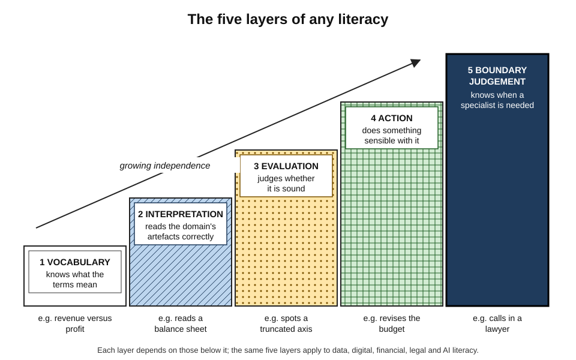
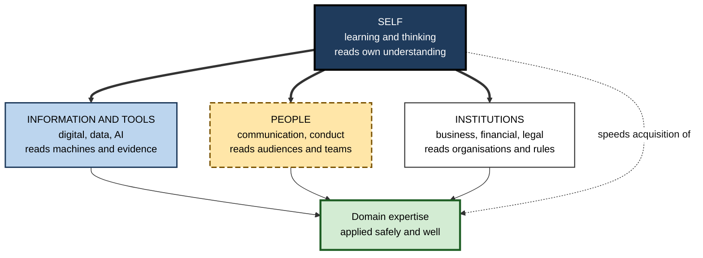
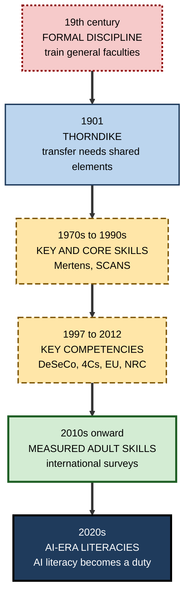
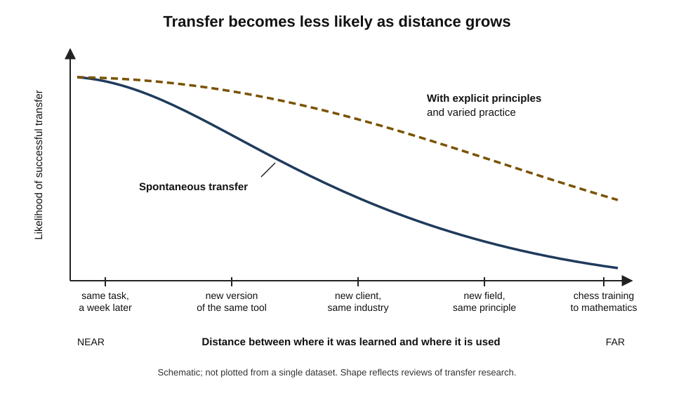
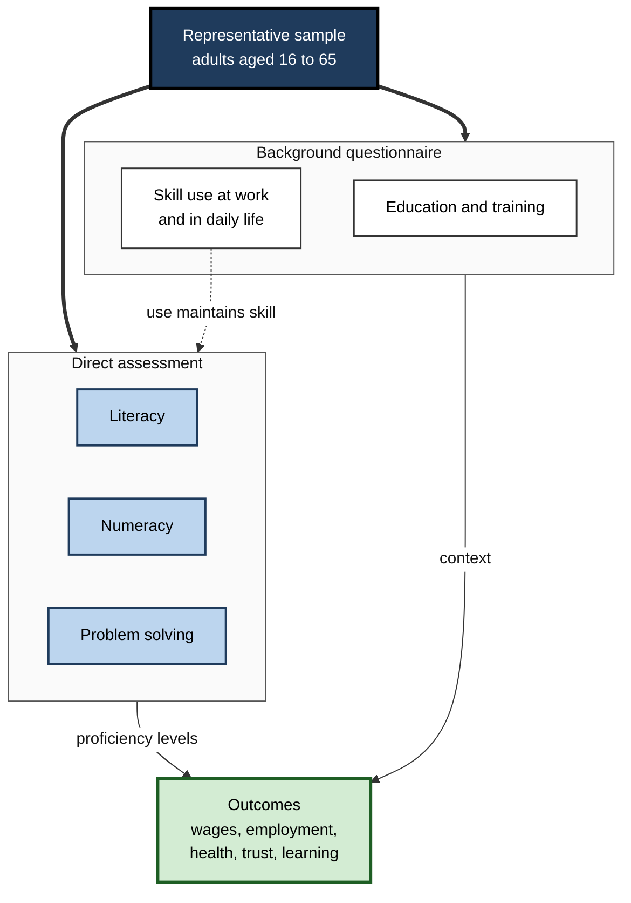
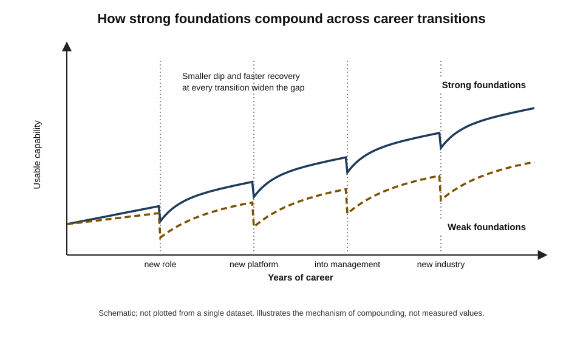
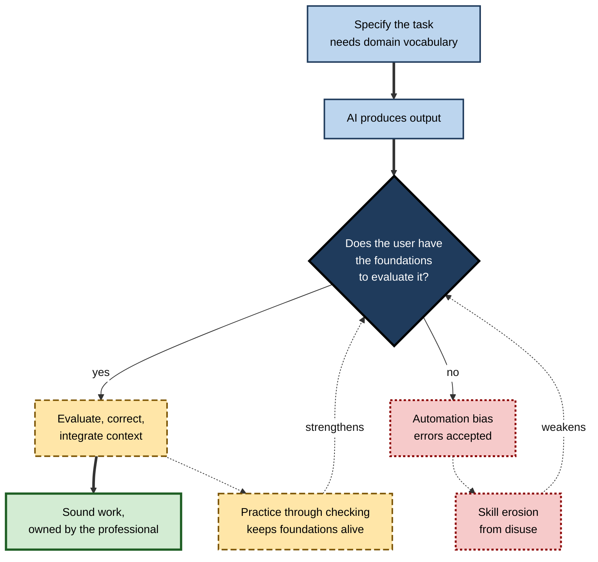

# 1. Universal Foundations

A cardiologist, a software architect and a procurement manager have almost nothing in common technically. Yet in a single week each of them will learn something unfamiliar, read a chart and decide whether to believe it, question an answer produced by an AI tool, explain a recommendation to someone sceptical, weigh a cost against a benefit and check whether a contract clause exposes them to risk. These shared, portable capabilities are what make specialist expertise usable — and their absence quietly limits even brilliant specialists.

> **Definition — Foundational capability:** a capability that is used across most roles and fields, that other, more specialised capabilities depend on, and that keeps its value when a particular job, tool or industry changes.

**Why it matters**

- Foundations decide **how fast** new specialist capability can be acquired — they are the platform every later skill is built on.
- They decide **how safely** expertise is applied: a gifted engineer who cannot read a contract or a statistic is a liability in some decisions.
- They are the part of capability that **survives job changes**, so their value compounds over a long career.
- Large international surveys show that basic adult skills are **less widespread than assumed**, so strong foundations are a genuine differentiator.
- Generative AI raises the stakes: directing and checking machine output depends on the user's own foundational knowledge.

---

## What Makes a Capability Foundational

### Three tests

A capability counts as foundational when it passes three tests at once. Failing any one makes it valuable but not foundational.

- **Breadth — is it used almost everywhere?**
  - Reading complex text, reasoning with numbers and communicating in writing appear in nearly every skilled role.
  - *e.g.* a nurse, a lawyer and a data engineer all write handovers, notes or documentation that others must act on.
- **Enablement — do other capabilities depend on it?**
  - A foundational capability is a **gateway**: without it, specialist learning is slower, shallower or impossible.
  - *e.g.* a weak grasp of proportions and percentages blocks later learning of pricing, dosage, risk and statistics.
- **Durability — does it keep its value as tools change?**
  - Knowledge of a particular software menu decays in months; the ability to evaluate evidence lasts a working life.
  - *e.g.* the spreadsheet package a graduate learned may be replaced, but understanding what a formula does and how errors propagate carries over.

> **Mnemonic — "BED":** Breadth, Enablement, Durability — a foundation is the bed on which specialist capability lies.

> **Definition — Transferable skill:** a skill learned in one setting that can be applied, usually with some adaptation, in other settings, roles or fields.

> **Watch out:** "transferable" does not mean "transfers automatically". Most skills move to a new setting only when the person recognises the similarity and adapts what they know — a point developed below.

### Foundations are not the same as "soft skills"

- **"Soft skills"** is an informal label for interpersonal and personal qualities — teamwork, communication, reliability.
  - The term implies they are easy or secondary; employer evidence suggests the opposite.
- **Foundations** cut across the hard/soft divide.
  - They include technical-seeming capabilities (working with data, digital tools and AI) and human ones (communicating, learning, reasoning).
- **Basic skills** (literacy, numeracy) are the oldest and narrowest layer of foundations.
  - Modern foundations add **critical**, **digital** and **institutional** understanding on top.

| | Foundational capability | Domain expertise |
|---|---|---|
| Where it is used | Across almost all roles | Within one field or role family |
| What it enables | Learning and applying other capabilities | Doing the core work of the field |
| Rate of obsolescence | Slow | Fast in technology fields, slower in law or medicine |
| How it is usually acquired | Schooling, early career, continuous use | Specialist education, supervised practice |
| Typical failure when absent | Expertise that cannot be learned, checked or communicated | Inability to do the work at all |

---

## Literacy as a Way of Thinking About Foundations

### From reading and writing to functional literacy

- **Original meaning:** the ability to read and write.
- **Mid-20th century — functional literacy:** UNESCO and others shifted attention from *whether* a person can decode text to *whether* they can use it to function in their community and work.
  - *e.g.* reading a medicine label correctly, completing a tax form, following written safety procedures.
- **1990s — multiple literacies:** the **New London Group (1996)**, a group of literacy researchers, argued that modern life requires reading many modes — visual, digital, numerical, cultural — not only print.
- **Today:** "literacy" is widely used as shorthand for **working competence in a domain without being a specialist in it** — data literacy, financial literacy, legal literacy, AI literacy.

> **Definition — Functional literacy:** the ability to use reading, writing and calculation well enough to take part effectively in the activities of one's community and work.

> **Definition — Literacy (extended sense):** the capability to understand, interpret, question and act on the information and systems of a domain, at the level a non-specialist needs.

### The anatomy of a literacy

Every literacy, whatever its domain, has the same five layers. They describe what a person can do, from the bottom up.

1. **Vocabulary and concepts** — knowing what the terms mean.
   - *e.g.* knowing the difference between revenue, profit and cash flow.
2. **Interpretation** — reading the domain's artefacts correctly.
   - *e.g.* reading a dashboard, a balance sheet, a privacy notice or a model's output.
3. **Critical evaluation** — judging whether what is read is sound.
   - *e.g.* noticing that a chart's axis starts at 90%, or that an AI-generated citation does not exist.
4. **Appropriate action** — doing something sensible with it.
   - *e.g.* adjusting a budget, raising a data-protection concern, refusing to sign.
5. **Boundary judgement** — knowing when the problem exceeds one's literacy and a specialist is needed.
   - *e.g.* recognising that a clause on intellectual property needs a lawyer, not a web search.

**Figure 1.** The five layers of any literacy.

> **Key point:** the top layer — **boundary judgement** — is what separates a literate non-specialist from a dangerous amateur. Literacy is not a cheap substitute for expertise; it is the ability to work *with* expertise.

| | Literacy | Fluency | Expertise |
|---|---|---|---|
| Typical holder | Every professional | Frequent users of the domain | Specialists |
| Can do | Understand, question, act sensibly, know when to escalate | Use the domain routinely and quickly | Solve novel, high-stakes problems in the domain |
| Example in data | Reads a chart critically, spots a misleading average | Builds analyses and dashboards independently | Designs experiments and statistical models |
| Example in law | Recognises a risky clause, knows when to seek advice | Drafts standard agreements | Advises on disputes and novel questions |
| Main risk | Overconfidence beyond its boundary | Applying routines where they no longer fit | Narrowness, blind spots outside the field |

### A family of literacies

The literacies usually counted as foundational differ in **what they let a person read**. Grouping them this way shows why each exists.

- **Literacies of the self** — learning and thinking.
  - Let a person read their own understanding: what they know, how well, and how to improve it.
  - Learning ability is treated as the master foundation because every other literacy has to be learned.
- **Literacies of information and tools** — digital, data and AI.
  - Let a person read and use the machines and information flows that now mediate most work.
  - AI literacy is the newest member; it combines understanding what AI systems are, using them effectively and recognising their failure modes.
- **Literacies of people** — communication and professional conduct.
  - Let a person read and influence others: audiences, teams, stakeholders.
- **Literacies of institutions** — business, financial and economic, legal and regulatory.
  - Let a person read the systems that organise work: how organisations make money, how money and markets behave, and what rules bind people and firms.

**Figure 2.** Foundational literacies grouped by what they let a professional read.

> **Example — one decision, four literacies:** a product manager deciding whether to launch a feature reads her own uncertainty about user behaviour (self), the A/B-test dashboard (information), the engineering lead's hesitation (people) and the consumer-protection implications of an auto-renewal default (institutions).

---

## The Search for Transferable Skills

### The doctrine of formal discipline and its fall

- **Formal discipline (19th century):** studying Latin, Greek and geometry was thought to train general "faculties" of the mind — memory, reasoning, attention — like exercising a muscle.
- **Thorndike and Woodworth (1901)** tested the idea directly.

**Study card — Thorndike and Woodworth (1901)**

- **Design:** participants practised one narrow judgement — such as estimating the areas of rectangles of certain sizes — until they improved.
- **Test:** they were then tested on related judgements — areas of other shapes and sizes.
- **Results:** improvement on the trained task carried over only weakly to the related tasks.
- **Conclusion:** transfer depends on **identical elements** shared between tasks, not on a strengthened general faculty.

> **Definition — Identical elements theory:** Thorndike's proposal that learning transfers from one task to another only to the extent that the two share common elements.

> **Key point:** the century-long search for transferable skills is, at heart, a search for elements that really are common across many tasks — and for ways of teaching that help people recognise them.

### Frameworks of "key", "core" and "21st-century" skills

From the 1970s governments and international bodies tried to name the skills that every worker and citizen needs.

- **Key qualifications — Dieter Mertens, Germany (1974).**
  - Argued that fast-changing work made specific vocational knowledge age quickly, so training should emphasise broadly usable qualifications.
- **SCANS report — United States (1991).**
  - The Secretary's Commission on Achieving Necessary Skills described a three-part foundation:
    - **basic skills** — reading, writing, arithmetic and mathematics, listening, speaking;
    - **thinking skills** — creative thinking, decision making, problem solving, reasoning, knowing how to learn;
    - **personal qualities** — responsibility, self-management, sociability, integrity.
  - Plus five workplace competencies: managing resources, interpersonal skills, information, systems and technology.
- **OECD DeSeCo project (1997–2003).**
  - The Definition and Selection of Competencies project grouped key competencies into three categories:
    - **using tools interactively** — language, information, technology;
    - **interacting in heterogeneous groups** — relating, cooperating, managing conflict;
    - **acting autonomously** — life plans, rights, the bigger picture.
- **Partnership for 21st Century Skills (founded 2002).**
  - Popularised the **"4Cs"**: critical thinking, communication, collaboration and creativity.
- **European key competences for lifelong learning (2006, revised 2018).**
  - Eight competences: literacy; multilingual; mathematical, science, technology and engineering; digital; personal, social and learning-to-learn; citizenship; entrepreneurship; cultural awareness and expression.
- **US National Research Council, *Education for Life and Work* (2012).**
  - Sorted "21st-century skills" into **cognitive**, **intrapersonal** and **interpersonal** domains.
  - Concluded that cognitive competencies had the most consistent evidence of links to education, earnings and health.
  - Warned that evidence that these skills **transfer** across domains was limited, and recommended "deeper learning" within subjects as the route to transferable knowledge.

**Figure 3.** How the idea of transferable foundations developed.

| Framework | Origin and date | How it groups skills | Distinctive emphasis |
|---|---|---|---|
| **SCANS** | US federal commission on workplace skills, 1991 | Basic skills, thinking skills, personal qualities + five competencies | What entry-level work demands of schools |
| **DeSeCo** | OECD, 1997–2003 | Tools, heterogeneous groups, autonomy | Competence for a successful life, not only work |
| **4Cs** | Partnership for 21st Century Skills, 2000s | Critical thinking, communication, collaboration, creativity | Advocacy for school reform |
| **EU key competences** | European Union, 2006 and 2018 | Eight competences | Lifelong learning, citizenship, digital and entrepreneurial capability |
| **NRC deeper learning** | US National Research Council, 2012 | Cognitive, intrapersonal, interpersonal | Sceptical review of the evidence on transfer |

> **Watch out:** frameworks are **consensus statements**, not empirical discoveries. Their lists overlap heavily because committees read one another's work; their agreement shows shared values more than proven causal effects.

---

## Do Foundations Really Transfer?

### Near and far transfer

> **Definition — Near transfer:** applying learning to situations very similar to those in which it was learned.

> **Definition — Far transfer:** applying learning to situations that differ substantially in content or context.

- **Barnett and Ceci (2002)** proposed that transfer "distance" has several dimensions:
  - **knowledge domain** — accounting to marketing;
  - **physical context** — classroom to client site;
  - **temporal context** — same day to years later;
  - **functional context** — academic exercise to real decision;
  - **social context** — alone to in a team;
  - **modality** — written to spoken.
- **Perkins and Salomon (late 1980s)** distinguished two routes:
  - **low-road transfer** — automatic, through extensive varied practice (*e.g.* typing skill moves to a new keyboard);
  - **high-road transfer** — deliberate, through abstracting a principle and consciously looking for where it applies (*e.g.* recognising that a supply-chain bottleneck and a hospital discharge delay are the same queueing problem).

**Figure 4.** Transfer becomes less likely as the distance between learning and use grows.

### The evidence on far transfer

**Study card — Sala and Gobet (2017)**

- **Question:** does training in chess, music or working memory improve general cognitive or academic ability?
- **Method:** review of meta-analyses across the three training types.
- **Results:** benefits largely confined to the trained skill; effects on general ability small and shrinking toward zero in better-controlled studies.
- **Conclusion:** far transfer of general cognitive skill is **rare**.

- **Critical thinking:** cognitive scientist **Daniel Willingham (2007)** argued that critical thinking is tightly bound to domain knowledge — one cannot evaluate a medical claim critically without knowing some medicine.
- **Abrami and colleagues (2008, 2015)**, meta-analyses of critical-thinking instruction:
  - found a **modest positive** average effect;
  - effects were larger when general principles were taught **explicitly and combined with subject content**, and when learners discussed, solved authentic problems and were mentored.
- **Tricot and Sweller (2014)** argued that generic skills such as problem solving are largely biologically "primary" and already acquired; what experts have that novices lack is **domain-specific knowledge**.

| | General-skills view | Domain-knowledge view |
|---|---|---|
| What foundations are | General mental capacities that can be trained | Bodies of widely needed knowledge plus habits of use |
| How to build them | Teach skills such as critical thinking directly | Teach rich knowledge in which thinking is exercised |
| Strongest evidence | Explicit teaching of principles, with practice, helps modestly | Experts' advantage disappears outside their domain |
| Main risk | Content-free "skills" courses with little effect | Narrow knowledge that never generalises |

> **Key point:** the most defensible position combines the two. Foundations transfer when **widely useful knowledge** (statistics, how contracts work, how memory works) is learned deeply, its **principles are made explicit**, and it is **practised across varied settings**. "Transferable skill" is a goal to be designed for, not a property a skill has by nature.

> **In practice:** to make a foundation travel, teach it in at least two or three contrasting contexts and ask learners to state the common principle — *e.g.* teach sampling bias with a customer survey, a clinical trial and a hiring funnel.

---

## Measuring Foundations

### Large-scale adult skills surveys

The most rigorous evidence on adult foundations comes from **direct assessment** rather than self-report.

> **Definition — Survey of Adult Skills (PIAAC):** the OECD's Programme for the International Assessment of Adult Competencies, which tests representative samples of adults aged 16–65 in many countries on literacy, numeracy and problem solving, and records how they use skills at work and in daily life.

- **First cycle:** data collected from 2011–12, with further countries in later rounds.
  - Domains: **literacy**, **numeracy**, and **problem solving in technology-rich environments**.
- **Second cycle:** data collected in 2022–23; results published in **December 2024** for 31 countries and economies.
  - Domains: literacy, numeracy and **adaptive problem solving**.
- **How it works:**
  - tasks drawn from real life — reading a medicine leaflet, comparing offers, interpreting a chart;
  - **adaptive** testing, mostly on a computer or tablet;
  - results reported on a scale divided into **proficiency levels**;
  - a long **background questionnaire** on education, work, skill use and learning.

**Main findings across cycles**

- **Wide variation** within every country — differences inside countries exceed differences between them.
- **A substantial minority** of adults in rich countries perform only at the lowest levels in literacy and numeracy, struggling with multi-step texts or proportions.
- **Second cycle:** literacy proficiency **stagnated or fell** in most participating countries over the decade; only a few (notably Finland and Denmark) improved significantly.
  - Declines were concentrated among lower performers, so gaps widened.
- **Skills and outcomes:** higher proficiency is associated with higher wages, employment, health, trust and participation in further learning.
- **Skill use matters:** adults who read, calculate and use digital tools at work tend to keep or build skills; low use is associated with lower proficiency.

**Study card — Hanushek and colleagues (2015), returns to skills**

- **Data:** first-cycle PIAAC results linked to earnings across more than twenty countries.
- **Finding:** higher numeracy and literacy were associated with substantially higher wages among prime-age full-time workers, after accounting for schooling and experience.
  - Returns varied considerably by country and were among the highest in the United States.
- **Caveat:** associations, not proof of cause — but consistent with skills mattering beyond years of education.

> **Watch out:** cross-sectional survey data show **older adults scoring lower** on average, but this mixes ageing with generational differences in education. It does not prove that skills inevitably decline with age.

**Figure 5.** What a large-scale adult skills survey measures and links.

### Other instruments

- **PISA** — the OECD's assessment of 15-year-olds; besides reading, mathematics and science it has assessed **financial literacy**, **collaborative problem solving** and **creative thinking** in some cycles.
- **International Computer and Information Literacy Study** — the IEA's assessment of school students' digital competence.
  - A consistent finding: growing up with devices does **not** by itself produce skill in finding, evaluating and producing information.
- **Financial literacy questions** — Annamaria Lusardi and Olivia Mitchell's short set on compound interest, inflation and risk diversification.
  - Used worldwide; large shares of adults miss at least one, with gaps by gender, education and age.
- **Employer and certification tests** — work samples, situational judgement tests, assessment centres, vendor certifications.

| Approach | What it captures | Validity for real capability | Cost | Main weakness |
|---|---|---|---|---|
| **Self-report** ("rate your data skills") | Confidence | Low | Very low | People with least skill often overrate it most |
| **Knowledge test** | Vocabulary, concepts | Moderate | Low | Misses application and judgement |
| **Performance task** | Interpretation and action on realistic material | High | Moderate | Narrow sample of tasks |
| **Work sample or observation** | Real use in context | Highest | High | Hard to standardise |
| **Credentials** | Completion of study | Variable | Low to the assessor | Signals attendance more than capability |

> **Watch out:** self-assessed digital and data skills are notoriously inflated. The popular "Dunning–Kruger" pattern — the least skilled overrating themselves most — is real in many datasets, though part of it is a statistical artefact of how it is measured; either way, **self-report is weak evidence**.

---

## What Employers Ask For

### Stated preferences

- **Employer surveys** in many countries rank the same capabilities near the top: problem solving, analytical thinking, written and spoken communication, teamwork, reliability and willingness to learn.
- **A recurring perception gap:** surveys comparing students with employers have found students rating their own readiness in communication and critical thinking considerably higher than employers rate graduates.

### Revealed preferences

**Study card — David Deming (2017), the value of social skills**

- **Data:** US occupational task data and labour-market records, roughly 1980 to 2012.
- **Findings:**
  - jobs requiring **high social skills** grew strongly as a share of employment;
  - jobs high in mathematics but **low** in social skills shrank;
  - wage returns to social skills rose, especially in combination with cognitive skills.
- **Explanation:** social skills reduce the cost of coordinating work among people with different expertise — something machines did poorly.

- **Job-advertisement analyses** (*e.g.* Deming and Kahn, 2018) found that postings asking for both cognitive and social skills offered higher pay than postings asking for either alone.
- Analyses of millions of online postings find "baseline" skills — communication, writing, problem solving, spreadsheets — requested across almost all occupations, often more than specialist skills.

| | Stated preference | Revealed preference |
|---|---|---|
| Source | Surveys of what employers say they want | What employers pay for and hire |
| Strength | Direct, current, easy to collect | Reflects real decisions and money |
| Weakness | Socially desirable answers; vague terms | Hard to isolate one skill's effect |
| Typical finding | "Communication and problem solving are scarce" | Combinations of cognitive and social skill earn premiums |

> **Watch out:** claims of a general "skills shortage" are contested. Management scholar **Peter Cappelli (2015)** reviewed the evidence and argued that many claimed gaps reflect employers' reluctance to train, low wages offered or unrealistic requirements — not a simple lack of skilled people. Treat survey headlines as **signals, not measurements**.

---

## How Foundations Compound

### Skills beget skills

- **Matthew effects in reading — Keith Stanovich (1986):**
  - children who read well early read more, gain vocabulary and knowledge faster, and so find later reading easier;
  - weak early readers fall progressively further behind.
- **Dynamic complementarity — Flavio Cunha and James Heckman (2007):**
  - skills acquired earlier raise the **productivity of later investment** in skills;
  - the same course yields more for someone with stronger foundations.
- **Absorptive logic:** prior knowledge is the strongest single influence on how quickly new knowledge in a related area is learned, so each foundation lowers the cost of every later acquisition.

> **Definition — Dynamic complementarity:** the property that existing skills increase the returns to further investment in skills, so that capability builds on itself.

### The weakest link

- **O-ring theory — Michael Kremer (1993):** in production with many interdependent steps, the value of the whole depends multiplicatively on the quality of each step; one weak step destroys value created elsewhere.
  - Named after the seal failure that destroyed the space shuttle *Challenger*.
- **Applied to an individual's foundations** (as an analogy, not a measured law):
  - a superb analysis that is badly communicated changes no decision;
  - a sound contract negotiated on a misread financial model still loses money;
  - a fast learner with poor judgement about sources learns false things quickly.

**Figure 6.** How strong foundations compound across a career of transitions.

### Worked example: the arithmetic of compounding

- **Situation:** two professionals face four major capability transitions over a 30-year career — a new role, a new technology platform, a move into management, a move into a new industry.
- **Assumption (illustrative):** each transition takes a typical person about **1,000 hours** to reach competence; strong foundations cut that by **30%**.

> **Formula — Time saved by foundations:** total time = transitions × base hours × (1 − reduction). Weak foundations: 4 × 1,000 × 1.0 = **4,000 hours**. Strong foundations: 4 × 1,000 × 0.7 = **2,800 hours**. Saving = **1,200 hours** — roughly seven months of full-time work.

1. **Direct effect:** 1,200 hours earlier at full competence in each new setting.
2. **Indirect effect:** being competent sooner earns access to harder work sooner — which builds further capability.
3. **Option effect:** cheaper transitions make it rational to attempt **more** of them, widening the career's possibilities.

> **Watch out:** the 30% figure is an assumption chosen to illustrate the mechanism, not a measured constant. The point is structural: a modest advantage repeated across transitions accumulates into a large one.

### Use it or lose it

- Adult skills are **maintained by use**: survey evidence links frequent reading, calculation and problem solving at work to higher proficiency.
- Foundations therefore depend partly on **job design** — roles that never require reading complex material or reasoning with numbers allow those skills to fade.

> **In practice:** when choosing roles, weigh not only pay and title but whether the work **exercises** the foundations — a role that removes all writing, analysis or learning is quietly expensive.

---

## Foundations When Machines Can Think

### Why AI raises the bar

- Generative AI can now perform many tasks that were once evidence of foundational skill — drafting text, summarising documents, writing formulas and code, explaining legal terms.
- What it does **not** remove is the need to:
  - **specify** what is wanted precisely;
  - **evaluate** whether the output is correct, complete and appropriate;
  - **integrate** it with context the system lacks;
  - **take responsibility** for the result.
- All four depend on the user's own foundations — evaluating a summary of a contract needs legal literacy; judging an AI-built financial model needs numeracy and business literacy.

> **Definition — Automation bias:** the tendency to over-rely on automated recommendations, accepting them without adequate checking and missing errors that a vigilant person would catch.

### The ironies of automation

**Study card — Lisanne Bainbridge, "Ironies of Automation" (1983)**

- **Context:** industrial process control and aviation.
- **Argument:**
  - automation takes over routine work, leaving humans to handle the rare, difficult exceptions;
  - but humans who no longer do the routine work **lose the practice** that built the skill to handle exceptions;
  - and monitoring a reliable system for rare failures is a task humans do badly.
- **Implication:** the more capable the automation, the more crucial — and the harder to maintain — the human operator's skill.

**Study card — Lee and colleagues (2025), generative AI and critical thinking**

- **Design:** survey of 319 knowledge workers describing several hundred real uses of generative AI at work.
- **Findings:**
  - higher **confidence in the AI** was associated with **less** reported critical thinking;
  - higher **self-confidence** in one's own skill was associated with **more** critical thinking;
  - critical effort shifted from producing work to **verifying, integrating and stewarding** AI output.
- **Caveat:** self-reported perceptions, not measured performance.

- **Early clinical evidence:** a 2025 multi-centre study of endoscopists found that after AI-assisted polyp detection was introduced, their detection rate in procedures performed **without** AI fell noticeably — an early, contested sign of skill erosion that needs replication.

**Figure 7.** Foundations decide whether AI output is checked or blindly accepted.

| Foundation | What AI can now do quickly | What remains the professional's responsibility |
|---|---|---|
| **Writing and communication** | Draft, rephrase, translate | Deciding what must be said, to whom, and checking accuracy and tone |
| **Data and numeracy** | Write formulas, run analyses, chart results | Asking the right question, spotting implausible numbers and biased samples |
| **Legal and regulatory** | Summarise clauses, explain terms | Recognising risk, knowing when to involve a lawyer, accountability |
| **Learning** | Explain, quiz, tutor | Doing the effortful thinking that builds durable capability |
| **Business and financial** | Build models, benchmark | Judging assumptions, incentives and consequences |

### AI literacy as an obligation

- Under the **European Union's AI Act**, providers and deployers of AI systems must, from **February 2025**, take measures to ensure a sufficient level of **AI literacy** among staff who operate or use those systems.
- This makes one foundation a **legal duty** for many organisations — a sign of how foundations are increasingly treated as conditions of safe practice rather than personal extras.

> **Key point:** AI changes the **mix** of foundational tasks — less producing from scratch, more specifying and verifying — but verifying requires *more* foundational knowledge, not less.

---

## Building Foundations in Organisations

### Design principles

- **Diagnose by performance, not by self-report.**
  - Short realistic tasks — interpret this chart, spot the risk in this clause — reveal gaps that confidence surveys hide.
- **Teach foundations inside real work.**
  - Given the weak evidence for far transfer, foundations are best built on the organisation's own documents, data and decisions.
- **Vary the contexts.**
  - Use two or three different settings so the principle, not the example, is learned.
- **Protect practice in automated workflows.**
  - Schedule periodic tasks done without AI, and require explanation of AI-assisted outputs in review.
- **Measure by behaviour.**
  - Fewer reworked analyses, fewer escalations caught late, better-questioned vendor claims.

### Case study: foundations behind an AI rollout

- **Situation:** a mid-sized commercial bank introduced a generative-AI assistant to draft credit memos for small-business loans.
- **Problem:** within six months credit-risk reviewers found more memos with plausible but wrong figures — misread cash-flow statements, ratios computed on the wrong basis, covenant terms summarised inaccurately.
- **Diagnosis:**
  1. Errors clustered among **newer analysts**, who had joined after the assistant arrived and had rarely built a memo unaided.
  2. A short performance test showed gaps in **financial-statement reading** and **contract interpretation** — foundations, not banking expertise.
  3. Analysts' **self-ratings** of these skills were high; the test results were not.
- **Actions:**
  1. A twelve-week programme built on the bank's own anonymised loan files: reading statements, recomputing key ratios, interpreting standard covenants.
  2. Every new analyst wrote **three memos unaided** before using the assistant, each reviewed by a senior.
  3. Memos had to state which figures the analyst had **independently verified**.
- **Result:** reviewer-flagged errors fell back below pre-rollout levels within two quarters; drafting remained faster than before the assistant.
- **Side effects:** experienced analysts initially resented the verification statement as bureaucracy, until it caught several of their own errors.
- **Lesson:** an AI tool is only as safe as the foundations of the person checking it — and those foundations must be deliberately built when the tool removes the work that used to build them.

---

## Open Questions

- **Which foundations will AI make more valuable, and which less?**
  - Writing and calculation from scratch may matter less; evaluation may matter more — but the long-run balance is unknown.
- **Can foundations be maintained when tools do the routine work?**
  - Bainbridge's ironies predict erosion; how much practice is enough to prevent it is unresolved.
- **How far do foundational skills truly transfer?**
  - The tension between general-skills and domain-knowledge views is narrowed, not settled.
- **Why are adult literacy and numeracy stagnating in rich countries?**
  - Candidate explanations — changing reading habits, screen-based reading, demographic change, schooling quality — are debated and hard to separate.
- **How should foundations be measured at work?**
  - Rigorous survey instruments exist for populations; affordable, valid measures for individuals inside organisations are scarce.

---

## Summary

- A **foundational capability** passes three tests — **Breadth, Enablement, Durability** — and is distinct from both "soft skills" and domain expertise.
- **Literacy** has grown from reading and writing to **functional** and **multiple** literacies; any literacy has five layers, topped by **boundary judgement** — knowing when a specialist is needed.
- Foundational literacies can be grouped by what they let a person read: the **self**, **information and tools**, **people** and **institutions**; learning ability is the master foundation.
- The search for transferable skills runs from the fall of **formal discipline** (Thorndike, 1901) through **SCANS**, **DeSeCo**, the **4Cs**, **EU key competences** and the **NRC** report — consensus frameworks, not proven laws.
- **Far transfer is rare**; foundations travel when widely useful knowledge is learned deeply, principles are explicit and practice is varied.
- **Direct assessment** (such as PIAAC) shows wide variation, a substantial minority of adults with low skills, recent stagnation or decline in literacy, and links between skills, wages and other outcomes.
- **Employers** both say and show (through pay and hiring) that combinations of cognitive and social skill are valuable; "skills shortage" headlines are contested.
- Foundations **compound** through Matthew effects and dynamic complementarity, and a weak foundation can cap the value of strong ones.
- **AI raises the bar**: specifying, evaluating and owning AI output depend on foundations, while automation can erode the practice that sustains them; AI literacy is now a legal duty in the EU.

---

## Self-Check

1. State the three tests that make a capability foundational and give an example that passes all three.
2. Why is "soft skills" an inadequate label for foundational capabilities?
3. Describe the five layers of a literacy. Why is the top layer the most important for non-specialists?
4. Distinguish literacy, fluency and expertise in a domain of your choice.
5. What did Thorndike and Woodworth (1901) find, and which doctrine did it undermine?
6. Compare SCANS and DeSeCo. What do their differences reveal about the purpose of such frameworks?
7. Distinguish near from far transfer and low-road from high-road transfer.
8. Summarise the general-skills and domain-knowledge views of foundations. What position does the evidence best support?
9. What does the Survey of Adult Skills measure, and why is direct assessment better than self-report?
10. Why should a cross-sectional finding that older adults score lower be interpreted cautiously?
11. Distinguish stated from revealed employer preferences and give one finding from each.
12. Explain dynamic complementarity and the weakest-link argument. How do they combine?
13. Use Bainbridge's "ironies of automation" to explain a risk of AI assistants in professional work.
14. A firm plans a one-day "critical thinking" workshop for all staff, taught with generic puzzles. Using the evidence on transfer, critique the plan and redesign it.
15. A team's AI-drafted reports contain more errors since a rollout, yet staff rate their own skills highly. Diagnose the problem and propose three actions.

### Answer Key

1. Breadth (used across most roles), Enablement (other capabilities depend on it), Durability (keeps its value as tools change). Reading and evaluating quantitative evidence passes all three: it is used in most skilled jobs, underpins statistics, finance and research, and outlasts any software package.
2. It implies interpersonal qualities are easy or secondary, and it excludes technical-seeming foundations such as data, digital and AI literacy. Foundations cut across the hard/soft divide and are among the capabilities employers pay most for.
3. Vocabulary and concepts; interpretation; critical evaluation; appropriate action; boundary judgement. Boundary judgement prevents a literate non-specialist from acting beyond their competence — it is what makes literacy a way of working with experts rather than a risky substitute for them.
4. In data: a literate person reads a chart critically and spots a misleading average; a fluent person builds analyses routinely; an expert designs experiments and models. Each level adds independence and the ability to handle novel problems.
5. Practice on one narrow judgement transferred only weakly to related judgements, suggesting transfer depends on identical elements. It undermined formal discipline — the belief that studying certain subjects trains general mental faculties.
6. SCANS (1991) focused on what entry-level work requires of schools; DeSeCo (1997–2003) addressed competence for a successful life and society, with broader categories. Frameworks reflect the purpose and values of their sponsors, which is why they are consensus statements rather than discoveries.
7. Near transfer applies learning to very similar situations; far transfer to substantially different ones. Low-road transfer happens automatically after extensive varied practice; high-road transfer happens through deliberately abstracting a principle and seeking where it applies.
8. General-skills view: thinking skills can be trained directly. Domain-knowledge view: expertise is mainly domain knowledge and generic skills do not transfer far. The evidence supports a combination — deep, widely useful knowledge, explicit principles and varied practice.
9. It tests literacy, numeracy and problem solving with realistic tasks, plus a background questionnaire on education and skill use. Direct assessment avoids the inflation and poor calibration of self-ratings, especially among the least skilled.
10. Cross-sectional data compare different generations at one time, so lower scores may reflect differences in education and experience between cohorts rather than ageing itself.
11. Stated preferences are what employers say they want (surveys ranking communication and problem solving highly). Revealed preferences are what they pay and hire for (Deming's finding that jobs needing social skills grew and that cognitive-plus-social combinations earn premiums).
12. Dynamic complementarity: existing skills raise the return on further learning, so capability builds on itself. Weakest link: in interdependent work, one weak capability can destroy value created by strong ones. Together they imply both building on strengths and repairing serious gaps in foundations.
13. If AI does routine drafting, professionals lose the practice that built the skill to catch the rare serious error — yet catching that error becomes their main job, and monitoring reliable systems is something humans do poorly. Skill erodes exactly where it is needed most.
14. Generic puzzles taught in one day are unlikely to transfer far; critical thinking is tied to domain knowledge. Redesign: use the firm's own reports, data and decisions; teach a few principles explicitly (sampling, base rates, incentives); practise each in two or three contrasting contexts; space follow-ups; measure by changes in the quality of real decisions and reviews.
15. Likely automation bias and foundation gaps hidden by confident self-ratings, possibly among staff who never did the work unaided. Actions: a short performance test on realistic material to locate gaps; a period of unaided work with senior review for those affected; a requirement to state which outputs were independently verified, with sampled audits.

---

## Glossary

| Term | Meaning |
|---|---|
| 4Cs | Critical thinking, communication, collaboration and creativity — a popular "21st-century skills" grouping. |
| Adaptive problem solving | A survey domain assessing the ability to solve problems whose conditions change. |
| AI literacy | Understanding what AI systems are, using them effectively and recognising their limits and risks. |
| Automation bias | Over-reliance on automated recommendations without adequate checking. |
| Boundary judgement | Knowing when a problem exceeds one's own literacy and a specialist is needed. |
| DeSeCo | The OECD project defining key competencies in three categories: tools, groups, autonomy. |
| Dynamic complementarity | Existing skills raising the returns to further investment in skills. |
| Far transfer | Applying learning in substantially different content or contexts. |
| Formal discipline | The discredited doctrine that certain subjects train general mental faculties. |
| Foundational capability | A broadly used, enabling and durable capability on which specialist capability depends. |
| Functional literacy | Reading, writing and calculating well enough to take part effectively in community and work. |
| High-road transfer | Deliberate transfer through abstracting a principle and seeking where it applies. |
| Identical elements theory | Thorndike's view that transfer depends on elements shared between tasks. |
| Ironies of automation | Bainbridge's argument that automation erodes the human skill needed to handle its failures. |
| Key competences | The eight competences for lifelong learning defined by the European Union. |
| Literacy (extended sense) | Non-specialist capability to understand, question and act on a domain's information and systems. |
| Low-road transfer | Automatic transfer resulting from extensive varied practice. |
| Matthew effect | Early advantage leading to accumulating further advantage. |
| Multiliteracies | The idea that modern life requires reading many modes, not only print. |
| Near transfer | Applying learning in situations very similar to those of learning. |
| O-ring theory | Kremer's model in which the value of interdependent work depends on the quality of every step. |
| PIAAC | The OECD Survey of Adult Skills, assessing literacy, numeracy and problem solving in adults. |
| Proficiency level | A band on an assessment scale describing what people at that level can typically do. |
| Revealed preference | What employers show they value through pay and hiring decisions. |
| SCANS | A 1991 US commission's description of the foundation skills and competencies work requires. |
| Soft skills | An informal label for interpersonal and personal qualities. |
| Stated preference | What employers say they value in surveys. |
| Transferable skill | A skill that can be applied, usually with adaptation, across settings and roles. |
