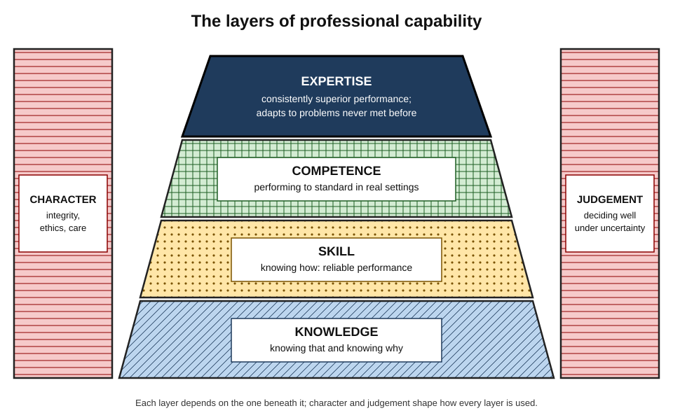
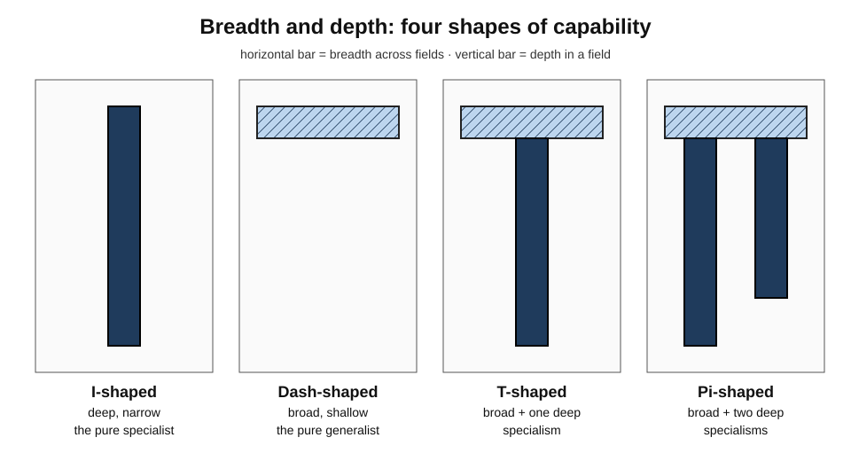
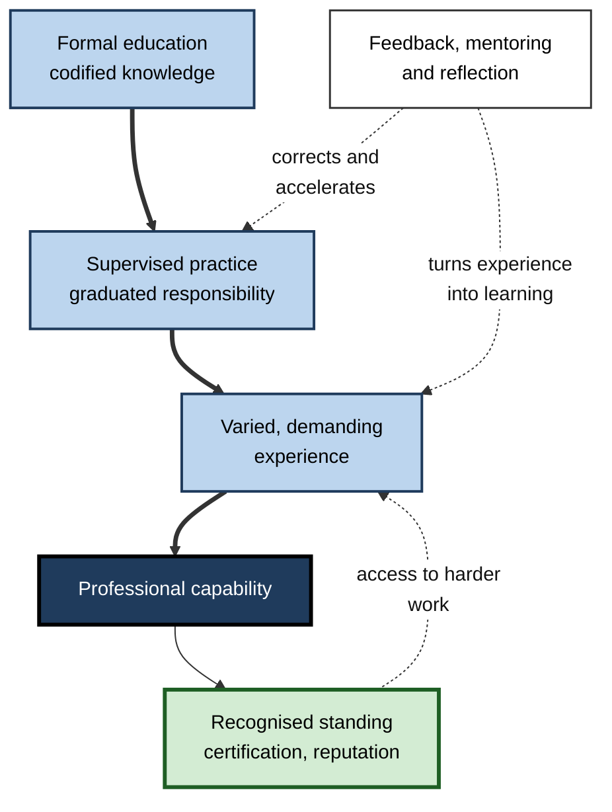
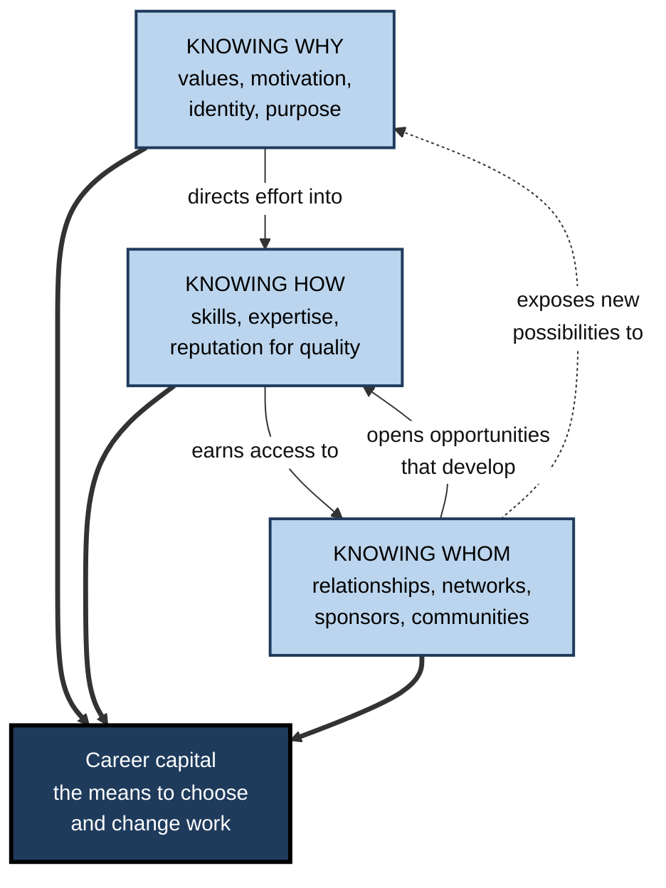
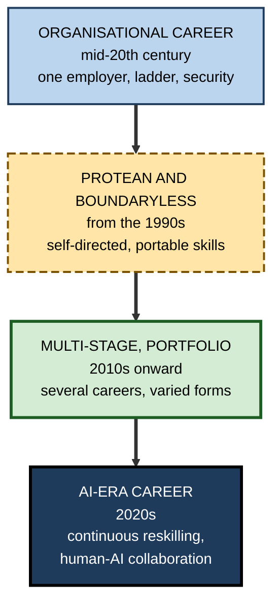
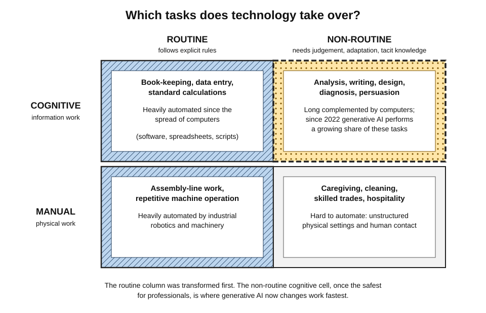
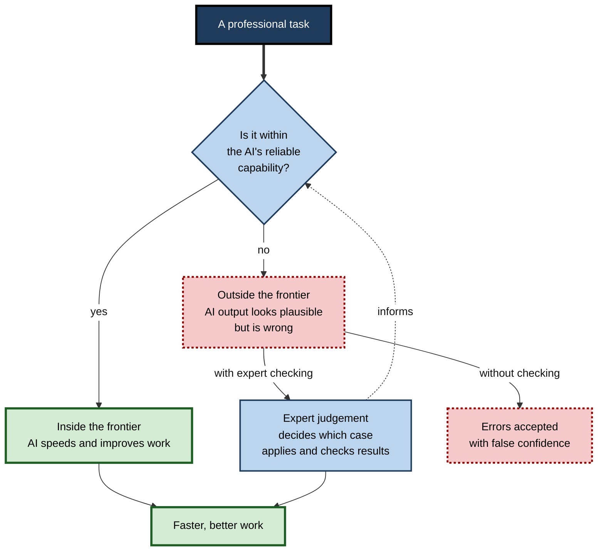
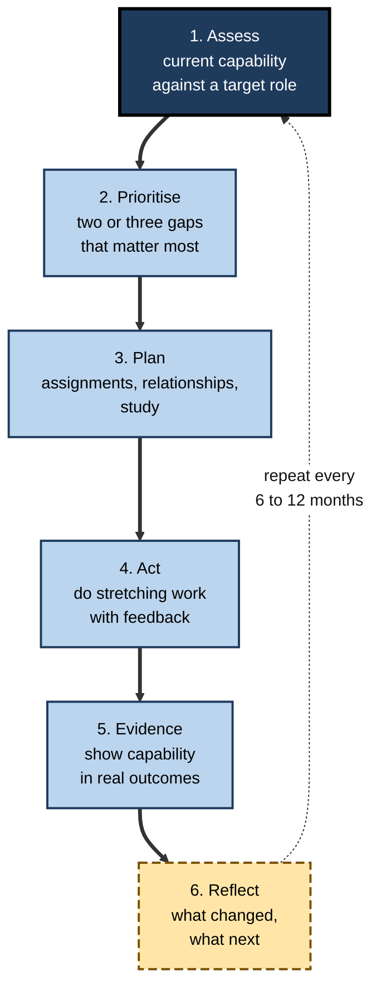

# Professional Career Development

Two people start the same job with the same degree. Twenty years later one is among the most trusted practitioners in the field; the other has stalled. The difference is rarely luck or raw intelligence — it is how capability was **built, applied, renewed and directed** over time.

> **Definition — Professional career development:** the deliberate, lifelong growth of a person's capability to do valuable work, together with the choices that determine where and how that capability is used.

---

## What a Professional Is

### Origins of the professions

- **Word origin:** Latin *professio*, a public declaration — originally a religious vow.
- **Medieval Europe:** three "learned professions" — **divinity, law, medicine**.
  - Long study of specialised knowledge.
  - Clients unable to judge quality for themselves.
  - A claim to put the client first, in return for public trust.
  - Self-regulation of members.
- **19th – early 20th century:** engineering, accountancy, architecture, nursing, teaching and pharmacy seek the same status → **professionalisation** spreads.
- **1910 — the Flexner Report** on North American medical education:
  - Found many medical schools were commercial operations with little science and no clinical training.
  - Led to closures and to university-based, science-grounded training — the model later copied by law, engineering and other fields.
- **Late 1950s onward:** Peter Drucker popularises **knowledge work**; "professional" extends to most skilled information work.

> **Definition — Professionalisation:** the process by which an occupation acquires the features of a profession: an association, entry examinations, university training, a code of ethics and legal recognition or licensing.

> **Definition — Knowledge work:** work whose main input and output is information and judgement rather than physical labour.

### The five marks of a professional

- **Specialised knowledge** — command of knowledge outsiders lack.
  - *e.g.* a data engineer understands distributed storage and query optimisation.
- **Judgement under uncertainty** — applying knowledge to ambiguous, novel or high-stakes situations.
  - *e.g.* a clinician deciding whether symptoms justify an expensive test.
- **Accountability** — owning outcomes and answering for them.
  - *e.g.* an auditor signing an opinion on financial statements.
- **Ethical commitment** — client and public interest above convenience.
  - *e.g.* a security consultant disclosing, not exploiting, a vulnerability.
- **Continuous development** — keeping capability current.
  - *e.g.* a tax adviser updating practice after new legislation.

> **Mnemonic — SJAEC ("Some Judges Always Expect Candour"):** Specialised knowledge, Judgement, Accountability, Ethics, Continuous development.

- Knowledge without judgement → a *technician of facts*.
- Judgement without accountability → a *commentator*.
- All five together → a **professional**.

### The professional bargain

- Clients cannot fully check the work — the code, the diagnosis, the audit.
- This is **information asymmetry**: one party knows far more than the other.
- Professionals therefore receive **trust and autonomy** …
- … and in return owe **competence, honesty and care**.
- Licensing, codes of conduct, peer review and liability keep the bargain credible.

> **Key point:** professional development is not only personal ambition — it is part of keeping a promise to the people the work serves. When one professional fails, the whole occupation's reputation suffers.

---

## The Anatomy of Professional Capability

### Four layers

- **Knowledge** — what a person knows.
  - *Knowing that*: facts, concepts, principles.
  - *Knowing why*: the reasons behind them, which make adaptation possible.
  - The *knowing that* / *knowing how* distinction was drawn sharply by the philosopher **Gilbert Ryle (1949)**.
- **Skill** — reliable, fluent performance of a task.
  - Built through practice and feedback; often automatic once mastered.
  - *e.g.* a skilled negotiator does not consciously recall the textbook stages.
- **Competence** — performing to an accepted standard in real working conditions.
  - Combines knowledge, skill and attitudes in context.
  - Always **relative to a role**: a competent junior solicitor and a competent senior partner are competent at different things.
- **Expertise** — consistently superior performance on a domain's representative tasks.
  - Experts **perceive** situations differently.
  - They organise knowledge into **larger meaningful patterns**.
  - They recognise **what matters** faster.
  - They **monitor** their own performance more accurately.

> **Example — one pharmacist, four layers:** *knows* which drugs interact (knowledge) → *calculates* paediatric doses accurately (skill) → *dispenses safely* in a busy hospital pharmacy (competence) → *spots a rare interaction* that standard checks miss (expertise).

**Figure 1.** The layers of professional capability.

- Two qualities run through every layer:
  - **Judgement** — choosing well when rules run out.
  - **Character** — integrity, conscientiousness, care, courage; decides how everything else is used.

> **Watch out:** high capability without character is not professionalism. An analyst who manipulates figures to please a manager is highly capable and professionally worthless.

### Competencies and competency frameworks

**Origins**

- **David McClelland (1973):** test for *competence*, not intelligence.
  - Grades and aptitude tests predicted job success less well than assumed.
  - Better predictors come from studying what outstanding performers actually do.
- **Richard Boyatzis, *The Competent Manager* (1982):** turned the idea into the competency movement.

> **Definition — Competency:** an underlying characteristic of a person — motive, trait, skill, self-image, social role or body of knowledge — causally related to effective or superior performance.

> **Definition — KSAOs:** Knowledge, Skills, Abilities and Other characteristics (such as personality and motivation) required for a job.

**A typical framework for an analyst**

- **Technical** competencies — data modelling, statistical analysis, visualisation.
- **Professional** competencies — communication, stakeholder management.
- **Behavioural** competencies — integrity, initiative, collaboration.
- Each described at levels from **foundational** to **expert**.

**Strengths**

- A common language for hiring, appraisal, promotion and training design.
- Makes expectations explicit.
- Supports fair, consistent decisions.

**Weaknesses**

- Long, abstract lists that describe everybody and distinguish nobody.
- Describe today's job, not tomorrow's.
- Can reduce professional judgement to a checklist of behaviours.

> **Remember:** good frameworks are **short**, **evidence-based** (built from what high performers actually do) and **revised** as the work changes.

### The shape of capability: breadth and depth

- The **T-shaped** professional: broad knowledge (the bar) + deep expertise in one field (the stem).
- Attributed to **David Guest (1991)**; popularised by the design firm **IDEO**.

**Figure 2.** Four shapes of capability.

| Shape | Profile | Strength | Risk |
|---|---|---|---|
| **I-shaped** | Deep, narrow | Mastery of a specialism | Weak collaboration; vulnerable if the specialism declines |
| **Dash-shaped** | Broad, shallow | Coordinates, connects, translates | No distinctive contribution; easily replaced |
| **T-shaped** | Broad + one deep | Depth plus effective collaboration | Single point of failure if the specialism is disrupted |
| **Pi-shaped (π)** | Broad + two deep | Combines fields, e.g. medicine + data science | Slower to build; two areas to keep current |

**Choosing a shape**

- **Early career:** build one credible area of depth — employers hire people who can do something specific.
- **Later career:** add a second depth or widen the bar — senior work integrates disciplines.
- **Rare combinations** are especially valuable because few can match them.
  - *e.g.* a lawyer who understands machine learning; an engineer who understands clinical practice.

### Three families of capability

- **Foundational capabilities** — used in every role.
  - Learning, reasoning, communication, numeracy and data, digital and AI tools, business and money, law.
- **Domain expertise** — technical depth in a field.
  - *e.g.* software architecture, clinical pharmacology, corporate tax.
  - What employers hire for.
- **Meta-capabilities** — govern how the other two are used and renewed.
  - Self-management, leadership, influence, ethical judgement, adaptability, career direction.

> **Key point:** the families **multiply** rather than add. Excellent expertise with poor communication produces little value, because the expertise never reaches the people who need it.

---

## How Professional Capability Is Formed

### Six routes

- **Formal education** — codified knowledge, transmitted efficiently (degrees, diplomas, courses).
- **Supervised practice** — graduated responsibility under experts.
  - *e.g.* medical residency, legal training contract, graduate scheme, trades apprenticeship.
- **Certification and licensing** — external assessment that signals competence.
- **On-the-job experience** — real, varied, difficult problems.
- **Mentoring, coaching and feedback** — someone who sees what the learner cannot yet see.
- **Self-directed learning** — reading, side projects, experiments on one's own initiative.

**Figure 3.** How formal education, supervised practice and experience combine into professional capability.

> **Definition — Matthew effect:** compounding advantage — recognised capability earns harder work, which builds more capability. Named after the verse "to everyone who has, more will be given" (Gospel of Matthew).

> **Key point:** stretching work **early** in a career compounds for decades.

### Communities of practice

**Study card — Lave and Wenger (1991)**

- **Who:** anthropologist Jean Lave and educational theorist Etienne Wenger.
- **Studied:** apprenticeships among midwives, tailors, quartermasters, butchers and recovering alcoholics.
- **Finding:** learning a profession is mainly **moving from the edge of a community to its centre**, not receiving knowledge from a teacher.
- **How it works:**
  - Newcomers do simple but **genuine** tasks.
  - They watch experienced members.
  - They absorb the community's language, values and judgement.
  - They take on more central work over time.

> **Definition — Community of practice:** a group sharing a craft or profession whose members learn from one another through shared work.

> **Definition — Legitimate peripheral participation:** learning by taking part in genuine but limited tasks at the edge of a community of practice.

> **Definition — Tacit knowledge:** knowledge held but hard to state — "we can know more than we can tell" (Michael Polanyi). Acquired mainly by working alongside people who have it.

> **Watch out:** isolation starves development. A remote junior who never sees seniors handle difficult conversations, ambiguous requirements or incidents misses the most important part of the curriculum.

### Experience is not expertise

- Years of experience **predict expertise poorly**.
- Performance often **plateaus** after the first few years.
- In some fields more experienced practitioners are no more accurate — or less, if their knowledge has gone stale.

> **Remember — experience becomes expertise only with all three:**
> 1. tasks at the **edge** of current ability;
> 2. **timely, accurate feedback** on results;
> 3. **reflection** that turns outcomes into revised understanding.

**Donald Schön, *The Reflective Practitioner* (1983)**

- **Reflection-in-action** — noticing and adjusting *while* working.
  - *e.g.* sensing a client's hesitation and changing approach mid-meeting.
- **Reflection-on-action** — reviewing *afterwards* what happened and why.
  - *e.g.* analysing why a project estimate was wrong.
- **Central insight:** real problems are **messy situations** that must first be *framed*; framing well is itself a core professional skill.

### The 70-20-10 heuristic

- **~70%** of development from challenging assignments.
- **~20%** from relationships — mentoring, feedback.
- **~10%** from formal training.
- **Origin:** Center for Creative Leadership research (1980s), in which executives recalled key developmental events; popularised by **Lombardo and Eichinger** (1990s).

> **Watch out:** the percentages are **not a measured law** — they come from retrospective self-report by one group of executives. Use the model only as a reminder that most development happens through work, so assignments and relationships must be designed for it.

---

## Capability as Capital

### Human capital and signalling

- **Human capital — Gary Becker, *Human Capital* (1964):**
  - Education and training are **investments**: cost now, higher productivity and earnings later.
- **Signalling — Michael Spence (1973):**
  - Qualifications also **reveal** who is able and diligent enough to obtain them.

| | General human capital | Specific human capital |
|---|---|---|
| Valuable to | Many employers | Mainly one employer |
| Example | Statistical skill, fluent writing | Knowledge of a firm's internal systems and politics |
| Who tends to pay | The individual — they capture the value | The employer — the value stays with them |
| If the job changes | Value retained | Value largely lost |

> **Key point:** both mechanisms are real. A demanding degree **teaches and signals**; a certification **develops skill and tells clients** an external body has checked it.

### Career capital

- Described by **Michael Arthur, Robert DeFillippi** and colleagues in the 1990s.
- **Knowing why** — values, motivation, identity, purpose.
  - Built by reflection and varied experience.
- **Knowing how** — skills, expertise, a reputation for quality.
  - Built by practice and demanding work.
- **Knowing whom** — mentors, sponsors, peers, clients, communities.
  - Built by contribution and visible good work.

**Figure 4.** The three forms of career capital and how they reinforce one another.

> **Mnemonic — "Why, How, Whom":** purpose, power, people.

> **Watch out:** building only one form — skill with no network, or networking with no substance — yields far less career capital than building all three.

### Weak ties

**Study card — Granovetter, *The Strength of Weak Ties* (1973)**

- **Finding:** people more often got new jobs through **acquaintances** than through close friends.
- **Why:**
  - Close friends know the same people and hear the same news.
  - Acquaintances bridge to **different circles** and new information.

**Study card — professional networking field experiment (2022)**

- **Design:** randomised variation in connection recommendations on a professional networking platform, ~20 million users.
- **Finding:** **moderately weak** ties were most useful for job mobility; the very weakest were less useful.

> **In practice:** a network is a structure of ties of varying strength across varying communities, maintained by **genuine contribution** — sharing knowledge, helping, doing visibly good work — not transactional contact.

### Worked example: two development investments

- **Situation:** a 28-year-old financial analyst has ~300 study hours this year.

| | Option A: internal reporting-system certification | Option B: general advanced data-analysis qualification |
|---|---|---|
| Capital type | Specific | General |
| Immediate payoff | High — needed now | Moderate — applied gradually |
| Who should pay | Employer | Individual |
| Signalling value | Low outside the firm | High |
| If the job changes | Value largely lost | Value retained |

- **Reasoning steps:**
  1. Classify each option by **type of capital**.
  2. Ask **who captures the value** → who should pay.
  3. Ask **how long the value lasts**.
  4. Weigh **career stage**:
     - early career → durable general capital compounds more;
     - imminent internal promotion tied to the specific skill → Option A may win.
- **Recommended action:** ask the employer to fund A as part of the job; invest personal time in B.

---

## Careers: From Ladders to Portfolios

> **Definition — Career:** the sequence of work roles and experiences over a lifetime, plus the meaning the person makes of them.

- **Objective career success:** positions, employers, pay, titles.
- **Subjective career success:** satisfaction, identity, sense of progress.
- Research finds the two are only **moderately** related.

### Models of the career

- **Organisational career** — dominant in the mid-20th century.
  - One employer, a hierarchical ladder, security in exchange for loyalty.
  - Managed largely by the organisation.
  - Weakened from the 1980s by restructuring, globalisation, the decline of lifetime employment and project-based work.
- **Protean career** — Douglas Hall, 1976 (developed in the 1990s).
  - Driven by the person's own values; measured by **psychological success**.
  - Named after Proteus, the shape-changing Greek sea god.
- **Boundaryless career** — Michael Arthur and Denise Rousseau, 1996.
  - Crosses employers, occupations, industries and countries.
  - Relies on portable skills and networks rather than one firm.
- **Kaleidoscope career** — Lisa Mainiero and Sherry Sullivan, mid-2000s.
  - People re-weight **authenticity, balance and challenge** as life changes.
- **Multi-stage life** — Lynda Gratton and Andrew Scott, *The 100-Year Life*, 2016.
  - Work alternates with retraining, exploration, caregiving and part-time work.

**Figure 5.** How the dominant model of a career has shifted.

> **Key point:** no model has fully replaced the others — organisational careers persist in government, the armed forces and many large firms. What changed is that **no single pattern can be assumed**, and individuals carry more responsibility for their own development.

### Classical theories of career choice

- **RIASEC (person–environment fit)** — John Holland, from 1959.
  - Six types of people and work environments: **R**ealistic, **I**nvestigative, **A**rtistic, **S**ocial, **E**nterprising, **C**onventional.
  - Satisfaction and persistence are higher when person and environment match.
- **Life-span, life-space theory** — Donald Super, from the 1950s.
  - Stages: growth → exploration → establishment → maintenance → disengagement.
  - Lived alongside other life roles — student, parent, citizen.
- **Planned happenstance** — John Krumboltz and colleagues, to 1999.
  - Chance events shape careers.
  - Prepare to exploit them through curiosity, persistence, flexibility, optimism and willingness to take risks.
- **Career construction theory** — Mark Savickas, 2000s.
  - Careers are built as personal stories that give work meaning.

> **Mnemonic — RIASEC:** "**R**eal **I**nventors **A**lways **S**ell **E**xciting **C**reations."

> **Definition — Career adaptability:** the resources — **concern, control, curiosity, confidence** (the "4 Cs") — that help a person manage career tasks and transitions.

> **Remember:** a fifty-year career cannot run on knowledge acquired in the first twenty. **Renewal and transition** become core skills.

---

## The Changing Nature of Professional Work

### Tasks, not jobs

- **David Autor, Frank Levy and Richard Murnane (2003):** technology changes **tasks**, not whole jobs.
- Tasks vary on two dimensions:
  - **routine** (explicit, codifiable rules) vs **non-routine** (judgement, adaptation, tacit knowledge);
  - **cognitive** vs **manual**.

**Figure 6.** The task framework of technological change.

- **Routine cognitive** (book-keeping, data entry) → automated by computers.
- **Routine manual** (assembly-line work) → automated by robotics.
- **Non-routine manual** (caregiving, cleaning, skilled trades) → hard to automate.
- **Non-routine cognitive** (analysis, writing, design, diagnosis) → long *complemented* by computers; now directly reached by generative AI.

> **Definition — Job polarisation:** growth of high-skill and low-wage jobs with a hollowing-out of routine middle-skill jobs, seen in many advanced economies.

### Generative AI and professional tasks

- Widely available from **late 2022**.
- New: performs **non-routine cognitive** tasks — drafting, summarising, translating, coding, analysing.

**Study card — exposure of occupations (OpenAI and University of Pennsylvania, 2023)**

- ~**80%** of US workers have at least 10% of tasks exposed to large language models.
- ~**19%** have at least half their tasks exposed.
- Exposure is highest in **higher-paid, more educated** occupations.

**Study card — customer-support agents (Brynjolfsson, Li and Raymond)**

- **Design:** 5,000+ agents given an AI assistant.
- **Finding:** +**14%** issues resolved per hour on average; +**34%** for novices; little gain for the most experienced.
- **Interpretation:** the assistant spread top agents' tacit know-how to everyone else.

**Study card — consultants at Boston Consulting Group (Dell'Acqua et al., 2023)**

- **Design:** experiment with 758 consultants.
- **Inside the AI's capability:** **12%** more tasks, **25%** faster, **40%+** higher quality.
- **Just outside it:** **19 percentage points less** likely to reach the correct answer.

> **Definition — Jagged technological frontier:** the irregular, non-obvious boundary between tasks AI does well and tasks of similar apparent difficulty that it does badly.

**Figure 7.** Working inside and outside the jagged frontier.

**Three consequences for professional development**

1. **Expertise becomes more valuable** — knowing where the frontier lies and checking AI output needs the very knowledge AI seems to replace.
2. **The entry-level pipeline is under pressure** — routine junior tasks are the easiest to delegate, so novices need deliberately designed routes to judgement.
3. **Unaided capability still matters** — see the study card below.

**Study card — Bastani and colleagues (2025)**

- **Design:** large field experiment in high-school mathematics; unrestricted GPT-4 vs a hint-giving AI tutor vs no AI.
- **Finding:** unrestricted AI raised **practice** scores but lowered later **unaided test** scores; the hint-giving tutor largely avoided the harm.
- **Lesson:** letting tools do the thinking one is meant to learn erodes independent capability.

### Skill turnover and the labour market

**World Economic Forum, *Future of Jobs Report 2025* (employer survey)**

- ~**39%** of workers' core skills expected to change between 2025 and 2030.
- ~**170 million** jobs created and ~**92 million** displaced worldwide → net ~**+78 million**.
- Fastest job growth: technology roles; frontline care, education and logistics.
- **Most important core skill:** analytical thinking.
  - Then resilience, flexibility and agility; leadership and social influence.
- **Fastest-growing skills:** AI and big data; networks and cybersecurity; technological literacy; creative thinking; curiosity and lifelong learning.

**Two structural shifts**

- **Skills-based hiring** — selecting on demonstrated skills rather than degrees or titles.
  - Caveat: studies of actual hiring suggest practice has changed less than announcements implied.
- **Internal talent marketplaces** — platforms matching employees to internal projects and roles by skill.
  - Effect: organisational careers become more fluid and less ladder-like.

---

## Professional Judgement, Ethics and Trust

### Judgement

> **Definition — Professional judgement:** reaching sound decisions where rules and procedures do not settle the answer.

- **Components:**
  - domain knowledge;
  - an accurate reading of the situation;
  - awareness of what is uncertain;
  - sensitivity to the interests and values at stake.
- **Developed through:** many cases · feedback on decisions · studying experts' reasoning · explicit reflection on errors.
- **Hallmark:** knowing when one's own judgement is not enough — when to consult, escalate, gather information or decline.

### Ethics

**Principles shared by professional codes**

- **Competence** — do not undertake work you cannot do well.
- **Integrity** — honesty in all dealings.
- **Confidentiality** — protect client information.
- **Objectivity** — avoid conflicts of interest.
- **Public responsibility** — consider the wider effects of the work.

> **Definition — Fiduciary duty:** a legal obligation to act in another's best interests — e.g. trustees, financial advisers, company directors.

**How ethical failure usually happens**

- Rarely villainy — usually **small accommodations under pressure**:
  - a skipped test before a deadline;
  - a "more favourable" figure for a client;
  - a manager who discourages bad news.
- **Space shuttle *Challenger* (1986):** engineers' warnings about cold temperatures and booster seals were overruled → organisational pressure overrode professional judgement.
- **Enron and Arthur Andersen (2001–02):** accounting fraud; the audit firm collapsed with its client → auditor independence and integrity are a profession's core asset.

> **In practice:** ethical capability = knowing what is right **plus** the skill and courage to act on it inside a hierarchy — raise concerns clearly, document them, escalate when necessary.

### Psychological safety

> **Definition — Team psychological safety:** a shared belief that the team is safe for interpersonal risk-taking — asking questions, admitting mistakes, dissenting (Amy Edmondson, 1999).

**Study card — Edmondson's hospital teams**

- **Puzzle:** better teams reported **more** errors.
- **Explanation:** they did not make more errors — they were more willing to **report** them, and so could learn.
- **Corroboration:** Google's internal research on team effectiveness (2010s) found psychological safety the most important factor it studied.

> **Key point:** seek environments where candour is possible — and, once senior, **create** them.

---

## Sustaining a Career

### Burnout

> **Definition — Burnout (WHO, ICD-11, 2019):** an **occupational phenomenon**, not a medical condition, resulting from chronic workplace stress that has not been successfully managed.

- **Three dimensions (Christina Maslach):**
  - **exhaustion** — depleted energy;
  - **cynicism / mental distance** — detachment from the job;
  - **reduced professional efficacy** — feeling ineffective.
- Burnout erodes exactly what professional work needs: **attention, memory, judgement, empathy, motivation to learn**.

**Six areas of work life (Maslach and Michael Leiter)**

- **Workload** — manageable.
- **Control** — sufficient autonomy.
- **Reward** — recognition matches effort.
- **Community** — supportive relationships.
- **Fairness** — decisions perceived as just.
- **Values** — personal and organisational values align.

> **Mnemonic — "We Can Reward Colleagues Fairly, Valuing them":** Workload, Control, Reward, Community, Fairness, Values.

> **Key point:** individuals can protect themselves (sleep, recovery, boundaries), but the **strongest causes are organisational** — senior professionals are responsible for the conditions of the people they lead.

### Renewal

> **Definition — Half-life of knowledge:** the time for half of a field's knowledge to become obsolete.

> **Watch out:** popular figures ("skills last five years") are **not well measured** and vary hugely — contract law or thermodynamics change slowly; a cloud platform's services change within months.

> **Remember:** renew knowledge **in proportion to how fast the field moves**.

---

## What Distinguishes the Very Best

- **Superior mental models** — knowledge organised around deep principles, not surface features.
- **Adaptive expertise** — understanding *why* methods work, so new ones can be invented (Giyoo Hatano and Kayoko Inagaki, 1986).
- **Deliberate improvement** — working *on* performance, not just *at* work.
- **Accurate self-assessment** — knowing the limits of one's competence; seeking disconfirming evidence and feedback.
- **Judgement and integrity under pressure** — sound calls with incomplete information; no trading integrity for convenience.
- **Multiplying others** — developing capability in others through teaching, mentoring, standards and teams; Erik Erikson called this **generativity**.
- **Influence** — framing problems, building coalitions, communicating to move action.

| | Routine expert | Adaptive expert |
|---|---|---|
| Familiar tasks | Fast and accurate | Fast and accurate |
| Understands why methods work | Not necessarily | Yes |
| When conditions change | Struggles | Invents new procedures |
| Most valuable in | Stable fields | Fast-changing fields |

**Deliberate practice — the evidence in brief**

- **Ericsson, Krampe and Tesch-Römer (1993):** elite musicians had accumulated far more hours of **deliberate practice** — effortful, targeted, with feedback.
- **Macnamara and colleagues (2014), meta-analysis:**
  - practice explains a substantial share of performance differences in **games and music**;
  - a much smaller share in **professions**;
  - → starting knowledge, ability and feedback quality also matter.

### Case study: two engineers, eleven years

- **Start:** Arjun and Meera join the same company in the same year with similar degrees.
- **Arjun:**
  - becomes the team's specialist in its main framework — fast, reliable, well rated;
  - avoids unfamiliar work and presentations; works only within his team;
  - when the company migrates to a new architecture, his specialist knowledge loses value;
  - after eleven years: senior engineer, deep but narrowing expertise, small network.
- **Meera:**
  - builds the same depth in the main framework;
  - every ~18 months volunteers for edge-of-ability work — incident rotation, pipeline rebuild, customer integration;
  - writes design documents, asks seniors to review them, keeps a mistakes-and-lessons log;
  - mentors two interns a year;
  - understands the principles beneath both old and new systems → asked to **lead** the migration;
  - after eleven years: principal engineer, known across the company.

> **Key point:** neither worked longer hours. The difference was the **structure** of development — stretch with feedback, explicit reflection, breadth around depth, relationships, and developing others. All are available to almost any professional.

---

## Managing One's Own Development

### The professional development cycle

**Figure 8.** The professional development cycle.

1. **Assess** — describe a target role 2–5 years ahead; compare current capability using **external evidence** (feedback, outcomes, people already in the role).
   - Mistake to avoid: relying on self-impression.
2. **Prioritise** — pick **two or three** gaps with the biggest payoff.
   - Mistake to avoid: working on ten gaps and moving none.
3. **Plan** — for each gap combine one **assignment**, one **relationship** and one **study or practice** activity.
   - Mistake to avoid: planning courses only.
4. **Act** — do the work; seek feedback early and often.
5. **Evidence** — capture proof: a delivered project, a measurable result, written feedback, a meaningful certification.
   - Mistake to avoid: counting attendance as evidence.
6. **Reflect** — what changed, what did not, and why; set the next cycle.

> **Mnemonic — "A PAPER":** Assess, Prioritise, Plan, Act, Prove (evidence), Reflect.

### Worked example: an individual development plan

- **Situation:** a data analyst, two years in, aims to be a senior analyst within two years.
- **Gap 1 — framing business problems**
  - *Evidence of gap:* managers often re-scope her analyses after delivery.
  - *Assignment:* lead scoping for the next quarterly pricing review.
  - *Relationship:* monthly review with the commercial director.
  - *Practice:* rewrite three past requests as problem statements.
  - *Success looks like:* scoping accepted without major revision.
- **Gap 2 — experiment design**
  - *Evidence of gap:* has never designed an A/B test end to end.
  - *Assignment:* co-design the next checkout experiment.
  - *Relationship:* pair with a senior data scientist.
  - *Practice:* weekly experimental-design problems.
  - *Success looks like:* experiment shipped with a pre-registered analysis plan.
- **Gap 3 — presenting to executives**
  - *Evidence of gap:* presentations run long and bury conclusions.
  - *Assignment:* present the pricing review to leadership.
  - *Relationship:* rehearse with her manager.
  - *Practice:* rewrite past decks conclusion-first.
  - *Success looks like:* leadership acts on the recommendation.

> **Key point:** short, specific, anchored in real work — each gap tied to an assignment, a person and a measurable sign of success.

---

## Developing Professionals in Organisations

### What well-designed systems include

- **Clear role expectations** — a framework or career ladder showing what good looks like at each level.
- **Dual career ladders** — specialists progress (senior → staff → principal → distinguished) without being forced into management.
- **Stretch assignments, rotations and secondments** — deliberate development through work.
- **Mentoring and sponsorship** — advice and opportunity.
- **Regular, specific feedback** — kept separate from pay decisions.
- **Learning measured by its effect on work** — not by attendance.

| | Mentor | Sponsor |
|---|---|---|
| Role | Advises, guides, listens | Uses influence to create opportunities |
| Talks | *To* you | *About* you, in rooms you are not in |
| Builds | Capability | Visibility and access |

> **Watch out:** career research — particularly on women and minority groups — suggests **sponsorship** often matters more for advancement than mentoring alone.

### Measuring development: Kirkpatrick's four levels (1959)

1. **Reaction** — did participants like it? *(weakest evidence, yet most measured)*
2. **Learning** — did they acquire knowledge or skill? *(useful if tested after a delay)*
3. **Behaviour** — do they apply it on the job? *(strong)*
4. **Results** — did organisational outcomes improve? *(strongest)*

> **Watch out:** effective development often **feels harder** than ineffective development, so satisfaction scores can mislead.

### Case study: rebuilding a career framework

- **Situation:** a professional services firm of ~2,000 people.
- **Problem:** its best technical consultants left after 5–7 years.
  - Progression past manager required leading large teams and selling work.
  - Many strong technical consultants neither wanted nor excelled at either.
- **Actions:**
  1. Created a parallel technical track — senior, principal, distinguished specialist — with **equal pay bands** and explicit technical-leadership expectations.
  2. Cut 30 competencies to **8 per track**, each defined by observable behaviours and checked against high performers.
  3. Tied promotions to **evidence of impact**, not tenure.
- **Results:** senior technical departures fell markedly; client satisfaction on complex projects rose.
- **Side effects:**
  - some managers suspected the track was used to dodge people management;
  - cross-track calibration needed careful moderation.
- **Lesson:** career frameworks are powerful levers — they create incentives, and incentives must be monitored.

---

## Open Questions

- **How will novices learn when AI does the junior work?**
  - Unknown whether simulations, practice environments and AI tutors can substitute for real responsibility.
- **What will credentials mean?**
  - Degrees, micro-credentials, certifications, portfolios and skills tests compete as signals.
  - The real impact of skills-based hiring is unclear.
- **How should capability be measured?**
  - Most measures rely on self-report, manager ratings or course completion — all weak.
- **How far does expertise transfer across domains?**
  - Increasingly important as careers include more transitions.
- **What is a sustainable fifty-year working life?**
  - Pacing, renewal, health and work design for older professionals remain largely unanswered.

---

## Summary

- A **professional** combines specialised knowledge, judgement, accountability, ethics and continuous development; modern knowledge work extends these marks to most skilled occupations.
- Capability has four **layers** — knowledge, skill, competence, expertise — shaped throughout by **judgement** and **character**.
- **Competency frameworks** and **KSAOs** describe capability; T-shaped and pi-shaped models describe its **breadth and depth**.
- Capability forms through education, supervised practice, demanding experience, feedback, mentoring and self-directed learning; much expert knowledge is **tacit** and learned in **communities of practice**.
- **Experience becomes expertise** only with stretch, feedback and reflection; 70-20-10 is a heuristic, not a law.
- Capability is **capital**: general vs specific human capital, signalling, and career capital (knowing why, how, whom); moderately weak ties aid mobility.
- Careers have moved from organisational ladders to **protean, boundaryless, kaleidoscope and multi-stage** forms; renewal and transition are core skills.
- Technology changes **tasks**; generative AI reaches non-routine cognitive work, creating a **jagged frontier** where expert judgement and unaided capability matter more.
- **Ethics, judgement and psychological safety** sustain trust; **burnout** erodes the capacities professional work depends on.
- The best professionals show **adaptive expertise**, deliberate improvement, accurate self-assessment, integrity, **generativity** and influence.
- Manage development with the **A PAPER** cycle; organisations shape it through role clarity, dual ladders, stretch work, sponsorship, feedback and measurement of behaviour and results.

---

## Self-Check

1. What features did the classical professions share, and which still define professional work?
2. Distinguish knowledge, skill, competence and expertise, with an example of each.
3. Why is information asymmetry central to the "professional bargain"?
4. Distinguish general and specific human capital. Why does the distinction affect who pays for training?
5. Name the three forms of career capital and explain how they reinforce one another.
6. Why are weaker ties often more useful than close friends in finding new work?
7. Distinguish the protean and the boundaryless career.
8. Using the task framework, explain why generative AI affects professional work differently from earlier computerisation.
9. What is the jagged technological frontier, and what does it imply for using AI tools?
10. Why does experience not automatically produce expertise? Name the three required ingredients.
11. Distinguish routine from adaptive expertise and explain why it matters in fast-changing fields.
12. A training programme has excellent satisfaction scores but no change in on-the-job performance. Diagnose the problem using Kirkpatrick's model and propose better measures.
13. A remote junior consultant relies heavily on AI and rarely interacts with seniors. Identify the development risks and design three changes.
14. A specialist engineer does not want to move into management. Which organisational design feature helps, and what problems can it create?

### Answer Key

1. Specialised knowledge from long study; clients unable to judge quality; a claim to put clients first; self-regulation. All four still define professional work through professional bodies, codes and licensing.
2. Knowledge: knowing drug interactions. Skill: accurately calculating paediatric doses. Competence: dispensing safely in a busy hospital pharmacy. Expertise: spotting a rare interaction that standard checks miss.
3. Clients cannot evaluate the work, so they must trust the professional; in exchange professionals owe competence, honesty and care, enforced by codes, licensing and liability. Without this machinery, trust would collapse.
4. General capital is valuable to many employers, specific capital mainly to one. Employers pay more readily for specific training (value stays with them); individuals bear more of the cost of general training (they can take it elsewhere).
5. Knowing why (values, identity), knowing how (skills, reputation), knowing whom (relationships). Values direct effort into expertise; expertise earns relationships; relationships bring opportunities that build expertise and reveal new possibilities.
6. Close friends share the same networks and news; weaker ties bridge to different circles and new information. Large-scale evidence suggests moderately weak ties help most.
7. Protean: driven by the person's own values, measured by psychological success. Boundaryless: crosses employers, occupations, industries and countries, relying on portable skills and networks. A career can be both.
8. Earlier computerisation automated routine, rule-based tasks and complemented non-routine cognitive work. Generative AI performs non-routine cognitive tasks — the core of professional work — directly.
9. AI is strong on some tasks and weak on others of similar apparent difficulty, with an irregular boundary. Professionals must judge which side a task falls on and check outputs, especially where errors are costly.
10. Experience is often repetitive, lacks feedback and is not reflected on, so performance plateaus. Needed: tasks at the edge of ability, timely accurate feedback, reflection.
11. Routine experts are fast on familiar tasks; adaptive experts understand why methods work and can invent new ones. In fast-changing fields familiar procedures become obsolete, so adaptability preserves value.
12. Only Level 1 (reaction) is being measured. Measure learning after a delay and unaided, behaviour on the job weeks later (observation, work samples, manager evidence) and the intended results — and treat satisfaction with caution.
13. Risks: missed tacit knowledge, unaided gaps masked by AI, no feedback or sponsorship, work staying inside the AI's frontier. Changes: paired work with seniors on hard client problems; periodic AI-free tasks reviewed by a senior; a named mentor plus a stretch project with a visible sponsor.
14. A dual career ladder. Risks: used to avoid people management, inconsistent standards between tracks, and the technical track becoming a lower-status "consolation" route unless pay, expectations and recognition are genuinely equivalent.

---

## Glossary

| Term | Meaning |
|---|---|
| Adaptive expertise | Expertise including understanding of why methods work, enabling new methods when conditions change. |
| Boundaryless career | A career crossing employers, occupations, industries and countries, relying on portable skills and networks. |
| Burnout | An occupational phenomenon from unmanaged chronic workplace stress: exhaustion, cynicism, reduced efficacy. |
| Career | The sequence of work roles and experiences over a lifetime, plus the meaning made of them. |
| Career adaptability | Concern, control, curiosity and confidence for managing career tasks and transitions. |
| Career capital | Knowing why, knowing how and knowing whom — the means to choose and change work. |
| Community of practice | A group sharing a craft whose members learn from one another through shared work. |
| Competence | Performing to an accepted standard in real working conditions. |
| Competency | An underlying characteristic causally related to effective or superior performance. |
| Competency framework | A structured description of role capabilities by proficiency level. |
| Deliberate practice | Effortful, targeted activity to improve specific aspects of performance, with feedback. |
| Dual career ladder | Parallel technical and management tracks with comparable status and pay. |
| Expertise | Consistently superior performance on a domain's representative tasks. |
| Fiduciary duty | A legal obligation to act in another person's best interests. |
| General human capital | Skills and knowledge valuable to many employers. |
| Generativity | Concern for guiding and developing the next generation. |
| Half-life of knowledge | The time for half of a field's knowledge to become obsolete. |
| Information asymmetry | One party to a transaction knowing much more than the other. |
| Jagged technological frontier | The irregular boundary between tasks AI does well and badly. |
| Job polarisation | Growth of high- and low-wage jobs relative to routine middle-wage jobs. |
| Knowledge work | Work whose main input and output is information and judgement. |
| KSAOs | Knowledge, skills, abilities and other characteristics required for a job. |
| Legitimate peripheral participation | Learning through genuine but limited tasks at the edge of a community of practice. |
| Matthew effect | Compounding advantage: capability earns opportunities that build more capability. |
| Professionalisation | The process by which an occupation acquires the features of a profession. |
| Protean career | A self-directed career driven by personal values and psychological success. |
| Psychological safety | A shared belief that a team is safe for interpersonal risk-taking. |
| Reflection-in-action | Noticing and adjusting while work is under way. |
| Reflection-on-action | Reviewing completed work to understand what happened and why. |
| Signalling | Using qualifications to reveal otherwise hidden qualities. |
| Skills-based hiring | Selecting candidates on demonstrated skills rather than degrees or titles. |
| Specific human capital | Skills and knowledge valuable mainly to one employer. |
| Sponsor | A senior person who uses influence to create opportunities for someone. |
| T-shaped professional | Broad knowledge across areas plus deep expertise in one. |
| Tacit knowledge | Knowledge held but hard to state, acquired largely through experience. |
| Task framework | Analysing technological change by routine/non-routine and cognitive/manual tasks. |
