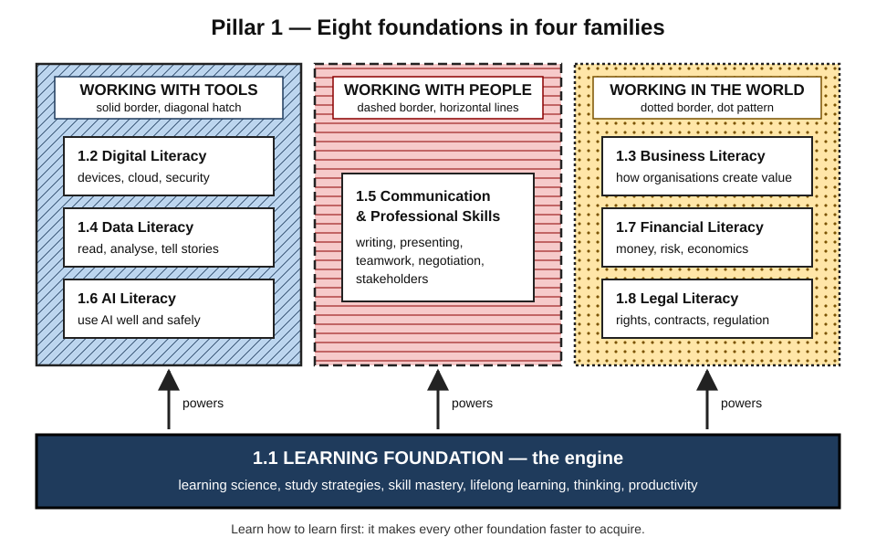
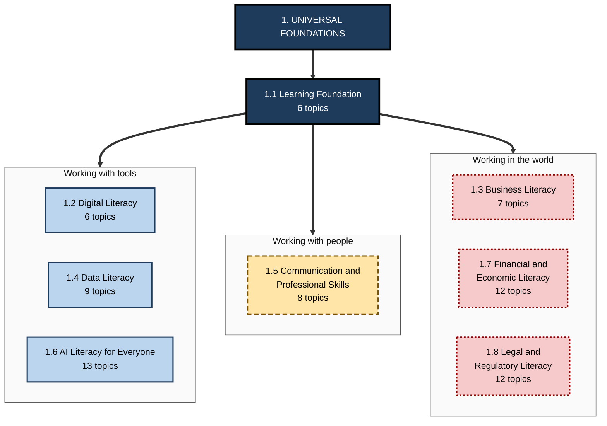
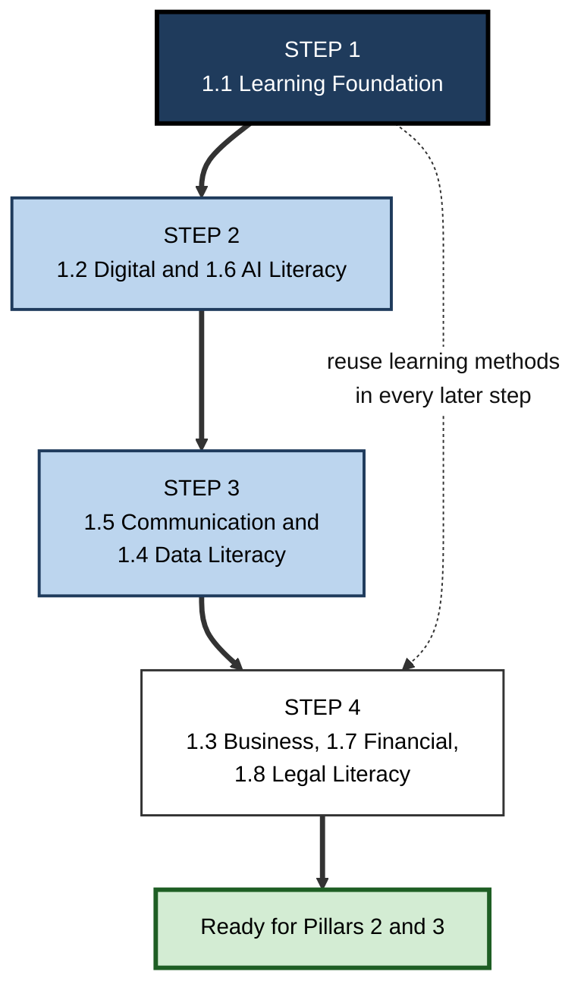

# 1. Universal Foundations

> **Scope:** The capabilities every professional needs, whatever their role or industry — learning, thinking, digital, business, data, communication, AI, financial and legal literacy. · **Contains:** 8 sections · 73 topics · **Level span:** Novice → Expert

---

## Overview

Universal Foundations is the base slab of the career house. It holds the capabilities that do not belong to any one job but are used in all of them: the ability to learn quickly and durably, to reason clearly, to work confidently with digital tools, data and AI, to understand how businesses make money, to communicate and collaborate, and to handle personal finance and the law sensibly.

A software engineer, a nurse moving into health informatics, a sales lead and a startup founder all draw on the same foundations every day. They read a dashboard, decide whether an AI answer can be trusted, explain an idea to a sceptical stakeholder, judge whether a contract clause is risky, and keep learning as their field changes. People who are strong here are not only better at their current job; they are faster at acquiring the *next* one.

*Figure 1-1 — Eight foundations in four families.* Section 1.1 (dark base) powers three families: tools (diagonal hatch, solid border), people (horizontal lines, dashed border) and the world of organisations and society (dots, dotted border).

---

## Why It Matters

**The foundations are what employers rate most highly.** Large employer surveys published in 2025 consistently put analytical thinking at the top of the list of core skills, followed by human capabilities such as resilience and adaptability, leadership and social influence, creative thinking, and curiosity and lifelong learning. The same surveys rank AI and big data, cybersecurity awareness and technological literacy as the fastest-growing skills. Every one of those sits in this pillar.

**Skills are shifting, so learning ability compounds.** Employers expect a large share of workers' core skills — close to two in five — to change by the end of the decade. When the content of a job keeps changing, the durable advantage is the ability to learn new content well. That is why the pillar begins with the Learning Foundation.

**Basic literacies are not as universal as people assume.** International adult-skills surveys published in late 2024 found adult literacy and numeracy stagnating or declining in many advanced economies over the past decade, with wide gaps inside every country. Solid foundations are a genuine differentiator, not a box everyone has already ticked.

**AI raises the bar for foundations rather than lowering it.** Generative AI can draft, summarise, analyse and code. To use it well, a professional needs enough domain knowledge, data sense, critical thinking and legal awareness to direct it, check it and take responsibility for the result. Research on AI-assisted work repeatedly finds that the benefit depends on the user's own judgement.

---

## Structure at a Glance

**Figure 1-2 — The eight sections of Pillar 1.**

*How to read it:* the Learning Foundation sits first and feeds the three families. Solid borders mark tool literacies, the long-dashed border marks the people section, and dotted borders mark literacies about organisations and society.

---

## What Each Part Covers

| Section | Topics | Core question | You will be able to... |
|---|---|---|---|
| **1.1 Learning Foundation** | 6 | How do I learn, think and work effectively? | Learn durably, use evidence-based study methods, build skills to mastery, direct your own learning, think critically and manage your knowledge and time. |
| **1.2 Digital Literacy** | 6 | How do I work confidently with digital technology? | Use devices, productivity and cloud collaboration tools well, judge information and media, and protect your security and privacy. |
| **1.3 Business Literacy** | 7 | How do organisations create and capture value? | Read the basics of markets, finance, marketing, strategy, operations, ethics, revenue models and KPIs. |
| **1.4 Data Literacy** | 9 | How do I read, use and communicate data? | Interpret and analyse data, manage it responsibly, use spreadsheets and dashboards, tell stories with data and understand AI-ready and synthetic data. |
| **1.5 Communication & Professional Skills** | 8 | How do I work well with other people? | Communicate clearly, collaborate in teams, behave professionally, negotiate and manage stakeholders. |
| **1.6 AI Literacy for Everyone** | 13 | What is AI and how do I use it well and safely? | Explain how machine learning and large language models work, use generative AI and agents effectively, and recognise bias, privacy and safety risks. |
| **1.7 Financial & Economic Literacy** | 12 | How do I manage money and understand the economy? | Budget, save, manage debt and credit, invest, plan for taxes, insurance and retirement, and avoid common behavioural traps. |
| **1.8 Legal & Regulatory Literacy** | 12 | What rules govern my work and life? | Understand contracts, intellectual property, employment and consumer rights, data-privacy and AI regulation, and when to seek professional help. |

**1.1 Learning Foundation** is the engine of the whole map. It moves from the science of how learning works (memory, attention, cognitive load, metacognition, motivation, transfer), to practical study strategies, to the development of skills and expertise, to self-directed lifelong learning, core thinking skills and personal productivity.

**1.2 Digital Literacy** covers the practical fluency every modern worker needs: digital fundamentals and productivity, judging information and media critically, keeping data and accounts secure, collaborating in the cloud, and using AI tools in everyday digital work.

**1.3 Business Literacy** explains how organisations work: business fundamentals, economics and markets, corporate finance, marketing and sales, strategy and operations, governance and ethics, and the revenue models and KPIs that tell you whether value is being created.

**1.4 Data Literacy** builds the ability to think with data — what data is, how to analyse and interpret it, how it is managed and governed, the tools for working with it, ethical use, data-driven organisations, spreadsheets, dashboards and storytelling, and the data that modern AI systems need.

**1.5 Communication & Professional Skills** teaches the human side of work: communication fundamentals, collaboration and teamwork, professionalism, negotiation and influence, and stakeholder management. Three topics are overviews that point forward to the deeper treatments of writing, presenting and leadership communication in Pillar 4.

**1.6 AI Literacy for Everyone** gives non-specialists a clear, current understanding of AI: what it is, how machine learning and large language models work, generative AI and AI agents in daily life and at work, ethics, bias, privacy and safety, using AI tools effectively, critical thinking about AI output, and becoming an AI-augmented professional.

**1.7 Financial & Economic Literacy** covers personal finance from budgeting and emergency funds through debt, banking, investing, taxes, insurance and retirement, plus the economic concepts and behavioural-finance insights that improve financial decisions.

**1.8 Legal & Regulatory Literacy** gives a working understanding of law and legal systems, contracts, intellectual property, employment and consumer rights, privacy law, technology and AI regulation, cross-border basics, professional obligations, and when to bring in a professional.

---

## How to Use This Part

**Figure 1-3 — Suggested order through Pillar 1.**

*How to read it:* follow the thick arrows. The dotted arrow is a reminder that the methods from Step 1 are used to learn everything that follows.

| If you are... | Start with | Then | Read to level |
|---|---|---|---|
| A student or first-jobber | 1.1, then 1.2 and 1.6 | 1.5, 1.4, then 1.3, 1.7, 1.8 | 1–3 everywhere; 4–5 where it interests you |
| A career switcher | 1.1 (how to learn fast), 1.6 | Whichever literacies your target role leans on | 1–4 in your target areas |
| An experienced professional | 1.6 and 1.1 Levels 4–5 | Gaps you notice in 1.4, 1.3 or 1.8 | 4–5 for currency and for designing for others |
| A manager or L&D professional | 1.1 Levels 4–5 throughout | 1.5, 1.6 | 5 — use the notes to design training |

---

## Core Principles

1. **Learning is the master foundation.** Every other literacy is acquired faster by someone who knows how learning works.
2. **Literacy before fluency before mastery.** Aim first to understand and read a field, then to use it routinely, and only then to go deep where your career demands.
3. **Judgement is the scarce skill.** Tools, data and AI produce outputs; foundations give you the judgement to evaluate them.
4. **Evidence over folklore.** Much popular advice about learning, money and productivity is wrong. Each note separates the well-supported from the merely popular.
5. **Ethics and responsibility are part of literacy.** Knowing how to use data, AI, money and the law includes knowing how to use them responsibly.
6. **Foundations are revisited, not completed.** Return to them as your career grows; Levels 4 and 5 reward a second reading years later.

---

## Novice-to-Pro Progression

| Level | What competence across Pillar 1 looks like |
|---|---|
| **Novice** | Can explain each foundation in plain language and spot the biggest gaps in their own skills. |
| **Foundations** | Uses evidence-based learning methods; handles everyday digital, data and AI tasks; understands a payslip, a contract and a P&L at a basic level. |
| **Practitioner** | Learns new tools quickly; makes data-informed arguments; uses AI productively and checks its output; communicates clearly with varied audiences. |
| **Advanced** | Understands the mechanisms behind the methods; anticipates risks (security, privacy, legal, financial); sets standards for a team. |
| **Expert / Pro** | Designs learning, data, AI-use and communication practices for others; shapes organisational policy; mentors people through foundations they lack. |

---

## Key Takeaways

- Pillar 1 holds **eight foundations used in every career**, grouped as learning, tools, people and the world.
- **Learning Foundation (1.1) comes first** because it accelerates everything else.
- Employers rate **analytical thinking, adaptability and lifelong learning** as core and **AI, data and technological literacy** as fastest-growing — all of them live here.
- **AI makes foundations more valuable**, because directing and checking AI depends on your own knowledge and judgement.
- Use the **suggested order** if you are starting out; dip in by need if you are experienced.
- Foundations are **revisited across a career** — the advanced levels repay a later re-read.
