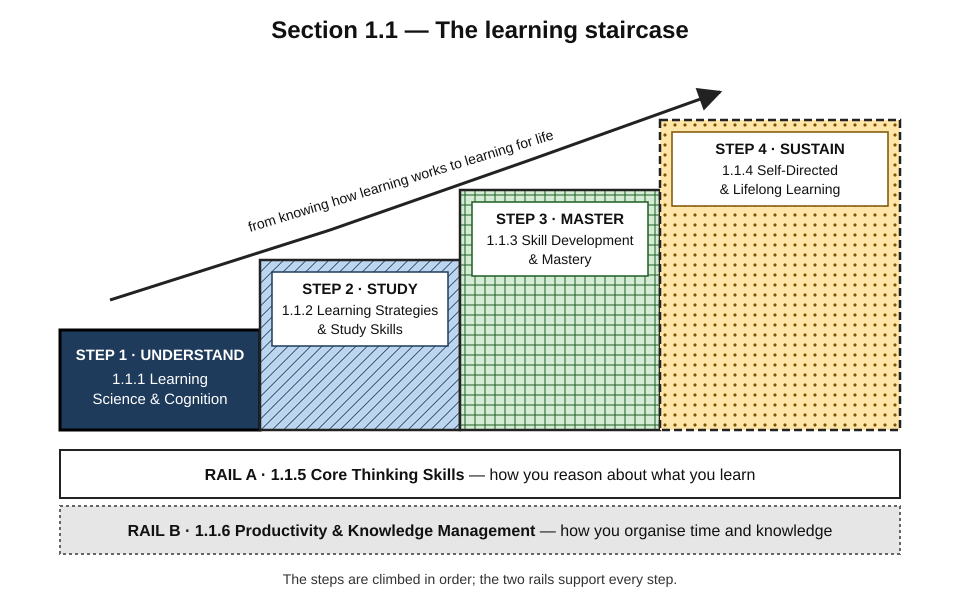
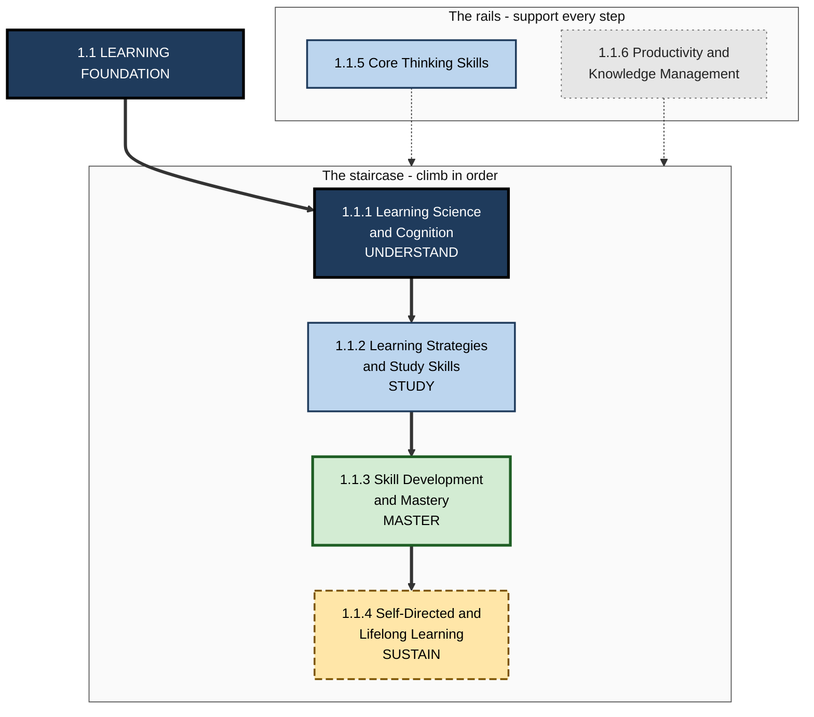
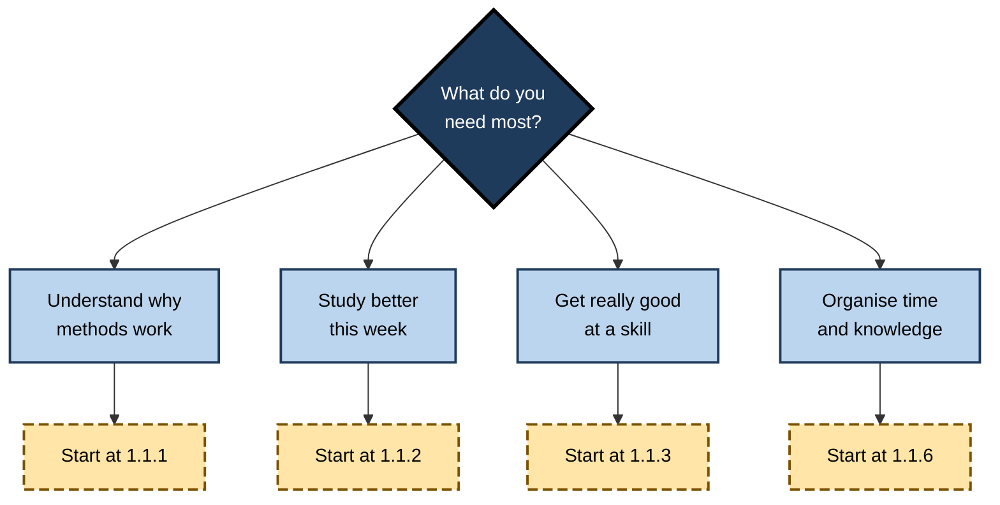

# 1.1. Learning Foundation

> **Scope:** How learning works, how to study, how skills become mastery, how to keep learning for life, how to think clearly, and how to organise your time and knowledge. · **Contains:** 6 topics · 74 subtopics · **Level span:** Novice → Expert

---

## Overview

The Learning Foundation is the engine room of the whole map. Every other section — digital literacy, programming, leadership, job search — is something you have to *learn*. This section teaches the skill underneath all of them: learning itself, together with the thinking and organising skills that make learning effective.

It is built as a staircase. You first **understand** how memory, attention and motivation actually work. You then **study** with methods that the evidence shows are effective. You **master** skills through deliberate practice and feedback. And you **sustain** learning over a lifetime by directing it yourself. Two supporting rails run beneath the staircase: **thinking skills**, which let you reason about what you learn, and **productivity and knowledge management**, which let you organise time, notes and projects so learning actually happens.

*Figure 1.1-1 — The learning staircase.* Steps rise from understanding (dark) through studying (diagonal hatch) and mastering (cross-hatch) to sustaining (dots, dashed border). The two rails at the bottom support every step.

---

## Why It Matters

**Learning ability is the most transferable career asset.** Technologies, tools and job titles change; the ability to pick up the next one quickly does not go out of date. Employers in recent large surveys rank curiosity and lifelong learning among the fastest-rising core skills, and expect a large share of current skills to change within the decade.

**Most people were never taught how to learn.** Many of the habits people rely on — re-reading, highlighting, cramming, studying one topic in a single long block — feel productive but are among the least effective methods measured. Well-tested alternatives such as retrieval practice and spacing are much more effective, yet surveys of students repeatedly find they are under-used.

**AI changes how we learn, not whether we need to.** AI tutors and assistants can accelerate learning or quietly replace it. Recent controlled studies show that unrestricted AI help can raise practice scores while lowering what people can do on their own afterwards, and that well-designed AI tutoring can help. Knowing the science lets you use AI to learn faster instead of to learn less.

**Organisations depend on it.** Onboarding, upskilling, reskilling and knowledge transfer are all learning problems. Managers, team leads, trainers and L&D professionals who understand learning science design better programmes and measure them honestly.

---

## Structure at a Glance

**Figure 1.1-2 — The six topics of the Learning Foundation.**

*How to read it:* thick arrows are the recommended order; dotted arrows show the two supporting topics feeding every step.

---

## What Each Part Covers

| Topic | Subtopics | Core question | You will be able to... |
|---|---|---|---|
| **1.1.1 Learning Science & Cognition** | 13 | How does learning actually work in the mind and brain? | Explain memory, attention, cognitive load, schemas, neuroplasticity, metacognition, motivation and transfer — and use them to judge any learning method. |
| **1.1.2 Learning Strategies & Study Skills** | 13 | Which study methods work, and how do I use them? | Apply active recall, retrieval practice, spacing, interleaving, elaboration and dual coding; read and solve problems effectively; avoid common study mistakes. |
| **1.1.3 Skill Development & Mastery** | 12 | How does a beginner become an expert? | Use deliberate practice, feedback and error-based learning; build habits and consistency; move through the stages of skill toward mastery. |
| **1.1.4 Self-Directed & Lifelong Learning** | 12 | How do I run my own learning for a whole career? | Set learning goals, build roadmaps, capture and organise information, reflect, track progress, learn with AI and with communities, and teach others. |
| **1.1.5 Core Thinking Skills** | 12 | How do I think clearly and well? | Reason logically, think critically, analytically, systemically and creatively, solve problems, research, make decisions and avoid cognitive biases. |
| **1.1.6 Productivity & Knowledge Management** | 12 | How do I organise time, attention and knowledge? | Manage time and focus, take useful notes, run a personal knowledge system, plan goals and projects, and build a sustainable productivity lifestyle. |

**1.1.1 Learning Science & Cognition** is the scientific base. Its thirteen subtopics run from learning how to learn, cognitive science and cognitive psychology, through attention, working memory, long-term memory, consolidation and schemas, to cognitive load theory, neuroplasticity, metacognition, motivation and emotion, and transfer.

**1.1.2 Learning Strategies & Study Skills** turns that science into technique: active learning and recall, retrieval practice, spaced repetition, interleaving, elaboration and dual coding, plus reading, problem-solving, time management, productivity, self-testing and the study mistakes to avoid.

**1.1.3 Skill Development & Mastery** addresses performance rather than knowledge: how skills are acquired, deliberate practice, stages of skill development, building expertise and pattern recognition, feedback and error-based learning, habits, consistency and discipline, performance optimisation, applying knowledge, and what mastery really means.

**1.1.4 Self-Directed & Lifelong Learning** puts you in charge: self-directed learning, goals and plans, roadmaps, information capture, reflection and journaling, learning analytics, AI-assisted learning, building a personal learning system, continuous improvement, lifelong learning, learning communities and teaching others.

**1.1.5 Core Thinking Skills** covers the reasoning toolkit: critical and logical thinking, problem solving, research, analytical and systems thinking, creativity, decision making, cognitive biases, argument analysis, mental models and applied thinking.

**1.1.6 Productivity & Knowledge Management** covers the operating system around learning: time management, note-taking, personal knowledge management, productivity frameworks, goal setting, focus and deep work, digital organisation, information management, habits, personal task and project management, reflection and a sustainable pace.

---

## How to Use This Part

| If you are... | Recommended route | Depth |
|---|---|---|
| **New to learning science** | 1.1.1 subtopic A (Learning How to Learn), then 1.1.2 in full, then the rest of 1.1.1 | Levels 1–3 |
| **A student or exam-taker** | 1.1.2 first for immediate gains, then 1.1.1 to understand why it works | Levels 1–3, plus Myths tables |
| **A professional upskilling fast** | 1.1.2, 1.1.3 and 1.1.4 G (AI-Assisted Learning) | Levels 3–4 |
| **A manager, trainer or L&D designer** | 1.1.1 in full at Levels 4–5, then 1.1.3 and 1.1.4 | Levels 4–5 |
| **Someone feeling overwhelmed** | 1.1.6 (time, focus, sustainable pace), then 1.1.1 D (Attention & Focus) | Levels 1–3 |

**Figure 1.1-3 — Where to start depending on your goal.**

*How to read it:* choose the need that fits you best; the dashed box shows the topic to open first.

---

## Core Principles

1. **Learning is a lasting change you can use later, unaided** — not a feeling of familiarity and not a good performance during practice.
2. **Effortful methods beat easy ones.** Retrieval, spacing, interleaving and generation feel harder and usually work better ("desirable difficulties").
3. **Memory is built in stages.** Attention gates what enters, working memory is tiny, long-term memory is vast, and consolidation — including sleep — makes learning stick.
4. **Prior knowledge is the biggest single influence on new learning.** Schemas determine what you notice, understand and remember.
5. **Monitor and regulate.** Metacognition — knowing what you know and adjusting — separates efficient learners from busy ones.
6. **Motivation and emotion are part of cognition**, not separate from it.
7. **Transfer is the point.** Learning is valuable when it carries over to new problems and real work.
8. **Use AI to think more, not less.** Configure tools to question, hint and critique rather than to do the work you are trying to learn.

---

## Novice-to-Pro Progression

| Level | What competence looks like in the Learning Foundation |
|---|---|
| **Novice** | Knows that re-reading and cramming are weak; tries self-testing and spacing. |
| **Foundations** | Can explain memory, attention and cognitive load in plain language; uses retrieval, spacing and interleaving routinely. |
| **Practitioner** | Runs a personal learning system with goals, notes, reviews and delayed self-checks; reaches professional competence in new skills quickly. |
| **Advanced** | Understands the mechanisms, debates and limits of the evidence; adapts methods to the subject, the person and the context. |
| **Expert / Pro** | Designs learning for teams and organisations, measures it by delayed performance and transfer, and integrates AI so that it builds rather than replaces capability. |

---

## Key Takeaways

- The Learning Foundation is the **engine of the whole map**: it makes every later section faster to learn.
- It is a **staircase** — understand, study, master, sustain — supported by **thinking** and **productivity** rails.
- **Popular study habits are often the weakest**; evidence-based methods feel harder and work better.
- **AI can accelerate or replace learning** — the science tells you how to make it accelerate.
- Managers and L&D professionals should read the **advanced levels** to design and measure learning properly.
- Start with **1.1.1 A. Learning How to Learn** if you are unsure where to begin.
