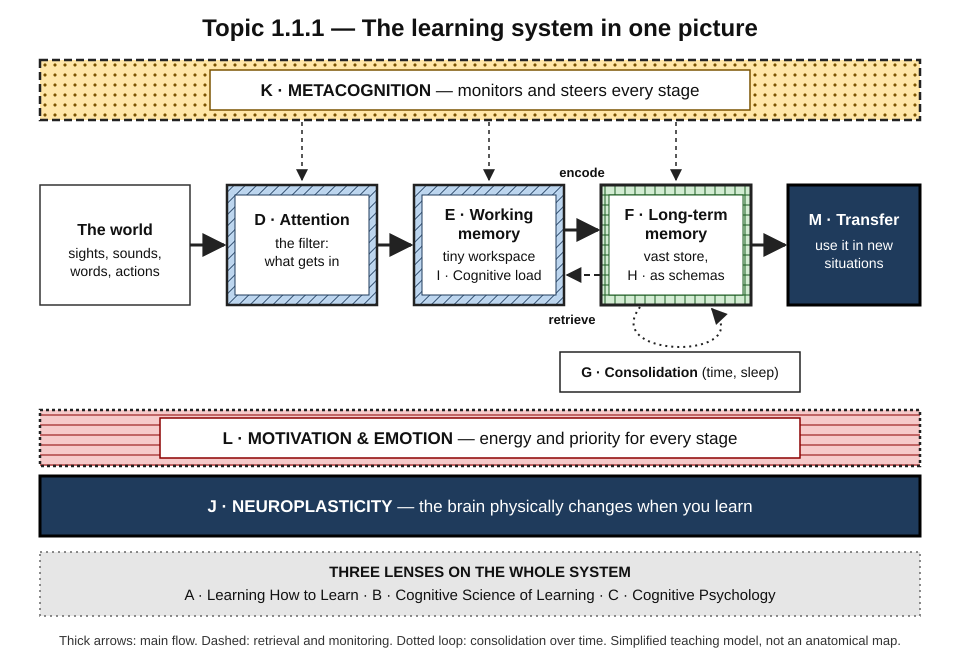
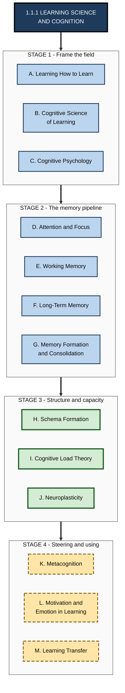
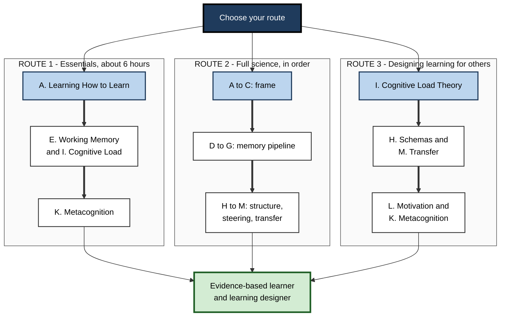

# 1.1.1. Learning Science & Cognition

> **Scope:** The science of how people learn — from attention and memory to schemas, cognitive load, brain plasticity, metacognition, motivation and transfer — and how to use it at work. · **Contains:** 13 subtopics · 156 notes · **Level span:** Novice → Expert

---

## Overview

This topic explains what is actually happening in the mind and brain when someone learns. It is the scientific base of the whole Learning Foundation: study strategies, skill development, self-directed learning and productivity methods all work — or fail — because of the mechanisms described here.

The topic follows the journey of a piece of knowledge. Something in the world catches your **attention**. It enters **working memory**, a tiny mental workspace that is easily overloaded (**cognitive load**). If it is processed meaningfully, it is **encoded** into **long-term memory**, where it is stored as part of organised knowledge structures called **schemas**. Over hours, nights and months it is **consolidated** — strengthened and reorganised — and it can later be **retrieved** and **transferred** to new situations. Throughout, **metacognition** monitors and steers the process, **motivation and emotion** supply energy and priority, and **neuroplasticity** — the brain's capacity to change physically — makes all of it possible.

Three subtopics frame the rest: **Learning How to Learn** gives the practical overview, **Cognitive Science of Learning** gives the interdisciplinary scientific view, and **Cognitive Psychology** gives the experimental study of mental processes such as perception, reasoning, decision making and expertise.

*Figure 1.1.1-1 — The learning system in one picture.* The middle row is the main flow, from the world through attention, working memory and long-term memory to transfer. Metacognition (dotted band, top) monitors it; motivation and emotion (lined band) energise it; neuroplasticity (dark base) is its biological foundation. The grey band lists the three framing lenses.

---

## Why It Matters

**It lets you tell good advice from bad.** Learning is surrounded by folklore — learning styles, "we only use 10% of our brains", brain-training games that make you smarter in general, multitasking as a skill. Knowing the underlying science lets you judge any new method, app or AI tool on its merits.

**It explains why effective learning feels hard.** Because working memory is limited, retrieval strengthens memory and consolidation takes time, the methods that work best often feel slower and more effortful. Without the science, learners abandon the right methods for the comfortable ones.

**It is the basis of professional learning design.** Instructional designers, L&D teams, technical trainers, product teams building education tools and managers onboarding new hires all rely on these principles — cognitive load theory, worked examples, spacing, retrieval, schema building and transfer — to design training that changes on-the-job performance.

**It matters more in the AI era.** AI assistants can take over attention, memory and reasoning work. The science of cognitive offloading, metacognition and desirable difficulty explains when that helps and when it quietly erodes skill — and how to configure AI tools so they build expertise instead of replacing it.

---

## Structure at a Glance

**Figure 1.1.1-2 — The thirteen subtopics grouped into four stages.**

*How to read it:* the stages run top to bottom in the recommended order. Solid-bordered boxes cover how memory works; thick-bordered boxes cover how knowledge is structured and how the brain adapts; dashed boxes cover how learning is steered, energised and applied.

---

## What Each Part Covers

| Subtopic | Core question | Notes |
|---|---|---|
| **A. Learning How to Learn** | What is learning, and how do I learn effectively? | 12 |
| **B. Cognitive Science of Learning** | How do mind and brain process, store and retrieve information? | 12 |
| **C. Cognitive Psychology** | How do perception, reasoning, decisions and expertise work? | 12 |
| **D. Attention & Focus** | What gets into the mind, and how do I protect focus? | 12 |
| **E. Working Memory** | How does the mind's small workspace limit and enable learning? | 12 |
| **F. Long-Term Memory** | What kinds of lasting memory are there, and how do I strengthen them? | 12 |
| **G. Memory Formation & Consolidation** | How do memories become stable — and what helps or harms that? | 12 |
| **H. Schema Formation** | How is knowledge organised, and how does prior knowledge shape learning? | 12 |
| **I. Cognitive Load Theory** | How should learning be designed so the mind is not overloaded? | 12 |
| **J. Neuroplasticity** | How does the brain physically change when we learn? | 12 |
| **K. Metacognition** | How do I know what I know, and steer my learning? | 12 |
| **L. Motivation & Emotion in Learning** | Why do we want to learn, and how do feelings affect it? | 12 |
| **M. Learning Transfer** | How does learning carry over to new situations and real work? | 12 |

**A. Learning How to Learn** is the entry point: what learning is, the science behind it, how the brain acquires knowledge, types of learning, conscious and unconscious learning, the learning-styles myth, growth mindset, learning blocks, evidence-based techniques, meta-learning and daily application.

**B. Cognitive Science of Learning** gives the interdisciplinary view: the information-processing model, perception and attention, encoding, retrieval, forgetting and the forgetting curve, cognitive biases, dual-process theory, language and thought, embodied cognition and development across the lifespan.

**C. Cognitive Psychology** covers the experimental science of mental processes: sensation and perception, pattern recognition and categorisation, concepts and mental representations, language comprehension, problem solving and reasoning, decision making under uncertainty, intelligence, expertise, cognitive ageing and individual differences.

**D. Attention & Focus** explains attention as the gateway to learning: types of attention, selective and sustained attention, the limits of multitasking, attentional bottlenecks, digital distraction, deep work and flow, mindfulness, environment design, attention restoration and long-term focus training.

**E. Working Memory** examines the mind's workspace: the Baddeley–Hitch model and its components, capacity limits, chunking, working memory in learning and problem solving, development, and what the evidence says about working-memory training.

**F. Long-Term Memory** maps the lasting store: explicit and implicit memory, episodic, semantic, procedural and prospective memory, encoding strategies, retrieval cues and context, interference, false and reconstructive memory, emotion and techniques for long-term retention.

**G. Memory Formation & Consolidation** goes to the biological processes: stages of memory formation, synaptic plasticity and long-term potentiation, sleep, the hippocampus, systems consolidation and reconsolidation, stress, nutrition, exercise, memory disorders, spaced practice and daily habits.

**H. Schema Formation** explains how knowledge is organised: what schemas are, their origins in psychology, assimilation and accommodation, prior knowledge, scripts, reading comprehension, activating schemas, misconceptions, conceptual change and building expert schemas.

**I. Cognitive Load Theory** turns working-memory limits into design rules: intrinsic, extraneous and germane load, the worked-example, split-attention, redundancy and expertise-reversal effects, segmenting and sequencing, multimedia principles and low-load learning design.

**J. Neuroplasticity** covers how the brain changes: Hebbian learning, structural and functional plasticity, critical periods, adult plasticity and neurogenesis, experience-dependent change, myelination and skill, recovery after injury, lifestyle factors, stress and trauma, common myths, and harnessing plasticity for learning.

**K. Metacognition** covers thinking about thinking: metacognitive knowledge, monitoring and regulation, knowing what you don't know, illusions of knowing, self-regulated learning, planning, self-evaluation, developing awareness, metacognition in problem solving, and teaching it to others.

**L. Motivation & Emotion in Learning** covers the energy of learning: intrinsic and extrinsic motivation, self-determination theory, expectancy-value theory, mastery and performance goals, emotion and memory, anxiety, curiosity, boredom, positive emotion, productive confusion and frustration, and emotional regulation.

**M. Learning Transfer** covers the ultimate goal: near and far transfer, positive and negative transfer, conditions that promote transfer, contextual variability, abstract principles, analogical reasoning, transfer-appropriate processing, teaching for transfer, domain-specific versus general skills, and how to measure and design for transfer.

---

## How to Use This Part

**Figure 1.1.1-3 — Three routes through the topic.**

*How to read it:* each route is a column; follow its thick arrows. All three routes lead to the same goal at different depths.

| Reader | Route | Levels to read |
|---|---|---|
| Curious beginner | Route 1 | 1–3 |
| Student or self-learner who wants the full picture | Route 2 | 1–4 |
| Manager, trainer, instructional designer, L&D professional | Route 3, then the rest | 3–5 |
| Engineer or analyst who wants to learn faster | Route 1, then F, G and M | 2–4 |

---

## Core Principles

1. **Learning and performance differ.** What you can do during practice is a poor guide to what you will retain; judge learning by delayed, unaided performance.
2. **Attention is the gate.** What is not attended to is mostly not learned. Protecting focus is a learning strategy.
3. **Working memory is the bottleneck.** It holds only a few meaningful chunks at once; good instruction and good study manage that limit.
4. **Long-term memory is effectively vast** but depends on encoding and retrieval. Retrieving information strengthens it more than re-reading it.
5. **Consolidation takes time and sleep.** Spacing learning over days lets memories stabilise; sleep is part of learning, not a break from it.
6. **Knowledge is structured.** Schemas let experts see patterns, chunk information and learn faster; misconceptions are faulty schemas that must be actively replaced.
7. **Design for the load.** Remove unnecessary load, manage essential complexity, and adapt support as expertise grows.
8. **The brain stays changeable**, though how much and how fast varies with age, practice and health.
9. **Metacognition, motivation and emotion steer everything.** Accurate self-monitoring, a sense of autonomy and competence, and manageable emotion are conditions for effective learning.
10. **Transfer is the goal and is not automatic.** It must be designed for through varied practice, abstraction and explicit connection to new contexts.

---

## Novice-to-Pro Progression

| Level | What competence looks like in Learning Science & Cognition |
|---|---|
| **Novice** | Knows that learning happens in stages — attention, working memory, long-term memory — and that popular methods like re-reading are weak. |
| **Foundations** | Explains the main models (information processing, Baddeley–Hitch, cognitive load, schemas, forgetting curve) in plain language and spots common myths. |
| **Practitioner** | Chooses study and practice methods from the science; manages attention, load and spacing in their own learning; uses AI tools without offloading the learning itself. |
| **Advanced** | Understands mechanisms, boundary conditions and live debates — for example the replication record of certain effects, the limits of working-memory training and the scope of adult neurogenesis. |
| **Expert / Pro** | Designs training, onboarding, documentation and AI-assisted learning for others using these principles, and measures success by retention and on-the-job transfer. |

---

## Key Takeaways

- Learning follows a **pipeline**: attention → working memory → long-term memory → consolidation → retrieval → transfer.
- **Working memory is small**, so managing **cognitive load** is central to effective learning and teaching.
- **Retrieval, spacing and sleep** turn fragile new memories into durable knowledge.
- **Schemas and prior knowledge** shape what people notice, understand and remember.
- **Metacognition, motivation and emotion** steer the whole system.
- **Neuroplasticity** means the brain keeps changing with experience throughout life.
- **Transfer to real work** is the true test of learning and must be designed for.
