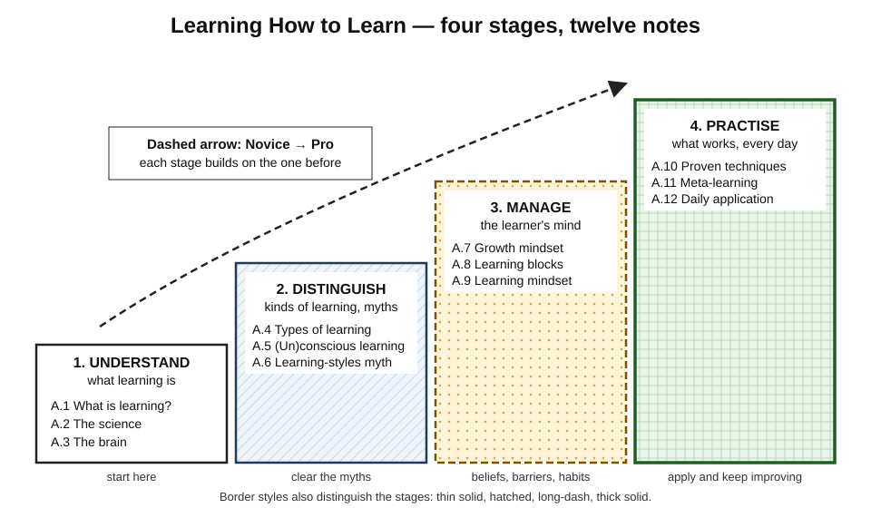
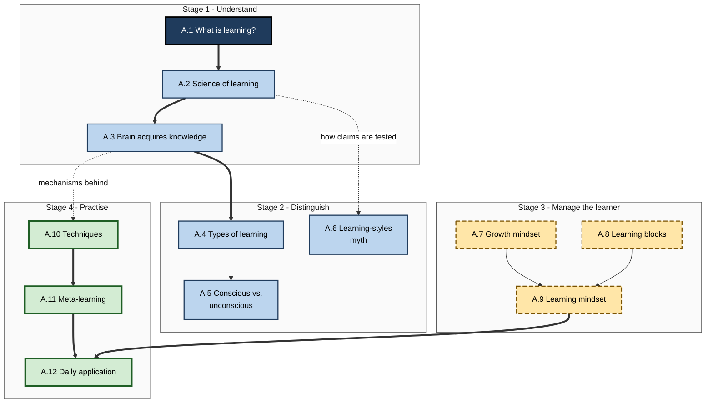
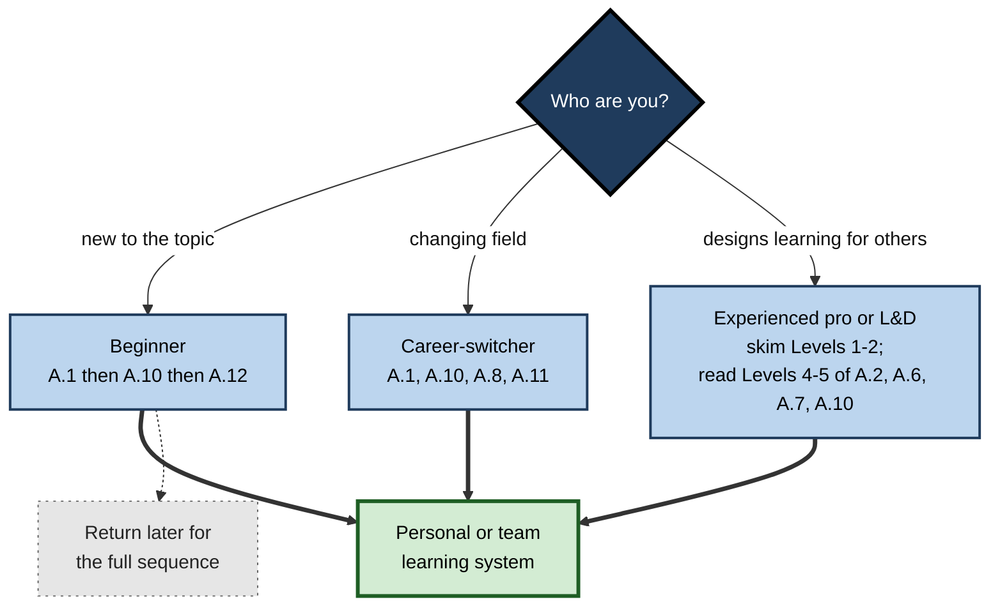

# A. Learning How to Learn

> **What this subtopic is about:** What learning actually is, how science studies it, how the brain acquires knowledge, which kinds of learning exist, which popular beliefs are myths, how beliefs and barriers shape a learner, and which techniques and daily habits turn effort into lasting capability.
>
> **Who it is for:** Anyone who learns for work — students, career-switchers, individual contributors, managers, trainers and L&D professionals · **Notes in this subtopic:** 12 · **Level span:** Novice → Expert

---

## Overview

Almost everyone was taught *what* to learn; almost nobody was taught *how* to learn. This subtopic fills that gap. It begins with a precise definition of learning and the single most important idea in modern learning science — that performance during practice and learning that lasts are different things. It then explains how learning science gathers evidence, how the brain captures and consolidates knowledge, and how learning comes in different kinds.

The middle of the subtopic clears away myths, most notably learning styles, and turns to the learner: beliefs about ability, the blocks that stop effort turning into progress, and the habits that make learning continuous. The final stage is practical: the techniques with the strongest evidence, the skill of improving your own learning over time, and the small daily routines that apply all of it inside a normal working week.

*Figure A-1 — Learning How to Learn in four stages.* The twelve notes form a staircase: understand learning, distinguish its kinds and myths, manage the learner, and practise effectively. Each stage uses a different border style so the figure reads in black and white.

---

## Why It Matters

- **Skills age quickly.** Tools, platforms and practices change within a few years; the ability to learn fast and well is the one skill that does not go out of date.
- **Most people use weak methods.** Re-reading, highlighting and cramming remain the most common study habits, even though decades of research favour self-testing and spacing.
- **Organisations measure the wrong things.** Satisfaction scores and completion rates reward experiences that feel smooth, not ones that build durable capability.
- **AI changes the stakes.** Generative AI can raise immediate output while reducing what people learn. Knowing the difference between assisted performance and real learning is now a core professional skill.
- **Myths are expensive.** Learning styles, "21-day habits" and "10% of the brain" still shape training budgets and personal study plans.

---

## What You Will Learn

| # | Note | Core question it answers | Primary level |
|---|---|---|---|
| A.1 | What is Learning? | What counts as learning, and how is it different from performance? | Novice → Advanced |
| A.2 | The Science of Learning | How do we know what works, and how strong is the evidence? | Foundations → Expert |
| A.3 | How the Brain Acquires Knowledge | What happens in the brain from experience to durable knowledge? | Foundations → Advanced |
| A.4 | Types of Learning | What kinds of learning exist, and which methods fit each? | Novice → Practitioner |
| A.5 | Conscious vs. Unconscious Learning | What do we learn without noticing, and when can intuition be trusted? | Foundations → Advanced |
| A.6 | Learning Styles Myths vs. Evidence | Does matching teaching to a learning style help, and what differences do matter? | Novice → Advanced |
| A.7 | Growth Mindset for Learners | How do beliefs about ability affect learning, and how strong is the evidence? | Novice → Advanced |
| A.8 | Identifying Your Learning Blocks | Why am I stuck, and how do I find the real cause? | Practitioner |
| A.9 | Building a Learning Mindset | Which attitudes and habits make learning continuous? | Practitioner → Expert |
| A.10 | Evidence-Based Learning Techniques | Which techniques work best, why, and under what conditions? | Practitioner → Advanced |
| A.11 | Meta-Learning: Learning About Learning | How do I get better at learning itself? | Practitioner → Expert |
| A.12 | Applying Learning Science Daily | How do I apply all of this inside a normal working day? | Practitioner → Expert |

---

## Concept Map

**Figure A-2 — How the twelve notes relate.**

*How to read it:* each titled box is a stage; thick arrows show the main line of the argument; dotted arrows show where one note supplies the evidence or mechanism behind another.

---

## Recommended Learning Path

1. **Start with A.1.** Everything else depends on the learning-versus-performance distinction.
2. **Read A.10 early if you are short of time.** It gives the most immediately useful changes to how you study.
3. **Then A.2 and A.3** for the "why" behind the techniques.
4. **A.4, A.5 and A.6** sharpen your judgement about kinds of learning and clear away myths.
5. **A.7, A.8 and A.9** turn to the learner — beliefs, barriers and habits.
6. **Finish with A.11 and A.12**, which assemble everything into a personal system.

**Figure A-3 — Paths through the subtopic by starting point.**

*How to read it:* pick the branch that matches you; all paths end in a working learning system.

A beginner should read every level of A.1, A.10 and A.12 first. A seasoned professional can skim Levels 1–3 of most notes and concentrate on Levels 4–5, where the evidence debates, recent findings and organisational applications live.

---

## The Big Ideas in Brief

**A.1 — What is Learning?** Learning is a relatively permanent change in knowledge, skill or disposition caused by experience. Its most important consequence is that **performance during training is not the same as learning**: easy, massed, assisted practice can look excellent and fade fast, while effortful, spaced practice — desirable difficulties — feels harder and lasts. Learning can only be judged by delayed, unaided checks, and AI-assisted performance is not evidence of learning.

**A.2 — The Science of Learning.** Learning science combines neuroscience, cognitive psychology, education and workplace research, and relies on controlled comparisons rather than intuition. A small core of principles — retrieval, spacing, interleaving, prior knowledge, limited working memory, feedback and meaning — is well supported. Effects typically shrink and vary in real courses, so implementation quality and honest measurement matter.

**A.3 — How the Brain Acquires Knowledge.** Knowledge moves through four stages: attend, encode, consolidate, retrieve. The hippocampus captures new memories quickly; replay during sleep and rest gradually builds them into the slower-learning neocortex. Every retrieval rebuilds a memory. Most forgetting can be traced to a specific failed stage.

**A.4 — Types of Learning.** Learning can be classified by mechanism (association, consequences, observation, understanding), by memory system (declarative versus procedural) and by outcome (facts, concepts, skills, habits, attitudes). Matching the method and the test to the type is one of the fastest ways to improve training.

**A.5 — Conscious vs. Unconscious Learning.** Much learning happens without awareness, through repeated exposure to patterns. Explicit learning is fast for rules; implicit learning builds intuition and fluency through volume. Intuition is trustworthy only in regular environments after extensive practice with clear feedback. Expert knowledge is partly tacit and must be drawn out deliberately.

**A.6 — Learning Styles Myths vs. Evidence.** Matching instruction to a "visual", "auditory" or "kinaesthetic" style does not improve learning; well-designed tests rarely find the required crossover pattern. Preferences are real, but the content should decide the format, and personalisation should target prior knowledge, performance and accessibility.

**A.7 — Growth Mindset for Learners.** Beliefs that ability can grow shape responses to difficulty and feedback. The evidence shows small, conditional effects — strongest for learners facing difficulty and in supportive environments — rather than large universal ones. The useful form is effort plus strategy plus help, backed by organisational signals.

**A.8 — Identifying Your Learning Blocks.** Being stuck is a symptom. Underlying causes fall into knowledge gaps, poor strategies, overload, emotional blocks, motivational blocks and environmental or physical factors — often stacked. Diagnose before fixing, fix designs when many people struggle at the same point, and refer to professional support when needed.

**A.9 — Building a Learning Mindset.** A learning mindset combines curiosity, a learning orientation, openness to feedback, intellectual humility and habits. It is built from small repeated behaviours over months, depends on psychological safety, and in organisations is measured by behaviour rather than slogans.

**A.10 — Evidence-Based Learning Techniques.** Retrieval practice and spacing have the strongest evidence; interleaving, self-explanation and elaboration help under the right conditions; re-reading, highlighting and summarising are weak alone. Effective techniques feel harder. Recent classroom meta-analyses confirm the benefits but show smaller, more variable effects than laboratory studies.

**A.11 — Meta-Learning: Learning About Learning.** Getting better at learning itself means mapping a new domain before starting (why, what, how), knowing your own patterns, and applying the science — then running retrospectives so each project starts smarter. "Learning to learn" is real, and strategies transfer best when embedded in real content.

**A.12 — Applying Learning Science Daily.** Six habits — retrieve, space, reflect, get feedback, protect attention, sleep — fit into a daily, weekly and monthly system that takes minutes. After-action reviews turn work into lessons, and with AI in the workflow the rule is: attempt first, then ask.

---

## Novice-to-Pro Progression

| Level | What competence looks like here |
|---|---|
| **NOVICE** | Knows that feeling productive is not the same as learning; swaps some re-reading for self-testing; spreads study over days. |
| **FOUNDATIONS** | Uses the vocabulary — retrieval, spacing, consolidation, declarative and procedural, meshing hypothesis, growth and fixed mindsets — and can explain each to a colleague. |
| **PRACTITIONER** | Runs delayed unaided checks, diagnoses personal learning blocks, builds a meta-learning map before new skills, and keeps a daily and weekly learning routine. |
| **ADVANCED** | Explains mechanisms and evidence quality, including the lab-to-classroom gap, replication debates (mindset, stereotype threat) and the AI-offloading evidence; recognises myths and over-claims. |
| **EXPERT / PRO** | Designs training, onboarding and AI-supported learning around these principles; measures delayed performance and on-the-job transfer; builds learning cultures through rituals, incentives and psychological safety. |

---

## Where This Shows Up at Work

| Situation | What this subtopic changes |
|---|---|
| **Onboarding new hires** | Short spaced sessions, unaided checkpoints and time-to-independence metrics instead of slide marathons. |
| **Certifications and upskilling** | Retrieval, spacing and interleaved practice instead of re-reading and last-week cramming. |
| **Buying learning products** | Evidence grading of vendor claims; scepticism towards style-based personalisation and unverified retention figures. |
| **Engineering and data teams** | After-action reviews, explanatory code reviews, captured tacit knowledge, and guidelines for AI assistants that protect skill growth. |
| **Sales and customer teams** | Spaced scenario questions and role-plays scored later, not end-of-session quizzes. |
| **Leadership and culture** | Praise for learning and strategy, blameless reviews, protected learning time, leaders who model not-knowing. |
| **Personal career growth** | A learning log, a meta-learning map for each new skill, and a deliberate choice of what to keep in your head versus delegate to tools. |

---

## Capstone Exercises

1. **Cold-check audit (Novice → Practitioner).** Pick three things you "learned" last month. Without notes or AI, explain or do each. Record what survived, and diagnose the failed stage for anything that did not.
2. **Technique switch (Practitioner).** For your next two weeks of study, replace half your re-reading with retrieval practice and spread sessions over at least four days. Compare a delayed, unaided check with your previous approach.
3. **Myth sweep (Advanced).** Review one training programme or study guide you use. List every claim that relies on learning styles, "brain-based" language, or unverified figures; rewrite each with an evidence-based alternative.
4. **Block diagnosis (Practitioner → Advanced).** Choose a skill you have stalled on. Run the six-category learning-block audit, identify the stacked causes, and run a targeted fix for three weeks.
5. **Programme redesign (Expert / Pro).** Take a one-off workshop in your organisation and redesign it: pretest, short sessions with retrieval, spaced scenario follow-ups, an unaided performance check at six weeks, and a transfer metric. Include a rule for how AI assistants are used during practice.
6. **Personal learning system (all levels).** Build your meta-learning map for one new skill, set up the daily-weekly-monthly routine, and hold a retrospective after 90 days.

---

## Key Takeaways

- **Learning is a lasting change in capability**, and it is different from — sometimes opposite to — performance during practice.
- **Judge learning by delayed, unaided checks**, not by how fluent or productive study felt.
- **Retrieval and spacing** are the best-supported techniques; effective learning usually feels harder.
- The brain learns in stages — **attend, encode, consolidate, retrieve** — and sleep is part of learning.
- **Learning styles matching is a myth**; personalise on prior knowledge and needs instead.
- **Mindset effects are real but modest**; environments, incentives and strategy matter more than slogans.
- Being stuck has **diagnosable causes**; fix the cause, and fix the design when many are stuck.
- **Meta-learning and daily routines** turn knowledge of learning science into compounding growth.
- With AI, **attempt first, then ask** — tool-assisted output is not evidence that you learned.
