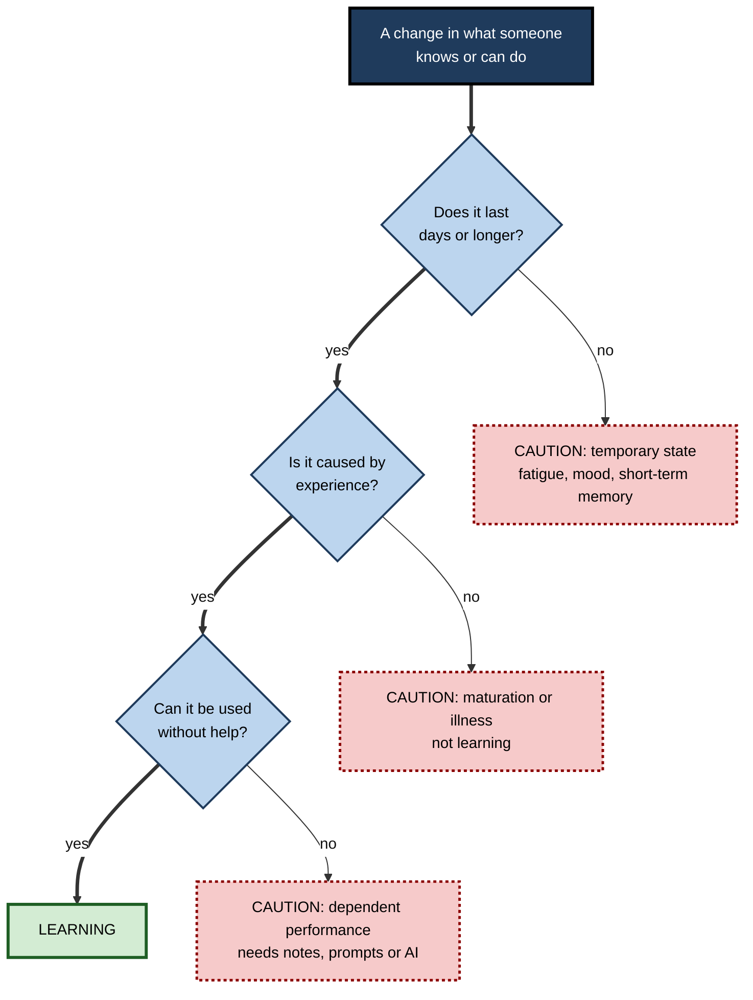
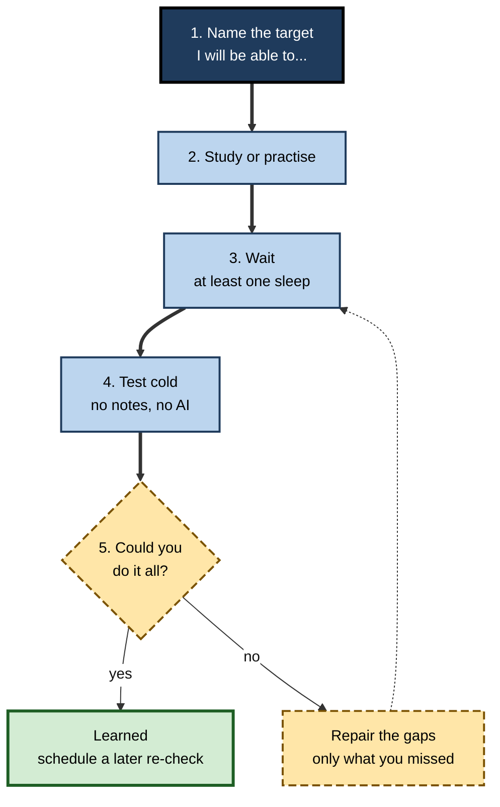
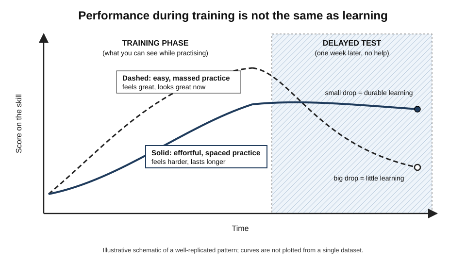
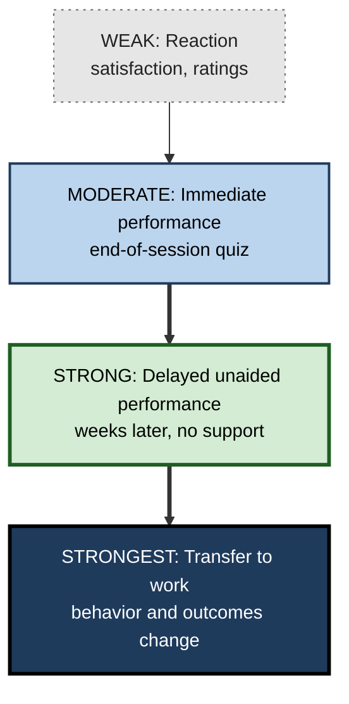

# A.1. What is Learning?

> **In one sentence:** Learning is a lasting change in what you know, can do, or tend to do, caused by experience rather than by tiredness, mood, luck or growing older.
>
> **Why it matters:** Every career skill — coding, selling, leading, analysing — is built by learning. People who understand what learning actually is stop confusing "it felt productive" with "I got better", and they improve faster for the rest of their working lives.
>
> **Level span:** Novice → Expert · **Reading time:** ~18 min · **Builds on:** nothing — start here

---

## The Learning Ladder

| Level | Badge | After this level you can... |
|---|---|---|
| 1 | NOVICE | Explain in your own words what learning is and give everyday examples. |
| 2 | FOUNDATIONS | Use the standard definition, name its three parts, and tell learning apart from things that only look like learning. |
| 3 | PRACTITIONER | Check whether *you* actually learned something, using delayed, unaided tests instead of feelings. |
| 4 | ADVANCED | Explain the learning–performance distinction, desirable difficulties, and the main scientific views of learning. |
| 5 | EXPERT / PRO | Design training, onboarding and AI-assisted work so that people learn, and measure it credibly. |

---

## Level 1 · Novice — The Big Picture

Think about the first time you rode a bicycle, used a spreadsheet, or spoke in a meeting. At first it was clumsy, slow and effortful. Weeks later you did it without thinking. Something inside you changed, and that change stayed. That lasting change is **learning**.

A helpful analogy is a path across a grassy field. The first person to walk across leaves almost no trace. If people keep walking the same route, a visible path forms, and soon walking that way becomes the easiest option. Your brain works in a similar way: repeated, meaningful experience leaves a lasting "path" that makes the knowledge or skill easier to use next time.

You have already experienced learning — and its fake twin — many times:

- You learned your home address so well that you can recall it half-asleep. **That is learning.**
- You crammed for an exam, did fine the next morning, and a month later could not remember a single formula. **That was mostly short-term performance, not much learning.**
- You watched a cooking video, felt sure you "got it", then failed when you tried the recipe yourself. **That was familiarity, not learning.**

The key idea for a beginner: **learning is what is still there later, when you need it, without help.**

---

## Level 2 · Foundations — Core Concepts

### The standard definition

Psychology's most widely used definition describes learning as **a relatively permanent change in behavior or knowledge that results from experience**. Each part of that sentence does real work:

1. **Relatively permanent** — the change persists. It excludes temporary states such as fatigue, caffeine, stress, a lucky guess, or a fact held in mind for ten seconds.
2. **Change in behavior or knowledge** — learning can be visible (you can now type quickly) or invisible until needed (you now understand why a database index speeds up queries). The change is in your *capability*, whether or not you are using it right now.
3. **Results from experience** — practice, observation, reading, instruction, feedback, mistakes. This excludes changes caused by physical maturation, injury or illness.

**Figure A.1-1 — The three tests that separate learning from look-alikes.**

*How to read it:* follow the thick arrows down; only a change that passes all three questions counts as learning. Dotted-border boxes are look-alikes.

### Three things learning changes

| What changes | Everyday example | Workplace example |
|---|---|---|
| **Knowledge** (knowing *that*) | Paris is the capital of France | GDPR applies to personal data of people in the EU |
| **Skills** (knowing *how*) | Riding a bike | Writing a SQL join, running a client workshop |
| **Dispositions** (tending *to*) | Checking the weather before going out | Writing tests before shipping code |

### Key terms

| Term | Plain meaning |
|---|---|
| **Learning** | A lasting change in capability caused by experience. |
| **Performance** | What you can do right now, under current conditions. Observable; can be temporary. |
| **Memory** | The system that stores what learning produces. Learning and memory are two sides of one coin. |
| **Retention** | How much of what was learned is still available after a delay. |
| **Transfer** | Using what you learned in a new situation that differs from where you learned it. |
| **Encoding** | Getting information into memory. |
| **Retrieval** | Getting information back out of memory when you need it. |

---

## Level 3 · Practitioner — Putting It to Work

The most practical consequence of the definition is this: **you cannot tell whether you learned something by how the study session felt, or by how well you did during it.** You can only tell by testing later, without help.

### The Delayed Unaided Check — a five-step method

1. **Name the target.** Write one sentence: "After this, I will be able to ___ without notes." Be specific: "explain the difference between a process and a thread with an example", not "understand operating systems".
2. **Study or practise** using whatever method you choose.
3. **Wait.** Let at least one night of sleep pass, ideally a few days. Same-session checks mostly measure short-term memory.
4. **Test yourself cold.** Close the notes, the browser and the AI assistant. Explain it aloud, write it down, or do the task from scratch.
5. **Compare and repair.** Check against the source. Whatever you could not produce is what you have not yet learned. Study that part again, then repeat from step 3.

**Figure A.1-2 — The learning check loop.**

*How to read it:* the thick path is one cycle; the dotted arrow is the repair loop you repeat until the cold test succeeds.

### Worked example — a junior data analyst learning window functions

| | Before (performance trap) | After (learning-focused) |
|---|---|---|
| **Activity** | Reads a tutorial, copies three examples, they all run. | Reads the tutorial, then closes it and writes three queries from a plain-English spec. |
| **Feeling** | "That was easy, I've got it." | "That was harder than expected." |
| **Check** | None. | Two days later, writes a running total and a rank-within-group query cold. |
| **Result a week later** | Has to search for the syntax again from scratch. | Writes both from memory; looks up only one edge case. |

### Common mistakes at this level

- **Judging by fluency.** Re-reading makes material feel familiar, and familiarity is easily mistaken for knowledge.
- **Testing immediately.** A same-session check mostly measures what is still in short-term memory.
- **Testing with help.** If the notes, an IDE autocomplete, or an AI assistant fills the gap, you measured the tool, not yourself.
- **Vague targets.** "Understand Kubernetes" cannot be checked; "explain what a Deployment does and write one from memory" can.

---

## Level 4 · Advanced — Mechanisms, Models & Evidence

### Learning versus performance

The most important idea in modern learning science is that **learning and performance are different things, and they can move in opposite directions**. Performance is what can be observed during training; learning is the more durable change that must be *inferred* from later, unaided performance. Psychologists Robert and Elizabeth Bjork, building on decades of earlier work, made this distinction central to how the field thinks about study and training.

*Figure A.1-3 — Performance during training versus learning measured later.* Dashed line: easy, massed practice looks strong in training and drops sharply at the delayed test. Solid line: effortful, spaced practice looks weaker in training but holds up. The pattern is well replicated; the curves are schematic.

Two consequences follow:

- **Conditions that boost performance now can harm learning.** Blocked repetition, re-reading and immediate hints make practice smoother and feel productive, yet often produce weaker long-term retention and transfer.
- **Conditions that slow performance now can help learning.** Spacing practice out, mixing problem types, generating answers before seeing them, and retrieving from memory make training feel harder. These are called **desirable difficulties**: difficulties that trigger the processes that build durable memory. Difficulties are only desirable if the learner can eventually overcome them; a task that is simply impossible teaches little.

### Why the feeling of learning misleads us

People judge their own learning largely from **processing fluency** — how easily material is read, recognised or recalled in the moment. Fluency is a poor guide because it is driven heavily by recency and repetition. The result is the **illusion of competence**: learners systematically prefer the methods that feel effective over the ones that are effective, and overestimate how much they will remember.

### The main scientific views of learning

| View | Core idea of learning | What it explains well | What it misses |
|---|---|---|---|
| **Behaviorism** | A change in observable behavior through association and reinforcement. | Habits, conditioning, reward-driven behavior. | Inner understanding, reasoning. |
| **Cognitivism** | A change in mental representations — encoding, storing and retrieving information. | Memory, attention, problem solving, why some study methods beat others. | Social and cultural context. |
| **Constructivism** | Learners actively build new understanding on top of prior knowledge. | Misconceptions, why prior knowledge matters so much. | Can be misread as "minimal guidance is best", which evidence does not support for novices. |
| **Sociocultural** | Learning happens through participation in communities and shared practices. | Apprenticeship, workplace learning, communities of practice. | Fine-grained memory mechanisms. |
| **Neuroscientific** | Learning is a change in connections between neurons (synaptic plasticity). | The biological basis for repetition, sleep and spacing effects. | Cannot by itself tell you how to teach. |

These views are complementary lenses, not rival teams. Contemporary learning science mostly works at the cognitive level, informed by neuroscience below and social context above.

### Boundary conditions and nuances

- **"Relatively permanent" is relative.** All memories can fade or be overwritten; learning is a *shift in the odds* that knowledge will be available, not a guarantee.
- **Learning can be invisible.** Classic experiments on **latent learning** showed animals learned a maze layout without reward and revealed it only when a reward appeared. Capability can exist before it shows up as performance.
- **Some learning is unwanted.** Bad habits, misconceptions and phobias are learned by the same mechanisms as good skills.

### What recent research added: learning with AI in the loop

Generative AI has made the learning–performance distinction urgent. In a large field experiment with high-school mathematics students, published in 2025, students given an unrestricted GPT-4 assistant performed much better on practice problems, but when the AI was removed, they performed *worse* on the exam than students who had never used it. A second version of the tutor, designed to give hints rather than answers, largely removed the harm. Reviews of **cognitive offloading** — letting a tool do mental work for you — reach a consistent conclusion: offloading improves immediate task performance and efficiency, and can reduce the deeper processing that builds lasting memory and skill, especially for learners with weak self-regulation.

The lesson is not "avoid AI". It is that **tool-assisted performance is not evidence of learning**, and that how a tool is designed and used decides whether it builds or replaces capability.

---

## Level 5 · Expert / Pro — Professional Mastery

### Designing for learning, not for the feeling of learning

Professionals who build learning for others — learning and development (L&D) teams, engineering managers, consultants running enablement, product teams building education tools — face a structural trap: **the signals that are easiest to collect reward performance, not learning.** End-of-course satisfaction scores, completion rates and in-session quiz scores all favour smooth, fluent, easy experiences. Durable learning often comes from experiences that participants rate as harder.

Experts counter this with deliberate design choices:

| Design choice | Performance-optimised (looks good) | Learning-optimised (works) |
|---|---|---|
| Practice schedule | One long session | Shorter sessions spaced over days or weeks |
| Practice mix | Blocked: all problems of one type | Interleaved: mixed types after initial exposure |
| Checks | Immediate quiz with notes open | Delayed, closed-book, scenario-based checks |
| Help | Answers on demand | Hints first; answer only after an attempt |
| AI assistants | Generate the work | Coach, question and critique the learner's own work |
| Success metric | Satisfaction and completion | Delayed performance and on-the-job behavior change |

### Measuring learning credibly

A mature measurement approach separates four questions, from weakest to strongest evidence:

1. **Reaction** — did people like it? (Useful for engagement; nearly useless as evidence of learning.)
2. **Immediate performance** — could they do it at the end of the session?
3. **Delayed, unaided performance** — can they still do it weeks later without support? This is the closest practical measure of learning.
4. **Transfer to work** — are they doing it on the job, and did a work outcome move?

**Figure A.1-4 — Evidence strength for "did they learn?"**

*How to read it:* evidence gets stronger moving down; most organisations stop at the top two boxes.

### Professional scenario

**Role:** Engineering manager onboarding six new developers to a large codebase.
**Situation:** Last quarter's onboarding scored 4.7/5 in feedback, yet new joiners still needed senior help for routine changes after two months.
**What the pro does:** Replaces two days of slide walkthroughs with short daily sessions over three weeks; each ends with a small change the new joiner makes *alone*, with an AI assistant configured to explain and question rather than write the code. At week six, each developer completes an unaided "first-responder" task on a real ticket. Feedback scores dip slightly; time-to-independent-change drops, and seniors' interrupt load falls. The manager reports the second metric to leadership, not the first.

### Expert-level judgement

- **Learning is a hidden variable.** Treat every metric as a proxy and ask what it is a proxy *for*.
- **Expect the dip.** Effective methods often make learners feel less confident during training. Warn people in advance so they do not abandon the method.
- **Decide what must live in the head.** In the AI era, not everything needs to be memorised. Experts deliberately choose which knowledge must be fluent in memory (for judgement, speed, spotting errors, and supervising AI output) and which can safely be looked up.
- **Protect productive struggle.** If a tool removes all effort from a task that people are supposed to be learning, it will likely remove the learning too.

---

## Myths vs. Evidence

| Myth | What the evidence shows |
|---|---|
| "If it felt easy and I followed along, I learned it." | Ease and familiarity are poor indicators; fluent study often produces weak retention. |
| "Doing well in practice means I've mastered it." | Practice performance can be high while learning is low, especially with massed practice or heavy assistance. |
| "Learning is just storing information." | Learning also changes skills and dispositions, and depends on how well knowledge can be *retrieved* and *transferred*. |
| "Using AI to do the task teaches me the task." | Field evidence shows unrestricted AI help can raise practice scores while lowering unaided performance later. |
| "Adults can't really learn new things." | The adult brain remains capable of substantial learning throughout life; method and practice matter more than age for most skills. |
| "Harder study always means better learning." | Only *desirable* difficulties help — ones the learner can eventually overcome. Impossible tasks teach little. |

## Practitioner Toolkit

**Learning-check checklist**

- [ ] I wrote a specific "I will be able to..." target.
- [ ] I waited at least one night before checking.
- [ ] I tested without notes, search or AI.
- [ ] I compared my answer to the source and listed gaps.
- [ ] I re-studied only the gaps and scheduled another check.
- [ ] I recorded the result (date, target, pass/partial/fail).

**Template — one-line learning log**

| Date | Target ("I will be able to...") | Cold check date | Result | Gap to repair |
|---|---|---|---|---|
| | | | | |

**AI-use rule of thumb for learners:** attempt first, ask for a hint second, ask for the answer last — and re-do the task alone afterwards.

## Self-Check

1. **[NOVICE]** In your own words, what is learning?
2. **[NOVICE]** Why is cramming the night before often not real learning?
3. **[FOUNDATIONS]** What are the three parts of the standard definition, and what does each exclude?
4. **[FOUNDATIONS]** Give one example each of learned knowledge, skill and disposition from your work.
5. **[PRACTITIONER]** Why must a learning check be delayed and unaided?
6. **[ADVANCED]** What is the difference between learning and performance? Give a case where they move in opposite directions.
7. **[ADVANCED]** What makes a difficulty "desirable"?
8. **[EXPERT / PRO]** A training programme has excellent satisfaction scores. What would you measure to find out whether people learned?
9. **[EXPERT / PRO]** How would you configure an AI assistant so it supports learning rather than replacing it?

### Answer Key

1. A lasting change in what you know, can do or tend to do, caused by experience.
2. It boosts short-term performance, but much of it is not retained; a delayed test usually shows large losses.
3. *Relatively permanent* (excludes temporary states), *change in behavior or knowledge* (the capability itself), *results from experience* (excludes maturation, illness, injury).
4. Answers vary — for example: knowing the company's data-retention policy; writing a unit test; habitually reviewing your own pull request before requesting review.
5. Immediate checks measure short-term memory; aided checks measure the tool. Only a delayed, unaided check shows what lasted in you.
6. Performance is what you show now; learning is the durable change inferred later. Massed practice raises performance now but often yields less long-term retention than spaced practice.
7. It slows performance during training but triggers processes that strengthen memory and transfer — and the learner can overcome it with effort.
8. Delayed, unaided performance on realistic tasks, plus on-the-job behavior and the business outcome the training was meant to move.
9. Make it give hints and questions before answers, require the learner's attempt first, and finish with an unaided re-do or explanation.

## Key Takeaways

- Learning is a **lasting change in capability caused by experience** — not a feeling and not a single good performance.
- **Performance now and learning later are different**, and can move in opposite directions.
- The feeling of fluency is an unreliable judge; use **delayed, unaided checks** instead.
- **Desirable difficulties** — spacing, mixing, generating, retrieving — feel harder and usually work better.
- **AI-assisted performance is not evidence of learning**; design tool use so the learner still does the thinking.
- Professionals measure learning by **delayed performance and on-the-job transfer**, not satisfaction scores.

## Glossary

| Term | Meaning |
|---|---|
| Cognitive offloading | Using an external tool or person to perform mental work you could otherwise do yourself. |
| Desirable difficulty | A challenge during learning that slows immediate performance but improves long-term retention and transfer. |
| Disposition | A learned tendency to act in a certain way. |
| Encoding | The process of getting information into memory. |
| Illusion of competence | Believing you have learned something because it feels familiar or fluent. |
| Latent learning | Learning that is not shown in performance until there is a reason to use it. |
| Learning | A relatively permanent change in behavior or knowledge resulting from experience. |
| Performance | Observable behavior or results at a given moment; may be temporary. |
| Processing fluency | The subjective ease of reading, recognising or recalling something. |
| Retention | The amount of learning still available after a delay. |
| Retrieval | Bringing stored information back into use. |
| Transfer | Applying learning to a new situation. |
