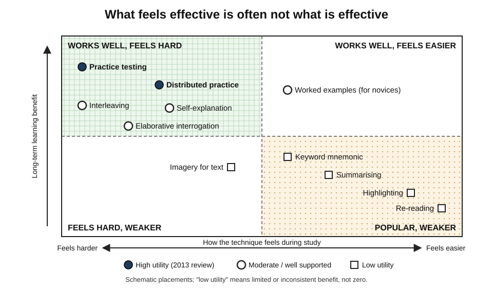
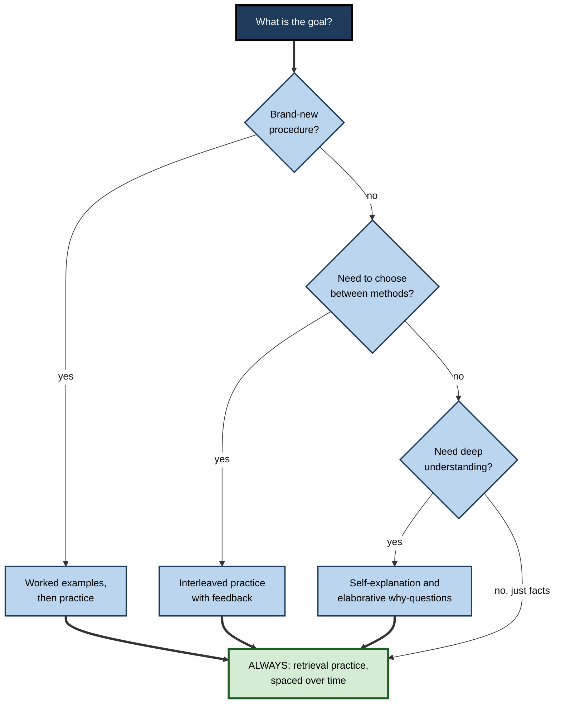
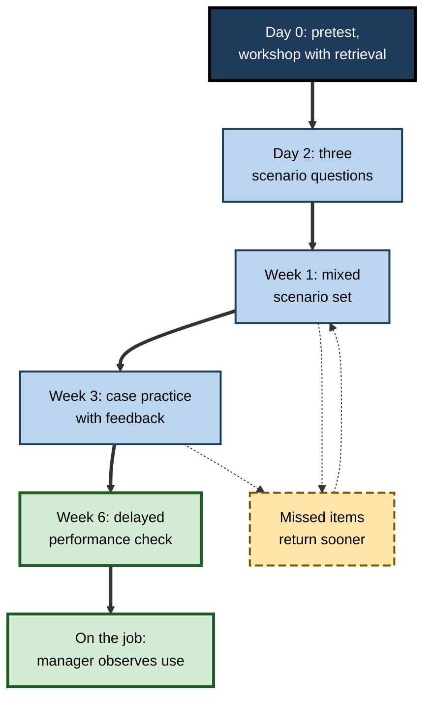

# A.10. Evidence-Based Learning Techniques

> **In one sentence:** A handful of study and training techniques — especially testing yourself, spacing practice over time, mixing problem types, and explaining ideas — have been shown in hundreds of experiments to beat popular habits like re-reading and highlighting.
>
> **Why it matters:** The same number of hours can produce very different results depending on technique. Choosing the right techniques is the cheapest performance improvement available to any learner, trainer or L&D team.
>
> **Level span:** Novice → Expert · **Reading time:** ~19 min · **Builds on:** learning versus performance; desirable difficulties; the four-stage learning journey

---

## The Learning Ladder

| Level | Badge | After this level you can... |
|---|---|---|
| 1 | NOVICE | Name the two best-supported techniques and the most popular weak ones. |
| 2 | FOUNDATIONS | Describe the main techniques and their evidence ratings. |
| 3 | PRACTITIONER | Combine techniques into a weekly routine and a training design. |
| 4 | ADVANCED | Explain why each technique works, its boundary conditions, and what recent meta-analyses changed. |
| 5 | EXPERT / PRO | Build techniques into programmes, tools and AI tutors at scale, and evaluate them honestly. |

---

## Level 1 · Novice — The Big Picture

Ask people how they study and most will say: read the material again, highlight the important parts, make a summary. These feel productive. The page becomes familiar; the highlighter makes progress visible.

Learning scientists have tested these habits against alternatives, and the results are surprisingly consistent. The two winners are simple:

1. **Test yourself.** Close the book and try to recall or apply what you studied. This is called **retrieval practice**.
2. **Spread it out.** Study the same material in several shorter sessions across days or weeks instead of one long session. This is called **spacing**.

An analogy: building muscle. Watching someone lift weights (re-reading) does little. Lifting yourself (retrieval) builds strength. Lifting a little three times a week (spacing) beats one exhausting session a month.

You have already experienced this if you have ever found that explaining something to a friend made you understand it better, or that a language app's daily quizzes stuck better than a weekend of cramming.

The beginner's takeaway: **swap some re-reading for self-testing, and swap one long session for several short ones.** These two changes alone usually make a large difference.

---

## Level 2 · Foundations — Core Concepts

### The landmark review

In 2013, John Dunlosky, Katherine Rawson, Elizabeth Marsh, Mitchell Nathan and Daniel Willingham reviewed the evidence for ten common learning techniques and rated their **utility** — how widely and reliably they help across learners, materials and settings. A 2021 meta-analysis by Gregory Donoghue and John Hattie, pooling over 240 studies, broadly confirmed the ordering, while noting that even the lower-rated techniques usually beat doing nothing.

| Technique | What you do | 2013 utility rating |
|---|---|---|
| **Practice testing** | Self-quizzing, flashcards, past papers, recall without notes | High |
| **Distributed practice** | Spreading practice across sessions over time | High |
| **Interleaved practice** | Mixing different types of problems in one session | Moderate |
| **Elaborative interrogation** | Asking and answering "why is this true?" | Moderate |
| **Self-explanation** | Explaining how new information relates to what you know, or explaining each step of a solution | Moderate |
| **Summarisation** | Writing summaries of material | Low |
| **Highlighting / underlining** | Marking text while reading | Low |
| **Keyword mnemonic** | Linking a word to a vivid image via a sound-alike keyword | Low |
| **Imagery for text** | Forming mental images while reading | Low |
| **Re-reading** | Reading material again | Low |

"Low" does not mean useless. It means the benefits are limited, inconsistent, or dependent on training and material.

### Other well-supported techniques

| Technique | Core idea | Best for |
|---|---|---|
| **Worked examples** | Study a fully solved problem before solving similar ones. | Novices learning procedures |
| **Dual coding** | Combine words with relevant visuals (diagrams, timelines). | Complex systems, processes |
| **Concrete examples** | Anchor abstract ideas in specific cases, ideally several varied ones. | Concepts and principles |
| **Pretesting and generation** | Try to answer before being taught. | Priming attention and later memory |
| **Successive relearning** | Retrieve to a criterion (for example, three correct recalls), then repeat in later sessions. | Durable mastery of key facts and concepts |
| **Feedback** | Compare your answer with the correct one, and act on the gap. | All techniques — feedback makes retrieval safer |

### Key terms

| Term | Plain meaning |
|---|---|
| **Retrieval practice** | Recalling information from memory to strengthen it. |
| **Testing effect** | The finding that retrieval improves later memory more than restudy does. |
| **Spacing effect** | The finding that spread-out practice beats massed practice for long-term retention. |
| **Interleaving** | Mixing different but related types of problems or topics within a session. |
| **Blocking** | Practising one type of problem repeatedly before moving to the next. |
| **Elaboration** | Adding meaning by connecting new information to what you know. |

*Figure A.10-1 — Feels effective versus is effective.* Techniques placed by how easy they feel during study (horizontal) and how much they typically help long-term learning (vertical), based on the 2013 utility ratings and later meta-analyses. The most popular techniques sit bottom-right; the most effective sit top-left. Placements are schematic.

---

## Level 3 · Practitioner — Putting It to Work

### A weekly study system using four techniques

1. **Start with a pretest (5 minutes).** Before studying a new topic, answer three questions on it. Wrong answers are fine — they prime attention.
2. **Study with elaboration (20–30 minutes).** Read or watch; after each section, answer "why?" and "how does this connect to what I know?". Use worked examples for procedures.
3. **Retrieve (10 minutes).** Close everything. Write or say what you remember; solve a problem from scratch. Check and correct.
4. **Space it.** Revisit with a short retrieval session after about 1 day, then about 1 week, then about 1 month. Longer delays suit longer retention goals.
5. **Interleave once basics are in place.** Mix problem types from different topics in a single practice set.

**Figure A.10-2 — Choosing a technique for the goal.**

*How to read it:* the technique depends on the goal, but every route ends in spaced retrieval — the common foundation.

### Worked example — preparing for a professional certification

| | Before | After |
|---|---|---|
| **Weeks 1–5** | Reads the official guide cover to cover, highlighting. | Reads one domain per week, with a 10-question pretest before and a closed-book recall after each chapter. |
| **Practice questions** | Saves all practice exams for the final week. | Takes a short mixed practice set every week from week two, covering all domains studied so far. |
| **Errors** | Notes the right answer and moves on. | Logs each error, explains *why* the right answer is right, and re-tests it a few days later. |
| **Final week** | Cramming and re-reading. | Light spaced review and one full timed exam. |
| **Result** | Feels prepared; scores near the pass line. | Feels less confident during study; passes comfortably and retains the material for the job. |

### Common mistakes at this level

- **Testing only by recognition.** Multiple-choice questions you can answer by spotting the familiar option are weaker than free recall or application.
- **Peeking too early.** Struggling for a moment before checking is part of the benefit.
- **Massing the "spaced" sessions.** Three reviews in one evening is still massed practice.
- **Interleaving too early.** Learners need basic competence with each type before mixing helps.
- **Abandoning the technique when it feels hard.** Difficulty is the signal that it is working.

---

## Level 4 · Advanced — Mechanisms, Models & Evidence

### Why retrieval works

Retrieving information does more than reveal what you know; it changes memory. Proposed mechanisms include strengthening and multiplying **retrieval routes**, updating the memory with the context of the current attempt, and making later study more efficient by revealing gaps. Meta-analyses have found reliable benefits of retrieval practice over restudy, typically medium in size in laboratory research, and benefits for transfer to related questions are smaller but present. Retrieval with **feedback** and with **successful** recall gives larger benefits — when initial retrieval mostly fails, the advantage over restudy shrinks.

### Why spacing works

Explanations include **study-phase retrieval** (each later session forces partial recall of earlier learning, which strengthens it), **encoding variability** (each session adds different contextual cues), and reduced attention when repetitions are massed. A practical finding from research by Nicholas Cepeda and colleagues is that the best gap between sessions grows with how long you need to remember — short gaps for a test next week, longer gaps for knowledge needed next year.

### Why interleaving works

Interleaving forces learners to decide *which* strategy fits each problem, rather than mindlessly repeating the strategy for the current block. It is strongest for learning categories that are easily confused (types of mathematics problems, painters' styles, bird species, diagnostic patterns). Evidence for interleaving is good in mathematics and category learning but less consistent elsewhere.

### What recent meta-analyses changed

- **The effects are real but smaller in real courses.** A 2025 meta-analysis of mathematics learning found a robust small-to-medium spacing benefit, larger in isolated laboratory-style learning than when embedded in real courses, and a smaller, less reliable benefit for retrieval practice in maths specifically. A 2024 study across nine introductory STEM courses found spaced retrieval helped clearly in only some of them.
- **Transfer is narrower than hoped.** Some 2025 classroom studies found retrieval helped for the specific content practised but not for related, unpractised content from the same lectures.
- **Individual differences matter at the margins.** Prior knowledge and initial retrieval success influence how much benefit learners get, but the techniques help most learners.

None of this overturns the core conclusion — spaced retrieval remains among the best-supported practices in education — but it tempers claims of large, universal effects and puts implementation quality centre stage.

### Boundary conditions summary

| Technique | Works best when | Watch out for |
|---|---|---|
| Retrieval practice | Feedback is given; recall is effortful but often successful | Very low initial success; trivial recognition questions |
| Spacing | Gaps match the retention goal | Gaps so long that everything is forgotten |
| Interleaving | Categories are confusable; basics are learned | Novices with no basics; unrelated topics |
| Worked examples | Learners are novices | Experts — the expertise reversal effect |
| Self-explanation | Learners are prompted and supported | Unsupported, vague explanations |
| Highlighting and summarising | Learners are trained to do them well | Used as a substitute for retrieval |

---

## Level 5 · Expert / Pro — Professional Mastery

### Building techniques into programmes

| Design element | How it embeds the techniques |
|---|---|
| **Pre-work** | Pretest questions rather than reading assignments. |
| **Live sessions** | Short input, then retrieval tasks, case discussions with "why?" prompts, worked examples for new procedures. |
| **Spaced follow-ups** | Scenario questions delivered at increasing intervals over weeks (by chat tool, email or learning platform). |
| **Practice sets** | Interleaved realistic cases after basics are mastered. |
| **Job aids** | Kept for rarely used details; core knowledge trained through retrieval. |
| **Assessment** | Delayed, free-response or performance tasks, not immediate recognition quizzes. |

**Figure A.10-3 — A spaced-retrieval training timeline.**

*How to read it:* the thick path is the default schedule with growing gaps; dotted arrows show adaptive scheduling, where missed items come back sooner.

### Professional scenario

**Role:** Product enablement lead at a software vendor.
**Situation:** Solutions engineers attend a two-day product launch training; within a month, sales calls show many cannot explain the new features' trade-offs.
**What the pro does:** Shortens the live event to one day with retrieval breaks, adds a pretest, and launches a six-week spaced programme of short scenario questions ("a customer says X — what do you recommend and why?") with feedback, increasing in interval and mixing old and new features. At week six, a recorded role-play is scored by managers. The pro reports delayed role-play scores and call-review data, comparing with the previous launch.

### AI tutors and techniques

AI makes the techniques cheap to deliver at scale — question generation, adaptive spacing, instant feedback, Socratic prompts. A 2025 randomised trial in a university physics course found a tutor deliberately designed around these principles outperformed a strong active-learning class. Other 2025 studies showed that AI used to supply answers raised practice scores but lowered unaided performance. The design rule: **AI should ask, prompt and give feedback — the learner must do the retrieval and the explaining.** Check AI-generated questions for accuracy and for testing understanding, not trivia.

### Honest evaluation

Expect smaller effects than the laboratory headlines. Compare with a realistic baseline, measure delayed performance, and look for effects on the specific outcomes you care about, including transfer to related tasks.

---

## Myths vs. Evidence

| Myth | What the evidence shows |
|---|---|
| "Re-reading and highlighting are the best ways to study." | They are among the least effective common techniques; self-testing and spacing are far better supported. |
| "Tests only measure learning." | Retrieval during tests produces learning — the testing effect. |
| "Cramming works if you're short on time." | It can support next-day performance but produces poor long-term retention. |
| "If practice feels easy and smooth, it's working." | Effective techniques often feel harder; fluency is a poor guide. |
| "Interleaving always helps." | It helps most with confusable categories after basic competence; less consistent in other domains. |
| "Lab effect sizes will apply to my course." | Effects usually shrink in real courses; implementation quality matters. |
| "AI study tools apply these techniques automatically." | Only if designed to; answer-giving tools can undermine retrieval. |

## Practitioner Toolkit

**Technique checklist for any study week**

- [ ] I pretested before new topics.
- [ ] I retrieved after every study session, without notes.
- [ ] I checked my answers and logged errors.
- [ ] I revisited older topics after growing gaps.
- [ ] I mixed problem types once basics were secure.
- [ ] I explained at least one idea aloud or in writing in my own words.

**Template — successive relearning card set**

| Item | Session 1 (date, correct recalls) | Session 2 | Session 3 | Status |
|---|---|---|---|---|
| | | | | Mastered / review |

**Spacing rule of thumb:** review after about 1 day, 1 week and 1 month; for knowledge needed for a year or more, keep a review every few months.

## Self-Check

1. **[NOVICE]** Which two techniques have the strongest evidence?
2. **[NOVICE]** Why does re-reading feel effective even though it is weak?
3. **[FOUNDATIONS]** What is the difference between interleaving and blocking?
4. **[FOUNDATIONS]** Name three techniques rated "moderate" in the 2013 review.
5. **[PRACTITIONER]** Design a two-week study plan for learning a new framework's core concepts.
6. **[ADVANCED]** Why does spacing work, according to two leading explanations?
7. **[ADVANCED]** What did 2024–2025 classroom evidence change about expectations?
8. **[EXPERT / PRO]** How would you redesign a one-off two-day training using these techniques?
9. **[EXPERT / PRO]** What design rules should an AI study tool follow?

### Answer Key

1. Practice testing (retrieval practice) and distributed practice (spacing).
2. It increases familiarity and fluency, which feel like knowing, but does little to strengthen retrieval.
3. Interleaving mixes problem types in a session; blocking practises one type repeatedly before moving on.
4. Interleaved practice, elaborative interrogation and self-explanation.
5. Example: day 1 pretest and study with worked examples; day 2 retrieval; day 4 build something small unaided; day 7 mixed retrieval quiz; day 10 explain concepts to a colleague; day 14 cold build plus quiz.
6. Study-phase retrieval (later sessions force recall of earlier learning) and encoding variability (different contexts add cues).
7. Effects are real but often smaller and less consistent in real courses, transfer can be narrow, and implementation quality matters.
8. Shorter live session with pretest and retrieval breaks; spaced scenario questions over weeks; interleaved case practice; delayed performance assessment.
9. Make the learner retrieve and explain first; give hints and feedback rather than answers; schedule spaced, mixed practice; check accuracy of generated content.

## Key Takeaways

- **Retrieval practice and spacing** are the best-supported techniques; make them the default.
- **Interleaving, self-explanation and elaboration** add value under the right conditions.
- **Re-reading, highlighting and summarising** are weak when used alone.
- Effective techniques **feel harder** — expect it and persist.
- Effects are **smaller in real settings** than in the lab; implementation quality matters.
- In the AI era, tools should **prompt the learner to retrieve and explain**, not supply answers.

## Glossary

| Term | Meaning |
|---|---|
| Blocking | Practising one type of problem repeatedly before switching. |
| Distributed practice | Spreading study across multiple sessions over time. |
| Elaborative interrogation | Generating explanations for why stated facts are true. |
| Interleaving | Mixing different but related problem types within a practice session. |
| Pretesting | Attempting questions on material before studying it. |
| Retrieval practice | Actively recalling information to strengthen memory. |
| Self-explanation | Explaining to oneself how information or solution steps fit together. |
| Spacing effect | Better long-term retention from spaced rather than massed practice. |
| Successive relearning | Retrieving items to a set criterion across multiple spaced sessions. |
| Testing effect | Better retention from retrieval practice than from restudying. |
| Worked example | A fully solved problem used to teach a procedure. |
