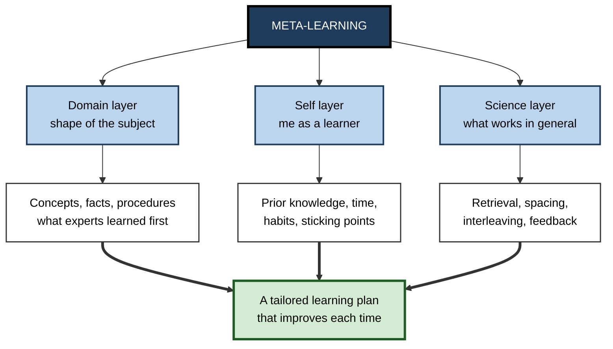
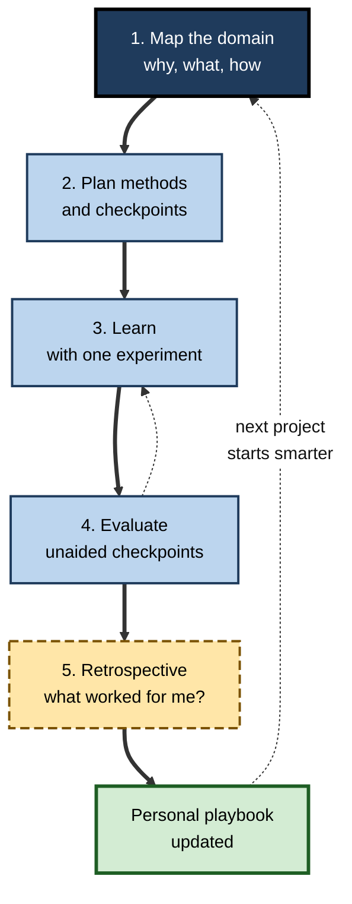

# A.11. Meta-Learning: Learning About Learning

> **In one sentence:** Meta-learning is getting better at learning itself — understanding how a new subject is structured before you dive in, knowing which methods work for you and for that kind of material, and improving your approach with every new thing you learn.
>
> **Why it matters:** Professionals change tools, domains and roles repeatedly over a career. Someone who has learned *how to learn* can pick up a new field in weeks instead of months, because they spend their time on the right things in the right way.
>
> **Level span:** Novice → Expert · **Reading time:** ~17 min · **Builds on:** evidence-based learning techniques; types of learning; learning blocks

---

## The Learning Ladder

| Level | Badge | After this level you can... |
|---|---|---|
| 1 | NOVICE | Explain the difference between learning a subject and learning *how to learn*. |
| 2 | FOUNDATIONS | Describe the three layers of meta-learning: the domain, yourself, and the science. |
| 3 | PRACTITIONER | Build a meta-learning map before starting any new skill, and run small personal learning experiments. |
| 4 | ADVANCED | Explain "learning to learn" research, from learning sets to strategy instruction, and its limits. |
| 5 | EXPERT / PRO | Build meta-learning capability in teams, and design reskilling that makes people faster learners, not just better-informed. |

---

## Level 1 · Novice — The Big Picture

Imagine two travellers arriving in a city they have never visited. The first starts walking immediately and wanders for days, discovering the layout by trial and error. The second spends twenty minutes with a map: where the centre is, how the districts connect, which areas matter for the trip. Both eventually learn the city, but the second learns it far faster — and gets better at learning *every* new city, because they now know to start with the map.

**Meta-learning** is learning to be the second traveller. "Meta" means "about", so meta-learning is learning about learning. It has three parts:

- **Learning about the subject's shape** before you start — what are the big pieces, what is hard, what matters most?
- **Learning about yourself as a learner** — which methods work for you, where you tend to get stuck, how much time you really need.
- **Learning about learning in general** — the science of what works, such as self-testing and spacing.

You have already done some meta-learning if you ever thought, "Last time I learned a language I gave up because I only used an app — this time I'll find a conversation partner," or "With new software, I learn fastest by building one small real project."

The beginner's takeaway: **before learning something new, spend a little time learning how to learn it.**

---

## Level 2 · Foundations — Core Concepts

### Origins of the term

The education researcher Donald Maudsley introduced "meta-learning" in 1979 to describe how learners become aware of, and increasingly in control of, their habits of perception, inquiry and learning. John Biggs later used it to describe students' awareness of, and control over, their own learning approach. The term is also used in machine learning for algorithms that "learn to learn" across many tasks — a useful analogy: each new task should be learned faster because of the ones before.

### Meta-learning versus metacognition

**Metacognition** is thinking about your own thinking *in the moment* — noticing you are confused, checking your understanding, adjusting strategy during a task. **Meta-learning** is the broader, longer-term layer: improving your overall approach to learning across subjects and over years. Metacognition is the engine; meta-learning is the long-term tuning of the engine.

### The three layers of meta-learning

| Layer | Question it answers | Example |
|---|---|---|
| **Domain layer** | How is this subject structured, and how do experts learn it? | Discovering that learning to cook is mostly procedural practice with feedback, while learning nutrition is mostly concepts. |
| **Self layer** | How do *I* learn this best, given my knowledge, constraints and habits? | Knowing that you stall after week three unless you have a deadline or partner. |
| **Science layer** | What does research say works for most learners? | Choosing spaced retrieval over re-reading. |

**Figure A.11-1 — The three layers of meta-learning.**

*How to read it:* each layer contributes different information; thick arrows show all three combining into a plan that you refine after every learning project.

### Key terms

| Term | Plain meaning |
|---|---|
| **Meta-learning** | Improving your ability to learn, across subjects and over time. |
| **Metacognition** | Awareness and control of your own thinking during a task. |
| **Learning set** | A learned general strategy for solving a class of problems faster — literally "learning to learn". |
| **Calibration** | How well your confidence matches your actual performance. |
| **Personal learning experiment** | A small, deliberate test of a learning method on yourself. |
| **Benchmarking** | Studying how successful people learned a skill, to borrow their path. |

---

## Level 3 · Practitioner — Putting It to Work

### The meta-learning map — a 60-minute preparation for any new skill

Spend roughly the first few percent of your planned learning time on this map. The writer Scott Young popularised a version of this "why, what, how" breakdown.

1. **Why?** Write the concrete purpose. "Pass the exam", "build a dashboard my team uses", "hold a basic conversation in Spanish". The purpose decides what to skip.
2. **What?** Split the skill into three kinds of material:
   - **Concepts** that must be *understood* (for example, how indexing works);
   - **Facts** that must be *remembered* (for example, function names, vocabulary);
   - **Procedures** that must be *practised* until fluent (for example, writing queries, conversation).
3. **How?** Find out how people who succeeded learned it. Look at a few syllabi, ask two practitioners, and note the common path and common traps.
4. **Pick methods per material.** Concepts: explanation, examples, self-explanation. Facts: spaced retrieval. Procedures: practice with feedback.
5. **Plan checkpoints.** Decide what you will be able to do, unaided, at weeks 2, 4 and 8.
6. **Set one personal experiment.** For example, "This time I'll do 15 minutes daily instead of two hours on Saturday."

**Figure A.11-2 — The meta-learning loop across projects.**

*How to read it:* the thick path is one learning project; the long dotted arrow carries lessons into the next project — that carry-over is meta-learning.

### Worked example — a consultant moving into healthcare analytics

| | Before (no meta-learning) | After (meta-learning map) |
|---|---|---|
| **Start** | Buys a 40-hour online course and starts at video 1. | Spends one hour: purpose (lead client workshops on hospital capacity within two months), splits into concepts, facts and procedures. |
| **Domain research** | — | Asks two healthcare analysts how they learned; both say "learn the data structures and billing codes first, statistics second". |
| **Methods** | Watches all videos in order. | Concepts via explanation and worked cases; codes via spaced flashcards; procedures via practice on a public hospital dataset. |
| **Checkpoints** | None until the client meeting. | Week 2: explain the payment model unaided. Week 4: build a basic capacity analysis. Week 8: run a mock workshop. |
| **Retrospective** | — | Notes that daily short sessions worked better than weekend blocks; adds this to the playbook. |

### Common mistakes at this level

- **Skipping the map** because starting feels more productive.
- **Over-planning** — the map should take hours, not weeks.
- **Copying someone else's path blindly** without adjusting for your own starting point and purpose.
- **Never doing a retrospective**, so each project starts from zero.

---

## Level 4 · Advanced — Mechanisms, Models & Evidence

### Learning to learn — the classic evidence

In 1949 the psychologist Harry Harlow gave monkeys hundreds of simple discrimination problems, each with new objects. Early on, each problem took many trials. After many problems, the monkeys solved new ones almost immediately: they had learned a general rule ("if the first choice is rewarded, stick; if not, switch"). Harlow called this a **learning set** — direct evidence that the ability to learn a *class* of problems improves with experience across many examples.

Similar "learning to learn" effects appear in humans: people who have learned several languages often learn the next one faster, partly due to shared vocabulary and structure, and partly because they have developed general strategies for vocabulary, grammar and practice.

### Teaching people how to learn

Research on teaching learning strategies offers a clear pattern:

- **Strategy instruction works best when embedded in subject learning.** Classic meta-analyses of study-skills programmes found that stand-alone "study skills" courses produce limited transfer; strategies taught in the context of real content, with practice and reflection, transfer better.
- **Knowing is not doing.** Students who learn that retrieval practice works often still default to re-reading. Changing behaviour requires experiencing the benefit personally — for example, a small experiment comparing their own results with and without self-testing.
- **Metacognition and self-regulation programmes** are consistently rated among the more cost-effective educational approaches in large evidence reviews, including guidance updated in 2025, provided they are explicit, embedded and practised.

### Calibration: the feedback that powers meta-learning

Meta-learning depends on accurate self-assessment, but people are often poorly **calibrated** — especially beginners, who may not know enough to see their own gaps. Delayed, unaided checks are the main antidote: they convert vague feelings into data you can learn from. Over time, people who regularly compare predicted and actual performance tend to become better calibrated.

### Domain structure matters

Different fields have different "shapes". Some are concept-heavy (economics, physics), some fact-heavy (anatomy, law), some procedure-heavy (programming, music, surgery), and many demand all three. A major part of expertise in learning is recognising the shape quickly and allocating effort accordingly — a point emphasised in writing about rapid self-directed skill acquisition. Evidence here is largely from expert interviews and case studies rather than controlled experiments, so treat it as a practitioner framework.

### Machine meta-learning as a mirror

In artificial intelligence, meta-learning algorithms train across many tasks so that a new task can be learned from very few examples. The analogy with human learning is imperfect, but it captures one insight: **exposure to varied learning tasks builds general learning capability**, which is one argument for deliberately learning across diverse domains during a career.

---

## Level 5 · Expert / Pro — Professional Mastery

### Building meta-learning capability in teams

| Practice | What it looks like |
|---|---|
| **Learning retrospectives** | After a team learns a new technology, a 30-minute retro: what accelerated us, what slowed us, what we'd do next time. |
| **Domain maps as shared assets** | A one-page "how to learn X here" map per key technology or process, maintained by the team. |
| **Expert path interviews** | Seniors record how they learned the domain — what to learn first, what to ignore. |
| **Learning experiments** | Teams trial a learning approach (for example, pair-learning versus solo courses) and compare unaided outcomes. |
| **Time-to-competence metrics** | Measure how long new joiners take to reach defined independent tasks, and how that changes. |

### Reskilling for adaptability

Organisations facing rapid technical change — including widespread adoption of AI tools — increasingly aim to build **learnability**: people's ability to acquire new skills quickly. Meta-learning is the practical core of that aim. A reskilling programme designed for meta-learning:

1. teaches the science layer briefly (retrieval, spacing, feedback);
2. has participants build a domain map for their target skill with a coach;
3. includes at least one personal learning experiment;
4. ends with a retrospective that updates a personal learning playbook.

The result is not only one new skill, but a faster start on the next one.

### Professional scenario

**Role:** Engineering manager whose team must move from one cloud provider to another within six months.
**Situation:** Previous technology migrations took longer than planned because everyone learned individually and inconsistently.
**What the pro does:** Week 1: the team builds a shared domain map — the 20% of services covering 80% of their workload, the concepts that differ most from the old provider, and the procedures that must be fluent. Two engineers who have used the new provider record "how I learned it" sessions. Learning is organised in pairs with weekly unaided build checkpoints. At month two and month five, the team holds learning retrospectives and updates the map. The migration finishes on time, and the map and retro notes become the template for the next technology change.

### AI-era meta-learning

- **AI as map-builder.** Assistants can draft a domain map, syllabus or list of common misconceptions quickly — but verify it with practitioners and sources, because confident errors are common.
- **AI as practice partner.** Use it for questions, explanations and feedback on your attempts, keeping the retrieval and production with you.
- **A new self-layer question:** "Which parts of this skill do I need in my head, and which can I safely delegate to tools?" Answering this well is now a core meta-learning competence.

---

## Myths vs. Evidence

| Myth | What the evidence shows |
|---|---|
| "Learning ability is fixed; some people are just fast learners." | Learning efficiency improves with prior knowledge, strategies and experience across varied tasks. |
| "A study-skills course will make people better learners." | Stand-alone courses transfer poorly; strategies embedded in real content and practised work better. |
| "If people know what works, they will do it." | Knowledge of effective strategies often fails to change habits without personal experience of the benefit. |
| "Planning how to learn wastes learning time." | A short mapping phase usually saves time by focusing effort on what matters. |
| "Meta-learning is the same as metacognition." | Metacognition is in-the-moment monitoring; meta-learning is the longer-term improvement of your whole approach. |
| "AI can plan my learning, so I don't need meta-learning." | AI drafts plans; judging, adapting and evaluating them is the meta-learning skill. |

## Practitioner Toolkit

**Meta-learning map template**

| Section | Your entry |
|---|---|
| Why — concrete purpose | |
| What — key concepts (understand) | |
| What — key facts (remember) | |
| What — key procedures (practise) | |
| How — how successful people learned it | |
| Methods per material type | |
| Checkpoints (weeks 2, 4, 8) — unaided tasks | |
| Personal experiment this time | |

**Retrospective questions (after any learning project)**

- [ ] What accelerated my learning most?
- [ ] What wasted the most time?
- [ ] Where did my confidence differ from my checkpoint results?
- [ ] Which method will I reuse next time?
- [ ] What did I learn about the *shape* of this kind of subject?
- [ ] What goes into my personal playbook?

## Self-Check

1. **[NOVICE]** What does "meta-learning" mean in plain words?
2. **[NOVICE]** Why might spending an hour planning save time overall?
3. **[FOUNDATIONS]** Name the three layers of meta-learning.
4. **[FOUNDATIONS]** How does meta-learning differ from metacognition?
5. **[PRACTITIONER]** Build a "what" breakdown (concepts, facts, procedures) for learning to give investor presentations.
6. **[ADVANCED]** What did Harlow's learning-set experiments show?
7. **[ADVANCED]** Why do stand-alone study-skills courses often fail to transfer?
8. **[EXPERT / PRO]** How would you build meta-learning into a team's adoption of a new technology?
9. **[EXPERT / PRO]** How does AI change meta-learning?

### Answer Key

1. Learning how to learn better — improving your approach to learning over time.
2. It focuses effort on what matters, picks suitable methods and avoids common traps.
3. Domain layer, self layer, science layer.
4. Metacognition is monitoring and controlling thinking during a task; meta-learning is improving your overall learning approach across projects and over time.
5. Concepts: how investors evaluate risk and growth, story structure. Facts: key metrics and company numbers. Procedures: delivering the pitch, handling questions — practised with feedback.
6. After solving many problems of one type, monkeys solved new ones almost immediately, showing that learning ability for a class of problems improves with experience.
7. Strategies taught out of context are hard to apply to real content, and knowing a strategy does not change habits without practice and experienced benefit.
8. Shared domain map, expert path sessions, pair learning, unaided checkpoints, retrospectives, and a reusable template for future changes.
9. AI can draft maps and provide practice and feedback, but plans must be verified, the learner must still do retrieval and production, and deciding what to keep in your head becomes a key skill.

## Key Takeaways

- Meta-learning is **getting better at learning itself**, across subjects and over time.
- It has three layers: **the domain's shape, yourself as a learner, and the science**.
- A short **meta-learning map** (why, what, how) before starting saves time.
- **Personal experiments and retrospectives** turn each project into better learning skill.
- "Learning to learn" is real — but strategies transfer best when **embedded and practised**, not taught in isolation.
- In the AI era, deciding **what to keep in your head versus delegate** is a central meta-learning skill.

## Glossary

| Term | Meaning |
|---|---|
| Benchmarking | Studying how successful learners acquired a skill. |
| Calibration | The match between confidence and actual performance. |
| Domain map | A short overview of a subject's concepts, facts and procedures and how experts learn it. |
| Learnability | The capacity to acquire new skills quickly. |
| Learning retrospective | A structured review of what helped and hindered a learning effort. |
| Learning set | A general strategy for solving a class of problems, acquired through experience with many examples. |
| Meta-learning | Improving one's ability to learn across subjects and over time. |
| Metacognition | Awareness and regulation of one's own thinking during a task. |
| Personal learning experiment | A deliberate, small test of a learning method on oneself. |
| Strategy instruction | Teaching learners explicit methods for learning, ideally embedded in subject content. |
