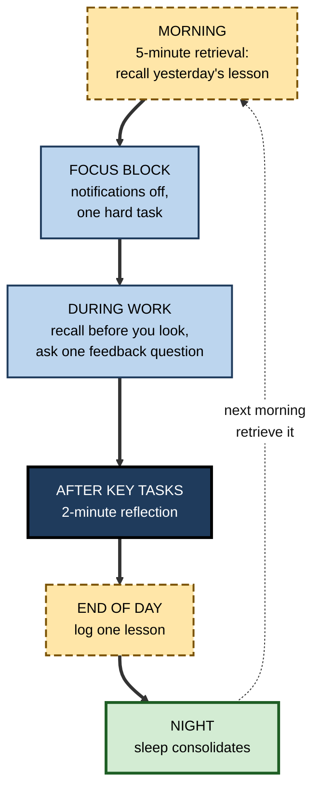
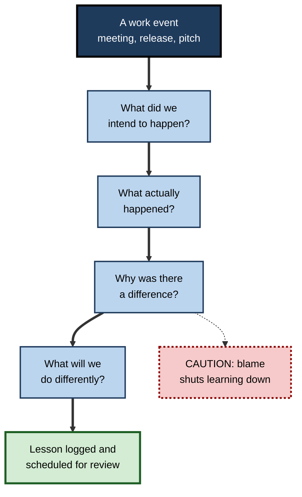

# A.12. Applying Learning Science Daily

> **In one sentence:** Applying learning science daily means turning a few proven principles — retrieve, space, reflect, sleep, protect attention, get feedback — into small routines that run inside your normal working day.
>
> **Why it matters:** Knowing the science changes nothing until it changes what you do on an ordinary Tuesday. Small daily routines, compounded over months, separate people who keep growing from people who merely stay busy.
>
> **Level span:** Novice → Expert · **Reading time:** ~17 min · **Builds on:** every earlier note in this subtopic — especially evidence-based techniques, learning mindset and meta-learning

---

## The Learning Ladder

| Level | Badge | After this level you can... |
|---|---|---|
| 1 | NOVICE | Name five tiny daily habits that apply learning science. |
| 2 | FOUNDATIONS | Connect each daily habit to the principle behind it. |
| 3 | PRACTITIONER | Run a personal daily and weekly learning system and learn from your own work. |
| 4 | ADVANCED | Explain the evidence for reflection, sleep, attention management and learning in the flow of work, and their limits. |
| 5 | EXPERT / PRO | Build learning science into team rituals, tools and management practice — including AI use. |

---

## Level 1 · Novice — The Big Picture

Most people think of learning as something that happens in courses: a training day, an online module, a certification. But most of what working adults learn, they learn — or fail to learn — during ordinary work: in meetings, code reviews, client calls, mistakes and conversations.

Learning science can be applied to all of that, using habits so small they fit into the gaps of a normal day:

- **Before a meeting:** take 60 seconds to recall what was decided last time — without opening the notes.
- **After a task:** ask yourself, "What would I do differently next time?"
- **At the end of the day:** write down one thing you learned.
- **At night:** sleep, because your brain consolidates the day's learning while you do.
- **Once a week:** quiz yourself on a few of those daily lessons.

An analogy: brushing your teeth. Nobody gets healthy teeth from a three-hour brushing session once a year. Two minutes twice a day does it. Learning works the same way.

You have already applied learning science if you ever rehearsed a presentation from memory instead of re-reading slides, or slept on a hard problem and found it clearer the next morning.

The beginner's takeaway: **you do not need more time to learn — you need to use small moments of the time you already have.**

---

## Level 2 · Foundations — Core Concepts

### Six principles, six daily habits

| Principle | Why it works | Daily habit |
|---|---|---|
| **Retrieval** | Recalling strengthens memory more than re-reading. | Recall before you look: before meetings, before reopening code, before re-reading notes. |
| **Spacing** | Spread-out practice beats massed practice. | A short scheduled review of earlier lessons across days and weeks. |
| **Reflection** | Thinking about experience turns it into lessons. | A two-minute "what did I learn / what will I change?" after significant tasks. |
| **Feedback** | Information about the gap drives improvement. | Ask one specific feedback question a day. |
| **Attention** | Encoding needs focus; multitasking degrades it. | One or two protected, notification-free blocks for deep work or learning. |
| **Sleep** | Consolidation happens offline, especially in sleep. | Protect sleep, particularly after learning-heavy days. |

**Figure A.12-1 — A learning-science day.**

*How to read it:* the thick path is one working day; the dotted arrow shows each day's lesson feeding the next morning's retrieval.

### Key terms

| Term | Plain meaning |
|---|---|
| **Learning in the flow of work** | Learning that happens during, and is embedded in, everyday tasks. |
| **After-action review (AAR)** | A short structured discussion after an event: what was planned, what happened, why, and what to change. |
| **Deep work** | Focused, uninterrupted work on a cognitively demanding task. |
| **Spaced review system** | Any method (cards, notes, calendar) that resurfaces earlier learning at growing intervals. |
| **Learning log** | A brief, regular record of what you learned and what you will change. |

---

## Level 3 · Practitioner — Putting It to Work

### The daily-weekly-monthly system

**Daily (10–15 minutes total, spread out)**

1. **Morning recall (3–5 minutes).** Without looking, write the key points of yesterday's lesson or the problem you are working on. Then check.
2. **Recall-first habit.** Before opening documentation, notes or an AI assistant, spend 30 seconds trying to recall or attempt the answer.
3. **Micro-reflection.** After a meeting, code review, call or presentation: one line on what went well and one on what to change.
4. **End-of-day lesson.** One sentence: "Today I learned..." in your learning log.

**Weekly (30–45 minutes)**

5. **Spaced quiz.** Turn the week's log lines into questions and answer them cold; turn the best into cards for spaced review.
6. **Feedback harvest.** Review feedback received; choose one thing to practise next week.
7. **Deliberate practice block.** One focused session on a skill gap, with a clear goal and a way to check results.

**Monthly (60 minutes)**

8. **Retrospective.** Read the month's log. What patterns? What improved? Update your learning goals and methods.

**Figure A.12-2 — Turning work into learning: the after-action loop.**

*How to read it:* the four questions of an after-action review form the main path; the dotted branch is the most common way reviews fail.

### Worked example — a new team lead's first quarter

| | Before | After |
|---|---|---|
| **Learning activity** | Reads leadership articles at weekends when there is time. | Morning recall of one leadership principle; micro-reflection after every one-to-one. |
| **Feedback** | Waits for the annual 360 review. | Asks one direct report each week: "What's one thing I could do to make our one-to-ones more useful?" |
| **Team events** | Moves straight to the next task after releases. | Runs a 15-minute after-action review after each release. |
| **Review** | None. | Monthly retrospective on the learning log. |
| **After three months** | Similar habits to day one. | Noticeably better one-to-ones, fewer repeated release issues, and a log of 60 concrete lessons. |

### Common mistakes at this level

- **Making the system too big.** If it takes more than 15 minutes a day, it will not survive a busy week.
- **Logging without reviewing.** A log nobody re-reads is a diary, not a learning tool; the weekly quiz is what makes it stick.
- **Opening the tool first.** Reaching for search or AI before attempting recall skips the strongest learning moment.
- **Reflecting only on failures.** Successes contain lessons too — particularly about *why* they worked.

---

## Level 4 · Advanced — Mechanisms, Models & Evidence

### Reflection works — briefly and deliberately

A field experiment by Giada Di Stefano, Francesca Gino, Gary Pisano and Bradley Staats with call-centre trainees found that those who spent the last 15 minutes of training days writing reflections on lessons learned performed better on a later assessment than those who spent the time on additional practice. The researchers proposed that reflection builds a sense of competence and helps consolidate learning. Single studies are not the final word, but the finding is consistent with broader research on self-explanation and after-action reviews.

### After-action reviews

Developed by the US Army in the 1970s and widely adopted in healthcare, aviation, firefighting and technology (as blameless post-mortems), **after-action reviews** have meta-analytic support: well-run debriefs improve team performance. The key moderators are structure, psychological safety and following through on the agreed changes.

### Attention and task-switching

Research on task-switching shows that moving between tasks has a cost in time and errors, and that frequent interruptions reduce the quality of encoding. Heavy media multitasking has been associated with weaker performance on some attention tasks, although the causal direction is debated. A practical, low-risk inference: protect at least some blocks of time from notifications when learning or doing complex work.

### Sleep and consolidation

Sleep supports consolidation of what was learned during the day, and sleep deprivation impairs both the encoding of new information the next day and the stabilisation of what was learned. Short naps can help in some studies. This is one of the more robust links between everyday behaviour and learning; it is also one of the most frequently sacrificed under workload.

### Learning in the flow of work

Workplace research consistently finds that much professional capability develops through challenging assignments, feedback and relationships, rather than formal courses alone. "Learning in the flow of work" — short resources, prompts and reflection at the moment of need — has become a mainstream L&D aim. The risk is that it collapses into on-demand information lookup, which supports task completion but not necessarily durable learning. Pairing just-in-time help with retrieval and reflection closes that gap.

### AI in daily work: the double edge

Generative AI tools are now part of many professionals' daily routines. Surveys of knowledge workers in 2025 found that higher confidence in AI was associated with less critical thinking effort, and that work shifts from producing to verifying AI output. Experimental studies show that AI help can raise immediate output while reducing what users later remember or can do unaided. The daily implication is simple: **attempt first, then ask; and periodically do the task alone.**

---

## Level 5 · Expert / Pro — Professional Mastery

### Building learning science into team rituals

| Ritual | Learning-science upgrade |
|---|---|
| **Stand-up** | Once a week, one person shares a lesson from the previous week — from memory. |
| **Code or design review** | Reviewers explain the *why* behind comments; authors summarise lessons in the PR description. |
| **Retrospective** | Track whether last retro's actions were done; carry key lessons into onboarding materials. |
| **Incident or deal review** | Blameless after-action review with the four questions, logged in a searchable lessons library. |
| **Onboarding** | Spaced, scenario-based questions over the first 90 days, plus a buddy who asks "what did you learn this week?" |
| **One-to-ones** | Managers ask "what did you learn?" and "what are you trying to get better at?" as routinely as "what's the status?" |

### Tooling

- **Spaced review tools** (flashcard apps or calendar reminders) for knowledge that must be fluent.
- **Shared lessons libraries** tagged by topic, linked to post-mortems and retros.
- **AI assistants configured for learning**: team prompts or settings that make assistants ask for the user's attempt first, explain reasoning, and quiz on key concepts — especially for juniors.
- **Simple metrics**: proportion of retro actions completed; repeat-incident rate; time-to-independence for new joiners.

### Professional scenario

**Role:** Director of a 40-person data and analytics function.
**Situation:** The team is busy, training budgets have been cut, and the same data-quality mistakes recur across projects.
**What the pro does:** Introduces three habits, no new courses. First, a 15-minute after-action review after every major deliverable, with lessons added to a shared library. Second, a monthly "lessons quiz" at the all-hands, where teams answer questions drawn from the library — from memory. Third, a team guideline for AI coding assistants: write your approach first, use the assistant to critique and extend it, and explain any generated code in the PR. Within two quarters, repeat data-quality incidents fall and new joiners reach independent delivery faster. The director reports both numbers.

### Ethical and practical limits

- **Do not turn reflection into surveillance.** Learning logs should belong to the learner; team lessons should be blameless.
- **Respect rest.** Daily learning routines must not become extra unpaid hours; build them into work time.
- **Watch for inequity.** People with caring responsibilities or unpredictable schedules need flexible, short-form options.
- **Keep humans learning.** As AI handles more routine work, deliberately preserve opportunities for juniors to practise the fundamentals.

---

## Myths vs. Evidence

| Myth | What the evidence shows |
|---|---|
| "I don't have time to learn." | Effective learning routines can take minutes a day when built into existing work. |
| "Experience automatically makes you better." | Experience improves performance most when combined with reflection and feedback. |
| "Reflection is soft and wastes productive time." | Structured reflection has improved performance in field experiments and team debrief research. |
| "I can catch up on sleep at the weekend without cost." | Sleep loss impairs encoding and consolidation of the learning it coincides with. |
| "Looking things up instantly is the efficient way to learn." | Attempting recall first produces stronger memory than immediate lookup. |
| "Using AI for everything makes me more productive and more skilled." | AI can raise output while reducing unaided capability; deliberate unaided practice is needed. |

## Practitioner Toolkit

**Daily checklist (tick what you did today)**

- [ ] Morning recall before opening notes.
- [ ] Recall-first before searching or asking AI at least once.
- [ ] One protected focus block.
- [ ] One feedback question asked.
- [ ] One micro-reflection after a key task.
- [ ] One lesson logged.
- [ ] Enough sleep planned.

**Template — after-action review (15 minutes)**

| Question | Notes |
|---|---|
| What did we intend to happen? | |
| What actually happened? | |
| Why was there a difference? | |
| What will we keep doing? | |
| What will we change, and who owns it? | |
| When will we check it was done? | |

**Personal rule card:** *Attempt, then ask. Space it, don't cram it. Reflect, then log. Sleep on it.*

## Self-Check

1. **[NOVICE]** Name five small daily habits that apply learning science.
2. **[NOVICE]** Why is sleep part of a learning routine?
3. **[FOUNDATIONS]** Which principle is behind "recall before you look"?
4. **[FOUNDATIONS]** What are the four questions of an after-action review?
5. **[PRACTITIONER]** Design a 15-minute-a-day system for learning a new role.
6. **[ADVANCED]** What did the call-centre reflection experiment find?
7. **[ADVANCED]** What is the risk of "learning in the flow of work"?
8. **[EXPERT / PRO]** How would you upgrade a team's existing rituals with learning science?
9. **[EXPERT / PRO]** Write a team guideline for AI-assistant use that protects learning.

### Answer Key

1. Morning recall, recall-first before lookup, micro-reflection after tasks, one feedback question, end-of-day lesson log (also: protected focus blocks, sleep).
2. Sleep consolidates what was learned during the day and prepares the brain for new learning.
3. Retrieval practice.
4. What did we intend? What happened? Why the difference? What will we do differently?
5. Example: 3 minutes morning recall; recall-first habit during work; 2-minute reflection after key meetings; 1-sentence log at day end; weekly 30-minute spaced quiz and feedback review.
6. Trainees who spent 15 minutes reflecting on lessons learned performed better later than those who spent the time on extra practice.
7. It can become information lookup that completes tasks without building durable learning; adding retrieval and reflection addresses this.
8. Lessons shared from memory at stand-ups, explanatory code reviews, tracked retro actions, blameless AARs with a lessons library, spaced onboarding questions, learning questions in one-to-ones.
9. Example: "Write your own approach first; use the assistant to critique, explain and extend; explain any generated code in the review; do one key task per week without assistance."

## Key Takeaways

- Learning science works best as **small daily routines**, not occasional big efforts.
- Six habits — **retrieve, space, reflect, get feedback, protect attention, sleep** — cover most of the benefit.
- **Reflection and after-action reviews** turn everyday work into lasting lessons.
- A **daily-weekly-monthly** system keeps it sustainable.
- With AI in the workflow, **attempt first, then ask** — and keep some work unaided.
- Leaders embed learning science in **rituals, tools and one-to-ones**, and measure repeat errors and time-to-independence.

## Glossary

| Term | Meaning |
|---|---|
| After-action review | A structured debrief comparing intended and actual outcomes to identify lessons. |
| Blameless post-mortem | A review focused on system causes and lessons rather than individual fault. |
| Deep work | Focused, uninterrupted work on a cognitively demanding task. |
| Learning in the flow of work | Learning embedded in everyday tasks at the moment of need. |
| Learning log | A brief, regular record of lessons learned and changes planned. |
| Micro-reflection | A very short, structured reflection after a task. |
| Recall-first habit | Attempting to remember or solve something before looking it up. |
| Spaced review system | A method that resurfaces earlier learning at increasing intervals. |
| Task-switching cost | The loss of time and accuracy when moving between tasks. |
