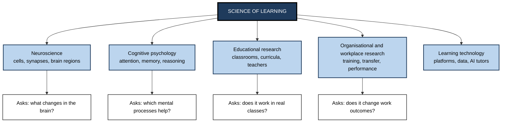
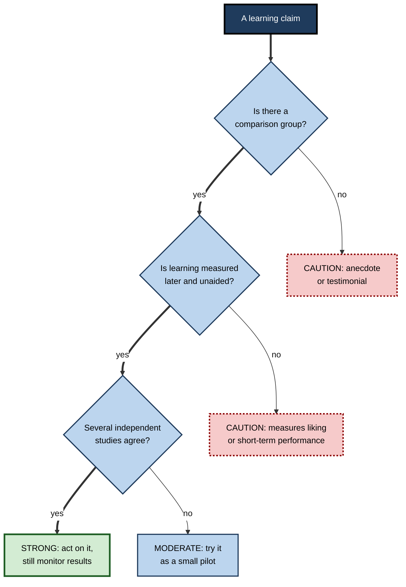

# A.2. The Science of Learning

> **In one sentence:** The science of learning is the careful, test-it-and-see study of how people actually learn, so that we can stop guessing and start using methods that are proven to work.
>
> **Why it matters:** Training budgets, study hours and onboarding programmes are wasted every day on methods that feel right but do not work. Professionals who can read and weigh learning evidence choose better methods, reject fads, and can defend their decisions to sceptical leaders.
>
> **Level span:** Novice → Expert · **Reading time:** ~17 min · **Builds on:** the definition of learning (a lasting change in capability caused by experience)

---

## The Learning Ladder

| Level | Badge | After this level you can... |
|---|---|---|
| 1 | NOVICE | Explain what "the science of learning" means and why it beats tradition and gut feeling. |
| 2 | FOUNDATIONS | Name the disciplines involved, the main research methods, and the handful of principles the field broadly agrees on. |
| 3 | PRACTITIONER | Read a learning claim and rate how trustworthy it is using a simple five-question check. |
| 4 | ADVANCED | Explain effect sizes, heterogeneity, the lab-to-classroom gap, and why some well-known findings shrank on replication. |
| 5 | EXPERT / PRO | Run evidence-informed learning decisions in an organisation, including small experiments of your own. |

---

## Level 1 · Novice — The Big Picture

For most of history, people learned and taught the way they had been taught. Teachers lectured because their teachers lectured. Students re-read and highlighted because everyone around them did. Nobody checked whether these habits worked best; they were simply tradition.

The **science of learning** changes that. It treats learning like any other natural process — something you can observe, measure and test. Instead of asking "What do people like?" or "What have we always done?", it asks "If we do *this* instead of *that*, do people remember more, understand more deeply, or perform better weeks later?"

An analogy: medicine before clinical trials. Doctors once bled patients because it seemed sensible and everyone did it. Controlled testing showed it harmed people. Learning science is the clinical-trial mindset applied to studying, teaching and training.

You have already met a result of this science if you have ever been told to **quiz yourself instead of re-reading**, or to **spread out practice instead of cramming**. Both pieces of advice come from more than a century of experiments, starting with Hermann Ebbinghaus, who in the 1880s memorised thousands of nonsense syllables and carefully tracked how fast he forgot them.

The beginner's takeaway: **some ways of learning really are better than others, and we know which ones because people tested them — not because they sounded good.**

---

## Level 2 · Foundations — Core Concepts

### A field made of several disciplines

The science of learning is not one subject. It sits where several fields overlap, each looking at learning at a different "zoom level".

**Figure A.2-1 — The levels at which learning is studied.**

*How to read it:* each mid-tone box is a discipline; the white boxes underneath give the question it is best placed to answer. Good practice combines answers from several levels.

### How the science actually finds things out

| Method | What it is | Strength | Weakness |
|---|---|---|---|
| **Laboratory experiment** | Randomly assign people to two study methods under controlled conditions, then test later. | Shows cause and effect clearly. | Short, artificial tasks; often university students. |
| **Classroom or field experiment** | The same logic inside real courses or workplaces. | Realistic; tests whether the effect survives real life. | Harder to control; effects often smaller. |
| **Correlational study** | Measure two things and see whether they move together. | Cheap, large samples. | Cannot show what causes what. |
| **Meta-analysis** | A statistical summary of many studies on the same question. | Gives an overall picture and shows variation. | Only as good as the studies it includes. |
| **Neuroimaging** | Brain scans or recordings during learning tasks. | Reveals mechanisms. | Rarely tells you directly how to teach. |

### Principles with broad agreement

Learning researchers disagree on many details, but a small core of principles has survived decades of testing across many settings:

1. **Retrieval practice** — actively recalling information strengthens memory more than re-reading it.
2. **Spacing** — spreading practice over time beats massing it into one session, for long-term retention.
3. **Interleaving** — mixing related problem types helps learners tell them apart and choose the right method.
4. **Prior knowledge matters** — what you already know is the strongest single influence on what you can learn next.
5. **Limited working memory** — novices are easily overloaded; guidance, worked examples and clear structure help them.
6. **Feedback** — timely information about the gap between current and target performance improves learning, when it is specific and acted on.
7. **Meaning and organisation** — connecting new ideas to old ones and organising them into structures improves retention and transfer.

### Key terms

| Term | Plain meaning |
|---|---|
| **Evidence-based** | Chosen because good studies show it works, not because it is popular. |
| **Evidence-informed** | Evidence is one input, combined with professional judgement and local context. Many experts prefer this more modest term. |
| **Randomised controlled trial (RCT)** | An experiment where chance decides who gets which method, so other differences cancel out. |
| **Effect size** | A number expressing *how big* a difference is, not just whether it exists. |
| **Replication** | Repeating a study to see whether the result holds. |
| **Neuromyth** | A popular but false belief about the brain and learning. |

---

## Level 3 · Practitioner — Putting It to Work

You will meet learning claims constantly: from vendors, colleagues, viral posts, and course marketing. The practical skill is **grading a claim quickly**.

### The five-question evidence check

1. **What exactly is claimed?** Rewrite it as "Method X improves outcome Y for people Z, compared with W." Vague claims ("boosts engagement", "brain-friendly") often cannot be tested at all.
2. **Compared with what?** "Learners improved" is meaningless without a comparison group. Improvement after *any* training is expected.
3. **Measured how, and when?** Was the outcome satisfaction, an immediate quiz, or delayed, unaided performance? Only the last is strong evidence of learning.
4. **How many studies, and by whom?** One small study, especially by the seller, is weak. Many independent studies and a meta-analysis are strong.
5. **Does it fit what we already know?** A claim that contradicts well-established principles needs extraordinary evidence.

**Figure A.2-2 — Grading a learning claim.**

*How to read it:* the thick path leads to strong evidence; dotted-border boxes are weak evidence that should not drive big decisions.

### Worked example — a vendor pitch

| | Before (taking the claim at face value) | After (applying the check) |
|---|---|---|
| **Claim** | "Our microlearning app gives 80% retention after 30 days, double that of traditional courses." | Rewritten: "App X raises 30-day retention for our employees versus our current e-learning." |
| **Comparison** | Accepted as stated. | Asks: retention of what, measured how, compared with which course? |
| **Evidence** | A glossy case study. | Finds no independent controlled study; the figure comes from the vendor's own customers. |
| **Fit** | — | Notes that spacing and retrieval *are* well supported, so the app's design may help — but the specific number is unverified. |
| **Decision** | Signs a three-year contract. | Runs a two-team pilot with a delayed, unaided test before scaling. |

### Common mistakes at this level

- **Trusting the brain picture.** Claims dressed in neuroscience language are rated as more convincing, even when the neuroscience adds nothing.
- **Mixing up popularity and proof.** A method used by famous companies is not thereby proven.
- **Confusing "statistically significant" with "important".** A tiny effect can be significant in a huge sample.
- **Ignoring the outcome measure.** Most commercial claims report completion or satisfaction, not learning.

---

## Level 4 · Advanced — Mechanisms, Models & Evidence

### Effect sizes and how to read them

An **effect size** expresses a difference in standard-deviation units, commonly written *d* or *g*. A rough convention, from the statistician Jacob Cohen, calls 0.2 small, 0.5 medium and 0.8 large — but in education, where outcomes are noisy and long-term, many genuinely useful interventions sit between 0.1 and 0.4. Context matters: a cheap change with a small effect applied to thousands of people can be worth more than an expensive change with a large one.

### The lab-to-classroom gap

Effects measured in tightly controlled laboratory studies usually **shrink in real settings**. Recent work makes this concrete:

- A 2025 meta-analysis of spacing and retrieval practice in mathematics found a reliable small-to-medium benefit of spacing overall, but the benefit was noticeably larger when material was learned in isolation than when it was embedded in a real course. For retrieval practice in mathematics specifically, the pooled benefit was small and not statistically reliable.
- A 2024 study that built spaced retrieval practice into nine introductory STEM university courses found clear benefits in only a minority of the courses; the overall picture depended heavily on which courses were included.

The lesson is not that the principles are wrong. Retrieval and spacing remain among the best-supported findings in all of psychology. The lesson is that **implementation, dose, subject matter and the comparison condition change the size of the effect**. In real courses the "control group" is often already doing some retrieval and spacing, which narrows the gap.

### Heterogeneity: the average hides the story

**Heterogeneity** means that an effect varies in size across people and settings. An average effect of 0.1 could mean "a small benefit for everyone" or "a large benefit for one group and none for others". Modern meta-analysis increasingly asks *for whom* and *under what conditions* an intervention works, rather than only "does it work on average?". The long-running debate over growth-mindset interventions, where reviewers analysing similar studies reached very different conclusions, is largely an argument about how to handle heterogeneity and study quality.

### The replication era

Since the 2010s, psychology has gone through a **replication crisis**: many published findings, often from small studies, failed to reproduce in larger, pre-registered attempts. Learning science was affected unevenly:

| Status | Examples |
|---|---|
| **Robust** — replicated many times, in labs and classrooms | Testing effect, spacing effect, worked-example effect for novices, generation effect |
| **Real but smaller or narrower than first claimed** | Many growth-mindset effects, some interleaving effects outside mathematics and category learning |
| **Contested or largely failed** | Ego-depletion ("willpower runs out"), several "power pose" and priming claims |
| **Not supported** | Matching instruction to learning styles, "left-brain / right-brain" learners |

The field's response — **pre-registration** (publishing your plan before collecting data), larger samples, open data and multi-site studies — has made recent evidence more trustworthy than much older work.

### What recent research changed

- **AI tutors moved from speculation to trials.** A 2025 randomised crossover trial in a university physics course found that a carefully designed AI tutor, built to follow learning-science principles such as step-by-step scaffolding and making students do the thinking, produced larger learning gains than an already-strong active-learning class. Other 2025 trials found that *unrestricted* chatbot access raised practice performance but lowered later unaided performance. The common thread: **design, not the technology itself, decides the outcome.**
- **Neuromyths persist.** Surveys continue to find that a large share of teachers and trainers endorse at least some neuromyths, and that knowing more neuroscience facts does not by itself protect against them.

---

## Level 5 · Expert / Pro — Professional Mastery

### Running learning decisions on evidence

Mature L&D teams treat learning programmes as products with hypotheses. Their practice has four layers:

1. **Principles first.** Start design from robust principles (retrieval, spacing, worked examples, feedback, realistic practice) rather than from content volume.
2. **Local evidence.** Pilot new designs with a comparison group where possible; at minimum compare cohorts before and after a change.
3. **Meaningful outcomes.** Measure delayed, unaided performance and on-the-job behaviour, not only satisfaction and completion.
4. **Honest reporting.** Report effect sizes and uncertainty to stakeholders, including null results.

### Small experiments anyone can run

| Experiment | Design | Outcome to measure |
|---|---|---|
| Spaced follow-ups | Half of a cohort gets three short retrieval quizzes over four weeks after a workshop. | Scenario test at week six. |
| Worked examples versus open problems | New analysts get either fully worked SQL examples first or problems first. | Time to independent query and error rate a month later. |
| AI tutor configuration | "Answer mode" versus "hint-first mode" assistant during onboarding. | Unaided task performance after the assistant is removed. |

Randomising by team or week, keeping the outcome measure identical, and deciding the success criterion in advance are the three habits that make such experiments believable.

### Professional scenario

**Role:** Head of Sales Enablement at a software company.
**Situation:** Leadership wants to buy an "AI-powered adaptive learning" platform after a competitor adopted it. The vendor reports dramatic retention numbers.
**What the pro does:** Separates the platform's *mechanisms* (spaced retrieval prompts, scenario practice — both well supported) from its *marketing numbers* (unverified). Negotiates a 90-day pilot with two regions, uses a delayed role-play assessment scored blind by managers, and tracks deal-stage conversion. Presents the result with confidence intervals. The decision becomes a business case, not a fashion choice.

### Expert-level judgement

- **Evidence-informed, not evidence-obsessed.** Strong evidence rarely exists for your exact context. Combine general principles, local data and practitioner insight.
- **Beware the translation layer.** Most failures happen when a robust principle is implemented badly — for example "retrieval practice" turned into trivial multiple-choice recall.
- **Know the ethics.** Experiments on employees or students require fairness: no group should be denied something known to work, and data must be handled responsibly.
- **In the AI era, re-ask old questions.** When tools change what people need to hold in memory, the science of *what* to learn becomes as important as the science of *how* to learn.

---

## Myths vs. Evidence

| Myth | What the evidence shows |
|---|---|
| "Learning science is just common sense." | Many robust findings run *against* intuition: testing beats re-reading, spacing beats cramming, and learners consistently misjudge what works for them. |
| "If it worked in a lab, it will work the same in my course." | Effects usually shrink in real settings and depend on implementation details. |
| "Brain scans show the best way to teach." | Neuroscience explains mechanisms but rarely gives direct teaching prescriptions; cognitive and classroom studies do that. |
| "One big study settles it." | Single studies often fail to replicate; look for many independent studies and meta-analyses. |
| "Satisfaction scores show what people learned." | Satisfaction is only weakly related to learning and can move in the opposite direction. |
| "Neuromyths are harmless." | They divert time and money from effective methods and can lead to labelling learners in limiting ways. |

## Practitioner Toolkit

**Evidence-grading checklist**

- [ ] I rewrote the claim as "Method X improves Y for Z compared with W".
- [ ] I found the comparison group.
- [ ] I checked whether the outcome was delayed and unaided.
- [ ] I looked for independent studies or a meta-analysis.
- [ ] I checked the claim against robust principles.
- [ ] I decided: adopt, pilot, or reject — and wrote down why.

**Template — one-page evidence brief**

| Field | Entry |
|---|---|
| Decision to make | |
| Claim being evaluated | |
| Best available evidence (type, size, independence) | |
| Fit with robust principles | |
| Local pilot design | |
| Success criterion set in advance | |
| Decision and review date | |

## Self-Check

1. **[NOVICE]** What makes the science of learning different from tradition or personal preference?
2. **[NOVICE]** Name one study habit that learning science recommends and one it advises against.
3. **[FOUNDATIONS]** Why can a correlational study not prove that a method causes better learning?
4. **[FOUNDATIONS]** List four principles with broad agreement in the field.
5. **[PRACTITIONER]** A course reports that 95% of learners "felt more confident". What is missing?
6. **[ADVANCED]** Why do effects tend to shrink between the lab and real courses?
7. **[ADVANCED]** What is heterogeneity, and why does it matter for meta-analyses?
8. **[EXPERT / PRO]** Design a simple experiment to test whether spaced follow-up quizzes improve a compliance training.
9. **[EXPERT / PRO]** What does the 2025 AI-tutor evidence suggest about buying AI learning tools?

### Answer Key

1. It tests methods with controlled comparisons and measurement, rather than relying on habit or what feels effective.
2. Recommended: self-testing or spacing. Discouraged as a main strategy: passive re-reading or cramming.
3. Other factors (motivation, prior knowledge, time available) may cause both; only random assignment rules these out.
4. Any four of: retrieval practice, spacing, interleaving, prior knowledge, limited working memory, feedback, meaning and organisation.
5. A comparison group and a delayed, unaided measure of learning; confidence is not competence.
6. Real settings have more noise, less control, shorter or weaker implementation, and control groups that already use some effective practices.
7. Variation in effect size across people and settings; an average can hide large benefits for some and none for others.
8. Randomly assign teams to quiz versus no-quiz follow-ups, use the same scenario-based test six weeks later for everyone, and set the success threshold in advance.
9. Outcomes depend on design: tools that make learners do the thinking can help; tools that supply answers can raise practice scores while lowering real learning. Pilot and measure unaided performance.

## Key Takeaways

- Learning science replaces tradition and gut feeling with **controlled testing**.
- It spans neuroscience, cognitive psychology, education and workplace research, each answering different questions.
- A core of principles — **retrieval, spacing, interleaving, prior knowledge, limited working memory, feedback, meaning** — is well supported.
- Grade any claim with five questions: claim, comparison, measure, number of studies, fit.
- Effects **shrink and vary** in real settings; implementation and context matter.
- The replication era sorted robust findings from fragile ones and made recent evidence more trustworthy.
- In the AI era, **design decides** whether a tool builds or replaces learning.

## Glossary

| Term | Meaning |
|---|---|
| Correlational study | Research that measures whether two variables move together, without manipulating either. |
| Effect size | A standardised measure of how large a difference or relationship is. |
| Evidence-informed practice | Decisions that combine research evidence with professional judgement and local context. |
| Heterogeneity | Variation in an effect's size across studies, people or settings. |
| Meta-analysis | A statistical synthesis of results from many studies on one question. |
| Neuromyth | A widespread misconception about the brain, often applied to education. |
| Pre-registration | Publicly recording a study's hypotheses and analysis plan before collecting data. |
| Randomised controlled trial | An experiment in which participants are assigned to conditions by chance. |
| Replication | Repeating a study to test whether its findings hold. |
| Translation gap | The loss of effectiveness when a research finding is turned into real-world practice. |
