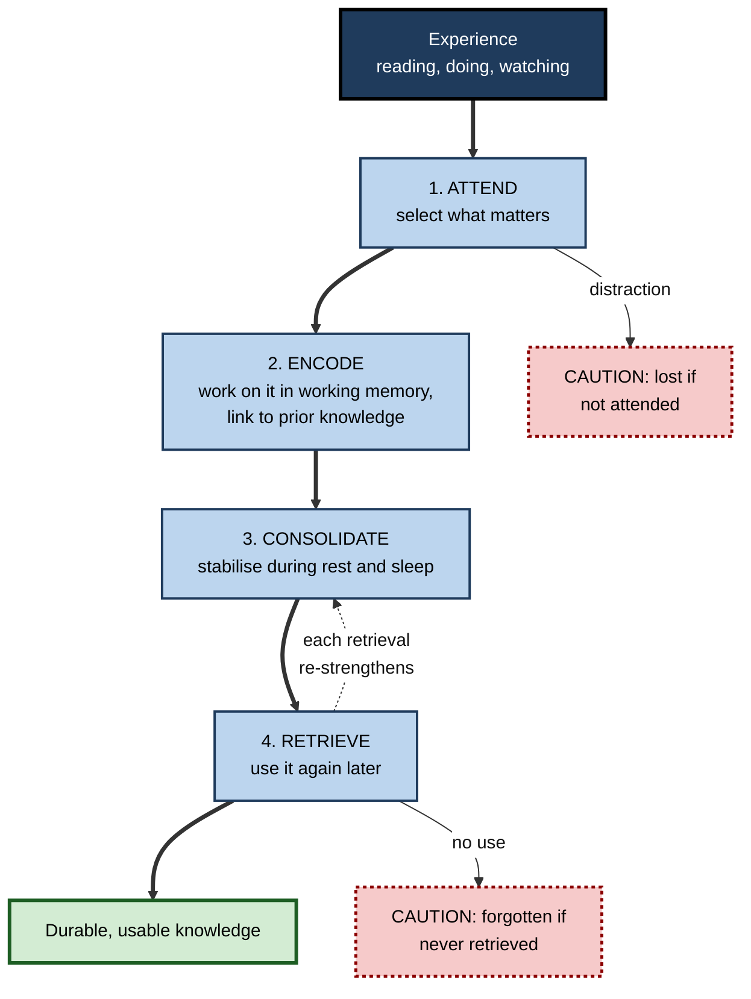
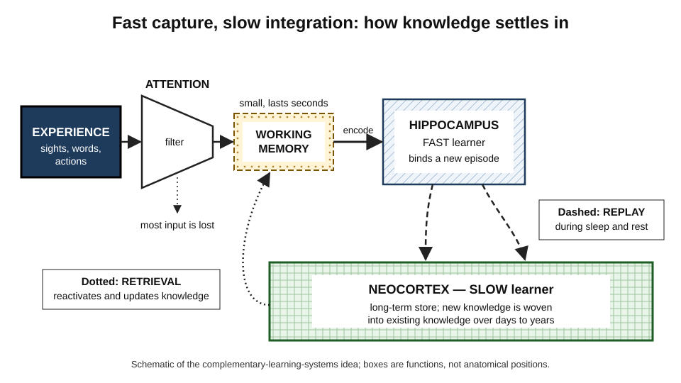
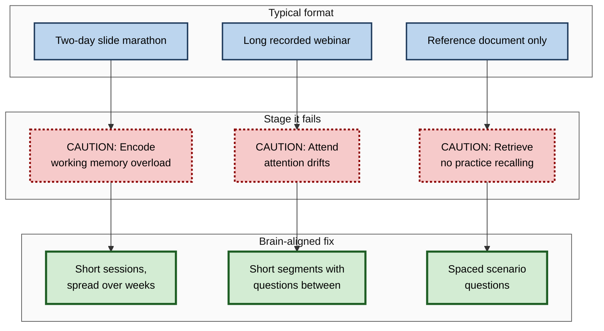

# A.3. How the Brain Acquires Knowledge

> **In one sentence:** Your brain learns by noticing something, holding it briefly in mind, linking it to what you already know, and then — mostly while you rest and sleep — strengthening the connections between brain cells so you can find it again later.
>
> **Why it matters:** Once you know the journey knowledge takes through the brain, you can see exactly where learning breaks down — distraction, overload, no connection to prior knowledge, no sleep, no retrieval — and fix the right step instead of just "studying harder".
>
> **Level span:** Novice → Expert · **Reading time:** ~18 min · **Builds on:** the definition of learning; the idea that learning science tests methods

---

## The Learning Ladder

| Level | Badge | After this level you can... |
|---|---|---|
| 1 | NOVICE | Describe, in plain words, the journey from experience to lasting knowledge. |
| 2 | FOUNDATIONS | Name the four stages (attend, encode, consolidate, retrieve) and the brain structures most involved. |
| 3 | PRACTITIONER | Diagnose which stage failed when you "forgot" something and choose a matching fix. |
| 4 | ADVANCED | Explain synaptic plasticity, systems consolidation, sleep replay, prediction error and reconsolidation, and their limits. |
| 5 | EXPERT / PRO | Design learning experiences that respect each stage, and judge neuroscience claims in the learning market. |

---

## Level 1 · Novice — The Big Picture

Your brain contains roughly 86 billion nerve cells called **neurons**. Each one connects to thousands of others through tiny junctions called **synapses**. Everything you know — your friend's face, how to drive, what a balance sheet is — is stored not in one cell but in a *pattern* of connections across many cells.

Learning is the brain changing those connections. When a group of neurons is active together, the links between them get stronger, so next time the whole pattern switches on more easily. A popular summary is "**neurons that fire together, wire together**."

Think of a city that builds roads where traffic actually flows. A path used once stays a dirt track. A path used often, by many cars, at different times, gets paved, widened and signposted. Your brain is a city that keeps rebuilding its roads according to use.

You have already experienced this when a new route to work felt confusing for a week and then became automatic, or when a colleague's name finally "stuck" after you used it in a few conversations. Each use strengthened the pattern.

The beginner's takeaway: **knowledge is built in stages. It must be noticed, connected, given time to settle, and then used again.** Skip a stage and the knowledge fades.

---

## Level 2 · Foundations — Core Concepts

### The four-stage journey

1. **Attend.** Your senses take in far more than you can process. **Attention** selects a small part for further processing. Whatever you do not attend to is mostly lost within seconds.
2. **Encode.** The selected information is held and worked on in **working memory**, the brain's small mental workspace, and turned into a form that can be stored. Encoding is stronger when you think about *meaning* and connect the new idea to what you already know.
3. **Consolidate.** Over hours, days and longer, the fragile new memory is stabilised. Much of this happens offline — during rest and especially during sleep.
4. **Retrieve.** Pulling the memory back out when needed. Each successful retrieval is not just a read-out; it changes and usually strengthens the memory.

**Figure A.3-1 — The knowledge acquisition cycle.**

*How to read it:* thick arrows are the main journey; the dotted arrow shows retrieval feeding back into consolidation; dotted-border boxes are the two most common points of loss.

### The main brain players

| Structure | Plain role in learning |
|---|---|
| **Prefrontal cortex** | Front of the brain; directs attention, holds and manipulates information in working memory, plans. |
| **Hippocampus** | A seahorse-shaped structure deep in each temporal lobe; rapidly binds the pieces of a new experience or fact together so it can be stored. |
| **Neocortex** | The large outer layer of the brain; the long-term home of knowledge, built up slowly. |
| **Basal ganglia and cerebellum** | Central to habits, motor skills and timing — the "how-to" knowledge that becomes automatic. |
| **Amygdala** | Tags experiences with emotional importance, which can strengthen memory for them. |
| **Dopamine system** | Signals when outcomes are better or worse than expected, helping the brain learn what to pay attention to and repeat. |

### Key terms

| Term | Plain meaning |
|---|---|
| **Neuron** | A brain cell that sends electrical and chemical signals. |
| **Synapse** | The junction where one neuron passes a signal to another. |
| **Synaptic plasticity** | The ability of synapses to become stronger or weaker with use. |
| **Working memory** | The small, short-lived mental workspace where you hold and process information right now. |
| **Long-term memory** | The large, durable store of knowledge and skills. |
| **Consolidation** | The process that stabilises a new memory after it is formed. |
| **Engram** | The physical trace of a memory — the set of neurons and connections that store it. |

---

## Level 3 · Practitioner — Putting It to Work

When you "forget" something, the failure happened at a specific stage. Diagnosing the stage tells you the fix.

### Stage-by-stage diagnosis

| Symptom | Likely failed stage | Fix |
|---|---|---|
| "I read the page but cannot say anything about it." | **Attend** — mind wandered, phone nearby. | Remove distractions; set a question to answer before reading. |
| "I followed the explanation but it slipped away immediately." | **Encode** — working memory overloaded, or no link to prior knowledge. | Smaller chunks; worked examples; ask "how does this connect to what I know?" |
| "I knew it yesterday, gone today." | **Consolidate** — no sleep or rest between learning and use; no reinforcement. | Protect sleep; take short quiet breaks after learning; revisit the next day. |
| "I know I know it, but I cannot get it out." | **Retrieve** — never practised pulling it out, or the cue is different. | Self-test; practise in varied contexts; use the term in conversation. |

### A brain-aligned learning session

1. **Prime attention (2 minutes).** Write the question you want answered. Silence notifications.
2. **Activate prior knowledge (3 minutes).** Jot down what you already know about the topic. This gives new information something to attach to.
3. **Encode in small chunks (20–30 minutes).** Study one idea at a time; after each, close the source and explain it in your own words.
4. **Rest briefly (5 minutes).** Do something undemanding — a walk, not your inbox. Quiet rest after learning has been shown to help retention in several studies.
5. **Retrieve before you leave (5 minutes).** Write down everything you can remember, then check.
6. **Sleep, then retrieve again.** Next day, test yourself cold before re-reading anything.

### Worked example — a consultant learning a new industry

| | Before | After |
|---|---|---|
| **Approach** | Reads 60 pages of industry reports late at night before the client meeting. | Over four days: 30 minutes per day, starting with "what I already know about supply chains", one report section per session, with a five-line recall summary after each. |
| **Sleep** | Short; meeting the next morning. | Normal; each session followed by at least one night. |
| **Retrieval** | None until the meeting. | Explains the industry's economics aloud to a colleague on day four. |
| **Result** | Recognises terms when the client uses them but cannot use them. | Asks informed questions and connects the client's issues to industry patterns. |

### Common mistakes at this level

- **Studying while multitasking**, which weakens attention and encoding.
- **Cutting sleep to study more**, which undermines consolidation of exactly what you studied.
- **Re-reading instead of retrieving**, which skips the stage that most strengthens access.
- **Ignoring prior knowledge**, so new information has nothing to attach to.

---

## Level 4 · Advanced — Mechanisms, Models & Evidence

### Synaptic plasticity: the cellular basis

The Canadian psychologist Donald Hebb proposed in 1949 that when one neuron repeatedly helps fire another, the connection between them strengthens. In the 1970s researchers discovered **long-term potentiation (LTP)** — a lasting increase in synaptic strength after intense, repeated stimulation — and its counterpart, **long-term depression (LTD)**, a lasting weakening. These processes, involving changes in receptor numbers, protein synthesis and even the growth of new synaptic connections, are the leading candidate mechanisms for storing memories. Weakening matters as much as strengthening: learning is sculpting, not only adding.

### Engrams: memories are physical

Since the 2010s, techniques that tag and control specific neurons in animals have allowed researchers to identify **engram cells** — sparse groups of neurons active during learning whose later reactivation is sufficient to trigger recall. Reviews published in 2024 and 2025 describe engrams as distributed across several brain regions, changing over time, and becoming more selective as a memory consolidates. These findings come almost entirely from rodent studies; they strongly support the idea that memories are physical traces, but they do not by themselves tell us how to teach people.

### Systems consolidation and sleep

The leading account, the **active systems consolidation** model, holds that new memories initially depend heavily on the hippocampus, which learns fast. During later offline periods, especially deep **slow-wave sleep**, the hippocampus "replays" recent patterns in coordination with brain rhythms (slow oscillations, sleep spindles and sharp-wave ripples), gradually training the neocortex, which learns slowly. Over time, knowledge becomes more independent of the hippocampus and more integrated with existing knowledge.

*Figure A.3-2 — The two-speed learning system.* Information selected by attention passes through working memory to the hippocampus, which stores it quickly. During sleep and rest, replay (dashed arrows) gradually builds the knowledge into the neocortex. Retrieval (dotted arrow) reactivates and updates the stored knowledge. Schematic, not anatomical.

Why two speeds? Computational work on **complementary learning systems** suggests that a single fast-learning network would overwrite old knowledge whenever it learned something new. A fast store plus slow, interleaved replay lets the brain add new knowledge without wrecking the old — one reason why spacing and sleep matter.

### Prediction error and dopamine

The brain is constantly predicting. When an outcome differs from what was expected — a **prediction error** — dopamine signals help mark it as worth learning. This helps explain why generating a guess before seeing an answer, or being surprised by feedback, can improve learning: it creates a prediction for reality to correct.

### Reconsolidation: memories are rebuilt when used

When a consolidated memory is retrieved, it can briefly become changeable again before restabilising — a process called **reconsolidation**. This is one reason retrieval strengthens and updates knowledge, and also why memories can be distorted by misleading information introduced during recall. The scope and clinical applications of reconsolidation are still actively debated.

### Boundary conditions and cautions

- **Most mechanism evidence is from animals.** The link from rodent synapses to a workplace training course is a long chain of inference.
- **"Brain-based learning" products often over-claim.** Valid neuroscience rarely translates directly into a specific teaching technique; the behavioural evidence for a technique is what counts.
- **Individual differences are real but modest.** People differ in working memory capacity and prior knowledge; the stages are the same for everyone.

---

## Level 5 · Expert / Pro — Professional Mastery

### Designing for all four stages

| Stage | Design principle | Workplace implementation |
|---|---|---|
| Attend | Protect attention; give a reason to care. | Start sessions with a real problem; ban multitasking in live sessions; keep videos short and purposeful. |
| Encode | Manage load; connect to prior knowledge. | Pre-assessments to find what people know; worked examples for novices; analogies to familiar systems. |
| Consolidate | Space it out; respect rest. | Split a two-day workshop into four half-days across two weeks; avoid late-night "bootcamp" schedules. |
| Retrieve | Make people produce, not just recognise. | Spaced scenario questions, teach-backs, real tasks performed without support. |

**Figure A.3-3 — Where common training formats fail the brain.**

*How to read it:* read each row left to right — format, the stage it starves, and the redesign that feeds it.

### Professional scenario

**Role:** Learning experience designer for a hospital group's new electronic records system.
**Situation:** The rollout plan is a single full-day training the week before go-live; staff work shifts and many arrive after night duty.
**What the pro does:** Argues from the four stages. Night-shift staff will struggle to attend and consolidate after no sleep, and a single day overloads working memory. The redesign: a 20-minute orientation, then three 45-minute hands-on sessions spaced across two weeks, each starting with a short retrieval task from the last session, scheduled at the start of shifts. A sandbox lets staff practise real workflows unaided. Go-live support tickets are tracked as the outcome measure.

### AI-era implications

- **Offloading skips encoding.** If an assistant summarises a document for you, your brain did not process the meaning — so little is encoded. A 2025 study using brain recordings during essay writing reported weaker neural engagement and poorer recall of one's own essay when a chatbot did much of the work; the study was small and not yet the final word, but it fits the wider evidence on cognitive offloading.
- **Use AI to force retrieval, not replace it.** Assistants that quiz you, ask you to explain, or check your reasoning engage the retrieval and prediction-error mechanisms that build memory.

### Judging neuroscience claims

Ask: Does the claim rely on behavioural evidence from learners, or only on a brain mechanism? Is the brain region or chemical named actually relevant? Would the recommended technique be justified without the neuroscience? If yes, the neuroscience is decoration.

---

## Myths vs. Evidence

| Myth | What the evidence shows |
|---|---|
| "We only use 10% of our brain." | Brain imaging shows activity throughout the brain; there is no large unused reserve. |
| "Memories are stored like files and replayed exactly." | Memories are reconstructed at each recall and can change in the process. |
| "You can learn effectively while you sleep by playing recordings." | Sleep consolidates what you learned while awake; learning complex new material during sleep is not supported. |
| "Your brain stops changing after childhood." | Synaptic plasticity continues throughout life, although some forms of learning become slower with age. |
| "Pulling an all-nighter helps you remember more." | Sleep loss impairs both the encoding of new information and the consolidation of what was learned. |
| "Brain-training games make you smarter overall." | Gains usually stay on the trained games and transfer little to broad abilities. |

## Practitioner Toolkit

**Four-stage checklist for any learning task**

- [ ] **Attend:** distractions removed; I know what question I am answering.
- [ ] **Encode:** I chunked it, and I connected it to something I already know.
- [ ] **Consolidate:** I left time — at least one sleep — before relying on it.
- [ ] **Retrieve:** I recalled it without help, more than once, on different days.

**Routine — the 3-2-1 end-of-day recall:** before shutting your laptop, write 3 things you learned today, 2 connections to things you already knew, and 1 question still open. Read it the next morning *after* trying to recall it.

## Self-Check

1. **[NOVICE]** What does "neurons that fire together, wire together" mean in everyday terms?
2. **[NOVICE]** Name the four stages of the knowledge journey.
3. **[FOUNDATIONS]** What is the role of the hippocampus compared with the neocortex?
4. **[FOUNDATIONS]** Why does prior knowledge help encoding?
5. **[PRACTITIONER]** You understood a presentation but could not recall it the next morning after a late night. Which stages likely failed, and what would you change?
6. **[ADVANCED]** What problem does a two-speed (fast and slow) learning system solve?
7. **[ADVANCED]** What is reconsolidation, and why does it matter for retrieval?
8. **[EXPERT / PRO]** Redesign a two-day product training using the four stages.
9. **[EXPERT / PRO]** A vendor claims its course "activates dopamine for 3x retention". How do you evaluate it?

### Answer Key

1. Brain cells that are active at the same time strengthen their connections, so using knowledge makes it easier to use again.
2. Attend, encode, consolidate, retrieve.
3. The hippocampus rapidly binds new experiences; the neocortex slowly becomes the long-term store, aided by replay during sleep.
4. New information can attach to existing structures, giving it meaning and more retrieval routes.
5. Consolidation (no sleep) and retrieval (no practice). Sleep normally, do a quick recall before bed, and self-test the next morning.
6. It allows new learning without overwriting old knowledge: the fast store captures, the slow store integrates gradually.
7. A retrieved memory becomes briefly changeable before restabilising; retrieval can strengthen and update memories but also distort them.
8. Example: four half-days over two weeks; pre-assessment; worked examples; short segments with questions; each session opening with retrieval of the last; final unaided task.
9. Ask for behavioural evidence with a comparison group and delayed test; note that "dopamine" is decoration unless the behavioural result holds.

## Key Takeaways

- Knowledge is stored as **patterns of connections between neurons**, strengthened by use.
- Learning moves through four stages: **attend, encode, consolidate, retrieve**.
- The **hippocampus learns fast; the neocortex learns slowly**; sleep-time replay transfers knowledge between them.
- Every **retrieval rebuilds** a memory — usually strengthening it.
- Most forgetting can be traced to a specific failed stage, which tells you the fix.
- Neuroscience explains *why* methods work; **behavioural evidence decides which methods to use**.

## Glossary

| Term | Meaning |
|---|---|
| Active systems consolidation | The model in which sleep-time replay transfers memories from hippocampus-dependent to neocortical storage. |
| Complementary learning systems | The theory that the brain needs a fast-learning and a slow-learning system to learn without overwriting. |
| Engram | The physical trace of a memory in a set of neurons and their connections. |
| Hippocampus | Brain structure central to forming new facts and event memories. |
| Long-term potentiation | A lasting increase in the strength of a synapse after repeated activation. |
| Neocortex | The brain's outer layer; the long-term store of knowledge. |
| Prediction error | The difference between what the brain expected and what happened; a signal for learning. |
| Reconsolidation | The re-stabilising of a memory after it has been retrieved and become changeable. |
| Synaptic plasticity | The capacity of connections between neurons to strengthen or weaken. |
| Working memory | The limited mental workspace for information in current use. |
