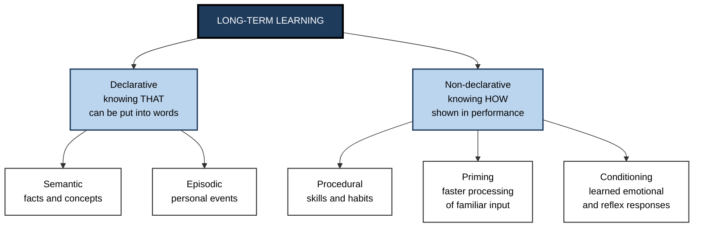
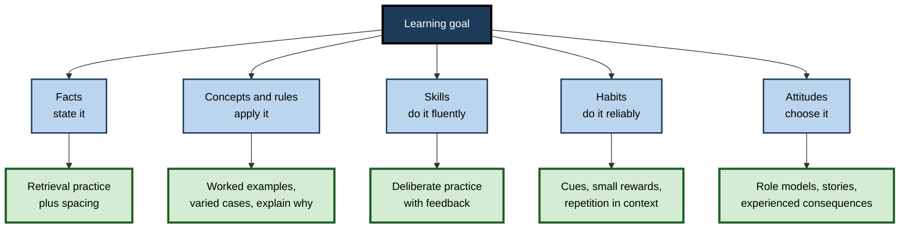

# A.4. Types of Learning

> **In one sentence:** People learn in different *kinds* of ways — by forming associations, by being rewarded, by watching others, by understanding, by practising until things become automatic — and each kind produces a different kind of knowledge.
>
> **Why it matters:** The method that works for memorising regulations will not build a negotiation skill, and the method that builds a coding habit will not build judgement. Matching the method to the type of learning is one of the fastest ways to make training, study and coaching work.
>
> **Level span:** Novice → Expert · **Reading time:** ~17 min · **Builds on:** the definition of learning; the four-stage journey (attend, encode, consolidate, retrieve)

---

## The Learning Ladder

| Level | Badge | After this level you can... |
|---|---|---|
| 1 | NOVICE | Give everyday examples of learning by association, by consequences, by watching, and by understanding. |
| 2 | FOUNDATIONS | Use three standard ways of classifying learning: by mechanism, by memory system, and by outcome. |
| 3 | PRACTITIONER | Identify what *type* of learning a goal requires and choose a matching method. |
| 4 | ADVANCED | Explain the evidence behind the main taxonomies, where they overlap, and where they are contested. |
| 5 | EXPERT / PRO | Design blended programmes that deliberately combine learning types, including informal and social learning at work. |

---

## Level 1 · Novice — The Big Picture

Imagine four new employees on their first month in a restaurant.

- One flinches every time the kitchen bell rings, because the bell always meant a rush and a shouting chef. That is **learning by association**.
- One starts arriving five minutes early, because the manager praised punctual staff and gave them better shifts. That is **learning by consequences**.
- One picks up how to calm angry customers by watching an experienced waiter. That is **learning by observation**.
- One finally *understands* why the kitchen sends dishes in a certain order — so the whole table's food arrives hot together. That is **learning by understanding**.

All four learned, but they learned different *kinds* of things in different *kinds* of ways. A fifth type runs through all of them: with enough repetition, carrying three plates or entering an order becomes automatic — **skill learning**.

You have already experienced each of these: feeling hungry at the sound of a lunch notification (association), checking your email more often because sometimes there is something exciting (consequences), copying a colleague's slide style (observation), and that "aha!" moment when a concept finally clicked (understanding).

The beginner's takeaway: **"learning" is not one thing. Ask what kind of learning you need, then pick a method that fits.**

---

## Level 2 · Foundations — Core Concepts

There is no single official list of types of learning. Instead, researchers classify learning in three complementary ways — like describing a car by its engine, its body type or its purpose.

### Classification 1 — by mechanism (how the change happens)

| Type | How it works | Classic origin | Workplace example |
|---|---|---|---|
| **Non-associative** | Response changes from repeated exposure to one thing: getting used to it (**habituation**) or more sensitive to it (**sensitisation**). | Studied in simple organisms and humans | Stop noticing open-office noise after a week. |
| **Classical conditioning** | A neutral signal becomes linked with something meaningful, so the signal alone triggers a response. | Ivan Pavlov, early 1900s | Anxiety when a calendar invite titled "quick chat" from the boss appears. |
| **Operant conditioning** | Behaviour becomes more or less frequent depending on its consequences (reinforcement or punishment). | Edward Thorndike, B. F. Skinner | Sales behaviour shaped by commission structure. |
| **Observational (social) learning** | Learning by watching others and the consequences they experience. | Albert Bandura, 1960s | A junior consultant adopting a partner's way of running workshops. |
| **Cognitive learning** | Learning by building understanding — reasoning, insight, mental models. | Gestalt psychologists, Edward Tolman, cognitive psychology | Grasping why a database design avoids duplication. |

### Classification 2 — by memory system (what kind of knowledge results)

**Figure A.4-1 — The memory-system view of types of learning.**

*How to read it:* the left branch is knowledge you can state; the right branch is knowledge that shows up in what you do, often without awareness. This taxonomy is associated with the neuroscientist Larry Squire.

### Classification 3 — by outcome (what the learner can do afterwards)

The instructional designer Robert Gagné described five kinds of **learned capabilities**, each needing different conditions:

| Capability | Meaning | Best supported by |
|---|---|---|
| **Verbal information** | Facts, names, definitions | Organisation, meaning, retrieval practice |
| **Intellectual skills** | Concepts, rules, procedures for solving problems | Worked examples, varied practice, feedback |
| **Cognitive strategies** | Ways of managing your own thinking and learning | Modelling, reflection, coached practice |
| **Motor skills** | Coordinated physical movements | Repeated practice with feedback, gradual automation |
| **Attitudes** | Tendencies to choose certain actions | Role models, experience of consequences, discussion |

A related tool, **Bloom's taxonomy** (revised in 2001 by Lorin Anderson and David Krathwohl), sorts cognitive goals from *remember* and *understand* through *apply* and *analyse* to *evaluate* and *create*.

### Key terms

| Term | Plain meaning |
|---|---|
| **Association** | A learned link between two things that occur together. |
| **Reinforcement** | A consequence that makes a behaviour more likely. |
| **Declarative knowledge** | Knowledge you can describe in words. |
| **Procedural knowledge** | Know-how shown in skilled action. |
| **Formal learning** | Structured learning with set goals, usually from an institution (courses, degrees). |
| **Informal learning** | Learning that happens through work, conversation and experience, without a set curriculum. |

---

## Level 3 · Practitioner — Putting It to Work

### The Type-Match method

1. **Write the goal as a behaviour.** "After this, I will be able to..."
2. **Classify the goal.** Is it a fact to state, a concept to apply, a skill to perform fluently, a habit to adopt, or an attitude to hold?
3. **Pick the matching method** from the table below.
4. **Pick the matching test.** Facts → recall. Concepts → apply to a new case. Skills → perform under realistic conditions. Habits → observe over weeks. Attitudes → observe choices.
5. **Combine where needed.** Most real goals mix types; sequence them (facts and concepts first, then skills, then habits).

**Figure A.4-2 — Matching the learning goal to the method.**

*How to read it:* classify the goal (mid-tone boxes), then use the method underneath it (thick-border boxes).

### Worked example — onboarding a new customer-support agent

| Goal | Type | Before (one method for everything) | After (type-matched) |
|---|---|---|---|
| Know the refund policy limits | Facts | Read the 40-page wiki | Short spaced quizzes over two weeks |
| Decide when to escalate | Concepts and rules | Read the wiki | Ten worked case examples, then sorting new cases with feedback |
| Use the ticketing system fast | Procedural skill | Watch a demo video | Hands-on sandbox drills timed and repeated |
| Log every call | Habit | Reminder email | Checklist at the end of every call; team-lead check for three weeks |
| Stay calm with angry customers | Attitude and skill | A slide on "empathy" | Shadow a senior agent, then role-play with debrief |

### Common mistakes at this level

- **Using information delivery for skills.** Nobody learns to present, code or negotiate from slides alone.
- **Testing the wrong type.** A multiple-choice quiz tests recognition of facts, not whether someone can handle an escalation.
- **Ignoring habits.** Many "knowledge problems" at work are really habit problems: people know the right action but do not reliably do it.
- **Forgetting observation.** People learn constantly from what leaders and peers actually do — often more than from what training says.

---

## Level 4 · Advanced — Mechanisms, Models & Evidence

### Why the taxonomies overlap

The three classifications describe the same events from different angles. Operant conditioning tends to produce procedural habits; cognitive learning tends to produce declarative and conceptual knowledge; observational learning can produce either. Real learning is rarely pure: learning to drive involves facts (rules), concepts (right of way), procedural skill (clutch control), conditioning (alarm at brake lights) and attitudes (caution).

### Evidence for separate memory systems

The strongest evidence that declarative and procedural learning are distinct comes from patients with brain damage. The famous patient known as H.M., whose hippocampi were removed in 1953 to treat epilepsy, could no longer form new declarative memories, yet improved day by day on a mirror-drawing task he could not remember having practised. Many later studies have reinforced the dissociation, while also showing that in healthy people the systems interact and often compete.

### From declarative to procedural

The psychologist Paul Fitts described skill learning in three phases — **cognitive** (thinking through each step), **associative** (refining and linking steps) and **autonomous** (fluent, low effort). John Anderson's ACT-R theory models this as knowledge moving from declarative facts to compiled procedures. The practical consequence: early practice needs explanation and examples; later practice needs volume, variation and feedback.

### Social and observational learning, revisited

Bandura's research showed that people learn from models without performing the behaviour themselves, and that whether they later *perform* it depends on expected consequences. His later work on **self-efficacy** — belief in one's capability to succeed at a task — became one of the most robust predictors of persistence and performance. In organisations, this is why visible role models and leaders' actual behaviour shape culture far more than written values.

### Formal, non-formal, informal — and the 70-20-10 heuristic

Workplace learning researchers distinguish **formal** (courses), **non-formal** (structured but outside formal education, such as workshops) and **informal** learning (on the job, through colleagues and experience). The popular **70-20-10 model** says roughly 70% of development comes from experience, 20% from others and 10% from formal training. Treat it as a useful reminder, not a law: it grew out of interviews with successful executives in the 1980s and the specific percentages are not supported by rigorous measurement. The defensible core is that most workplace capability develops through doing and through people, and that formal training works best when it is connected to both.

### Surface versus deep approaches

Education researchers distinguish a **surface approach** (aiming to reproduce information) from a **deep approach** (aiming to understand meaning). These are better seen as strategies a learner chooses in response to the task and assessment than as fixed types of learner. Assessments that only reward recall push learners towards surface approaches.

### Open debates

- Whether **implicit and explicit learning** are truly separate systems or ends of a continuum is still debated, partly because awareness is hard to measure.
- Whether **constructivist "discovery" learning** suits novices: evidence generally favours more guidance for beginners and more open exploration as expertise grows.

---

## Level 5 · Expert / Pro — Professional Mastery

### Designing a learning blend

Experienced designers build programmes as a **sequence of learning types**, not a single event:

| Phase | Dominant learning type | Typical components |
|---|---|---|
| 1. Foundation | Declarative and conceptual | Short explanations, worked examples, spaced retrieval |
| 2. Skill building | Procedural | Simulations, sandboxes, deliberate practice with feedback |
| 3. Social calibration | Observational | Shadowing, peer review, recorded expert performances |
| 4. On-the-job integration | Habit and informal | Real assignments, checklists, manager coaching, communities of practice |
| 5. Sustainment | Retrieval and reinforcement | Spaced refreshers, after-action reviews |

### Professional scenario

**Role:** Engineering manager responsible for a secure-coding programme.
**Situation:** Developers pass the annual security e-learning quiz, yet the same vulnerability types keep appearing in code reviews.
**What the pro does:** Recognises a type mismatch: the quiz tests declarative knowledge, but the goal is a procedural skill and a habit. The redesign adds short hands-on labs exploiting and fixing real vulnerability patterns (procedural), security-focused peer code review with senior reviewers modelling their reasoning (observational), and a pre-merge checklist plus automated scanner prompts at the moment of work (habit). The success metric becomes vulnerability recurrence in code review, not quiz scores.

### AI-era implications

- **Declarative knowledge is cheaper to look up**, but you still need enough of it in your head to judge AI output and to learn concepts and skills at all.
- **Procedural skill and judgement remain hard to offload** — and are exactly what over-reliance on assistants can erode.
- **AI as observational model:** watching an AI solve a problem can work like a worked example, but only if the learner then practises alone.

### Expert-level judgement

- Ask "what type of learning is this?" before "what content do we need?".
- Treat habit and attitude goals as change-management problems as much as training problems.
- Measure each type with its own evidence: recall for facts, transfer for concepts, observed performance for skills, behaviour over time for habits.

---

## Myths vs. Evidence

| Myth | What the evidence shows |
|---|---|
| "There is one best way to learn anything." | Different learning types benefit from different conditions; method should follow the goal. |
| "People are either visual, auditory or kinaesthetic learners." | Types of *content* differ; matching instruction to a person's preferred sense does not improve learning. |
| "Watching an expert is enough to learn a skill." | Observation helps, but skills need the learner's own practice with feedback. |
| "70% of learning happens on the job — it is a proven figure." | The 70-20-10 split is a heuristic from executive interviews; the exact numbers are not established. |
| "Discovery learning is always best because it is active." | Novices usually learn more with strong guidance; open discovery suits learners with more expertise. |
| "If someone knows the rule, they will follow it." | Knowing (declarative) and doing reliably (habit) are different types of learning. |

## Practitioner Toolkit

**Type-Match checklist**

- [ ] Goal written as an observable behaviour.
- [ ] Goal classified: fact, concept, skill, habit, attitude (or a mix).
- [ ] Method chosen to fit each type.
- [ ] Test chosen to fit each type.
- [ ] Sequence planned: understand → practise → observe → apply on the job.
- [ ] Informal and social learning deliberately included.

**Template — learning-type plan**

| Goal component | Type | Method | Evidence of learning | When |
|---|---|---|---|---|
| | | | | |

## Self-Check

1. **[NOVICE]** Give one everyday example each of learning by association, by consequences and by observation.
2. **[NOVICE]** Why might reading a manual not teach you to ride a bicycle?
3. **[FOUNDATIONS]** What is the difference between declarative and procedural knowledge?
4. **[FOUNDATIONS]** Name Gagné's five learned capabilities.
5. **[PRACTITIONER]** A team "knows" the code-review policy but does not follow it. What type of learning is missing, and what would you do?
6. **[ADVANCED]** What did patient H.M. reveal about types of learning?
7. **[ADVANCED]** How should the 70-20-10 model be used?
8. **[EXPERT / PRO]** Design a five-phase blend for training new project managers in risk management.
9. **[EXPERT / PRO]** How does AI change which types of learning matter most at work?

### Answer Key

1. Association: feeling stressed when a certain notification sound plays. Consequences: working harder on tasks your manager praises. Observation: picking up meeting habits from a respected colleague.
2. Riding is procedural skill, built by practice and feedback, not by declarative facts.
3. Declarative knowledge can be stated in words; procedural knowledge is shown in performance and is often hard to put into words.
4. Verbal information, intellectual skills, cognitive strategies, motor skills, attitudes.
5. Habit (and possibly attitude). Add cues at the point of action (checklists, tooling prompts), feedback and reinforcement, and visible role modelling by leads.
6. Declarative and procedural learning rely on partly separate systems: he could learn new motor skills without remembering the learning episodes.
7. As a reminder that experience and people drive much development, not as a measured formula.
8. Foundation (risk concepts, worked examples), skill building (simulated risk registers with feedback), social calibration (shadowing senior PMs' risk reviews), on-the-job integration (real project with coaching), sustainment (spaced case refreshers and after-action reviews).
9. Facts are easier to look up, so judgement, procedural skill and the core knowledge needed to evaluate AI output become more important; learners must still practise unaided.

## Key Takeaways

- Learning comes in **kinds**; there is no single "learning".
- Classify by **mechanism** (association, consequences, observation, understanding), **memory system** (declarative versus non-declarative) and **outcome** (facts, concepts, skills, habits, attitudes).
- **Match method and test to type** — slides for skills and quizzes for habits are classic mismatches.
- Skills move from **thinking through steps to automatic fluency**, and need different support at each phase.
- **Observation and informal learning** shape workplace behaviour powerfully; design for them.
- Treat 70-20-10 as a **heuristic**, not a measured law.

## Glossary

| Term | Meaning |
|---|---|
| Bloom's taxonomy | A hierarchy of cognitive learning goals from remembering to creating. |
| Classical conditioning | Learning in which a neutral signal comes to trigger a response by being paired with a meaningful event. |
| Declarative knowledge | Knowledge of facts and events that can be stated. |
| Habituation | A decreasing response to a repeated, harmless stimulus. |
| Informal learning | Learning through work, conversation and experience without a formal curriculum. |
| Observational learning | Learning by watching others and the outcomes of their behaviour. |
| Operant conditioning | Learning in which behaviour is shaped by its consequences. |
| Procedural knowledge | Skill-based knowledge expressed in performance. |
| Self-efficacy | Belief in one's capability to succeed at a specific task. |
| 70-20-10 | A workplace-learning heuristic suggesting most development comes from experience and other people. |
