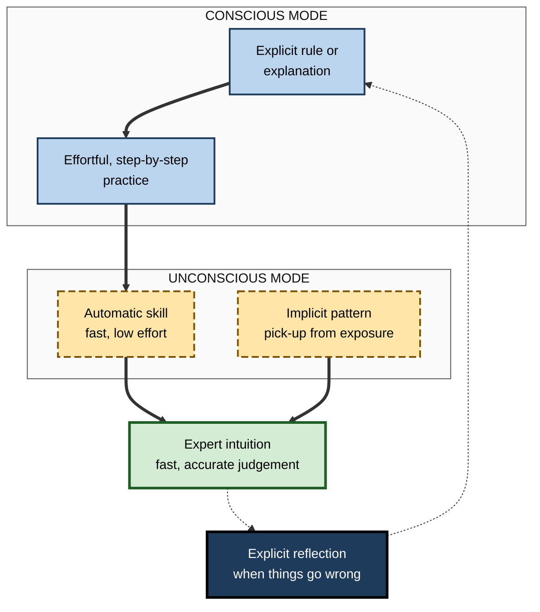
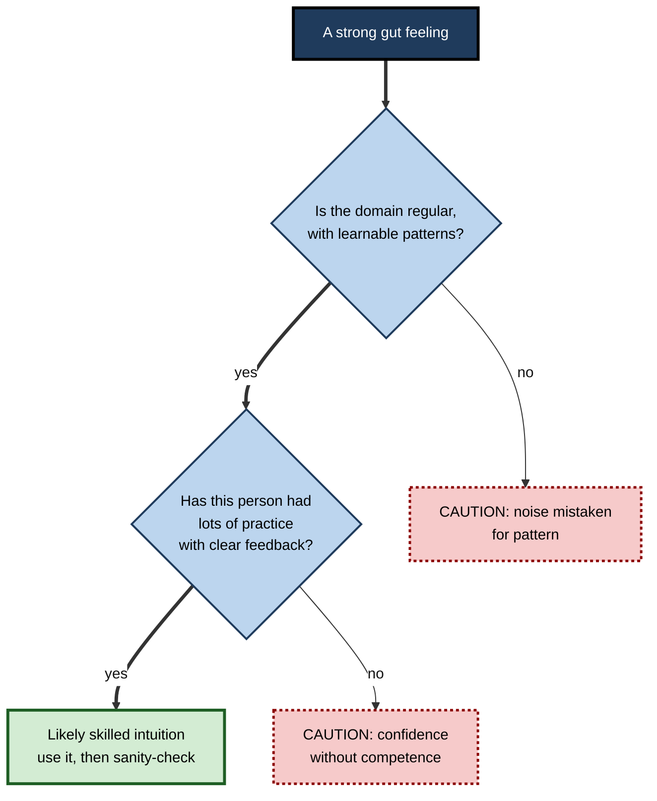

# A.5. Conscious vs. Unconscious Learning

> **In one sentence:** Some learning happens on purpose and you know you are doing it (conscious, or explicit, learning); a great deal happens without you noticing, simply by being exposed to patterns again and again (unconscious, or implicit, learning).
>
> **Why it matters:** Much of what makes experts good — intuition, "feel", fast pattern recognition — was learned implicitly and is hard for them to explain. Knowing how both kinds of learning work helps you build real intuition faster, avoid learning the wrong patterns, and get tacit expertise out of experts' heads and into other people's.
>
> **Level span:** Novice → Expert · **Reading time:** ~17 min · **Builds on:** types of learning (declarative versus procedural knowledge)

---

## The Learning Ladder

| Level | Badge | After this level you can... |
|---|---|---|
| 1 | NOVICE | Tell the difference between learning you notice and learning that happens without noticing, with examples. |
| 2 | FOUNDATIONS | Define explicit, implicit, statistical and tacit learning, and automaticity. |
| 3 | PRACTITIONER | Use both modes deliberately: explicit study for foundations, high-volume exposure with feedback for intuition. |
| 4 | ADVANCED | Explain the classic experiments, the measurement problem around awareness, and when intuition can be trusted. |
| 5 | EXPERT / PRO | Capture tacit expertise, design environments that teach the right patterns, and guard against learned biases. |

---

## Level 1 · Novice — The Big Picture

You learned your native language without studying grammar. Nobody explained to you, aged three, when to say "went" instead of "goed" — yet you learned the pattern by hearing thousands of sentences. You still cannot fully explain the rules, but you use them perfectly. That is **unconscious learning**.

Now think of learning a second language at school: memorising verb tables, practising conjugations, checking rules. You knew you were learning, and you could state what you had learned. That is **conscious learning**.

An analogy: conscious learning is like reading a map of a city. Unconscious learning is like living in the city for a year — you may not be able to draw the map, but you know which streets are quick, which corners are risky, and when the traffic gets bad.

You have already experienced unconscious learning when:

- you "just knew" a meeting was going to go badly before anyone said anything;
- you can type fast but cannot say where the letter "k" is without looking at your fingers;
- a song's next note feels "right" or "wrong" even though you know no music theory.

The beginner's takeaway: **you are always learning, even when you are not trying. That is powerful — and it means the environment you spend time in is teaching you, for better or worse.**

---

## Level 2 · Foundations — Core Concepts

### Key terms

| Term | Plain meaning |
|---|---|
| **Explicit learning** | Learning with awareness and intention; the result can usually be put into words. |
| **Implicit learning** | Learning that happens without intention and largely without awareness of what was learned. |
| **Statistical learning** | Picking up regularities — what tends to follow what — from repeated exposure. |
| **Tacit knowledge** | Knowledge you use but find hard to express. The philosopher Michael Polanyi summed it up as "we can know more than we can tell". |
| **Automaticity** | The state where a skill runs fast and with little conscious effort. |
| **Intuition** | A fast judgement based on recognising a pattern, without step-by-step reasoning. |

### How the two modes compare

| Feature | Conscious (explicit) | Unconscious (implicit) |
|---|---|---|
| Intention | Deliberate | Usually incidental |
| Awareness | You know what you learned | You may not know you learned anything |
| Speed of acquisition | Can be fast — one explanation can do it | Usually slow; needs many exposures |
| What it is good for | Rules, facts, reasons, rare cases | Patterns, timing, feel, fluent skill |
| Effort | Uses working memory; tiring | Low effort |
| Explaining it | Easy | Hard |
| Under stress | Fragile; working memory gets crowded | Relatively robust |

### Conscious and unconscious work together

They are not rival systems so much as partners. Explicit instruction often gives you the first foothold ("check your mirror before indicating"); repetition then makes the behaviour automatic, and the explicit rule fades from awareness. Meanwhile implicit learning picks up subtleties that nobody taught you.

**Figure A.5-1 — How conscious and unconscious learning hand over to each other.**

*How to read it:* thick arrows show how rules become automatic and combine with absorbed patterns to form intuition; the dotted loop shows experts switching back to conscious analysis when something unexpected happens.

---

## Level 3 · Practitioner — Putting It to Work

### Use each mode for what it is good at

1. **Start explicit for the foundations.** Learn the key rules, concepts and dangerous exceptions consciously. Implicit learning is slow and can pick up wrong patterns; a few explicit rules prevent costly errors.
2. **Then go high-volume.** Expose yourself to many varied, real examples — code reviews, sales calls, financial statements, X-rays, user interviews. Volume is the fuel of implicit learning.
3. **Insist on feedback.** Implicit learning only builds *accurate* intuition if outcomes are visible. Make a prediction for each example ("this PR will cause a bug", "this deal will close"), then check what actually happened.
4. **Mix the examples.** Interleaving different cases helps the brain detect the features that really distinguish them.
5. **Periodically make it explicit.** Write down the patterns you think you have noticed and test them. This catches false patterns and makes your knowledge teachable.

### Worked example — a junior product analyst building intuition for data quality

| | Before | After |
|---|---|---|
| **Approach** | Reads a guide on data-quality rules; checks dashboards only when asked. | Learns the ten key rules explicitly in week one, then reviews 15 real dashboards a week, predicting "trustworthy or not" before checking with a senior. |
| **Feedback** | Rare and late. | Immediate on each prediction. |
| **Reflection** | None. | Fortnightly, writes "patterns I'm noticing" and discusses with a mentor. |
| **After three months** | Still applies rules slowly and misses subtle problems. | Spots suspicious spikes "at a glance", and can explain most of the cues behind the hunch. |

### Common mistakes at this level

- **Relying on exposure without feedback.** Years of experience without outcome feedback can produce confident but wrong intuition.
- **Over-explaining automatic skills.** Thinking step by step about a well-practised skill under pressure can disrupt it.
- **Assuming experts can explain everything they do.** Their verbal accounts often omit crucial steps they no longer notice.
- **Forgetting that environments teach.** A team culture that rewards heroics over prevention trains people implicitly, whatever the training slides say.

---

## Level 4 · Advanced — Mechanisms, Models & Evidence

### The classic experiments

- **Artificial grammar learning.** In the 1960s Arthur Reber had people memorise letter strings generated by hidden rules. Afterwards they could classify new strings as "grammatical" better than chance, while being unable to state the rules.
- **Serial reaction time task.** In 1987 Mary Jo Nissen and Peter Bullemer had people press keys in response to lights. When a repeating sequence was hidden in the lights, responses sped up — even in people who did not notice the sequence, and in amnesic patients who could not remember the sessions.
- **Infant statistical learning.** In 1996 Jenny Saffran and colleagues showed that eight-month-old infants, after two minutes of listening to a continuous stream of syllables, distinguished "words" (syllables that always followed each other) from chance combinations. The brain tracks probabilities automatically.

### The measurement problem

Whether learning is *truly* unconscious is surprisingly hard to prove. Awareness tests may be too insensitive, so people seem unaware when they have partial conscious knowledge. Many tasks used to measure implicit learning also require explicit judgements. Recent work, including several 2024 studies, has tried processing-based measures (such as reaction-time benefits) that do not require reflection, with mixed results — some failed to find learning that judgement-based tasks had shown. The cautious current view: implicit and explicit processes both exist and interact, but the boundary is fuzzy, and many effects once labelled "unconscious" involve some awareness.

### Dual-process views and intuition

Popularised by Daniel Kahneman, **dual-process** accounts distinguish fast, automatic, intuitive processing from slow, deliberate, effortful reasoning. The terms are a useful simplification rather than literally two brain systems.

When can intuition be trusted? Kahneman and the naturalistic decision researcher Gary Klein, initially on opposing sides, agreed in 2009 on two conditions:

1. **The environment is regular enough** — there are real patterns to learn (chess, firefighting, many medical diagnoses, code review), unlike highly random domains (long-term stock picking, many political forecasts).
2. **The person has had extensive practice with timely, clear feedback.**

If either condition fails, confident intuition is likely to be wrong.

**Figure A.5-2 — When to trust an intuition.**

*How to read it:* only intuitions that pass both checks on the thick path deserve trust; dotted-border boxes mark the two classic failure modes.

### Choking and the expert blind spot

Two well-studied effects follow from automaticity. First, **choking under pressure**: skilled performers who start consciously monitoring each step of an automated skill can perform worse. Second, the **expert blind spot**: because experts' knowledge is automated, their explanations to novices often skip steps they no longer notice. Studies of expert explanations using cognitive task analysis have repeatedly found that experts leave out a substantial share of the decisions they actually make.

### Learned associations and bias

Implicit learning does not care whether a pattern is fair. People absorb associations from their environment — for example about which kinds of people tend to hold which roles. The extent to which measures of implicit attitudes predict individual behaviour is contested, and brief "implicit bias training" sessions have shown little lasting behavioural effect in research. Structural fixes — structured interviews, clear criteria, diverse examples — have stronger support.

---

## Level 5 · Expert / Pro — Professional Mastery

### Extracting tacit knowledge

Organisations lose expertise when senior people leave because much of it is tacit. Professional methods to capture it include:

| Method | How it works | Good for |
|---|---|---|
| **Cognitive task analysis** | Structured interviews that walk an expert through real incidents, probing cues, decisions and alternatives at each point. | Diagnosis, troubleshooting, high-stakes judgement |
| **Think-aloud recording** | The expert works a real case while narrating. | Coding, analysis, design critique |
| **Contrasting cases** | Experts sort or compare pairs of similar cases and explain what differs. | Fine perceptual distinctions |
| **Apprenticeship and shadowing** | Novices observe and work alongside experts over time. | Context-rich, social skills |
| **Decision journals** | Experts record predictions and reasons, then outcomes. | Calibrating and documenting judgement |

### Designing environments that teach the right patterns

- **Shorten feedback loops** so implicit learning has accurate signals: post-incident reviews, deal debriefs, prediction tracking.
- **Curate high-volume, varied cases** — case libraries of real tickets, code reviews or client situations, labelled with outcomes.
- **Make good practice the visible default**, because people absorb what they see repeatedly.
- **Use perceptual learning modules** — rapid classification of many examples with feedback — for domains that depend on "seeing" (radiology, fraud detection, UI review).

### Professional scenario

**Role:** Site reliability engineering (SRE) lead.
**Situation:** Two senior engineers handle most major incidents because they "just know where to look". Juniors read runbooks but freeze during real outages.
**What the pro does:** Runs cognitive task analysis interviews on five past incidents with each senior, extracting the cues they check first and why. Turns the results into a library of incident replays where juniors predict the next diagnostic step before seeing what the expert did. Pairs juniors as shadow responders on real incidents, with a debrief after each. Within two quarters, juniors lead more incidents with seniors as backup.

### AI-era implications

- **Intuition needs exposure you can no longer get by accident.** If AI drafts every first version, juniors see fewer raw cases. Deliberately preserve volume of first-hand practice.
- **AI can help surface tacit knowledge** — for example, interviewing experts and summarising their decision patterns — but the outputs need expert verification.
- **Over-trust is itself learned implicitly.** Repeatedly seeing AI be right teaches people to stop checking; build in periodic verification.

---

## Myths vs. Evidence

| Myth | What the evidence shows |
|---|---|
| "You can learn complex skills subliminally, without paying any attention." | Implicit learning still needs attention to the material; it is the *rules* you may be unaware of, not the input. |
| "Gut feeling is always wisdom." | Intuition is trustworthy only in regular environments with extensive, feedback-rich practice. |
| "Experts can tell you how they do it." | Experts typically omit many automated decisions when describing their work. |
| "Experience automatically produces expertise." | Without accurate feedback, experience can produce confident error. |
| "A one-hour bias workshop removes unconscious bias." | Brief trainings show little lasting effect on behaviour; structural changes work better. |
| "Unconscious learning is better than conscious learning." | Each suits different goals; the best learning combines explicit foundations with implicit pattern-building. |

## Practitioner Toolkit

**Intuition-building routine (weekly)**

- [ ] Learn or refresh the key explicit rules and dangerous exceptions.
- [ ] Work through at least ten real, varied cases.
- [ ] Make a prediction *before* seeing each outcome.
- [ ] Record hits and misses in a simple log.
- [ ] Once a fortnight, write down the patterns you think you use and test them with a mentor.

**Template — prediction log**

| Date | Case | My prediction | Confidence (low/med/high) | Actual outcome | Cue I used |
|---|---|---|---|---|---|
| | | | | | |

## Self-Check

1. **[NOVICE]** Give an example of something you learned without trying to.
2. **[NOVICE]** Why is it hard to explain how you ride a bicycle?
3. **[FOUNDATIONS]** Define implicit learning and tacit knowledge.
4. **[FOUNDATIONS]** List three differences between explicit and implicit learning.
5. **[PRACTITIONER]** How would you build intuition for spotting risky contracts as a new legal analyst?
6. **[ADVANCED]** What did the serial reaction time experiments show?
7. **[ADVANCED]** What two conditions must hold for intuition to be trustworthy?
8. **[EXPERT / PRO]** A senior expert is retiring in six months. How do you capture their tacit knowledge?
9. **[EXPERT / PRO]** Why can heavy AI use slow the development of junior professionals' intuition?

### Answer Key

1. Examples: your accent, typing positions, office norms, the "feel" of when a meeting is going off track.
2. The knowledge is procedural and automated; it is stored as skill rather than as statements.
3. Implicit learning: learning without intention or full awareness of what was learned. Tacit knowledge: knowledge you use but cannot easily put into words.
4. Any three: intentional versus incidental; aware versus unaware; fast versus slow acquisition; effortful versus low-effort; easy versus hard to explain; fragile versus robust under stress.
5. Learn key red-flag rules explicitly, review many real contracts with known outcomes, predict risk before checking with a senior, and periodically write down the cues you use.
6. People's responses sped up for hidden repeating sequences even when they did not notice the sequence, and amnesic patients showed the same learning.
7. A regular environment with learnable patterns, and extensive practice with timely, clear feedback.
8. Cognitive task analysis on real past cases, think-aloud sessions, contrasting cases, shadowing, and turning the results into a case library with predictions and feedback.
9. Intuition grows from high-volume first-hand exposure with feedback; if AI does the first pass, juniors encounter fewer raw cases and do less of the pattern-detection themselves.

## Key Takeaways

- Learning happens **with and without awareness**; both matter.
- **Explicit learning** is fast for rules and facts; **implicit learning** builds patterns, fluency and intuition through volume.
- Skills move from conscious and effortful to **automatic**, which frees attention but makes them hard to explain.
- **Intuition is trustworthy only** in regular environments after lots of practice with clear feedback.
- Environments teach implicitly — **design them to teach the right patterns**.
- Expert knowledge is partly **tacit**; capture it with structured methods, not just interviews.

## Glossary

| Term | Meaning |
|---|---|
| Artificial grammar learning | An experimental task in which people learn hidden rules from example strings. |
| Automaticity | Fast, low-effort performance of a well-practised skill. |
| Choking under pressure | Worse performance caused by conscious monitoring of an automated skill under stress. |
| Cognitive task analysis | Structured methods for uncovering the knowledge and decisions behind expert performance. |
| Dual-process theory | The idea that thinking combines fast intuitive and slow deliberate modes. |
| Expert blind spot | Experts' tendency to overlook steps that have become automatic for them. |
| Explicit learning | Intentional learning with awareness of what is learned. |
| Implicit learning | Learning without intention or full awareness of what is learned. |
| Statistical learning | Automatic detection of regularities in input. |
| Tacit knowledge | Knowledge that is used but hard to articulate. |
