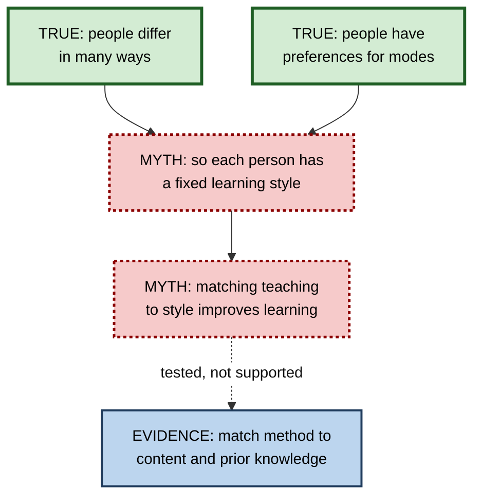
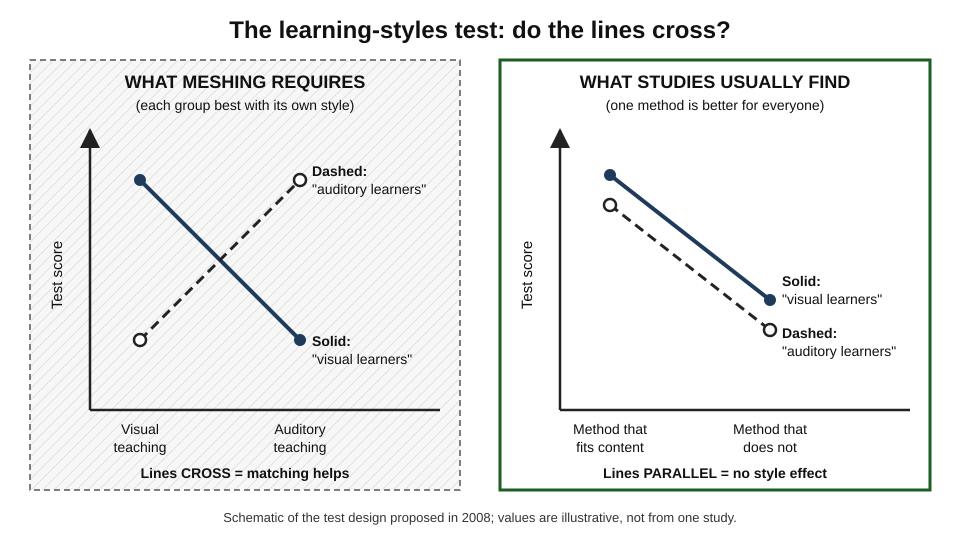
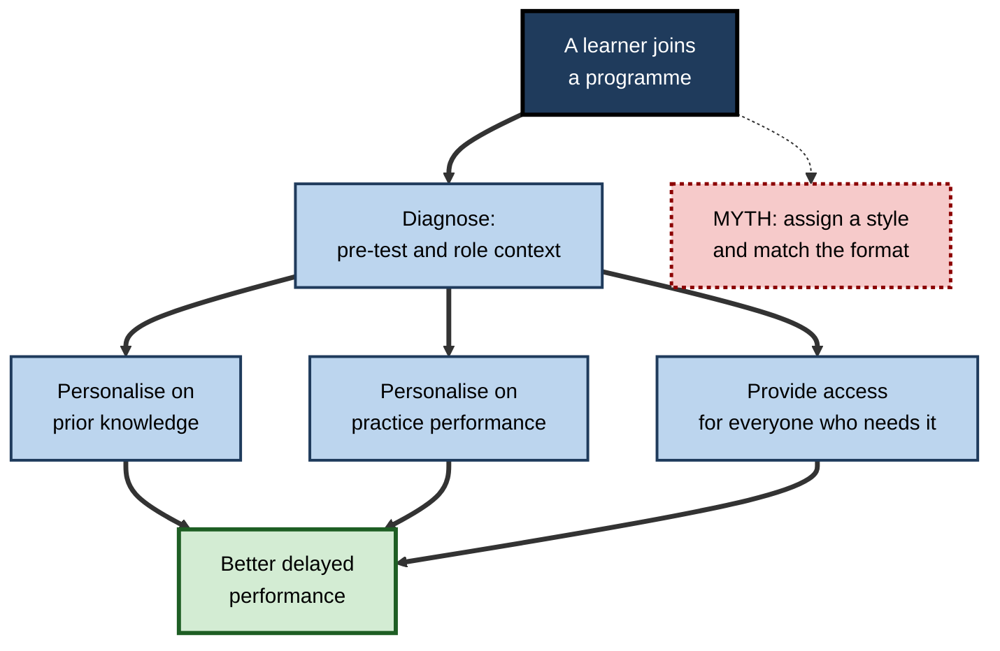

# A.6. Learning Styles Myths vs. Evidence

> **In one sentence:** The popular idea that each person is a "visual", "auditory" or "kinaesthetic" learner and learns best when teaching matches that style has been tested many times and is not supported — but some real differences between learners *do* matter.
>
> **Why it matters:** Belief in learning styles is still widespread among teachers, trainers and learners. It wastes design budgets, narrows how people study, and distracts from the individual differences that genuinely change outcomes, such as prior knowledge.
>
> **Level span:** Novice → Expert · **Reading time:** ~17 min · **Builds on:** the science of learning (how claims are tested); types of learning

---

## The Learning Ladder

| Level | Badge | After this level you can... |
|---|---|---|
| 1 | NOVICE | Explain what the learning-styles idea claims and why it is called a myth. |
| 2 | FOUNDATIONS | Distinguish styles, preferences, strategies and abilities, and state the "meshing hypothesis". |
| 3 | PRACTITIONER | Replace style-based study habits and designs with methods that fit the *content* and the learner's *prior knowledge*. |
| 4 | ADVANCED | Explain the crossover test, summarise the meta-analytic evidence, and say why the myth persists. |
| 5 | EXPERT / PRO | Handle the myth diplomatically in organisations and personalise learning on factors that actually matter. |

---

## Level 1 · Novice — The Big Picture

You may have taken a quiz at school or work that told you, "You are a visual learner." The idea is attractive: everyone is different, so surely everyone learns differently, and teaching should be matched to each person's style. Visual learners would get diagrams, auditory learners would get lectures and podcasts, and kinaesthetic learners would get hands-on activities.

The problem is that when scientists actually test this — teaching "visual" and "auditory" learners in both ways and comparing results — matching does not make people learn more. Everyone tends to learn better from the *method that suits the material*, whatever their supposed style.

Think of food. You may *prefer* pizza to vegetables, and you may really be different from your friend in that preference. But it does not follow that your body digests pizza better or that you need a "pizza diet" to be healthy. **Preference is real; the claimed benefit of matching is not.**

You have already seen this when, regardless of your "style", you learned to drive by driving, learned a map by looking at a map, and learned to pronounce a word by hearing it. The *content* chose the best mode, not your personality.

The beginner's takeaway: **don't limit yourself to a "style". Use whatever mode best fits what you are learning — and usually, combine several.**

---

## Level 2 · Foundations — Core Concepts

### What the theory claims

There are more than 70 published learning-style models. The best known include:

| Model | Categories | Note |
|---|---|---|
| **VAK / VARK** | Visual, Auditory, (Read/write), Kinaesthetic | The most popular in schools and corporate training |
| **Kolb's experiential learning styles** | Diverging, assimilating, converging, accommodating | Built on Kolb's useful experiential learning *cycle*; the *styles* inventory has weak evidence |
| **Honey and Mumford** | Activist, reflector, theorist, pragmatist | Common in UK management training |

All share a core promise: **identify the person's style, then match instruction to it, and they will learn more.** This promise is called the **meshing hypothesis** (or matching hypothesis).

### Four things that get confused

| Concept | What it means | Is it real? |
|---|---|---|
| **Style** | A fixed way a person learns best | No good evidence that matching it helps |
| **Preference** | The mode a person *likes* | Yes — people do have preferences, and can report them |
| **Strategy** | What a person *does* to learn (self-testing, re-reading, drawing) | Yes — and strategy choice strongly affects results |
| **Ability** | How good someone is at, say, visual-spatial reasoning | Yes — measurable, but different from a style |

Most of the confusion comes from sliding from "people prefer different things" (true) to "people learn better when taught in their preferred way" (not supported).

### Key terms

| Term | Plain meaning |
|---|---|
| **Learning style** | A supposed fixed mode in which a person learns best. |
| **Meshing hypothesis** | The claim that matching instruction to a learner's style improves learning. |
| **Neuromyth** | A widespread false belief about the brain and learning. |
| **Crossover interaction** | A result pattern where group A does better with method 1 and group B does better with method 2. |
| **Multimodal learning** | Learning that combines several representations — words, pictures, actions. |

**Figure A.6-1 — From a true premise to an unsupported conclusion.**

*How to read it:* thick-border boxes are true premises; dotted-border boxes are the unsupported leaps; the dotted arrow shows where testing redirects us.

---

## Level 3 · Practitioner — Putting It to Work

### Replace "my style" with three better questions

1. **What does the content demand?** Geography needs maps; pronunciation needs sound; surgery needs hands-on practice; statistics benefits from both formulas and graphs.
2. **What do I already know?** Beginners need more structure, worked examples and guidance; advanced learners benefit from problems and less hand-holding.
3. **Which strategy builds memory?** Self-testing, spacing, explaining, and combining words with visuals work for virtually everyone.

### A style-free study routine

1. Read or watch the material once, choosing the format that best shows the content.
2. Close it and **retrieve** what you remember — write, say or sketch.
3. **Re-represent** it in a second form: turn text into a diagram, or a diagram into an explanation. This is **dual coding**, combining verbal and visual representations.
4. **Apply** it to a problem or real task.
5. Space and repeat the retrieval over days.

### Worked example — a "kinaesthetic learner" studying for a cloud certification

| | Before (style-matched) | After (content- and evidence-matched) |
|---|---|---|
| **Belief** | "I'm hands-on, so reading and diagrams don't work for me." | "Different content needs different modes." |
| **Architecture concepts** | Skips the diagrams; clicks around the console. | Studies reference architecture diagrams, then redraws them from memory. |
| **Service limits and pricing facts** | Avoids — "not my style". | Spaced flashcards with self-testing. |
| **Configuration tasks** | Console practice. | Console practice — the right mode *for this content*, not for a style. |
| **Result** | Strong on clicking, weak on design questions. | Passes, and can explain trade-offs in design reviews. |

### Common mistakes at this level

- **Avoiding modes you think are "not your style"**, which narrows how much you can learn.
- **Spending design budget on multiple style-specific versions** of the same course.
- **Labelling people**, which can lower expectations and effort ("I'm not a reader").
- **Throwing out the good with the bad.** Multimodal, hands-on and visual materials are often excellent — because of the content, not because of styles.

---

## Level 4 · Advanced — Mechanisms, Models & Evidence

### The crossover test

In an influential 2008 review, Harold Pashler, Mark McDaniel, Doug Rohrer and Robert Bjork set out what evidence would be needed to support the meshing hypothesis. Learners must first be classified by style; then each group must be randomly assigned to different instructional methods; then everyone must take the same test. Support requires a **crossover interaction**: visual learners do better with visual instruction *and* auditory learners do better with auditory instruction. If one method is simply better for everyone, that is evidence about the method, not about styles.

*Figure A.6-2 — What the meshing hypothesis predicts versus what studies typically find.* Left: the crossing lines that matching requires. Right: the common real pattern — one method (here the one that suits the content) is better for both groups, so the lines do not cross. Schematic.

The 2008 review found that very few studies used this design, and those that did largely failed to show the crossover.

### What later evidence shows

- Experiments with the proper design since 2008 — for example studies by Laura Rogowsky and colleagues on reading versus listening comprehension — found no benefit of matching.
- Studies of university students who were told their style found most did not study in line with it, and those who did gained no advantage.
- A 2024 meta-analysis of studies that tested the matching hypothesis directly (21 studies, about 1,700 participants) found that only around a quarter of the reported outcomes showed the required crossover, and judged the overall effect too small and inconsistent to justify style-matched teaching.
- A 2025 review of many meta-analyses argued that apparent "styles" effects in some syntheses come from mixing up styles with *preferences* and *strategies* — strategies do affect learning, styles as fixed traits do not.

### Why the myth persists

1. **It flatters and feels fair.** It treats everyone as uniquely capable.
2. **It contains a true core.** People do differ and do have preferences.
3. **Self-reports are confirmed by experience.** People notice when their "style" worked and forget when it did not.
4. **Commercial and institutional inertia.** Inventories, certifications and teacher-training materials have promoted styles for decades.
5. **Fluency illusion.** Material in a preferred format *feels* easier, which is mistaken for better learning.

Surveys across many countries have repeatedly found that a large majority of teachers endorse learning-styles matching, often higher than for any other neuromyth, and that general knowledge of neuroscience does not reliably protect against it.

### Individual differences that do matter

| Difference | Why it matters | Design response |
|---|---|---|
| **Prior knowledge** | The strongest predictor of new learning. Methods that help novices can hinder experts — the **expertise reversal effect**. | Diagnose with a pre-test; give novices worked examples and experts problems. |
| **Working memory capacity** | Lower capacity makes complex, unsupported tasks harder. | Reduce unnecessary load; segment content. |
| **Specific disabilities** | Dyslexia, hearing or visual impairment, ADHD and others change what access people need. | Accessibility and Universal Design for Learning — offering multiple means of access *for everyone*, which is different from styles matching. |
| **Language proficiency** | Affects reading and listening load. | Plain language, glossaries, captions. |
| **Motivation and interest** | Affects effort and persistence. | Relevance, choice, autonomy. |

---

## Level 5 · Expert / Pro — Professional Mastery

### Handling the myth in organisations

Learning styles are embedded in many leadership programmes, onboarding decks and vendor products. Professionals respond with care rather than ridicule:

1. **Acknowledge the true part.** "Yes, people differ, and preferences are real."
2. **Redirect to the test.** "When it is tested by matching teaching to styles, learning does not improve."
3. **Offer a better alternative.** "Let's personalise on prior knowledge and the needs of the content, and make everything multimodal and accessible."
4. **Avoid labelling.** Remove style inventories from onboarding; keep preference surveys only for engagement and logistics.

### Personalisation that works

Modern adaptive platforms and AI tutors can personalise in ways that are evidence-based:

| Personalise on | Example |
|---|---|
| Current knowledge | Skip modules a pre-test shows are mastered; give more practice on weak areas. |
| Performance during practice | Adjust difficulty and spacing based on recall success. |
| Role and context | Use examples from the learner's own job. |
| Accessibility needs | Captions, transcripts, screen-reader-friendly formats for whoever needs them. |

Be sceptical of any product that personalises on "learning style" — it signals that the vendor has not engaged with the evidence.

**Figure A.6-3 — What to personalise on, and what not to.**

*How to read it:* the thick paths are evidence-based forms of personalisation; the dotted branch is the style-matching route that research does not support.

### Professional scenario

**Role:** Head of L&D at a professional services firm.
**Situation:** A leadership programme begins with a learning-styles inventory, and each participant receives a "style profile" that facilitators use to tailor coaching.
**What the pro does:** Replaces the inventory with a short skills diagnostic on the programme's target capabilities (feedback, delegation, prioritisation). Facilitators tailor coaching to the diagnostic gaps. All materials are redesigned to combine visuals, text and practice for everyone, with full captioning. Participants' delayed skill assessments improve, and the time freed from producing style-specific variants funds more practice sessions.

### AI-era implications

- AI makes it trivially easy to generate "visual", "audio" and "hands-on" versions of everything. The evidence says the useful question is not "which version for which person?" but "which representation best fits this content, and what practice will follow?".
- Asking an AI tutor to "teach me in my learning style" is harmless as preference, but the learning gain comes from retrieval, explanation and feedback, not from the style.

---

## Myths vs. Evidence

| Myth | What the evidence shows |
|---|---|
| "I am a visual (or auditory, or kinaesthetic) learner." | You may prefer a mode, but matching instruction to it does not improve your learning. |
| "Teaching to each style is good differentiation." | Differentiate on prior knowledge, needs and accessibility, not styles. |
| "Learning styles are proven by neuroscience." | The brain integrates information across senses; no neuroscience supports fixed sensory learning styles. |
| "Kolb's cycle proves learning styles." | Experiential learning cycles can be useful design guides; the styles inventory built on them has weak evidence. |
| "Since styles are a myth, all learners are the same." | Learners differ meaningfully in prior knowledge, working memory, interest and access needs. |
| "Multimodal teaching works because it hits every style." | Multimodal teaching often helps everyone, by building richer representations — not because it matches styles. |

## Practitioner Toolkit

**Style-free design checklist**

- [ ] The format of each segment is chosen to fit the content.
- [ ] Key ideas are shown in more than one representation (words plus visuals).
- [ ] Every segment includes active practice and retrieval.
- [ ] A pre-test or diagnostic guides personalisation.
- [ ] Accessibility (captions, transcripts, alt text) is built in for all.
- [ ] No "style" labels are assigned to learners.

**Script — responding to "I'm a visual learner"**

"That makes sense as a preference — lots of people like visuals. Research has tested whether teaching people in their preferred style helps them learn more, and it consistently doesn't. What does help is mixing formats and testing yourself. Let's use diagrams *and* explain them in words, then quiz you on it."

## Self-Check

1. **[NOVICE]** What does the learning-styles idea claim?
2. **[NOVICE]** What is the difference between preferring a format and learning better from it?
3. **[FOUNDATIONS]** What is the meshing hypothesis?
4. **[FOUNDATIONS]** Distinguish a style, a preference, a strategy and an ability.
5. **[PRACTITIONER]** How should a learner choose between reading, watching and doing?
6. **[ADVANCED]** Describe the crossover interaction needed to support learning styles.
7. **[ADVANCED]** Give three reasons the myth persists.
8. **[EXPERT / PRO]** A vendor's adaptive platform "personalises by learning style". What do you ask?
9. **[EXPERT / PRO]** Which individual differences should a personalised programme target?

### Answer Key

1. That people have a fixed sensory or cognitive style and learn better when teaching matches it.
2. Preference is what you like; learning is what you retain and can use. Studies show preference does not predict benefit from matched teaching.
3. The claim that matching instruction to a learner's style improves learning outcomes.
4. Style: a supposed fixed best mode. Preference: what you like. Strategy: what you do to learn. Ability: a measurable capacity.
5. By what the content requires, then reinforce with retrieval and a second representation.
6. People classified by style are randomly given different methods; each group must do best with its matched method, so the lines on a graph cross.
7. Any three: flattering, true core, confirmation from experience, commercial inertia, fluency illusion.
8. What evidence shows matching improves delayed learning with a crossover design? Can it personalise on knowledge and performance instead?
9. Prior knowledge, performance during practice, working memory demands, accessibility needs, language, role context and motivation.

## Key Takeaways

- The claim that **matching teaching to a learning style improves learning is not supported** by well-designed studies.
- **Preferences are real**; their link to better learning is not.
- The decisive test is a **crossover interaction**, and it rarely appears.
- **Choose formats by content**, combine words and visuals, and always add retrieval and practice.
- Personalise on **prior knowledge, performance and accessibility**, not styles.
- Address the myth **respectfully**: acknowledge the true premise, then redirect.

## Glossary

| Term | Meaning |
|---|---|
| Crossover interaction | A pattern in which each group performs best with a different method. |
| Dual coding | Representing information in both verbal and visual form to aid memory. |
| Expertise reversal effect | The finding that methods helpful for novices can become unhelpful or harmful for experts. |
| Learning preference | A person's liking for a particular mode of instruction. |
| Learning style | A supposed fixed best mode of learning for an individual. |
| Meshing hypothesis | The claim that matching instruction to learning style improves learning. |
| Multimodal | Using several kinds of representation, such as words, images and actions. |
| Neuromyth | A widespread misconception about the brain applied to education. |
| Universal Design for Learning | A framework for providing multiple means of access, engagement and expression for all learners. |
| VARK | A learning-styles model: visual, aural, read/write, kinaesthetic. |
