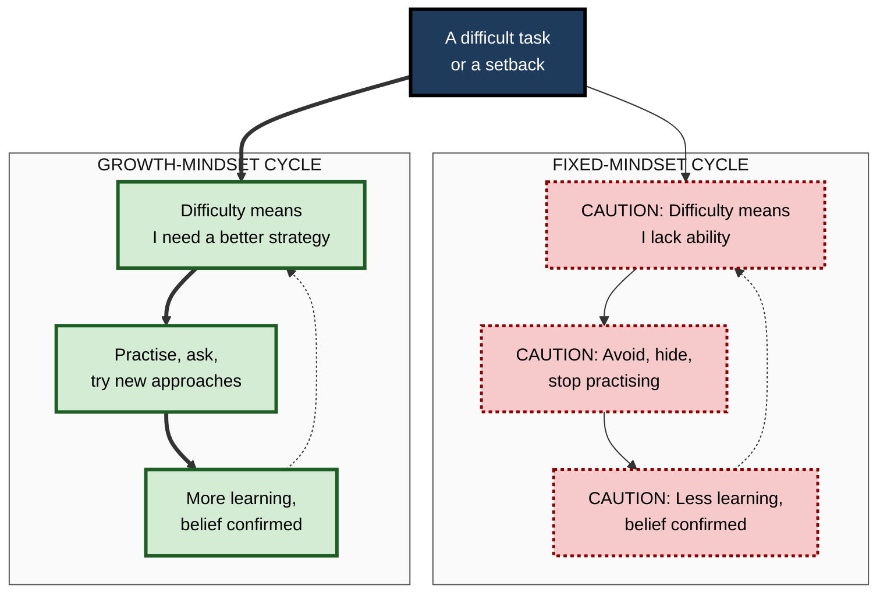
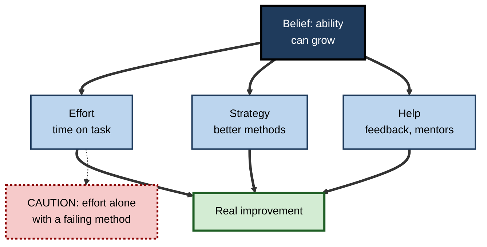

# A.7. Growth Mindset for Learners

> **In one sentence:** A growth mindset is the belief that your abilities can be developed through effort, good strategies and help from others — as opposed to a fixed mindset, the belief that ability is something you either have or do not.
>
> **Why it matters:** Beliefs about ability shape how people respond to difficulty, feedback and mistakes — the exact moments where learning happens. The evidence is more modest and more conditional than popular accounts suggest, so professionals need to know both what mindset can do and what it cannot.
>
> **Level span:** Novice → Expert · **Reading time:** ~18 min · **Builds on:** the definition of learning; desirable difficulties (effort that feels hard but builds lasting learning)

---

## The Learning Ladder

| Level | Badge | After this level you can... |
|---|---|---|
| 1 | NOVICE | Describe fixed and growth mindsets and recognise each in everyday self-talk. |
| 2 | FOUNDATIONS | Explain how mindset links to goals, effort beliefs, reactions to failure and feedback. |
| 3 | PRACTITIONER | Use a growth-mindset routine for setbacks that focuses on strategy, not just effort. |
| 4 | ADVANCED | Summarise the evidence — including the replication debate and who benefits — accurately. |
| 5 | EXPERT / PRO | Build learning cultures and feedback practices that support growth without empty slogans. |

---

## Level 1 · Novice — The Big Picture

Two new analysts get the same harsh comment on their first report: "The analysis is shallow and the conclusions don't follow."

- The first thinks: *"I'm just not good at this. Maybe I'm not an analytical person."* They avoid the next difficult assignment and start hiding drafts until they are "perfect".
- The second thinks: *"I don't know how to do this well yet. What exactly made it shallow? Who could show me?"* They ask a senior for an example of a strong report and try again.

Same event, different beliefs, different behaviour. The first is showing a **fixed mindset** — treating ability as a fixed amount. The second is showing a **growth mindset** — treating ability as something that grows with effort, strategy and help.

An analogy: a fixed mindset sees ability like height — you get what you get. A growth mindset sees it like fitness — where you start matters, but training changes it.

You have already experienced this if you have ever said "I'm just not a numbers person" or "I'm terrible at languages" — and, on another day, stuck with something difficult until it clicked.

The beginner's takeaway: **when something is hard, add the word "yet": "I can't do this *yet*." Then ask what strategy or help would get you there.**

---

## Level 2 · Foundations — Core Concepts

### Origins

The psychologist Carol Dweck and her colleagues developed mindset theory from the 1970s onwards, originally studying how children responded to failure. Some became helpless after difficult problems; others became more engaged. The difference was linked to their implicit beliefs — or **implicit theories** — about whether intelligence is fixed (an "entity theory") or malleable (an "incremental theory").

### The two mindsets compared

| Situation | Fixed mindset tends to... | Growth mindset tends to... |
|---|---|---|
| **Goals** | Look smart, avoid looking incapable (**performance goals**) | Get better, master the skill (**learning goals**) |
| **Challenge** | Avoid it — risk of exposure | Seek it — chance to grow |
| **Effort** | See it as a sign of low ability ("if I were good, it would be easy") | See it as the path to ability |
| **Setbacks** | Give up or blame | Change strategy and persist |
| **Feedback** | Feel attacked; ignore or argue | Mine it for information |
| **Others' success** | Feel threatened | Find lessons and inspiration |

**Figure A.7-1 — Two belief-driven cycles.**

*How to read it:* each belief leads to behaviour that produces evidence confirming the belief; dotted arrows close each self-reinforcing loop.

### Key terms

| Term | Plain meaning |
|---|---|
| **Mindset (implicit theory)** | A person's underlying belief about whether an ability can change. |
| **Fixed mindset** | The belief that ability is a fixed trait. |
| **Growth mindset** | The belief that ability can be developed. |
| **Learning goal** | A goal to improve competence. |
| **Performance goal** | A goal to demonstrate competence or avoid looking incompetent. |
| **Process praise** | Praise for strategies, effort and choices rather than for talent. |
| **False growth mindset** | Dweck's term for shallow versions — praising effort alone, or claiming a growth mindset without changing practice. |

---

## Level 3 · Practitioner — Putting It to Work

A real growth mindset is not "just try harder". Effort with the same failing strategy produces the same failure. The practical form is: **effort + strategy + help**.

### The setback routine

1. **Name the reaction.** "I notice I'm thinking I'm just not good at this."
2. **Reframe to "yet".** "I can't do this yet."
3. **Diagnose specifically.** What exactly went wrong — knowledge, skill, time, approach?
4. **Change one strategy.** Pick a different method: worked examples, a smaller sub-task, retrieval practice, a different explanation.
5. **Ask for targeted help.** "Can you show me how you would approach this part?"
6. **Track progress over time,** not against others. Compare with yourself a month ago.

**Figure A.7-2 — Effort plus strategy plus help.**

*How to read it:* the belief is useful only when it leads to all three inputs; effort without new strategy (dotted) is the common trap.

### Worked example — a developer struggling with system design interviews

| | Before | After |
|---|---|---|
| **Self-talk** | "I'm a coder, not an architect. Some people just think that way." | "I haven't learned system design yet." |
| **Effort** | Watches more videos, same way. | Same hours, different approach. |
| **Strategy** | Passive viewing. | Draws designs from memory, then compares with reference designs; practises explaining trade-offs aloud. |
| **Help** | None. | Weekly mock interviews with a senior colleague. |
| **Result after six weeks** | No improvement; more convinced of lacking talent. | Noticeably stronger; belief in growth reinforced by evidence. |

### Common mistakes at this level

- **Praising effort that is not working.** It can feel kind but leaves the learner stuck.
- **Treating mindset as a personality label.** Everyone has a mix, and mindsets vary by domain and situation.
- **Denying real differences.** A growth mindset does not mean anyone can become anything with enough effort; starting points and constraints are real.
- **Using "growth mindset" to blame people.** Telling someone who lacks resources or support to "just have a growth mindset" is unfair and ineffective.

---

## Level 4 · Advanced — Mechanisms, Models & Evidence

### The proposed mechanism

Mindset is thought to work through **meaning-making**: the belief changes how people interpret difficulty and feedback, which changes their goals and behaviour (persistence, help-seeking, choice of challenging work), which over time changes outcomes. On this account, mindset should matter most where difficulty is common and where the environment allows growth-oriented behaviour to pay off.

### What the evidence shows — accurately

The evidence base has become a textbook example of how a popular idea gets refined by research.

1. **Early studies** — such as Claudia Mueller and Dweck's 1998 experiments in which children praised for intelligence later avoided challenge and persisted less than children praised for effort — produced striking effects that made the idea famous.
2. **Correlations are weak.** Large meta-analyses published in 2018 by Victoria Sisk, Brooke Macnamara and colleagues found only a weak overall relationship between mindset and academic achievement, and small average effects of mindset interventions — with larger effects for students from disadvantaged backgrounds or with low prior achievement.
3. **The national experiment.** In 2019, David Yeager and colleagues reported the US National Study of Learning Mindsets, a large pre-registered randomised trial of a short online growth-mindset programme. Effects on grades were small on average and concentrated among lower-achieving students, and they were larger in schools whose peer norms supported taking on challenges. The programme also increased enrolment in harder mathematics courses.
4. **The 2023 dispute.** Two meta-analyses in the same year reached different conclusions. Macnamara and Alexander Burgoyne concluded that among the studies meeting the highest standards of design and reporting, the average effect on achievement was close to zero, and that apparent effects were likely due to weaknesses and bias. Jeni Burnette and colleagues concluded that effects were small overall but meaningful for targeted, at-risk groups when interventions were delivered with high fidelity. Commentators argued that much of the disagreement turns on how to analyse heterogeneity — whether to focus on the average or on who benefits.

**Defensible summary for practitioners in 2026:** brief mindset interventions produce, at best, small average effects on achievement; benefits, where present, are concentrated in learners facing difficulty or disadvantage and depend on a supportive environment; mindset is not a cure-all, and claims of large universal effects are not supported.

### Boundary conditions

- **Context is decisive.** A growth-mindset message delivered into a culture that punishes mistakes or praises "naturals" has little to work with — a pattern sometimes summarised as "seed and soil".
- **Mindset is domain-specific.** People can hold a growth mindset about sport and a fixed one about mathematics.
- **Teachers' and managers' beliefs matter.** Research on how teachers' and organisations' mindsets shape the people around them is growing, though it is still at an earlier stage than research on individual learners.
- **Mental health effects** of growth-mindset messages (for example about personality and resilience) have shown some promising results, but are also subject to the same caution about effect sizes.

### Related, better-established constructs

Some neighbouring ideas have stronger evidence and overlap with what people mean by "growth mindset":

| Construct | Core idea | Evidence status |
|---|---|---|
| **Self-efficacy** | Belief that *I* can succeed at *this* task | Robust predictor of persistence and performance |
| **Mastery (learning) goals** | Aiming to improve rather than to prove | Consistently linked with deeper learning strategies |
| **Attribution retraining** | Explaining failures by controllable causes (strategy, effort) rather than fixed ones | Supported, especially for students in transition |
| **Psychological safety** | A team climate where it is safe to admit mistakes and ask questions | Strongly linked with team learning |

---

## Level 5 · Expert / Pro — Professional Mastery

### From posters to practices

The organisational mistake is to treat growth mindset as a message ("we value learning!") rather than as a set of practices that make growth rational. Professionals change the **system signals**:

| System signal | Fixed-mindset version | Growth-supporting version |
|---|---|---|
| **Praise and recognition** | "She's a natural." | Recognises strategies, learning from mistakes, improvement over time. |
| **Promotion criteria** | Innate "talent" and polish | Demonstrated growth, learning agility, developing others |
| **Mistakes** | Blame and hiding | Blameless post-mortems, shared lessons |
| **Stretch work** | Given only to proven stars | Allocated as development with support |
| **Feedback** | Annual, judgemental | Frequent, specific, forward-looking |
| **Leaders' behaviour** | Never seen to struggle | Talk openly about what they are learning |

Some large technology companies have publicly reframed their cultures from "know-it-all" to "learn-it-all", linking the idea to how people are evaluated and rewarded. The lesson for practitioners is that **the belief spreads when the incentives back it**.

### Professional scenario

**Role:** Engineering director at a fintech company.
**Situation:** After a high-profile outage, engineers stopped volunteering for on-call rotations on unfamiliar systems; incident reviews had turned into blame sessions.
**What the pro does:** Introduces blameless post-incident reviews with a fixed template ("What did we learn? What will we change in the system?"), pairs less experienced engineers with seniors on rotations for unfamiliar systems, adds "learning and teaching others" to promotion criteria, and shares their own past incident mistakes in an all-hands. Volunteering for unfamiliar rotations recovers over two quarters. The director does not run a "growth mindset workshop" at all.

### Feedback language that supports growth

- **Instead of** "You're so smart" — "The way you broke that problem into parts worked well."
- **Instead of** "Good effort" (when it failed) — "That approach didn't get there. What else could you try? Here's one option."
- **Instead of** "You're not a people person" — "Facilitation is a skill. Let's pick one technique to practise in the next meeting."

### AI-era implications

- **A new fixed-mindset trap:** "AI can do it, so there's no point learning it." The capacity to judge, direct and verify AI output depends on the skills being learned.
- **A new false-growth trap:** feeling productive with AI help while not improving unaided. A growth mindset means caring about whether *you* grew, not only whether the task got done.

---

## Myths vs. Evidence

| Myth | What the evidence shows |
|---|---|
| "A growth mindset dramatically raises achievement for everyone." | Average effects of interventions are small or near zero; benefits concentrate in some groups and contexts. |
| "Growth mindset means praising effort." | Effort praise alone, without strategy and progress, is what Dweck calls a false growth mindset. |
| "Anyone can do anything with the right mindset." | Beliefs affect behaviour, but starting points, resources and constraints are real. |
| "Mindset research is debunked." | Large effects are not supported, but small, context-dependent effects and the underlying ideas about goals and attributions remain defensible. |
| "You either have a growth mindset or you don't." | Mindsets vary by domain and situation, and everyone holds a mix. |
| "A workshop will make our culture growth-minded." | Cultures follow incentives, feedback practices and leaders' behaviour. |

## Practitioner Toolkit

**Personal setback card**

- [ ] I noticed my fixed-mindset thought.
- [ ] I added "yet".
- [ ] I named the specific gap.
- [ ] I changed one strategy.
- [ ] I asked one person for targeted help.
- [ ] I compared my progress with my past self.

**Team audit — five questions for managers**

1. What do we praise publicly: talent or learning?
2. What happens to the person who makes a visible mistake?
3. Who gets stretch assignments, and with what support?
4. Do leaders talk about what they are still learning?
5. Do promotion criteria reward growing and growing others?

## Self-Check

1. **[NOVICE]** What is the difference between a fixed and a growth mindset?
2. **[NOVICE]** Rewrite "I'm bad at public speaking" in growth-mindset language.
3. **[FOUNDATIONS]** How do performance goals and learning goals relate to mindsets?
4. **[FOUNDATIONS]** What is a "false growth mindset"?
5. **[PRACTITIONER]** Why is "just try harder" incomplete advice?
6. **[ADVANCED]** Summarise the 2023 disagreement between meta-analyses.
7. **[ADVANCED]** For whom, and in which settings, do mindset interventions tend to work best?
8. **[EXPERT / PRO]** A CEO wants a company-wide growth-mindset training. What do you advise?
9. **[EXPERT / PRO]** How does AI create new mindset traps for learners?

### Answer Key

1. Fixed: ability is a set amount. Growth: ability can be developed through effort, strategy and help.
2. "I'm not a confident public speaker yet; I'll practise one technique and get feedback."
3. Fixed mindsets tend to pursue performance goals (prove ability); growth mindsets tend to pursue learning goals (improve ability).
4. A shallow version: praising effort regardless of progress or claiming the mindset without changing practices.
5. Effort with an ineffective strategy repeats failure; growth needs strategy changes and help as well.
6. One concluded that high-quality studies show near-zero average effects; the other found small effects that were meaningful for targeted, at-risk groups. The debate centres on study quality and on heterogeneity.
7. Learners facing difficulty or disadvantage, with high-fidelity delivery, in environments whose norms support challenge.
8. A workshop alone will do little. Change system signals: recognition, mistake handling, stretch allocation with support, promotion criteria and leader behaviour; then measure behaviours.
9. "AI can do it, so why learn?" (fixed) and mistaking AI-assisted output for personal growth (false growth).

## Key Takeaways

- A growth mindset is the belief that ability can be developed; it shapes reactions to **difficulty, feedback and mistakes**.
- The useful form is **effort plus strategy plus help** — not effort alone.
- Evidence: **small, conditional effects**, strongest for learners facing difficulty and in supportive environments; big universal claims are not supported.
- **Environments teach mindsets**: praise, promotion, mistake handling and leader behaviour matter more than posters.
- Related constructs — **self-efficacy, mastery goals, psychological safety** — have strong support and overlap with what people mean by growth.
- In the AI era, growth means caring whether **you** improved, not just whether the task got done.

## Glossary

| Term | Meaning |
|---|---|
| Attribution | The cause a person assigns to a success or failure. |
| False growth mindset | A superficial version of growth mindset that praises effort without strategy or progress. |
| Fixed mindset | The belief that ability is a fixed trait. |
| Growth mindset | The belief that ability can be developed. |
| Implicit theory | A person's unstated belief about the nature of an attribute such as intelligence. |
| Learning goal | A goal focused on improving competence. |
| Performance goal | A goal focused on demonstrating competence or avoiding the appearance of incompetence. |
| Process praise | Praise directed at strategies, choices and effort that led to progress. |
| Psychological safety | A shared belief that a team is safe for interpersonal risk-taking. |
| Self-efficacy | Belief in one's ability to succeed at a specific task. |
