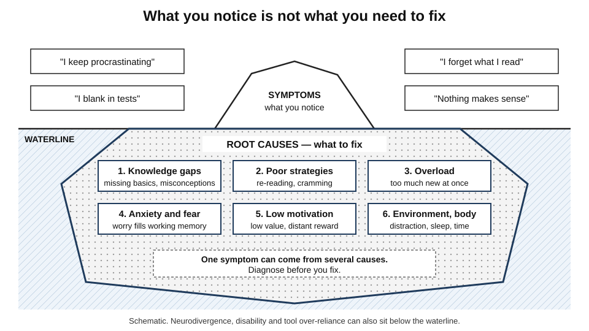
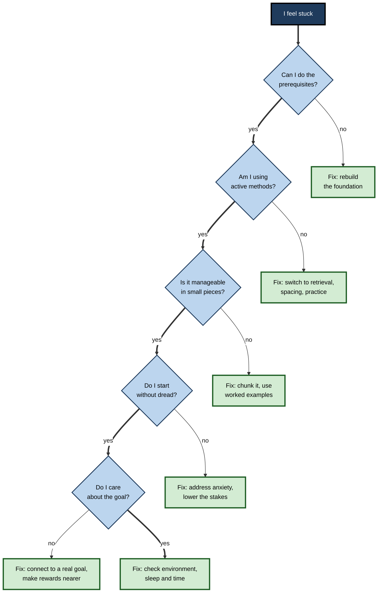
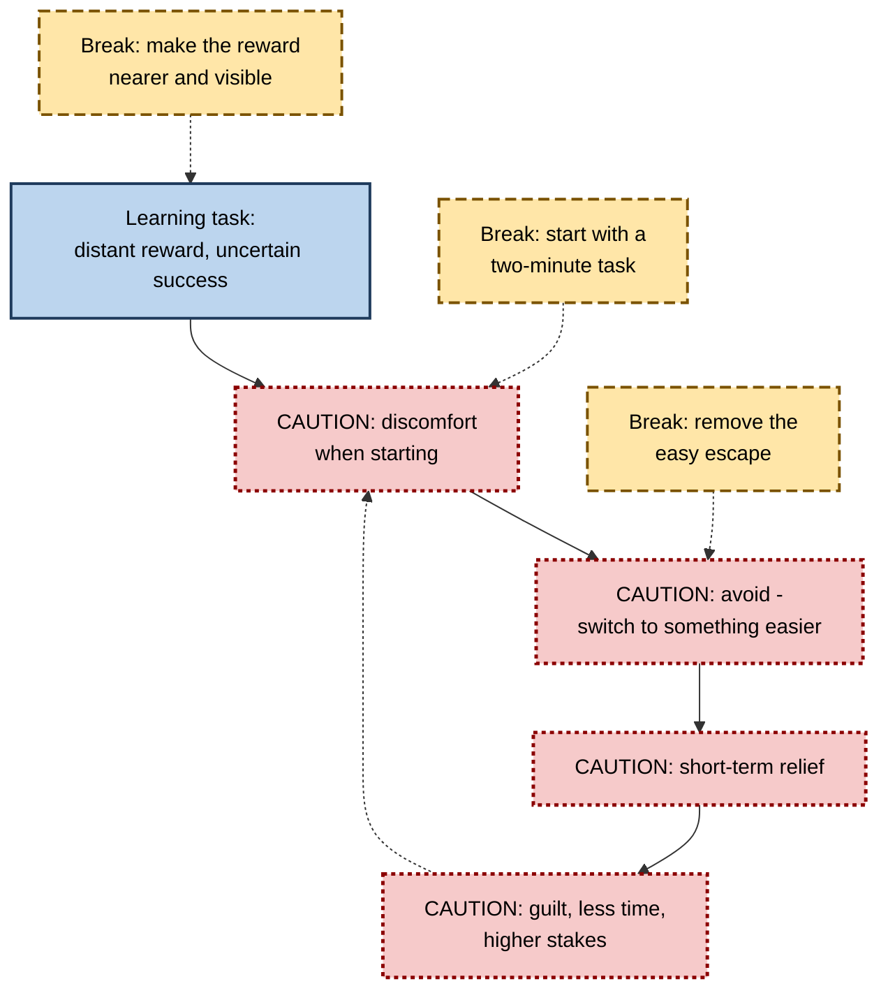

# A.8. Identifying Your Learning Blocks

> **In one sentence:** A learning block is anything that stops effort from turning into lasting learning — a missing foundation, a poor method, anxiety, low motivation, a distracting environment, exhaustion — and the trick is to find the real cause rather than the visible symptom.
>
> **Why it matters:** "I'm stuck" has a dozen possible causes, and each needs a different fix. People and teams who diagnose blocks precisely stop wasting effort on the wrong remedy — more hours, more courses, more willpower — and get unstuck faster.
>
> **Level span:** Novice → Expert · **Reading time:** ~18 min · **Builds on:** the four-stage learning journey; growth mindset; the illusion of competence

---

## The Learning Ladder

| Level | Badge | After this level you can... |
|---|---|---|
| 1 | NOVICE | Recognise that being stuck has causes, and name a few common ones. |
| 2 | FOUNDATIONS | Use a six-category model of learning blocks and tell symptoms from root causes. |
| 3 | PRACTITIONER | Run a structured self-diagnosis and pick a targeted fix. |
| 4 | ADVANCED | Explain the mechanisms behind anxiety, procrastination, misconceptions and overload, and how strong the evidence is. |
| 5 | EXPERT / PRO | Diagnose blocks in teams and programmes, and know when a block needs professional support rather than a study tip. |

---

## Level 1 · Novice — The Big Picture

Imagine your car will not start. You could kick the tyres, push harder on the pedal, or buy a new car. Or you could check: Is there fuel? Is the battery flat? Is the key right? Different causes, different fixes — and the right fix is usually small once you know the cause.

Learning is the same. When you feel stuck — "I just don't get statistics", "I keep putting off this course", "I read it three times and still can't remember" — the feeling is a **symptom**. Underneath is a **cause**, and it is often not the one you assume. Many people decide "I'm not smart enough" when the real problem is a missing basic concept, a poor study method, or simply being exhausted.

You have already experienced learning blocks when:

- a maths topic made no sense because an earlier topic had never really landed;
- you sat down to study and an hour later had only checked messages;
- anxiety during a test made you blank on things you knew;
- you read a chapter, felt good, and remembered almost nothing the next day.

The beginner's takeaway: **when you are stuck, do not just push harder. Ask "what exactly is blocking me?" first.**

---

## Level 2 · Foundations — Core Concepts

### Six categories of learning block

| Category | What is going wrong | Typical symptom |
|---|---|---|
| **1. Knowledge gaps** | Missing prerequisites, or **misconceptions** (confident but wrong prior beliefs). | "Nothing makes sense"; repeated errors of the same kind. |
| **2. Strategy problems** | Ineffective methods (re-reading, highlighting, cramming), poor planning, judging learning by fluency. | "I studied hard but forgot it all." |
| **3. Cognitive overload** | Too much new information at once for limited working memory. | Feeling lost and overwhelmed during explanations. |
| **4. Emotional blocks** | Anxiety, fear of failure, shame, feeling like an impostor. | Avoidance, blanking under pressure, perfectionism. |
| **5. Motivational blocks** | Low perceived value, low expectation of success, distant rewards. | Procrastination, low effort, quitting early. |
| **6. Environmental and physical blocks** | Distraction, interruptions, lack of time, poor sleep, stress, health. | Starting is hard; concentration is short; fatigue. |

Two further factors cut across all six and deserve explicit attention:

- **Neurodivergence and disability** — such as dyslexia, ADHD or sensory impairments — can create real barriers that are about access and fit, not effort. These call for proper assessment and accommodations.
- **Tool over-reliance** — letting a search engine or AI assistant do the thinking — can quietly block learning while making work feel productive.

### Symptoms versus root causes

*Figure A.8-1 — The learning-block iceberg.* Above the waterline are the symptoms people notice and report. Below are the causes that actually need fixing. One symptom, such as procrastination, can come from several different causes. Schematic.

### Key terms

| Term | Plain meaning |
|---|---|
| **Learning block** | Any barrier that prevents effort from producing lasting learning. |
| **Prerequisite** | Knowledge you need before a new topic can make sense. |
| **Misconception** | A confidently held but incorrect understanding. |
| **Illusion of competence** | Feeling that you know something because it is familiar. |
| **Procrastination** | Voluntarily delaying an intended action despite expecting to be worse off. |
| **Learning anxiety** | Worry and tension that interferes with learning or performance. |

---

## Level 3 · Practitioner — Putting It to Work

### The Learning Block Audit — a six-step self-diagnosis

1. **Describe the symptom precisely.** Not "I'm bad at this" but "I can follow the worked examples but can't start a problem on my own."
2. **Test for knowledge gaps.** Try a few problems on the *prerequisite* topic. If you fail those, the block is upstream.
3. **Check your strategy.** List exactly what you did. If it was mostly re-reading, highlighting or watching, the block is likely strategic.
4. **Check the load.** Were you learning several new things at once? Break the task into smaller pieces and see if it becomes manageable.
5. **Check emotion and motivation.** Ask: "How do I feel when I start?" and "Why does this matter to me?" Dread points to emotional blocks; shrugging points to motivational ones.
6. **Check environment and body.** Track a week: where, when, how long, how interrupted, how rested. Patterns are often obvious once recorded.

**Figure A.8-2 — Diagnosing a learning block.**

*How to read it:* answer the questions in order down the thick path; the first "no" points to the most likely block and its fix. If all answers are yes, look at environment and physical factors.

### Worked example — a marketing manager stuck learning SQL

| Step | Finding |
|---|---|
| **Symptom** | "I've started three SQL courses and quit all of them in week two." |
| **Prerequisites** | Can't confidently explain what a table, row and key are. **Knowledge gap.** |
| **Strategy** | Watches videos at 1.5x speed without typing queries. **Strategy problem.** |
| **Load** | Each course introduces joins in week two — too much at once without foundations. **Overload.** |
| **Emotion** | Feels "not technical"; dreads looking stupid. **Emotional block.** |
| **Motivation** | Strong — wants to stop waiting for analysts. |
| **Fix** | One week on data basics with a spreadsheet the manager already uses; type every query; one new concept per session; practise privately on a familiar dataset before sharing. Completes the course and writes her first useful query in week four. |

### Common mistakes at this level

- **Treating every block as a motivation problem** ("just be more disciplined").
- **Fixing the symptom.** Blocking social media helps distraction but not a missing prerequisite.
- **Assuming one cause.** Blocks usually stack, as in the worked example.
- **Self-diagnosing serious issues.** Persistent anxiety, low mood, or suspected ADHD or dyslexia deserve professional assessment.

---

## Level 4 · Advanced — Mechanisms, Models & Evidence

### Misconceptions are sticky

Research in science education has shown for decades that learners arrive with intuitive theories — for example that heavier objects fall faster, or that a correlation implies causation — that resist correction. Simply presenting the correct explanation often leaves the misconception intact alongside the new idea. Effective approaches make the misconception explicit, create a prediction that it gets wrong, and then provide the better explanation (sometimes called **refutation** or **conceptual change** approaches).

### Anxiety competes for working memory

The psychologists Mark Ashcraft, Sian Beilock and others showed that anxiety, particularly mathematics anxiety, consumes working-memory resources with worry, leaving less capacity for the task. This explains why anxious learners "blank" on material they know. Interventions studied include expressive writing about worries before a test and **reappraisal** — reinterpreting physical arousal as readiness rather than threat. Results have been promising in some studies but mixed in replication, so treat them as low-cost things to try, not guaranteed fixes.

### Stereotype threat — a contested example

**Stereotype threat**, the idea that worrying about confirming a negative stereotype about one's group harms performance, was highly influential. Later meta-analyses found signs of publication bias, and several large replication attempts found smaller or no effects. The broader point — that evaluative pressure and belonging concerns can affect performance — remains plausible, but specific effect sizes from early studies should not be relied on.

### Procrastination as a motivation equation

**Temporal motivation theory**, developed by Piers Steel, summarises research on procrastination: motivation for a task rises with **expectancy** (belief you can succeed) and **value** (how much it matters), and falls with **impulsiveness** (sensitivity to distraction) and **delay** (how far away the reward is). Learning tasks are classic procrastination targets because the rewards are distant and uncertain while distractions are immediate. Self-regulated learning research consistently links procrastination with weaker time management and metacognitive strategies.

**Figure A.8-3 — The procrastination loop.**

*How to read it:* dotted-border boxes form the self-reinforcing loop; dashed-border boxes are interventions, each attacking a different link.

### Cognitive overload

Working memory can hold only a few new elements at once. When instruction presents too many unfamiliar elements, novices are overloaded — a key prediction of cognitive load theory. The fix is design: segmenting, worked examples, removing unnecessary information and building prerequisite knowledge first.

### The new block: metacognitive laziness

Studies in 2024–2025 on generative AI in education describe **metacognitive laziness**: learners who rely on AI for writing or problem solving engage less in planning, monitoring and evaluating their own work. In several experiments, AI-assisted groups produced better immediate work but showed no better — and sometimes worse — knowledge gain or transfer. This is a strategy block disguised as productivity.

---

## Level 5 · Expert / Pro — Professional Mastery

### Diagnosing blocks at team and programme level

Learning blocks scale. When many people struggle with the same thing, the cause is usually in the design or environment, not in the individuals.

| Programme symptom | Likely systemic block | Professional response |
|---|---|---|
| High drop-out at the same module | Overload or missing prerequisite | Add a diagnostic and a bridging module; split the module. |
| Good quiz scores, poor on-the-job use | Strategy and transfer block | Replace recall quizzes with realistic tasks and spaced practice. |
| Low participation in optional learning | Motivation and environment | Protect learning time; tie to real goals; manager endorsement. |
| Silence in sessions, no questions | Emotional and psychological safety | Anonymous questions; leaders model not-knowing; normalise errors. |
| Strong work output, stalled skill growth | AI or tool over-reliance | Unaided checkpoints; hint-first AI configurations. |

### Professional scenario

**Role:** Learning partner supporting a data-literacy programme for 300 operations staff.
**Situation:** Completion is 40%, and managers say staff "just aren't data people".
**What the pro does:** Rejects the ability explanation and runs a block audit at scale: a short survey (prerequisite check, confidence, time available, perceived relevance) plus interviews and drop-off analytics. Finds three stacked blocks: no protected time (environment), a statistics module that assumes spreadsheet skills many lack (knowledge gap and overload), and fear of looking incompetent in front of their teams (emotional). Fixes: two protected hours a fortnight agreed with managers, a spreadsheet bridging module, and private practice environments. Completion and later dashboard use both rise.

### Knowing the limits

A professional knows when a block is beyond study advice. Persistent anxiety, depression, burnout, suspected neurodevelopmental conditions or learning disabilities should be referred to appropriate professionals (occupational health, employee assistance programmes, clinicians, disability services), and accommodations should be provided without requiring people to "prove" they tried harder.

### Ethical notes

- Do not label individuals as "low-ability" based on symptoms that may reflect environment or design.
- Keep diagnostic data on emotional states confidential and voluntary.
- Recognise that some blocks — lack of time, caring responsibilities, unstable work — are structural, and require structural responses.

---

## Myths vs. Evidence

| Myth | What the evidence shows |
|---|---|
| "If I can't learn it, I'm not smart enough." | Most blocks are gaps, strategies, overload, emotion, motivation or environment — all changeable. |
| "Procrastination is laziness." | It is largely an emotion- and motivation-regulation problem, linked to task aversion and distant rewards. |
| "Telling someone the right answer fixes a misconception." | Misconceptions often survive correction unless they are explicitly confronted. |
| "Anxiety only matters if it's severe." | Even moderate anxiety can consume working memory during learning and testing. |
| "More hours will fix it." | More hours with the same block and method usually produce the same result. |
| "Using AI to get unstuck is always helpful." | Getting answers can remove the struggle that produces learning; hints and explanations after an attempt help more. |

## Practitioner Toolkit

**Learning Block Audit (one page)**

- [ ] Symptom described precisely.
- [ ] Prerequisite check done.
- [ ] Study methods listed and rated active or passive.
- [ ] Task chunked into smaller parts.
- [ ] Feelings on starting noted (dread, boredom, neutral).
- [ ] Personal value of the goal written in one sentence.
- [ ] One week of environment and sleep tracked.
- [ ] One targeted fix chosen for the most likely block.
- [ ] Review date set.

**Template — block log**

| Date | Symptom | Suspected block (1–6) | Fix tried | Result after one week |
|---|---|---|---|---|
| | | | | |

## Self-Check

1. **[NOVICE]** Why is "I'm stuck" a symptom rather than a diagnosis?
2. **[NOVICE]** Name three common causes of feeling stuck.
3. **[FOUNDATIONS]** List the six categories of learning block.
4. **[FOUNDATIONS]** What is a misconception, and why is it different from a knowledge gap?
5. **[PRACTITIONER]** You keep forgetting what you read for a certification. Walk through the audit.
6. **[ADVANCED]** How does anxiety interfere with learning and performance?
7. **[ADVANCED]** What four factors does temporal motivation theory use to explain procrastination?
8. **[EXPERT / PRO]** Half a cohort drops out at the same module. What do you investigate?
9. **[EXPERT / PRO]** When should a learning block be referred beyond study advice?

### Answer Key

1. It describes the experience, not the cause; different causes need different fixes.
2. Any three: missing prerequisites, poor strategies, overload, anxiety, low motivation, distraction, fatigue.
3. Knowledge gaps, strategy problems, cognitive overload, emotional blocks, motivational blocks, environmental and physical blocks.
4. A misconception is a confident but wrong belief that actively interferes; a gap is simply missing knowledge.
5. Check prerequisites; list methods (likely re-reading — switch to retrieval and spacing); check load; check emotion and motivation; check environment and sleep; pick one fix and review in a week.
6. Worry occupies working memory, leaving less capacity for the task, which causes blanking and errors.
7. Expectancy, value, impulsiveness and delay.
8. Prerequisites and load in that module, its design, time demands, and drop-off analytics; interview learners; consider adding a diagnostic and bridging content.
9. When there are signs of persistent anxiety, depression, burnout, or possible neurodevelopmental conditions or disabilities, or when the block is structural.

## Key Takeaways

- Being stuck is a **symptom**; find the **cause** before choosing a fix.
- Six categories cover most blocks: **knowledge, strategy, overload, emotion, motivation, environment and body**.
- Blocks often **stack** — expect more than one.
- **Misconceptions, anxiety and procrastination** have specific mechanisms and specific remedies.
- When many people are stuck at the same point, **fix the design**, not the people.
- AI over-reliance is a modern **strategy block** that looks like productivity.
- Know when to **refer** to professional support.

## Glossary

| Term | Meaning |
|---|---|
| Cognitive overload | Exceeding working-memory capacity with too much new information at once. |
| Conceptual change | Instruction designed to replace misconceptions with accurate understanding. |
| Expectancy | A person's belief that they can succeed at a task. |
| Learning anxiety | Worry and tension that interferes with learning or performance. |
| Metacognitive laziness | Reduced planning, monitoring and evaluation of one's own learning when relying on tools. |
| Misconception | A confidently held but incorrect understanding. |
| Prerequisite | Prior knowledge required for new learning to make sense. |
| Procrastination | Voluntary delay of an intended action despite expecting to be worse off. |
| Reappraisal | Reinterpreting a stressful feeling in a more helpful way. |
| Stereotype threat | The proposed risk of underperforming due to concern about confirming a group stereotype; its size is contested. |
