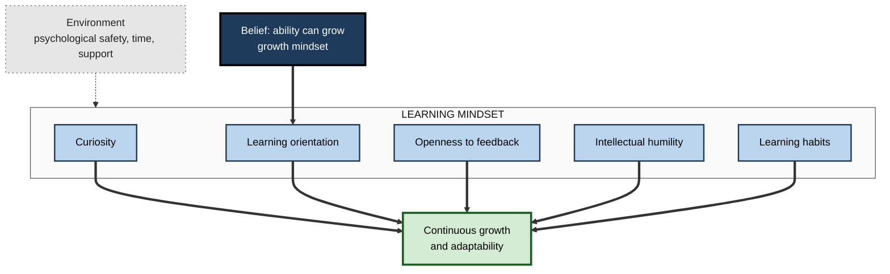
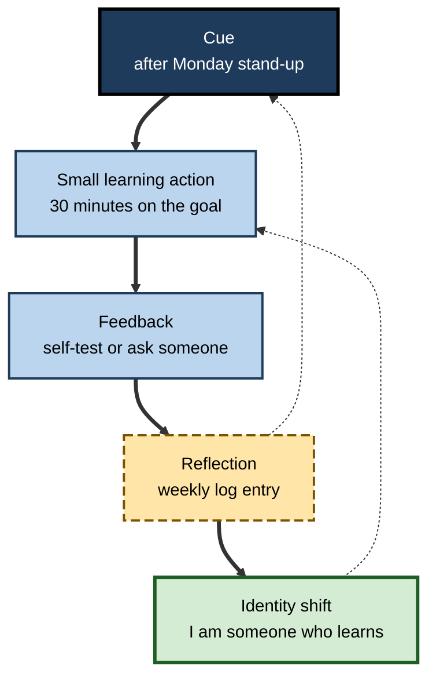

# A.9. Building a Learning Mindset

> **In one sentence:** A learning mindset is a set of attitudes and habits — curiosity, a focus on improving rather than proving, openness to feedback, intellectual humility and regular practice — that makes you keep learning by default, not only when someone sends you on a course.
>
> **Why it matters:** Skills now age quickly, and much of what professionals need to know next year has not been written yet. People and teams who have built learning into their identity and routines adapt faster, recover from setbacks better, and use new tools — including AI — more wisely.
>
> **Level span:** Novice → Expert · **Reading time:** ~17 min · **Builds on:** growth mindset (beliefs about ability); learning blocks

---

## The Learning Ladder

| Level | Badge | After this level you can... |
|---|---|---|
| 1 | NOVICE | Describe what a learning mindset looks like in daily behaviour. |
| 2 | FOUNDATIONS | Name its five components and how they differ from a growth mindset alone. |
| 3 | PRACTITIONER | Build a personal learning routine and turn it into a habit. |
| 4 | ADVANCED | Explain the research on curiosity, goal orientation, intellectual humility, habit formation and psychological safety. |
| 5 | EXPERT / PRO | Grow a learning culture in a team or organisation and measure it through behaviour. |

---

## Level 1 · Novice — The Big Picture

Think of two colleagues who joined the same company on the same day five years ago. Both are intelligent and hard-working. One is now the person everyone asks about new tools, new markets and tricky problems. The other is good at the job as it was five years ago.

The difference is rarely a single brilliant course. It is a steady, almost boring pattern: the first colleague asks more questions, reads a little most weeks, tries new tools early, asks for feedback after presentations, admits "I don't know — let me find out", and reflects on what went wrong. Small habits, repeated for years, compounding like interest.

That pattern is a **learning mindset**: treating learning as a normal, continuing part of how you work and live, rather than something that happens in classrooms.

An analogy: a fitness mindset is not one heroic gym session; it is taking the stairs, walking to meetings and training twice a week for years. A learning mindset is the same for your mind.

You have already shown a learning mindset whenever you looked something up because you were genuinely curious, asked a colleague how they did something impressive, or changed your approach after feedback.

The beginner's takeaway: **a learning mindset is built from small, repeated behaviours — asking, trying, reflecting — not from big resolutions.**

---

## Level 2 · Foundations — Core Concepts

### Growth mindset versus learning mindset

A **growth mindset** is a *belief* — that ability can grow. A **learning mindset** adds the *motives, attitudes and habits* that make growth actually happen. You can believe ability can grow and still never get round to learning anything.

### Five components

| Component | What it is | What it looks like |
|---|---|---|
| **1. Curiosity** | A desire to know and understand. | Asks "why?" and "how does this work?"; explores beyond the brief. |
| **2. Learning orientation** | Aiming to improve rather than to prove yourself. | Chooses tasks that stretch; measures progress against past self. |
| **3. Openness to feedback** | Seeking and using information about your performance. | Asks "what's one thing I could do better?"; acts on the answer. |
| **4. Intellectual humility** | Recognising the limits of your knowledge and that you may be wrong. | Says "I don't know" and "I changed my mind"; updates on evidence. |
| **5. Learning habits** | Regular routines that make learning automatic. | A fixed weekly slot for learning; a reflection routine; a reading list. |

**Figure A.9-1 — The components of a learning mindset.**

*How to read it:* the belief feeds the learning orientation; all five components drive growth; the environment (dotted) makes them easier or harder to sustain.

### Key terms

| Term | Plain meaning |
|---|---|
| **Learning mindset** | A combination of attitudes and habits that makes continuous learning the default. |
| **Curiosity** | The drive to seek new information and understanding. |
| **Goal orientation** | Whether a person mainly aims to develop competence or to demonstrate it. |
| **Intellectual humility** | Awareness that one's beliefs might be wrong, and willingness to revise them. |
| **Habit** | A behaviour triggered automatically by a context cue after repetition. |
| **Psychological safety** | A team belief that it is safe to take interpersonal risks such as asking questions or admitting mistakes. |

---

## Level 3 · Practitioner — Putting It to Work

Attitudes are hard to change directly. Behaviours are easier — and repeated behaviours reshape attitudes and identity over time.

### Build a learning routine in six steps

1. **Pick one learning goal for the next 90 days.** Tie it to work you care about: "Be able to build a forecasting model for my product line."
2. **Attach learning to an existing cue.** "After my Monday stand-up, I spend 30 minutes on the goal." Linking a new behaviour to an established routine helps it become automatic.
3. **Make it small enough to never skip.** Twenty minutes done every week beats three hours done once.
4. **Add a feedback ritual.** After any significant piece of work, ask one person: "What is one thing that would have made this better?"
5. **Keep a learning log.** Each week note: what I learned, what I got wrong, what I will try next.
6. **Review monthly.** Look back at the log: what improved? What will you change?

**Figure A.9-2 — The learning habit loop.**

*How to read it:* the thick path is one weekly cycle; dotted arrows show the loop repeating and the growing identity making the action easier.

### Worked example — a mid-career finance manager

| | Before | After (six months) |
|---|---|---|
| **Learning activity** | Annual compliance training only. | 30 minutes every Monday on automation and data skills. |
| **Feedback** | Waits for annual review. | Asks for one improvement after each board pack. |
| **Response to new tools** | "I'll wait until IT trains us." | Tries the new AI-assisted reporting tool on a copy of last month's data. |
| **Saying "I don't know"** | Avoids it in meetings. | Says "I don't know — I'll find out by Thursday" and follows up. |
| **Outcome** | Skills static. | Has automated two reports and is the team's go-to person for the new tool. |

### Common mistakes at this level

- **Big-bang resolutions** ("I'll study every evening") that collapse within weeks.
- **Collecting courses instead of applying them.** Learning sticks when used on real work.
- **Asking for feedback but arguing with it.** Thank, clarify, then decide.
- **Confusing information intake with learning.** Reading forty newsletters a week is not the same as building a capability.

---

## Level 4 · Advanced — Mechanisms, Models & Evidence

### Curiosity

The economist and psychologist George Loewenstein proposed in 1994 that curiosity arises from an **information gap** — noticing that you know something but not all of it. Gaps that feel small and closable are the most motivating. Experiments using brain imaging, such as work by Matthias Gruber and colleagues published in 2014, found that when people were curious about a trivia answer, they remembered it better — and also remembered unrelated information shown during the curious state. Curiosity seems to put the brain into a state favourable for learning, involving reward-related and hippocampal activity. Practical consequence: posing a question before giving the answer is not a gimmick.

### Goal orientation

Research begun by Carol Dweck and Elaine Elliott and developed in workplace settings by Don VandeWalle and others distinguishes a **learning goal orientation** (aim to develop) from a **performance goal orientation** (aim to prove or avoid looking bad). Meta-analyses in organisational psychology have linked learning goal orientation with greater feedback-seeking, self-efficacy and learning, while performance-avoid orientation (fear of looking incompetent) tends to be linked with poorer outcomes. Effects are modest and depend on context, but consistent.

### Intellectual humility

Research on intellectual humility has grown since the mid-2010s. People higher in intellectual humility tend to evaluate evidence more carefully, are better at recognising the strength of arguments, and are more willing to revise views. It is distinct from low confidence: it is calibrated confidence. Measurement is still developing, and causal evidence that it can be trained is limited.

### Habits

Habits form when a behaviour is repeated in a stable context until the context cue triggers it automatically. A widely cited 2010 study by Phillippa Lally and colleagues found that the time to reach automaticity varied enormously between people and behaviours — from a few weeks to many months, with a median around two months — debunking the popular "21 days" figure. Missing an occasional day did not derail habit formation. Implication: plan for months, not weeks, and focus on consistency of the cue.

### Psychological safety and team learning

Amy Edmondson's research in hospitals and companies showed that teams in which members feel safe to admit errors and ask questions report more errors — because they talk about them — and learn more from them. Google's internal "Project Aristotle" study in the 2010s identified psychological safety as the most important factor among those it examined for team effectiveness. A learning mindset is therefore not only individual; it needs a safe environment to show itself.

### Learning agility — handle with care

**Learning agility**, the ability and willingness to learn from experience and apply it in new situations, is popular in talent management for predicting leadership potential. The idea is intuitive, but researchers have criticised the construct's definition and measurement, and its independence from personality traits and general ability. Use it as a description of desirable behaviour, not as a precise psychometric score.

---

## Level 5 · Expert / Pro — Professional Mastery

### Building learning cultures

Peter Senge popularised the **learning organisation** in 1990: an organisation that continually expands its capacity through individual and team learning, shared mental models and systems thinking. In practice, mature learning cultures share recognisable mechanisms:

| Mechanism | Example practice |
|---|---|
| **Time** | Protected learning time (for example, a few hours a month) that managers actually defend. |
| **Safety** | Blameless reviews; leaders admit mistakes and uncertainty. |
| **Feedback** | Lightweight, frequent feedback norms; peer review of work. |
| **Visibility** | Show-and-tell sessions, internal talks, learning logs shared in team channels. |
| **Recognition** | Promotion and praise for learning, teaching and experimenting — not only for results. |
| **Experimentation** | Small, safe-to-fail pilots of new tools and methods. |

### Measuring a learning mindset through behaviour

Self-report surveys of "openness to learning" are easy to inflate. Better indicators are behavioural:

- frequency of feedback requests and post-mortems;
- proportion of people who taught or shared something internally in a quarter;
- time from new-tool availability to meaningful adoption;
- number of experiments run and lessons documented;
- internal mobility into new roles and skills.

### Professional scenario

**Role:** VP of Product at a mid-sized SaaS company.
**Situation:** Generative-AI features are reshaping the market. The product team is talented but sceptical, and new tools are adopted slowly.
**What the pro does:** Sets a quarterly "learning bet" per squad (a specific capability to build, such as evaluation of AI features), protects four hours a fortnight for it, and starts a monthly demo where squads show what they learned — including failures. The VP personally presents a failed prototype first. Promotion criteria add "grows others' capability". Within two quarters the team ships two AI-assisted features and runs its own evaluation workshops for engineering.

### The AI-era learning mindset

- **Curiosity about the tools and the domain.** Ask "how does this work and where does it fail?", not only "what can it produce?"
- **Intellectual humility in both directions.** Doubt your own unaided judgement *and* the model's output; verify.
- **Learning orientation over output orientation.** Use AI to accelerate learning (explanations, practice questions, critique of your work), not only to skip it.
- **Deliberate unaided practice.** Keep some work AI-free so your own skills keep growing.

---

## Myths vs. Evidence

| Myth | What the evidence shows |
|---|---|
| "It takes 21 days to form a habit." | Time to automaticity varies widely, with a median of around two months in one well-known study. |
| "Curious people are born, not made." | Curiosity is strongly shaped by situations — especially small, noticeable knowledge gaps. |
| "Admitting you don't know makes you look weak." | In psychologically safe teams, admitting uncertainty is linked with more learning and better performance. |
| "A learning culture comes from offering lots of courses." | It comes from time, safety, feedback, recognition and leader behaviour; course catalogues alone do little. |
| "Learning agility is a precise, validated trait score." | The construct is useful but its measurement and distinctness are debated. |
| "If you have a growth mindset, you have a learning mindset." | Belief is one ingredient; curiosity, feedback-seeking, humility and habits are also needed. |

## Practitioner Toolkit

**Personal learning-mindset checklist**

- [ ] One 90-day learning goal written down.
- [ ] A fixed weekly learning slot tied to an existing cue.
- [ ] A feedback question I ask after significant work.
- [ ] A weekly learning-log entry.
- [ ] At least one "I don't know — I'll find out" this week.
- [ ] Some practice done without AI assistance.

**Template — weekly learning log**

| Week | What I learned | What I got wrong | Feedback I received | What I'll try next |
|---|---|---|---|---|
| | | | | |

**Team starter kit:** a monthly 30-minute "what I learned" round; a shared doc of failures and lessons; one protected learning slot per fortnight; leaders go first.

## Self-Check

1. **[NOVICE]** Describe three everyday behaviours that show a learning mindset.
2. **[NOVICE]** Why do small learning habits beat big resolutions?
3. **[FOUNDATIONS]** How is a learning mindset different from a growth mindset?
4. **[FOUNDATIONS]** Name the five components of a learning mindset.
5. **[PRACTITIONER]** Design a 90-day learning routine for learning a new programming language at work.
6. **[ADVANCED]** What is the information-gap theory of curiosity, and how can you use it?
7. **[ADVANCED]** What did research on habit formation find about the "21 days" claim?
8. **[EXPERT / PRO]** Which behavioural indicators would you use to track a team's learning culture?
9. **[EXPERT / PRO]** What does a learning mindset look like when working with AI tools?

### Answer Key

1. Examples: asking questions, seeking feedback, trying new tools early, admitting not knowing, reflecting on mistakes.
2. They are easier to sustain, become automatic with repetition, and compound over time.
3. Growth mindset is a belief about ability; a learning mindset adds curiosity, learning orientation, feedback-seeking, humility and habits.
4. Curiosity, learning orientation, openness to feedback, intellectual humility, learning habits.
5. Example: goal "build a small internal tool in the language"; 30 minutes after a fixed meeting twice a week; weekly self-test; code review from a colleague fortnightly; weekly log; monthly review.
6. Curiosity arises from noticing a small, closable gap in knowledge; pose questions before answers and reveal gaps deliberately.
7. Time to automaticity varied widely, with a median around two months; "21 days" is not supported.
8. Feedback requests, post-mortems held, internal teaching, tool-adoption speed, experiments run, internal mobility.
9. Curiosity about how tools work and fail, verification of outputs, using AI to learn rather than just to produce, and regular unaided practice.

## Key Takeaways

- A learning mindset combines **curiosity, learning orientation, openness to feedback, intellectual humility and habits**.
- It is **built from small, repeated behaviours** that reshape identity over months.
- **Curiosity** improves memory; pose questions before answers.
- **Habits take time** — plan for months and keep the cue consistent.
- **Psychological safety** lets a learning mindset show up in teams.
- Measure learning cultures by **behaviour**, not slogans or survey scores.
- In the AI era, a learning mindset means **using tools to learn, not only to skip learning**.

## Glossary

| Term | Meaning |
|---|---|
| Automaticity | The point at which a behaviour happens with little conscious intention. |
| Curiosity | The drive to seek new information and understanding. |
| Goal orientation | A tendency to pursue either developing or demonstrating competence. |
| Habit | A behaviour automatically triggered by a context cue after repetition. |
| Information-gap theory | The idea that curiosity arises from awareness of a gap in one's knowledge. |
| Intellectual humility | Recognising the limits of one's knowledge and being willing to revise beliefs. |
| Learning agility | The ability and willingness to learn from experience and apply it in new situations. |
| Learning mindset | A combination of attitudes and habits that makes continuous learning the default. |
| Learning organisation | An organisation designed to continually learn and adapt. |
| Psychological safety | A shared belief that a team is safe for interpersonal risk-taking. |
