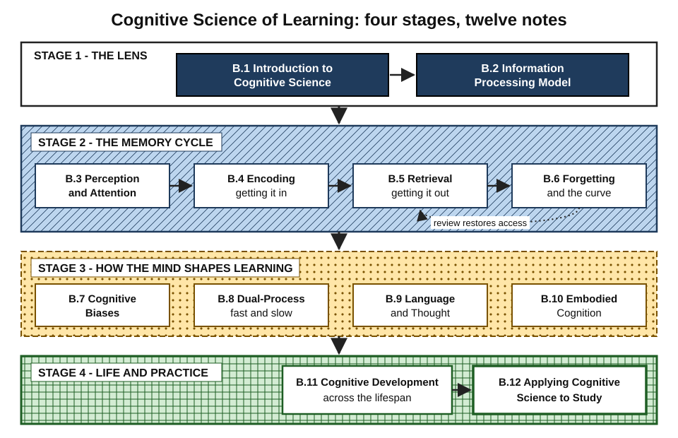
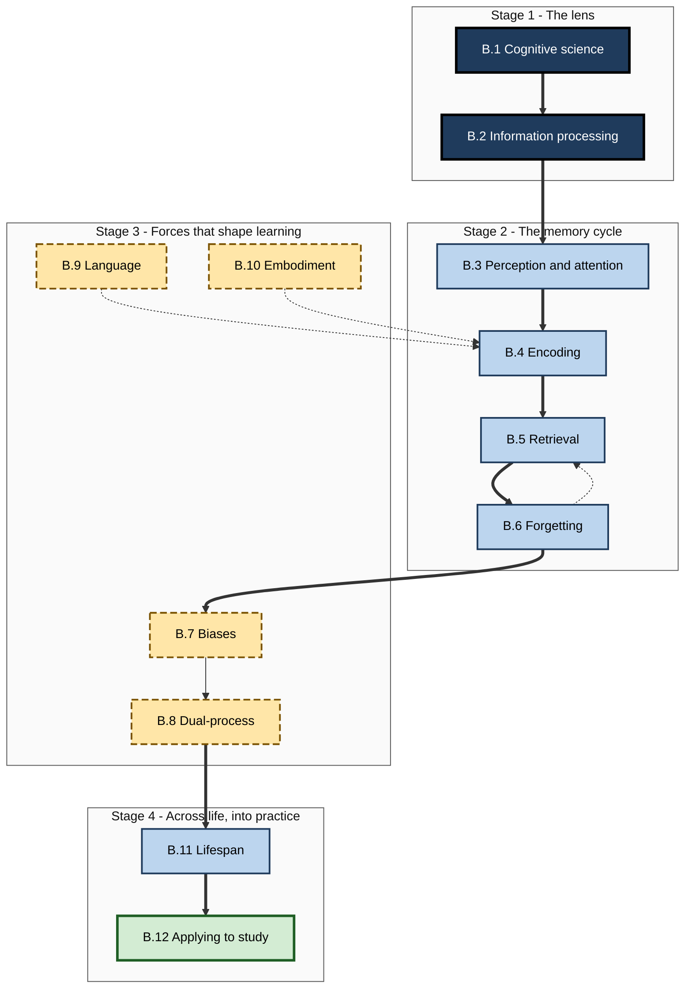
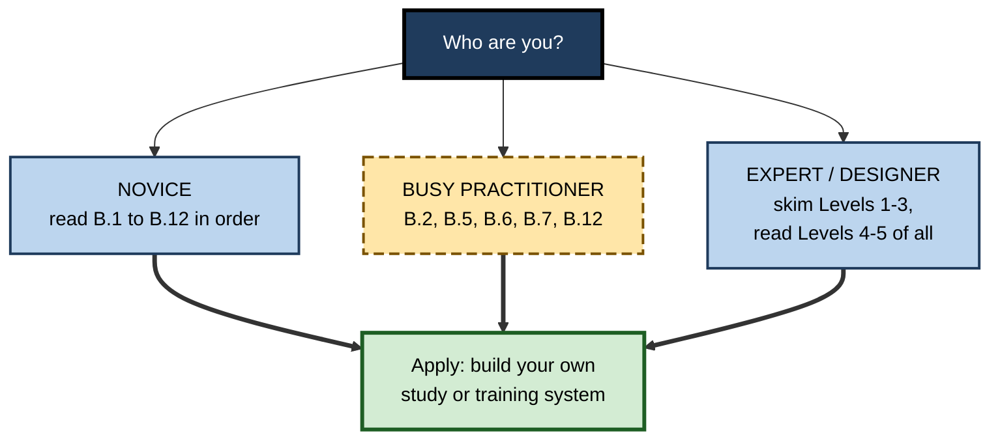

# B. Cognitive Science of Learning

> **What this subtopic is about:** How the mind actually takes in, stores, retrieves and loses knowledge — and how attention, biases, intuition, language, the body and age shape that process — translated into practical ways to study and to design learning for others.
>
> **Who it is for:** Anyone who learns for a living — students, career-switchers, engineers, consultants, managers, L&D professionals and learning-product designers · **Notes in this subtopic:** 12 · **Level span:** Novice → Expert

---

## Overview

Cognitive science is the interdisciplinary study of the mind as an information-processing system, drawing on psychology, neuroscience, linguistics, philosophy, computer science and anthropology. This subtopic uses it as a lens on learning. It starts with the field itself and its central model of the mind, follows information through the **memory cycle** — attention, encoding, retrieval and forgetting — then examines the forces that bend that cycle: cognitive biases, fast and slow thinking, language and the body. It closes with how cognition changes across a working life and how to turn all of it into a study system.

The tone throughout is evidence-first. Some ideas in this area are among the best-replicated findings in psychology: the testing effect, the spacing effect and the forgetting curve (closely replicated more than 130 years after Ebbinghaus first measured it). Others have weakened or failed under scrutiny, such as power posing, ego depletion and the popular reading of the Dunning–Kruger effect. Each note marks which is which.

*Figure B-1 — Overview of the subtopic.* Four stages: the lens (plain band), the memory cycle (hatched band), forces that shape learning (dotted band) and application across life (cross-hatched band). The dotted arrow in stage 2 shows review restoring access to fading memories.

---

## Why It Matters

- **Learning is the career skill that compounds.** Over a 40-to-50-year career with repeated reskilling, the efficiency of how you learn matters more than any single thing you learn.
- **Intuition about learning is systematically wrong.** People prefer re-reading, highlighting and cramming because they feel fluent. Cognitive science shows why these feel good and work poorly, and what to do instead.
- **Organisations waste training budgets on the forgetting curve.** Programmes measured by completion and satisfaction often produce little durable change. The mechanisms in this subtopic explain how to design for retention and transfer.
- **AI has raised the stakes.** Tools that summarise, explain and write can either support learning or replace the mental work that builds it. Recent field experiments show both outcomes, depending on design. Knowing the underlying cognition is how you tell the difference.
- **It protects you from neuro-myths.** Learning styles, "10% of the brain", brain-training games and "brain type" platforms are all still sold. A cognitive-science lens lets you evaluate such claims in minutes.

---

## What You Will Learn

| # | Note | Core question it answers | Primary level |
|---|---|---|---|
| B.1 | Introduction to Cognitive Science | What is cognitive science, and how do I judge a "brain-based" learning claim? | Novice → Foundations |
| B.2 | Information Processing Model | How does information travel from the senses to long-term memory, and where does learning break down? | Foundations |
| B.3 | Perception and Attention in Learning | Why do we miss what is in front of us, and how do we direct attention to what must be learned? | Foundations → Practitioner |
| B.4 | Encoding: How We Store Information | What determines whether an experience becomes a durable memory? | Practitioner |
| B.5 | Retrieval: Accessing Stored Knowledge | Why does pulling knowledge out of memory strengthen it? | Practitioner → Advanced |
| B.6 | Forgetting and the Forgetting Curve | Why and when do we forget, and how can review flatten the curve? | Practitioner → Advanced |
| B.7 | Cognitive Biases Affecting Learning | Which predictable thinking errors mislead learners and teachers? | Practitioner → Advanced |
| B.8 | Dual-Process Theory in Learning | How do fast intuition and slow deliberation interact, and when can intuition be trusted? | Advanced |
| B.9 | Language and Thought in Cognition | How do words shape and sharpen thinking — and where do those effects stop? | Advanced |
| B.10 | Embodied Cognition and Learning | How do the body, movement and tools take part in thinking and learning? | Advanced |
| B.11 | Cognitive Development Across Lifespan | How do cognitive strengths change with age, and how should learning adapt? | Advanced → Expert |
| B.12 | Applying Cognitive Science to Study | How do I combine all of this into a study and training system that works? | Practitioner → Expert |

---

## Concept Map

**Figure B-2 — How the twelve notes relate.**

*How to read it:* thick arrows are the recommended reading order; the dotted arrow from B.6 to B.5 shows that review is retrieval; dotted arrows from B.9 and B.10 show language and the body feeding into encoding.

---

## Recommended Learning Path

1. **Start with B.1 and B.2** (beginners). They give the vocabulary and the mental map — senses, attention, working memory, long-term memory — used by every later note.
2. **Work through the memory cycle, B.3 to B.6**, in order. This is the practical core: what gets in, how it is stored, how it is reached, and why it fades.
3. **Read B.7 next**, because biases explain why people do not use what B.3–B.6 recommend.
4. **Read B.8, B.9 and B.10 in any order.** They are deeper explorations of how intuition, language and the body shape cognition.
5. **Read B.11** to adapt everything to your own life stage and to learners of other ages.
6. **Finish with B.12**, which integrates the subtopic into a weekly study system and an organisational design approach.

**Figure B-3 — Three paths through the subtopic.**

*How to read it:* pick the box that describes you; every path ends in applying the ideas. Professionals can skim Levels 1–3 of each note and focus on the mechanisms, evidence and design sections in Levels 4–5.

---

## The Big Ideas in Brief

**B.1 Introduction to Cognitive Science.** Cognitive science treats the mind as an active information processor and combines six disciplines to study it. Marr's three levels — goal, procedure, physical implementation — give a quick test for any learning claim: a brain image is never enough; you need delayed behavioral evidence against a fair comparison. After the replication crisis, core memory effects held up while several flashy effects did not.

**B.2 Information Processing Model.** Information flows from brief sensory memory, through the narrow gate of attention, into a working memory that holds only about four new chunks, and, if processed meaningfully, into a vast long-term memory. Most information is lost along the way. The model is a simplification — real cognition is parallel, predictive and top-down — but it is an excellent diagnostic: was the breakdown in attention, load, encoding or retrieval?

**B.3 Perception and Attention in Learning.** Perception is constructed from incoming signals and expectations; attention selects a small part for deeper processing. People miss clearly visible things when their goals point elsewhere, and multitasking and off-task device use reduce learning. Good design signals what matters and removes competing demands; perceptual-learning drills build expert pattern recognition.

**B.4 Encoding: How We Store Information.** You remember what you think about, not what you look at. Meaningful processing, elaboration, generation, self-reference and relevant visuals produce durable traces; re-reading and highlighting do little. Encoding works best when it resembles how knowledge will be used. If an AI does the summarising and explaining, the AI gets the encoding benefit.

**B.5 Retrieval: Accessing Stored Knowledge.** Retrieval both accesses and strengthens memory — the testing effect is among the most robust findings in learning science. Every memory has storage strength (how well learned) and retrieval strength (how accessible now); effortful but successful retrieval after some forgetting yields the biggest gains. Feedback, spacing and full-topic coverage maximise benefits.

**B.6 Forgetting and the Forgetting Curve.** Forgetting is steep at first and then slows, as Ebbinghaus showed in 1885 and a 2015 replication confirmed. Causes include encoding failure, disuse, interference and retrieval failure. Spaced retrieval flattens the curve; popular percentages like "70% forgotten in 24 hours" are misattributed. Forgetting is also adaptive: it clears outdated information and supports generalisation.

**B.7 Cognitive Biases Affecting Learning.** Fluency illusions, the illusion of explanatory depth, overconfidence, foresight and stability biases, the curse of knowledge, hindsight bias and automation bias all distort learning. Awareness alone does little; procedures — closed-book testing, delayed confidence ratings, step-by-step explanation, verification of AI output — work. The popular Dunning–Kruger story is contested, with a 2026 reanalysis arguing it is largely a statistical artifact.

**B.8 Dual-Process Theory in Learning.** Fast, automatic (Type 1) and slow, deliberate (Type 2) processing interact; learning moves skills from the second to the first. Intuition is trustworthy only in regular environments with extensive practice and fast feedback. Modern theory argues good reasoners have good intuitions, not just strong override; ego depletion and several priming effects did not replicate.

**B.9 Language and Thought in Cognition.** Language does not imprison thought, but it shapes attention, categorisation and reasoning in bounded, measurable ways — in colour discrimination, spatial reference and exact number. Words compress ideas, inner speech guides reasoning, and plain-language explanation tests understanding. The bilingual executive-function advantage is contested. Teams think better with a shared, precise vocabulary.

**B.10 Embodied Cognition and Learning.** Thinking is spread across brain, body and tools. Gesture, enactment and hands-on experience help when movements match the concept; recent meta-analyses show moderate, variable benefits. Power posing and several embodied priming effects failed to replicate. The extended-mind view reframes AI as part of a human-plus-tool system whose reliability must be designed.

**B.11 Cognitive Development Across Lifespan.** There is no single peak age: processing speed peaks in the late teens, working memory and fluid reasoning in the twenties to early thirties, and knowledge and vocabulary much later. Adults learn well at every age when pacing, structure and relevance fit. Brain-training games show weak far transfer; demanding real-world learning is a better bet.

**B.12 Applying Cognitive Science to Study.** Retrieval practice and spacing are the highest-utility strategies; elaboration, self-explanation, interleaving, worked examples and dual coding add value when matched to material and learner. Build the methods into schedules and tools, expect them to feel harder, and measure delayed, unaided performance. AI helps when it coaches and schedules, and harms when it does the learner's thinking.

---

## Novice-to-Pro Progression

| Level | What competence looks like here |
|---|---|
| NOVICE | Knows that feelings of familiarity are unreliable; uses self-testing and spreads study over days; can describe the memory cycle in everyday terms. |
| FOUNDATIONS | Uses the core vocabulary — working memory, encoding, retrieval, forgetting curve, biases, Type 1 and Type 2 — correctly; can explain why re-reading underperforms testing. |
| PRACTITIONER | Runs a personal study system with retrieval, spacing, elaboration and calibration; diagnoses where a learning problem sits in the pipeline; designs a session that respects attention and load. |
| ADVANCED | Explains mechanisms and boundary conditions; distinguishes replicated from contested findings; adapts methods to prior knowledge, material type and life stage. |
| EXPERT / PRO | Designs and evaluates learning programmes, products and AI tutors around cognitive mechanisms; measures delayed performance and transfer; challenges neuro-myths and vendor claims with evidence. |

---

## Where This Shows Up at Work

- **Onboarding.** Respecting working-memory limits, using worked examples and spacing retrieval of key systems shortens time to independent work.
- **Corporate training and compliance.** Spaced scenario questions with feedback counter the forgetting curve far better than annual marathon courses.
- **Software engineering.** Code review that asks "why?", incident drills, shared domain vocabulary and protected focus time all apply this subtopic directly.
- **Consulting and client work.** Rapidly learning a new industry depends on deep encoding, explanation and retrieval rather than highlighting reports.
- **Sales and customer success.** Interleaved objection practice and spaced product quizzes build fluent, flexible recall in live conversations.
- **Safety-critical operations.** Perceptual-learning drills, checklists against automation and hindsight biases, and simulation practice build trustworthy intuition.
- **Learning-product and AI-tool design.** Hint-first tutors, spaced-review schedulers and verification prompts decide whether tools build or replace capability.
- **Workforce reskilling.** Age-inclusive design uses older workers' knowledge as an asset and avoids time pressure that disadvantages them without improving learning.

---

## Capstone Exercises

1. **Personal study redesign (Novice–Practitioner).** Pick a skill you must learn this quarter. Write three "I will be able to... without help" targets, build a four-week plan using retrieval, spacing and interleaving, and log predicted versus actual scores on weekly unaided tests. After four weeks, write one paragraph on what changed.
2. **Pipeline diagnosis (Practitioner).** Choose a training session or document at your workplace. Diagnose it against the four checkpoints — attention, working-memory load, encoding, retrieval — and redesign the weakest stage. Pilot it with two colleagues and compare their recall a week later with the original.
3. **Myth audit (Advanced).** Collect five claims about learning from your organisation's materials, vendors or social media. For each, apply the three-level claim check, classify it as supported, contested or unsupported, and write a two-sentence evidence memo.
4. **Bias-resistant AI workflow (Advanced–Expert).** Design a team workflow for using an AI assistant to learn a new codebase, regulation or product. Include attempt-first rules, hint-only modes, verification steps for outputs, seeded errors in practice and a delayed unaided check. Explain which cognitive mechanisms each element targets.
5. **Programme design (Expert / Pro).** Design a three-month learning programme for a mixed-age team adopting a new system. Specify spacing, retrieval formats, worked-example fading, embodied or simulated practice where it fits, age-inclusive pacing, and the metrics you will report at 30, 60 and 90 days.

---

## Key Takeaways

- The mind is an **active, limited, reconstructive information processor**; learning is managing the flow from attention to durable, retrievable memory.
- **Retrieval and spacing** are the most powerful, best-replicated tools; feedback and coverage maximise them.
- **Forgetting is normal and predictable**; design review into the system rather than hoping knowledge lasts.
- **Biases, especially fluency illusions, mislead learners and teachers**; replace feelings with tests.
- **Intuition can be trained** to be reliable — in the right environments, with practice and feedback.
- **Language and the body are thinking tools**; use vocabulary, explanation and well-aligned action deliberately.
- **People learn at every age**; adapt pace and structure, not expectations.
- In the AI era, **let tools support the thinking, not replace it**, and measure learning by delayed, unaided performance and transfer.
