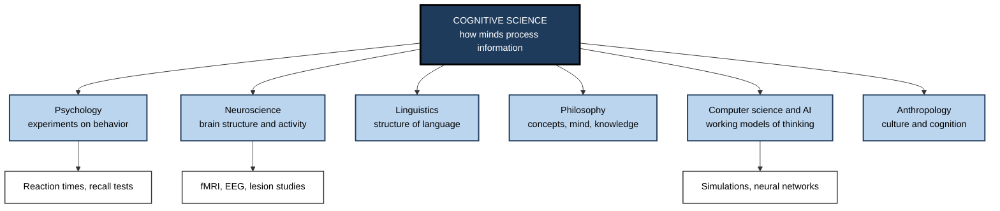
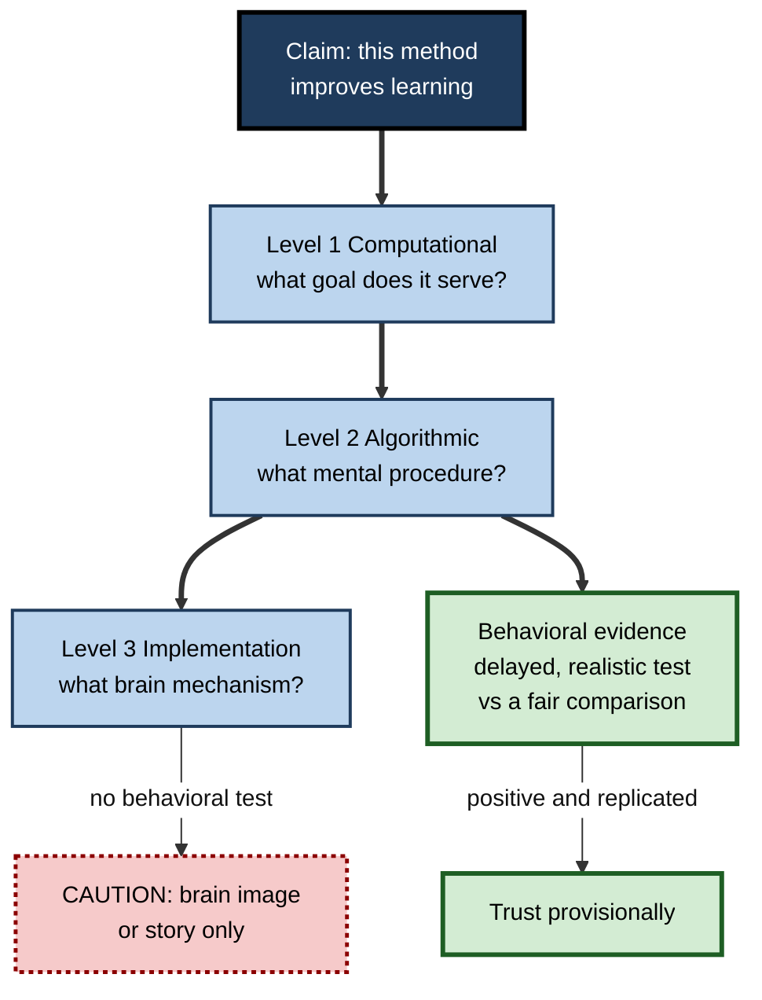

# B.1. Introduction to Cognitive Science

> **In one sentence:** Cognitive science is the study of how minds work — how people (and animals and machines) take in information, store it, reason with it and act on it — built by combining psychology, neuroscience, linguistics, philosophy, computer science and anthropology.
>
> **Why it matters:** Almost every claim you will hear about "how people learn" comes from cognitive science or pretends to. Knowing how the field works lets you tell solid findings from brain-flavoured marketing, and lets you design study, training and tools on mechanisms rather than slogans.
>
> **Level span:** Novice → Expert · **Reading time:** ~17 min · **Builds on:** the idea that learning is a lasting change caused by experience

---

## The Learning Ladder

| Level | Badge | After this level you can... |
|---|---|---|
| 1 | NOVICE | Say in plain words what cognitive science studies and why it matters for learning. |
| 2 | FOUNDATIONS | Name the contributing disciplines, the core idea of "mind as information processing", and the main research methods. |
| 3 | PRACTITIONER | Read a learning claim and locate it on Marr's three levels, then judge what kind of evidence would support it. |
| 4 | ADVANCED | Explain the field's history, its major frameworks (symbolic, connectionist, embodied, predictive) and the replication reforms. |
| 5 | EXPERT / PRO | Use cognitive-science reasoning to evaluate vendors, design learning products and interpret AI-era claims about "thinking machines". |

---

## Level 1 · Novice — The Big Picture

Every time you read a sentence, recognise a face, remember a password or decide which email to answer first, your mind is doing an enormous amount of invisible work. **Cognitive science** is the effort to explain that work: what the mind does, how it does it, and what the brain is physically doing while it happens. **Cognition** simply means all the mental activities involved in knowing — perceiving, paying attention, remembering, using language, reasoning, deciding and learning.

A useful analogy is a kitchen. You can describe a restaurant meal at three levels: *what* the dish is supposed to be (the menu), *the recipe* that produces it (steps and ingredients), and *the equipment* used (ovens, knives, pans). Cognitive scientists describe the mind in the same layered way: what problem a mental ability solves, the step-by-step procedure the mind uses, and the brain hardware running it.

You have already met cognitive science in daily life when:

- you forgot why you walked into a room (attention and memory interacting);
- you could not recall a colleague's name but knew it started with "M" (the difference between storing and retrieving);
- you misread a word because you expected a different one (perception driven by expectation).

The key idea for a beginner: **the mind is not a camera or a hard drive. It actively selects, interprets, rebuilds and predicts — and that is why some ways of studying work far better than others.**

---

## Level 2 · Foundations — Core Concepts

### A field built from six disciplines

Cognitive science is **interdisciplinary**: it has no single home department. Its founders deliberately combined methods from several fields because each sees a different slice of the mind.

**Figure B.1-1 — The contributing disciplines of cognitive science.**

*How to read it:* the dark root is the field; light boxes are contributing disciplines; white boxes are typical methods.

### The central idea: mind as information processing

The founding idea of the field is that thinking can be understood as **information processing**: the mind receives input from the senses, transforms it into internal **representations** (mental stand-ins for things, such as an image of your front door or the concept "invoice"), manipulates those representations, and produces output such as speech or action. This idea is the backbone of the next note in this subtopic and of most modern learning science.

### Key terms

| Term | Plain meaning |
|---|---|
| **Cognition** | All mental activity involved in knowing: perceiving, attending, remembering, reasoning, using language, deciding. |
| **Representation** | An internal stand-in for something — an image, a word, a concept, a rule. |
| **Computation** | A rule-governed transformation of representations, like a recipe applied to ingredients. |
| **Behaviorism** | The earlier school that studied only observable behavior and refused to talk about inner mental states. |
| **Cognitive revolution** | The 1950s shift back to studying the mind's inner workings scientifically. |
| **Marr's levels** | Three ways to explain a mental ability: what it computes, how (the procedure), and what physically implements it. |
| **Construct** | A theoretical concept that cannot be seen directly, such as "working memory", inferred from behavior. |

### How cognitive scientists find things out

| Method | What it shows | Classic limitation |
|---|---|---|
| Behavioral experiments | Accuracy, reaction time, recall under controlled conditions | Lab tasks can be artificial |
| Neuroimaging (fMRI, EEG, MEG) | Where and when brain activity changes | Correlational; activity is not the same as cause |
| Lesion and patient studies | What is lost when a brain area is damaged | Rare cases, messy damage |
| Computational modelling | Whether a proposed mechanism can actually produce the behavior | A model that fits is not proof it is how humans do it |
| Field and classroom studies | Whether findings hold in real learning | Less control, more noise |
| Cross-cultural and linguistic studies | Which features are universal versus learned | Hard to separate culture from other variables |

---

## Level 3 · Practitioner — Putting It to Work

The most practical tool cognitive science offers non-scientists is a way of **interrogating claims**. Learning products, courses and articles routinely say things like "this method rewires your brain" or "visual learners absorb 60% more". A practitioner can test such claims in a few minutes.

### The Three-Level Claim Check

David Marr, a vision scientist, argued in 1982 that any mental ability can be explained at three levels. Use them as a checklist:

1. **Computational level — what is the goal?** What problem is the learner's mind solving? ("Remember 200 product codes for the sales floor.")
2. **Algorithmic level — what procedure?** What step-by-step mental process does the method claim to use? ("Retrieve each code from memory at increasing intervals.")
3. **Implementation level — what hardware?** What is happening in the brain? ("Repeated retrieval strengthens and stabilises memory traces.")
4. **Ask what evidence exists at each level.** Behavioral experiments support the algorithmic level; brain scans support the implementation level. A brain image alone never proves a study method works.
5. **Ask for the behavioral outcome.** Ultimately, did people who used the method perform better on a delayed, realistic test than people who used a sensible alternative?

**Figure B.1-2 — Marr's three levels applied to a learning claim.**

*How to read it:* a claim must pass down the thick path and reach behavioral evidence; a claim that only has a brain story ends in the dotted caution box.

### Worked example — an onboarding vendor pitch

| | Before (taken at face value) | After (three-level check) |
|---|---|---|
| **Claim** | "Our micro-videos activate the hippocampus, so staff learn 3x faster." | Goal: retain compliance rules. Procedure: watch short videos. Mechanism: hippocampal activity. |
| **Question asked** | None. | "Where is the delayed behavioral test versus a reasonable alternative, such as short videos plus quizzes?" |
| **Finding** | Purchase approved. | The vendor has only engagement data and one brain-scan image; no retention test exists. |
| **Decision** | — | Pilot with a 4-week delayed scenario test; add retrieval quizzes, which have strong behavioral evidence. |

### Common mistakes at this level

- **Neuro-seduction.** Explanations that mention the brain feel more convincing even when the brain detail adds nothing; studies have shown non-experts rate bad explanations higher when neuroscience jargon is added.
- **Treating constructs as organs.** "Working memory" is a theoretical construct inferred from behavior, not a single brain lump.
- **Confusing lab and life.** A finding from word lists may not transfer unchanged to learning software architecture; look for applied replications.
- **Single-study certainty.** One striking study is a hypothesis, not a fact.

---

## Level 4 · Advanced — Mechanisms, Models & Evidence

### A short history

- **Before the 1950s:** behaviorism dominated academic psychology in the US; talk of inner mental states was considered unscientific.
- **1956:** a symposium on information theory at MIT featured work by George Miller (limits on immediate memory), Noam Chomsky (formal grammar) and Allen Newell and Herbert Simon (a program that proved logic theorems). Many historians treat this as the birth of cognitive science.
- **1959:** Chomsky's critical review of B. F. Skinner's account of language argued that reinforcement could not explain how children produce endlessly novel sentences.
- **1960s–1970s:** information-processing models of memory and attention; the term "cognitive science" and its own society and journal appear in the late 1970s.
- **1980s:** **connectionism** (neural-network models that learn by adjusting connection strengths) challenges purely rule-based models.
- **1990s–2000s:** cognitive neuroscience grows with brain imaging; **embodied** and **situated** views argue cognition depends on the body and environment.
- **2010s:** the **replication crisis** forces methodological reform; **predictive processing** frameworks gain ground.
- **2020s:** large language models reopen old debates about whether statistical learning from text can produce understanding, and AI tools change how people offload thinking.

### Four frameworks you will meet

| Framework | Core claim | Strength | Limitation |
|---|---|---|---|
| **Symbolic (classical)** | Thinking manipulates symbols by rules, like a program. | Explains reasoning, language structure, planning. | Brittle; struggles with fuzzy, graded, perceptual learning. |
| **Connectionist** | Knowledge is distributed across weighted connections that change with experience. | Explains pattern learning, generalisation, graceful degradation. | Hard to interpret; early models needed huge training. |
| **Embodied / 4E** | Cognition is embodied, embedded, enacted and extended into tools and environment. | Explains gesture, tool use, situated expertise. | Some flagship effects failed to replicate; claims vary in strength. |
| **Predictive processing** | The brain constantly predicts input and learns from prediction errors. | Unifies perception, attention and learning. | Very flexible; critics say it can explain almost anything, which makes it hard to falsify. |

Modern researchers rarely treat these as rival teams. They are complementary lenses suited to different questions.

### Why learning science leans on cognitive science

The most robust practical findings about learning — the benefits of **retrieval practice**, **spacing**, **interleaving**, **worked examples** and **dual coding**, and the limits of working memory — came from cognitive psychology experiments and were later tested in classrooms and workplaces. Large reviews in the 2010s and 2020s rated these techniques as having high utility across ages and subjects, while rating popular habits such as re-reading and highlighting as low utility.

### The replication reforms

From roughly 2011 onward, large coordinated replication projects showed that a substantial share of published psychology findings did not reproduce with the same strength. Effects such as ego depletion and power posing weakened or failed in large preregistered replications. The field responded with **preregistration** (stating hypotheses and analyses before collecting data), **registered reports**, larger samples, open data and multi-lab studies. For learning science the news is relatively good: the core memory effects — testing, spacing, forgetting curves — have been replicated many times, including a close replication of Ebbinghaus's 1880s forgetting curve published in 2015.

### Open debates in 2026

- **Do large language models "understand"?** They show that a great deal of linguistic and world knowledge can be learned from statistical exposure to text, which challenges strong nativist claims, but whether they reason like humans remains contested.
- **Cognitive offloading and AI.** Studies in 2025, including field experiments and small EEG studies, suggest that relying on AI to produce work can raise immediate output while reducing the mental effort and memory that build skill. Many of these studies are early, small or not yet peer-reviewed, so treat them as warning lights rather than settled law.
- **Neuroscience-to-classroom gap.** Most brain findings still cannot dictate teaching methods directly; behavioral evidence remains the decisive test.

---

## Level 5 · Expert / Pro — Professional Mastery

### Cognitive science as a professional filter

Experienced learning designers, product managers for education technology, and engineering leaders use cognitive science less as a list of facts and more as a **filter**. Every proposed practice is asked three questions: *What mechanism would make this work? Has that mechanism been tested behaviorally? Does the test resemble our context?*

| Professional role | How cognitive science changes the work |
|---|---|
| L&D lead | Replaces satisfaction scores with delayed, unaided performance checks; builds spacing and retrieval into programmes. |
| Instructional designer | Respects working-memory limits, uses worked examples for novices, fades guidance as expertise grows. |
| EdTech product manager | Designs features (quizzes, hints, spaced reminders) around replicated mechanisms; avoids neuro-marketing claims. |
| Engineering manager | Structures onboarding to build durable mental models rather than copy-paste competence. |
| AI product team | Designs assistants that prompt, question and give hints before answers when the goal is learning. |

### Professional scenario

**Role:** Head of learning at a 4,000-person consulting firm.
**Situation:** A vendor offers a "neuro-optimised" learning platform that "matches content to each consultant's brain type", supported by brain-scan imagery and testimonials.
**What the pro does:** Runs the three-level check. The computational goal (retain client-industry knowledge) is clear; the algorithm ("brain types") maps onto the debunked learning-styles idea; the implementation story rests on images without behavioral tests. The pro declines the brain-typing feature, keeps the platform's spaced-quiz engine (which aligns with well-replicated retrieval and spacing effects), and requires a 60-day delayed knowledge check as the success metric in the contract.

### Expert-level judgement

- **Prefer mechanisms with converging evidence.** The strongest claims are supported in the lab, in classrooms, in workplaces and by a plausible brain mechanism.
- **Respect effect size and context.** A well-replicated effect may be small in a specific setting; pilot before scaling.
- **Watch the level-jump.** Moving from "brain area X lights up" to "therefore teach like Y" skips the algorithmic level where the real evidence lives.
- **Model the learner, not the average.** Prior knowledge changes which methods help; what aids a novice can hinder an expert (the expertise reversal effect).
- **Ethical limits.** Neurodata and learning analytics are sensitive personal data. Using them to rank or screen employees exceeds what the science can support.

---

## Myths vs. Evidence

| Myth | What the evidence shows |
|---|---|
| "We only use 10% of our brains." | Imaging shows activity across virtually the whole brain over a day; there is no silent 90%. |
| "People are left-brained or right-brained learners." | The hemispheres specialise for some functions but cooperate constantly; personality-style "brain dominance" is not supported. |
| "Matching teaching to learning styles improves learning." | Controlled tests have repeatedly failed to find the predicted benefit. |
| "A brain scan proves a teaching method works." | Brain activity shows correlates; only behavioral outcome tests show a method improves learning. |
| "The mind works like a video recorder." | Memory is reconstructive; recall is rebuilt each time and can be distorted. |
| "Cognitive science is just psychology." | It integrates psychology with neuroscience, linguistics, philosophy, computer science and anthropology. |

## Practitioner Toolkit

**Claim-evaluation checklist**

- [ ] What is the learning goal (computational level)?
- [ ] What mental procedure does the method rely on (algorithmic level)?
- [ ] Is the brain story essential, or decoration?
- [ ] Is there a behavioral test with a fair comparison group?
- [ ] Was the outcome measured after a delay, without help?
- [ ] Has the finding been replicated by independent teams?
- [ ] Does the study population resemble my learners?
- [ ] Is there a known boundary condition (for example, prior knowledge) that could reverse the effect?

**Template — one-paragraph evidence memo**

> *Claim:* ... *Mechanism proposed:* ... *Best behavioral evidence:* ... *Replicated?* yes / partly / no. *Fits our context?* ... *Decision:* adopt / pilot / reject.

## Self-Check

1. **[NOVICE]** What does cognitive science study, in one sentence?
2. **[NOVICE]** Name three disciplines that contribute to cognitive science.
3. **[FOUNDATIONS]** What is a mental representation? Give a workplace example.
4. **[FOUNDATIONS]** Why did the cognitive revolution reject strict behaviorism?
5. **[PRACTITIONER]** What are Marr's three levels, and which kind of evidence supports each?
6. **[PRACTITIONER]** Why is a brain scan alone insufficient to justify a training method?
7. **[ADVANCED]** Contrast symbolic and connectionist accounts of cognition.
8. **[ADVANCED]** What reforms followed the replication crisis, and how did core learning effects fare?
9. **[EXPERT / PRO]** How would you evaluate a "neuro-optimised" learning platform before buying it?

### Answer Key

1. How minds take in, represent, transform, store and use information to think and act.
2. Any three of psychology, neuroscience, linguistics, philosophy, computer science / AI, anthropology.
3. An internal stand-in for something; for example, your mental model of how a deployment pipeline flows from commit to production.
4. Behaviorism could not explain phenomena such as language creativity, planning and memory organisation without referring to inner mental structures.
5. Computational (what goal), algorithmic (what procedure), implementation (what hardware). Behavioral experiments mostly support the algorithmic level; neuroscience supports implementation; task analysis clarifies the computational level.
6. It shows a correlate of activity, not that learners perform better later; only a behavioral outcome test against a fair comparison does that.
7. Symbolic models manipulate discrete symbols by explicit rules; connectionist models store knowledge as distributed connection weights learned from experience.
8. Preregistration, registered reports, larger and multi-lab samples, open data. Core effects like testing, spacing and the forgetting curve have replicated well; some social-priming and embodiment effects have not.
9. Run the three-level check, demand delayed behavioral evidence against a fair alternative, keep only features backed by replicated mechanisms, and write a delayed-performance metric into the pilot.

## Key Takeaways

- Cognitive science explains the mind as an **active information processor**, combining six disciplines.
- **Marr's three levels** — goal, procedure, hardware — are a practical tool for checking any learning claim.
- **Behavioral evidence after a delay** is the decisive test; brain images are supporting detail.
- The field uses complementary frameworks: **symbolic, connectionist, embodied and predictive**.
- After the **replication crisis**, core memory effects held up; some flashy effects did not.
- In the AI era, cognitive science helps decide **what must live in the learner's head** and how tools should support rather than replace thinking.

## Glossary

| Term | Meaning |
|---|---|
| 4E cognition | The view that cognition is embodied, embedded, enacted and extended. |
| Behaviorism | A school that studied only observable behavior and its reinforcement. |
| Cognition | Mental processes involved in acquiring and using knowledge. |
| Cognitive revolution | The mid-twentieth-century return to the scientific study of the mind. |
| Connectionism | Modelling cognition with networks of simple units and weighted connections. |
| Construct | A theoretical concept inferred from observations rather than seen directly. |
| Marr's levels | Computational, algorithmic and implementation levels of explanation. |
| Neuro-seduction | The tendency to find explanations more convincing when brain terms are added. |
| Predictive processing | The theory that the brain learns by minimising errors between predictions and input. |
| Preregistration | Publicly recording hypotheses and analysis plans before data collection. |
| Representation | An internal mental stand-in for an object, idea or rule. |
| Replication | Repeating a study to check whether its findings hold. |
