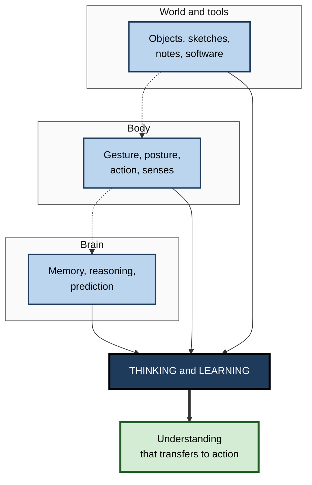
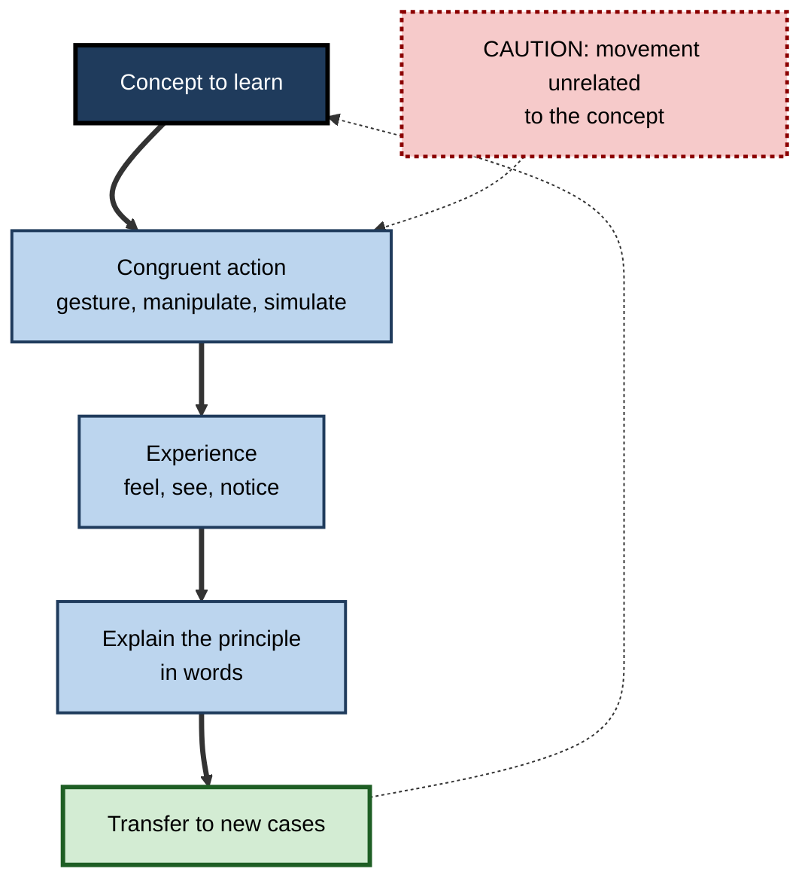

# B.10. Embodied Cognition and Learning

> **In one sentence:** Embodied cognition is the idea that thinking is not done by the brain alone but is shaped by the body, its movements and senses, and the tools and environment around us — so how we move, gesture and handle things can change how well we learn.
>
> **Why it matters:** It explains why hands-on practice, gestures, simulations and good physical and digital workspaces help learning — and it equips you to separate solid embodied-learning findings from popular claims, such as "power poses", that did not replicate.
>
> **Level span:** Novice → Expert · **Reading time:** ~18 min · **Builds on:** the information processing model; encoding

---

## The Learning Ladder

| Level | Badge | After this level you can... |
|---|---|---|
| 1 | NOVICE | Explain with everyday examples how the body and environment take part in thinking. |
| 2 | FOUNDATIONS | Describe the 4E framework and key embodied effects such as gesture and enactment. |
| 3 | PRACTITIONER | Add well-aligned physical, gestural and hands-on elements to learning. |
| 4 | ADVANCED | Weigh the evidence, including meta-analyses, moderators and failed replications. |
| 5 | EXPERT / PRO | Design embodied, simulated and tool-extended learning for teams, and evaluate VR and AI tools critically. |

---

## Level 1 · Novice — The Big Picture

The traditional picture of the mind is a computer in the skull: the senses feed it data, it calculates, and the body carries out its orders. **Embodied cognition** challenges that picture. It says that thinking is spread across brain, body and world. Your hands, your posture, your gestures and the objects around you are part of the thinking process itself.

A good analogy is a carpenter. You could describe carpentry as "ideas in the carpenter's head", but much of the skill lives in how the hands feel the grain, how the body leans into the plane, and how the workshop is laid out. Take away the tools and the workshop, and the "same" knowledge works far less well.

You have already experienced embodied cognition when:

- you gestured while giving directions, even on the phone — and found it harder to explain with your hands held still;
- you counted on your fingers, or sketched on a whiteboard to work out a problem;
- you remembered how to do something only once your hands were on the keyboard;
- you learned to drive or cook far better by doing than by reading.

The key idea for a beginner: **you think with your body and your tools, not just your brain. Learning that involves meaningful action often sticks better.**

---

## Level 2 · Foundations — Core Concepts

### The 4E framework

| E | Claim | Learning example |
|---|---|---|
| **Embodied** | Thinking depends on the body's sensory and motor systems. | Understanding torque by feeling a wrench turn. |
| **Embedded** | Thinking relies on the surrounding environment to reduce mental work. | A well-organised workspace that cues the next step. |
| **Enacted** | Cognition arises through active interaction with the world. | Learning a new software tool by exploring it, not reading about it. |
| **Extended** | Tools and external records can become part of the cognitive system. | A notebook, a whiteboard or a calculator used routinely in reasoning. |

### Effects with good evidence

| Effect | What it shows |
|---|---|
| **Enactment effect** | Performing an action described by a phrase ("lift the pen") is remembered better than only hearing or reading it. |
| **Gesture in learning** | Learners who gesture, or see meaningful gestures, often learn concepts better, especially in mathematics and science. |
| **Gesture in explaining** | Gesturing while speaking can reduce the load on working memory. |
| **Physical experience of concepts** | Directly feeling a physical phenomenon can improve understanding of abstract physics concepts. |
| **External representations** | Sketching and manipulating diagrams or objects offloads working memory and supports reasoning. |
| **Vocabulary through movement** | Pairing new words, especially action words, with matching gestures improves foreign-language vocabulary learning. |

**Figure B.10-1 — Cognition spread across brain, body and world.**

*How to read it:* brain, body and tools all contribute to thinking (solid arrows); dotted arrows show how tools shape action and action shapes brain processing.

### Key terms

| Term | Plain meaning |
|---|---|
| **Embodied cognition** | The view that thinking depends on the body and its interaction with the world. |
| **Grounded cognition** | The idea that concepts are partly built from sensory and motor experiences. |
| **Enactment effect** | Better memory for actions you perform than for actions you only read or hear about. |
| **Extended mind** | The idea that tools can become genuine parts of a cognitive system. |
| **Situated learning** | Learning that happens through participation in real activities and communities. |
| **Congruent movement** | A movement whose form matches the concept being learned. |
| **Cognitive offloading** | Using the body or environment to reduce mental workload. |

---

## Level 3 · Practitioner — Putting It to Work

### Designing embodied learning — five moves

1. **Find the action in the concept.** Ask what the concept looks like as movement, manipulation or spatial layout. Flow, rotation, hierarchy and sequence all have physical analogues.
2. **Make movement congruent.** Use gestures or actions that match the meaning (a rising hand for growth, two hands converging for a merge). Irrelevant movement adds load without benefit.
3. **Use hands-on practice early.** Let learners operate the real tool, device or system, or a faithful simulation, as soon as basic safety and understanding allow.
4. **Externalise thinking.** Encourage sketching, sticky-note mapping, physical models or whiteboard walk-throughs.
5. **Connect action back to words and principles.** After the activity, ask learners to explain the principle. Embodied experience must be linked to explicit concepts to transfer.

**Figure B.10-2 — The embodied learning loop.**

*How to read it:* the thick path is the loop of acting, noticing and explaining; the dotted caution box marks irrelevant movement, which adds effort without learning.

### Worked example — teaching database indexing to junior developers

| | Before | After |
|---|---|---|
| **Activity** | Slide explaining B-trees and query plans. | Each learner gets a shuffled stack of numbered cards and must find card 742 — first unsorted, then using a sorted stack with tab dividers. |
| **Embodied element** | None. | Physically experiencing linear scan versus guided search. |
| **Link to concept** | Definition only. | Group maps the dividers to index pages and discusses the cost of re-sorting on inserts. |
| **Practice** | None. | Each learner runs a query with and without an index and reads the plan. |
| **Result** | Can recite "indexes speed up reads". | Can explain *why*, and predicts the write-cost trade-off unprompted. |

### Common mistakes at this level

- **Movement for its own sake.** Energisers and random activity do not improve learning of the concept.
- **No link back to the principle.** Learners enjoy the activity but cannot state what it showed.
- **Assuming VR is automatically better.** Immersion can increase extraneous load and novelty distraction.
- **Forgetting accessibility.** Embodied activities must have alternatives for learners with different physical abilities.

---

## Level 4 · Advanced — Mechanisms, Models & Evidence

### Theoretical roots

Embodied ideas draw on philosophy (Maurice Merleau-Ponty's phenomenology of the body), ecological psychology (J. J. Gibson's **affordances** — what an environment offers an animal to do), enactivism (Francisco Varela, Evan Thompson and Eleanor Rosch, 1991), conceptual metaphor theory (George Lakoff and Mark Johnson), grounded cognition (Lawrence Barsalou) and the extended mind thesis (Andy Clark and David Chalmers, 1998). **Situated learning** (Jean Lave and Etienne Wenger, 1991) extended these ideas to apprenticeship and communities of practice.

### Evidence that holds up

- **Gesture.** Susan Goldin-Meadow and colleagues found that children who were taught to gesture while learning a mathematical equivalence strategy retained it better weeks later than those who only spoke. Gesture appears to help by offering a second, spatial representation and by reducing working-memory load.
- **Physical experience in science.** A 2015 study by Carly Kontra and colleagues had students physically feel angular momentum using bicycle wheels; they scored better on related questions, and brain imaging showed sensorimotor regions engaged when they later reasoned about the concept.
- **Enactment.** The advantage of self-performed actions for memory is one of the more robust effects in memory research.
- **Meta-analyses (2023–2026).** Recent meta-analyses of embodied learning in education report **moderate positive effects on average with substantial heterogeneity**. Moderators include learner age, subject, how active the embodiment is, and above all how well the movement aligns with the concept. Active embodiment tends to outperform passive embodiment, and higher levels of bodily engagement tend to outperform lower ones. For foreign-language vocabulary, one meta-analysis found that **observing** meaningful gestures was about as effective as performing them.

### Findings that did not hold up

| Claim | What happened |
|---|---|
| **Power posing** — expansive postures raise testosterone, lower cortisol and increase risk-taking. | Hormonal and behavioral effects failed in larger replications; a small effect on self-reported feelings of power remains debated. |
| **Facial feedback via pen-in-mouth** — holding a pen to force a smile makes cartoons funnier. | A 17-lab registered replication in 2016 found no effect. A later large multi-site study found small effects with some manipulations, so the broader facial-feedback idea is contested rather than dead. |
| **Physical warmth priming** — holding a hot drink makes you judge people as warmer. | Did not replicate reliably. |

These failures were mostly "embodied social priming" effects: indirect body manipulations expected to cause large shifts in social judgment. **Embodied learning** effects — where the movement is directly related to the content — have a stronger evidence base.

### Exercise and cognition

Physical activity benefits brain health and mood. For learning specifically, short bouts of exercise can produce small, short-term improvements in attention and some memory tasks, and long-term fitness is associated with healthier cognitive aging. Effects on academic learning are generally small and variable. Exercise is good advice, but not a substitute for good study methods.

### Extended mind and digital tools

If a notebook can be part of your cognitive system, so can a phone, a search engine or an AI assistant. That reframes a key question: not "is it cheating?" but **"what does the combined human-plus-tool system know, and what happens when the tool is unavailable or wrong?"** Research on cognitive offloading shows that people naturally offload when tools are reliable, which saves effort but can reduce internal memory for the offloaded content.

### Open debates

- **How radical?** Moderate embodiment (the body influences cognition) is widely accepted; radical views (no internal representations at all) remain controversial.
- **Mechanism versus metaphor.** Some embodied claims are loose metaphors that are hard to test.
- **Digital embodiment.** Whether touchscreen gestures, VR and motion-capture yield the same benefits as real-world action is an active research area with mixed results.

---

## Level 5 · Expert / Pro — Professional Mastery

### Embodied design in professional training

| Context | Embodied approach |
|---|---|
| Safety and operations | Hands-on drills and full-scale simulations; muscle memory for emergency actions. |
| Software engineering | Live coding by learners, pair programming, whiteboard architecture walk-throughs. |
| Sales and leadership | Role-play with physical presence and gesture; recorded practice with feedback. |
| Medical and technical skills | Simulators with realistic haptic feedback; deliberate practice of procedures. |
| Data and design | Physical card-sorting, sticky-note affinity mapping, sketching before tools. |
| Workplace design | Spaces with whiteboards and room to move; environmental cues for procedures. |

### Evaluating VR and simulation

- **Fidelity where it matters.** Match physical fidelity to the skill: high fidelity for motor and perceptual skills; low fidelity is often enough for procedural and decision skills.
- **Watch extraneous load.** Novelty and immersive detail can distract novices; brief, focused scenarios usually work better.
- **Measure transfer.** Judge VR programmes by performance on real tasks, not by enthusiasm.
- **Cost-benefit.** VR earns its cost where real practice is dangerous, rare or expensive.

### Professional scenario

**Role:** Learning lead at a logistics company introducing a new warehouse robotics system.
**Situation:** Classroom training produced staff who could pass a quiz but hesitated and made errors on the floor.
**What the pro does:** Moves most training onto the floor with a sandbox zone. Staff physically walk robot paths, practise emergency stop procedures with their hands on real controls, and use gesture-based "call-outs" that match each robot state. Each session ends with staff explaining why each safety rule exists. A short VR module is kept only for rare fault scenarios that cannot be safely staged. Floor error rates and time-to-competence both fall.

### AI and the extended mind

- **Design the human-tool system deliberately.** Decide which knowledge lives in the head (for judgment and error detection) and which in tools.
- **Practise without the tool sometimes.** Periodic unaided practice maintains internal competence for when tools fail.
- **Use AI for embodied practice feedback.** Video analysis and AI coaching for presentations or physical procedures can give rapid feedback, but accuracy and privacy must be checked.

### Ethical limits

Body-based tracking (posture, gaze, gesture) in learning systems raises consent and privacy concerns. Use it for feedback the learner controls, not for covert evaluation.

---

## Myths vs. Evidence

| Myth | What the evidence shows |
|---|---|
| "Power poses change your hormones and boost performance." | Hormonal and behavioral effects failed in larger replications. |
| "Any movement during learning helps memory." | Benefits depend on movement being meaningfully aligned with the content. |
| "Kinesthetic learners need movement; others don't." | Learning-styles matching is unsupported; well-aligned embodiment can help most learners. |
| "VR always beats traditional training." | Effects vary; immersion can add distraction. VR helps most for dangerous, rare or spatial tasks. |
| "Using a calculator or AI means you don't really know it." | Tools can be legitimate parts of cognition; what matters is whether the combined system is reliable and whether essential knowledge remains internal. |
| "Exercise makes you smarter immediately." | Short-term effects on attention are small; exercise supports long-term brain health rather than instantly boosting learning. |

## Practitioner Toolkit

**Embodied learning design checklist**

- [ ] I identified the physical or spatial structure of the concept.
- [ ] Movements and gestures are congruent with the meaning.
- [ ] Learners act, manipulate or simulate — not only watch.
- [ ] Every activity ends with an explicit explanation of the principle.
- [ ] Learners practise on varied cases to support transfer.
- [ ] Accessible alternatives exist for every physical activity.
- [ ] Any VR or simulation has a clear transfer metric.

**Activity template**

| Concept | Physical analogue | Congruent action | Debrief question | Transfer task |
|---|---|---|---|---|
| | | | | |

## Self-Check

1. **[NOVICE]** Give two everyday examples of thinking with your body or tools.
2. **[NOVICE]** Why might gesturing help you explain directions?
3. **[FOUNDATIONS]** What do the four Es stand for?
4. **[FOUNDATIONS]** What is the enactment effect?
5. **[PRACTITIONER]** Design an embodied activity for a concept from your work.
6. **[ADVANCED]** What do recent meta-analyses say about embodied learning, and what moderates the effect?
7. **[ADVANCED]** Why did power posing and pen-in-mouth findings lose credibility, and how do they differ from embodied learning effects?
8. **[EXPERT / PRO]** How would you decide whether a VR training programme is worth funding?
9. **[EXPERT / PRO]** How does the extended mind idea change the question of using AI tools?

### Answer Key

1. Counting on fingers; sketching on a whiteboard to work out a design.
2. Gesture provides a spatial representation and reduces working-memory load during speaking.
3. Embodied, embedded, enacted, extended.
4. Better memory for actions you performed yourself than for actions you only heard or read about.
5. Answers vary; a good design uses a physical analogue congruent with the concept and ends with an explanation and transfer task.
6. Moderate positive effects on average with large variation; moderators include age, subject, active versus passive embodiment, degree of bodily engagement and alignment of movement with content.
7. They failed in large preregistered replications; they were indirect social-priming effects, whereas embodied learning uses movement directly related to the content and has stronger support.
8. Check whether the task is dangerous, rare, expensive or spatial; whether fidelity matches the skill; pilot and measure transfer to real performance against a cheaper alternative.
9. It reframes AI as part of a combined cognitive system; the question becomes what the system knows, which knowledge must stay internal, and how performance holds up when the tool fails.

## Key Takeaways

- Thinking is **spread across brain, body and tools** — the 4E view.
- **Gesture, enactment and hands-on practice** have good evidence when movements match the concept.
- Recent meta-analyses show **moderate, variable benefits**; alignment and active engagement matter most.
- **Power posing and several embodied priming claims did not replicate**; keep them out of training.
- Always **link action back to explicit principles** for transfer.
- In the AI era, design the **human-plus-tool system** deliberately and keep essential knowledge internal.

## Glossary

| Term | Meaning |
|---|---|
| 4E cognition | Embodied, embedded, enacted and extended cognition. |
| Affordance | What an object or environment allows an agent to do. |
| Cognitive offloading | Using body or environment to reduce mental effort. |
| Congruent movement | Movement whose form matches the concept. |
| Embodied cognition | Cognition shaped by the body and its interactions. |
| Enactivism | The view that cognition arises through active engagement with the world. |
| Enactment effect | Memory advantage for self-performed actions. |
| Extended mind | The thesis that tools can be part of the mind. |
| Grounded cognition | Concepts built partly from sensory and motor experience. |
| Situated learning | Learning through participation in authentic activity. |
