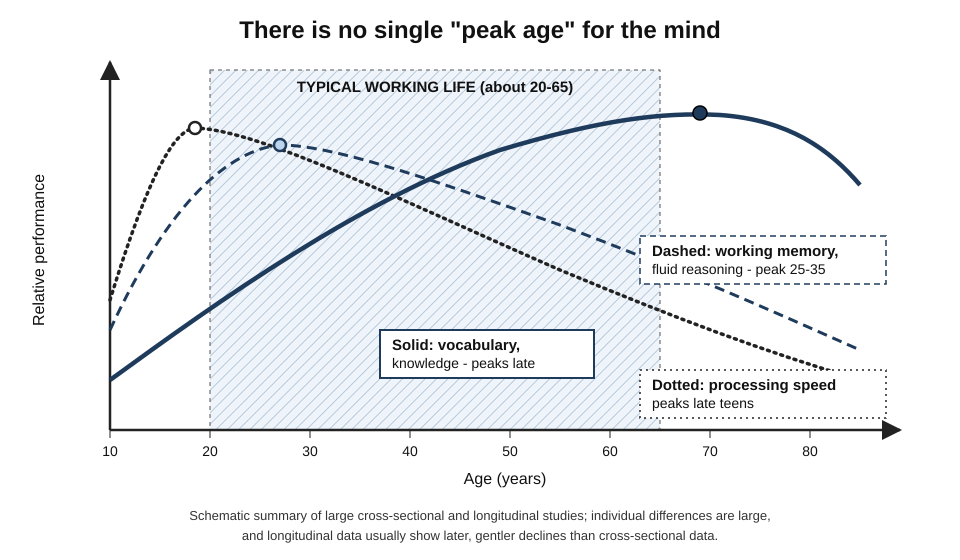
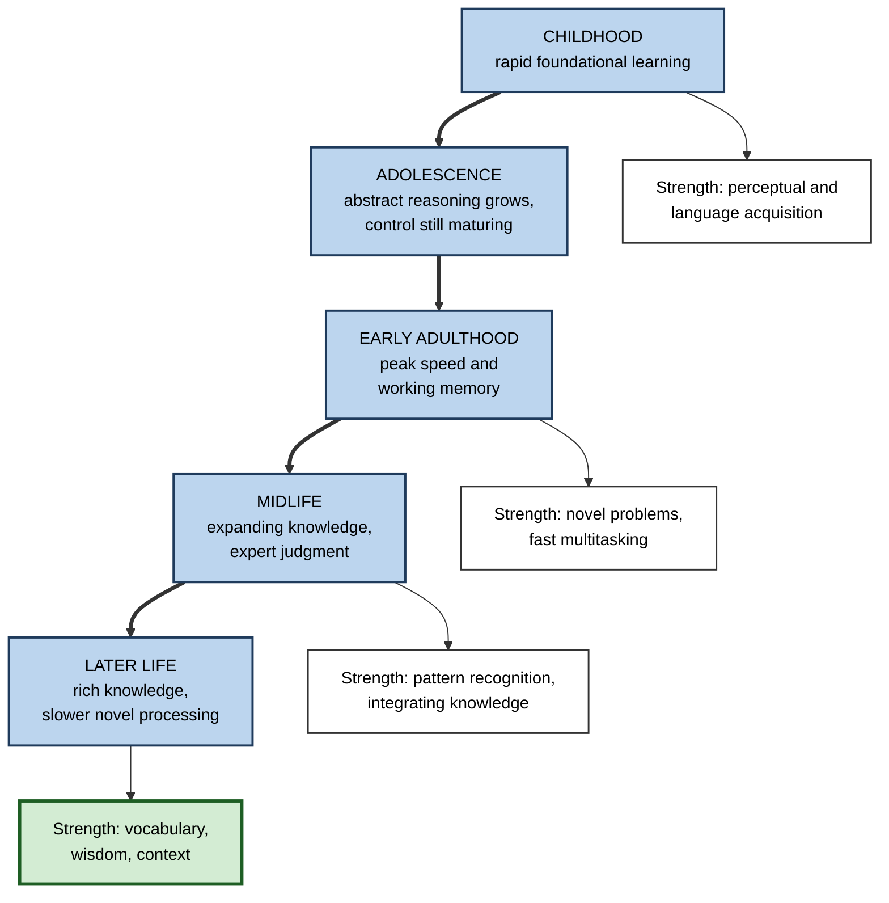
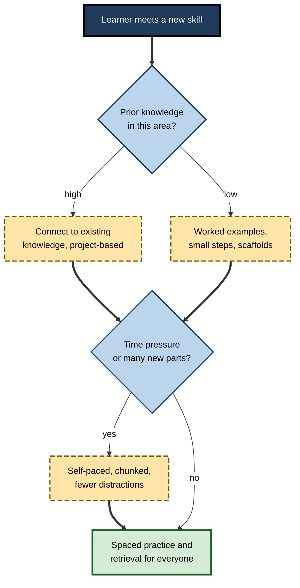

# B.11. Cognitive Development Across Lifespan

> **In one sentence:** Cognitive development is how our thinking abilities grow and change from infancy to old age — some abilities, like processing speed, peak early, while others, like knowledge and vocabulary, keep growing for decades — so people can learn well at every age, but the best way to learn shifts.
>
> **Why it matters:** Careers now span 40 to 50 years, with repeated reskilling. Understanding how cognition changes with age lets you learn effectively at any stage, design training for mixed-age teams, and reject both "too old to learn" and "kids are sponges" myths.
>
> **Level span:** Novice → Expert · **Reading time:** ~19 min · **Builds on:** working memory and the information processing model

---

## The Learning Ladder

| Level | Badge | After this level you can... |
|---|---|---|
| 1 | NOVICE | Describe how thinking changes from childhood to old age in everyday terms. |
| 2 | FOUNDATIONS | Use the ideas of Piaget, Vygotsky, fluid and crystallised intelligence, and executive function. |
| 3 | PRACTITIONER | Adapt your own learning methods to your life stage and support learners of other ages. |
| 4 | ADVANCED | Evaluate evidence on adolescent brain development, cognitive aging, critical periods and brain training. |
| 5 | EXPERT / PRO | Design age-inclusive training and reskilling programmes and counter age bias in organisations. |

---

## Level 1 · Novice — The Big Picture

A child, a 25-year-old and a 65-year-old can all learn something new — but they bring different strengths. The child is learning how the world works from scratch. The 25-year-old is fast and can juggle many new pieces at once. The 65-year-old may be slower with brand-new, unfamiliar information but has a vast store of knowledge, patterns and judgment to connect new ideas to.

A useful analogy is a city's transport system. In youth, new roads are built quickly and traffic moves fast. In midlife, the network is extensive and well-mapped; you know shortcuts. Later, some roads become slower, but the map is richer than ever, and experienced drivers find efficient routes.

You have already seen this when:

- a teenager picked up a new app instantly, while a senior colleague asked more questions but then spotted the business risk the teenager missed;
- you noticed that, compared with five years ago, you remember fewer random facts but understand new problems in your field faster;
- an older relative learned to video-call during a lockdown once they had a clear reason and patient practice.

The key idea for a beginner: **you can learn at any age. What changes is which strengths you rely on and how you should practise.**

---

## Level 2 · Foundations — Core Concepts

### Childhood and adolescence: two classic theories

| Theorist | Big idea | What has held up | What has been revised |
|---|---|---|---|
| **Jean Piaget** | Children actively construct understanding through stages: sensorimotor, preoperational, concrete operational, formal operational. | Children are active learners; thinking becomes more abstract and logical with age. | Stages are less rigid and age-locked than he proposed; infants and young children are more capable than his tasks suggested; many adults rarely use formal reasoning outside familiar domains. |
| **Lev Vygotsky** | Learning is social; the **zone of proximal development** (ZPD) is the gap between what a learner can do alone and with help. | Guided participation, scaffolding and language as a thinking tool are central to teaching. | The concept is sometimes applied loosely; it needs concrete assessment of what the learner can do. |

### The information-processing view of development

From childhood into early adulthood, processing speed increases, working memory capacity grows, and **executive functions** — the control skills of inhibition, working-memory updating and cognitive flexibility — strengthen. Prefrontal brain regions continue maturing into the twenties.

### Adulthood and aging: two kinds of intelligence

Raymond Cattell and John Horn distinguished two broad abilities:

- **Fluid intelligence (Gf)** — reasoning with new information, solving novel problems, holding and manipulating information quickly.
- **Crystallised intelligence (Gc)** — accumulated knowledge, vocabulary and skills from experience and culture.

*Figure B.11-1 — Different cognitive abilities peak at different ages.* Dotted line: processing speed, peaking in the late teens. Dashed line: working memory and fluid reasoning, peaking around the mid-twenties to early thirties. Solid line: vocabulary and knowledge, rising through midlife and peaking late. Schematic; individual differences are large.

A widely cited 2015 study by Joshua Hartshorne and Laura Germine, using data from tens of thousands of online participants, concluded that there is no single age at which cognition peaks: processing speed peaks around the late teens, short-term memory for some materials in the twenties to early thirties, some social-cognitive abilities such as reading emotions from faces in the forties or later, and vocabulary in the sixties or beyond.

**Figure B.11-2 — Learning strengths across life stages.**

*How to read it:* the thick path is the lifespan; each white box names a characteristic learning strength of that stage. Every stage has strengths.

### Key terms

| Term | Plain meaning |
|---|---|
| **Cognitive development** | Changes in thinking abilities across the lifespan. |
| **Zone of proximal development** | What a learner can achieve with guidance but not yet alone. |
| **Scaffolding** | Temporary support that is gradually removed as competence grows. |
| **Executive functions** | Control skills: inhibition, updating working memory, switching flexibly. |
| **Fluid intelligence** | Reasoning and problem-solving with novel information. |
| **Crystallised intelligence** | Accumulated knowledge and skills. |
| **Cognitive reserve** | Resilience built by education, mentally demanding work and engagement that helps cognition cope with aging or brain change. |
| **Sensitive period** | A window when certain learning happens most easily. |

---

## Level 3 · Practitioner — Putting It to Work

### Adapting learning methods to your life stage

**Early career (roughly 20s–early 30s).** Speed and working memory are near their peak, but domain knowledge is thin. Focus on building strong foundations: deliberate practice, worked examples, retrieval and spacing. Seek mentors (a living ZPD). Avoid relying only on speed — knowledge depth is what compounds.

**Mid-career (roughly mid-30s–50s).** Knowledge and pattern recognition are strong. Use them: connect new topics explicitly to what you know, learn through projects, teach others. Guard against overconfidence in old patterns when fields change.

**Later career (50s and beyond).** Fluid processing may be slower, especially under time pressure and with multiple new elements at once. Compensate with structure: reduce distractions, learn in smaller chunks, allow more practice, use written materials you can revisit, and lean on rich prior knowledge as hooks. Mentally demanding new learning appears to be good for cognitive health.

### A six-step routine for learning a new skill at any age

1. **Connect** — "What do I already know that is similar?"
2. **Chunk** — break the new skill into small parts.
3. **Practise one part at a time**, at your own pace, with worked examples.
4. **Retrieve and space** — test yourself across days.
5. **Integrate** — combine parts into whole tasks.
6. **Teach or explain** — consolidate by sharing with someone else.

**Figure B.11-3 — Matching support to the learner, not the birth year.**

*How to read it:* support depends on prior knowledge and load, not age labels; every route ends in spaced practice and retrieval.

### Worked example — reskilling a 58-year-old operations manager in data analytics

| | Before | After |
|---|---|---|
| **Programme** | Same fast-paced, two-week bootcamp as graduates; timed exercises. | Same content, spread over eight weeks with self-paced modules. |
| **Approach** | Generic examples. | Examples drawn from her own operations data. |
| **Support** | None after class. | Weekly mentor sessions; worked examples before independent tasks. |
| **Outcome** | Falls behind, concludes she is "too old for this". | Builds dashboards her team uses; spots data quality issues others miss because she knows the processes. |

### Common mistakes at this level

- **Assuming age predicts ability.** Variation within an age group is larger than the average difference between groups.
- **Timed, fast-paced training for everyone.** Speed pressure disadvantages older learners without improving learning.
- **Treating young adults as finished thinkers.** Judgment and self-regulation continue developing through the twenties and with experience.
- **Over-scaffolding experts.** Experienced learners of any age may find heavy guidance redundant.

---

## Level 4 · Advanced — Mechanisms, Models & Evidence

### Cross-sectional versus longitudinal evidence

**Cross-sectional** studies compare different age groups at one time; they mix true aging effects with **cohort effects** (differences in education, health and technology exposure between generations). **Longitudinal** studies, such as the Seattle Longitudinal Study begun by K. Warner Schaie in 1956, follow the same people over time. Longitudinal data generally show later and gentler declines in many abilities than cross-sectional data, with meaningful decline in many abilities often not apparent until the sixties or later. Both designs have biases (for example, practice effects and selective dropout in longitudinal studies).

### Why fluid abilities slow

Timothy Salthouse's **processing-speed theory** proposes that a general slowing of processing explains much of the age-related decline in fluid tasks: slower operations mean information decays before it can be used. Other contributors include reduced inhibition of irrelevant information and lower working-memory capacity. At the same time, older adults often perform equally well or better on tasks where knowledge and strategy matter.

### Adolescence and early adulthood

Brain imaging shows ongoing maturation of the prefrontal cortex and its connections into the twenties. The popular claim that "the brain finishes developing at 25" is an oversimplification: development is gradual, varies by region and person, and does not stop abruptly at any age.

### Sensitive periods and second languages

Some learning has sensitive periods. Native-like pronunciation is much easier to acquire in childhood. A large 2018 study by Joshua Hartshorne, Joshua Tenenbaum and Steven Pinker, with hundreds of thousands of participants, estimated that the ability to learn grammar to native-like levels remains high until around late adolescence, then declines. This does not mean adults cannot become highly proficient: adults learn vocabulary and explicit rules efficiently and often learn faster initially than children.

### Learning in later life and cognitive health

- **Engagement studies.** In a 2014 study led by Denise Park, older adults who spent months learning demanding new skills (such as digital photography or quilting) showed improvements in episodic memory compared with groups doing socially engaging or passive activities. The study was relatively small, but it supports the value of challenging new learning.
- **Cognitive reserve.** Education and mentally demanding work are associated with lower dementia risk and better cognitive resilience, though causal interpretation is debated.
- **Lifestyle factors.** Major reviews of modifiable dementia risk factors emphasise education, hearing, physical activity, blood pressure, social contact and other factors that support cognitive aging.

### Brain training: what the evidence says

Commercial brain-training games claimed broad benefits. Large reviews in 2016 found that training improves performance on the trained tasks and closely similar tasks, but evidence for **far transfer** to everyday cognition is weak. In 2016 a major brain-training company settled with the US Federal Trade Commission over unsupported advertising claims. The large ACTIVE trial in older adults found durable gains on trained abilities, and long-term follow-ups reported some everyday-function benefits; one analysis linking speed training to reduced dementia risk is promising but debated. The practical message: **learning real, complex, meaningful skills is a better bet than generic brain games.**

### Andragogy: useful, but not a separate science

Malcolm Knowles's **andragogy** described adult learners as self-directed, experience-rich and problem-centred. These are useful design principles, but research does not show that adults learn by fundamentally different cognitive mechanisms from children. The same principles — retrieval, spacing, worked examples, feedback — work across ages, adjusted for prior knowledge and motivation.

---

## Level 5 · Expert / Pro — Professional Mastery

### Designing age-inclusive learning

| Principle | Practical design |
|---|---|
| Self-pacing | Modular content; no unnecessary time pressure. |
| Prior knowledge as an asset | Use learners' experience in examples; invite them to connect and teach. |
| Low extraneous load | Clear layout, readable text size, captions, minimal distractions. |
| Multiple practice opportunities | Spaced retrieval and repeated practice for everyone. |
| Mixed-age collaboration | Pair digital-native speed with experienced judgment; reverse mentoring. |
| Psychological safety | Counter age stereotypes, which themselves impair performance. |

### Age stereotypes as a learning barrier

**Stereotype threat** — worry about confirming a negative stereotype — can reduce older adults' performance in memory tests in some studies. Managers who signal "this is hard for older people" may create the outcome they predict. Framing learning as normal at every age is part of good design.

### Professional scenario

**Role:** Chief learning officer at a manufacturing company automating plants.
**Situation:** The workforce averages over 50; leadership assumes older workers "won't adapt" and plans redundancies plus external hiring.
**What the pro does:** Presents evidence that crystallised knowledge of processes is valuable and hard to hire, and that older adults learn well with appropriate design. Launches a reskilling programme with self-paced modules, practice on real plant data, mentoring, and paired teams. Tracks proficiency at three and six months. Most participants reach target proficiency; their process knowledge reduces automation configuration errors, and the company avoids costly external hiring.

### AI-era implications

- **AI can reduce barriers** for learners who find interfaces or jargon hard — for example, explaining in plain language or adjusting pace.
- **Offloading risks differ by age.** Younger learners risk never building foundational knowledge; older learners risk disuse of skills they already have. Both need deliberate unaided practice.
- **Continuous reskilling** across 40-plus-year careers makes learning-how-to-learn a core competency at every age.

### Ethical limits

Age-based assumptions in hiring, promotion or training access are not supported by the evidence on learning and are illegal in many jurisdictions. Design for individual needs, not age categories.

---

## Myths vs. Evidence

| Myth | What the evidence shows |
|---|---|
| "You can't teach an old dog new tricks." | Adults learn throughout life; challenging new learning may support cognitive health. |
| "Intelligence peaks at 25 and then declines." | Different abilities peak at different ages; knowledge-based abilities peak much later. |
| "The brain is fully developed at exactly 25." | Development is gradual and varies; there is no sharp endpoint. |
| "Children learn everything more easily than adults." | Children excel at some things (accent, implicit grammar); adults often learn explicit knowledge faster. |
| "Brain-training games keep you sharp in daily life." | Gains are mostly limited to trained tasks; far transfer is weak. |
| "Adults need a completely different learning science." | Core cognitive principles apply across ages; adjustments concern pace, relevance and prior knowledge. |

## Practitioner Toolkit

**Age-inclusive training checklist**

- [ ] Self-paced options; no unnecessary time limits.
- [ ] Examples use learners' real work and experience.
- [ ] Clear, readable materials with low visual clutter.
- [ ] Worked examples for new domains regardless of age.
- [ ] Spaced practice and retrieval built in.
- [ ] Mixed-age pairing or mentoring.
- [ ] Language that frames learning as normal at every age.

**Personal learning-stage plan**

| My stage | Strengths I can use | Constraints to design around | Methods I will use |
|---|---|---|---|
| | | | |

## Self-Check

1. **[NOVICE]** Name one learning strength typical of younger adults and one of older adults.
2. **[NOVICE]** Why is "too old to learn" a myth?
3. **[FOUNDATIONS]** Define fluid and crystallised intelligence.
4. **[FOUNDATIONS]** What is the zone of proximal development?
5. **[PRACTITIONER]** How would you adapt a fast-paced bootcamp for a 60-year-old learner?
6. **[ADVANCED]** Why do cross-sectional and longitudinal studies of aging give different pictures?
7. **[ADVANCED]** What does the evidence say about brain-training games?
8. **[EXPERT / PRO]** How can age stereotypes harm learning outcomes in organisations?
9. **[EXPERT / PRO]** How do AI offloading risks differ for early-career and late-career learners?

### Answer Key

1. Younger adults: fast processing and working memory. Older adults: rich knowledge, vocabulary and judgment.
2. Adults learn throughout life; abilities change but learning capacity remains, especially with good methods.
3. Fluid: reasoning with novel information. Crystallised: accumulated knowledge and skills.
4. The range of tasks a learner can do with guidance but not yet alone.
5. Self-paced modules, chunked content, examples from their experience, worked examples, mentoring and spaced practice, without unnecessary time pressure.
6. Cross-sectional studies confound aging with cohort differences; longitudinal studies follow the same people and usually show later, gentler declines, though they have their own biases.
7. Training improves trained tasks but shows weak far transfer to everyday cognition; learning meaningful complex skills is a better bet.
8. Stereotype threat can depress performance; managers' low expectations can reduce access to training and confidence.
9. Early-career learners risk never building foundational knowledge; late-career learners risk losing skills through disuse. Both need deliberate unaided practice.

## Key Takeaways

- Cognition **changes throughout life**; there is no single peak age.
- **Fluid abilities peak early; crystallised knowledge keeps growing** into later life.
- **Piaget and Vygotsky** remain useful, with revisions: children are more capable and stages less rigid than first thought.
- Adults of all ages **learn well with appropriate pacing, structure and relevance**.
- **Brain games show weak far transfer**; meaningful new learning is better.
- **Design for the learner, not the birth year**, and counter age stereotypes.

## Glossary

| Term | Meaning |
|---|---|
| Andragogy | Knowles's principles of adult education. |
| Cognitive reserve | Resilience of cognition built by education and engagement. |
| Cohort effect | Differences between generations that are not due to aging. |
| Crystallised intelligence | Accumulated knowledge and skills. |
| Executive functions | Inhibition, updating and cognitive flexibility. |
| Far transfer | Improvement on tasks quite different from those trained. |
| Fluid intelligence | Novel reasoning and problem-solving ability. |
| Processing-speed theory | The idea that general slowing explains much age-related decline. |
| Scaffolding | Temporary support that is gradually removed. |
| Sensitive period | A time window of heightened ease for certain learning. |
| Stereotype threat | Performance impairment caused by fear of confirming a stereotype. |
| Zone of proximal development | What a learner can do with help but not yet alone. |
