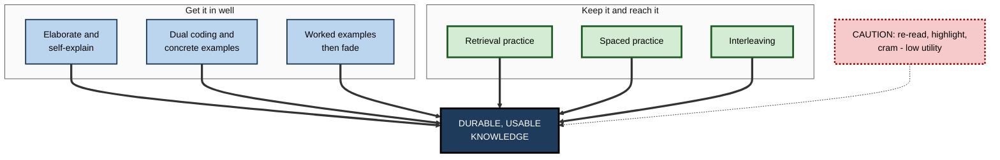
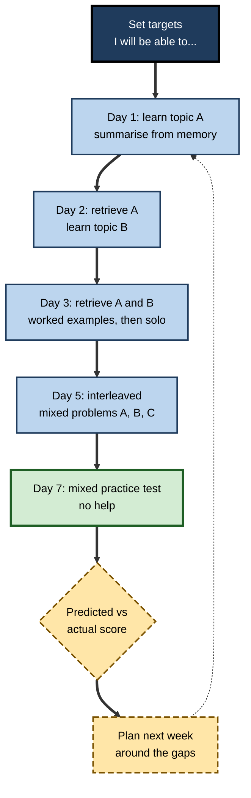

# B.12. Applying Cognitive Science to Study

> **In one sentence:** Applying cognitive science to study means choosing how you learn based on how memory and attention actually work — spacing, retrieving, explaining, mixing and connecting — instead of on what feels productive.
>
> **Why it matters:** The same hours of study can produce several times more durable, usable knowledge when they are organised around well-replicated mechanisms. For professionals who must keep learning for decades, that efficiency compounds into a major career advantage.
>
> **Level span:** Novice → Expert · **Reading time:** ~19 min · **Builds on:** every earlier note in this subtopic — attention, encoding, retrieval, forgetting, biases, dual processes

---

## The Learning Ladder

| Level | Badge | After this level you can... |
|---|---|---|
| 1 | NOVICE | Name the few study habits that work best and the popular ones that work poorly. |
| 2 | FOUNDATIONS | Link each effective strategy to the cognitive mechanism that makes it work. |
| 3 | PRACTITIONER | Build and run a weekly study system that combines the strategies. |
| 4 | ADVANCED | Judge the strength of evidence, boundary conditions and interactions between strategies. |
| 5 | EXPERT / PRO | Design study and training systems for others, including AI-assisted ones, and measure their effect. |

---

## Level 1 · Novice — The Big Picture

Most people study the way they were never taught not to: re-reading, highlighting, cramming before deadlines, and watching videos until things feel familiar. These habits feel good because they are smooth and give a sense of progress. Cognitive science shows that they produce relatively weak, short-lived learning.

The methods that work best feel harder. Think of strength training: lifting a weight that is too light feels pleasant but builds little muscle. A weight that makes you strain — but that you can still lift — builds strength. Effective study is the mental equivalent: **effortful, but achievable**.

You have already seen this when:

- you crammed for an exam, passed, and forgot almost everything within weeks;
- you could follow a tutorial perfectly but could not build the same thing alone the next day;
- you remembered a topic you had to teach to someone else far better than one you only read about.

The key idea for a beginner: **test yourself, spread it out, explain it, mix it up — and do not trust the feeling of familiarity.**

---

## Level 2 · Foundations — Core Concepts

### From mechanism to strategy

Each effective strategy exploits a mechanism covered earlier in this subtopic.

| Mechanism | What cognitive science shows | Strategy that uses it |
|---|---|---|
| Retrieval strengthens memory | The testing effect | **Retrieval practice** — self-testing, flashcards, brain dumps |
| Forgetting is fast, then slow; effortful retrieval grows storage strength | The spacing effect | **Spaced practice** — sessions spread over days and weeks |
| Meaningful processing builds durable traces | Levels of processing, elaboration | **Elaboration and self-explanation** — asking why and how |
| Discrimination needs comparison | Category learning research | **Interleaving** — mixing related problem types |
| Words plus relevant visuals give two routes | Dual coding | **Dual coding** — combining text with diagrams you draw |
| Abstract ideas transfer through varied examples | Analogical learning | **Concrete examples** — several varied cases per idea |
| Working memory is tiny for new material | Cognitive load research | **Worked examples, then fading** — study solutions before solving alone |
| Feelings of fluency mislead | Metacognitive illusions | **Calibration checks** — predict, test, compare |

### How the evidence ranks common techniques

A widely cited 2013 review by John Dunlosky and colleagues evaluated ten techniques across materials, learners and settings:

| Rating | Techniques |
|---|---|
| **High utility** | Practice testing; distributed (spaced) practice |
| **Moderate utility** | Elaborative interrogation; self-explanation; interleaved practice |
| **Low utility** | Summarisation (as usually done); highlighting; keyword mnemonic; imagery for text; re-reading |

Later reviews and meta-analyses through the mid-2020s broadly support these ratings while adding nuance (see Level 4).

**Figure B.12-1 — The core strategies and the mechanisms behind them.**

*How to read it:* thick arrows are high-value strategies, grouped by whether they build encoding or durable access; the dotted arrow marks low-utility habits.

### Key terms

| Term | Plain meaning |
|---|---|
| **Retrieval practice** | Studying by recalling information from memory. |
| **Spaced practice** | Distributing study sessions over time. |
| **Interleaving** | Mixing different but related topics or problem types in one session. |
| **Blocked practice** | Practising one type at a time (AAA, BBB, CCC). |
| **Elaborative interrogation** | Asking and answering "why is this true?" |
| **Self-explanation** | Explaining each step of a solution or text to yourself. |
| **Worked example** | A fully solved problem studied before solving similar ones. |
| **Desirable difficulty** | A challenge that slows learning now but improves long-term retention and transfer. |

---

## Level 3 · Practitioner — Putting It to Work

### The weekly study system — seven steps

1. **Define targets.** Write what you must be able to *do* without help ("design a REST endpoint with pagination", not "learn APIs").
2. **First exposure with encoding.** Read or watch in short chunks; after each, close it and write a summary from memory, plus one "why" and one example.
3. **Worked examples first, then solo.** For problem-solving skills, study two or three worked examples, then solve similar problems with less and less help.
4. **Next-day retrieval.** Start each session with 10 minutes of retrieval on earlier material — brain dump or flashcards — before new content.
5. **Space across the week.** Revisit each topic on days 1, 3 and 7, then weekly or fortnightly.
6. **Interleave once basics are solid.** Mix problem types so you practise *choosing* the method, not just executing it.
7. **Weekly calibration.** Do a mixed practice test without help; compare predicted and actual scores; adjust next week's plan to your gaps.

**Figure B.12-2 — One week of evidence-based study.**

*How to read it:* each day opens with retrieval of earlier material; the week ends with an unaided test and a calibration check that feeds the next week (dotted arrow).

### Worked example — a product manager preparing for a technical certification over six weeks

| | Before (typical) | After (evidence-based) |
|---|---|---|
| **Weeks 1–5** | Watches course videos in order; highlights the study guide. | Watches in 15-minute chunks, each followed by a written summary from memory and flashcards. |
| **Practice** | Practice exam once, at the end. | Short mixed quizzes three times a week; full practice exam every two weeks. |
| **Structure** | One domain per week, never revisited. | New domain each week plus spaced retrieval of all earlier domains. |
| **Final week** | Cramming, long nights. | Interleaved practice on weakest domains; normal sleep. |
| **Outcome** | Borderline pass, rapid forgetting. | Comfortable pass; still uses the knowledge months later in architecture discussions. |

### Common mistakes at this level

- **Switching to effective methods, then abandoning them** because they feel harder. Expect the dip; trust the evidence.
- **Flashcards with recognition only.** Say or write the answer before flipping.
- **Interleaving too early.** Mix only after you have a basic grasp of each type.
- **Spacing only on paper.** A plan without calendar reminders or software tends to collapse into cramming.
- **Sacrificing sleep.** Sleep supports consolidation; all-nighters trade long-term memory for short-term performance.

---

## Level 4 · Advanced — Mechanisms, Models & Evidence

### Strength and limits of each strategy

| Strategy | Evidence strength | Key boundary conditions |
|---|---|---|
| Retrieval practice | Very strong; many meta-analyses | Needs feedback for best results, especially with multiple choice; benefits smaller and more variable in real classrooms than labs. |
| Spaced practice | Very strong | Optimal gap scales with how long you need to remember; too-short gaps lose most of the benefit. |
| Interleaving | Moderate to strong for some materials | Works best when categories are similar and easily confused (problem types, painting styles, diagnoses); much weaker or reversed for dissimilar material or simple word lists, according to a 2019 meta-analysis. |
| Elaboration / self-explanation | Moderate | Requires enough prior knowledge to generate accurate explanations; quality matters. |
| Worked examples | Strong for novices | Benefit fades and can reverse as expertise grows (expertise reversal). |
| Dual coding | Moderate | Visuals must represent content; decorative images do not help. |
| Summarisation | Mixed | Helps when learners are trained to summarise well; often done poorly. |

### Combining strategies

Strategies combine well. **Spaced retrieval** — retrieval practice distributed over time — is generally more powerful than either alone. **Successive relearning** (retrieving to a criterion of correct recall, then repeating across spaced sessions) has shown strong long-term retention in course settings. **Retrieval plus elaboration** (explaining why an answer is correct after retrieving it) supports transfer.

### Why learners do not use these methods

Surveys of students consistently find that re-reading and highlighting are the most common strategies, and that few learners use spacing deliberately. Reasons include the **fluency illusion**, **deadline-driven cramming**, lack of instruction in study methods, and the short-term discomfort of desirable difficulties. Interventions that explain the science *and* let learners experience their own results (for example, comparing their retention after testing versus re-reading) are more successful at changing habits than explanation alone.

### Recent findings (2023–2026)

- **Classroom realism.** Larger course-based studies and single-paper meta-analyses find that retrieval and spacing still help in authentic settings, but effects are smaller and depend on implementation details such as feedback and question format.
- **Mathematics.** A 2025 meta-analytic review of spacing and retrieval practice for mathematics learning found benefits while highlighting variation by task type.
- **AI tutors.** A 2025 field experiment with high-school mathematics students found that unrestricted access to a general-purpose AI assistant raised practice performance but lowered later unaided exam performance, while a tutor designed to give hints rather than answers largely avoided the harm. A 2025 randomised study in a university physics course reported that an AI tutor built around evidence-based teaching principles produced learning gains at least as large as an in-class active-learning session, in less time. Together they suggest that **AI design determines whether it supports or replaces the cognitive work of learning**.
- **Cognitive offloading.** Reviews and small experimental studies of AI-assisted writing and problem-solving indicate that offloading improves immediate output while reducing effort, memory for the work and sense of ownership, especially for learners who rely on AI from the start. Some of these studies are small or preprints; the direction of the effect is consistent, the size is uncertain.

### Sleep, health and study

Sleep after learning supports consolidation; chronic sleep restriction impairs attention and encoding. Physical activity and stress management support the conditions for learning. These are enablers, not replacements, for good strategies.

---

## Level 5 · Expert / Pro — Professional Mastery

### Designing study systems for others

| Setting | Application |
|---|---|
| Corporate academies | Programmes of spaced sessions with retrieval openers, interleaved case practice and delayed assessments. |
| Certification support | Spaced quiz engines; mixed practice exams; calibration dashboards. |
| Engineering onboarding | Worked examples of real code changes, faded to independent tickets; spaced retrieval of system architecture. |
| Sales and customer success | Interleaved objection-handling drills; spaced product scenario questions. |
| AI-assisted learning products | Socratic tutors that ask for an attempt first, give hints, require explanation, then schedule spaced review. |

### Metrics that matter

- **Delayed unaided performance** (30–90 days) on realistic tasks.
- **Retrieval success rates** over spaced attempts — a direct signal of durable learning.
- **Calibration gap** between predicted and actual performance.
- **Transfer to work**: on-the-job behaviors and outcomes.
- Avoid relying on completion rates, time spent or satisfaction as evidence of learning.

### Professional scenario

**Role:** Head of enablement at a cybersecurity firm.
**Situation:** Analysts must master hundreds of attack techniques and detection rules. The current programme is self-paced video with a final test; analysts pass but miss techniques in live triage.
**What the pro does:** Rebuilds the programme around cognitive science: short videos each followed by free-recall prompts; a spaced-retrieval engine serving scenario questions on attack patterns; interleaved triage drills mixing similar-looking techniques so analysts learn to discriminate; worked examples of real investigations, faded to independent cases; and an AI assistant configured to ask analysts for their hypothesis before giving hints. Success is measured by detection accuracy on unseen simulated incidents at 60 days. Accuracy improves, and the time new analysts need before handling live triage alone shortens.

### Expert-level judgement

- **Prioritise high-utility strategies first**: retrieval and spacing give the largest returns for effort.
- **Match strategy to material and learner**: interleave confusable categories; use worked examples for novices; fade support.
- **Build the method into the system**, not into willpower: scheduled quizzes, calendar spacing, tool defaults.
- **Explain desirable difficulty upfront** so learners do not abandon effective methods.
- **Use AI to generate, schedule and coach — never to do the learner's thinking.**

### Ethical limits

Effective methods can be used to drive compliance training that serves institutions more than learners. Apply them transparently, respect learners' time, and focus on knowledge that genuinely matters to their work and growth.

---

## Myths vs. Evidence

| Myth | What the evidence shows |
|---|---|
| "Re-reading and highlighting are solid study methods." | They are rated low utility; retrieval and spacing are far more effective. |
| "Cramming works — I passed." | Cramming supports short-term performance but produces rapid forgetting. |
| "If a method feels hard, it's not working." | Desirable difficulties feel harder and produce more durable learning. |
| "Interleaving always beats blocking." | It helps most with similar, confusable categories; for some material blocking is fine or better. |
| "Learning styles should guide study methods." | Matching methods to self-reported styles does not improve learning. |
| "AI tutors will automatically make studying more efficient." | Design matters: answer-giving AI can harm unaided performance; hint-based, pedagogically designed AI can help. |

## Practitioner Toolkit

**Evidence-based study checklist**

- [ ] Targets written as "I will be able to... without help".
- [ ] Each session opens with retrieval of earlier material.
- [ ] Reviews spaced across days and weeks (calendar or software).
- [ ] Explanations and examples in my own words.
- [ ] Worked examples before solo problems in new domains.
- [ ] Mixed practice once basics are solid.
- [ ] Weekly unaided test with calibration check.
- [ ] Adequate sleep protected, especially before tests.
- [ ] AI used for hints, quizzes and feedback after my own attempt.

**One-page weekly plan template**

| Day | Retrieval warm-up (10 min) | New learning | Practice type | Notes / gaps |
|---|---|---|---|---|
| Mon | | | | |
| Tue | | | | |
| Wed | | | | |
| Thu | | | | |
| Fri | Mixed test | — | Interleaved | Calibration: predicted __ / actual __ |

## Self-Check

1. **[NOVICE]** Name the two study methods rated highest utility in major reviews.
2. **[NOVICE]** Why does cramming seem to work?
3. **[FOUNDATIONS]** Which mechanism makes spacing effective?
4. **[FOUNDATIONS]** What is the difference between blocked and interleaved practice?
5. **[PRACTITIONER]** Outline a one-week study plan for a new topic using at least four strategies.
6. **[ADVANCED]** When does interleaving help most, and when may it not help?
7. **[ADVANCED]** Why do learners keep using low-utility methods despite the evidence?
8. **[EXPERT / PRO]** What does recent research suggest about designing AI tutors?
9. **[EXPERT / PRO]** Which metrics would you use to judge a study or training programme?

### Answer Key

1. Practice testing (retrieval practice) and distributed (spaced) practice.
2. It produces high short-term retrieval strength, enough for an exam soon after, but little lasting storage strength.
3. Forgetting between sessions makes the next retrieval more effortful, which increases storage strength; spacing also adds varied retrieval contexts.
4. Blocked practice groups one type at a time; interleaved practice mixes types so learners must choose the right approach.
5. For example: day 1 learn and summarise from memory; day 2 retrieve and add worked examples; day 3 solo problems; day 5 interleaved practice; day 7 unaided mixed test with calibration.
6. Most with similar, confusable categories that require discrimination; less or not at all with dissimilar material or simple lists, and not before basics are learned.
7. Fluency illusions, deadline-driven habits, lack of instruction, and the discomfort of desirable difficulties.
8. Unrestricted answer-giving AI can raise practice scores but harm unaided performance; tutors that require attempts, give hints and follow evidence-based principles can produce strong learning gains.
9. Delayed unaided performance, retrieval success over time, calibration gap and transfer to job behaviors and outcomes — not completion or satisfaction.

## Key Takeaways

- **Retrieval practice and spacing** are the highest-value study strategies.
- **Elaboration, self-explanation, interleaving, worked examples and dual coding** add value when matched to the material and learner.
- **Re-reading, highlighting and cramming** feel productive but produce weak learning.
- **Desirable difficulties feel harder** — expect it and persist.
- Build strategies into **systems and schedules**, not willpower.
- **AI helps when it coaches and schedules**, and harms when it does the thinking for you.
- Measure learning by **delayed, unaided performance and transfer**.

## Glossary

| Term | Meaning |
|---|---|
| Blocked practice | Practising one skill or problem type at a time. |
| Calibration | Match between predicted and actual performance. |
| Desirable difficulty | A learning challenge that improves long-term outcomes. |
| Distributed practice | Practice spread out over time. |
| Dual coding | Combining verbal and visual representations. |
| Elaborative interrogation | Generating explanations for why facts are true. |
| Interleaving | Mixing related topics or problem types during practice. |
| Practice testing | Self-testing or practice quizzes to strengthen memory. |
| Retrieval practice | Recalling information to strengthen memory. |
| Self-explanation | Explaining material or solution steps to oneself. |
| Successive relearning | Retrieval to criterion repeated across spaced sessions. |
| Worked example | A step-by-step solution studied before independent practice. |
