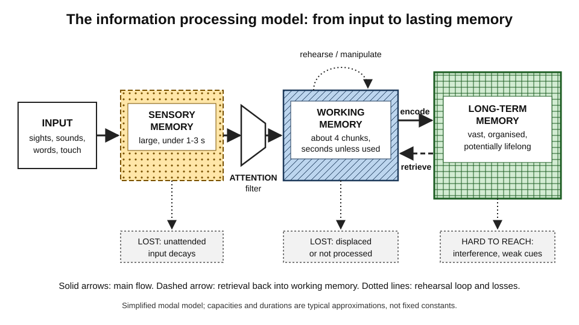
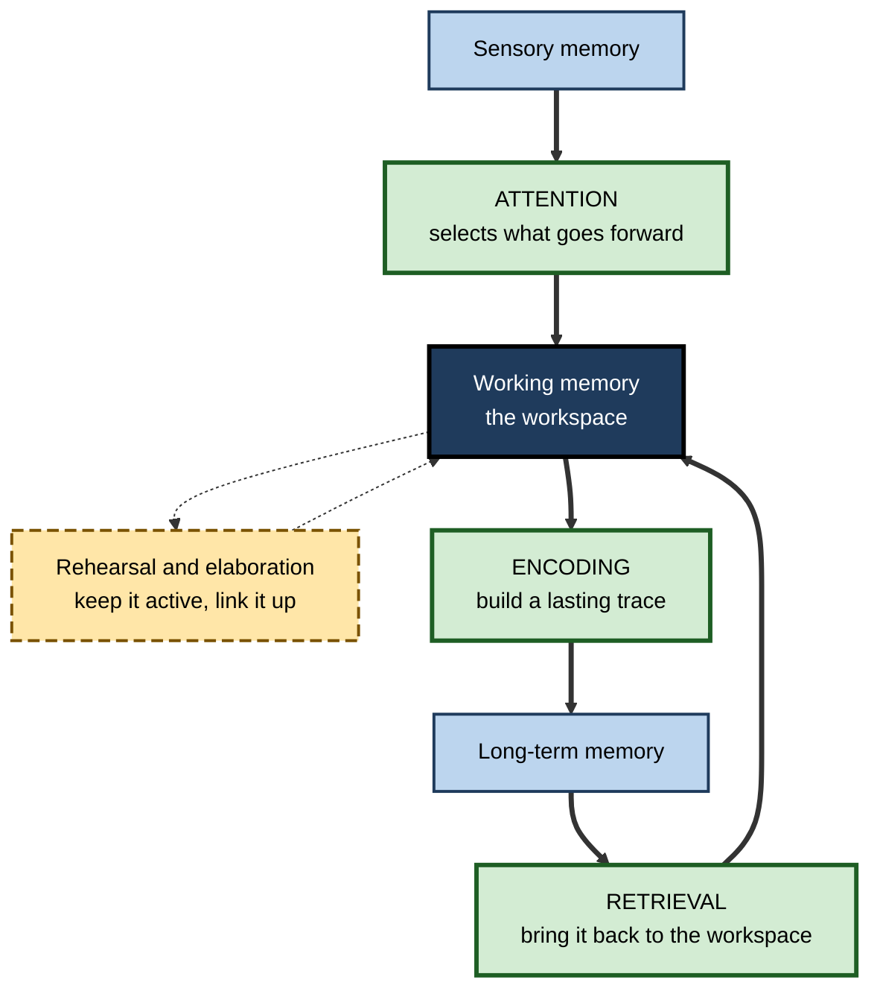
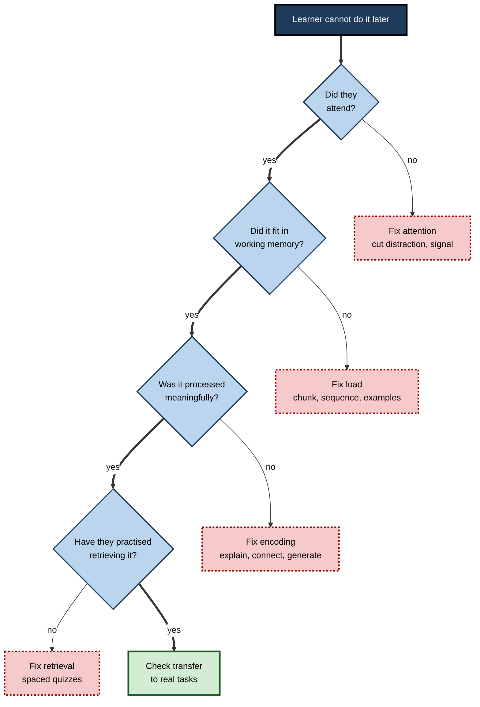

# B.2. Information Processing Model

> **In one sentence:** The information processing model describes the mind as a system that takes in information through the senses, holds a small amount in a short-lived "workspace", and moves some of it into a vast long-term store from which it can later be pulled back out.
>
> **Why it matters:** It is the single most useful mental map for designing learning. It explains why people forget most of what they hear in a meeting, why slides crammed with text fail, and why practising recall beats re-reading — and it tells you where in the pipeline a learning problem is occurring.
>
> **Level span:** Novice → Expert · **Reading time:** ~18 min · **Builds on:** what cognitive science is; the idea of mental representations

---

## The Learning Ladder

| Level | Badge | After this level you can... |
|---|---|---|
| 1 | NOVICE | Describe the journey of information from your senses to long-term memory using an everyday analogy. |
| 2 | FOUNDATIONS | Name the three stores and the processes that link them, with their rough capacity and duration. |
| 3 | PRACTITIONER | Diagnose where a learning breakdown happens (attention, workspace overload, encoding, retrieval) and fix it. |
| 4 | ADVANCED | Explain the model's history, the evidence for each component, and its main criticisms and successors. |
| 5 | EXPERT / PRO | Use the model to design training, documentation, dashboards and AI-assisted workflows for real people. |

---

## Level 1 · Novice — The Big Picture

Imagine a busy post office. Thousands of letters arrive at the loading dock every minute (your **senses**). A clerk glances at them and picks out only the few that look important (your **attention**). Those few go to a tiny sorting desk where they can be opened and worked on — but the desk only fits a handful at a time, and anything left there too long gets knocked off (your **working memory**). Letters worth keeping are filed in an enormous archive in the basement (your **long-term memory**). Later, when you need one, a clerk must find it and bring it back up to the desk (**retrieval**).

You have already experienced every part of this:

- You heard someone say your name across a noisy room even though you were not listening to them — your senses had taken in that conversation, and attention grabbed the important bit.
- Someone read you a phone number, and you lost it the moment someone else asked you a question — the small desk overflowed.
- You knew an answer in an exam but could not "find" it until you walked out of the room — it was in the archive, but retrieval failed.

The key idea for a beginner: **only a tiny trickle of what reaches your senses becomes lasting memory, and learning is about managing that trickle on purpose.**

---

## Level 2 · Foundations — Core Concepts

### The three stores

The classic version is often called the **modal model**, proposed by Richard Atkinson and Richard Shiffrin in 1968, building on Donald Broadbent's 1958 filter model of attention. It has three stores linked by control processes.

*Figure B.2-1 — The information processing model of memory.* Information flows left to right; most of it is lost at each stage. Dotted boxes show where it is lost. The capacities shown are typical approximations.

| Store | What it does | Capacity | Duration | What causes loss |
|---|---|---|---|---|
| **Sensory memory** | Holds a raw copy of what the senses just received. | Large | Visual (iconic) under about half a second; auditory (echoic) a few seconds | Decay; overwritten by new input |
| **Working memory** (short-term memory) | The mental workspace where you hold and manipulate what you are thinking about now. | Roughly 4 meaningful chunks for most adults (older estimate: "7 plus or minus 2") | Seconds, unless you keep refreshing it | Displacement, distraction, decay |
| **Long-term memory** | The durable store of knowledge, skills and experiences. | Effectively unlimited for practical purposes | Minutes to a lifetime | Interference and retrieval failure more than true erasure |

### The processes that link them

**Figure B.2-2 — Control processes in the model.**

*How to read it:* thick arrows are the main flow; the dotted loop is rehearsal that keeps information alive in the workspace.

### Key terms

| Term | Plain meaning |
|---|---|
| **Sensory register** | A very brief buffer holding raw sensory input. |
| **Attention** | The selection of some information for further processing at the expense of the rest. |
| **Working memory** | A limited system for holding and manipulating information during thinking. |
| **Chunk** | A meaningful unit grouped from smaller pieces (for example "FBI" rather than F, B, I). |
| **Rehearsal** | Repeating or refreshing information to keep it active. Maintenance rehearsal keeps it; elaborative rehearsal links it to what you know. |
| **Encoding** | Converting an experience into a durable memory representation. |
| **Retrieval** | Accessing a stored memory and bringing it back into use. |
| **Serial position effect** | Better recall for items at the start (primacy) and end (recency) of a list. |

---

## Level 3 · Practitioner — Putting It to Work

The model's practical value is diagnostic. When someone "did not learn", the breakdown happened at one of four points. Each needs a different fix.

### The Pipeline Diagnosis — four checkpoints

1. **Did it get in? (attention)** Was the learner actually attending? Notifications, multitasking and irrelevant decoration consume attention. *Fix:* remove distractions, signal what matters, ask a question that forces engagement.
2. **Did it fit? (working-memory load)** Were there too many new elements at once? *Fix:* chunk the material, present steps sequentially, use worked examples, put labels next to the things they describe.
3. **Was it processed deeply? (encoding)** Did the learner connect it to prior knowledge, explain it, or generate something? *Fix:* ask "why does this work?", have learners summarise in their own words, relate it to a known case.
4. **Can it be found again? (retrieval)** Has the learner ever practised pulling it out without cues? *Fix:* low-stakes quizzes, spaced retrieval, practice in conditions resembling use.

**Figure B.2-3 — Diagnosing a learning breakdown.**

*How to read it:* move down the thick path; the first "no" tells you which stage failed and what to fix.

### Worked example — a new support agent learning a ticketing system

| | Before | After |
|---|---|---|
| **Format** | 90-minute screen-share covering 40 features; agent also watching chat. | Four 20-minute sessions, each on one workflow, chat closed. |
| **Load** | Many menus, shortcuts and rules shown at once. | One workflow per session; a worked example, then the agent does a similar one. |
| **Encoding** | Passive watching. | Agent explains back why each step exists ("we tag severity so routing works"). |
| **Retrieval** | None until live tickets. | Next morning: handle three practice tickets without the guide. |
| **Outcome** | Frequent "how do I...?" questions for weeks. | Questions concentrate on genuine edge cases. |

### Common mistakes at this level

- **Information dumps.** Presenting everything "for completeness" overloads the workspace; nothing gets encoded well.
- **Decorative distraction.** Background music, animations and unrelated images compete for attention.
- **Mistaking exposure for encoding.** Seeing information is not the same as processing it.
- **Ignoring retrieval.** Teaching ends at "input" and assumes output will follow.
- **Forgetting primacy and recency.** The middle of a long session is remembered worst; put key points at the start and end, and break long sessions up.

---

## Level 4 · Advanced — Mechanisms, Models & Evidence

### Evidence for separate stores

- **Sensory memory.** George Sperling (1960) flashed grids of letters for a fraction of a second. People could report only a few letters overall, but if a tone cued one row immediately after the flash, they could report most of that row — showing that much more was briefly available than could be reported.
- **Short-term limits.** George Miller (1956) popularised "the magical number seven, plus or minus two". Later work, especially by Nelson Cowan (2001), argued that when rehearsal and chunking are controlled, the true capacity is closer to about four chunks.
- **Two stores.** The **serial position curve** — strong recall of the first and last list items — was interpreted as primacy from long-term memory and recency from short-term memory. Patient studies supported a dissociation: the patient known as H.M. retained short-term memory but could not form new long-term declarative memories after surgery.

### Successors and refinements

| Development | What changed |
|---|---|
| **Levels of processing** (Craik and Lockhart, 1972) | Argued that durability depends on how deeply information is processed (meaning versus surface features), not merely on which store it sits in. |
| **Working memory model** (Baddeley and Hitch, 1974; episodic buffer added 2000) | Replaced a single short-term store with a multi-component system: a central executive, a phonological loop, a visuospatial sketchpad and an episodic buffer. |
| **Embedded-processes model** (Cowan) | Treats working memory as the activated portion of long-term memory, with a narrow focus of attention. |
| **Long-term working memory** (Ericsson and Kintsch, 1995) | Experts can use well-organised long-term knowledge to extend their effective working memory in their domain. |
| **Cognitive load theory** (Sweller and colleagues) | Builds instructional design rules on working-memory limits and long-term schemas. |

### Criticisms

- **Too linear.** Real cognition runs in parallel and is heavily **top-down**: what you already know shapes what you perceive and attend to. The arrows run both ways.
- **The computer metaphor is imperfect.** Human memory is reconstructive, not a lossless file system; retrieval changes memories.
- **"Stores" may be states.** Many researchers now see short- and long-term memory as different states of activation of one system rather than separate boxes.
- **Emotion, motivation and sleep are missing** from the original diagram, though they strongly affect encoding and consolidation.
- **Predictive processing** recasts perception and attention as the brain continuously predicting input and learning from prediction errors — a major alternative framing of the same pipeline.

None of these criticisms make the model useless. It remains the clearest simplification for practical design, much as a subway map is useful precisely because it ignores real geography.

### What the evidence supports most strongly for learning

The most dependable practical implications are: working memory is severely limited for new information; prior knowledge in long-term memory expands what learners can handle; meaningful processing beats repetition; and retrieval practice strengthens later access. These conclusions are supported by decades of lab work and by classroom and workplace studies.

### The AI-era wrinkle: external memory

Tools from notebooks to search engines to AI assistants act as **external memory** that can hold information outside the head. Research on "digital amnesia" and cognitive offloading suggests that when people expect information to remain available, they often encode it less deeply. Offloading frees working memory for higher-level thinking — a genuine benefit — but if nothing is encoded in long-term memory, the learner has no internal knowledge to think *with*, to spot errors, or to judge AI output.

---

## Level 5 · Expert / Pro — Professional Mastery

### Designing for the pipeline

| Pipeline stage | Design principle | Professional example |
|---|---|---|
| Attention | Signal what matters; remove the irrelevant. | Incident runbooks with the single critical action in bold at the top. |
| Working memory | Limit new elements; integrate related information. | Dashboards that show 4–6 key metrics with labels on the chart, not in a separate legend. |
| Encoding | Require meaning-making. | Code review comments that ask "why?" rather than only "change this". |
| Long-term memory | Build schemas and connect to prior knowledge. | Onboarding that starts with a system architecture map before details. |
| Retrieval | Schedule practice recall under realistic conditions. | Quarterly tabletop exercises for incident response. |

### Expertise changes the pipeline

Experts do not have bigger working memories; they have richer long-term knowledge organised into large chunks. A chess master sees a meaningful position in one glance; a senior engineer reads a stack trace as a familiar pattern. That is why novices need **more guidance and smaller steps**, while experts can be slowed down by the same guidance — the **expertise reversal effect**. Good programmes fade support as learners progress.

### Professional scenario

**Role:** Product designer building an internal analytics tool.
**Situation:** Users complain the new dashboard is "overwhelming" and keep exporting to spreadsheets.
**What the pro does:** Applies the pipeline lens. Attention: 23 charts compete; reduces the default view to five key indicators. Working memory: the legend sits far from charts, forcing users to hold colour codes in mind; puts direct labels on lines. Encoding and retrieval: adds a one-line "what this means" note under each chart so users build an interpretation habit. Task completion time and export rates both fall in the following month.

### AI-era practice

- **Decide what must be encoded.** Core concepts, judgement criteria and error patterns must live in long-term memory; rarely used syntax can be offloaded.
- **Use AI to reduce extraneous load, not to replace encoding.** Summaries and explanations help when followed by the learner's own retrieval and application.
- **Guard attention.** AI chat, notifications and multiple windows fragment attention; protect focused blocks for learning.

### Ethical limits

Attention is a scarce resource that products can exploit. Designers who understand the pipeline carry responsibility not to engineer compulsive attention capture in learning or work tools.

---

## Myths vs. Evidence

| Myth | What the evidence shows |
|---|---|
| "Short-term memory holds seven items." | The popular number came from Miller's 1956 paper; later evidence puts core capacity nearer four chunks when rehearsal and grouping are controlled. |
| "Memory works like a video recording." | Memory is selective and reconstructive; retrieval rebuilds and can alter memories. |
| "If information was presented, it was learned." | Presentation does not guarantee attention, encoding or later retrieval. |
| "Forgotten information is erased." | Much apparent forgetting is retrieval failure; cues and relearning often reveal stored traces. |
| "Multitasking lets you learn two things at once." | Attention switching carries costs; divided attention during study reduces encoding. |
| "Experts have larger working memories." | Experts mostly have better-organised long-term knowledge that lets them chunk information. |

## Practitioner Toolkit

**Pipeline-friendly design checklist**

- [ ] Distractions removed; the key point is signalled visually or verbally.
- [ ] No more than a few new elements introduced at once.
- [ ] Related words and visuals placed together.
- [ ] Learners explain, compare or generate — not only watch.
- [ ] Key points at the start and end of each session.
- [ ] At least one retrieval activity after a delay.
- [ ] Support fades as learners gain expertise.

**Template — pipeline diagnosis note**

| Stage | Evidence of breakdown | Fix to try | Check date |
|---|---|---|---|
| Attention | | | |
| Working memory | | | |
| Encoding | | | |
| Retrieval | | | |

## Self-Check

1. **[NOVICE]** Using the post-office analogy, what does the sorting desk represent?
2. **[NOVICE]** Why do you forget a phone number when interrupted?
3. **[FOUNDATIONS]** Name the three stores and give the approximate capacity of working memory.
4. **[FOUNDATIONS]** What is the difference between maintenance and elaborative rehearsal?
5. **[PRACTITIONER]** A trainee watched a full demo but cannot perform the task next day. List the four checkpoints you would check.
6. **[ADVANCED]** What did Sperling's partial-report experiment show?
7. **[ADVANCED]** Give two criticisms of the modal model and one successor model.
8. **[EXPERT / PRO]** Why can guidance that helps novices hinder experts?
9. **[EXPERT / PRO]** How should AI tools be positioned in the pipeline to support rather than replace learning?

### Answer Key

1. Working memory — the small workspace where only a few items can be handled at once.
2. The new question displaces the number from working memory before it has been encoded.
3. Sensory memory, working (short-term) memory and long-term memory; working memory holds roughly four chunks.
4. Maintenance rehearsal repeats information to keep it active; elaborative rehearsal links it to existing knowledge, which produces more durable memory.
5. Attention (were they focused?), working-memory load (was it too much at once?), encoding (did they process meaning?), retrieval (have they practised recall?).
6. That sensory memory briefly holds much more information than people can report before it fades.
7. It is too linear and ignores top-down influences; memory is reconstructive rather than file-like; stores may be activation states. Successors include Baddeley's working memory model, levels of processing and Cowan's embedded-processes model.
8. Experts already have organised schemas; redundant guidance adds load and interferes with their own efficient processing (expertise reversal).
9. Use AI to reduce irrelevant load and provide explanations or hints, but keep learner retrieval, explanation and application in the loop so knowledge is encoded internally.

## Key Takeaways

- The mind processes information through **sensory memory, working memory and long-term memory**.
- **Working memory is the bottleneck** — roughly four chunks of new information.
- Most information is lost; **attention and meaningful processing** decide what survives.
- **Retrieval** is a separate step that must be practised.
- The model is **simplified and linear**; real cognition is parallel, predictive and top-down.
- Use it as a **diagnostic tool**: attention, load, encoding, retrieval.
- In the AI era, **offload storage, not understanding**.

## Glossary

| Term | Meaning |
|---|---|
| Attention | Selection of information for further processing. |
| Chunk | A meaningful grouping of smaller items treated as one unit. |
| Encoding | Transforming experience into a stored memory representation. |
| Expertise reversal effect | Instruction that helps novices becomes less effective or harmful for experts. |
| Iconic memory | Very brief visual sensory memory. |
| Echoic memory | Brief auditory sensory memory lasting a few seconds. |
| Long-term memory | The durable store of knowledge and skills. |
| Modal model | Atkinson and Shiffrin's three-store model of memory. |
| Rehearsal | Mentally repeating or refreshing information. |
| Retrieval | Bringing stored information back into working memory. |
| Serial position effect | Better recall for the first and last items in a sequence. |
| Working memory | A limited-capacity system for holding and manipulating information. |
