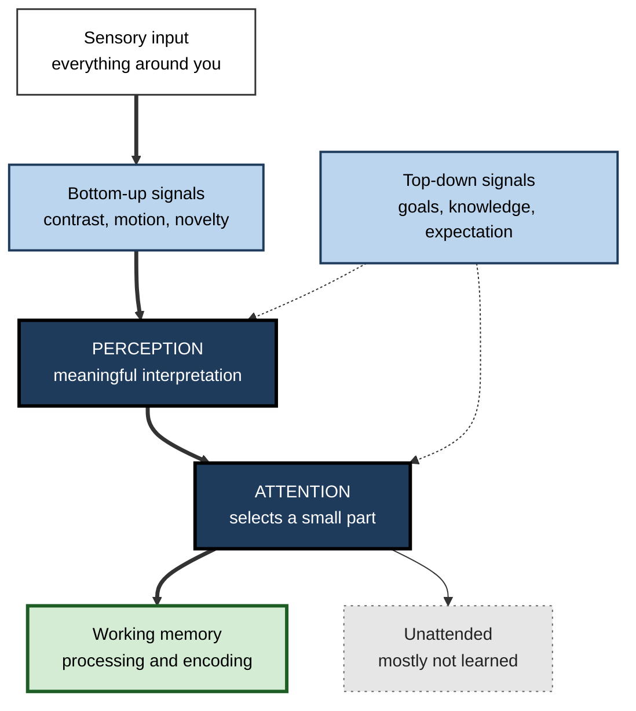
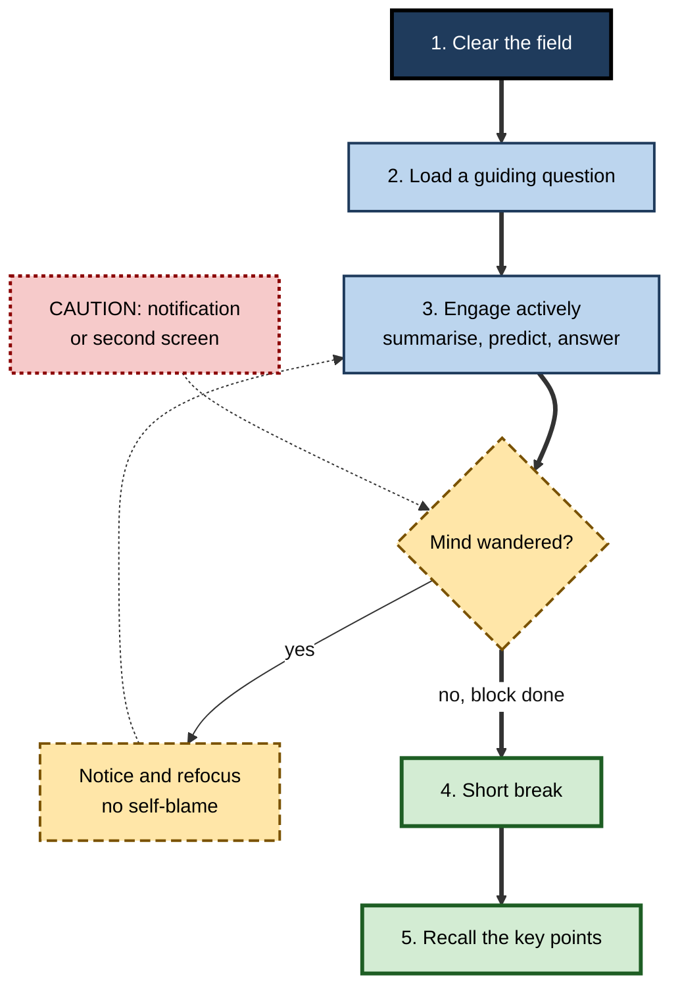

# B.3. Perception and Attention in Learning

> **In one sentence:** Perception is how your brain turns raw signals from the senses into meaningful experience, and attention is how it chooses the small part of that experience it will process further — together they decide what has any chance of being learned.
>
> **Why it matters:** Nothing is learned that is not first perceived and attended to. Most failed training, misread dashboards and "but I told them" moments are attention failures, and they are fixable by design.
>
> **Level span:** Novice → Expert · **Reading time:** ~17 min · **Builds on:** the information processing model; the idea that working memory is limited

---

## The Learning Ladder

| Level | Badge | After this level you can... |
|---|---|---|
| 1 | NOVICE | Explain why you cannot notice everything and why expectations shape what you see. |
| 2 | FOUNDATIONS | Use the terms bottom-up, top-down, selective, divided and sustained attention, and describe inattentional blindness. |
| 3 | PRACTITIONER | Design study sessions and learning materials that capture and hold attention on what matters. |
| 4 | ADVANCED | Explain filter, load and predictive models of attention and the evidence on multitasking and devices. |
| 5 | EXPERT / PRO | Engineer attention-aware training, interfaces and team norms, and judge attention claims critically. |

---

## Level 1 · Novice — The Big Picture

Your eyes, ears and skin receive far more information every second than your brain could ever fully process. **Perception** is the brain's job of making sense of these signals — turning patches of light into "a colleague waving at me", or sound waves into "my manager asking a question". **Attention** is the spotlight that picks which of those perceptions get deeper processing.

Think of a theatre stage at night. The whole stage is there, but only the actors in the spotlight are clearly seen by the audience. Attention is the spotlight operator. Learning only happens to what passes through the spotlight.

You have already experienced this when:

- you drove home and could not remember the journey — you perceived the road well enough to drive but did not attend to it in a way that formed memories;
- you read a page of a report and realised you took in nothing because you were thinking about something else;
- you spotted your own name instantly in a long document — your brain was primed for it.

The key idea for a beginner: **you do not see the world as it is; you see what your brain selects and interprets. Learning starts with controlling that selection.**

---

## Level 2 · Foundations — Core Concepts

### Perception is construction, not recording

Perception combines two flows:

- **Bottom-up processing** — driven by the incoming signal itself: brightness, movement, loudness, sudden change.
- **Top-down processing** — driven by what you already know, expect and want: your goals, prior knowledge and context.

This is why an experienced radiologist sees a tumour on a scan that a novice cannot, and why a typo in your own writing is hard to spot: your expectations fill in what "should" be there.

### Kinds of attention

| Kind | What it means | Learning example |
|---|---|---|
| **Selective attention** | Focusing on one source while ignoring others. | Following a lecture while ignoring a nearby conversation. |
| **Divided attention** | Trying to attend to more than one thing at once. | Watching a training video while answering chat messages. |
| **Sustained attention** (vigilance) | Maintaining focus over time. | Concentrating through a 50-minute problem set. |
| **Executive attention** | Controlling where attention goes and suppressing distraction. | Pulling yourself back after your mind wanders. |
| **Exogenous (captured) attention** | Attention grabbed by the environment. | A notification pop-up. |
| **Endogenous (directed) attention** | Attention you deliberately aim. | Looking for the error-handling section of a code file. |

**Figure B.3-1 — How perception and attention gate learning.**

*How to read it:* thick arrows are the main flow; dotted arrows show prior knowledge and goals shaping both perception and attention.

### Key terms

| Term | Plain meaning |
|---|---|
| **Perception** | The brain's interpretation of sensory signals into meaningful objects and events. |
| **Attention** | The selection of some information for deeper processing. |
| **Inattentional blindness** | Failing to notice something clearly visible because attention is elsewhere. |
| **Change blindness** | Failing to notice a change in a scene, especially across a cut or interruption. |
| **Cocktail party effect** | Picking out one voice — or your own name — in a noisy room. |
| **Mind wandering** | Attention drifting to unrelated thoughts during a task. |
| **Switch cost** | The time and accuracy lost when moving between tasks. |
| **Perceptual learning** | Long-term improvement in the ability to detect or discriminate sensory features through practice. |

---

## Level 3 · Practitioner — Putting It to Work

### The CLEAR attention routine for a study or training block

1. **Clear the field.** Phone in another room or face down with notifications off; one window; close chat. Research on laptops in lectures found that students who multitasked — and even those sitting near multitaskers with a view of their screen — learned less.
2. **Load a question.** Before reading or watching, write the question you want answered. A goal gives top-down attention something to search for.
3. **Engage actively every few minutes.** Pause to summarise, predict the next step, or answer a quick question. Active engagement reduces mind wandering, which tends to rise over the course of passive sessions.
4. **Alternate focus and recovery.** Use focused blocks with short breaks rather than marathon sessions; sustained attention fades over time.
5. **Review what you noticed.** End with a short unaided recall: what were the three most important points?

**Figure B.3-2 — The attention cycle in a focused study block.**

*How to read it:* the thick path is a successful block; the dotted loop is the normal process of noticing and returning from distraction.

### Worked example — designing a slide for a compliance module

| | Before | After |
|---|---|---|
| **Visual** | Stock photo of a handshake, logo, four bullet points of 25 words each. | One diagram of the decision path; the single rule in bold at the top. |
| **Narration** | Voice reads the bullets word for word. | Voice explains the diagram; on-screen text limited to labels. |
| **Signalling** | None. | Arrow and highlight on the step people most often get wrong. |
| **Check** | None. | A one-question scenario immediately after, repeated a week later. |

The "after" version removes competing attention demands (decorative image, duplicate text) and points attention at the decision that matters.

### Common mistakes at this level

- **Seductive details.** Interesting but irrelevant stories, images or animations attract attention and can reduce learning of the core content.
- **Reading slides aloud.** Identical spoken and written words compete rather than help.
- **Assuming silence equals attention.** People can look at a screen while their mind wanders.
- **Background media.** Lyrics and video in the background tax the same systems you need for language-heavy learning.
- **Over-alerting.** Too many highlights, colours and warnings and none of them stand out.

---

## Level 4 · Advanced — Mechanisms, Models & Evidence

### Classic models of attention

| Model | Core idea | Evidence and limits |
|---|---|---|
| **Early filter** (Broadbent, 1958) | Attention filters by physical features before meaning is analysed. | Explains dichotic listening results, but cannot explain why you notice your name in an unattended channel. |
| **Attenuation** (Treisman, 1960s) | Unattended input is turned down, not blocked; important items can still break through. | Explains the cocktail party effect. |
| **Late selection** (Deutsch and Deutsch) | All input is analysed for meaning; selection happens later. | Some meaning leaks through, but full analysis of everything is unlikely. |
| **Perceptual load theory** (Lavie) | When the main task is perceptually demanding, distractors are filtered early; when it is easy, spare capacity spills over to distractors. | Well supported; explains why easy, boring tasks are more distractible. |
| **Feature integration** (Treisman and Gelade, 1980) | Attention is needed to bind features such as colour and shape into objects. | Influential in visual search research. |
| **Predictive processing** | Attention increases the weight given to prediction errors from expected-to-be-reliable sources. | A unifying framework; still debated and hard to test decisively. |

### Inattentional and change blindness

In a famous 1999 study by Daniel Simons and Christopher Chabris, many viewers counting basketball passes failed to notice a person in a gorilla suit walking through the scene. Change blindness studies show that people often miss substantial changes across interruptions. The lesson for learning: **people notice what their current goal tells them to look for**, so learning materials must direct goals, not simply display information.

### Multitasking and devices

Evidence consistently shows that switching between tasks carries time and accuracy costs, and that divided attention during encoding reduces later memory. Classroom studies have found lower test performance for students who multitask on laptops, and lower performance for nearby students who can see their screens. Heavy media multitaskers tend to perform somewhat worse on some lab measures of attention, although the direction of cause is unclear and effects vary between studies. Research on the mere presence of a smartphone reducing cognitive capacity has produced mixed replication results, so treat strong claims cautiously; the effects of active use and notifications are more consistent.

The handwriting-versus-laptop note-taking story deserves special care. A widely cited 2014 study suggested longhand notes produce better conceptual learning because laptop users transcribe verbatim. Later direct replications found the advantage much smaller or not reliable. The safer conclusion is that **processing the content — summarising and connecting — matters more than the device**, while off-task device use clearly harms learning.

### Perceptual learning and expertise

Practice changes perception itself. Radiologists, pilots and chess players learn to see patterns novices miss. **Perceptual learning modules** — short, rapid classification exercises with feedback — have been used to accelerate pattern recognition in mathematics, aviation and medical image reading. Experts also direct attention differently: eye-tracking studies show they look sooner at task-relevant areas and spend less time on irrelevant ones.

### Attention is not the same as consciousness

People can attend to things they do not consciously report, and be aware of a scene without attending to details. For learning, the practical point is that conscious, goal-directed processing is what most reliably supports durable explicit knowledge.

---

## Level 5 · Expert / Pro — Professional Mastery

### Attention as a design constraint

Professionals treat attention as the scarcest resource in any learning or work system.

| Context | Attention-aware practice |
|---|---|
| Instructional design | Signalling, removing seductive details, segmenting video into short pieces, integrating text with diagrams. |
| Meetings and workshops | State the question upfront; ask for written individual answers before discussion; cap slide text. |
| Software teams | Protected focus time; batched notifications; clear incident alert thresholds to avoid alarm fatigue. |
| Dashboards and documentation | Visual hierarchy that makes the one critical number or step pop out. |
| Safety-critical work | Checklists and readbacks to counter inattentional blindness and expectation-driven errors. |

### Professional scenario

**Role:** Site reliability engineering lead.
**Situation:** On-call engineers miss a slowly rising error rate because the monitoring channel fires hundreds of low-value alerts daily; junior engineers do not "see" the signal during training drills.
**What the pro does:** Reduces alert volume by consolidating and raising thresholds (removing attention competition), adds a pattern-recognition drill in which juniors classify twenty historical graphs as "normal", "degrading" or "incident" with feedback (perceptual learning), and adds a readback step during incidents. Detection time in drills drops, and new engineers start naming patterns the seniors use.

### AI-era implications

- **Attention fragmentation.** AI chat windows, summaries and notifications can encourage rapid skimming. Summaries are useful for triage but are not a substitute for attending to material you must learn.
- **Automation complacency.** When a system is usually right, people monitor it less carefully. Training should include deliberately flawed AI outputs so learners keep checking.
- **Adaptive learning.** Platforms that detect disengagement (for example long idle times) can prompt re-engagement, but claims of "attention tracking" via webcams raise privacy and accuracy concerns.

### Ethical limits

Designers can easily exploit attention with variable rewards and alerts. In learning and work settings, the goal is directed, sustainable focus — not engagement metrics for their own sake.

---

## Myths vs. Evidence

| Myth | What the evidence shows |
|---|---|
| "Good multitaskers can learn while doing other things." | Task switching has costs; divided attention reduces encoding for almost everyone. |
| "Human attention span is now shorter than a goldfish's." | This popular statistic has no solid scientific source; attention depends heavily on task and motivation. |
| "If it is in front of them, they will see it." | Inattentional blindness shows people miss clearly visible things when attention is elsewhere. |
| "Handwritten notes are always better than laptop notes." | Replications weakened the original finding; processing depth and avoiding off-task use matter more. |
| "More colour and animation makes learning more engaging and effective." | Irrelevant attention-grabbing elements can reduce learning of core content. |
| "Background music helps everyone study." | Effects vary; music with lyrics often interferes with reading and verbal tasks. |

## Practitioner Toolkit

**Attention-ready learning checklist**

- [ ] Notifications off; one task, one window.
- [ ] A guiding question written before starting.
- [ ] Irrelevant decoration removed from materials.
- [ ] Key information signalled (arrows, bold, verbal cue).
- [ ] Text placed beside the visual it explains.
- [ ] Active response every few minutes.
- [ ] Session length matched to the task, with short breaks.
- [ ] Unaided recall at the end.

**Focus-block script (25–50 minutes)**

> "My question for this block is ___. Phone away, chat closed. Every ten minutes I will pause and write one sentence summarising what I just learned. At the end I will write the three main points from memory."

## Self-Check

1. **[NOVICE]** What is the difference between perception and attention?
2. **[NOVICE]** Why might you not remember a drive home?
3. **[FOUNDATIONS]** Give an example of top-down processing affecting what you see.
4. **[FOUNDATIONS]** What is inattentional blindness?
5. **[PRACTITIONER]** Name three changes to a slide that would reduce attention competition.
6. **[ADVANCED]** What does perceptual load theory predict about easy tasks?
7. **[ADVANCED]** What is the current evidence on handwriting versus laptop note-taking?
8. **[EXPERT / PRO]** How would you train new staff to detect subtle problems in monitoring data?
9. **[EXPERT / PRO]** Why should training include deliberately flawed AI outputs?

### Answer Key

1. Perception interprets sensory signals into meaningful experience; attention selects which of those perceptions are processed further.
2. You perceived enough to drive, but attention was elsewhere, so the journey was not encoded into memory.
3. Proofreading your own writing and missing a typo because you read what you expected to see.
4. Failing to notice a clearly visible object or event because attention is focused on something else.
5. Remove decorative images, avoid duplicating narration with on-screen text, add signalling to the key point, and place labels next to visuals.
6. Easy tasks leave spare perceptual capacity, so irrelevant distractors are more likely to be processed and to distract.
7. The original longhand advantage has not replicated reliably; deep processing and avoiding off-task use matter more than the device.
8. Use perceptual-learning drills — rapid classification of real examples with feedback — and reduce noise so the signal stands out.
9. To counter automation complacency and keep learners actively checking outputs rather than accepting them.

## Key Takeaways

- **Perception is constructed**, shaped by both the signal (bottom-up) and expectations (top-down).
- **Attention is the gate to learning** — unattended information is rarely learned.
- People routinely **miss visible things** when their goal points elsewhere.
- **Multitasking and off-task device use** reduce learning; the device itself matters less than how it is used.
- Good design **signals, simplifies and removes distractions**.
- **Perceptual learning** builds expert pattern recognition through rapid practice with feedback.
- In the AI era, protect focused attention and **train people to keep checking automated output**.

## Glossary

| Term | Meaning |
|---|---|
| Attention | The selection of information for further processing. |
| Bottom-up processing | Processing driven by the features of the incoming stimulus. |
| Change blindness | Missing changes in a visual scene. |
| Cocktail party effect | Selectively attending to one voice and noticing meaningful words elsewhere. |
| Divided attention | Attending to more than one task or source simultaneously. |
| Inattentional blindness | Failing to see an unexpected object when attention is engaged elsewhere. |
| Mind wandering | Shifts of attention to task-unrelated thoughts. |
| Perception | Interpreting sensory information into meaningful experience. |
| Perceptual learning | Practice-driven improvement in perceiving sensory distinctions. |
| Perceptual load | The amount of perceptual processing a task demands. |
| Seductive details | Interesting but irrelevant material that distracts from core learning. |
| Signalling | Cues that highlight the essential information. |
| Switch cost | The performance cost of switching between tasks. |
| Top-down processing | Processing guided by knowledge, expectations and goals. |
