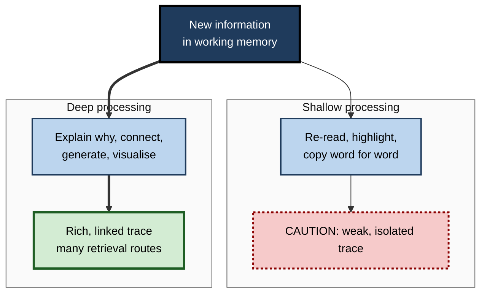
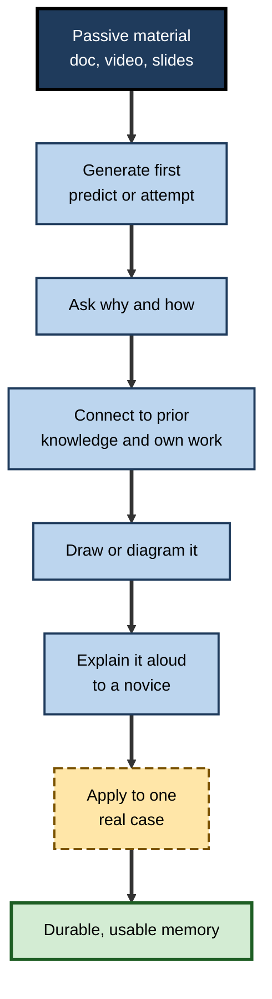

# B.4. Encoding: How We Store Information

> **In one sentence:** Encoding is the process of turning something you experience — a sentence, a diagram, a demonstration — into a memory trace your brain can keep, and how well you encode depends far more on what you *do* with information than on how long you look at it.
>
> **Why it matters:** Two people can sit through the same training for the same hour and leave with very different memories. The difference is mostly encoding. Professionals who encode deliberately learn faster, retain more and need fewer refreshers.
>
> **Level span:** Novice → Expert · **Reading time:** ~18 min · **Builds on:** the information processing model; attention as the gate to learning

---

## The Learning Ladder

| Level | Badge | After this level you can... |
|---|---|---|
| 1 | NOVICE | Explain why "just reading it again" stores so little and what stores more. |
| 2 | FOUNDATIONS | Name the main types of encoding and the classic effects that strengthen it. |
| 3 | PRACTITIONER | Turn any learning material into deep-encoding activities in minutes. |
| 4 | ADVANCED | Explain levels of processing, encoding specificity, transfer-appropriate processing and their limits. |
| 5 | EXPERT / PRO | Design training, documentation and AI-assisted study so that people encode what they need to use. |

---

## Level 1 · Novice — The Big Picture

Imagine writing on a beach. If you trace a word lightly with your finger, the next wave erases it. If you carve it deeply with a stick, and dig channels linking it to other words already there, it survives far longer. **Encoding** is how deeply — and how connectedly — your brain "carves" new information.

You have already experienced weak and strong encoding:

- You read a paragraph, reached the bottom and could not say what it was about. The words passed through your eyes but were barely encoded.
- You remember a story a colleague told you about a failed product launch far better than the bullet points in the post-mortem. Stories are rich in meaning, emotion and connections.
- You remember the route to a place you drove yourself much better than one where you were a passenger. Doing it yourself forced you to process it.

The key idea for a beginner: **you remember what you think about, not what you look at. The harder and more meaningfully you think about something while learning it, the better you store it.**

---

## Level 2 · Foundations — Core Concepts

### What encoding does

Encoding takes information held in working memory and builds a lasting representation in long-term memory. Encoding is the first of three memory processes — **encoding, storage, retrieval** — and it strongly limits the other two: what was never encoded cannot be stored or retrieved. (How fresh traces are stabilised afterwards, including during sleep, is the subject of consolidation, covered elsewhere in this map.)

### Types of encoding

| Type | What gets stored | Example | Typical durability |
|---|---|---|---|
| **Visual** | Appearance, layout | Where a figure was on the page | Moderate |
| **Acoustic** | Sound | The rhythm of a phone number | Short-lived alone |
| **Semantic** | Meaning | Why an index speeds up a query | Strong |
| **Self-referential** | Meaning linked to you | "This is like the outage I handled" | Very strong |
| **Motor / enactive** | Actions | Typing a command yourself | Strong for skills |

### The classic encoding effects

| Effect | What it shows | Status |
|---|---|---|
| **Levels of processing** | Thinking about meaning produces better memory than thinking about surface features. | Robust and widely replicated. |
| **Elaboration** | Adding details, explanations and connections improves memory. | Robust. |
| **Self-reference effect** | Relating material to yourself improves memory. | Robust. |
| **Generation effect** | Information you produce yourself (completing a word, solving a problem) is remembered better than information you read. | Robust; benefits depend on the material and the test. |
| **Production effect** | Saying words aloud improves memory compared with reading silently. | Reliable, mostly a modest effect. |
| **Dual coding** | Combining words with meaningful visuals gives two routes to memory. | Well supported for relevant visuals; not the same as "learning styles". |
| **Organisation** | Grouping material into categories or hierarchies aids memory. | Robust. |
| **Emotional enhancement** | Emotionally significant events are encoded more strongly. | Robust, but emotion can also narrow attention and distort details. |

**Figure B.4-1 — Shallow versus deep encoding.**

*How to read it:* the same information can take a shallow path (dotted outcome) or a deep path (thick arrows, solid outcome).

### Key terms

| Term | Plain meaning |
|---|---|
| **Encoding** | Converting experience into a lasting memory representation. |
| **Memory trace** | The stored representation left by encoding (also called an engram). |
| **Elaboration** | Enriching information with details, reasons and links to prior knowledge. |
| **Generation** | Producing information yourself rather than receiving it. |
| **Encoding specificity** | Memory works best when cues at retrieval match those present at encoding. |
| **Transfer-appropriate processing** | Memory is best when the kind of processing at learning matches the kind needed at test. |
| **Distinctiveness** | How much an item stands out from similar items, which aids later recall. |

---

## Level 3 · Practitioner — Putting It to Work

### The Deep-Encoding Conversion — six moves

Take any passive material (a document, a video, a slide deck) and convert it:

1. **Ask "why?" and "how?"** For each key point, write one sentence explaining why it is true or how it works (this is called **elaborative interrogation**).
2. **Explain it to someone else** — or to an imaginary novice — in plain words (**self-explanation**).
3. **Connect to what you know.** Write "This is like..." or "This differs from ... because...".
4. **Generate before you read.** Predict the answer or attempt the problem before looking at the solution.
5. **Draw it.** Turn a process into a quick sketch or flowchart; label it from memory.
6. **Use it immediately.** Apply the idea to one real case from your own work.

**Figure B.4-2 — Converting passive material into encoding activities.**

*How to read it:* each step adds processing; you do not need all six every time, but more meaningful steps mean stronger encoding.

### Worked example — a consultant learning a client's industry

| | Before | After |
|---|---|---|
| **Activity** | Reads a 40-page industry report, highlighting heavily. | Reads one section at a time; before each, predicts what it will say. |
| **Processing** | Highlights roughly a third of the text. | After each section writes three "why does this matter for the client?" answers. |
| **Connection** | None. | Compares the client's margin structure to a previous engagement. |
| **Output** | Highlighted PDF. | A one-page diagram of the value chain drawn from memory, then checked. |
| **Result in client meeting** | Vague recall; needs to look things up. | Discusses key drivers fluently and spots an inconsistency in client data. |

### Common mistakes at this level

- **Highlighting as a substitute for thinking.** It feels productive but adds little processing.
- **Copying notes verbatim.** Transcription bypasses meaning; summarising in your own words encodes more.
- **Elaborating too far from the point.** Elaboration helps only when it is relevant and accurate.
- **Skipping generation because it feels slow.** Generating, even unsuccessfully, often improves later learning of the correct answer, provided feedback follows.
- **Decorative visuals.** Dual coding helps when visuals represent the content; pretty but irrelevant images can distract.

---

## Level 4 · Advanced — Mechanisms, Models & Evidence

### Levels of processing and its critics

Fergus Craik and Robert Lockhart (1972) proposed that memory durability depends on **depth of processing**. In a classic follow-up, people judged words by their typeface, their rhyme or their meaning; meaning-based judgments led to much better recall. Critics pointed out that "depth" was hard to define independently of the memory result (a circularity problem). The idea survives in refined form: **semantic, elaborative and distinctive processing** reliably improve later memory.

### Encoding specificity and transfer-appropriate processing

Endel Tulving's **encoding specificity principle** (1973) states that a retrieval cue works to the extent that it overlaps with what was encoded. In a famous diving study, people remembered words better when tested in the same environment (underwater or on land) where they learned them. **Transfer-appropriate processing** (Morris, Bransford and Franks, 1977) generalised this: rhyme-based study beats meaning-based study on a rhyme test. "Deep" encoding is best *when the test also requires meaning*, which is true of most professional tasks.

Two consequences matter in practice:

- **Match learning to use.** If you must diagnose faults from symptoms, practise diagnosing from symptoms, not reading lists of faults.
- **Vary context for flexibility.** Context-dependent effects in real life are often modest, and learning in varied contexts reduces dependence on any one setting.

### Why generation and elaboration work

Generating an answer forces retrieval of related knowledge, creates distinctive processing, and builds links that serve as future retrieval routes. **Errorful generation** — guessing before being told — can improve learning of the correct answer when feedback follows quickly and the guess is meaningfully related. Elaboration and self-explanation work by integrating new information into existing knowledge structures, which is why learners with more prior knowledge benefit more from elaboration (the rich get richer).

### Neural basis, briefly

Encoding of new facts and events depends heavily on the **hippocampus** and surrounding medial temporal lobe, interacting with the **prefrontal cortex**, which supports organisation and semantic processing. Brain-imaging "subsequent memory" studies show that stronger activity in these regions during encoding predicts which items will later be remembered. Emotional arousal engages the amygdala, which modulates hippocampal encoding. These findings support, rather than replace, the behavioral principles.

### Boundary conditions

- **Prior knowledge matters.** Deep elaboration is harder for complete novices; they may need worked examples first.
- **Time on task is not the goal.** Deep strategies take longer per item; efficiency comparisons should account for time.
- **Distinctiveness requires a background.** An item stands out only against similar items; making everything "special" makes nothing distinctive.
- **Emotion is double-edged.** It strengthens central details and can weaken peripheral ones; stress at encoding can impair complex learning.

### What changed recently: encoding in the age of AI summaries

Generative AI can produce instant summaries, explanations and notes. These save time but can remove exactly the processing — summarising, explaining, organising — that drives encoding. Studies of AI-assisted writing published in 2025 reported that people who relied heavily on an AI assistant remembered and could quote less of their own work than those who wrote unaided; several of these studies are small or preprints, so the size of the effect is uncertain. The design principle is robust anyway: **if the AI does the processing, the AI gets the encoding benefit — not you.** Use AI-generated summaries as something to check your own summary against, not as a replacement.

---

## Level 5 · Expert / Pro — Professional Mastery

### Designing for encoding at scale

| Design decision | Weak encoding version | Strong encoding version |
|---|---|---|
| Onboarding documentation | Long reference pages | Short pages ending with "Explain this in your own words" prompts and a scenario |
| E-learning | Click-next slides with narration | Predict-then-reveal questions and branching scenarios |
| Technical training | Instructor live-codes, learners watch | Learners attempt first, then compare to instructor solution |
| Knowledge sharing | Recorded meeting archive | Short written decision records explaining *why* |
| AI tutor | Gives answers and summaries | Asks the learner to explain, then critiques and adds missing links |

### Professional scenario

**Role:** Learning experience designer at a software company.
**Situation:** A new security-awareness module has high completion but phishing simulation click rates have not changed.
**What the pro does:** Diagnoses shallow encoding — the module presents rules learners merely read. The redesign opens with a realistic suspicious email and asks learners to decide and justify ("generate"), then shows the expert reasoning (elaboration and feedback). Each rule is tied to a real incident from the company (self-reference and distinctiveness). Learners practise on varied email examples (transfer-appropriate processing). Over the following quarter the simulated phishing click rate falls, and the module is shorter than before.

### Expert-level judgement

- **Encode for the retrieval situation.** Ask "where and how will they need this?" and make encoding resemble it.
- **Prefer "less but deeper".** Cut content to make room for processing activities; coverage is not learning.
- **Build on prior knowledge.** Start from what learners already know so new material has hooks.
- **Measure encoding indirectly.** The best evidence is delayed, unaided use; in-session engagement metrics are weak proxies.
- **Respect cognitive effort.** Deep processing is effortful; budget time for it and explain why it is worth it.

---

## Myths vs. Evidence

| Myth | What the evidence shows |
|---|---|
| "Reading something several times stores it." | Repeated passive reading yields small gains compared with generating, explaining or self-testing. |
| "Highlighting helps you remember." | Highlighting is rated low utility in major reviews; it rarely adds deep processing. |
| "You learn best in your preferred sensory style." | Matching modality to preference does not improve learning; matching modality to content does. |
| "Making a mistake while learning will stick the wrong answer in your head." | Errors followed by corrective feedback often improve learning of the right answer. |
| "Context-dependent memory means you must study where you are tested." | Real-world context effects are often small; varied practice and good cues matter more. |
| "AI summaries make learning faster with no downside." | They save time but skip the processing that builds memory unless you do your own summarising too. |

## Practitioner Toolkit

**Deep-encoding checklist for any study session**

- [ ] I predicted or attempted something before reading the answer.
- [ ] I wrote "why" or "how" explanations for key points.
- [ ] I linked new ideas to something I already know.
- [ ] I drew or organised the material myself.
- [ ] I explained it aloud in plain words.
- [ ] I applied it to a real example from my work.
- [ ] I compared my own summary with the source (or an AI summary) afterward, not before.

**Template — elaboration card**

| Key idea | Why is it true? | What is it like? | How is it different from...? | Where would I use it? |
|---|---|---|---|---|
| | | | | |

## Self-Check

1. **[NOVICE]** Why does re-reading tend to store little?
2. **[NOVICE]** Give one everyday example of strong encoding.
3. **[FOUNDATIONS]** What is the generation effect?
4. **[FOUNDATIONS]** Name three types of encoding and say which is usually most durable.
5. **[PRACTITIONER]** Convert "Read the API documentation" into three deep-encoding activities.
6. **[ADVANCED]** What criticism was made of levels of processing?
7. **[ADVANCED]** Explain transfer-appropriate processing with an example.
8. **[EXPERT / PRO]** Why can AI-generated summaries undermine encoding, and how can you use them safely?
9. **[EXPERT / PRO]** A module has high completion but no behavior change. How would you redesign it for encoding?

### Answer Key

1. It involves little meaningful processing and creates familiarity rather than strong, connected traces.
2. Remembering a vivid story or a route you navigated yourself.
3. Information you produce yourself is remembered better than information you simply read.
4. Visual, acoustic, semantic (also self-referential and motor); semantic and self-referential encoding are usually most durable.
5. For example: predict what an endpoint returns before reading; explain in your own words why authentication works as it does; write a small call from memory and compare to the docs.
6. "Depth" was defined circularly — deep processing was inferred from good memory, which was then explained by depth.
7. Memory is best when the processing at learning matches the processing at test; for example, practising diagnosing faults from symptoms prepares you for real diagnosis better than memorising fault lists.
8. They do the summarising and organising for you, removing the processing that builds memory. Write your own summary first, then use the AI version as a check.
9. Begin with realistic decisions learners must make and justify, give expert feedback, tie rules to real cases, and practise on varied examples resembling the job.

## Key Takeaways

- **Encoding** turns experience into memory; you remember what you *think about*.
- **Meaning, elaboration, generation and self-reference** produce stronger traces than repetition.
- **Encoding should match use**: practise in the form you will need it.
- **Errors with feedback** can help, not harm.
- **Relevant visuals** plus words give two routes to memory; decoration does not.
- In the AI era, **do your own processing first** and use AI output as a comparison.
- Design for **less content, more processing**.

## Glossary

| Term | Meaning |
|---|---|
| Dual coding | Representing information both verbally and visually. |
| Elaboration | Adding meaningful details and connections to new information. |
| Elaborative interrogation | Asking and answering "why" questions about facts. |
| Encoding | The process of forming a memory representation. |
| Encoding specificity | Retrieval is best when cues match the conditions of encoding. |
| Engram | The physical trace of a memory in the brain. |
| Generation effect | Better memory for self-produced information. |
| Levels of processing | The theory that deeper, meaning-based processing produces more durable memory. |
| Production effect | Better memory for words read aloud than silently. |
| Self-explanation | Explaining material to yourself as you study it. |
| Self-reference effect | Better memory for information related to oneself. |
| Transfer-appropriate processing | Memory is best when study processing matches test processing. |
