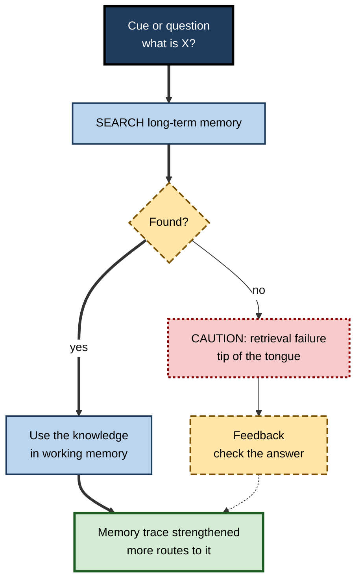
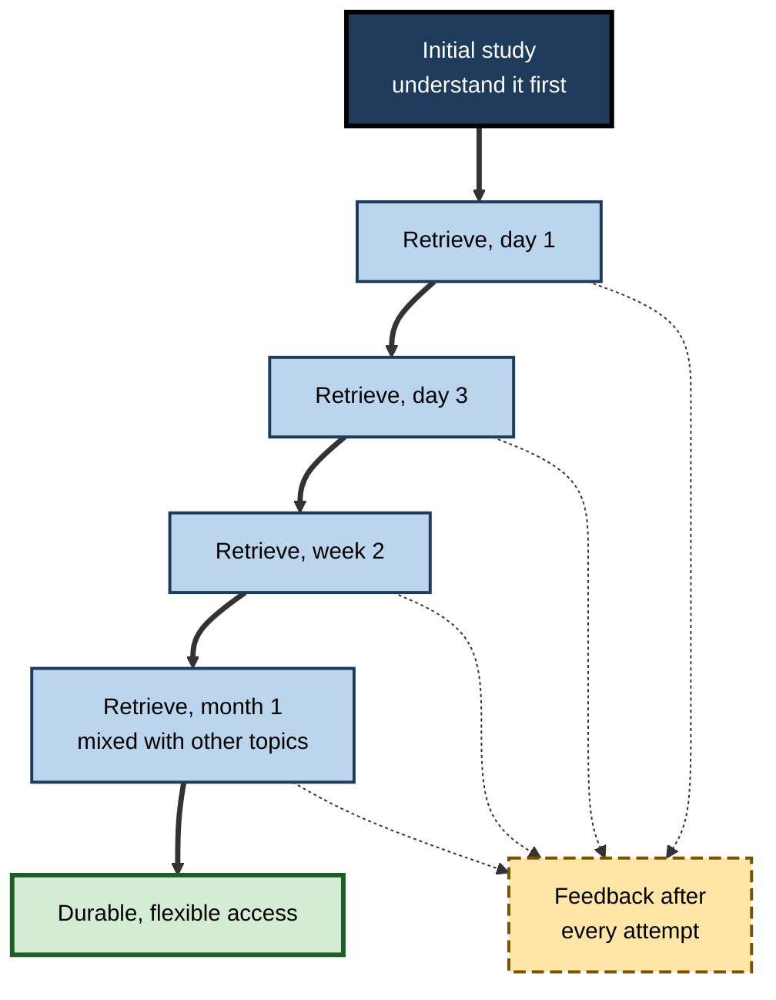
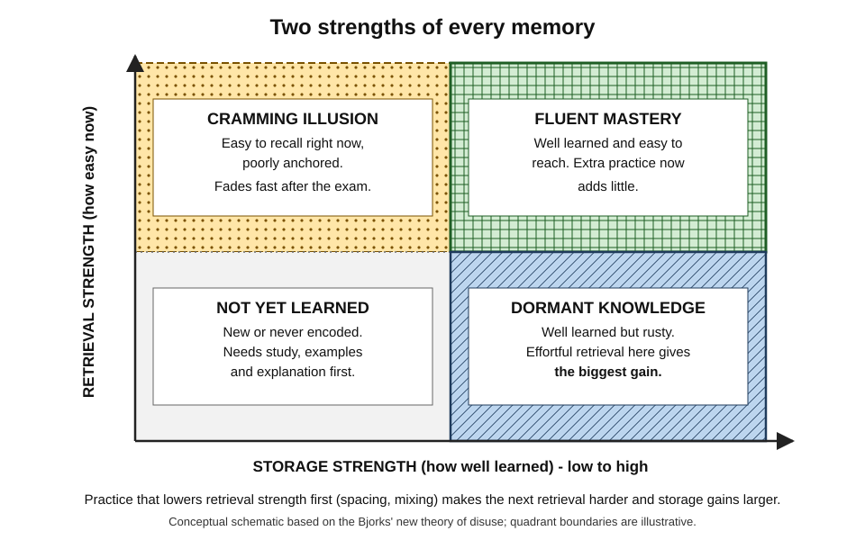

# B.5. Retrieval: Accessing Stored Knowledge

> **In one sentence:** Retrieval is the act of pulling knowledge out of long-term memory when you need it — and, surprisingly, every successful act of retrieval also strengthens that memory, making retrieval one of the most powerful learning tools known.
>
> **Why it matters:** Knowledge you cannot retrieve at the right moment — in an interview, during an incident, in front of a client — is practically useless. Training retrieval, not just input, is what turns "I studied it" into "I can use it".
>
> **Level span:** Novice → Expert · **Reading time:** ~18 min · **Builds on:** encoding; the information processing model

---

## The Learning Ladder

| Level | Badge | After this level you can... |
|---|---|---|
| 1 | NOVICE | Explain why you sometimes "know" something but cannot recall it, and why testing yourself helps. |
| 2 | FOUNDATIONS | Distinguish recall from recognition, explain retrieval cues, and describe the testing effect. |
| 3 | PRACTITIONER | Build a retrieval practice routine with feedback and spacing. |
| 4 | ADVANCED | Explain storage versus retrieval strength, retrieval-induced forgetting, reconsolidation and the evidence base. |
| 5 | EXPERT / PRO | Design retrieval-based learning systems and assessments for teams, including AI-assisted ones. |

---

## Level 1 · Novice — The Big Picture

Imagine a huge library with no catalogue. All the books are there, but if you cannot find the one you need, it does not help you. **Retrieval** is the mind's librarian: given a question or a situation, it searches memory and brings back the relevant knowledge.

Two surprising facts make retrieval special:

1. **Memories can be stored but not found.** The "tip-of-the-tongue" feeling — you know a colleague's name starts with "S" but it will not come — shows the memory is there; the route to it is temporarily blocked.
2. **Finding a memory makes it easier to find next time.** Each time the librarian fetches a book, they remember the shelf better. This is why **testing yourself is not just measuring learning — it creates learning.**

You have already experienced this when:

- you remembered a password perfectly after typing it daily, but forgot an old one you had not used for months;
- a smell or a song suddenly brought back a memory you had not thought of in years (a **retrieval cue**);
- you recognised the right answer on a multiple-choice test but could not have produced it on a blank page.

The key idea for a beginner: **practise getting knowledge out, not only putting it in.**

---

## Level 2 · Foundations — Core Concepts

### Recall versus recognition

| Kind of retrieval | What you do | Everyday example | Difficulty |
|---|---|---|---|
| **Free recall** | Produce information with no cues. | Writing down everything you remember from a meeting. | Hardest |
| **Cued recall** | Produce information given a hint. | Remembering a name when told the first letter. | Medium |
| **Recognition** | Identify information when you see it. | Choosing the right option in a multiple-choice quiz. | Easiest |
| **Relearning (savings)** | Learn something again faster than the first time. | Picking up a language you studied years ago. | Detects even "forgotten" knowledge |

### Retrieval cues

A **retrieval cue** is anything that helps access a memory: a question, a keyword, a place, a mood, a smell. Cues work best when they match how the information was encoded. Well-organised knowledge, with many links, provides many routes and therefore many possible cues.

### The testing effect

The **testing effect** (also called the **retrieval practice effect**) is the finding that practising retrieval produces better long-term retention than spending the same time re-studying. It is one of the most replicated findings in learning science, supported by hundreds of experiments, multiple meta-analyses and classroom studies from primary school to medical training.

**Figure B.5-1 — Retrieval as both access and strengthening.**

*How to read it:* successful retrieval both delivers knowledge and strengthens it (thick path); failed retrieval followed by feedback can still strengthen learning (dotted arrow).

### Key terms

| Term | Plain meaning |
|---|---|
| **Retrieval** | Accessing information stored in long-term memory. |
| **Retrieval cue** | A hint or context that helps bring back a memory. |
| **Testing effect** | Retrieving information improves later retention more than restudying. |
| **Tip-of-the-tongue state** | Feeling sure you know something but being unable to retrieve it right now. |
| **Retrieval failure** | Being unable to access a stored memory, as opposed to it being lost. |
| **Savings** | Faster relearning of something previously learned, revealing hidden memory. |
| **Free recall** | Retrieving information without cues. |

---

## Level 3 · Practitioner — Putting It to Work

### The Retrieval Practice Routine

1. **Close the source.** Notes, slides, AI and search all closed.
2. **Retrieve.** Choose a method: write everything you remember about a topic (a "brain dump"), answer self-made questions, explain aloud, or solve a problem from scratch.
3. **Check with feedback.** Open the source and compare. Mark what you missed or got wrong.
4. **Correct and elaborate.** Fix errors and add a note on *why* the right answer is right.
5. **Space the next attempt.** Repeat after a delay — tomorrow, then in a few days, then a week or more. Spacing makes each retrieval harder and more beneficial.
6. **Mix it up.** Once basics are solid, combine topics in one session so you practise choosing which knowledge to retrieve.

**Figure B.5-2 — A retrieval practice cycle with spacing.**

*How to read it:* the thick path shows widening intervals between retrievals; every attempt gets feedback (dotted arrows). Intervals are examples, not fixed rules.

### Worked example — a sales engineer learning a product's technical specifications

| | Before | After |
|---|---|---|
| **Method** | Re-reads the 30-page spec sheet three times the night before a demo. | Makes 25 question cards ("What is the max throughput of tier 2?"); answers them cold. |
| **Schedule** | One night. | Days 1, 3 and 8, then a mixed review before each demo. |
| **Feedback** | None. | Checks each answer; rewrites cards she missed with a reason. |
| **In the demo** | Freezes on an unexpected question; promises to "follow up". | Answers fluidly; uses retrieval of related specs to reason about an edge case. |

### Common mistakes at this level

- **Peeking too early.** Looking at the answer before genuinely trying removes the benefit.
- **Only using recognition.** Multiple-choice questions are easier; mix in free recall and short-answer questions.
- **No feedback.** Without correction, errors can be reinforced. A 2024 analysis of classroom retrieval practice found benefits disappeared in a specific combination: classroom setting, multiple-choice questions, and no feedback.
- **Retrieval only once.** One test helps; spaced repeated retrieval helps much more.
- **Retrieving before understanding.** Retrieval strengthens what is there; make sure you first understood the material.

---

## Level 4 · Advanced — Mechanisms, Models & Evidence

### Storage strength and retrieval strength

Robert and Elizabeth Bjork's **new theory of disuse** (1992) proposes that every memory has two independent strengths:

- **Storage strength** — how well learned and interconnected it is. It only accumulates; it does not decay.
- **Retrieval strength** — how accessible it is right now. It rises with recent use and falls with disuse and interference.

The critical claim: **the lower the retrieval strength at the moment you successfully retrieve, the larger the gain in storage strength.** This explains why spaced, effortful retrieval beats immediate, easy repetition, and why cramming feels effective (high retrieval strength now) but fails later (low storage strength).

*Figure B.5-3 — Storage strength versus retrieval strength.* The four quadrants show the states a memory can be in. Dotted-pattern quadrant: the cramming illusion. Hatched quadrant: dormant knowledge, where retrieval practice yields the largest gain.

### How strong is the evidence?

Meta-analyses across the last decade consistently find a moderate-to-large advantage for retrieval practice over restudy, across materials (word lists, texts, diagrams, procedures), ages and settings. Benefits are generally larger with feedback, with spaced retrieval and with longer retention intervals. Recent work (2024–2025) has refined the picture:

- In mathematics, meta-analytic reviews find benefits for spacing and retrieval, though effects vary with problem type.
- Classroom "single-paper meta-analyses" across multiple STEM courses found smaller and more variable effects than lab studies, and identified conditions where benefits vanished.
- **Forward testing effects**: retrieving earlier material can improve learning of *new* material that follows, possibly by reducing interference and keeping learners engaged.
- **Transfer**: retrieval practice improves application to new questions more reliably when practice questions require the same kind of reasoning as the final task.

### Why retrieval strengthens memory

Several mechanisms are proposed and likely work together:

- **Elaborative retrieval** — searching memory activates related information, adding new links.
- **Episodic context** — each retrieval adds a new context to the memory, creating more routes back.
- **Error correction** — retrieval exposes gaps, and feedback repairs them.
- **Metacognitive calibration** — testing shows what you actually know, improving study decisions.
- **Reconsolidation** — retrieved memories become temporarily modifiable and are re-stored, which can strengthen or update them (and also introduce distortions).

### Retrieval-induced forgetting and other side-effects

Retrieving some items from a category can temporarily make related, unpractised items harder to recall — **retrieval-induced forgetting** (Michael Anderson and colleagues, 1994). In practice this argues for retrieving across the whole of a topic rather than only favourite parts. Retrieval can also **reinforce errors** if no feedback follows, and memory for events can be altered by misleading questions during retrieval (a well-studied concern in eyewitness testimony).

### Test anxiety

A common worry is that frequent testing raises anxiety. Evidence from classroom studies generally suggests that frequent, **low-stakes** retrieval practice reduces rather than increases test anxiety for most students, because tests become familiar and learners feel better prepared. High-stakes framing can undermine this.

---

## Level 5 · Expert / Pro — Professional Mastery

### Retrieval-centred design

| Context | Retrieval-centred practice |
|---|---|
| Corporate L&D | Short spaced quizzes after training (often via chat or mobile "nudges") with feedback; scenario questions over definitions. |
| Medical and safety training | Simulation drills that require recalling procedures under realistic conditions. |
| Software teams | "Explain-back" in code review; incident retrospectives where participants reconstruct the timeline before seeing logs. |
| Sales enablement | Role-play objections without scripts; spaced product quizzes. |
| Certifications | Practice exams with explanations, spaced across weeks rather than crammed. |

### Assessment and retrieval

Every assessment is a retrieval event and therefore a learning event. Experts design assessments to **require the retrieval the job requires**: if technicians must diagnose from symptoms, the assessment presents symptoms, not a list of fault names to recognise.

### Professional scenario

**Role:** Enablement manager at a cloud software company.
**Situation:** After a product launch, customer-facing staff passed the end-of-course quiz (recognition, open book) at 95%, yet support escalations show they cannot explain new pricing tiers to customers.
**What the pro does:** Replaces the single quiz with five short scenario prompts delivered over four weeks ("A customer with 300 users asks whether tier 2 includes SSO — explain"). Answers are free-text, scored with a rubric and returned with model answers. A retrieval-based role-play is added to team meetings. Escalations on pricing drop, and the manager tracks retrieval accuracy at week four as the key metric.

### AI-era implications

- **AI as quiz generator.** Language models can rapidly generate retrieval questions from documentation, saving designers time. Questions must be checked for accuracy and should require reasoning, not just recognition.
- **AI as answer source.** Asking an AI first removes the retrieval attempt. A good rule: retrieve first, then use AI to check and extend.
- **Spaced-repetition software** schedules retrieval using algorithms based on predicted forgetting; modern schedulers model memory stability and difficulty per item.

### Expert-level judgement

- **Count retrieval attempts, not page views.** They are the active ingredient.
- **Feedback is not optional.** Especially for multiple-choice and for novices.
- **Retrieve broadly.** Cover the whole domain to avoid retrieval-induced forgetting of neglected parts.
- **Low stakes, high frequency.** Separate practice retrieval from high-stakes evaluation.

---

## Myths vs. Evidence

| Myth | What the evidence shows |
|---|---|
| "Tests only measure learning." | Tests also cause learning; retrieval practice beats restudying for long-term retention. |
| "If I can't recall it, it's gone." | Much forgetting is retrieval failure; cues and relearning savings reveal stored memories. |
| "Recognising the answer means I know it." | Recognition is easier than recall; it overestimates what you can produce unaided. |
| "Frequent quizzes make people anxious." | Low-stakes retrieval practice tends to reduce test anxiety for most learners. |
| "Retrieval practice is just rote memorisation." | It supports understanding and transfer, especially with application-type questions. |
| "Easy retrieval is better retrieval." | Effortful but successful retrieval after a delay produces larger long-term gains. |

## Practitioner Toolkit

**Retrieval practice checklist**

- [ ] I understood the material before testing myself.
- [ ] Sources closed during retrieval.
- [ ] I used free recall or short answers, not only multiple choice.
- [ ] I checked every answer and corrected errors.
- [ ] My next retrieval is scheduled after a delay.
- [ ] I covered the whole topic, not only the parts I like.
- [ ] Later sessions mix topics.

**Template — brain-dump sheet**

| Topic | Date | Everything I recalled (no notes) | Missed or wrong | Next retrieval date |
|---|---|---|---|---|
| | | | | |

## Self-Check

1. **[NOVICE]** Why is testing yourself a learning activity and not just a measurement?
2. **[NOVICE]** What does a tip-of-the-tongue experience reveal about memory?
3. **[FOUNDATIONS]** Rank free recall, cued recall and recognition from hardest to easiest.
4. **[FOUNDATIONS]** What is a retrieval cue? Give a workplace example.
5. **[PRACTITIONER]** Describe a five-step retrieval routine for learning a new API.
6. **[ADVANCED]** Explain storage strength and retrieval strength, and why spaced retrieval works.
7. **[ADVANCED]** What is retrieval-induced forgetting and how should it affect practice?
8. **[EXPERT / PRO]** Under what conditions did classroom retrieval practice fail to help in recent research?
9. **[EXPERT / PRO]** How would you redesign an open-book recognition quiz to build usable knowledge?

### Answer Key

1. Successful retrieval strengthens the memory and adds retrieval routes; it also reveals gaps for repair.
2. The memory is stored but temporarily inaccessible; it is a retrieval failure, not a storage failure.
3. Free recall (hardest), cued recall, recognition (easiest).
4. A hint or context that triggers a memory; for example, an error code that reminds you of a past incident's fix.
5. Close the docs; write calls from memory; check against the docs; correct with reasons; repeat after spaced delays, mixing with other topics.
6. Storage strength is how well learned something is; retrieval strength is how accessible it is now. Retrieving when retrieval strength has dropped produces bigger storage gains, so spacing helps.
7. Practising some items can temporarily suppress related unpractised items; practise across the whole topic.
8. When used in a classroom, with multiple-choice questions and without feedback.
9. Make it closed-book, scenario-based and free-response, spaced over weeks, with feedback and model answers.

## Key Takeaways

- **Retrieval is how knowledge becomes usable**, and every successful retrieval strengthens memory.
- The **testing effect** is among the most robust findings in learning science.
- **Recall beats recognition** for building and showing knowledge.
- **Storage and retrieval strength differ**; effortful retrieval after a delay produces the largest gains.
- **Feedback, spacing and coverage** maximise benefits and avoid side-effects.
- **Retrieve first, then check** — including when AI is available.

## Glossary

| Term | Meaning |
|---|---|
| Cued recall | Retrieval prompted by a partial hint. |
| Forward testing effect | Retrieval of earlier material improving learning of new material. |
| Free recall | Retrieval without cues. |
| New theory of disuse | The Bjorks' model distinguishing storage strength and retrieval strength. |
| Recognition | Identifying previously encountered information. |
| Reconsolidation | Re-stabilisation of a memory after retrieval, during which it can be modified. |
| Retrieval cue | A stimulus that helps access a memory. |
| Retrieval-induced forgetting | Reduced recall of related items caused by retrieving others. |
| Retrieval practice | Deliberately recalling information to strengthen memory. |
| Retrieval strength | Current accessibility of a memory. |
| Savings | Faster relearning showing residual memory. |
| Storage strength | How well learned and interconnected a memory is. |
| Testing effect | The retention advantage of retrieval over restudy. |
| Tip-of-the-tongue | Temporary inability to retrieve a known item. |
