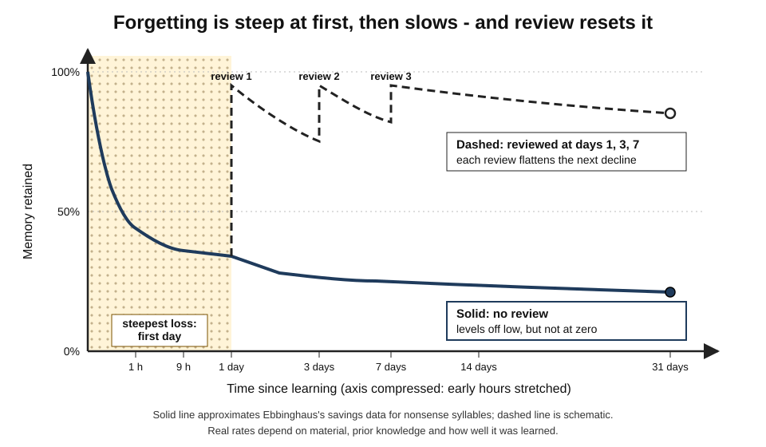
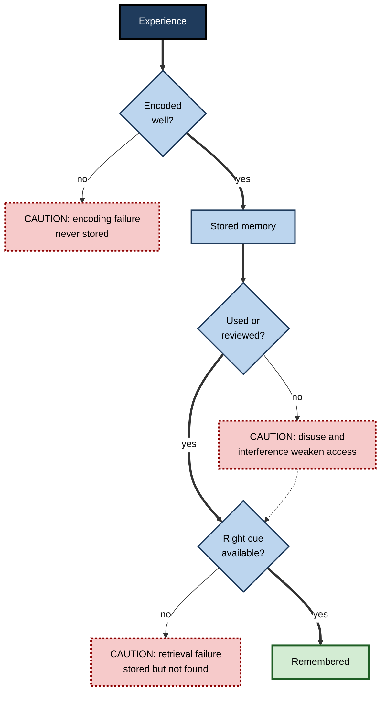
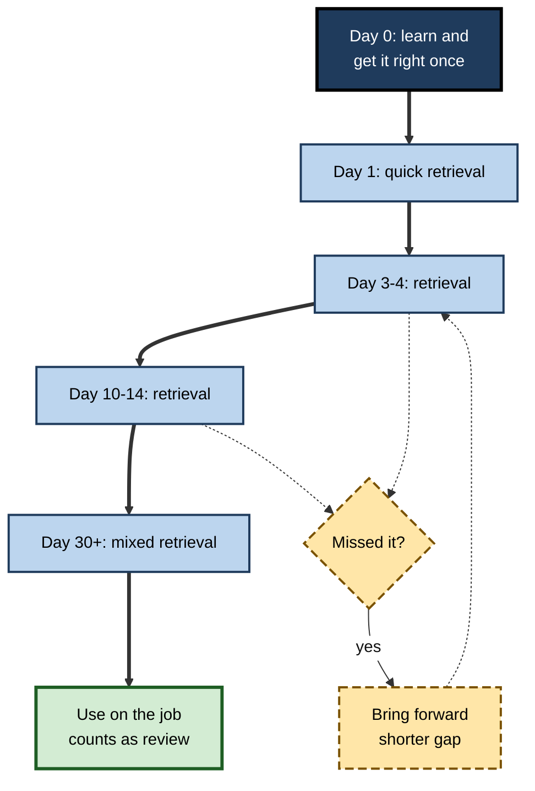

# B.6. Forgetting and the Forgetting Curve

> **In one sentence:** Forgetting is the loss of access to things we once learned; it happens fastest right after learning and then slows down, a pattern known as the forgetting curve — and well-timed review can flatten it dramatically.
>
> **Why it matters:** Most organisations spend heavily on training and then let the forgetting curve quietly erase much of the investment. Understanding why and when people forget lets you schedule review, design refreshers and decide what is worth keeping in memory at all.
>
> **Level span:** Novice → Expert · **Reading time:** ~18 min · **Builds on:** encoding and retrieval; storage versus retrieval strength

---

## The Learning Ladder

| Level | Badge | After this level you can... |
|---|---|---|
| 1 | NOVICE | Describe the shape of forgetting and why reviewing helps. |
| 2 | FOUNDATIONS | Explain Ebbinghaus's experiment, the savings method, and the main causes of forgetting. |
| 3 | PRACTITIONER | Build a spaced-review schedule for yourself or a team. |
| 4 | ADVANCED | Discuss the mathematics of forgetting, interference, the spacing effect evidence and why forgetting is useful. |
| 5 | EXPERT / PRO | Design reinforcement programmes, tooling and metrics that counter forgetting at organisational scale. |

---

## Level 1 · Novice — The Big Picture

You attend a fascinating two-day workshop. On the train home you could recite most of it. A week later, you remember the main idea and a few examples. A month later, you remember that it was "really good". That steep-then-gentle slide is the **forgetting curve**.

Think of a footprint in wet sand. Right after you step, it is crisp. Within minutes, the edges blur fast. After that, what remains of the print changes slowly. If you step in the same place again before the print disappears, the impression becomes deeper and lasts longer each time. Review works the same way.

You have already experienced this when:

- you forgot most of a course you passed at university, yet relearned it far faster when your job required it;
- you remembered your old phone number years after changing it because you used it thousands of times;
- you forgot a new colleague's name minutes after being introduced because you never used it.

The key idea for a beginner: **forgetting is normal and predictable. The cure is not to study longer once, but to come back to the material at the right moments.**

---

## Level 2 · Foundations — Core Concepts

### Ebbinghaus and the savings method

In the 1880s the German psychologist Hermann Ebbinghaus ran the first careful experiments on memory — on himself. He memorised lists of **nonsense syllables** (such as "DAX" or "BOK") to avoid prior associations, then measured how much time he **saved** when relearning a list after delays from 20 minutes to 31 days. The **savings method** is clever: even when you cannot recall anything, faster relearning shows that something remained.

His results, published in 1885, showed rapid loss within the first hour and day, followed by a much slower decline. In 2015, Jaap Murre and Joeri Dros published a careful replication: one participant spent about 70 hours learning and relearning lists at the same intervals, and the curve closely matched Ebbinghaus's — with a small upward bump around 24 hours that the authors suggested may reflect sleep-related consolidation.

*Figure B.6-1 — The forgetting curve with and without spaced review.* Solid line: approximate Ebbinghaus savings, falling steeply then levelling off. Dashed line: schematic retention when material is reviewed at days 1, 3 and 7. The time axis is compressed so the first hours are visible.

### Why we forget — five main causes

| Cause | What happens | Example |
|---|---|---|
| **Encoding failure** | It was never properly stored. | You never noticed the colleague's name — you were planning what to say. |
| **Decay / disuse** | Access weakens with time and lack of use. | Formulas from a course you never used again. |
| **Interference** | Similar memories compete. **Proactive**: old blocks new. **Retroactive**: new blocks old. | Typing an old password; mixing up two programming languages' syntax. |
| **Retrieval failure** | The memory exists but the cue does not reach it. | Remembering an answer only after leaving the exam. |
| **Motivated forgetting** | Unpleasant or unwanted memories are suppressed or avoided. | Vague memories of an embarrassing presentation. |

**Figure B.6-2 — Paths to forgetting.**

*How to read it:* forgetting can happen at encoding, during storage, or at retrieval. Dotted-border boxes are failure points; the dotted arrow shows that weakened memories can still be retrieved with a good cue.

### Key terms

| Term | Plain meaning |
|---|---|
| **Forgetting curve** | A graph showing how memory declines over time after learning. |
| **Savings** | The reduction in time needed to relearn something, showing residual memory. |
| **Interference** | Competition between similar memories that impairs recall. |
| **Proactive interference** | Older learning disrupts recall of newer learning. |
| **Retroactive interference** | Newer learning disrupts recall of older learning. |
| **Spacing effect** | Learning spread over time is retained better than the same amount massed together. |
| **Overlearning** | Continuing practice beyond the point of first correct recall. |
| **Permastore** | Knowledge that, after an initial decline, remains stable for decades. |

---

## Level 3 · Practitioner — Putting It to Work

### Building a spaced-review schedule

1. **Learn it properly first.** Understand the material and get it right once. Spacing cannot rescue something never encoded.
2. **First review within a day.** The steepest loss is early; a quick retrieval the next day catches most of it.
3. **Expand the gaps.** Review again after a few days, then a week or two, then a month. A useful heuristic from large spacing studies: for a retention goal of months, gaps of roughly a week or more between later sessions work well; the best gap grows with how long you need to remember.
4. **Review by retrieving.** Each review is a self-test, not a re-read.
5. **Adjust per item.** Items you miss come back sooner; easy items go further out. Spaced-repetition software automates this.
6. **Stop reviewing what you use daily.** Real use is review.

**Figure B.6-3 — An expanding review schedule.**

*How to read it:* the thick path is the default expanding schedule; dotted arrows show items you miss returning sooner.

### Worked example — a team adopting a new incident-response process

| | Before | After |
|---|---|---|
| **Training** | One three-hour session at launch. | One 90-minute session plus four 10-minute refreshers. |
| **Reinforcement** | A PDF on the wiki. | Scenario questions in team chat at days 2, 7, 21 and 60. |
| **Practice** | First real incident months later. | A 20-minute tabletop drill at week 6. |
| **Result at first real incident** | Team improvises; key notification steps skipped. | Roles assigned within minutes; notification checklist followed. |

### Common mistakes at this level

- **Spacing without retrieval.** Re-reading at intervals helps less than testing at intervals.
- **Waiting too long for the first review.** Most loss happens early.
- **Reviewing everything equally.** Focus reviews on items that are both important and fragile.
- **Treating forgetting as failure.** Forgetting followed by successful effortful retrieval is when learning grows most.
- **Ignoring interference.** Learning two similar systems back-to-back invites confusion; contrast them explicitly.

---

## Level 4 · Advanced — Mechanisms, Models & Evidence

### The shape of forgetting

Forgetting is not a straight line. Across many datasets it is well described by a **power function** (or a sum of exponentials): rapid early loss that steadily decelerates. An important implication is **Jost's law** — of two memories of equal strength, the older one decays more slowly. Older memories that survive tend to be more stable, which helps explain why long-term knowledge, once well established, can last decades.

Harry Bahrick's studies of people who learned Spanish in school found that retention dropped over the first few years and then stayed roughly stable for decades — the **permastore**. How much reached permastore depended on how well and how long it was originally learned and spaced.

### Caution about the original numbers

Ebbinghaus studied nonsense syllables, in one person, measured by savings. Meaningful, well-understood material — concepts, principles, skills — is forgotten much more slowly. Popular claims such as "people forget 70% of training within 24 hours" or "90% within a week" are frequently attributed to Ebbinghaus but do not come from data on meaningful workplace learning. The *shape* of the curve generalises well; the specific percentages do not.

### Interference versus decay

Early twentieth-century research showed that sleeping after learning led to better retention than staying awake, which suggested **interference** from daytime experiences matters, not just time passing. Modern work adds that sleep actively supports consolidation. Most researchers now see forgetting as a combination of interference, weakened retrieval access and (for some memories) genuine trace loss, with the relative contributions still debated.

### The spacing effect

The **spacing effect** — better retention when practice is distributed — is one of the oldest and most robust findings in psychology, first noted by Ebbinghaus himself. A large 2006 meta-analysis by Nicholas Cepeda and colleagues, and a 2008 study testing retention intervals up to a year, found that the optimal gap between study sessions increases with the desired retention interval. For long retention intervals, the best gap was a modest fraction of the interval, and too short a gap hurt more than too long a gap. Recent meta-analyses (2024–2025) extend spacing and spaced retrieval benefits to mathematics and STEM courses, while noting that classroom effects are smaller and more variable than in the lab.

### Why forgetting is useful

Forgetting is not a design flaw. John Anderson and Lael Schooler argued in 1991 that memory accessibility tracks how likely information is to be needed, mirroring patterns in the environment. Forgetting:

- reduces interference from outdated information (old passwords, old processes);
- supports generalisation by letting irrelevant details fade while the gist remains;
- makes later retrieval effortful, which, per the storage/retrieval strength view, increases learning when retrieval succeeds.

### Forgetting in the brain, briefly

Neuroscience has identified active forgetting mechanisms — biological processes that weaken or remove some memory traces — alongside consolidation processes that stabilise others. These findings support the view that the brain regulates forgetting rather than simply leaking.

---

## Level 5 · Expert / Pro — Professional Mastery

### Fighting the forgetting curve at scale

| Lever | What experts do |
|---|---|
| **Content triage** | Decide what must be remembered unaided versus what should be looked up. Only the first category gets a review programme. |
| **Reinforcement campaigns** | Short spaced scenario questions after training, delivered through work tools. |
| **Spaced-repetition tooling** | Schedulers that model each item's stability and difficulty to time reviews just before likely forgetting; modern open-source schedulers do this per learner and per card. |
| **Performance support** | Job aids, checklists and searchable knowledge bases for low-frequency, high-detail information. |
| **Use-based retention** | Rotate people through real tasks so knowledge is used, which is the most natural review. |
| **Drills for rare events** | Periodic simulations for high-stakes, low-frequency tasks (security incidents, safety procedures). |

### Metrics

- **Delayed retention**: performance on scenario questions 30, 60 or 90 days after training.
- **Decay rate per topic**: identifies which content needs more reinforcement or better initial teaching.
- **Time to proficiency after a gap**: a practical savings measure — how fast do people regain competence?

### Professional scenario

**Role:** Compliance learning lead at a bank.
**Situation:** Annual anti-money-laundering training scores 90% at completion, but audits find staff cannot apply rules months later.
**What the pro does:** Splits content into "must know cold" (red flags that need instant recognition) and "look up" (thresholds and form codes, placed in a searchable job aid). Replaces the annual marathon with a shorter course plus monthly two-question scenario checks with feedback, scheduled more frequently for questions people miss. Reports 90-day delayed accuracy to the risk committee. Audit findings fall the following year, and total training time is lower.

### AI-era implications

- **Offloading changes what must be remembered.** With AI and search, more detail can be externalised. But you cannot spot an AI's mistake in an area you have forgotten; core concepts and judgement criteria still need active retention.
- **AI-generated review.** AI can create varied review questions from source material and adapt difficulty, but should be checked for accuracy.
- **Forgetting as a signal.** Analytics on which items are forgotten fastest can show where initial teaching was weak.

### Ethical limits

Retention tracking can slide into surveillance. Use aggregate data to improve programmes; be transparent about individual-level tracking.

---

## Myths vs. Evidence

| Myth | What the evidence shows |
|---|---|
| "Employees forget 70% of training within 24 hours (Ebbinghaus proved it)." | Ebbinghaus measured nonsense syllables in himself; meaningful material is forgotten more slowly. The shape generalises, the percentage does not. |
| "If you forgot it, the learning was wasted." | Savings show residual memory; relearning is faster, and permastore research shows long-term retention of well-learned material. |
| "Forgetting is a defect." | Forgetting reduces interference and supports generalisation; it is adaptive. |
| "Studying longer in one session prevents forgetting." | Massed study is less durable than the same time spread out. |
| "Forgetting is just time passing." | Interference, cue mismatch and encoding quality matter as much as time. |
| "Once it is in long-term memory, it stays accessible." | Accessibility (retrieval strength) declines without use, even when storage remains. |

## Practitioner Toolkit

**Anti-forgetting checklist**

- [ ] Content triaged into "must remember" and "look up".
- [ ] First retrieval scheduled within about a day.
- [ ] Expanding gaps planned out to the retention goal.
- [ ] Reviews are retrieval, not re-reading.
- [ ] Missed items come back sooner.
- [ ] Similar topics contrasted explicitly to reduce interference.
- [ ] Job aids exist for low-frequency details.
- [ ] Delayed retention is measured.

**Template — reinforcement plan**

| Topic | Must remember? | Day 1 | Week 1 | Week 3 | Month 2 | Job aid? | Delayed metric |
|---|---|---|---|---|---|---|---|
| | | | | | | | |

## Self-Check

1. **[NOVICE]** Describe the shape of the forgetting curve in one sentence.
2. **[NOVICE]** Why does a review the next day help so much?
3. **[FOUNDATIONS]** What is the savings method and why was it clever?
4. **[FOUNDATIONS]** Give an example of proactive and of retroactive interference.
5. **[PRACTITIONER]** Design a review schedule for something you must remember for three months.
6. **[ADVANCED]** Why should you be sceptical of "70% forgotten in 24 hours" claims?
7. **[ADVANCED]** How does the optimal gap between sessions relate to the retention interval?
8. **[EXPERT / PRO]** Give two reasons forgetting can be useful.
9. **[EXPERT / PRO]** How would you decide which training content gets a reinforcement programme?

### Answer Key

1. Memory drops steeply soon after learning and then declines more slowly.
2. The steepest loss happens early, and retrieval the next day catches material before it becomes inaccessible, strengthening it.
3. It measures the time saved in relearning, revealing memory that remains even when nothing can be recalled.
4. Proactive: an old password interfering with a new one. Retroactive: learning a new language's syntax making you forget an old one.
5. For example: learn and test on day 0; retrieve on day 1, day 4, day 12, day 30 and day 60, bringing forward items you miss.
6. They come from nonsense syllables in a single person measured by savings; meaningful workplace learning is forgotten more slowly, and the figures are often misattributed.
7. The optimal gap grows with the retention interval; for long intervals it is a modest fraction of the interval, and too short is worse than too long.
8. It reduces interference from outdated information and supports generalisation; effortful retrieval after some forgetting also boosts learning.
9. Triage by importance and need for unaided recall; low-frequency details go into job aids, while critical, time-sensitive knowledge gets spaced retrieval and drills.

## Key Takeaways

- Forgetting is **fast at first, then slow** — the forgetting curve, replicated more than a century later.
- **Savings** show that "forgotten" knowledge often remains and can be relearned quickly.
- Causes include **encoding failure, disuse, interference and retrieval failure**.
- **Spaced retrieval** is the best-supported way to flatten the curve; optimal gaps grow with retention goals.
- Popular forgetting percentages are **often misattributed**; trust the shape, not the numbers.
- Forgetting is **adaptive**; design for it rather than against it.
- At scale: **triage content, reinforce what matters, support the rest with job aids**.

## Glossary

| Term | Meaning |
|---|---|
| Active forgetting | Biological processes that deliberately weaken some memories. |
| Decay | Weakening of memory with time and disuse. |
| Forgetting curve | The pattern of rapid then slower memory loss over time. |
| Interference | Competition between similar memories. |
| Jost's law | Of two equally strong memories, the older decays more slowly. |
| Massed practice | Practice concentrated in one session. |
| Permastore | Very long-term stable retention after initial decline. |
| Proactive interference | Old learning disrupting new learning. |
| Retroactive interference | New learning disrupting old learning. |
| Savings method | Measuring memory by reduced relearning time. |
| Spaced practice | Practice distributed across time. |
| Spacing effect | Better retention from spaced practice than massed practice. |
