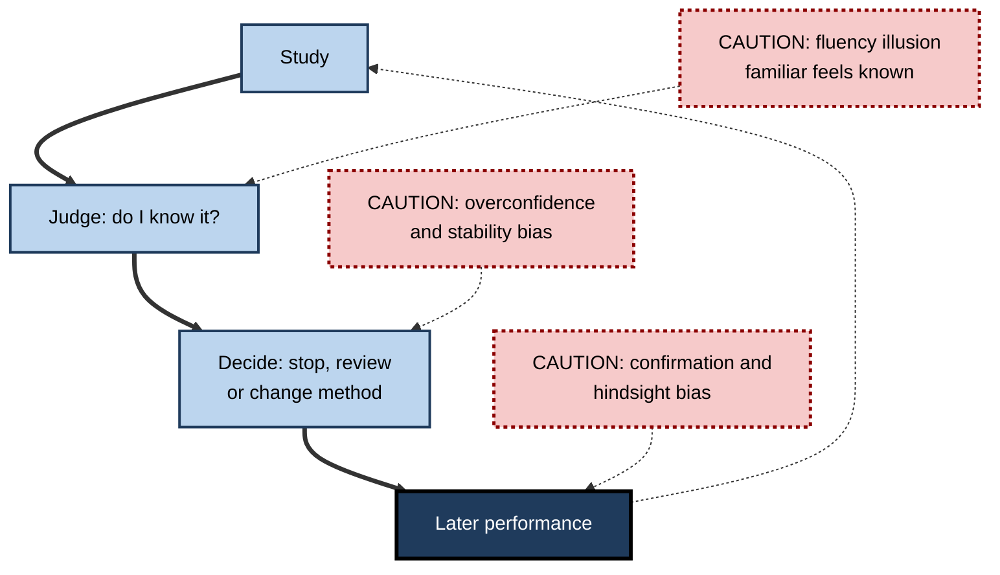
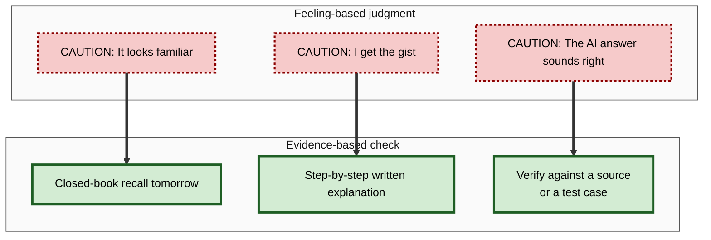

# B.7. Cognitive Biases Affecting Learning

> **In one sentence:** Cognitive biases are systematic, predictable errors in how we judge and think, and several of them quietly mislead us about what we know, how well we are learning, and which study methods work.
>
> **Why it matters:** Biases make people choose the study methods that feel good over the ones that work, overestimate their readiness, explain things badly to newcomers and trust AI output too easily. Knowing the specific biases that affect learning is the first step to designing around them.
>
> **Level span:** Novice → Expert · **Reading time:** ~18 min · **Builds on:** retrieval and forgetting; the difference between learning and performance

---

## The Learning Ladder

| Level | Badge | After this level you can... |
|---|---|---|
| 1 | NOVICE | Explain what a cognitive bias is and give examples of how feelings mislead learners. |
| 2 | FOUNDATIONS | Name the main biases that affect learning and recognise them in yourself. |
| 3 | PRACTITIONER | Use concrete debiasing routines when studying, teaching and reviewing work. |
| 4 | ADVANCED | Explain the mechanisms (fluency, heuristics), evaluate contested findings such as Dunning–Kruger, and judge how far debiasing works. |
| 5 | EXPERT / PRO | Design training, assessments and AI workflows that counteract biases in teams and organisations. |

---

## Level 1 · Novice — The Big Picture

Your brain uses shortcuts to make quick judgments — most of the time they work well. A **cognitive bias** is when a shortcut misfires in a predictable direction. Optical illusions are a good analogy: even when you know two lines are the same length, one still *looks* longer. Biases are illusions of judgment. Knowing about them does not make them vanish, but it helps you check.

You have already experienced learning biases when:

- you re-read your notes, everything looked familiar, and you felt ready — then the test or meeting showed you could not produce the answers;
- you thought you understood how a zip works (or how the internet routes an email) until someone asked you to explain it step by step;
- you found it surprisingly hard to explain something "obvious" in your job to a new hire;
- after a project failed, it seemed obvious in hindsight that it would.

The key idea for a beginner: **feeling that you know is not the same as knowing. Check with evidence, not with feelings.**

---

## Level 2 · Foundations — Core Concepts

### The biases that matter most for learning

| Bias | What it is | How it hurts learning |
|---|---|---|
| **Illusion of competence (fluency illusion)** | Mistaking ease of processing — familiarity, smooth reading — for knowledge. | Leads to re-reading and stopping too early. |
| **Illusion of explanatory depth** | Believing you understand how something works in more detail than you do. | Hidden gaps appear only when you must explain or apply. |
| **Overconfidence** | Rating your knowledge or performance higher than it is. | Under-preparation; skipping practice. |
| **Foresight bias** | Underestimating how hard a future test will be, because answers seem obvious while studying with them in view. | Studying with the answer visible creates false readiness. |
| **Stability bias** | Assuming your memory will stay the same over time. | No review planned; surprise at forgetting. |
| **Curse of knowledge** | Once you know something, finding it hard to imagine not knowing it. | Experts skip steps and use jargon when teaching. |
| **Confirmation bias** | Seeking and favouring information that confirms what you already believe. | Misconceptions persist; contrary evidence is ignored. |
| **Hindsight bias** | Feeling that an outcome was predictable after you know it. | Post-mortems underestimate uncertainty; less is learned from mistakes. |
| **Planning fallacy** | Underestimating how long tasks will take. | Unrealistic study plans; last-minute cramming. |
| **Automation bias** | Over-trusting output from automated systems. | Accepting AI answers without checking. |

**Figure B.7-1 — How biases break the learning loop.**

*How to read it:* the thick path is the learning loop; dotted arrows show where specific biases distort each step.

### Key terms

| Term | Plain meaning |
|---|---|
| **Cognitive bias** | A systematic error in thinking that pushes judgments in a predictable direction. |
| **Heuristic** | A mental shortcut that usually works but can produce bias. |
| **Processing fluency** | How easy something feels to read, see or recall. |
| **Judgment of learning (JOL)** | Your prediction of how well you will remember something later. |
| **Calibration** | How closely your confidence matches your actual performance. |
| **Debiasing** | Methods that reduce the effect of a bias on decisions. |

---

## Level 3 · Practitioner — Putting It to Work

### Five debiasing routines for learners and teachers

1. **Test, do not judge.** Replace "do I know this?" with a closed-book attempt. A retrieval attempt exposes the fluency illusion instantly.
2. **Delay your confidence ratings.** Judgments of learning made after a delay, and from a cue alone, are much more accurate than judgments made right after studying — the **delayed-JOL effect**. Rate your readiness tomorrow, not now.
3. **Explain it step by step.** To beat the illusion of explanatory depth, write out *how* something works, mechanism by mechanism. Gaps become obvious.
4. **Consider the opposite.** Before accepting a belief, list reasons it might be wrong; when reviewing a project, write what would have led to a different outcome. This reduces confirmation and hindsight bias.
5. **Use outside-view planning.** Base study time estimates on how long similar learning took you before, and add a buffer, rather than on how long it "should" take.

**Figure B.7-2 — Replacing feelings with evidence.**

*How to read it:* each dotted-border feeling on the left is replaced by the solid-border check on the right.

### Worked example — a developer preparing for a cloud certification

| | Before | After |
|---|---|---|
| **Method** | Watches the full video course at 1.5x; re-reads summaries; feels confident. | Takes a practice exam cold before studying further. |
| **Confidence** | "About 85% ready." | Practice score reveals 60%, mostly in networking and identity. |
| **Plan** | Book exam for next week. | Uses a calibrated plan: two weeks focused on weak areas, with spaced practice exams. |
| **Explanation test** | None. | Writes how VPC routing works, step by step; finds three gaps. |
| **Outcome** | (Typical result: fail, surprised.) | Passes with margin; can explain design choices in interviews. |

### Common mistakes at this level

- **Believing awareness is enough.** Knowing about a bias does not protect you; procedures do.
- **Studying with the answers visible.** Foresight bias makes everything look obvious.
- **Treating ease as a sign of a good method.** Effective methods often feel harder.
- **Blaming yourself for bias.** Biases are features of normal cognition, not personal flaws.
- **Expert explanations without a novice check.** Ask a newcomer to explain back what you taught.

---

## Level 4 · Advanced — Mechanisms, Models & Evidence

### Fluency as the common mechanism

Many learning biases share one cause: people infer "I know this" from **processing fluency**. Fluency rises with repetition, recency, clear fonts, and seeing the answer — none of which guarantee future recall. Classic studies by Asher Koriat and by the Bjorks show learners predict better memory for massed than for spaced study, and for re-reading than for testing, the reverse of actual results. This is why people consistently rate effective "desirable difficulties" as less effective.

### The illusion of explanatory depth

Leonid Rozenblit and Frank Keil (2002) asked people to rate their understanding of everyday devices, then explain them in detail, then re-rate. Ratings dropped sharply after attempting explanations. The illusion is strongest for causal, mechanistic knowledge — exactly the kind professionals need for troubleshooting and design. Later work found that asking people to explain mechanisms (not just give reasons) can also moderate extreme opinions, although replication of that political extension has been mixed.

### The Dunning–Kruger debate

The **Dunning–Kruger effect** (1999) is the claim that the least skilled people most overestimate their performance, because they lack the skill to recognise their errors. It became one of psychology's most popular ideas. It is now **contested**:

- Critics showed that the classic graph — plotting perceived versus actual performance by quartile — can be produced from random data, because of regression to the mean and the "better-than-average" tendency. Some called it a statistical artifact.
- Defenders replied that measurement problems do not mean metacognitive differences are absent, and that some studies using better methods still find poorer calibration among low performers.
- A 2026 reanalysis of large datasets in a leading theory journal, using models that account for noise in both scores and self-predictions, argued the classic pattern is largely an artifact and that overconfidence may even be greatest among higher performers.

The safe professional conclusion: **overconfidence is common across skill levels; do not use "Dunning–Kruger" to label people. Use objective feedback for everyone.**

### Curse of knowledge and expert blind spots

In a well-known demonstration, people tapping the rhythm of a familiar song predicted listeners would identify it far more often than they actually did. Experts likewise underestimate how hard their domain is for beginners — the **expert blind spot**. This is a core reason subject-matter experts often produce poor training without instructional design support.

### Hindsight bias and learning from failure

Once an outcome is known, people overestimate how predictable it was. In post-incident reviews this produces blame ("they should have seen it") and distorted lessons. Blameless review formats, which reconstruct what people knew *at the time*, are designed partly to counter hindsight bias.

### How well does debiasing work?

Evidence is mixed but not hopeless. Simply informing people about biases has weak effects. More effective are: **procedures** that force the corrective step (closed-book tests, considering alternatives, checklists), **feedback** that is specific and timely, and **training with practice and feedback** on recognising bias, which has shown some durable effects in controlled studies. Changing the environment — for example, scheduling spaced quizzes automatically — often works better than relying on individual willpower.

### Automation bias in the AI era

People tend to accept recommendations from automated systems, especially under time pressure, and to miss errors the system makes (errors of omission and commission). Fluent, confident AI text amplifies the fluency illusion: well-written answers *feel* correct. Research on AI-assisted decision-making consistently identifies over-reliance as a risk, and logic alone says that people with less domain knowledge are less able to detect an AI's errors — which is exactly when they most need to check.

---

## Level 5 · Expert / Pro — Professional Mastery

### Designing bias-resistant learning systems

| Bias | Organisational countermeasure |
|---|---|
| Fluency illusion | Closed-book, delayed assessments; dashboards that show demonstrated skill, not hours watched. |
| Overconfidence | Calibration training with feedback: predict your score, then compare. |
| Curse of knowledge | Pair experts with instructional designers; test materials on real novices. |
| Hindsight bias | Blameless post-incident reviews that reconstruct the decision context. |
| Confirmation bias | Structured devil's-advocate roles; pre-mortems before launches. |
| Planning fallacy | Reference-class estimates for learning plans; buffers. |
| Automation bias | Require verification steps for AI output; include seeded AI errors in training. |

### Professional scenario

**Role:** Principal engineer running an internal "AI-assisted coding" enablement programme.
**Situation:** Juniors using AI assistants report high confidence, but code reviews reveal subtle security flaws in AI-generated code they did not catch.
**What the pro does:** Adds calibration exercises: juniors predict whether each of ten AI-generated snippets contains a bug, then see the truth and their accuracy score. Seeds sessions with plausible-but-wrong AI output. Introduces a review checklist requiring explanation of each AI-suggested change in their own words before merge. Confidence becomes better calibrated, and the security review team reports fewer flaws reaching review.

### Expert-level judgement

- **Bias management is environmental.** Build the check into the process instead of asking people to "be less biased".
- **Measure calibration, not confidence.** The gap between predicted and actual performance is a useful learning metric.
- **Treat popular bias stories cautiously.** Some, like Dunning–Kruger, are contested; use them as hypotheses, not labels.
- **Model intellectual humility.** Leaders who say "let me check that" make checking normal.

### Ethical limits

Bias knowledge can be weaponised — to dismiss opponents ("you're just biased") or to manipulate learners' choices. Use it to improve your own processes first.

---

## Myths vs. Evidence

| Myth | What the evidence shows |
|---|---|
| "If I know about biases, I'm protected from them." | Awareness alone has weak effects; procedures and feedback work better. |
| "Feeling confident means I'm ready." | Confidence is driven by fluency and is often poorly calibrated. |
| "Incompetent people are always the most overconfident (Dunning–Kruger)." | The classic pattern is partly or largely a statistical artifact; overconfidence appears across skill levels. |
| "Experts make the best teachers automatically." | The curse of knowledge makes experts skip steps; they need novice testing and design support. |
| "Well-written AI answers are probably correct." | Fluency is not accuracy; verification is required. |
| "Biases mean people are irrational." | Heuristics are usually efficient; biases are predictable side-effects in specific conditions. |

## Practitioner Toolkit

**Learning-bias checklist**

- [ ] I tested myself closed-book instead of judging by familiarity.
- [ ] I rated my readiness after a delay.
- [ ] I wrote a step-by-step explanation of the mechanism.
- [ ] I looked for evidence against my current belief.
- [ ] My study plan uses past experience, plus a buffer.
- [ ] I verified AI output against a source or test.
- [ ] When teaching, a novice explained it back to me.

**Calibration log template**

| Date | Topic | Predicted score | Actual score | Gap | What I will change |
|---|---|---|---|---|---|
| | | | | | |

## Self-Check

1. **[NOVICE]** What is a cognitive bias, in plain words?
2. **[NOVICE]** Why does re-reading make you feel ready even when you are not?
3. **[FOUNDATIONS]** Define the illusion of explanatory depth and give an example.
4. **[FOUNDATIONS]** What is the curse of knowledge and how does it affect training?
5. **[PRACTITIONER]** What is the delayed-JOL effect and how can you use it?
6. **[ADVANCED]** Summarise the debate about the Dunning–Kruger effect.
7. **[ADVANCED]** Why does simply informing people about biases often fail?
8. **[EXPERT / PRO]** How would you reduce automation bias in a team using AI tools?
9. **[EXPERT / PRO]** How do blameless post-incident reviews counter hindsight bias?

### Answer Key

1. A systematic, predictable error in judgment caused by mental shortcuts.
2. Re-reading increases fluency and familiarity, which the brain mistakes for knowledge.
3. Believing you understand how something works better than you do; for example, thinking you can explain how a toilet flushes or how DNS resolves a name, until you try.
4. Difficulty imagining not knowing what you know; experts skip steps and use jargon, making training too hard for novices.
5. Predictions of later memory made after a delay are more accurate; rate readiness the day after studying, using a cue-only self-test.
6. The original claim is that low performers overestimate most. Critics show the pattern can arise from regression and statistical artifacts; a 2026 reanalysis argued it largely disappears with better models. Defenders say some calibration differences remain. It is contested.
7. Biases operate automatically; knowing about them does not trigger correction. Procedures, feedback and environmental changes are needed.
8. Require verification steps, include seeded errors in training, use calibration exercises, and require people to explain AI-suggested changes in their own words.
9. They reconstruct what people knew and could reasonably infer at the time, instead of judging decisions with knowledge of the outcome.

## Key Takeaways

- **Cognitive biases** are predictable errors; several directly mislead learners.
- The **fluency illusion** — familiar feels known — is the most damaging for study.
- **Test, delay, explain, consider the opposite** — procedures beat awareness.
- **Dunning–Kruger is contested**; overconfidence is widespread, so give everyone objective feedback.
- **Experts suffer the curse of knowledge**; test training on real novices.
- **Automation bias** makes fluent AI output feel right; build verification into workflows.

## Glossary

| Term | Meaning |
|---|---|
| Automation bias | Over-reliance on automated recommendations. |
| Calibration | Agreement between confidence and actual performance. |
| Cognitive bias | A systematic deviation from accurate judgment. |
| Confirmation bias | Favouring information that supports existing beliefs. |
| Curse of knowledge | Difficulty taking the perspective of someone who knows less. |
| Delayed-JOL effect | Greater accuracy of memory predictions made after a delay. |
| Dunning–Kruger effect | The contested claim that low performers overestimate their ability most. |
| Fluency illusion | Mistaking ease of processing for learning. |
| Foresight bias | Underestimating future test difficulty when studying with answers present. |
| Heuristic | A mental shortcut. |
| Hindsight bias | Seeing past outcomes as more predictable than they were. |
| Illusion of explanatory depth | Overestimating one's understanding of how things work. |
| Planning fallacy | Underestimating time needed for tasks. |
| Stability bias | Assuming memory will not change over time. |
