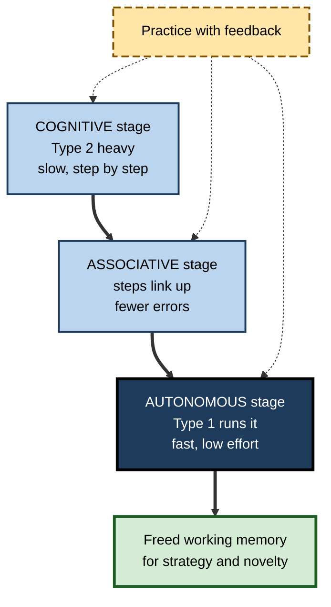
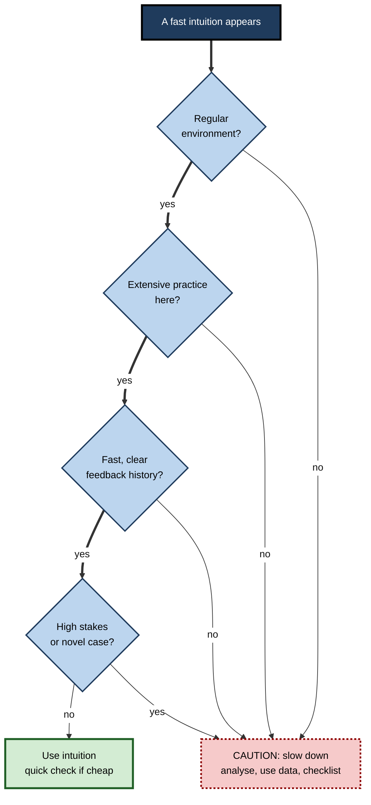

# B.8. Dual-Process Theory in Learning

> **In one sentence:** Dual-process theory says the mind has two broad kinds of thinking — fast, automatic, intuitive processing and slow, effortful, deliberate processing — and learning a skill largely means turning slow, deliberate steps into fast, reliable intuitions.
>
> **Why it matters:** It explains why novices are slow and error-prone, why experts can "just see" the answer, when gut feel can be trusted, and why some errors persist even in smart people. It also helps you design practice that builds trustworthy intuition rather than fragile habits.
>
> **Level span:** Novice → Expert · **Reading time:** ~18 min · **Builds on:** working memory limits; cognitive biases

---

## The Learning Ladder

| Level | Badge | After this level you can... |
|---|---|---|
| 1 | NOVICE | Describe fast and slow thinking with everyday examples. |
| 2 | FOUNDATIONS | Use the terms Type 1 / Type 2 (System 1 / System 2), automaticity and cognitive reflection correctly. |
| 3 | PRACTITIONER | Decide when to trust intuition and when to slow down, and practise in ways that build good intuitions. |
| 4 | ADVANCED | Explain competing dual-process models, the main criticisms, and which popular claims failed to replicate. |
| 5 | EXPERT / PRO | Design training and decision processes that develop expert intuition and catch its failures, including with AI. |

---

## Level 1 · Novice — The Big Picture

Think about driving. When you first learned, every action — mirror, signal, clutch, steering — took conscious effort, and talking at the same time was impossible. Now you drive a familiar route while holding a conversation. The skill moved from **slow, effortful thinking** to **fast, automatic thinking**.

Psychologists describe these as two kinds of thinking:

- **Fast thinking** — quick, effortless, automatic: recognising a friend's face, reading a simple word, knowing 2 + 2.
- **Slow thinking** — deliberate, effortful, step by step: calculating 17 × 24, comparing two job offers, debugging an unfamiliar error.

A useful analogy is an autopilot and a pilot. The autopilot handles routine flying smoothly and cheaply. The pilot takes over when something unusual happens. Both are needed; trouble comes when the autopilot handles a situation it was never trained for, and the pilot does not notice.

You have already experienced this when:

- you typed your old password after changing it — fast thinking ran the old habit;
- you answered a trick question instantly and wrongly, then saw the right answer when you slowed down;
- a senior colleague glanced at a problem and immediately knew where to look, while you had to reason it out.

The key idea for a beginner: **learning moves skills from slow to fast thinking. Good learning makes the fast thinking accurate.**

---

## Level 2 · Foundations — Core Concepts

### Two types of processing

The terms **System 1** and **System 2** were popularised by Keith Stanovich and Richard West and made famous by Daniel Kahneman's 2011 book *Thinking, Fast and Slow*. Many researchers now prefer **Type 1** and **Type 2 processing**, to avoid implying two separate brain systems.

| Feature | Type 1 (fast, intuitive) | Type 2 (slow, deliberate) |
|---|---|---|
| Speed | Fast | Slow |
| Effort | Low | High |
| Working memory | Does not require it (defining feature in many accounts) | Requires it (defining feature) |
| Awareness | Mostly outputs reach awareness, not the process | Process is consciously followed |
| Capacity | Can run in parallel | Limited; one line of reasoning at a time |
| Strength | Efficient, pattern-based, good in familiar settings | Flexible, rule-based, good in novel settings |
| Weakness | Biases when patterns mislead | Slow, tiring, easily disrupted |

### How skills move from Type 2 to Type 1

A classic model of motor-skill learning by Paul Fitts and Michael Posner (1967) describes three stages, and it applies well beyond motor skills:

1. **Cognitive stage** — you think through each step; slow and error-prone.
2. **Associative stage** — steps link into smoother sequences; errors drop.
3. **Autonomous stage** — performance is fast and automatic, freeing working memory for other things.

**Figure B.8-1 — Practice moves skill from deliberate to automatic.**

*How to read it:* the thick path shows a skill becoming automatic; dotted arrows show that practice with feedback drives every transition.

### Key terms

| Term | Plain meaning |
|---|---|
| **Type 1 processing** | Fast, automatic, low-effort thinking that does not need working memory. |
| **Type 2 processing** | Slow, deliberate, effortful thinking that uses working memory. |
| **Automaticity** | The ability to perform a task with little conscious attention after practice. |
| **Intuition** | A judgment that arrives quickly without conscious reasoning. |
| **Cognitive reflection** | The tendency to question an initial intuitive answer and check it. |
| **Conflict detection** | Noticing that an intuitive answer clashes with a rule or other information. |
| **Override** | Replacing an intuitive response with a deliberate one. |

---

## Level 3 · Practitioner — Putting It to Work

### When to trust your gut — the three-question test

Daniel Kahneman and Gary Klein, coming from opposing research traditions, agreed in 2009 on conditions under which expert intuition is trustworthy. Turn them into a quick check before acting on a hunch:

1. **Is the environment regular?** Are there stable patterns linking cues to outcomes (for example, code smells and bugs, symptoms and diagnoses)? Or is it largely random (short-term stock prices)?
2. **Have I had lots of practice in *this* environment?** Hundreds of cases, not a handful.
3. **Did I get fast, clear feedback?** Did I learn whether my judgments were right, soon after making them?

If all three are "yes", intuition is likely valuable. If any is "no", slow down and use deliberate analysis, data or checklists.

**Figure B.8-2 — Deciding between fast and slow thinking.**

*How to read it:* follow the thick path; any "no" on the first three questions, or a high-stakes novel case, sends you to deliberate analysis.

### Building good intuitions through practice

1. **Start deliberately.** Novices should reason step by step with worked examples; premature "go with your gut" teaches bad patterns.
2. **Get many varied examples.** Intuition is pattern recognition; patterns need many cases, including near-misses.
3. **Get feedback fast.** Learn whether each judgment was right while the reasoning is fresh.
4. **Predict before checking.** Make a quick call, then verify. This trains the fast system and calibrates confidence.
5. **Automate the fundamentals.** Make basic operations (keyboard shortcuts, syntax, core facts) automatic so working memory is free for problem-solving.

### Worked example — a junior data analyst checking anomalies

| | Before | After |
|---|---|---|
| **Approach** | Either eyeballs charts and guesses, or runs a full analysis for every blip. | For each anomaly, writes a 10-second guess ("data pipeline delay"), then checks. |
| **Feedback** | Rarely learns which guesses were right. | Logs guess versus actual cause; reviews weekly with a senior. |
| **After three months** | Still slow; intuitions unreliable. | Fast, accurate first guesses on common causes; deliberately slows for unfamiliar patterns. |

### Common mistakes at this level

- **Trusting intuition in an irregular domain.** Confident hunches in noisy domains are often no better than chance.
- **Overthinking automated skills.** Consciously monitoring a well-learned skill can disrupt it ("choking"); trust practised routines in performance moments.
- **Assuming slow equals correct.** Deliberate reasoning can rationalise a wrong intuition rather than correct it.
- **Skipping the fundamentals.** Without automatic basics, every task overloads working memory.

---

## Level 4 · Advanced — Mechanisms, Models & Evidence

### Classic demonstrations

The **Cognitive Reflection Test** (Shane Frederick, 2005) includes items such as: *A bat and a ball cost 1.10 in total. The bat costs 1.00 more than the ball. How much does the ball cost?* The intuitive answer (0.10) is wrong; the correct answer is 0.05. Many educated adults give the intuitive answer. Scores correlate with susceptibility to several biases.

### Competing architectures

| Model | Claim | Status |
|---|---|---|
| **Default-interventionist** (Evans, Stanovich, Kahneman) | Type 1 produces a default response; Type 2 may intervene if a problem is detected. | Influential; criticised for the "switch problem" — how does the mind know when to intervene? |
| **Parallel-competitive** (Sloman and others) | Both types run at once and compete. | Explains conflict, but implies wasteful constant deliberation. |
| **Hybrid / "logical intuition"** (De Neys and others) | Type 1 can generate several intuitions, including logically correct ones; their relative strength and conflict trigger Type 2. | Growing support; developed in a 2023 major target article and commentaries. |

Wim De Neys's 2023 critique argued that the **exclusivity assumption** — that intuitive and deliberate processes produce different kinds of answers — lacks solid support. Experiments show that even people who give the biased answer often show signs of detecting the conflict (slower responses, lower confidence), and that correct answers sometimes arise intuitively. In this view, good reasoners have **good intuitions**, not just strong willpower to override bad ones. For learning, this is encouraging: training can make correct responses intuitive.

### What did not replicate

Popular accounts of dual-process thinking included claims that did not survive large replications:

- **Ego depletion** — the idea that self-control draws on a limited resource that runs out — failed to replicate in a large preregistered multi-lab study in 2016, and subsequent work suggests the effect is small or absent.
- **Behavioral priming** — several striking priming effects described in popular books (for example, words about old age making people walk slower) did not replicate reliably. Kahneman himself publicly acknowledged concerns about this literature.
- **Disfluency improves reasoning** — the idea that hard-to-read fonts trigger more careful thinking did not hold up in larger studies.

The core distinction between fast, automatic and slow, controlled processing remains well supported; specific dramatic effects attached to it are weaker.

### Is "slow down" an effective debiasing strategy?

In medical diagnosis, research has tested whether telling clinicians to slow down and reflect reduces errors. Results are mixed: errors often stem from **missing or poorly organised knowledge**, not merely from fast thinking, and reflection helps most on difficult cases. The implication for learning: **building better knowledge (better intuitions) matters more than exhortations to think slowly.**

### Automaticity and its costs

Automaticity frees working memory but has side-effects: automatic habits are hard to change (old passwords, outdated procedures), can run in the wrong context (**capture errors**), and resist verbal explanation (experts often cannot articulate what they know). Effective trainers therefore use **cognitive task analysis** to draw out experts' automated knowledge before teaching it.

### Dual processes and AI

Recent AI "reasoning" models that generate intermediate steps before answering are often described with a System 1 / System 2 analogy. The analogy is loose — these systems do not share human working-memory constraints — but it highlights a learning risk: if an AI does the Type 2 work, the human may only ever exercise Type 1 acceptance. People then never build the deliberate understanding that, through practice, becomes reliable intuition.

---

## Level 5 · Expert / Pro — Professional Mastery

### Engineering trustworthy intuition

| Goal | Expert practice |
|---|---|
| Build pattern recognition | High-volume case exposure with immediate feedback (simulations, case libraries, labelled incident histories). |
| Automate fundamentals | Drill core skills to fluency so attention goes to judgment. |
| Catch intuition failures | Checklists for high-stakes, rare situations; second-reader review; pre-mortems. |
| Extract expert intuition | Cognitive task analysis interviews; think-aloud recordings of experts solving problems. |
| Calibrate | Track predictions against outcomes; review hit rates. |

### Professional scenario

**Role:** Head of underwriting at an insurer.
**Situation:** Senior underwriters make fast, accurate calls on standard commercial policies, but juniors either copy seniors' calls without understanding or freeze on every case. A new product line (cyber insurance) has little historical data.
**What the pro does:** For standard lines, builds a case library of several hundred past decisions with outcomes; juniors make a quick call, then compare to the expert's reasoning and the actual claim history. For cyber policies — an irregular environment with sparse feedback — mandates a structured, deliberate scoring checklist and peer review, explicitly telling seniors not to rely on intuition there. Juniors' agreement with expert decisions rises on standard lines, and the cyber book avoids early large losses.

### AI-era judgement

- **Keep humans practising the deliberate steps** they need to build intuition — especially early in careers.
- **Use AI as a feedback source** for intuition training: quick human guess, then AI-assisted analysis, then compare.
- **Watch for "fast acceptance".** Accepting AI output is itself a Type 1 habit; build in verification prompts for high-stakes outputs.

### Ethical limits

Expert intuition can encode bias (for example, in hiring "gut feel"). In domains where judgments affect people's opportunities, structured, deliberate processes are an ethical as well as an accuracy safeguard.

---

## Myths vs. Evidence

| Myth | What the evidence shows |
|---|---|
| "System 1 and System 2 are two separate brain parts." | They are labels for types of processing, not anatomical systems. |
| "Intuition is always biased; deliberation is always correct." | Intuitions can be correct and even logical; deliberation can rationalise errors. |
| "Willpower is a fuel tank that runs out (ego depletion)." | Large preregistered replications found little or no effect. |
| "Always trust your gut." | Intuition is trustworthy only in regular environments with extensive practice and feedback. |
| "Just tell people to slow down to avoid errors." | Knowledge gaps cause many errors; reflection helps mainly on difficult cases. |
| "Experts can always explain how they decide." | Much expert knowledge is automatic and hard to articulate; it must be elicited carefully. |

## Practitioner Toolkit

**Intuition-building checklist**

- [ ] Fundamentals practised to automaticity.
- [ ] Many varied, realistic cases available.
- [ ] Quick prediction before every check.
- [ ] Fast, clear feedback on each judgment.
- [ ] Prediction log reviewed regularly.
- [ ] Checklists reserved for high-stakes, rare or novel cases.
- [ ] Verification step for AI-generated conclusions.

**Prediction log template**

| Date | Situation | My fast call | Confidence (%) | Actual outcome | Right? | Pattern learned |
|---|---|---|---|---|---|---|
| | | | | | | |

## Self-Check

1. **[NOVICE]** Give one example each of fast and slow thinking from your day.
2. **[NOVICE]** Why could you not talk while learning to drive, but can now?
3. **[FOUNDATIONS]** What is the defining difference between Type 1 and Type 2 processing in many modern accounts?
4. **[FOUNDATIONS]** Name the three Fitts and Posner stages.
5. **[PRACTITIONER]** What three conditions make expert intuition trustworthy?
6. **[ADVANCED]** What is the "exclusivity" assumption and why has it been challenged?
7. **[ADVANCED]** Name two popular dual-process-related claims that failed to replicate.
8. **[EXPERT / PRO]** How would you train juniors to develop reliable intuition in a regular domain?
9. **[EXPERT / PRO]** Why can relying on AI for reasoning hinder the development of expert intuition?

### Answer Key

1. Fast: recognising a colleague's voice. Slow: working out a budget variance.
2. Driving was in the cognitive stage, using working memory; practice made it automatic, freeing working memory for conversation.
3. Type 2 requires working memory; Type 1 does not.
4. Cognitive, associative, autonomous.
5. A regular environment, extensive practice in that environment, and fast, clear feedback.
6. The assumption that intuitive and deliberate processes give different kinds of answers (biased versus logical); evidence shows correct, even logical, responses can be intuitive and conflict is often detected intuitively.
7. Ego depletion; behavioral priming effects (also disfluency improving reasoning).
8. Provide many real cases, ask for quick calls before showing outcomes and expert reasoning, give feedback fast, and track calibration over time.
9. If AI does the deliberate reasoning, learners do not practise the Type 2 steps that, through repetition, would become accurate Type 1 intuitions.

## Key Takeaways

- Thinking runs on **fast, automatic (Type 1)** and **slow, deliberate (Type 2)** processing.
- **Learning moves skills from Type 2 to Type 1**, freeing working memory.
- **Trust intuition only** in regular environments with extensive practice and fast feedback.
- Modern theory says **good reasoners have good intuitions**, not just strong override.
- **Ego depletion and many priming effects did not replicate**; the core distinction holds.
- In the AI era, **protect the deliberate practice** that becomes expert intuition.

## Glossary

| Term | Meaning |
|---|---|
| Automaticity | Performing a skill with minimal conscious attention. |
| Capture error | An automatic habit running in the wrong situation. |
| Cognitive reflection | Tendency to check and override initial intuitive answers. |
| Cognitive Reflection Test | Short test with intuitive-but-wrong answers. |
| Cognitive task analysis | Methods for eliciting experts' hidden knowledge. |
| Default-interventionist model | Type 1 responds first; Type 2 may intervene. |
| Ego depletion | The contested idea that self-control uses a limited resource. |
| Intuition | Fast judgment without conscious reasoning. |
| Logical intuition | An intuitive response that aligns with logical or normative rules. |
| Type 1 processing | Fast, autonomous processing not requiring working memory. |
| Type 2 processing | Slow, deliberate processing requiring working memory. |
