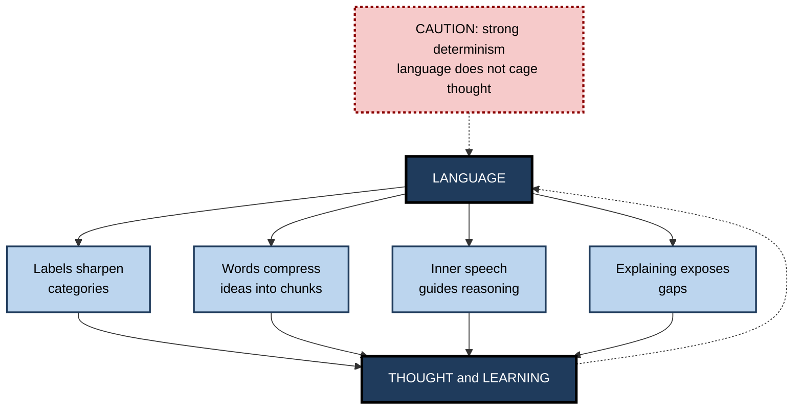
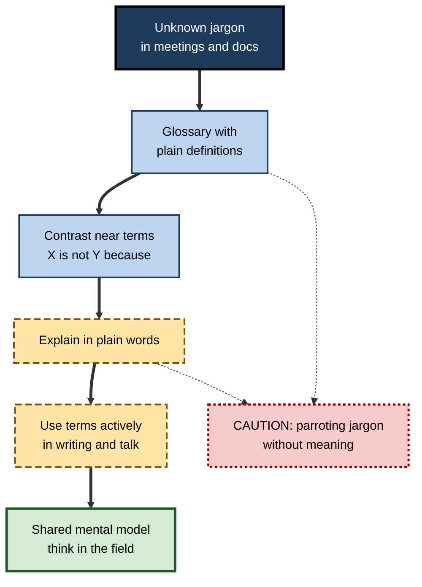

# B.9. Language and Thought in Cognition

> **In one sentence:** Language is not only how we share thoughts but also a tool that shapes and sharpens thinking — words carve experience into categories, inner speech guides reasoning, and explaining something in words changes how well we understand it — although language does not imprison thought.
>
> **Why it matters:** Professionals learn new fields largely by learning their vocabulary. Knowing how language supports thinking helps you learn faster, teach more clearly, write documentation that actually transfers understanding, and judge claims about bilingualism, jargon and AI language models.
>
> **Level span:** Novice → Expert · **Reading time:** ~18 min · **Builds on:** encoding; perception and attention

---

## The Learning Ladder

| Level | Badge | After this level you can... |
|---|---|---|
| 1 | NOVICE | Explain, with examples, how having a word for something changes how you notice and remember it. |
| 2 | FOUNDATIONS | Distinguish strong and weak versions of linguistic relativity and describe inner speech. |
| 3 | PRACTITIONER | Use vocabulary-building, explanation and writing as deliberate learning tools. |
| 4 | ADVANCED | Evaluate the evidence on colour, space, number, bilingualism and verbal overshadowing, including failed replications. |
| 5 | EXPERT / PRO | Design terminology, documentation and communication that build shared mental models in teams, and reason about language models. |

---

## Level 1 · Novice — The Big Picture

Imagine walking through a forest with a botanist. You see "trees and bushes". She sees oaks, beeches, hawthorn and an invasive species. She has words — categories — that make differences visible to her. After a few walks, as you learn the names, you start to notice those differences too.

Language works like a set of labelled drawers. Before you have the labels, things pile up together. With labels, you can sort, retrieve and combine them. Words do not create your ability to see, but they direct attention, make categories sharper and make ideas easier to hold and share.

You have already experienced this when:

- you joined a new company and could not follow meetings full of acronyms — and a few weeks later you were using them yourself, and thinking with them;
- you talked yourself through a tricky task ("first the left cable, then...") — that inner voice was helping you think;
- you only realised you did not understand something when you tried to explain it in words.

The key idea for a beginner: **words are thinking tools. Learning a field's language is a large part of learning to think in that field.**

---

## Level 2 · Foundations — Core Concepts

### Does language shape thought? Two versions

The idea that the language you speak influences how you think is called **linguistic relativity**, often linked to Edward Sapir and Benjamin Lee Whorf (the "Sapir–Whorf hypothesis").

| Version | Claim | Evidence status |
|---|---|---|
| **Strong (linguistic determinism)** | Language determines thought; you cannot think what your language cannot say. | Rejected. People think about things they lack words for; infants and animals think without language. |
| **Weak (linguistic relativity)** | Language influences attention, memory and categorisation in specific, measurable ways. | Supported in bounded domains such as colour, spatial reference and exact number. |

### How language supports thinking

| Function | What language does | Example |
|---|---|---|
| **Categorising** | Labels group things and sharpen boundaries. | Learning "latency" versus "throughput" lets you separate two kinds of slowness. |
| **Compressing** | A word packs a complex idea into one chunk. | "Technical debt" stands for a whole cluster of trade-offs. |
| **Inner speech** | Talking to yourself silently guides planning and self-control. | "Check the logs before restarting." |
| **Explaining** | Putting knowledge into words exposes gaps and builds connections. | Writing a design rationale reveals an unhandled case. |
| **Sharing** | Language lets knowledge pass between minds and generations. | Documentation, mentoring, books. |

**Figure B.9-1 — Ways language acts on thought.**

*How to read it:* solid arrows show the routes by which language influences thinking; the dotted arrow back shows that thinking also creates new words. The caution box marks the rejected strong claim.

### Key terms

| Term | Plain meaning |
|---|---|
| **Linguistic relativity** | The idea that language influences thought in specific ways. |
| **Linguistic determinism** | The rejected idea that language fully determines thought. |
| **Inner speech** | Silent self-talk used to plan, reason and regulate behavior. |
| **Private speech** | Talking aloud to oneself, common in children and in adults under difficulty. |
| **Concept** | A mental category that groups things by shared features or roles. |
| **Conceptual metaphor** | Understanding one domain in terms of another (for example, "argument is war"). |
| **Verbal overshadowing** | Describing a hard-to-verbalise memory (such as a face) can impair later recognition. |

---

## Level 3 · Practitioner — Putting It to Work

### Using language as a learning tool — a six-step method

1. **Build a glossary early.** In a new field, list core terms with plain definitions and an example each. Vocabulary is the entry ticket to the field's concepts.
2. **Name the distinctions.** For every term, add "not to be confused with ...". Contrasting near-synonyms sharpens categories.
3. **Explain in plain words.** Write or say an explanation as if to a smart 12-year-old. Gaps appear where jargon hides missing understanding.
4. **Use the vocabulary actively.** Use new terms in writing and conversation; production strengthens memory more than recognition.
5. **Talk yourself through hard tasks.** Deliberate self-talk ("what is the goal? what have I tried?") structures problem-solving.
6. **Write to learn.** Short written summaries, decision records or blog-style explanations consolidate understanding.

**Figure B.9-2 — From jargon to understanding.**

*How to read it:* the thick path turns unfamiliar terms into usable concepts; the dotted arrows show the risk of learning words without meaning, which plain-language explanation exposes.

### Worked example — a marketer joining a data team

| | Before | After |
|---|---|---|
| **Situation** | Hears "p-value", "lift", "holdout", "cohort" and nods along. | Keeps a running glossary in her notes after each meeting. |
| **Practice** | Avoids using the terms. | Writes "holdout is not the same as control because..." and checks with a colleague. |
| **Explanation** | Cannot explain results to her own team. | Writes a one-paragraph plain-English summary of each experiment. |
| **After six weeks** | Still dependent on analysts. | Designs a simple A/B test plan herself and spots a flawed comparison. |

### Common mistakes at this level

- **Memorising definitions without examples.** Words without concepts become empty labels.
- **Hiding behind jargon.** Fluent jargon can mask shallow understanding — in yourself and others.
- **Over-verbalising perceptual skills.** For face recognition, wine tasting or visual design, heavy verbal description can sometimes interfere; practise perceptually too.
- **Translating everything word for word.** Concepts across languages and fields rarely map one-to-one.

---

## Level 4 · Advanced — Mechanisms, Models & Evidence

### Colour

Languages divide the colour spectrum differently. Russian obliges speakers to distinguish lighter blue (*goluboy*) and darker blue (*siniy*). A 2007 study by Jonathan Winawer, Lera Boroditsky and colleagues found Russian speakers were faster to discriminate two blues when they fell across this boundary — and the advantage disappeared under a verbal interference task, suggesting language was involved online. EEG work with Greek speakers, whose language also splits light and dark blue, showed earlier brain responses to the named contrast. The effects are real but **modest and bounded**: language speeds and biases discrimination; it does not create or abolish colour perception.

### Space

Some languages, such as Guugu Yimithirr and Kuuk Thaayorre in Australia, use cardinal directions ("the cup is north of the plate") rather than left/right. Speakers maintain remarkable orientation and arrange sequences by compass direction. Researchers debate whether language causes these differences or reflects cultural and environmental factors that also shape language — a recurring problem in this field.

### Number

Communities whose languages lack exact number words beyond small quantities (studied among the Pirahã and Munduruku of the Amazon) can compare approximate quantities but struggle to track exact large quantities. Researchers have described number words as a **cognitive technology**: a cultural tool that enables exact quantitative thinking, rather than something the brain has without it.

### The label-feedback idea

Gary Lupyan and colleagues propose that words act as top-down cues that sharpen category representations in the moment. Hearing a category label can make category members easier to detect than an equally informative non-verbal cue. This offers a mechanism for weak relativity effects and for why naming concepts helps learners.

### Inner speech and development

Lev Vygotsky argued that children's private speech becomes internalised as inner speech that regulates thought. Research on self-talk and on articulatory suppression (blocking inner speech by repeating a word) supports a role for inner speech in task switching, planning and working memory, although people differ widely in how much they experience inner speech.

### Contested and failed findings

| Claim | Status |
|---|---|
| **Bilingual executive-function advantage** — bilinguals have better attention control. | Contested. Large meta-analyses and well-powered studies find little or no reliable advantage once publication bias and confounds are accounted for. Bilingualism has many other benefits; a general cognitive-control boost is not well established. |
| **Foreign-language effect** — thinking in a second language reduces biases. | Mixed; some effects replicate in specific tasks, others do not. |
| **Verbal overshadowing** — describing a face impairs recognising it. | A large registered replication in 2014 confirmed the effect, though smaller than originally reported. |
| **Strong Whorfian claims** — for example, that a language "without future tense" makes people save more. | Correlational findings are vulnerable to cultural confounds; treat as unproven. |

### Language models as a test case

Large language models learn from text alone and acquire impressive linguistic and world knowledge. This shows that much conceptual structure is recoverable from language statistics — supporting the idea that language carries rich information about the world. But whether this amounts to human-like understanding, grounded in perception and action, is debated. For human learners, the lesson is practical: **language exposure builds a lot of knowledge, but grounding words in examples, actions and consequences builds usable understanding.**

---

## Level 5 · Expert / Pro — Professional Mastery

### Language as infrastructure for team thinking

| Practice | Why it works |
|---|---|
| **Controlled vocabulary / ubiquitous language** | In software design, teams agree on precise domain terms shared by engineers and business people, reducing misunderstandings. |
| **Glossaries in onboarding** | Reduce the early overload of unfamiliar jargon. |
| **Plain-language standards** | Make knowledge accessible across roles and to non-native speakers. |
| **Naming patterns and failure modes** | Named concepts ("thundering herd", "scope creep") become shared chunks that speed diagnosis. |
| **Decision records in prose** | Writing forces explicit reasoning that bullet points can hide. |

### Professional scenario

**Role:** Engineering manager at a fintech scale-up.
**Situation:** Product, risk and engineering use "account", "customer" and "user" interchangeably; bugs and misbuilt features follow. New hires take months to understand the domain.
**What the pro does:** Runs workshops to define a shared domain vocabulary with examples and non-examples, publishes it as a living glossary, renames code entities to match, and adds a "terms used" section to every design document. New-hire onboarding begins with a glossary-based quiz and plain-language explanation tasks. Cross-team misunderstandings in requirements drop, and new engineers report faster understanding of the domain.

### Multilingual and global teams

- Second-language speakers carry extra cognitive load when processing jargon-heavy, fast speech; written summaries and visuals reduce this.
- Idioms and metaphors often fail across languages; plain, literal phrasing transfers knowledge better.
- AI translation helps access, but domain terms need human-checked glossaries to avoid subtle errors.

### AI-era implications

- **Prompts are language-as-thinking.** Writing a precise prompt requires precise concepts; vague vocabulary yields vague output.
- **AI explanations can supply words without concepts.** Learners may adopt fluent terminology from AI without understanding; require plain-language re-explanation and examples.
- **Writing to learn still matters.** If AI writes your summaries, you lose the thinking that writing produces.

### Ethical limits

Jargon can exclude. Experts who use language to signal status rather than share understanding slow learning and narrow participation.

---

## Myths vs. Evidence

| Myth | What the evidence shows |
|---|---|
| "You cannot think about what you have no word for." | Strong determinism is rejected; thought exceeds vocabulary. |
| "Language has no effect on thought." | Weak, bounded effects on colour discrimination, spatial reasoning and exact number are well documented. |
| "Bilinguals have a general brain advantage in attention control." | Large meta-analyses find little or no reliable advantage. |
| "Knowing the jargon means you understand the field." | Words can be learned without concepts; plain explanation tests understanding. |
| "Talking to yourself is a bad sign." | Self-talk commonly supports planning and self-regulation. |
| "Language models prove words alone produce understanding." | They show much knowledge is in language statistics; human-like grounded understanding remains debated. |

## Practitioner Toolkit

**Language-for-learning checklist**

- [ ] I keep a glossary for my new field with plain definitions and examples.
- [ ] Each term lists what it is *not* to be confused with.
- [ ] I can explain each core concept in plain words.
- [ ] I use new terms actively in writing and conversation.
- [ ] I write short summaries or decision notes myself.
- [ ] For perceptual skills, I also practise without verbal description.
- [ ] I re-explain AI-provided explanations in my own words.

**Glossary entry template**

| Term | Plain definition | Example | Non-example / not to be confused with | Why it matters here |
|---|---|---|---|---|
| | | | | |

## Self-Check

1. **[NOVICE]** How did learning names of things change what you notice? Give an example.
2. **[NOVICE]** What is inner speech used for?
3. **[FOUNDATIONS]** Contrast the strong and weak versions of linguistic relativity.
4. **[FOUNDATIONS]** Name three ways language supports thinking.
5. **[PRACTITIONER]** Describe how you would learn the vocabulary of a new field in your first month.
6. **[ADVANCED]** What did the Russian blues study show, and why was the verbal interference condition important?
7. **[ADVANCED]** What is the current evidence on the bilingual executive-function advantage?
8. **[EXPERT / PRO]** How does a shared domain vocabulary improve team performance?
9. **[EXPERT / PRO]** What risk do AI explanations pose to vocabulary learning, and how do you counter it?

### Answer Key

1. For example, learning the names of chart types made you notice when a chart type is misused.
2. Planning, reasoning, self-regulation and keeping information active in working memory.
3. Strong: language determines thought (rejected). Weak: language influences attention, memory and categorisation in specific ways (supported in bounded domains).
4. Categorising, compressing ideas into chunks, inner speech guiding reasoning, and explaining to expose gaps (also sharing knowledge).
5. Build a glossary from meetings and documents, contrast similar terms, explain each concept in plain words, use the terms actively, and check understanding with colleagues.
6. Russian speakers discriminated blues faster across their lexical boundary; the advantage vanished under verbal interference, showing language was involved during the task.
7. Large meta-analyses and well-powered studies find little or no reliable advantage after accounting for publication bias and confounds.
8. It reduces ambiguity, aligns mental models across roles, speeds communication and makes code and requirements match the business domain.
9. Learners can adopt fluent terminology without understanding; counter by requiring plain-language re-explanation, examples and application.

## Key Takeaways

- Language is a **thinking tool**, not just a communication channel.
- **Strong determinism is rejected**; weak, bounded influences of language on thought are real.
- Words **sharpen categories, compress ideas and guide reasoning** through inner speech.
- **Explaining in plain words** is one of the best tests of understanding.
- **Bilingual cognitive-control advantages are contested**; other benefits of bilingualism are not in question.
- Teams think better with a **shared, precise vocabulary**.
- In the AI era, **write and explain for yourself** — fluent borrowed words are not understanding.

## Glossary

| Term | Meaning |
|---|---|
| Cognitive technology | A cultural tool, such as number words, that enables new kinds of thinking. |
| Concept | A mental category. |
| Conceptual metaphor | Understanding one domain through another. |
| Inner speech | Silent verbal thinking. |
| Label-feedback hypothesis | The idea that words act as top-down cues that sharpen categories. |
| Linguistic determinism | The view that language determines thought. |
| Linguistic relativity | The view that language influences thought. |
| Private speech | Self-directed speech spoken aloud. |
| Sapir–Whorf hypothesis | Common name for linguistic relativity claims. |
| Ubiquitous language | A shared, precise vocabulary used across a software team and its business domain. |
| Verbal overshadowing | Impaired recognition after verbally describing a perceptual memory. |
