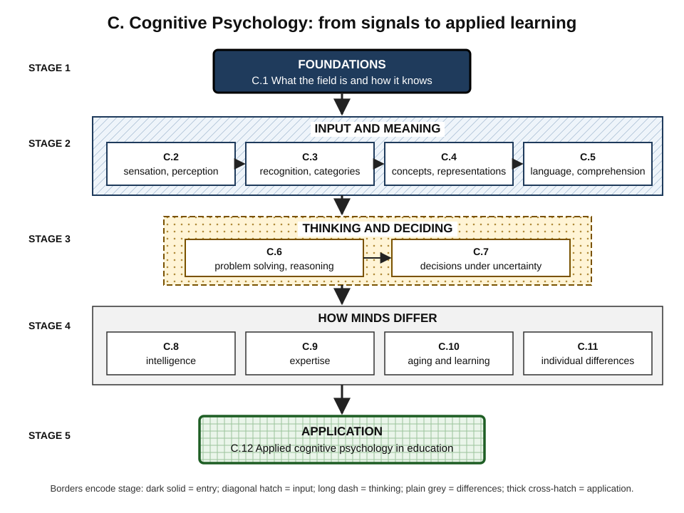
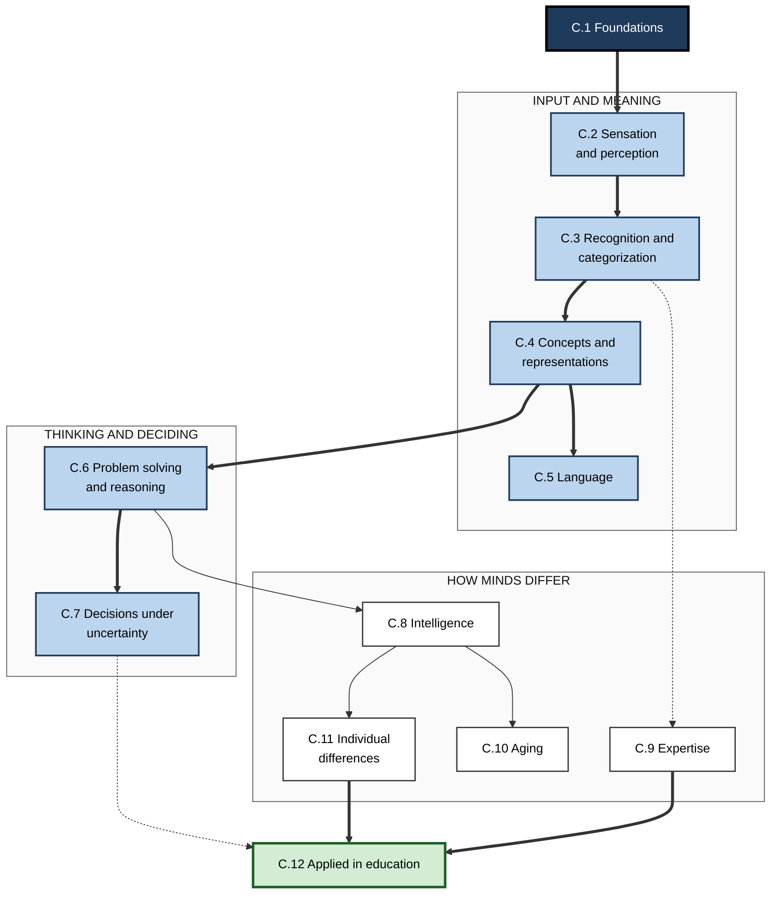
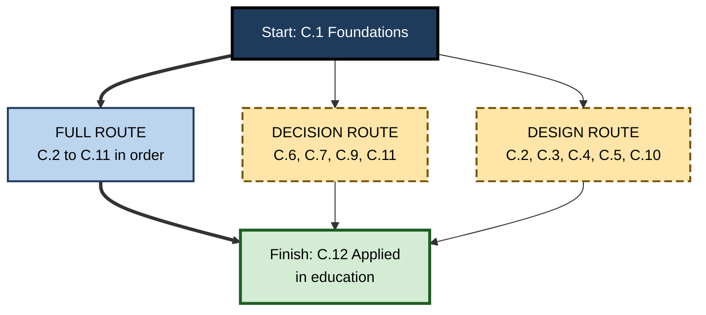

# C. Cognitive Psychology

> **What this subtopic is about:** The science of how the mind perceives, recognises, represents, understands language, solves problems and makes decisions — and how those capacities differ between people, change with age and expertise, and can be applied to make learning work.
>
> **Who it is for:** Anyone who learns, teaches, designs or decides for a living — from complete beginners to L&D leaders, product designers, managers and analysts · **Notes in this subtopic:** 12 · **Level span:** Novice → Expert

---

## Overview

Cognitive psychology studies the invisible machinery of thinking by measuring its visible traces: how fast people respond, which mistakes they make, what they remember, where they look. Its classic findings are among the most reliable in psychology.

This subtopic follows the flow of information through a person. It starts with the foundations of the field (C.1), moves through how raw signals become meaningful — perception, recognition, concepts and language (C.2–C.5) — then to higher thinking: problem solving, reasoning and decisions under uncertainty (C.6–C.7). It then turns to how minds differ: intelligence, expertise, aging and other individual differences (C.8–C.11). It ends by showing how all of this is translated into teaching and training that works (C.12).

Attention, memory, cognitive load and metacognition have their own sibling subtopics; these notes touch them only briefly.

*Figure C-1 — The structure of this subtopic.* Five stages run from top to bottom: foundations, input and meaning, thinking and deciding, how minds differ, and application. Thick borders mark the entry and exit notes. Read top to bottom for the learning arc.

---

## Why It Matters

Almost all modern work is knowledge work. Every report you write must be perceived and understood; every dashboard competes for limited perception; every hiring, pricing or launch decision is made under uncertainty; every team mixes people of different abilities, ages and experience; and every organisation must turn novices into experts. Cognitive psychology is the evidence base for doing all of this well.

It also protects you. The field has a long list of popular ideas that do not survive testing — learning styles matching, left-brain and right-brain types, "10,000 hours", "we use 10% of our brains", brain-training games that make you smarter, nudges that always work. It also has a list of solid, sometimes counter-intuitive findings — that perception is a best guess, that experts see deep structure, that losses loom larger than gains, that noise is as costly as bias, that prior knowledge drives new learning. Knowing which is which saves money, time and credibility.

Finally, the AI era makes the field newly urgent. Large language models now predict human choices, model reading, and act as tutors and advisers. Cognitive psychology provides the concepts to judge them — prediction versus explanation, performance versus learning, fluency versus accuracy — and to design human–AI work that keeps human judgement sharp.

---

## What You Will Learn

| # | Note | Core question it answers | Primary level |
|---|---|---|---|
| C.1 | Foundations of Cognitive Psychology | What is cognitive psychology, and how do we know what it claims? | Novice |
| C.2 | Sensation vs. Perception | How do raw signals become a meaningful — and fallible — world? | Novice–Practitioner |
| C.3 | Pattern Recognition and Categorization | How do we recognise things and sort them into useful kinds? | Foundations |
| C.4 | Concepts and Mental Representations | In what forms does the mind hold knowledge, and why does form matter? | Foundations–Advanced |
| C.5 | Language Processing and Comprehension | How do words become understanding, and why do readers misread? | Practitioner |
| C.6 | Problem Solving and Reasoning | How do people get from a problem to a solution, and where do they get stuck? | Practitioner |
| C.7 | Decision Making Under Uncertainty | How do people choose when outcomes are uncertain, and how can choices improve? | Practitioner–Advanced |
| C.8 | Intelligence and Cognitive Ability | What is intelligence, how is it measured, and what does it predict? | Advanced |
| C.9 | Expertise and Novice-Expert Differences | What changes in the mind as someone becomes an expert? | Advanced |
| C.10 | Cognitive Aging and Learning | What changes with age, what does not, and how do adults keep learning? | Practitioner–Advanced |
| C.11 | Individual Differences in Cognition | Which differences between learners matter, and which are myths? | Advanced |
| C.12 | Applied Cognitive Psychology in Education | How is cognitive science turned into teaching and training that works? | Expert / Pro |

---

## Concept Map

**Figure C-2 — How the twelve notes connect.**

*How to read it:* thick arrows show the main dependency chain; thin arrows show supporting links; dotted arrows show useful cross-connections (for example, expertise is largely better categories; decision science informs how learning programmes are evaluated).

---

## Recommended Learning Path

1. **C.1 Foundations** — learn the field's stance and how to check a "how people think" claim. Everyone starts here.
2. **C.2 → C.5 Input and meaning** — perception, recognition, concepts, language. Beginners should read in order; each builds vocabulary for the next.
3. **C.6 → C.7 Thinking and deciding** — problem solving, reasoning and judgement under uncertainty. High practical payoff for every role.
4. **C.8 → C.11 How minds differ** — intelligence first, then expertise, aging and individual differences in any order.
5. **C.12 Applied in education** — the capstone that pulls the subtopic together into design practice.

**Where to start and what to skim:**

- **Complete beginner:** read every note's Levels 1–3 in order first; return for Levels 4–5 later.
- **Manager or analyst:** prioritise C.1, C.6, C.7, C.9 and C.11.
- **L&D or instructional designer:** prioritise C.1, C.5, C.9, C.10, C.11 and C.12.
- **Product or UX designer:** prioritise C.2, C.3, C.4, C.5 and C.7.
- **Seasoned professional:** skim Levels 1–2, read Levels 4–5 and the Myths tables for the updated evidence.

**Figure C-3 — Three reading routes through the subtopic.**

*How to read it:* the thick path is the complete route; long-dash boxes are shorter role-based routes; all routes begin with C.1 and end with C.12.

---

## The Big Ideas in Brief

**C.1 Foundations of Cognitive Psychology.** Cognitive psychology infers hidden mental processes from measurable behavior. It grew from introspection and behaviorism through the cognitive revolution into interdisciplinary cognitive science. Marr's three levels — computational, algorithmic, implementational — keep explanations clear. Classic within-person cognitive findings replicate well; flashy single studies often do not. AI models such as the 2025 Centaur model now predict human choices impressively, but prediction is not explanation.

**C.2 Sensation vs. Perception.** Senses transduce energy; the brain interprets it, combining bottom-up signals with top-down expectations. Perception is a best guess — often excellent, sometimes confidently wrong. Signal detection theory separates sensitivity from response bias: telling people to "be careful" shifts the criterion, while better displays, training with feedback and double reading raise sensitivity. Predictive processing is a leading, still-debated theory.

**C.3 Pattern Recognition and Categorization.** Recognition combines features, structure and context. Natural categories have typical members, fuzzy edges and a preferred basic level. People use prototypes, exemplars, rules and causal theories. Categories are learned best from varied examples, contrasts, near-misses and interleaved practice. AI vision models can agree with people on labels while relying on different evidence, such as texture rather than shape.

**C.4 Concepts and Mental Representations.** Knowledge is held as images, propositions, semantic networks, schemas, mental models and procedures; form decides what you can do with it. Misconceptions are coherent models that change only when they visibly fail. Vector representations in AI capture much of human conceptual similarity, but not grounding or causal understanding. Teams think with shared representations — glossaries, domain models, diagrams.

**C.5 Language Processing and Comprehension.** Understanding means building a situation model, not storing words. Readers predict as they go, commit early, and often settle for "good-enough" interpretations. Background knowledge is the main driver of adult comprehension. Plain, purpose-first writing with explicit links is a cognitive design choice. Recent work finds that the largest language models are worse, not better, at predicting human reading times.

**C.6 Problem Solving and Reasoning.** Problem solving is heuristic search through a problem space; representation is decisive. Fixation and mental set block solutions; re-representation, analogies and breaks help. Spontaneous analogical transfer is rare. Reasoning is content-dependent and prone to belief bias. A 2025 survey of knowledge workers found that higher trust in AI goes with less critical thinking; humans must still define, verify and own conclusions.

**C.7 Decision Making Under Uncertainty.** Judge decisions by process, not outcome. Heuristics bring efficiency and predictable biases; prospect theory's core patterns replicated across 19 countries in 2020, while the size of loss aversion remains debated. Noise — scatter in judgements — is often as damaging as bias. Base rates, numeric probabilities, independent judgements and pre-mortems improve decisions. Average nudge effects shrink sharply after correcting for publication bias.

**C.8 Intelligence and Cognitive Ability.** The general factor g is robust; fluid and crystallized abilities follow different paths; the CHC model organises abilities hierarchically. Education raises measured intelligence by roughly one to five points per year. The Flynn effect has stalled or reversed in several countries. Updated meta-analyses (2022 onward) put cognitive ability's prediction of job performance well below earlier estimates, with structured interviews and work samples as strong or stronger.

**C.9 Expertise and Novice-Expert Differences.** Expertise is organised domain knowledge: chunks, deep principles, automatic routines. Deliberate practice is necessary and controllable but explains a variable share of performance differences. Expert intuition is trustworthy only in regular environments with fast feedback. Experts suffer a blind spot for novice difficulty. AI may accelerate novices but threatens the practice pipeline that creates future experts.

**C.10 Cognitive Aging and Learning.** Speed and fluid abilities decline gradually; knowledge and judgement grow; individual differences widen. Aging changes how people learn more than whether they can. Brain games have narrow effects; a 20-year trial follow-up published in 2026 linked speed training with boosters to lower diagnosed dementia — promising but unreplicated. A 2025 study combining cognitive and personality traits found overall functioning peaking around 55 to 60.

**C.11 Individual Differences in Cognition.** Prior knowledge, working memory, ability, conscientiousness, thinking dispositions and neurotype matter; learning-styles matching does not. Adapting instruction to prior knowledge (the expertise reversal effect) is the most robust aptitude–treatment interaction. Growth-mindset intervention effects are small and contested. Personalise by what learners know and do, and design inclusively for neurodiversity.

**C.12 Applied Cognitive Psychology in Education.** Retrieval, spacing, interleaving, worked examples, dual coding, self-explanation and feedback form the core toolkit. Recent meta-analyses show their effects depend on material and feedback — spacing is robust in mathematics, the testing effect less so. "Lethal mutations" keep the label but lose the mechanism. AI tutors help when they give hints and require learner effort, and harm when they hand out answers.

---

## Novice-to-Pro Progression

| Level | What competence looks like here |
|---|---|
| NOVICE | Can explain in plain words that perception is interpretation, that experts see differently, that decisions should be judged by process, and that popular brain myths are false. |
| FOUNDATIONS | Uses the field's core vocabulary correctly — signal detection, prototypes, situation models, heuristics, g, chunking, crystallized and fluid abilities — and knows which claims are well supported. |
| PRACTITIONER | Applies cognitive principles to daily work: clearer dashboards and documents, structured problem solving and decisions, category training with contrasts, age-inclusive and knowledge-adaptive training. |
| ADVANCED | Explains mechanisms and boundary conditions, reads replication status and effect sizes critically, and knows where recent evidence has overturned older certainties. |
| EXPERT / PRO | Designs systems — detection workflows, decision processes, selection methods, expertise pipelines, learning programmes and human–AI collaboration — grounded in cognitive evidence, measured locally and used ethically. |

---

## Where This Shows Up at Work

| Work situation | Relevant notes | What cognitive psychology contributes |
|---|---|---|
| Designing dashboards, alerts and interfaces | C.2, C.3 | Pre-attentive design, signal detection, alarm-fatigue control |
| Writing documentation, policies and prompts | C.4, C.5 | Shared concepts, situation-model writing, cold-reader tests |
| Debugging, diagnosis, consulting problems | C.6 | Problem definition, re-representation, hypothesis testing |
| Investment, launch and hiring decisions | C.7, C.8 | Base rates, pre-mortems, noise audits, structured interviews |
| Building expertise and succession planning | C.9 | Deliberate practice, cognitive task analysis, case libraries |
| Reskilling an older or mixed-age workforce | C.10, C.11 | Self-paced, knowledge-linked, accessible training |
| Personalisation and inclusion | C.11 | Adapting to prior knowledge, neurodiversity-aware practices |
| Corporate learning and onboarding | C.12 | Retrieval, spacing, worked examples, delayed evaluation |
| Deploying AI assistants and tutors | C.1, C.6, C.9, C.12 | Prediction versus explanation, verification, protecting learning |

---

## Capstone Exercises

1. **Claim audit (C.1, C.11).** Collect five "how people think" claims from your organisation's materials. Check each for a measurable outcome, comparison, replication and mechanism; classify as usable, promising or myth, and replace every myth.
2. **Perception and comprehension redesign (C.2, C.5).** Take one real dashboard and one important document. Redesign both: one pre-attentive signal per screen, no colour-only meaning, purpose-first writing, explicit links. Run five-second and cold-reader tests before and after.
3. **Decision hygiene pilot (C.6, C.7).** For your team's next significant decision, use the problem-definition template, an outside-view base rate, independent estimates, a pre-mortem and a decision journal. Review the process three months later, regardless of outcome.
4. **Expertise map (C.3, C.4, C.9).** Interview an expert in your field using cognitive task analysis prompts about two specific hard cases. Build a case card with cues, principles, typical examples and near-misses, and use it to train a newcomer with interleaved practice.
5. **Inclusive learning module (C.8, C.10, C.11, C.12).** Redesign a training module so that it diagnoses prior knowledge, allows test-out, uses worked examples and lean visuals, supports self-pacing, includes spaced retrieval with feedback, and is evaluated by delayed, unaided performance. If AI is involved, configure it to give hints before answers.

---

## Key Takeaways

- Cognitive psychology **infers invisible mental processes from measurable behavior** and is among the most replicable areas of psychology.
- **Perception, recognition, concepts and language** are active constructions shaped by expectations and knowledge — powerful and fallible.
- **Problem solving and decisions** follow heuristics with predictable failure points; structure, base rates and independent judgement improve them.
- **People differ** in knowledge, ability, age-related speed and neurotype; **prior knowledge** is the difference that matters most for learning, and learning styles are a myth.
- **Expertise is organised knowledge** built by feedback-rich practice; expert intuition deserves trust only in regular environments.
- Several older certainties have been **revised by recent evidence**: cognitive ability's job-performance validity, the size of loss aversion, the power of nudges, the reach of brain training.
- In the **AI era**, the field's core distinctions — prediction versus explanation, performance versus learning, fluency versus accuracy — are essential professional tools.
