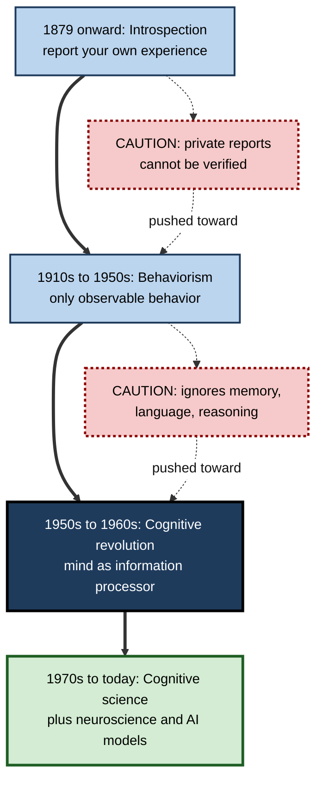
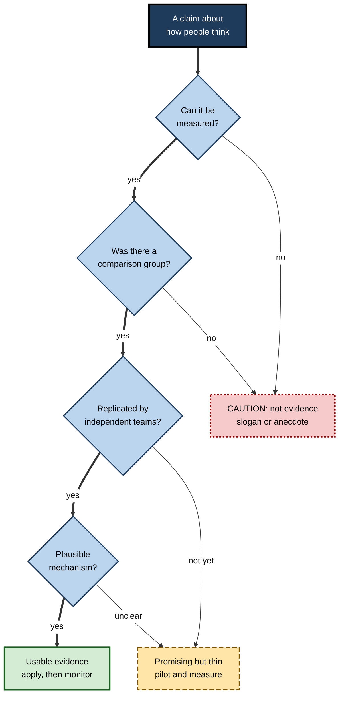
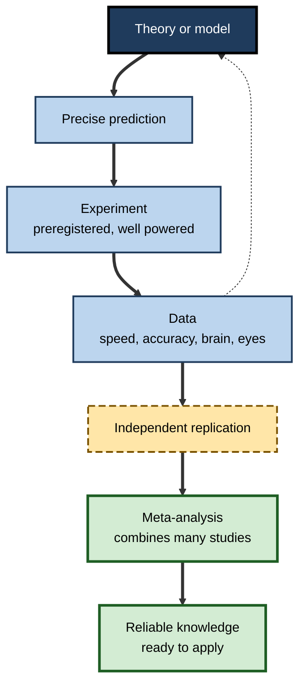

# C.1. Foundations of Cognitive Psychology

> **In one sentence:** Cognitive psychology is the science of how the mind takes in information, makes sense of it, stores it, and uses it to think, decide and act.
>
> **Why it matters:** Almost every modern job is "thinking work". Knowing how attention, memory, reasoning and judgement actually operate — and how scientists know it — lets you design better work, training, products and decisions, and lets you tell real science from confident-sounding pop psychology.
>
> **Level span:** Novice → Expert · **Reading time:** ~17 min · **Builds on:** nothing — start here

---

## The Learning Ladder

| Level | Badge | After this level you can... |
|---|---|---|
| 1 | NOVICE | Explain in plain words what cognitive psychology studies and why it is a science, not opinion. |
| 2 | FOUNDATIONS | Name its core topics, its key historical turning points and its central metaphor (the mind as an information processor). |
| 3 | PRACTITIONER | Read a cognitive-psychology claim at work and check whether the evidence behind it is strong, weak or missing. |
| 4 | ADVANCED | Explain levels of analysis, the main research methods and models, and what the replication crisis did — and did not — change. |
| 5 | EXPERT / PRO | Apply cognitive principles to design work, products and learning programmes, and judge new AI-era claims about "how people think". |

---

## Level 1 · Novice — The Big Picture

You cannot see a thought. Yet you can see its traces: how long someone takes to answer, which mistakes they make, what they remember tomorrow, where their eyes go on a screen. **Cognitive psychology** is the branch of psychology that uses those visible traces to work out what is happening inside the mind. Its subject is **cognition** — the mental activities of perceiving, paying attention, remembering, understanding language, solving problems, reasoning and deciding.

A helpful analogy is a detective at a crime scene. The detective never saw the crime, but footprints, timing and small inconsistencies allow a confident reconstruction of what happened. Cognitive psychologists do the same with the mind: they design careful little "scenes" (experiments), collect the clues (speed, accuracy, eye movements, brain signals), and infer the hidden process.

You have already met cognitive psychology many times:

- You looked for your keys that were right in front of you. **That is attention and perception at work — and their limits.**
- You remembered a song from fifteen years ago but not the name of the person you met this morning. **That is memory — encoding, storage and retrieval.**
- You picked the "safe" option at work because losing felt worse than winning would feel good. **That is decision making under uncertainty.**

The key idea for a beginner: **the mind has a structure, with real strengths and real limits, and those can be measured.** Once you know them, you can work with your mind instead of against it.

---

## Level 2 · Foundations — Core Concepts

### What cognitive psychology covers

The field is usually organised around the flow of information through a person. The rest of this subtopic follows the same order.

| Area | Core question | Covered in |
|---|---|---|
| Sensation and perception | How do raw signals become a meaningful world? | C.2 |
| Pattern recognition and categorisation | How do we recognise things and sort them into kinds? | C.3 |
| Concepts and representation | What form does knowledge take in the mind? | C.4 |
| Language | How do we understand and produce words and sentences? | C.5 |
| Problem solving and reasoning | How do we get from a problem to a solution? | C.6 |
| Decision making | How do we choose when the outcome is uncertain? | C.7 |
| Intelligence, expertise, aging, individual differences | Why do people differ, and how does cognition change? | C.8–C.11 |
| Application | How do we use all this to improve learning and work? | C.12 |

Attention, working memory and long-term memory are central to cognitive psychology too; in this map they have their own subtopics, so this note only touches them.

### A short history in four turns

1. **Introspection (late 1800s).** Wilhelm Wundt set up the first psychology laboratory in Leipzig in 1879 and trained observers to report their own conscious experience. The problem: reports were private and could not be checked. Hermann Ebbinghaus, working at the same time, took a more objective route and measured his own memory for nonsense syllables — an early sign of what was to come.
2. **Behaviorism (roughly 1910s–1950s).** John B. Watson and later B. F. Skinner argued psychology should study only observable behavior and rewards. This brought rigour but left "the mind" out of science.
3. **The cognitive revolution (1950s–1960s).** Several developments arrived together: George Miller's 1956 paper on the limits of short-term memory, Noam Chomsky's 1959 critique of Skinner's account of language, early computer programs that solved problems, and information theory. Ulric Neisser's 1967 textbook *Cognitive Psychology* gave the field its name.
4. **Cognitive science and neuroscience (1970s–today).** Cognitive psychology joined linguistics, computer science, neuroscience, philosophy and anthropology. Brain imaging, computational modelling and, most recently, large AI models became part of its toolkit.

**Figure C.1-1 — From introspection to cognitive science.**

*How to read it:* thick arrows show the main sequence; dotted-border boxes show the weakness of each approach that pushed the field to the next.

### The central metaphor: the mind as an information processor

The cognitive revolution's big idea is that the mind can be studied as a system that **represents** information (holds it in some form) and **processes** it (transforms it step by step). Input arrives through the senses, is filtered by attention, held and manipulated in working memory, linked to long-term knowledge, and turned into output: speech, action, a decision. Sibling notes on the information-processing model and on working memory cover that pipeline in depth; here the point is the *stance*: mental processes are real, ordered, limited in capacity, and measurable.

### Key terms

| Term | Plain meaning |
|---|---|
| **Cognition** | All mental activity involved in knowing: perceiving, attending, remembering, thinking, deciding. |
| **Mental representation** | The form in which information is held in the mind, such as an image, a word meaning or a rule. |
| **Mental process** | An operation performed on representations, such as comparing, retrieving or inferring. |
| **Reaction time (RT)** | How long a person takes to respond; a classic window into hidden processing. |
| **Construct** | A theoretical idea (for example "working memory capacity") that cannot be seen directly but is measured indirectly. |
| **Operational definition** | The exact measurement used to stand in for a construct in a study. |
| **Model** | A precise, testable description of how a mental process works, often written as a diagram or computer program. |

---

## Level 3 · Practitioner — Putting It to Work

At work you constantly meet claims about the mind: "people only use 10% of their brains", "we have an eight-second attention span", "visual learners need diagrams", "this tool reduces cognitive load". The most useful practical skill from this note is **checking such a claim like a cognitive psychologist**.

### The five-question claim check

1. **What exactly is the claim?** Restate it as something that could be measured. "Reduces cognitive load" becomes "people make fewer errors or finish faster on task X, with less reported effort".
2. **What was measured, and on whom?** Was it reaction time in a lab with students, or performance of real employees on real tasks? Lab findings often transfer, but not automatically.
3. **Was there a comparison?** Without a control condition (an alternative design, a no-training group), you cannot tell whether the intervention or something else caused the change.
4. **How big and how stable is the effect?** Has it been repeated by independent teams? Is there a meta-analysis — a study that statistically combines many studies? Is the effect large enough to matter in practice?
5. **Is there a plausible mechanism?** Does the claim fit what is known about perception, memory or attention, or does it rely on a vague brain story?

**Figure C.1-2 — Checking a "how people think" claim.**

*How to read it:* follow the thick path; a claim must pass every gate to count as usable evidence. Long-dash boxes mean "try carefully"; dotted boxes mean "do not rely on it".

### Worked example — a product team and the "eight-second attention span"

| | Before | After applying the claim check |
|---|---|---|
| **Claim** | "Users have an eight-second attention span, shorter than a goldfish, so every screen must be tiny." | Restated: "Users abandon long onboarding screens." |
| **Evidence** | A widely shared statistic with no traceable study behind it. | The team finds the statistic has no credible source; attention depends heavily on task and motivation. |
| **Action** | Cut every explanation to one line, including critical safety warnings. | Run an A/B test on onboarding length; measure task completion and error rate. |
| **Result** | Support tickets rise because key steps are now unexplained. | Short screens win for routine steps; a longer, well-structured explanation wins for the one risky step. |

### Common mistakes at this level

- **Treating a brain image as proof.** A colourful scan of an active region does not show that a training method works.
- **Generalising from one study.** A single surprising result is a hypothesis, not a fact.
- **Confusing a construct with its measure.** "Engagement" measured as clicks may not be engagement in the sense you care about.
- **Ignoring individual differences.** An average effect can hide people who benefit a lot and people who are harmed.

---

## Level 4 · Advanced — Mechanisms, Models & Evidence

### Levels of analysis

David Marr, a vision scientist, proposed in 1982 that any information-processing system can be understood at three complementary levels. The framework is still the standard way to organise explanations in cognitive science.

| Level | Question | Example: recognising a friend's face |
|---|---|---|
| **Computational** | What problem is being solved, and why? | Identify a specific person from an image despite changes in lighting, angle and expression. |
| **Algorithmic / representational** | What representations and steps solve it? | Compare the image's configuration of features against stored face representations. |
| **Implementational** | How is it physically realised? | Networks of neurons in face-selective regions of the visual cortex. |

Confusion between levels drives many bad arguments. "Learning is just synapses changing" is true at the implementational level but tells a trainer nothing about which practice schedule to use — that is an algorithmic-level question.

### How cognitive psychologists know what they know

| Method | What it measures | Strength | Limitation |
|---|---|---|---|
| **Chronometry** (reaction time) | Speed of mental steps; Franciscus Donders's 1868 subtraction method was the first version | Precise, cheap, highly replicable within person | Indirect; needs careful task design |
| **Accuracy and error patterns** | Which mistakes people make | Errors reveal the underlying process | Ceiling and floor effects |
| **Eye tracking** | Where and how long people look | Moment-by-moment processing during reading or search | Looking is not always attending |
| **Neuroimaging** (fMRI, EEG, MEG) | Where and when brain activity changes | Links mind to brain | Costly; small samples; reverse-inference risk |
| **Neuropsychology** | Effects of brain damage on specific abilities | Shows which functions can come apart | Rare cases, hard to generalise |
| **Computational modelling** | Whether a precise theory reproduces human data | Forces theories to be explicit | A good fit does not prove the mechanism |
| **Large-scale online and field data** | Behavior from thousands of people or real settings | Statistical power, realism | Less control over conditions |

### The main families of models

- **Symbolic architectures** such as ACT-R (John Anderson) model cognition as rules operating on structured symbols, with timing parameters fitted to human data.
- **Connectionist (neural network) models** model cognition as patterns of activation across many simple units, learning by adjusting connection strengths. Modern deep learning descends from this tradition.
- **Bayesian and predictive-processing models** treat the mind as making probabilistic inferences — combining prior expectations with incoming evidence. In predictive-processing accounts, the brain continually predicts its input and mainly processes the mismatch, called **prediction error**. This framework is influential and actively debated.
- **Embodied and situated approaches** stress that cognition is shaped by the body, action and environment; a sibling note covers embodied cognition.

**Figure C.1-3 — How the research cycle builds reliable knowledge.**

*How to read it:* the dotted arrow is the feedback loop that revises theory; only findings that survive replication and meta-analysis reach the outcome box.

### What the replication crisis changed

From around 2011, large replication projects showed that many published psychology findings did not repeat. The picture for cognitive psychology was comparatively good: in the best-known large-scale replication project, cognitive findings replicated at roughly twice the rate of social-psychology findings, and within-subject designs with many trials per person replicated best. Effects such as the Stroop effect, serial-position effects in memory and the testing effect are among the most reliable results in all of psychology.

Some famous applied claims fared worse. Ego depletion, many "priming" effects on behavior, and several eye-catching nudges shrank or vanished in large preregistered studies. Analyses of the literature published in 2025 suggest that the evidential strength of typical psychology papers has improved since the crisis, with fewer results sitting just under the significance threshold. The practical lesson: **prefer old, boring, repeatedly replicated cognitive findings over new, surprising, single-study ones.**

### What recent research added: AI as a model of the mind

Since 2023, large language models have entered cognitive psychology in three roles. First, as **tools**: running and analysing experiments. Second, as **subjects**: researchers test whether models show human-like biases. Third, as **candidate models of cognition**. A 2025 study introduced *Centaur*, a language model fine-tuned on trial-by-trial data from tens of thousands of participants across 160 experiments, which predicted held-out human choices better than many classic cognitive models. Critics replied that prediction is not explanation: the model does not say *how* the mind produces behavior, it shows superhuman abilities (for example, recalling far more digits than people can), and it can succeed by exploiting statistical cues rather than understanding instructions. The debate captures a lasting principle: **a model is useful in cognitive psychology to the extent that it explains, not only predicts.**

---

## Level 5 · Expert / Pro — Professional Mastery

### Where cognitive psychology is used professionally

| Field | What it borrows | Example |
|---|---|---|
| **Human factors and safety** | Attention limits, signal detection, error types | Cockpit and control-room design; surgical checklists |
| **UX and product design** | Perception, recognition over recall, mental models | Interfaces that show options instead of making users remember commands |
| **Learning and development** | Memory, retrieval, spacing, cognitive load | Spaced, scenario-based training with delayed checks |
| **Behavioral economics and policy** | Judgement and decision biases | Default options in pension enrolment |
| **Personnel selection** | Cognitive ability, job knowledge, structured judgement | Work-sample tests and structured interviews |
| **AI evaluation and alignment** | Experimental methods, theory of mind tasks, bias tests | Testing whether a model's errors resemble human errors |

### Professional scenario

**Role:** Head of learning at a consulting firm.
**Situation:** A vendor pitches a "brain-based" leadership programme claiming to "rewire neural pathways" and "activate the right hemisphere for creativity".
**What the pro does:** Translates the pitch into testable claims at the algorithmic level ("participants make better staffing decisions on realistic cases six weeks later"). Notes that hemispheric "creativity" claims are a known neuromyth and that a brain image is not outcome evidence. Asks the vendor for any controlled evaluation. When none exists, runs a small pilot against the firm's existing programme, with a delayed, scenario-based assessment rated blind by senior staff. The decision is made on that data, not on the vocabulary.

### Expert-level judgement

- **Pick the right level of explanation.** Neural detail rarely changes a design decision; behavior-level evidence usually does.
- **Respect boundary conditions.** Most cognitive effects depend on prior knowledge, task type and timing. Ask "for whom, on what, and when?"
- **Prefer effect sizes and replication to p-values and press releases.**
- **Use AI as a lab assistant and a hypothesis generator, not as a stand-in for people.** Simulated participants can help design a study; they do not replace data from real users or learners.
- **Keep ethics in view.** Cognitive insights can be used to help people decide better or to exploit their limits (dark patterns). Professionals choose the first.

---

## Myths vs. Evidence

| Myth | What the evidence shows |
|---|---|
| "We only use 10% of our brains." | Imaging shows activity across virtually the whole brain over a day; damage to almost any region has effects. |
| "Cognitive psychology is just common sense." | Many robust findings are counter-intuitive, such as testing beating re-reading or confident eyewitnesses being wrong. |
| "A brain scan proves a method works." | Brain activity is not an outcome; behavior and performance evidence decide whether a method works. |
| "People are left-brained or right-brained." | Both hemispheres work together on almost all tasks; personality-style "brain dominance" is not supported. |
| "All psychology failed to replicate." | Replication rates vary widely; core cognitive findings with within-person designs replicate well. |
| "AI models now think like humans, so we can skip human studies." | Models can predict some choices well but differ in important ways and do not explain mechanisms. |

## Practitioner Toolkit

**Claim-check card (use before adopting any "brain" or "psychology" idea)**

- [ ] I restated the claim as a measurable outcome.
- [ ] I know who was studied and in what setting.
- [ ] There was a comparison or control group.
- [ ] The effect has been independently replicated or meta-analysed.
- [ ] The effect is big enough to matter for my situation.
- [ ] I can name the cognitive mechanism in one sentence.
- [ ] I have a plan to measure the outcome in my own context.

**Template — one-line evidence log**

| Claim | Measured outcome | Evidence type (anecdote / single study / replicated / meta-analysis) | Decision | Review date |
|---|---|---|---|---|
| | | | | |

## Self-Check

1. **[NOVICE]** What does cognitive psychology study?
2. **[NOVICE]** Why can cognitive psychologists study thoughts they cannot see?
3. **[FOUNDATIONS]** What were the weaknesses of introspection and of behaviorism?
4. **[FOUNDATIONS]** What is the central metaphor of the cognitive revolution?
5. **[PRACTITIONER]** Restate "this app boosts focus" as a measurable claim.
6. **[ADVANCED]** Name Marr's three levels and give an example of confusing them.
7. **[ADVANCED]** Which kinds of cognitive findings replicated best, and why?
8. **[EXPERT / PRO]** A model predicts human choices better than older theories. Why might cognitive psychologists still not accept it as an explanation?
9. **[EXPERT / PRO]** How would you evaluate a "brain-based" training vendor?

### Answer Key

1. Mental processes such as perceiving, attending, remembering, using language, reasoning and deciding.
2. They infer hidden processes from measurable traces: reaction time, accuracy, errors, eye movements, brain signals.
3. Introspection relied on private, unverifiable reports; behaviorism excluded internal mental processes such as memory and language.
4. The mind as an information processor that represents and transforms information in stages with limited capacity.
5. For example: "Users who use the app complete a defined task with fewer errors or less time than a comparison group, measured over several weeks."
6. Computational, algorithmic/representational, implementational. Example: arguing that because learning is "synapses changing", the practice schedule does not matter.
7. Classic within-subject effects with many trials per person, such as the Stroop and testing effects; they have high statistical power and low noise.
8. Prediction is not explanation: it may exploit statistical cues, show non-human abilities, and not specify mechanisms.
9. Translate claims into measurable outcomes, ask for controlled evaluations, reject neuromyths, and pilot against a comparison with delayed, blind-rated assessment.

## Key Takeaways

- Cognitive psychology studies **how the mind processes information**, inferring invisible processes from measurable behavior.
- It grew from introspection and behaviorism into the **cognitive revolution** and then into interdisciplinary **cognitive science**.
- Its core stance: mental processes are **real, ordered, capacity-limited and measurable**.
- **Marr's three levels** keep explanations clear; most practical decisions live at the algorithmic level.
- Classic cognitive findings are among the **most replicable** in psychology; flashy single studies are not.
- Large AI models are now tools, subjects and candidate models of mind — **prediction is not the same as explanation**.
- Professionals apply the field by **testing claims, measuring outcomes and designing for real human limits**.

## Glossary

| Term | Meaning |
|---|---|
| Behaviorism | An approach that studied only observable behavior and its reinforcement. |
| Cognition | Mental activity involved in acquiring and using knowledge. |
| Cognitive revolution | The 1950s–60s shift back to studying internal mental processes scientifically. |
| Computational model | A theory written precisely enough to simulate behavior. |
| Construct | A theoretical attribute measured indirectly. |
| Introspection | Reporting one's own conscious experience. |
| Levels of analysis | Marr's computational, algorithmic and implementational descriptions of a system. |
| Meta-analysis | A statistical synthesis of many studies of the same question. |
| Prediction error | The mismatch between what the brain expected and what it received. |
| Reaction time | Time between a stimulus and a response. |
| Replication | Repeating a study to check whether its result holds. |
| Representation | The form in which information is held in the mind. |
