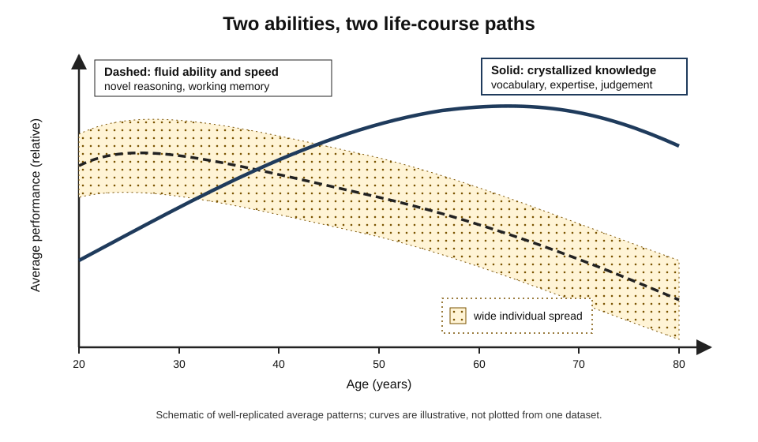
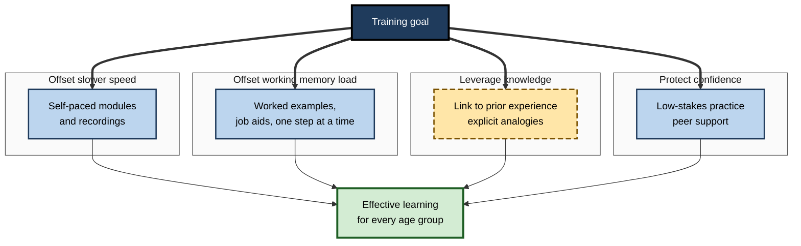
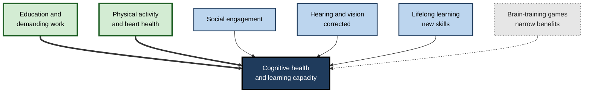

# C.10. Cognitive Aging and Learning

> **In one sentence:** Cognitive aging is the normal, gradual change in thinking abilities across adulthood — some abilities such as processing speed slowly decline from early adulthood while others such as knowledge, vocabulary and judgement keep growing for decades — and adults of every age can keep learning effectively.
>
> **Why it matters:** Workforces are older than ever, careers are longer, and reskilling never stops. Knowing what really changes with age — and what does not — lets you keep learning throughout your own career, design training that works for every age group, and reject the myth that older workers "can't learn new things".
>
> **Level span:** Novice → Expert · **Reading time:** ~18 min · **Builds on:** Intelligence and cognitive ability

---

## The Learning Ladder

| Level | Badge | After this level you can... |
|---|---|---|
| 1 | NOVICE | Explain which mental abilities tend to change with age and which do not. |
| 2 | FOUNDATIONS | Describe fluid versus crystallized trajectories, processing speed, and cross-sectional versus longitudinal findings. |
| 3 | PRACTITIONER | Adapt your own learning, and training you design, to work well across ages. |
| 4 | ADVANCED | Explain cognitive reserve, compensation, brain-training evidence and the latest long-term trials. |
| 5 | EXPERT / PRO | Build age-inclusive learning and work systems and counter ageism with evidence. |

---

## Level 1 · Novice — The Big Picture

Think of two colleagues: a 25-year-old who picks up a new app in minutes, and a 58-year-old who takes longer with the app but instantly sees which client request will become a problem. Both are showing normal cognitive aging. Some abilities — raw speed, juggling many new details at once — peak early in adulthood and decline slowly afterwards. Others — knowledge, vocabulary, understanding people, judgement in familiar domains — keep growing well into later life.

An analogy: a younger mind is like a fast new laptop with a nearly empty hard drive; an older mind is like a slightly slower laptop with a huge, well-organised library of files and shortcuts. For brand-new tasks, the fast laptop has an edge. For tasks where the library helps, the experienced machine often wins.

You may have noticed:

- It takes longer to recall a name than it used to, though you know it perfectly. **Retrieval slows; knowledge remains.**
- A relative in their seventies does crosswords faster than you. **Crystallized knowledge keeps growing.**
- Learning a new programming language at 45 felt harder than at 20, but you still learned it, partly by linking it to what you knew. **Learning continues; strategies shift.**

The key idea for a beginner: **aging changes *how* we learn more than *whether* we can learn.**

---

## Level 2 · Foundations — Core Concepts

### Two trajectories

Following Raymond Cattell and John Horn's distinction (see the intelligence note):

- **Fluid abilities** — processing speed, reasoning with new material, working memory, and episodic memory for new events — tend to peak in the twenties and decline gradually, with steeper average decline after about 60 to 70.
- **Crystallized abilities** — vocabulary, general knowledge, domain expertise — tend to rise through middle age and remain stable into the seventies or beyond.

*Figure C.10-1 — Typical adult trajectories.* Solid line: crystallized knowledge rises and holds into later life. Dashed line: fluid abilities and processing speed peak early and decline gradually. The shaded band marks wide individual differences: many older adults outperform many younger ones. Schematic, based on well-replicated average patterns; not plotted from a single dataset.

### Processing speed as a driver

Timothy Salthouse's **processing-speed theory** proposes that a general slowing of mental operations explains much of the age-related decline in fluid tasks: when each step takes longer, information from early steps fades before later steps finish. Many age differences in reasoning and memory shrink substantially when speed is statistically accounted for.

### What changes and what does not

| Tends to decline (on average) | Tends to stay stable or improve |
|---|---|
| Processing speed | Vocabulary and verbal knowledge |
| Working memory for new information | Semantic (general) knowledge |
| Episodic memory, especially free recall | Procedural memory for well-practised skills |
| Inhibition of distractions; multitasking | Emotional regulation and emotional knowledge |
| Learning arbitrary new associations (e.g., names) | Judgement and pattern recognition in one's own domain |
| Speed of switching between tasks | Recognition memory (with cues) |

### Cross-sectional versus longitudinal evidence

Early studies compared different age groups at one time (**cross-sectional**). These exaggerate decline because older cohorts had less education and different life experiences. **Longitudinal** studies, following the same people over decades — such as K. Warner Schaie's Seattle Longitudinal Study — show that for most abilities, meaningful average decline starts later (often in the sixties) and varies enormously between people.

### Key terms

| Term | Plain meaning |
|---|---|
| **Cognitive aging** | Normal changes in cognition with age, not caused by disease. |
| **Processing speed** | How quickly mental operations are carried out. |
| **Episodic memory** | Memory for specific personal events. |
| **Semantic memory** | General knowledge of facts and meanings. |
| **Cohort effect** | Differences between generations caused by different life conditions, not age. |
| **Cognitive reserve** | Resilience that lets some people keep functioning despite brain aging or damage. |
| **Compensation** | Using alternative strategies or brain networks to maintain performance. |
| **Dementia** | Disease-related decline severe enough to impair daily life — *not* normal aging. |

---

## Level 3 · Practitioner — Putting It to Work

### Learning well at any age — and especially later

1. **Anchor new material to what you know.** Older learners have more knowledge to connect to; use analogies with prior work explicitly.
2. **Control the pace.** Self-paced learning reduces the disadvantage of slower processing; ask for recordings and written summaries.
3. **Reduce distractions and multitasking.** Inhibition declines with age; protect focused learning time.
4. **Use external memory aids.** Notes, checklists and calendars offset working-memory limits at every age.
5. **Retrieve and space.** Self-testing and spaced review work for adults of all ages.
6. **Practise hands-on soon.** Doing the task early beats long explanations, especially for technology.
7. **Mind confidence.** Fear of looking slow can reduce participation more than any cognitive change; choose low-stakes practice settings.

**Figure C.10-2 — Designing training that works across ages.**

*How to read it:* each group targets one known age-related change or strength; all four together make training work across ages — and they help younger learners too.

### Worked example — rolling out a new CRM to a mixed-age sales team

| | Before | After |
|---|---|---|
| **Format** | One fast-paced 3-hour live demo; slides shared afterwards. | Short self-paced videos, a printable one-page workflow guide, hands-on sandbox from day one. |
| **Framing** | "This replaces how you used to work." | "These are the same customer steps you know, in a new place" — mapping old workflow to new screens. |
| **Support** | Help desk tickets. | Peer champions of mixed ages; drop-in practice hours. |
| **Result** | Older reps slower to adopt; some quietly keep spreadsheets. | Adoption gap between age groups narrows; overall adoption faster. |

### Common mistakes at this level

- **Assuming slower means unable.** Speed and capacity to learn are different.
- **Fast, dense live sessions only.** These disadvantage anyone with slower processing or less background.
- **Ignoring prior knowledge.** Treating experienced staff as blank slates wastes their biggest asset.
- **Confusing normal aging with dementia.** Forgetting names is normal; losing the ability to manage daily tasks is not.

---

## Level 4 · Advanced — Mechanisms, Models & Evidence

### The brain side, briefly

With age, average brain volume decreases, especially in the prefrontal cortex and hippocampus, white-matter connections become less efficient, and dopamine signalling declines. Neuroplasticity — the brain's ability to change — continues throughout life, though it is less pronounced than in youth; a sibling subtopic covers it.

### Compensation and reserve

Older adults often recruit **more widespread brain activity** — for example both hemispheres for a task younger adults do with one — which some researchers interpret as compensation. The **scaffolding theory of aging and cognition** (Denise Park and Patricia Reuter-Lorenz) describes the brain building alternative networks to maintain function.

**Cognitive reserve** (associated with Yaakov Stern) explains why people with similar brain changes differ in function: education, cognitively demanding work, bilingualism and rich social and leisure activity are associated with greater resilience. Much of this evidence is correlational, and people with higher reserve may also differ in other ways.

### A whole-person view: peaking in midlife

A 2025 study published in the journal *Intelligence* combined age trajectories of 16 dimensions — cognitive abilities plus traits such as emotional stability, conscientiousness and resistance to cognitive biases. Fluid abilities declined from early adulthood, but crystallized knowledge, emotional intelligence and several personality traits rose; weighting them together, overall psychological functioning peaked at roughly **55 to 60**. The study relies on cross-sectional trajectories and on choices about weighting, but it matches a long-standing observation: leadership, judgement and career achievement often peak well after raw speed does.

### Brain training — what works and what does not

| Claim | Evidence |
|---|---|
| Commercial brain games improve everyday cognition | Improvement on trained tasks is common; transfer to untrained, everyday abilities is weak. Large consensus statements and meta-analyses have repeatedly concluded this. |
| Working-memory training boosts intelligence in older adults | A comprehensive meta-analysis found no meaningful far transfer. |
| Cognitive training produces moderate gains on related tasks | A 2025 meta-analysis of neuroimaging training studies in older adults found moderate improvements in cognitive function, with changes in brain activation — near transfer, not general enhancement. |
| Training can reduce dementia risk | The **ACTIVE** trial randomised 2,802 older adults to memory, reasoning or speed-of-processing training or no-contact control. A 20-year follow-up using medical claims, published in 2026, found that speed training *with booster sessions* was associated with about a quarter lower risk of diagnosed dementia, while memory and reasoning training and speed training without boosters showed no comparable benefit. This is a striking but single result based on claims data; it needs replication. |

### Lifestyle and risk factors

The 2024 *Lancet* Commission on dementia identified 14 modifiable risk factors across life — including less education, hearing loss, high blood pressure, physical inactivity, smoking, social isolation, untreated vision loss and high LDL cholesterol — and estimated that nearly half of dementia cases might theoretically be prevented or delayed by addressing them. For learning at work, hearing and vision matter directly: uncorrected sensory loss makes learning harder and is often mistaken for cognitive decline.

**Figure C.10-3 — What supports cognitive health across adulthood.**

*How to read it:* thick arrows show the factors with the strongest evidence; the dotted arrow from brain games indicates weak, narrow effects. Evidence is largely observational.

---

## Level 5 · Expert / Pro — Professional Mastery

### Age-inclusive learning and work design

| Area | Evidence-based practice |
|---|---|
| Training design | Self-paced options, worked examples, job aids, hands-on practice, explicit links to prior experience |
| Technology rollouts | Map old workflows to new tools; peer champions across ages; sandbox environments |
| Career development | Offer reskilling to all ages; avoid assumptions that older staff do not want or cannot use training |
| Team composition | Mixed-age teams combine speed and novelty with judgement and institutional knowledge |
| Knowledge retention | Capture senior expertise before retirement through mentoring and case libraries |
| Accessibility | Readable fonts, good contrast, captions, hearing support — help everyone |

### Ageism and evidence

Stereotypes that older workers are less able to learn, less motivated or worse with technology are common and often wrong at the individual level. Meta-analyses of age and job performance generally find little overall relationship, with older workers often scoring higher on reliability and organisational citizenship. Age differences in training *speed* are real on average, but with suitable design, final training outcomes differ much less. **Stereotype threat** — performing worse when reminded of a negative stereotype about one's group — has been proposed for older adults' memory; the broader stereotype-threat literature has faced replication challenges, so treat the size of such effects as uncertain.

### AI and aging learners

Generative AI can help older learners by explaining at their own pace and answering "basic" questions without embarrassment; it can also widen gaps for those less comfortable with new tools. Good programmes introduce AI tools with hands-on, low-stakes practice and pair them with peer support.

### Professional scenario

**Role:** HR director at a utility company where 40% of engineers will retire within ten years.
**Situation:** Managers assume older engineers will resist new digital-twin software and plan to rely on recent graduates.
**What the pro does:** Presents evidence that capacity to learn persists and that experienced engineers hold irreplaceable judgement. Designs mixed-age pairs: senior engineers bring domain cues, juniors bring tool fluency, and both are trained together with self-paced modules and sandboxes. Uses the pairing to capture tacit knowledge in annotated cases. Tracks adoption and incident rates by team, not by age.

### Expert-level judgement

- **Separate speed from capacity** in every judgement about older learners.
- **Treat knowledge as the asset** that it is; design learning to connect to it.
- **Be precise about brain training:** narrow benefits, a promising but unreplicated long-term dementia signal for speed training with boosters.
- **Design for the whole age range;** good design for older learners is good design for all.

---

## Myths vs. Evidence

| Myth | What the evidence shows |
|---|---|
| "You can't teach an old dog new tricks." | Adults learn throughout life; speed changes more than capacity. |
| "Cognitive decline starts at 30 and is steep." | Fluid speed declines gradually; meaningful average decline in most abilities starts later, with large individual differences. |
| "Memory loss is a normal part of aging." | Some slowing is normal; significant loss interfering with daily life signals disease, not normal aging. |
| "Brain games will keep your mind young." | Gains are mostly on trained tasks; broad benefits are not established. |
| "Older workers perform worse." | Overall, age is weakly related to job performance. |
| "Everyone declines at the same rate." | Variation between people increases with age. |

## Practitioner Toolkit

**Age-inclusive training checklist**

- [ ] Learners can control pace (recordings, self-paced modules).
- [ ] New content is explicitly linked to prior experience.
- [ ] Worked examples and job aids reduce working-memory load.
- [ ] Hands-on practice starts early in a safe sandbox.
- [ ] Materials are readable: font size, contrast, captions.
- [ ] Practice is low-stakes; peer support is available.
- [ ] Outcomes are measured by final competence, not speed of completion.

**Personal lifelong-learning routine**

1. One new skill per quarter, linked to something you already know.
2. Short, spaced sessions with self-testing.
3. Protect distraction-free time.
4. Check hearing and vision regularly.
5. Keep physically active and socially engaged.

## Self-Check

1. **[NOVICE]** Which abilities tend to decline with age and which tend to grow?
2. **[NOVICE]** Is forgetting names a sign of dementia?
3. **[FOUNDATIONS]** What is processing-speed theory?
4. **[FOUNDATIONS]** Why do cross-sectional studies exaggerate decline?
5. **[PRACTITIONER]** Name four design changes that make training work better across ages.
6. **[ADVANCED]** What is cognitive reserve, and what kind of evidence supports it?
7. **[ADVANCED]** What did the ACTIVE 20-year follow-up find, and what are its limits?
8. **[EXPERT / PRO]** How would you counter the assumption that older staff cannot adopt new technology?
9. **[EXPERT / PRO]** What did the 2025 "peak in midlife" study claim, and what caveats apply?

### Answer Key

1. Declining on average: processing speed, working memory, episodic recall, multitasking. Stable or growing: vocabulary, knowledge, domain judgement, emotional regulation.
2. Not by itself; occasional slower name retrieval is normal. Decline that disrupts daily life warrants assessment.
3. A general slowing of mental operations accounts for much age-related decline in fluid tasks.
4. They compare different generations with different education and experiences (cohort effects).
5. Self-paced options, worked examples and job aids, explicit links to prior knowledge, early hands-on practice, low-stakes settings, accessible materials.
6. Resilience that lets people function despite brain changes; mainly correlational evidence linking education, demanding work and engagement with better outcomes.
7. Speed training with boosters was associated with about a quarter lower risk of diagnosed dementia over 20 years; memory and reasoning training were not. Limits: claims-based diagnosis, single trial, needs replication.
8. Present evidence on learning capacity and job performance, design inclusive training, use mixed-age pairs, and measure outcomes by team.
9. Combining cognitive and personality dimensions, overall functioning peaked around 55 to 60. Caveats: cross-sectional trajectories and weighting choices.

## Key Takeaways

- **Fluid abilities and speed decline gradually; crystallized knowledge and judgement grow** into later life.
- **Processing speed** explains much of the fluid decline.
- **Individual differences** are large and increase with age; longitudinal data show later decline than cross-sectional data.
- **Aging changes how we learn, not whether we can.** Self-pacing, prior knowledge and reduced load help.
- **Brain games have narrow benefits;** education, activity, social engagement and sensory health matter more.
- A 20-year trial suggests **speed training with boosters** may lower dementia diagnosis — promising, unreplicated.
- Design **age-inclusive** learning and challenge ageist assumptions with evidence.

## Glossary

| Term | Meaning |
|---|---|
| ACTIVE trial | Large randomised trial of cognitive training in older adults with 20-year follow-up. |
| Cognitive aging | Normal, non-disease age-related changes in cognition. |
| Cognitive reserve | Resilience to brain changes built through life experiences. |
| Cohort effect | Generational difference not caused by age itself. |
| Compensation | Maintaining performance via alternative strategies or networks. |
| Cross-sectional study | Comparing different age groups at one time. |
| Crystallized abilities | Knowledge-based abilities that grow with experience. |
| Dementia | Disease-related decline impairing daily functioning. |
| Fluid abilities | Speed, novel reasoning and working memory. |
| Longitudinal study | Following the same people over time. |
| Processing speed | Rate at which mental operations are executed. |
| Scaffolding theory | Account of the aging brain building compensatory networks. |
