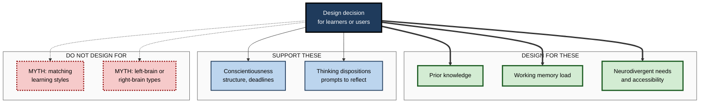
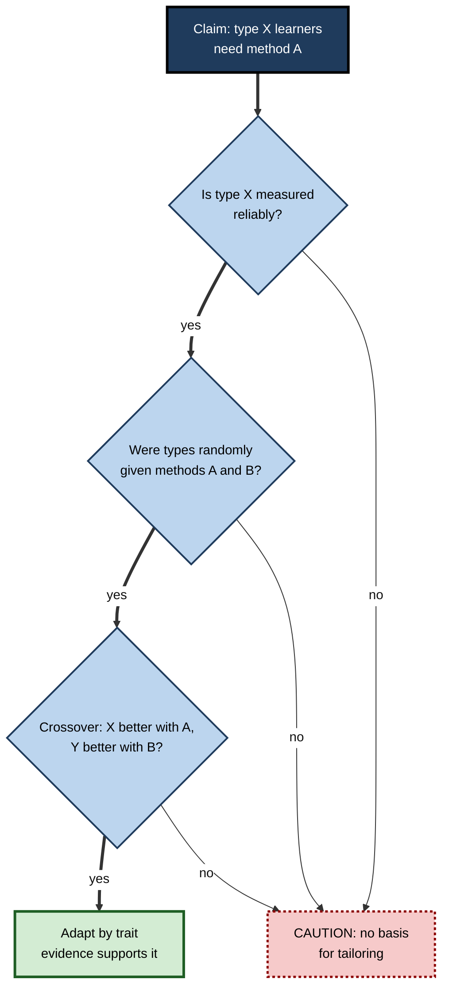

# C.11. Individual Differences in Cognition

> **In one sentence:** Individual differences in cognition are the stable ways people vary in how they perceive, remember, think and learn — in ability, prior knowledge, working memory, thinking dispositions, personality and neurotype — and some of these differences matter for learning far more than others.
>
> **Why it matters:** Every team, classroom and customer base contains people who think differently. Knowing which differences are real and consequential (prior knowledge, working memory, conscientiousness) and which are largely myths (learning styles, left-brain/right-brain) lets you design work and training that fits real people, and stops you wasting effort on labels that do not help.
>
> **Level span:** Novice → Expert · **Reading time:** ~18 min · **Builds on:** Intelligence and cognitive ability

---

## The Learning Ladder

| Level | Badge | After this level you can... |
|---|---|---|
| 1 | NOVICE | Give examples of how people differ in thinking and learning, and why it matters. |
| 2 | FOUNDATIONS | Name the main dimensions of cognitive difference and how strongly each is supported by evidence. |
| 3 | PRACTITIONER | Design learning and work that accommodate real differences without relying on myths. |
| 4 | ADVANCED | Explain aptitude–treatment interactions, the expertise reversal effect, the learning-styles evidence and the growth-mindset debate. |
| 5 | EXPERT / PRO | Build inclusive, neurodiversity-aware systems and use personalisation and AI adaptivity responsibly. |

---

## Level 1 · Novice — The Big Picture

Give the same report to five colleagues. One spots a calculation error immediately. Another needs a diagram before the argument makes sense. A third already knows the topic and skims. A fourth gets distracted by background noise. A fifth asks a question nobody else thought of. They are all capable — but they differ in how their minds take in and handle the same information.

**Individual differences** are the ways people consistently vary from one another. In cognition, these include how much they already know, how much they can hold in mind at once, how quickly they process information, how they prefer to approach problems, and how their brains are wired (for example dyslexia or ADHD).

An analogy: people are like different vehicles — a bicycle, a van, a sports car, a tractor. The same road works for all of them, but signs, lanes and ramps designed with the range of vehicles in mind help everyone arrive safely. Good learning design is road design for many kinds of minds.

You have experienced this:

- A friend learned a language effortlessly while you struggled — but you were far quicker with numbers. **Differences in specific abilities.**
- You understood an advanced talk easily because you already knew the field. **Prior knowledge — the biggest difference of all.**
- You "prefer" videos to reading. **A preference — which, research shows, does not mean you learn better that way.**

The key idea for a beginner: **people really do differ, but the differences that matter most are not always the ones people talk about.**

---

## Level 2 · Foundations — Core Concepts

### The main dimensions, and how much they matter

| Dimension | What it is | Strength of evidence that it affects learning or performance |
|---|---|---|
| **Prior knowledge** | What a person already knows in the domain | Very strong — typically the single best predictor of new learning |
| **General cognitive ability** | Reasoning and learning speed (see intelligence note) | Strong, especially for new, complex material |
| **Working memory capacity** | How much information can be held and manipulated at once | Strong for complex, novel tasks; covered in its own subtopic |
| **Processing speed** | How fast simple operations are done | Moderate; matters most under time pressure |
| **Conscientiousness** | Being organised, diligent, persistent | Consistent, moderate predictor of academic and job performance |
| **Openness / need for cognition** | Enjoyment of thinking and new ideas | Modest; linked to depth of engagement |
| **Thinking dispositions** | Tendencies such as actively open-minded thinking and reflection | Predict rational thinking beyond ability |
| **Metacognitive accuracy** | How well people judge their own knowledge | Important for self-directed learning; covered in its own subtopic |
| **Neurotype** | Dyslexia, ADHD, autism, dyscalculia and other neurodivergences | Real, specific effects; vary greatly between individuals |
| **"Learning styles"** (visual, auditory, kinesthetic) | Preferred mode of receiving information | Preferences exist; matching teaching to them does not improve learning |

**Figure C.11-1 — Which differences should drive design?**

*How to read it:* thick arrows show the differences with the strongest evidence for adapting design; dotted arrows lead to popular ideas the evidence does not support.

### Key terms

| Term | Plain meaning |
|---|---|
| **Individual differences** | Stable, measurable ways people vary from one another. |
| **Prior knowledge** | What a learner already knows that is relevant to the new material. |
| **Working memory capacity** | The amount of information a person can actively hold and work with. |
| **Thinking disposition** | A habitual tendency in how one thinks, such as reflecting before answering. |
| **Need for cognition** | How much a person enjoys effortful thinking. |
| **Neurodiversity** | The natural variation in human brains and minds, including dyslexia, ADHD and autism. |
| **Learning style** | A claimed preferred way of learning (for example visual); the matching idea is unsupported. |
| **Aptitude–treatment interaction** | When the best method differs depending on a learner characteristic. |

---

## Level 3 · Practitioner — Putting It to Work

### Designing for real differences

1. **Diagnose prior knowledge first.** A short pre-test or a few probing questions shows what people already know. Let experienced learners skip or test out; give novices more support.
2. **Reduce unnecessary working-memory load for everyone.** Clear structure, worked examples, diagrams placed next to the text they explain, and step-by-step job aids help most those with lower capacity and harm no one.
3. **Offer multiple means of access** — text plus captioned video, diagrams plus explanations — because some content is best shown visually and some learners need alternatives for access reasons, not because of "styles". This is the core of **Universal Design for Learning (UDL)**.
4. **Provide structure for self-regulation.** Deadlines, checklists and progress markers help learners who are less naturally organised.
5. **Ask about needs, do not assume them.** Neurodivergent colleagues often know exactly which adjustments help (quiet space, written instructions, flexible timing).
6. **Choose the format by the content, not the learner's label.** Teach maps with maps, pronunciation with audio, and motor skills with practice.

### Worked example — redesigning a compliance course

| | Before | After |
|---|---|---|
| **Assumption** | "People have different learning styles, so we offer a visual, an audio and a reading version, and let them choose." | "People differ mostly in what they already know and in access needs." |
| **Design** | Three parallel versions; same content for everyone. | A 5-minute diagnostic; experienced staff test out of known sections. Single version with captioned video, readable text, diagrams beside explanations. |
| **Result** | Triple the production cost; no difference in outcomes between versions. | Shorter time for experienced staff; better scores for novices; one version to maintain. |

### Common mistakes at this level

- **Labelling learners by "style"** and restricting what they get.
- **One-size-fits-all pacing** that bores experts and loses novices.
- **Treating accommodations as special favours** rather than good design.
- **Confusing preference with effectiveness.** People often prefer the method that feels easiest, not the one that works.

---

## Level 4 · Advanced — Mechanisms, Models & Evidence

### Aptitude–treatment interactions — mostly elusive, one robust exception

Lee Cronbach and Richard Snow spent years searching for **aptitude–treatment interactions (ATIs)**: cases where learners with one trait benefit from method A and those with another trait from method B. Most proposed interactions proved weak or inconsistent. The most robust exception involves **prior knowledge**: the **expertise reversal effect** shows that heavily guided instruction (such as worked examples) helps novices, while the same guidance can be redundant or harmful for more knowledgeable learners, who benefit more from problem solving. Adapting instruction to prior knowledge is therefore well supported; adapting to most other traits is not.

### The learning-styles evidence

The **meshing hypothesis** says learning improves when instruction matches a learner's style. A proper test needs a **crossover interaction**: visual learners do better with visual teaching *and* auditory learners do better with auditory teaching. A landmark 2008 review by Harold Pashler and colleagues found almost no studies with this design that supported the claim. More recent syntheses agree: studies that test matching directly show an effect close to zero, while correlations between style questionnaires and outcomes mostly reflect learning *strategies* and effort rather than styles. A 2024 meta-analysis found the required crossover pattern in only about a quarter of outcomes, with small effects. Yet surveys consistently find that a large majority of teachers believe in learning styles. The belief persists because preferences are real and because the idea feels respectful of individuality — but matching does not help.

### Thinking dispositions and rationality

Keith Stanovich and Richard West showed that intelligence and **rational thinking** are related but distinct. Many reasoning biases are only weakly related to cognitive ability, while dispositions such as **actively open-minded thinking** — seeking evidence against your own views, weighing it fairly — predict better reasoning beyond ability. Stanovich called the gap between intelligence and rational thought **dysrationalia**. Practical implication: smart people are not protected from biased reasoning; habits and processes are.

### Personality and cognition

Among the Big Five personality traits, **conscientiousness** is the most consistent predictor of academic and job performance, independent of ability. **Openness to experience** relates to crystallized knowledge and creative output. Personality and ability are largely separate dimensions; both matter.

### Neurodiversity

- **Dyslexia** is a specific difficulty with word decoding and spelling, typically rooted in phonological processing; comprehension of spoken language and reasoning can be strong.
- **ADHD** involves differences in sustained attention, impulsivity and executive function; performance often varies strongly with interest and environment.
- **Autism** involves differences in social communication and sensory processing, often with strengths in detail focus and systematic thinking.
- **Aphantasia** — absent voluntary visual imagery — shows that even "basic" mental experiences vary.

Effects vary widely between individuals; diagnosis labels describe patterns, not a person's whole profile. Much "special talent" folklore (for example that all autistic people are exceptional at maths) is a stereotype.

### Growth mindset — an evidence update

Carol Dweck's research suggested that believing abilities can grow (a **growth mindset**) improves achievement. Large-scale intervention studies and meta-analyses have produced conflicting conclusions: a 2022 meta-analysis by Brooke Macnamara and Alexander Burgoyne found that average effects on academic performance were very small and disappeared in the highest-quality studies; a competing 2023 meta-analysis found small effects concentrated in specific groups, such as students at risk of failing. Mindset is best seen as a minor, context-dependent factor, not a general lever.

**Figure C.11-2 — Testing a claimed individual-difference effect.**

*How to read it:* a tailoring claim needs all three gates; learning styles fail at the third, prior knowledge passes.

---

## Level 5 · Expert / Pro — Professional Mastery

### Personalisation and adaptive systems

Adaptive learning platforms and AI tutors promise personalisation. The evidence-based target for personalisation is **what the learner knows and can do right now** — adjusting difficulty, pacing, hints and practice to performance — not self-reported styles or personality. Intelligent tutoring systems that adapt to knowledge state have a good research record. Generative-AI tutors can adapt explanations to a learner's background and language, but should still be judged by delayed, unaided performance.

### Inclusive and neurodiversity-aware workplaces

| Practice | Benefit |
|---|---|
| Written agendas and follow-up summaries | Supports working memory, attention differences and second-language speakers |
| Quiet spaces and noise control | Helps sensory sensitivity and focus for everyone |
| Flexible formats (written, spoken, async) | Lets people contribute in their strongest mode |
| Clear, explicit expectations | Reduces ambiguity that some neurodivergent people find especially taxing |
| Structured interviews and work samples | Reduces bias against people whose social style differs |
| Adjustments on request, without demanding diagnosis | Lowers barriers; many adults are undiagnosed |

### Professional scenario

**Role:** L&D manager for a 600-person engineering organisation.
**Situation:** A vendor offers a "learning style profiler" to personalise every course; leadership likes the idea.
**What the pro does:** Summarises the evidence: preferences are real, matching does not improve learning, and the money is better spent on adapting to knowledge. Proposes instead: short diagnostics at the start of each course, test-out options for experienced engineers, worked examples and hints for novices, captioned videos and accessible documents for everyone, and an optional quiet-room and written-format policy for workshops. Pilots it on two courses, measuring time saved and delayed assessment scores.

### Ethical limits

- **Labels can become limits.** Telling someone they are a "visual learner" or "not a numbers person" can narrow what they attempt.
- **Data on cognitive traits is sensitive.** Ability, neurotype and personality data require consent, purpose limitation and security.
- **Averages are not individuals.** Group-level differences say little about any one person.

---

## Myths vs. Evidence

| Myth | What the evidence shows |
|---|---|
| "People learn better when teaching matches their learning style." | Direct tests of matching show near-zero benefit; teach by content and prior knowledge instead. |
| "People are left-brained (logical) or right-brained (creative)." | Both hemispheres work together; no such personality-like dominance types. |
| "Smart people reason without bias." | Many biases are only weakly related to intelligence; dispositions and processes matter. |
| "A growth-mindset workshop will raise performance." | Average effects are very small and contested; benefits, if any, are concentrated in specific groups. |
| "Neurodivergent means less capable." | Neurodivergent profiles include both difficulties and strengths; environment strongly shapes performance. |
| "Personalisation means asking how people like to learn." | Effective personalisation adapts to what learners know and do. |

## Practitioner Toolkit

**Evidence-based personalisation checklist**

- [ ] I measure prior knowledge before instruction.
- [ ] Experienced learners can test out or skip.
- [ ] Novices get worked examples and step-by-step guidance.
- [ ] Format is chosen by content, with accessible alternatives for all.
- [ ] Structure (deadlines, checklists) supports self-regulation.
- [ ] Adjustments are available on request without requiring diagnosis.
- [ ] Success is measured by delayed performance, not satisfaction.

**Myth-detector questions for any "learner type" tool**

1. Does it measure the trait reliably?
2. Has matching been tested with random assignment and a crossover design?
3. Is the effect larger than simply teaching everyone well?

## Self-Check

1. **[NOVICE]** Name three ways people differ in thinking and learning.
2. **[NOVICE]** What is the difference between a learning preference and learning effectiveness?
3. **[FOUNDATIONS]** Which individual difference usually predicts new learning best?
4. **[FOUNDATIONS]** What is Universal Design for Learning?
5. **[PRACTITIONER]** How would you adapt a course for a group with mixed experience levels?
6. **[ADVANCED]** What is the expertise reversal effect, and why is it a rare robust aptitude–treatment interaction?
7. **[ADVANCED]** What design is needed to test the learning-styles hypothesis, and what do such tests show?
8. **[EXPERT / PRO]** What should an adaptive learning system adapt to?
9. **[EXPERT / PRO]** Name three ethical risks when organisations use cognitive-difference data.

### Answer Key

1. For example: prior knowledge, working memory capacity, processing speed, thinking dispositions, neurotype.
2. A preference is what someone likes; effectiveness is what actually improves learning — they often differ.
3. Prior knowledge in the domain.
4. A framework for offering multiple means of engagement, representation and expression so learning is accessible to all.
5. Diagnose prior knowledge, allow test-out, give novices worked examples and more guidance, give experts problems and challenge.
6. Guidance that helps novices hinders more knowledgeable learners; it reliably shows the best method depends on a learner trait (prior knowledge).
7. Random assignment of style groups to matched and mismatched teaching, with a crossover interaction; tests show near-zero benefit.
8. The learner's current knowledge and performance — difficulty, pacing, hints and practice.
9. Labels limiting people, misuse of sensitive data without consent, and treating group averages as individual facts.

## Key Takeaways

- People differ in **knowledge, ability, working memory, speed, dispositions, personality and neurotype**.
- **Prior knowledge** is the strongest and most actionable difference — adapt to it.
- The **learning-styles matching** idea is not supported; choose format by content and ensure access.
- **Thinking dispositions** predict rational thinking beyond intelligence.
- **Growth-mindset** interventions have small, contested effects.
- **Neurodiversity-aware design** — written follow-ups, quiet space, flexible formats — helps everyone.
- Personalise by **what learners know and do**, ethically and with consent.

## Glossary

| Term | Meaning |
|---|---|
| Actively open-minded thinking | Disposition to seek and fairly weigh evidence against one's views. |
| ADHD | Neurodevelopmental profile affecting attention, activity and impulse control. |
| Aptitude–treatment interaction | A learner trait changing which method works best. |
| Conscientiousness | Personality trait of organisation, diligence and persistence. |
| Dyslexia | Specific difficulty with word decoding and spelling. |
| Dysrationalia | Irrational thinking despite adequate intelligence. |
| Expertise reversal effect | Guidance helpful for novices becoming unhelpful for experts. |
| Growth mindset | Belief that abilities can be developed. |
| Meshing hypothesis | Claim that matching instruction to learning style improves learning. |
| Need for cognition | Enjoyment of effortful thinking. |
| Neurodiversity | Natural variation in human neurocognitive functioning. |
| Universal Design for Learning | Designing learning to be accessible to all from the outset. |
